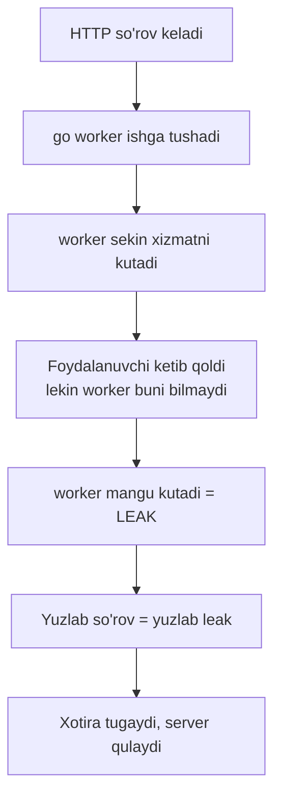
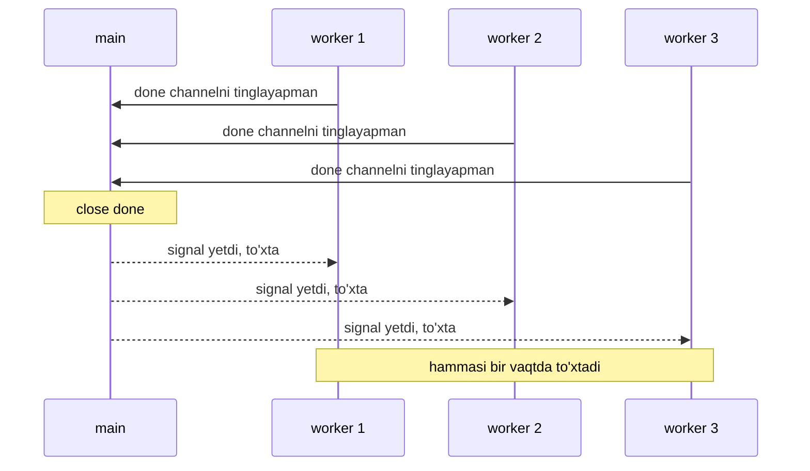
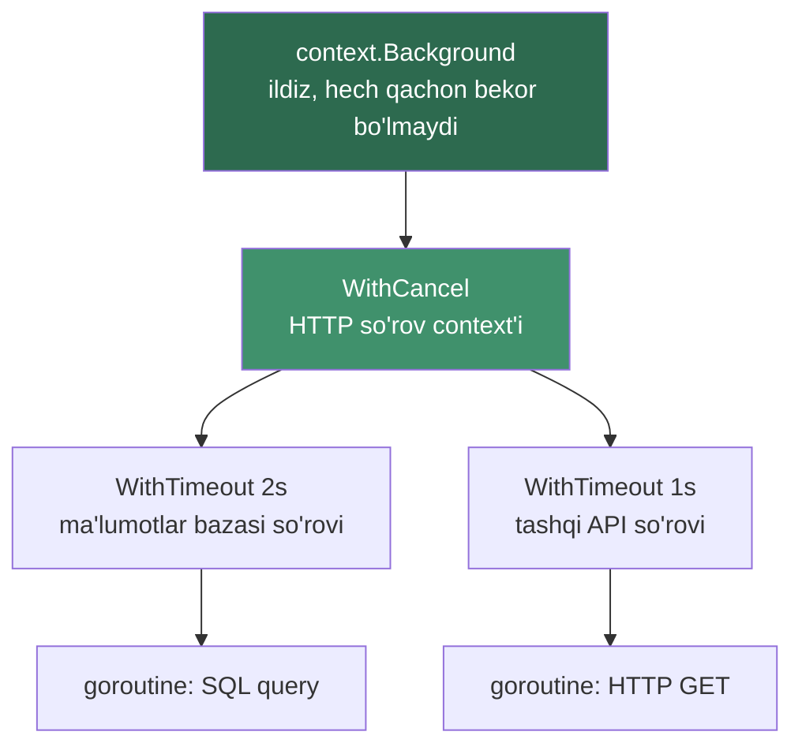
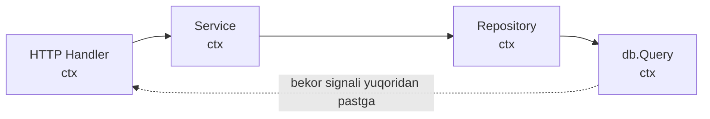

# 07 — Cancellation pattern: done channel va context

> "Boshlagan ishni to'xtata olish — uni boshlashdan ham muhimroq."

## Nimani o'rganasiz

Bu darsda siz **goroutine**'larni tashqaridan xavfsiz to'xtatishni o'rganasiz:

- **goroutine leak** nima va nega u tizimingizni sekin o'ldiradi;
- **done channel** pattern — `done <-chan struct{}` va `select` bilan bekor qilish;
- nega **close** qilingan channel butun bir jamoaga "to'xtang!" signalini bir vaqtda yetkazadi;
- **context.Context** — Go jamoasining standart, sanoat darajasidagi yechimi;
- `context.WithCancel`, `context.WithTimeout`, `context.WithDeadline` orasidagi farq;
- `ctx.Done()` va `ctx.Err()` qanday ishlaydi;
- context'ni **pipeline** bo'ylab uzatish va uni **birinchi parametr** qilish konventsiyasi.

Oxirida biz **timeout bilan bekor qilinadigan qidiruv** yozamiz — sekin javob bergan xizmatni kutib qolmaydigan real kod.

---

## Analogiya: buyruqlar zanjiri bo'ylab "to'xtang!" signali

Tasavvur qiling: siz operatsiya komandirisiz. Siz bosh ofitserga buyruq berdingiz, u o'z navbatida uch guruh askariga vazifa taqsimladi, har guruh yana razvedkachilarga tarqaldi.

To'satdan operatsiya bekor qilindi. Endi nima qilasiz? Har bir askarni alohida qidirib topib "to'xta" deysizmi? Yo'q. Siz bitta buyruq berasiz — u **butun zanjir bo'ylab pastga tarqaladi**. Bosh ofitser eshitadi, guruhlarga uzatadi, guruhlar razvedkachilarga yetkazadi.

Aynan shu — `context`. Bitta `cancel()` chaqiruvi, va u yaratgan barcha "quyi buyruqlar" bir vaqtda "to'xtang" signalini oladi.

> **Analogiya chegarasi:** context hech kimni majburan o'ldirmaydi. U faqat "to'xtash vaqti keldi" deb *e'lon qiladi*. Askar (goroutine) bu signalni **o'zi tinglashi** va ixtiyoriy ravishda to'xtashi kerak. Signalni e'tiborsiz qoldirsangiz — goroutine ishlashda davom etaveradi.

---

## Muammo: goroutine leak

Har bir `go f()` chaqiruvi yangi goroutine tug'diradi. Odatda goroutine funksiyasi tugagach o'zi yo'qoladi. Ammo goroutine **hech qachon tugamaydigan holatga tushib qolsa**, u xotirada abadiy osilib qoladi. Buni **goroutine leak** deyiladi.

Quyidagi kodni ko'ring — bu klassik tuzoq:

```go
// YOMON: bu goroutine hech qachon tugamaydi
func leak() {
	ch := make(chan int) // buffersiz channel

	go func() {
		val := <-ch // MANGU kutadi: hech kim yozmaydi
		fmt.Println(val)
	}()

	// leak() qaytib ketdi, lekin ichkaridagi goroutine hali ham <-ch da osilib turibdi
}
```

Ichdagi goroutine `<-ch` da to'xtab qoldi. `leak()` funksiyasi qaytib ketdi, `ch`'ga endi hech kim yozmaydi. Goroutine **abadiy** kutadi.

Nega bu xavfli? Har bir osilib qolgan goroutine quyidagilarni band qiladi:

| Resurs | Nima band bo'ladi |
|--------|-------------------|
| **Stack xotira** | Har goroutine kamida ~2 KB stack oladi, o'sib boradi |
| **Fayl deskriptorlari** | Ochiq TCP connection yoki fayl yopilmay qoladi |
| **GC bosimi** | Garbage collector osilgan obyektlarni tozalay olmaydi |

Bitta leak sezilmaydi. Ammo sekundiga yuzlab so'rov keladigan serverda leak'lar **to'planadi** — bir necha soatdan keyin xotira tugaydi va server "qulaydi".



---

## Yechim 1: done channel pattern

Birinchi yechim — goroutine'ga "to'xta" deyish uchun maxsus channel berish. Bu **done channel** deb ataladi.

G'oya oddiy: goroutine har bir aylanishida ikki narsani bir vaqtda tinglaydi — ishning o'zini VA "to'xta" signalini. Buning uchun `select` ishlatiladi.

```go
func worker(done <-chan struct{}, out chan<- int) {
	for i := 0; ; i++ {
		select {
		case <-done: // "to'xta" signali keldi
			fmt.Println("worker to'xtadi")
			return
		case out <- i: // ishni davom ettiramiz
		}
	}
}
```

Bu yerda ikkita muhim tafsilot bor:

1. **`chan struct{}`** — biz channel orqali hech qanday *ma'lumot* yubormaymiz, faqat *signal*. `struct{}` bo'sh tuzilma, u xotirada 0 bayt egallaydi. "Menga qiymat kerak emas, faqat hodisa fakti kerak" degani.
2. **`<-chan struct{}`** — bu **faqat o'qish uchun** channel. Worker undan faqat o'qiy oladi, yoza olmaydi. Tip darajasida xatoni oldini oladi.

### Nega close qilingan channel broadcast bo'ladi

Mana eng chiroyli qismi. Signalni yuborish uchun biz `done`'ga qiymat **yozmaymiz** — biz uni **yopamiz** (`close(done)`).

Nega? Yopilgan channeldan o'qish qoidasi shunday:

> Yopilgan channeldan o'qish **darhol** va **cheksiz marta** qaytadi (nol qiymat bilan). Bloklanmaydi.

Demak, agar 100 ta goroutine `<-done`'ni tinglab tursa va siz `close(done)` qilsangiz — **hammasi bir vaqtda** signalni oladi. Bu bitta yozuv bilan yuzlab tinglovchini xabardor qilish, ya'ni **broadcast**.

Agar qiymat yuborsangiz (`done <- struct{}{}`), faqat **bitta** goroutine uni ushlab qolardi. Close esa — hammaga.



---

## Yechim 2: context.Context — standart yo'l

`done channel` yaxshi, lekin qo'lda yozish charchatadi: har funksiyaga alohida channel uzatish, timeout qo'shsangiz taymerni o'zingiz boshqarish kerak. Go jamoasi buni standartlashtirdi — **`context.Context`**.

`context` — bu done channel pattern'ining "batareyalar bilan to'liq" versiyasi. U ichida allaqachon:

- bekor qilish signali (`Done()` — bu aslida done channel);
- bekor qilish sababi (`Err()`);
- timeout va deadline'ni avtomatik boshqarish;
- context'larni **daraxt** ko'rinishida bir-biriga ulash imkoni.

### Uch xil context yaratish

| Funksiya | Qachon bekor bo'ladi | Real misol |
|----------|----------------------|-----------|
| `context.WithCancel(parent)` | Siz `cancel()`'ni chaqirganingizda | Foydalanuvchi "Bekor qilish" tugmasini bosdi |
| `context.WithTimeout(parent, 3*time.Second)` | 3 sekunddan keyin (yoki cancel) | API 3 sekundda javob bermasa tashlab ketamiz |
| `context.WithDeadline(parent, time.Date(...))` | Aniq vaqt kelganda (yoki cancel) | "Soat 18:00 gacha tugat" |

Uchalasi ham ikkita narsa qaytaradi: yangi **`ctx`** va **`cancel`** funksiya. `cancel`'ni chaqirsangiz — shu context va uning barcha "bolalari" bekor bo'ladi.

### Context daraxti

Har bir yangi context ota-context'dan tarqaladi. Ota bekor bo'lsa — barcha bolalar ham bekor bo'ladi. Bu aynan buyruqlar zanjiri.



Yuqoridagi rasmda: agar `B` bekor bo'lsa (masalan foydalanuvchi ulanishni uzdi), `C`, `D`, `E`, `F` — hammasi bir zumda "to'xta" signalini oladi. Bu context'ning kuchi.

### ctx.Done() va ctx.Err()

- **`ctx.Done()`** — `<-chan struct{}` qaytaradi. Context bekor bo'lganda bu channel **yopiladi** (aynan done channel pattern!). `select` ichida tinglaysiz.
- **`ctx.Err()`** — nega bekor bo'ldi degan savolga javob beradi:
  - `context.Canceled` — kimdir `cancel()`'ni chaqirdi;
  - `context.DeadlineExceeded` — vaqt tugadi (timeout/deadline).

---

## To'liq kod: timeout bilan bekor qilinadigan qidiruv

Endi hamma narsani birlashtiramiz. Biz "sekin" bir qidiruv xizmatini simulyatsiya qilamiz va unga faqat 100 millisekund vaqt beramiz. Agar ulgurmasa — bekor qilamiz.

### Bashorat qiling

> 🤔 **Bashorat qiling:** Quyidagi kod nima chiqaradi? `search` funksiyasi 300ms ishlaydi, lekin context'ga faqat 100ms berilgan. Natija nima bo'ladi — qidiruv natijasimi yoki xatomi?

```go
package main

import (
	"context"
	"fmt"
	"time"
)

// search sekin qidiruvni simulyatsiya qiladi.
// U ham ishni bajaradi, ham context bekor bo'lishini tinglaydi.
func search(ctx context.Context, query string) (string, error) {
	// --- 1-qadam: og'ir ishni alohida goroutine'da boshlaymiz ---
	result := make(chan string, 1)
	go func() {
		time.Sleep(300 * time.Millisecond) // 300ms qidiryapmiz
		result <- "natija: " + query
	}()

	// --- 2-qadam: ish tugashini VA bekor qilishni bir vaqtda kutamiz ---
	select {
	case r := <-result:
		return r, nil // ish ulgurdi
	case <-ctx.Done():
		return "", ctx.Err() // vaqt tugadi yoki bekor qilindi
	}
}

func main() {
	// --- 3-qadam: 100ms lik timeout bilan context yaratamiz ---
	ctx, cancel := context.WithTimeout(context.Background(), 100*time.Millisecond)
	defer cancel() // resursni bo'shatishni KAFOLATLAYMIZ

	res, err := search(ctx, "golang")
	if err != nil {
		fmt.Println("xato:", err)
		return
	}
	fmt.Println(res)
}
```

<details>
<summary>💡 Javobni ochish</summary>

Chiqadi:

```
xato: context deadline exceeded
```

**Nega?** `search` ishi 300ms davom etadi, lekin context'ga faqat 100ms berilgan. 100ms o'tgach `ctx.Done()` channel'i yopiladi, `select` ichidagi `case <-ctx.Done()` ishga tushadi va biz `ctx.Err()`'ni qaytaramiz — u `context.DeadlineExceeded` ya'ni `"context deadline exceeded"`.

Muhim nuqta: qidiruv goroutine'i hali ham fon( background)da 300ms ishlashda davom etadi (biz uni majburan o'ldira olmaymiz), lekin `result` channel'i **buffered** (`make(chan string, 1)`) bo'lgani uchun u yozib qo'yadi va o'zi tugaydi — **leak bo'lmaydi**. Agar buffersiz bo'lganida, hech kim o'qimagani uchun goroutine `result <- ...` da mangu osilib qolar edi (leak!).

Agar timeout'ni `500 * time.Millisecond` qilsangiz, chiqadi:

```
natija: golang
```
</details>

### Muhim qatorlarni tushuntiramiz

- **`result := make(chan string, 1)`** — buffer hajmi 1. Bu tafsil hayotiy: hatto biz natijani kutmay ketsak ham, goroutine channelga yozib qo'ya oladi va tinch tugaydi. Bufferni olib tashlasangiz — potentsial leak.
- **`select { case <-result ... case <-ctx.Done() }`** — ikki voqeadan qaysi biri oldin sodir bo'lsa, o'sha g'olib. Bu done channel pattern'ning aynan o'zi, faqat `done` o'rniga `ctx.Done()`.
- **`defer cancel()`** — bu qator MAJBURIY. `WithTimeout` ichida taymer ishlaydi; `cancel()` uni tozalaydi. Chaqirmasangiz — taymer resurs oqib ketadi (buni pastda batafsil ko'ramiz).
- **`ctx.Err()`** — bekor sababini aniq aytadi. Log yozishda bebaho.

### Context'ni pipeline bo'ylab uzatish

`search`'ni chaqirganda biz `ctx`'ni **birinchi argument** qilib berdik. Bu tasodif emas — bu Go konventsiyasi:

> Context har doim funksiyaning **birinchi parametri** bo'ladi va odatda `ctx` deb nomlanadi.

Bu shuning uchun: context "buyruq zanjiri bo'ylab" pastga uzatilishi kerak. `handler(ctx) → service(ctx) → repository(ctx) → db.Query(ctx)`. Zanjirning istalgan bo'g'inida bekor qilish signali kelsa, u chuqurgacha yetib boradi.



---

## Keng tarqalgan xatolar

### Xato 1: cancel funksiyani chaqirmaslik

```go
// YOMON: cancel chaqirilmagan
ctx, cancel := context.WithTimeout(context.Background(), time.Second)
_ = cancel
res, _ := doWork(ctx)
// cancel() hech qachon chaqirilmadi -> taymer va context resursi oqadi
```

`WithTimeout` va `WithCancel` ichki taymer va goroutine yaratadi. `cancel()` ularni tozalaydi. Chaqirmasangiz, ish erta tugagan bo'lsa ham taymer deadline'gacha xotirada osilib turadi — bu **context leak**.

```go
// TO'G'RI: har doim defer bilan
ctx, cancel := context.WithTimeout(context.Background(), time.Second)
defer cancel() // ish qanday tugashidan qat'i nazar tozalaymiz
res, _ := doWork(ctx)
```

`go vet` linter bu xatoni topib beradi. Qoida: `WithCancel`/`WithTimeout`/`WithDeadline`'dan keyingi qatorda darhol `defer cancel()`.

### Xato 2: context'ni struct ichida saqlash

```go
// YOMON: context struct maydonida
type Server struct {
	ctx context.Context // buni qilmang
	db  *sql.DB
}
```

Context — bu **oqim**, u har bir so'rov bilan birga yashaydi va o'ladi. Uni struct'da "muzlatib" qo'ysangiz, u eskiradi va noto'g'ri so'rovga tegishli bo'lib qoladi. Buning o'rniga context'ni har bir metodga **parametr** sifatida uzating:

```go
// TO'G'RI: context — metod parametri
type Server struct {
	db *sql.DB
}

func (s *Server) Handle(ctx context.Context, req Request) error {
	return s.db.QueryContext(ctx, "...")
}
```

Yagona istisno — Go hujjatlarida aytilgan ba'zi maxsus hollar, lekin qoida sifatida: **context struct'da emas, parametrda**.

### Xato 3: klassik goroutine leak (done'ni unutish)

```go
// YOMON: goroutine to'xtash yo'lini bilmaydi
func stream() <-chan int {
	out := make(chan int)
	go func() {
		for i := 0; ; i++ {
			out <- i // agar o'quvchi ketib qolsa, bu yerda mangu osiladi
		}
	}()
	return out
}
```

O'quvchi birinchi bir nechta qiymatni olib, keyin `out`'dan o'qishni to'xtatsa, goroutine `out <- i` da mangu osilib qoladi — **leak**. To'g'risi — context bilan chiqish yo'lini berish:

```go
// TO'G'RI: context bilan chiqish yo'li bor
func stream(ctx context.Context) <-chan int {
	out := make(chan int)
	go func() {
		defer close(out)
		for i := 0; ; i++ {
			select {
			case out <- i:
			case <-ctx.Done(): // o'quvchi bekor qilsa, chiqamiz
				return
			}
		}
	}()
	return out
}
```

---

## Qachon ishlatiladi, qachon kerak emas

**Context ishlating:**

- **HTTP/gRPC server** — har `http.Request` allaqachon `r.Context()` bilan keladi; foydalanuvchi ulanishni uzsa, u avtomatik bekor bo'ladi.
- **Ma'lumotlar bazasi so'rovlari** — `db.QueryContext(ctx, ...)` sekin so'rovni timeout bilan uzadi.
- **Tashqi API chaqiruvlari** — `http.NewRequestWithContext(ctx, ...)` bilan sekin xizmatni kutib qolmaysiz.
- **Uzoq pipeline'lar** — bir bosqich xato bersa, butun quvurni bekor qilish.

**Context kerak emas:**

- **Qisqa, sof hisoblash** — masalan `2+2` yoki kichik massivni saralash. Bekor qilinadigan hech narsa yo'q.
- **Ma'lumot uzatish uchun** — context faqat *bekor qilish signali* va so'rov-scoped metadata uchun. Undan oddiy funksiya argumentlarini ("user ID", "config") uzatish uchun foydalanmang. Buning uchun oddiy parametrlar bor.

> **Oltin qoida:** Har qanday I/O yoki uzoq davom etishi mumkin bo'lgan operatsiya `context.Context` qabul qilishi shart. Bu — foydalanuvchiga "men to'xtay olaman" deb va'da berish.

---

## O'zingizni tekshiring

<details>
<summary>1. Nega done channel'ga qiymat yuborishdan ko'ra uni <b>close</b> qilish afzal?</summary>

Chunki close qilingan channeldan o'qish **cheksiz marta va darhol** qaytadi. Shu tufayli bitta `close(done)` chaqiruvi barcha tinglovchi goroutine'larga bir vaqtda signal yetkazadi — bu **broadcast**. Qiymat yuborsangiz, faqat bitta goroutine uni ushlab qolardi, qolganlari osilib qolardi.
</details>

<details>
<summary>2. `context.WithTimeout` va `context.WithDeadline` orasidagi farq nima?</summary>

`WithTimeout(parent, 5*time.Second)` — **hozirdan boshlab qancha vaqt** (masalan 5 sekund). `WithDeadline(parent, t)` — **aniq qaysi vaqt nuqtasida** (masalan bugun soat 18:00:00). Aslida `WithTimeout` ichki jihatdan `WithDeadline(parent, time.Now().Add(timeout))` orqali amalga oshiriladi — u faqat qulay o'ram.
</details>

<details>
<summary>3. `defer cancel()` yozishni unutsangiz nima yomon bo'ladi?</summary>

`WithTimeout`/`WithCancel` ichida taymer va resurslar yaratiladi. `cancel()` ularni tozalaydi. Unutsangiz, ish erta tugasa ham context deadline'gacha xotirada osilib turadi — bu **context leak** (taymer va goroutine oqishi). `go vet` bu xatoni ogohlantirish sifatida ko'rsatadi.
</details>

<details>
<summary>4. Timeout tugagach `ctx.Err()` nima qaytaradi? Kimdir `cancel()` chaqirsa-chi?</summary>

Timeout yoki deadline tugasa — `context.DeadlineExceeded` (`"context deadline exceeded"`). Kimdir qo'lda `cancel()` chaqirsa — `context.Canceled` (`"context canceled"`). Context hali bekor bo'lmagan bo'lsa `ctx.Err()` `nil` qaytaradi.
</details>

<details>
<summary>5. Darsdagi `search` misolida `result` channel'i nega buffered (`make(chan string, 1)`)?</summary>

Chunki timeout ishga tushsa, `search` funksiyasi qaytib ketadi va `result`'dan endi hech kim o'qimaydi. Agar channel **buffersiz** bo'lsa, ichki goroutine `result <- ...` da mangu osilib qolar edi — **goroutine leak**. Buffer hajmi 1 bo'lsa, goroutine qiymatni bufferga yozib, tinch tugaydi. Bu leak'ni oldini oladigan muhim naqsh.
</details>

---

⬅️ [Oldingi dars: Semaphore](06-semaphore.md) | [Keyingi dars: Rate Limiting](08-rate-limiting.md) ➡️
