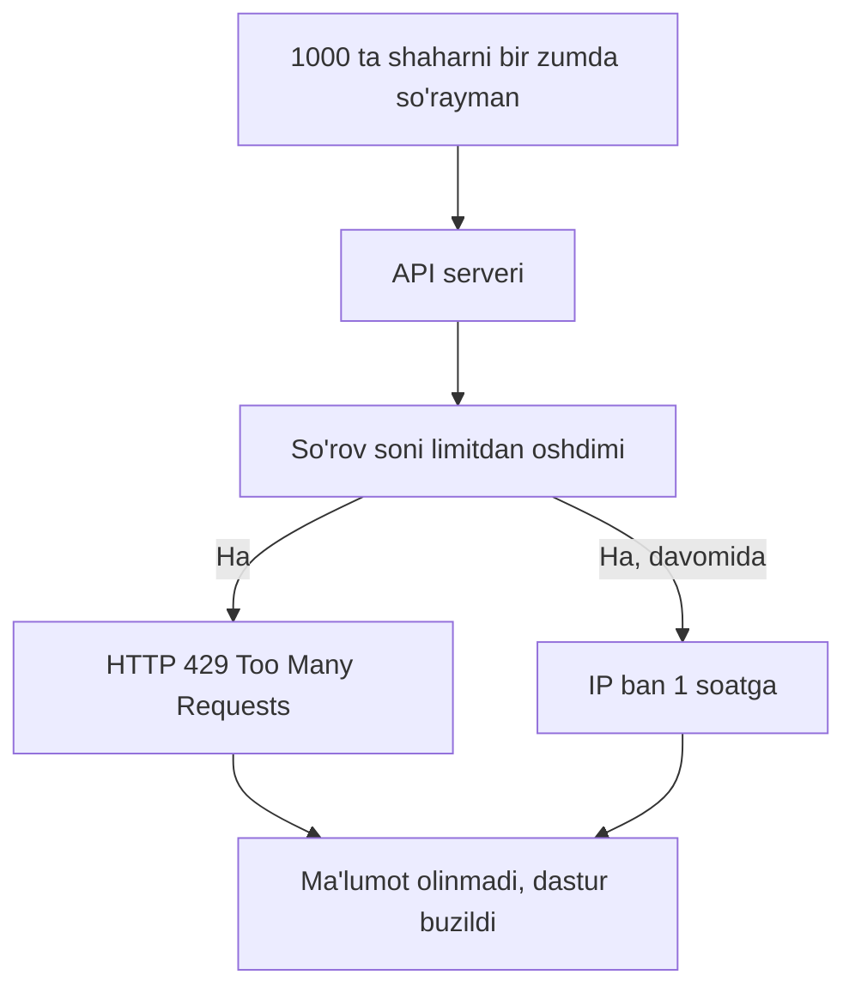
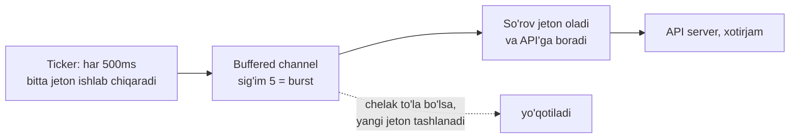

# 08 — Rate Limiting pattern

> "Tezlik yaxshi, lekin nazoratsiz tezlik — falokat."

## Nimani o'rganasiz

Bu darsda siz kod ishlash **tezligini jilovlashni** o'rganasiz:

- nega tashqi API'lar sizga cheksiz so'rov yuborishga ruxsat bermaydi (**rate limit** muammosi);
- `time.Tick` va `time.NewTicker` bilan eng oddiy **rate limiter** yozish;
- **token bucket** algoritmi g'oyasi — buffered channel bilan qisqa muddatli **burst**'ga ruxsat berish;
- sanoat standarti `golang.org/x/time/rate` paketi: `rate.Limiter`, `Wait`, `Allow`;
- **throttling** va **rate limiting** orasidagi farq.

Oxirida biz **sekundiga faqat 2 ta so'rov** yuboradigan API mijozini yozamiz.

---

## Analogiya: avtomagistraldagi tezlik chegarasi

Tasavvur qiling — magistralda "90 km/soat" belgisi turibdi. Bu belgi nima uchun? Chunki yo'l cheksiz mashinani cheksiz tezlikda ko'tara olmaydi — aks holda avariyalar, tirbandlik, halokat.

**Rate limiting** — dasturdagi aynan shu tezlik belgisi. U aytadi: "sekundiga ko'pi bilan N marta". Ortiqchasi kutadi yoki rad etiladi.

Endi metro turniketini tasavvur qiling. Turniket **jetonlar** bilan ishlaydi. Har o'tishda bitta jeton sarflaysiz. Jetonlar ma'lum tezlikda quticha ga tushib turadi — masalan har 0.5 sekundda bitta. Quti bo'sh bo'lsa — kutasiz. Lekin quti to'lgan bo'lsa (siz bir muddat o'tmagansiz), bir necha kishi **ketma-ket tez** o'tib ketishi mumkin. Bu — **token bucket**.

> **Analogiya chegarasi:** magistral belgisi haydovchini *jazolaydi* (jarima), token bucket esa hech kimni jazolamaydi — u shunchaki jeton kelguncha *kuttiradi*. Rate limiting — jazo emas, oqimni tekislash mexanizmi.

---

## Muammo: tashqi API sizni "banlaydi"

Siz ob-havo API'siga ulanib, 1000 ta shahar uchun ma'lumot olmoqchisiz. Sodda yechim:

```go
// YOMON: nazoratsiz portlash
for _, city := range cities { // 1000 ta shahar
	go fetchWeather(city) // 1000 ta so'rov bir zumda!
}
```

Bir zumda 1000 ta so'rov jo'natildi. Natijada:

| Oqibat | Nima bo'ladi |
|--------|--------------|
| **HTTP 429** | API "Too Many Requests" deb rad etadi |
| **IP ban** | API sizning IP'ingizni vaqtincha bloklaydi |
| **Pul jarimasi** | Pullik API'da har so'rov limitdan oshsa qo'shimcha to'lov |
| **Server qulashi** | Zaif API serveri yukni ko'tarolmay yiqiladi |

Deyarli barcha jiddiy API'lar limit qo'yadi: "sekundiga 10 ta", "daqiqada 100 ta". Ular buni javob sarlavhalarida ham aytadi: `X-RateLimit-Limit: 10`. Sizning vazifangiz — bu chegaradan oshmaslik.



---

## Yechim 1: time.Tick bilan eng oddiy limiter

Go'da vaqtni bo'laklarga bo'lish uchun **ticker** bor. `time.Tick(d)` — bu channel qaytaradi, unga **har `d` vaqtda** bittadan qiymat tushib turadi. Xuddi metronom kabi.

G'oya: har so'rovdan **oldin** ticker channelidan bitta "belgi" o'qib olamiz. Belgi hali kelmagan bo'lsa — kutamiz. Shunday qilib so'rovlar bir tekis oraliqda chiqadi.

```go
// sekundiga 2 ta -> har 500ms da bitta belgi
limiter := time.Tick(500 * time.Millisecond)

for _, city := range cities {
	<-limiter          // navbatdagi belgini kutamiz
	go fetchWeather(city) // endi so'rov yuborsak bo'ladi
}
```

- **`time.Tick(500 * time.Millisecond)`** — har 500ms da channelga bitta qiymat kelib turadi. Sekundiga 2 ta belgi = sekundiga 2 ta so'rov.
- **`<-limiter`** — bu qator "kalit". U belgi kelguncha bloklanadi. Belgi juda tez-tez so'ralmaydi, shuning uchun so'rovlar tekislanadi.

> ⚠️ **Diqqat:** `time.Tick` ishlatgan ticker **hech qachon to'xtamaydi** va uni to'xtatib bo'lmaydi — u dastur oxirigacha ishlaydi. Qisqa skriptlar uchun mayli, lekin uzoq ishlaydigan serverda `time.NewTicker` ishlatib, `defer ticker.Stop()` bilan tozalang. Aks holda — resurs oqishi.

```go
// Server uchun to'g'ri usul: to'xtatib bo'ladigan ticker
ticker := time.NewTicker(500 * time.Millisecond)
defer ticker.Stop() // resursni bo'shatamiz

for _, city := range cities {
	<-ticker.C // ticker.C — bu channel
	go fetchWeather(city)
}
```

---

## Yechim 2: token bucket va burst

Oddiy ticker'ning bir kamchiligi bor: u **mutlaqo qat'iy**. Agar 10 sekund hech narsa so'ramay tursangiz, keyin "jamg'arilgan" imkoniyatdan foydalanib bir nechta so'rovni ketma-ket yubora olmaysiz. Real hayotda esa qisqa **burst** (portlash) ko'pincha maqbul.

**Token bucket** aynan shuni yechadi. Tasavvur qiling — bir chelak (bucket) jetonlar bilan. Ikki qoida:

1. Jetonlar chelakka **doimiy tezlikda** tushadi (masalan sekundiga 2 ta).
2. Chelak **sig'imi cheklangan** (masalan 5 ta). To'lgach, yangi jetonlar sig'maydi.

Har so'rov bitta jeton yeydi. Chelak to'la bo'lsa (siz bir muddat so'ramagansiz) — 5 tagacha so'rovni **birdaniga** yubora olasiz. Bu burst. Keyin yana sekin tezlikka qaytasiz.

Go'da buni **buffered channel** bilan yasash mumkin — buffer hajmi = burst sig'imi:



Diagramma tili bilan: ticker jeton ishlab chiqaradi, ular chelakka (channelga) tushadi. Chelak to'lsa — ortiqcha jeton yo'qoladi. So'rov chelakdan jeton olganida yo'lga chiqadi. Bu bizga ham o'rtacha tezlikni, ham qisqa burst'ni beradi.

---

## Yechim 3: golang.org/x/time/rate — sanoat standarti

Yaxshi yangilik: yuqoridagilarni qo'lda yozish shart emas. Go jamoasining rasmiy `golang.org/x/time/rate` paketi token bucket'ni to'liq, sinovdan o'tgan holda beradi.

Asosiy tur — **`rate.Limiter`**. Uni ikki parametr bilan yaratasiz:

```go
// har sekundda 2 ta jeton, chelak sig'imi (burst) 5
limiter := rate.NewLimiter(rate.Limit(2), 5)
```

- **`rate.Limit(2)`** — jeton kelish tezligi: sekundiga 2 ta.
- **`5`** — burst sig'imi: bir vaqtda ko'pi bilan 5 ta so'rov "portlab" o'tishi mumkin.

`rate.Limiter`'ning uch asosiy metodi bor:

| Metod | Xatti-harakati | Qachon |
|-------|----------------|--------|
| `limiter.Wait(ctx)` | Jeton kelguncha **kutadi** (bloklaydi) | Har so'rov muhim, hech birini tashlab bo'lmaydi |
| `limiter.Allow()` | Jeton bo'lsa `true`, bo'lmasa darhol `false` | Ortiqcha so'rovni **tashlab yuborsak** bo'ladi |
| `limiter.Reserve()` | Qancha kutish kerakligini oldindan aytadi | Nozik boshqaruv kerak bo'lganda |

`Wait` va `Allow` orasidagi tanlov — bu **kutish** yoki **rad etish** falsafasi:

- **`Wait`** — "hamma so'rov bajarilsin, faqat sekinroq". Fon vazifalari uchun ideal.
- **`Allow`** — "hozir imkon bo'lsa qil, bo'lmasa keyin urinib ko'r". Foydalanuvchi kutib turmaydigan real-time tizimlar uchun.

---

## To'liq kod: sekundiga 2 ta so'rov

Endi `rate.Limiter` bilan API mijozini yozamiz. Biz 6 ta "so'rov" yuboramiz, lekin sekundiga faqat 2 tadan o'tishiga ruxsat beramiz.

### Bashorat qiling

> 🤔 **Bashorat qiling:** Quyidagi kod 6 ta so'rovni yuboradi, limiter sekundiga 2 ta (burst 1). Har so'rov yonida vaqt chop etiladi. So'rovlar orasidagi vaqt oralig'i taxminan qancha bo'ladi?

```go
package main

import (
	"context"
	"fmt"
	"time"

	"golang.org/x/time/rate"
)

func main() {
	// --- 1-qadam: sekundiga 2 ta, burst 1 lik limiter ---
	limiter := rate.NewLimiter(rate.Limit(2), 1)

	ctx := context.Background()
	start := time.Now()

	// --- 2-qadam: 6 ta so'rovni ketma-ket yuboramiz ---
	for i := 1; i <= 6; i++ {
		// jeton kelguncha kutamiz
		if err := limiter.Wait(ctx); err != nil {
			fmt.Println("xato:", err)
			return
		}
		// --- 3-qadam: jeton olindi, "so'rov" jo'natamiz ---
		elapsed := time.Since(start).Milliseconds()
		fmt.Printf("so'rov %d yuborildi, o'tgan vaqt: %d ms\n", i, elapsed)
	}
}
```

<details>
<summary>💡 Javobni ochish</summary>

Taxminan quyidagicha chiqadi (millisekundlar biroz farq qilishi mumkin):

```
so'rov 1 yuborildi, o'tgan vaqt: 0 ms
so'rov 2 yuborildi, o'tgan vaqt: 500 ms
so'rov 3 yuborildi, o'tgan vaqt: 1000 ms
so'rov 4 yuborildi, o'tgan vaqt: 1500 ms
so'rov 5 yuborildi, o'tgan vaqt: 2000 ms
so'rov 6 yuborildi, o'tgan vaqt: 2500 ms
```

**Nega?** Sekundiga 2 ta jeton = har **500ms** da bitta jeton. Burst 1 bo'lgani uchun oldindan jamg'arma yo'q — birinchi so'rov darhol (0ms) o'tadi (chelak dastlab to'la), keyingilari har 500ms da. 6 ta so'rov taxminan 2.5 sekundga cho'ziladi. So'rovlar bir tekis oraliqda — bu aynan rate limiting ishlayotganini bildiradi.

Agar `burst`ni 3 qilsangiz, birinchi **3 ta** so'rov deyarli bir zumda (0ms atrofida) portlab o'tadi, keyin qolganlari 500ms oraliq bilan — bu burst effekti.
</details>

### Muhim qatorlarni tushuntiramiz

- **`rate.NewLimiter(rate.Limit(2), 1)`** — sekundiga 2 ta, burst 1. `rate.Limit` — bu `float64` ustidagi tur, "sekundiga nechta hodisa" degani. Daqiqada 30 ta kerak bo'lsa: `rate.Limit(30.0/60.0)`.
- **`limiter.Wait(ctx)`** — jeton kelguncha bloklaydi. Diqqat: u **context** qabul qiladi. Agar `ctx` bekor bo'lsa (masalan timeout), `Wait` darhol xato qaytaradi va kutishni to'xtatadi. Bu bizni oldingi darsdagi `context` bilan bog'laydi.
- **`time.Since(start)`** — boshlanishdan hozirgacha o'tgan vaqt. So'rovlar oralig'ini ko'rsatish uchun.

---

## Throttling va rate limiting: farqi nima

Bu ikki atama ko'p aralashtiriladi. Ular yaqin, lekin bir xil emas.

| Xususiyat | Rate limiting | Throttling |
|-----------|---------------|-----------|
| **Asosiy g'oya** | "Vaqt birligida ko'pi bilan N marta" | "Tizim yuki oshsa, tezlikni sekinlashtir" |
| **Chegaradan oshsa** | Rad etadi (`429`) yoki kuttiradi | Sekinlashtiradi, kechiktiradi |
| **Qaror asosi** | Oldindan belgilangan qat'iy son | Tizimning joriy holati (CPU, navbat) |
| **Misol** | "API: sekundiga 10 ta" | "Server band, so'rovlarni sekinlatamiz" |

Sodda qilib:

- **Rate limiting** — qattiq devor. "10 dan ortiq — yo'q". Chegara aniq va oldindan ma'lum.
- **Throttling** — moslashuvchan tormoz. Yuk oshsa asta sekinlashtiradi, kamaysa yana tezlashtiradi. U tizim holatiga qarab o'zgaradi.

> **Oltin qoida:** Rate limiting — chegarani himoya qiladi (API kvotasi). Throttling — resursni himoya qiladi (server nafas olsin). Amaliyotda ular ko'pincha birga ishlaydi.

---

## Keng tarqalgan xatolar

### Xato 1: har so'rov uchun yangi limiter yaratish

```go
// YOMON: limiter har iteratsiyada qayta yaratiladi
for _, city := range cities {
	limiter := rate.NewLimiter(rate.Limit(2), 1) // XATO: har safar yangi!
	limiter.Wait(context.Background())
	fetchWeather(city)
}
```

Har iteratsiyada yangi limiter — bu har safar to'la chelak. Cheklash umuman ishlamaydi, hamma so'rov darhol o'tadi. Limiter **bir marta**, sikldan tashqarida yaratilishi kerak:

```go
// TO'G'RI: bitta umumiy limiter
limiter := rate.NewLimiter(rate.Limit(2), 1)
for _, city := range cities {
	limiter.Wait(context.Background())
	fetchWeather(city)
}
```

### Xato 2: time.Tick'ni to'xtatmaslik (ticker leak)

```go
// YOMON: uzoq ishlaydigan serverda
func handleForever() {
	for {
		<-time.Tick(time.Second) // har chaqiruvda YANGI ticker, hech biri to'xtamaydi
		doWork()
	}
}
```

`time.Tick` sikl ichida chaqirilsa, har aylanishda **yangi** ticker tug'iladi va hech qachon to'xtamaydi — bu resurs oqishi. Bittasini tashqarida yarating yoki `NewTicker` + `Stop` ishlating:

```go
// TO'G'RI
func handleForever() {
	ticker := time.NewTicker(time.Second)
	defer ticker.Stop()
	for range ticker.C {
		doWork()
	}
}
```

### Xato 3: Allow'ni kutish deb o'ylash

```go
// YOMON tushuncha: Allow bloklaydi deb o'ylash
for _, city := range cities {
	limiter.Allow() // XATO: natijasi e'tiborsiz qoldirildi
	fetchWeather(city) // hamma so'rov baribir ketaveradi!
}
```

`Allow()` **bloklamaydi** — u shunchaki `true`/`false` qaytaradi va uni **tekshirish** kerak. Aks holda hech narsa cheklanmaydi. To'g'ri ishlatish:

```go
// TO'G'RI: natijani tekshiramiz
for _, city := range cities {
	if limiter.Allow() {
		fetchWeather(city) // jeton bor edi
	} else {
		fmt.Println("chegara oshdi, so'rov tashlab yuborildi:", city)
	}
}
```

---

## Qachon ishlatiladi, qachon kerak emas

**Rate limiting ishlating:**

- **Tashqi API mijozi** — pullik yoki limitli API'ga so'rov yuborayotganda (to'lov shlyuzi, xaritalar, ob-havo).
- **O'z API'ingizni himoyalash** — har foydalanuvchiga "sekundiga 100 ta" qo'yib, suiiste'moldan himoya (`X-RateLimit` sarlavhalari).
- **Ma'lumotlar bazasi/resursni asrash** — fon vazifasi bazani zo'riqtirmasligi uchun yozish tezligini cheklash.
- **Web scraping** — sayt sizni bloklamasligi uchun so'rovlar oralig'ini tekislash.

**Rate limiting kerak emas:**

- **Mahalliy, tez hisoblash** — xotiradagi ma'lumot ustida ishlaganda cheklashning ma'nosi yo'q, faqat sekinlashtiradi.
- **Bir martalik operatsiya** — bitta so'rov yuborsangiz, limiter ortiqcha murakkablik.
- **Chegara allaqachon boshqa joyda** — agar load balancer yoki API gateway rate limiting qilayotgan bo'lsa, kodda takrorlash shart emas.

---

## O'zingizni tekshiring

<details>
<summary>1. `rate.NewLimiter(rate.Limit(2), 5)` da 2 va 5 raqamlari nimani bildiradi?</summary>

`2` — jeton kelish **tezligi**: sekundiga 2 ta jeton (ya'ni har 500ms da bitta). `5` — **burst** sig'imi: chelakka ko'pi bilan 5 ta jeton yig'ilishi mumkin, demak bir muddat kutgandan keyin 5 ta so'rovni birdaniga "portlatib" yuborsa bo'ladi. Tezlik o'rtacha oqimni, burst esa qisqa muddatli portlashni boshqaradi.
</details>

<details>
<summary>2. `Wait` va `Allow` orasidagi asosiy farq nima?</summary>

`Wait(ctx)` jeton kelguncha **bloklaydi** (kutadi) — hech qanday so'rov tashlab yuborilmaydi, faqat sekinlashadi. `Allow()` esa **bloklamaydi** — jeton bor bo'lsa darhol `true`, yo'q bo'lsa darhol `false` qaytaradi. Ortiqcha so'rovni tashlab yuborsak bo'ladigan holatda `Allow`, har bir so'rov muhim bo'lganda `Wait` ishlatiladi.
</details>

<details>
<summary>3. Nega oddiy ticker'dan ko'ra token bucket ma'qulroq bo'lishi mumkin?</summary>

Oddiy ticker mutlaqo qat'iy — har so'rov aniq oraliqda chiqadi va "jamg'arilgan" imkoniyatdan foydalanib bo'lmaydi. Token bucket esa **burst**'ga ruxsat beradi: agar bir muddat so'rov yubormasangiz, jetonlar yig'iladi va keyin bir nechta so'rovni ketma-ket tez yuborasiz. Bu real hayotdagi notekis yukka mos, ayni paytda o'rtacha tezlikni ham saqlaydi.
</details>

<details>
<summary>4. `time.Tick`ni sikl ichida chaqirsangiz nima yomon bo'ladi?</summary>

Har aylanishda **yangi** ticker yaratiladi va u hech qachon to'xtamaydi (`time.Tick` to'xtatish imkonini bermaydi). Bu ticker'lar to'planib **resurs oqishiga** olib keladi. Uzoq ishlaydigan serverda `time.NewTicker` ishlatib, bittasini sikldan tashqarida yaratib, `defer ticker.Stop()` bilan tozalash kerak.
</details>

<details>
<summary>5. Rate limiting va throttling orasidagi farqni bir jumlada ayting.</summary>

Rate limiting — **oldindan belgilangan qat'iy chegara** ("sekundiga 10 ta, oshsa rad"), throttling esa **tizimning joriy holatiga moslashuvchan sekinlashtirish** ("server band, tezlikni pasaytir"). Rate limiting kvotani himoya qiladi, throttling resursni himoya qiladi.
</details>

---

⬅️ [Oldingi dars: Cancellation va Context](07-cancellation-context.md) | [Keyingi dars: WaitGroup va errgroup](09-waitgroup-va-errgroup.md) ➡️
