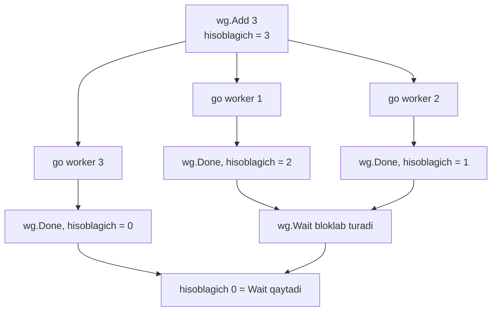
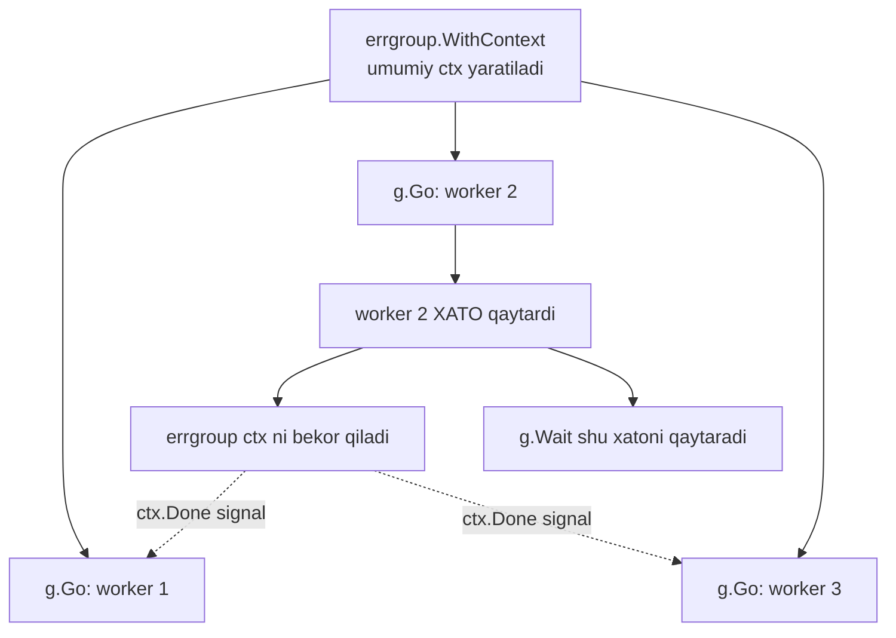
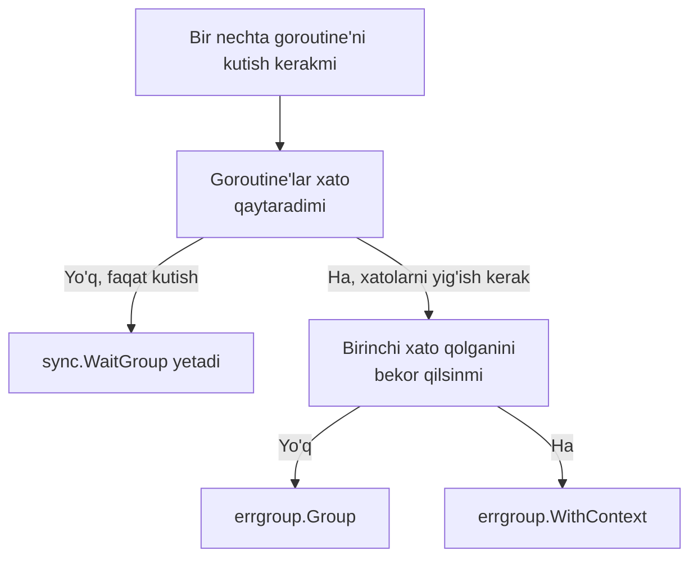

# 09 — Sinxronizatsiya patternlari: WaitGroup va errgroup

> "Hamma ishchi qaytmaguncha ketmaymiz — lekin kimdir yiqilsa, darhol hammani chaqiramiz."

## Nimani o'rganasiz

Bu darsda siz bir nechta **goroutine**'ni kutish va ular orasidan xatolarni yig'ishni o'rganasiz:

- `sync.WaitGroup` chuqurroq: `Add`, `Done`, `Wait` va ular qanday hisoblaydi;
- nega `Add`'ni **goroutine tashqarisida** chaqirish shart;
- klassik **loop variable capture** xatosi — Go 1.22 dan oldin va keyin;
- WaitGroup'ning katta kamchiligi: u **xato qaytarmaydi**;
- `golang.org/x/sync/errgroup`: `g.Go()`, `g.Wait()` va **birinchi xatoni** qaytarish;
- `errgroup.WithContext` — bitta xato butun jamoani **avtomatik bekor qiladi**;
- `g.SetLimit()` — errgroup'ni **semaphore** o'rnida ishlatish;
- qachon oddiy WaitGroup yetadi, qachon errgroup kerak.

---

## Analogiya: ekskursiya rahbari va guruh

Tasavvur qiling — siz ekskursiya rahbarisiz. 5 ta sayyohni muzeyning turli zallariga tarqatdingiz. Avtobusga qaytishdan oldin **hammasi qaytishini** kutishingiz kerak. Kimni yo'qotib qo'ymaslik uchun nima qilasiz?

Siz **sanoq** yuritasiz: "5 kishi ketdi". Har qaytgan sayyoh sizga "men keldim" deydi va siz sanoqni bittaga kamaytirasiz. Sanoq **nolga** yetganda — hammasi joyida, avtobus jo'nayveradi. Bu — **`sync.WaitGroup`**.

Endi murakkabroq holat: sayyohlardan biri zalda yiqilib tushdi. Endi shunchaki "hamma qaytsin" degani yetmaydi — sizga **darhol xabar** kerak va **qolgan hammasini chaqirib olishingiz** kerak. Bu — **`errgroup`**: u ham kutadi, ham birinchi muammoni sizga aytadi, ham "avariya bo'ldi, hamma qaytsin" signalini tarqatadi.

> **Analogiya chegarasi:** WaitGroup sayyoh nima uchun kechikkanini bilmaydi — u faqat "keldi/kelmadi" ni sanaydi. Yiqilish, yo'qolish kabi *sabab*larni bilish uchun errgroup kerak.

---

## 1-qism: sync.WaitGroup chuqurroq

`WaitGroup` — ichida oddiygina **hisoblagich** (counter) bor tuzilma. Uch metodi bor:

| Metod | Vazifasi | Analogiya |
|-------|----------|-----------|
| `wg.Add(n)` | Hisoblagichni `n`ga oshiradi | "n kishi ketmoqchi" |
| `wg.Done()` | Hisoblagichni 1 ga kamaytiradi | "men qaytdim" |
| `wg.Wait()` | Hisoblagich 0 bo'lguncha bloklaydi | "hamma qaytsin, kutaman" |

`Done()` aslida `Add(-1)`ning qisqa yozuvi. `Wait()` esa hisoblagich 0 ga tushmaguncha chaqiruvchi goroutine'ni to'xtatib turadi.



### Qoida: Add'ni goroutine TASHQARISIDA chaqiring

Bu eng muhim qoida. `Add`'ni **doim** `go` dan oldin, tashqarida chaqiring:

```go
// TO'G'RI: Add goroutine tashqarisida
var wg sync.WaitGroup
for i := 0; i < 3; i++ {
	wg.Add(1) // avval hisoblagichni oshiramiz
	go func() {
		defer wg.Done() // goroutine oxirida kamaytiramiz
		doWork()
	}()
}
wg.Wait()
```

Nega tashqarida? Agar `Add`'ni goroutine **ichida** chaqirsangiz:

```go
// YOMON: Add goroutine ichida — poyga (race)
for i := 0; i < 3; i++ {
	go func() {
		wg.Add(1) // KECH bo'lishi mumkin!
		defer wg.Done()
		doWork()
	}()
}
wg.Wait() // goroutine'lar hali Add chaqirmasidan Wait 0 ni ko'rib qaytib ketishi mumkin
```

Bu yerda `wg.Wait()` goroutine'lar `Add(1)` chaqirishidan **oldin** ishga tushishi mumkin. O'sha paytda hisoblagich hali 0, `Wait` darhol qaytadi va biz ishlar tugashini kutmasdan ketib qolamiz. Bu poyga holati (race condition) — natija oldindan aytib bo'lmas.

> **Qoida:** `Add(n)` — har doim `go` dan **oldin**. `Done()` — har doim goroutine **ichida**, `defer` bilan.

### Loop variable capture: Go 1.22 dan oldin va keyin

Bu Go'da eng mashhur tuzoqlardan biri. Quyidagi kodni ko'ring:

```go
// Go 1.21 va oldingi versiyalarda BUZUQ
var wg sync.WaitGroup
for i := 0; i < 3; i++ {
	wg.Add(1)
	go func() {
		defer wg.Done()
		fmt.Println(i) // qaysi i ni chop etadi?
	}()
}
wg.Wait()
```

Go 1.21 va undan oldingi versiyalarda **`i` sikl aylanishlari orasida bitta o'zgaruvchi** edi. Goroutine'lar kechikib ishga tushgani uchun ular allaqachon o'zgargan `i` ni ko'rar edi — ko'pincha `3 3 3` chop etilardi, `0 1 2` emas.

**Go 1.22 dan boshlab** bu tuzatildi: har sikl aylanishi `i` ning **yangi nusxasini** oladi. Endi yuqoridagi kod to'g'ri ishlaydi va `0 1 2` (tartibi aralash bo'lishi mumkin) chiqaradi.

| Versiya | `i` ning maqomi | Natija |
|---------|-----------------|--------|
| Go 1.21 va oldin | Sikl bo'yicha **bitta** o'zgaruvchi | Ko'pincha `3 3 3` — xato |
| Go 1.22 va keyin | Har aylanishda **yangi** nusxa | `0 1 2` — to'g'ri |

Go 1.21 va oldingi versiyalarda ishlaydigan eski yechim — qiymatni goroutine'ga **parametr** sifatida uzatish:

```go
// Barcha versiyalarda ishonchli ishlaydi
for i := 0; i < 3; i++ {
	wg.Add(1)
	go func(n int) { // i ning nusxasi n ga ko'chiriladi
		defer wg.Done()
		fmt.Println(n)
	}(i) // i ni argument qilib uzatamiz
}
```

> Go 1.22+ ishlatsangiz ham, parametr orqali uzatish odati zarar qilmaydi va kodni versiyaga bog'liq qilmaydi.

---

## Muammo: WaitGroup xato qaytarmaydi

WaitGroup faqat **kutadi**. U goroutine ichida nima bo'lganini — muvaffaqiyat yoki xato — bilmaydi. Xatolarni yig'moqchi bo'lsangiz, hammasini qo'lda qilishga to'g'ri keladi:

```go
// YOMON: xatolarni qo'lda yig'ishning og'riqli usuli
var wg sync.WaitGroup
var mu sync.Mutex        // errs slice'ni himoyalash uchun mutex
var errs []error

for _, url := range urls {
	wg.Add(1)
	go func(u string) {
		defer wg.Done()
		if err := fetch(u); err != nil {
			mu.Lock()           // bir vaqtda faqat bitta goroutine yozsin
			errs = append(errs, err)
			mu.Unlock()
		}
	}(url)
}
wg.Wait()
// endi errs slice'ni tekshirish kerak...
```

Muammolar ko'p:

- Xatolarni saqlash uchun alohida `slice` va uni himoyalash uchun `mutex` kerak.
- Birinchi xato bo'lganda **qolgan goroutine'larni to'xtatish** yo'li yo'q — hammasi oxirigacha ishlayveradi.
- Kod shovqinli, xatoga moyil (`mutex`ni unutsangiz — race).

Aynan shu og'riqni davolash uchun **errgroup** yaratilgan.

---

## 2-qism: errgroup — kutish + xato + bekor qilish

`golang.org/x/sync/errgroup` — bu WaitGroup ustiga qurilgan aqlliroq vosita. U uch ishni birga qiladi:

1. Barcha goroutine'larni **kutadi** (WaitGroup kabi);
2. **Birinchi xatoni** avtomatik yig'ib, sizga qaytaradi;
3. `WithContext` bilan — birinchi xato **barcha qolganini bekor qiladi**.

Asosiy tur — **`errgroup.Group`**. Ikki asosiy metodi:

- **`g.Go(func() error { ... })`** — goroutine ishga tushiradi (o'zi `Add`ni boshqaradi). Funksiya `error` qaytaradi.
- **`g.Wait()`** — hamma tugashini kutadi va **birinchi bo'lib kelgan xatoni** qaytaradi (yoki `nil`).

Yuqoridagi shovqinli kod errgroup bilan shunday soddalashadi:

```go
// TO'G'RI: errgroup bilan toza kod
var g errgroup.Group
for _, url := range urls {
	url := url // Go 1.22 dan oldin kerak edi
	g.Go(func() error {
		return fetch(url) // xatoni shunchaki qaytaramiz
	})
}
if err := g.Wait(); err != nil {
	fmt.Println("birinchi xato:", err)
}
```

Mutex yo'q, slice yo'q, qo'lda `Add`/`Done` yo'q. Xatoni shunchaki `return` qilasiz.



### errgroup.WithContext: bitta xato hammani to'xtatadi

Eng kuchli imkoniyat. `errgroup.WithContext(ctx)` sizga **`g`** va **`ctx`** qaytaradi. Endi goroutine'lardan biri xato qaytarsa — bu `ctx` **avtomatik bekor bo'ladi**. Qolgan goroutine'lar `ctx.Done()`ni tinglab, o'zlarini to'xtatadi.

Bu bizni 07-darsdagi **context** bilan to'g'ridan-to'g'ri bog'laydi: errgroup — bu context'ning cancellation'ini WaitGroup'ning kutishi bilan birlashtirgan naqsh.

---

## To'liq kod: errgroup.WithContext bilan

Uch vazifani parallel ishga tushiramiz. Ikkinchisi ataylab xato qaytaradi — qolganlar bekor bo'lishini ko'ramiz.

### Bashorat qiling

> 🤔 **Bashorat qiling:** 3 ta ishchi bor. 1-ishchi 300ms, 2-ishchi 100ms da **xato** qaytaradi, 3-ishchi 300ms. `errgroup.WithContext` ishlatilgan. Dastur oxirida qaysi xato chop etiladi va 3-ishchi to'liq tugaydimi yoki bekor bo'ladimi?

```go
package main

import (
	"context"
	"errors"
	"fmt"
	"time"

	"golang.org/x/sync/errgroup"
)

func worker(ctx context.Context, id int, dur time.Duration, fail bool) error {
	select {
	case <-time.After(dur): // ish davomiyligini simulyatsiya qilamiz
		if fail {
			return fmt.Errorf("ishchi %d yiqildi", id)
		}
		fmt.Printf("ishchi %d muvaffaqiyatli tugadi\n", id)
		return nil
	case <-ctx.Done(): // kimdir xato qaytardi, bekor qilinamiz
		fmt.Printf("ishchi %d bekor qilindi\n", id)
		return ctx.Err()
	}
}

func main() {
	// --- 1-qadam: errgroup va bog'langan context yaratamiz ---
	g, ctx := errgroup.WithContext(context.Background())

	// --- 2-qadam: 3 ta ishchini ishga tushiramiz, 2-si xato qaytaradi ---
	g.Go(func() error { return worker(ctx, 1, 300*time.Millisecond, false) })
	g.Go(func() error { return worker(ctx, 2, 100*time.Millisecond, true) })  // xato
	g.Go(func() error { return worker(ctx, 3, 300*time.Millisecond, false) })

	// --- 3-qadam: hammani kutamiz, birinchi xatoni olamiz ---
	if err := g.Wait(); err != nil {
		fmt.Println("guruh xatosi:", err)
	}
	_ = errors.Is // import ishlatilishi uchun
}
```

<details>
<summary>💡 Javobni ochish</summary>

Taxminan quyidagicha chiqadi:

```
ishchi 1 bekor qilindi
ishchi 3 bekor qilindi
guruh xatosi: ishchi 2 yiqildi
```

**Nega?** 2-ishchi eng tez, 100ms da xato qaytaradi. Shu zahoti `errgroup` `WithContext` bergan `ctx`'ni bekor qiladi. 1 va 3-ishchilar hali 300ms ishlab turgan edi — ular `select` ichida `<-ctx.Done()`ni ushlab, "bekor qilindi" deb chiqib ketadi (300ms kutib o'tirmaydi). `g.Wait()` esa **birinchi** kelgan xatoni — "ishchi 2 yiqildi" — qaytaradi.

Muhim: 1 va 3-ishchilar to'liq tugamaydi, ular **erta bekor bo'ladi**. Bu errgroup'ning "bittasi yiqilsa, hammani chaqir" xususiyati. Agar `WithContext` o'rniga oddiy `errgroup.Group` ishlatilganida, 1 va 3 baribir 300ms gacha ishlab, "muvaffaqiyatli tugadi" deb chiqarardi.
</details>

### Muhim qatorlarni tushuntiramiz

- **`g, ctx := errgroup.WithContext(...)`** — `g` guruh, `ctx` esa unga bog'langan context. Ikkalasini birga ishlatish shart — aks holda bekor qilish ishlamaydi.
- **`case <-ctx.Done()`** — har ishchi bu channelni tinglaydi. Biror ishchi xato qaytarsa, `ctx` yopiladi va bu `case` ishga tushadi. Bu 07-darsdagi done channel pattern'ining aynan o'zi.
- **`g.Wait()`** — hamma tugashini kutadi va **eng birinchi** qaytgan xatoni beradi. Keyingi xatolar e'tiborga olinmaydi (faqat birinchisi muhim).

### g.SetLimit(): errgroup semaphore o'rnida

Ba'zan minglab vazifa bor, lekin bir vaqtda faqat, aytaylik, 5 tasini ishlatmoqchisiz (masalan bazani zo'riqtirmaslik uchun). `g.SetLimit(n)` aynan shuni beradi — bir vaqtda ko'pi bilan `n` ta goroutine ishlaydi:

```go
g := new(errgroup.Group)
g.SetLimit(5) // bir vaqtda ko'pi bilan 5 ta goroutine

for _, task := range thousandTasks {
	task := task
	g.Go(func() error { // 6-chi 5 tadan biri bo'shaguncha kutadi
		return process(task)
	})
}
err := g.Wait()
```

`SetLimit(5)` bo'lsa, `g.Go` oltinchi vazifani darhol boshlamaydi — u beshtadan biri tugashini kutadi. Bu 06-darsdagi **semaphore** g'oyasining tayyor, sodda ko'rinishi. Endi qo'lda buffered channel bilan semaphore yozish shart emas.

---

## WaitGroup yoki errgroup: qaysi biri



| Holat | Tanlov |
|-------|--------|
| Faqat kutish, xato yo'q (masalan loglar yozish) | `sync.WaitGroup` |
| Parallel vazifalar, xatolarni yig'ish kerak | `errgroup.Group` |
| Bittasi xato bersa hammani to'xtatish kerak | `errgroup.WithContext` |
| Bir vaqtdagi goroutine sonini cheklash | `errgroup` + `SetLimit` |

> **Oltin qoida:** Goroutine'lar xato qaytarishi mumkin bo'lsa — deyarli har doim `errgroup`. Faqat "kutish" kifoya qilsa — `WaitGroup`.

---

## Keng tarqalgan xatolar

### Xato 1: Done'ni unutish (mangu Wait)

```go
// YOMON: defer wg.Done() yo'q
wg.Add(1)
go func() {
	doWork()
	// wg.Done() chaqirilmadi -> hisoblagich hech qachon 0 ga tushmaydi
}()
wg.Wait() // MANGU bloklanadi -> deadlock
```

`Done()` chaqirilmasa, hisoblagich 0 ga tushmaydi va `wg.Wait()` **abadiy** kutadi — bu deadlock. Yechim: har doim `defer wg.Done()` ni goroutine boshida yozing, shunda panika bo'lsa ham chaqiriladi.

### Xato 2: Add va Done soni mos kelmasligi

```go
// YOMON: Add(1) lekin ba'zi yo'llarda Done chaqirilmaydi
wg.Add(1)
go func() {
	if somethingWrong() {
		return // XATO: Done chaqirilmay chiqib ketdi!
	}
	wg.Done()
}()
```

Agar `somethingWrong()` rost bo'lsa, `Done()` o'tkazib yuboriladi va `Wait` mangu kutadi. `defer wg.Done()` bu muammoni butunlay yechadi — u qaysi yo'ldan chiqishdan qat'i nazar ishlaydi.

### Xato 3: errgroup ichida ctx'ni e'tiborsiz qoldirish

```go
// YOMON: ctx bor, lekin hech kim tinglamaydi
g, ctx := errgroup.WithContext(context.Background())
g.Go(func() error {
	time.Sleep(10 * time.Second) // ctx'ni tinglamaydi
	return heavyWork()            // bekor bo'lsa ham 10s ishlaydi
})
```

`WithContext` bekor qilish signalini *beradi*, lekin goroutine uni **tinglashi** kerak. Bu yerda `ctx` umuman ishlatilmagan, shuning uchun boshqa goroutine xato qaytarsa ham bu ishchi 10 sekund ishlashda davom etadi. To'g'risi — I/O yoki uzoq operatsiyalarda `ctx`ni uzatish (`heavyWork(ctx)`) yoki `select`da `<-ctx.Done()`ni tinglash.

---

## Qachon ishlatiladi, qachon kerak emas

**Bu patternlar ishlating:**

- **Parallel I/O** — bir nechta URL'ni, bazani yoki faylni bir vaqtda o'qib, hammasini kutish (`errgroup`).
- **Fan-out ishlov berish** — bitta katta vazifani bo'laklarga bo'lib, parallel bajarib, natijalarni yig'ish.
- **Ishga tushirish tekshiruvlari** — server startda bir nechta bog'lanishni (baza, kesh, navbat) parallel tekshirish; birortasi ishlamasa — startni to'xtatish (`errgroup.WithContext`).
- **Cheklangan parallelizm** — minglab vazifani ma'lum sondagi goroutine bilan ishlash (`SetLimit`).

**Kerak emas:**

- **Bitta goroutine** — bittasini kutish uchun WaitGroup ortiqcha; oddiy channel yoki to'g'ridan-to'g'ri chaqiruv yetadi.
- **Ketma-ket bog'liq bosqichlar** — agar B bosqich A tugashini kutsa, ular parallel emas; oddiy funksiya chaqiruvi kifoya.
- **Cheksiz oqim** — doimiy kelib turadigan hodisalar uchun WaitGroup emas, channel + `for range` yoki pipeline ma'qulroq.

---

## O'zingizni tekshiring

<details>
<summary>1. Nega `wg.Add(1)` ni goroutine ichida emas, tashqarisida chaqirish kerak?</summary>

Chunki goroutine kechikib ishga tushishi mumkin. `Add`'ni ichda chaqirsangiz, `wg.Wait()` goroutine hali `Add(1)` chaqirmasidan hisoblagichni 0 ko'rib darhol qaytishi mumkin — ishlar tugashini kutmasdan ketib qolamiz. Bu poyga holati (race condition). `Add` doim `go` dan **oldin**, `Done` esa goroutine ichida `defer` bilan chaqiriladi.
</details>

<details>
<summary>2. Go 1.22 loop variable o'zgarishi nimani hal qildi?</summary>

Go 1.21 va oldin sikl o'zgaruvchisi (`i`) barcha aylanishlar uchun **bitta** edi; kechikib ishga tushgan goroutine'lar o'zgargan `i` ni ko'rib ko'pincha `3 3 3` kabi noto'g'ri natija berardi. Go 1.22 dan har aylanish `i` ning **yangi nusxasini** oladi, shuning uchun goroutine'lar to'g'ri qiymatni (`0 1 2`) ko'radi. Ilgari buni qiymatni goroutine'ga parametr qilib uzatib hal qilishardi.
</details>

<details>
<summary>3. WaitGroup bilan errgroup orasidagi asosiy farq nima?</summary>

`WaitGroup` faqat goroutine'larni **kutadi**, xato haqida hech narsa bilmaydi. `errgroup` esa kutadi VA **birinchi xatoni** avtomatik yig'ib qaytaradi. Bundan tashqari `errgroup.WithContext` bilan birorta goroutine xato qaytarsa, umumiy context bekor bo'lib **qolgan hammasi to'xtaydi**. WaitGroup'da xatolarni yig'ish uchun qo'lda mutex va slice yozishga to'g'ri keladi.
</details>

<details>
<summary>4. `errgroup.WithContext`da bitta goroutine xato qaytarsa, qolganlariga nima bo'ladi?</summary>

Umumiy `ctx` avtomatik **bekor bo'ladi** (`ctx.Done()` channel yopiladi). `ctx`'ni tinglayotgan qolgan goroutine'lar `<-ctx.Done()` ni ushlab, o'zlarini erta to'xtatadi. Muhim: goroutine'lar `ctx`'ni **o'zlari tinglashi** kerak — ag'ar ular `ctx`ni e'tiborsiz qoldirsa, bekor qilish ishlamaydi va ular oxirigacha ishlashda davom etadi.
</details>

<details>
<summary>5. `g.SetLimit(5)` nima qiladi va bu qaysi patternga o'xshaydi?</summary>

`SetLimit(5)` bir vaqtda ko'pi bilan **5 ta** goroutine ishlashiga ruxsat beradi; oltinchi `g.Go` chaqiruvi beshtadan biri tugashini kutadi. Bu 06-darsdagi **semaphore** g'oyasining tayyor ko'rinishi — resurslarga (masalan bazaga) bir vaqtda kirishni cheklaydi. Endi qo'lda buffered channel bilan semaphore qurish shart emas.
</details>

---

⬅️ [Oldingi dars: Rate Limiting](08-rate-limiting.md) | [Kurs boshiga](README.md)
