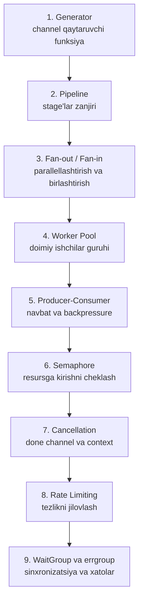

# Go Concurrency Patterns — To'liq O'quv Kursi

> Goroutine va channel bilan yoziladigan klassik concurrency patternlar — Generator'dan errgroup'gacha, muammodan yechimgacha, o'zbek tilida.

---

## Kurs xaritasi

---

## Darslar

| # | Pattern | Qaysi og'riqni davolaydi | Fayl |
|---|---------|--------------------------|------|
| 1 | Generator | Channel yaratish va to'ldirish logikasini funksiya ichiga yashirish | [01-generator.md](01-generator.md) |
| 2 | Pipeline | Ma'lumotni bosqichma-bosqich qayta ishlash zanjiri | [02-pipeline.md](02-pipeline.md) |
| 3 | Fan-out / Fan-in | Sekin stage'ni parallellashtirish va natijalarni birlashtirish | [03-fan-out-fan-in.md](03-fan-out-fan-in.md) |
| 4 | Worker Pool | Har vazifaga yangi goroutine ochmasdan resursni nazorat qilish | [04-worker-pool.md](04-worker-pool.md) |
| 5 | Producer-Consumer | Ishlab chiqarish va iste'mol tezligi farqini navbat bilan tekislash | [05-producer-consumer.md](05-producer-consumer.md) |
| 6 | Semaphore | Cheklangan resursga bir vaqtda kirishlar sonini cheklash | [06-semaphore.md](06-semaphore.md) |
| 7 | Cancellation (context) | Goroutine leak'ning oldini olish, ishni bekor qilish signali | [07-cancellation-context.md](07-cancellation-context.md) |
| 8 | Rate Limiting | Tashqi API limitlariga rioya qilish, so'rovlar tezligini jilovlash | [08-rate-limiting.md](08-rate-limiting.md) |
| 9 | WaitGroup va errgroup | Goroutine'larni kutish va xatolarni to'g'ri yig'ish | [09-waitgroup-va-errgroup.md](09-waitgroup-va-errgroup.md) |

---

## Patternlarni qachon tanlash — tezkor yo'riqnoma

| Vaziyat | Pattern |
|---------|---------|
| Ma'lumotlar oqimini bosqichma-bosqich qayta ishlash kerak | Pipeline |
| Pipeline'ning bitta stage'i juda sekin | Fan-out / Fan-in |
| N ta bir xil vazifani cheklangan goroutine bilan bajarish | Worker Pool |
| Ishlab chiqaruvchi iste'molchidan tezroq | Producer-Consumer (buffered channel) |
| Database yoki API'ga bir vaqtda kirishni cheklash | Semaphore |
| Goroutine'ni tashqaridan to'xtata olish kerak | Cancellation (context) |
| Sekundiga X ta so'rovdan oshmaslik kerak | Rate Limiting |
| Parallel ishlar tugashini kutish va xatolarni olish | errgroup |

---

## O'rganish tartibi

Darslar bir-biriga tayanadi: Generator → Pipeline → Fan-out/Fan-in mantiqiy zanjir hosil qiladi, Worker Pool va keyingilari shu poydevor ustiga quriladi. Shuning uchun tartib bilan o'qish tavsiya etiladi. Har dars oxiridagi "O'zingizni tekshiring" savollariga yozma javob berib, keyingi darsga o'ting.
