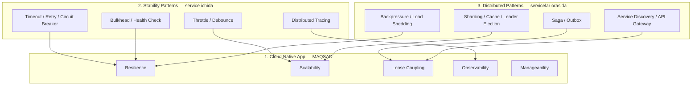

# Cloud Native

Cloud native tizimlar qurish bo'yicha yaxlit kurs — "Cloud Native Go" (Matthew Titmus, 2022) kitobi asosida, uch daraja bo'yicha tashkil qilingan: **maqsad → service ichidagi vositalar → servicelar orasidagi vositalar**.

## Tuzilma

```
3. Cloud Native/
├── 1. Cloud Native App/       ← MAQSAD: 5 atribut (nima qurmoqchimiz?)
├── 2. Stability Patterns/     ← VOSITA: bitta service darajasida (13 pattern)
└── 3. Distributed Patterns/   ← VOSITA: servicelar orasida (8 pattern)
```

| Qism | Savoli | Mazmuni |
|------|--------|---------|
| [1. Cloud Native App](1.%20Cloud%20Native%20App/0.%20README.md) | **Nega va nima?** | Scalability, Loose Coupling, Resilience, Manageability, Observability + ishonchlilik nazariyasi va Twelve-Factor |
| [2. Stability Patterns](2.%20Stability%20Patterns/0.%20README.md) | **Bitta service qanday omon qoladi?** | Timeout, Retry, Circuit Breaker, Throttle, Idempotency, Bulkhead, Health Check, Sidecar... |
| [3. Distributed Patterns](3.%20Distributed%20Patterns/0.%20README.md) | **Servicelar birga qanday ishlaydi?** | Saga, Outbox/Inbox, Cache Patterns, Service Discovery, Leader Election, Sharding, API Gateway/BFF, Backpressure |

## Uch daraja qanday bog'langan



Jonli misol — bitta buyurtma so'rovining yo'li: so'rov **API Gateway** orqali kiradi → gateway service'ni **Service Discovery** dan topadi → Order service Payment'ni chaqirganda **Timeout + Retry + Circuit Breaker** himoya qiladi → butun jarayon **Saga** bilan boshqariladi, eventlar **Outbox** orqali ishonchli chiqadi → yuk oshsa **Throttle** va **Load Shedding** ishlaydi, **Autoscaling** instance qo'shadi → hammasi **Distributed Tracing** bilan kuzatiladi.

## Tavsiya etilgan o'qish tartibi

1. **1. Cloud Native App** — avval "nega?" ni tushunish (ayniqsa `1. Cloud Native va Ishonchlilik` va `4. Resilience`)
2. **2. Stability Patterns** — 1→2→3 zanjiri (Timeout→Retry→Circuit Breaker) majburiy, qolganini ehtiyojga qarab
3. **3. Distributed Patterns** — README'dagi tartib: kommunikatsiya (4→7→8), data consistency (1→2), taqsimlash (3→6→5)

## Manba

`Patterns/oblachnyj_go_titmus_2022.pdf` — "Cloud Native Go", Matthew Titmus (DMK Press ruscha nashri, 418 sahifa). Kitobning to'liq bob-bob xaritasi [3. Distributed Patterns/0. README.md](3.%20Distributed%20Patterns/0.%20README.md) da.
