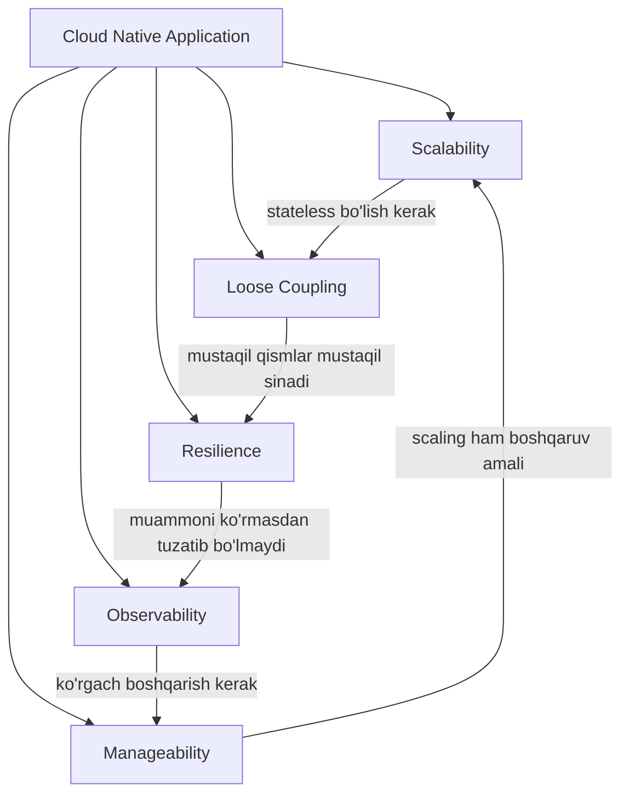

# Cloud Native App — 5 atribut

Bu papka **"Cloud Native Go"** (Matthew Titmus, 2022) kitobining asosiy g'oyasini — cloud native applicationning 5 atributini — chuqur yoritadi. Kitobning III qismi (6–11 boblar) aynan shu atributlar atrofida qurilgan, va bu papkadagi har bir fayl bitta bobga mos keladi.

> **Markaziy g'oya:** cloud native application — bu "cloudda ishlaydigan" application emas, balki **ishonchsiz muhitda (efemer serverlar, sinadigan tarmoq) foydalanuvchilar kutgandek ishlashda davom etadigan** application.

## Mundarija

| # | Fayl | Kitob bobi | Savol |
|---|------|-----------|-------|
| 1 | [Cloud Native va Ishonchlilik](1.%20Cloud%20Native%20va%20Ishonchlilik.md) | 1, 6-boblar | Cloud native nima? Ishonchlilik qanday quriladi? Twelve-Factor |
| 2 | [Scalability](2.%20Scalability.md) | 7-bob | Yuk 10x oshsa tizim nima qiladi? Efficiency, state, bottlenecklar |
| 3 | [Loose Coupling](3.%20Loose%20Coupling.md) | 8-bob | Komponentlar bir-biriga qanchalik yopishgan? gRPC, hexagonal architecture |
| 4 | [Resilience](4.%20Resilience.md) | 9-bob | Bir qism singanda butun tizim yiqiladimi? Retry, health check, idempotency |
| 5 | [Manageability](5.%20Manageability.md) | 10-bob | Xatti-harakatni kod o'zgartirmasdan o'zgartira olamizmi? Config, feature flags |
| 6 | [Observability](6.%20Observability.md) | 11-bob | Ichkarida nima bo'layotganini tashqaridan bila olamizmi? OpenTelemetry |

## Atributlar qanday bog'langan

Beshtasi alohida fazilatlar emas — bir-birini taqozo qiladigan yaxlit tizim: **loose coupling** scalability va resilience uchun zamin, **observability** manageability uchun ko'z, **manageability** esa qolgan hammasini boshqarish quroli.

## Boshqa papkalar bilan aloqasi

- **[`2. Stability Patterns/`](../2.%20Stability%20Patterns/0.%20README.md)** — Resilience atributining konkret patternlari (Timeout, Retry, Circuit Breaker, Bulkhead, Health Check...)
- **[`3. Distributed Patterns/`](../3.%20Distributed%20Patterns/0.%20README.md)** — atributlarni distributed darajada amalga oshirish (Service Discovery ← loose coupling, Backpressure ← resilience, Sharding/Cache ← scalability)
- **`System Design/`** — system design nuqtai nazaridan umumiy asoslar

## O'qish tartibi

**1 → 2 → 3 → 4** (nazariy poydevor va uch asosiy atribut), keyin **6 → 5** (avval ko'rishni, keyin boshqarishni o'rganish mantiqan to'g'ri).

Manba: `Patterns/oblachnyj_go_titmus_2022.pdf` (DMK Press ruscha nashri, 418 sahifa). Kitobning to'liq bob-bob xaritasi: [3. Distributed Patterns/0. README.md](../3.%20Distributed%20Patterns/0.%20README.md)
