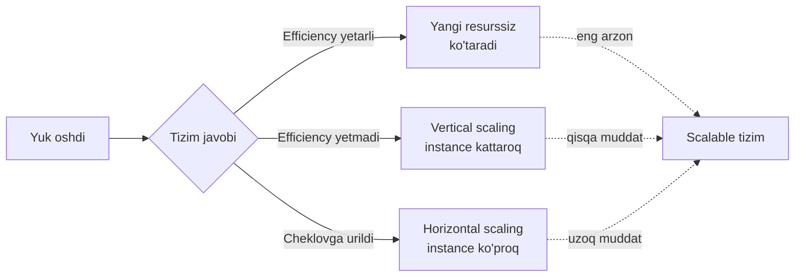
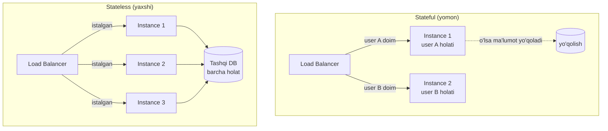
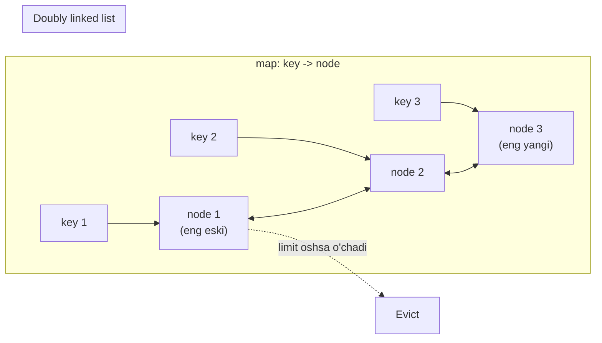
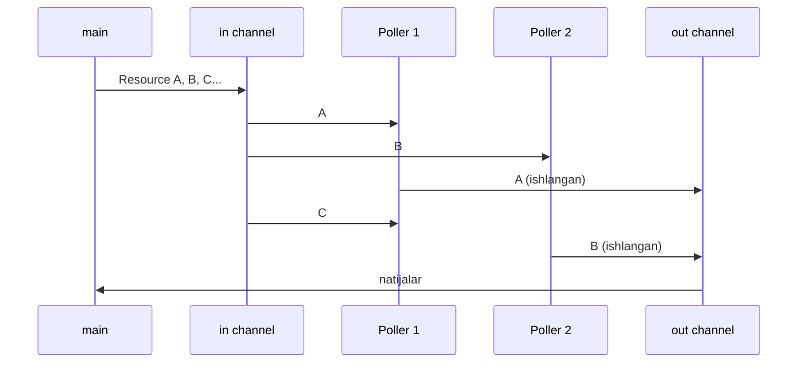
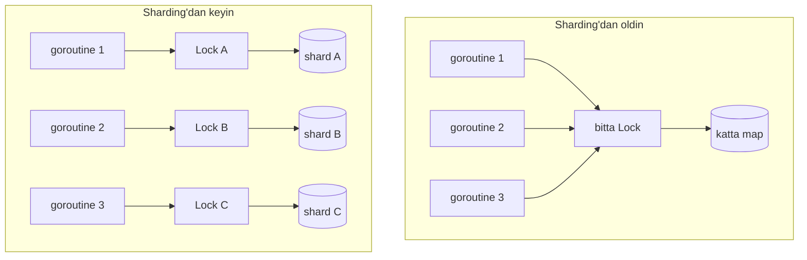
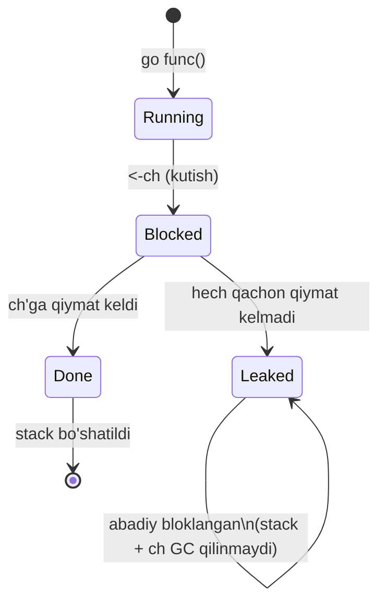
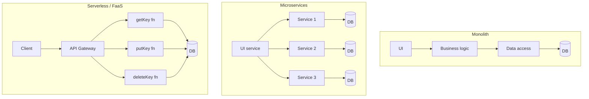

# Scalability (kengayuvchanlik)

> Manba: "Cloud Native Go" — Matthew A. Titmus (2022), 7-bob. Qo'shimcha: Brendan Gregg USE method, Little's law, Go goroutine leak profiling maqolalari.

---

## TL;DR (eng muhim gaplar)

- **Scalability** — bu tizimning talab (demand) keskin o'zgarganda ham qayta loyihalashsiz to'g'ri ishlashda davom eta olish qobiliyati. Bu "resurs qo'shish" bilan bir xil narsa emas.
- Resurs qo'shish (scaling) — **vertical** (bitta serverni kattalashtirish) yoki **horizontal** (server sonini oshirish) bo'ladi. Lekin bu — oxirgi chora.
- **Kechiktirilgan scaling = efficiency**: samarali kod ko'proq yukni yangi resurs qo'shmasdan ko'taradi. Kitobning asosiy g'oyasi shu.
- Har qanday tizim yuk oshganda **4 ta bottleneck**dan biriga uriladi: **CPU, memory, disk I/O, network I/O**. Ularni almashtirib turish — kompromis o'yini.
- **Application state** scaling dushmani. **Stateless** service istalgan instansda ishlaydi, shuning uchun oson horizontal scale bo'ladi.
- Go efficiency vositalari: **LRU cache**, **channel** orqali sinxronizatsiya, **sharding** bilan lock contention kamaytirish, hamda **memory leak** (goroutine leak, `time.Ticker` leak) oldini olish.
- Arxitekturalar: **monolith** (sodda, birga o'sadi), **microservices** (mustaqil scale, lekin murakkab), **serverless/FaaS** (provayder scale qiladi, lekin cold start + vendor lock-in + state muammosi).

---

## 1. Scalability nima? (kitobdagi ta'rif)

### Muammo / Hook

2016-yil yozida kitob muallifi kichik kompaniyada ishlagan. Ular hujjatlarni raqamlashtiruvchi ilovani konteynerga joylab, deploy'ni avtomatlashtirgan. Mijozlaridan biri Virjiniyadagi kichik sohil shaharchasi edi.

Kuchli bo'ron (Matthew) kelganda, mahalliy hokimiyat favqulodda holat e'lon qilib, fuqarolarga to'ldirish uchun hujjatlarni ijtimoiy tarmoqqa joyladi. **Yarim million odam bir vaqtda tizimga kirdi.** Signal chalindi: aggregated processor yuki 100% ga yetdi, yuz minglab so'rovlar timeout bilan uzildi.

Ular xohlagan server soniga bitta nol qo'shishdi (masalan 5 emas, 50). 24 soatdan keyin oqim tindi va serverlarni yana kamaytirishdi. Ikki dars:

1. Scale qila olmasa, tizim bu oqimni umuman ko'tarolmasdi.
2. Keragidan ko'p resurs ushlab turish — isrofgarchilik va qimmat. Kamaytira olish tejaydi.

> **Asosiy og'riq:** scale qilolmaydigan service boshida ajoyib ishlaydiganday tuyuladi, shuning uchun ko'pincha loyihalashda e'tibordan chetda qoladi. Keyin uni qayta qurish esa nihoyatda qiyin.

### Analogiya

Scalability'ni **restoran** bilan tasavvur qiling. Odatiy kunda 20 mijoz keladi. Birdan 500 mijoz kelib qolsa nima bo'ladi?

- **Yomon restoran** — hamma joyni band qiladi, oshxona qulab tushadi, mijozlar ketadi.
- **Scalable restoran** — navbatni tartibli boshqaradi, buyurtmalarni guruhlab tayyorlaydi, kerak bo'lsa qo'shimcha oshpaz chaqiradi, oqim tingach ularni uyga yuboradi.

Diqqat: scalable restoran birinchi navbatda **oshpaz sonini oshirmaydi** — avval jarayonni samarali qiladi (efficiency). Oshpaz qo'shish — oxirgi chora.

### Sodda ta'rif

> **Scalability** (kengayuvchanlik) — tizimning talab (demand — foydalanuvchilar/so'rovlar oqimi) keskin o'zgarganda ham **qayta loyihalashsiz** to'g'ri ishlashda davom eta olish qobiliyati.

Muhim nuqta: bu ta'rif jismoniy resurs qo'shish haqida umuman gapirmaydi. Bu yerda **"scale" bo'layotgan narsa — talab miqdori**, resurs emas. Resurs qo'shish — scalability'ga erishishning bir usuli, lekin scalability'ning o'zi emas.

Chalkashlikni oldini olish uchun: "scaling" so'zi tizimga nisbatan ishlatilsa, u chindan ham ajratilgan resurslar sonini o'zgartirishni bildiradi. Ta'rif esa umumiyroq.

### Diagramma: scalability spektri



Chapdan o'ngga: eng arzon yechim (efficiency) chapda, eng kuchli lekin qimmat yechim (horizontal) o'ngda.

---

## 2. Scaling'ning turlari (qisqacha)

Efficiency ham chegaraga uriladi. Ertami-kechmi resurs qo'shishga to'g'ri keladi — ikki yo'l bilan.

| Xususiyat | Vertical scaling (scale up/down) | Horizontal scaling (scale out/in) |
|---|---|---|
| Nima o'zgaradi | Bitta instance kattalashadi (CPU, RAM) | Instance/server soni ortadi |
| Qanchalik oson | Oson: cloud'da instance turini almashtirish | Murakkab: state bo'lsa qiyin yoki imkonsiz |
| Kod o'zgaradimi | Yo'q | Ko'pincha ha (stateless bo'lishi kerak) |
| Cheklov | Bor: cheksiz kuchli server yo'q | Amalda deyarli cheksiz |
| Muddat strategiyasi | Qisqa muddatga samarali | Uzoq muddatga yutuqli |

Bulardan tashqari yana ikki strategiya bor:

- **Functional decomposition** (funksional dekompozitsiya) — katta tizimni mustaqil optimallashtiriladigan, ishlatiladigan va scale qilinadigan kichik bloklarga bo'lish. Microservices — shuning bir ko'rinishi.
- **Sharding** (segmentlash) — ma'lumotni bo'laklarga (shard) bo'lib, yukni taqsimlash. Katta ma'lumotli tizimlarda, ayniqsa DB'larda keng qo'llaniladi.

> Chuqurroq: vertical/horizontal scaling, load balancing va stateless design bo'yicha [System Design/02-kengayish-usullari](../../../System%20Design/02-kengayish-usullari/) materialiga qarang. Sharding bo'yicha [Patterns/3. Distributed Patterns/6. Sharding.md](../3.%20Distributed%20Patterns/6.%20Sharding.md).

---

## 3. To'rt asosiy bottleneck

### Muammo / Hook

Yuk oshib borgan sari, ertami-kechmi **bitta resurs yetmay qoladi** va aynan shu yetishmovchilik keyingi scaling'ni to'sib qo'yadi. Shu resurs — **bottleneck** (bo'yin qismi, tor joy).

### Analogiya

Bottleneck — bu **shishaning tor bo'g'zi**. Shishada suyuqlik qancha bo'lishidan qat'i nazar, oqim tezligini eng tor joy belgilaydi. Tizimni tezlashtirmoqchi bo'lsangiz, eng keng joyni emas, **eng tor joyni** kengaytirishingiz kerak.

Xatoga yo'l qo'ymang: bottleneck'ni aniqlamasdan turib scale qilish — foydasiz. Suvni tezroq quyganingiz bilan bo'g'iz tor bo'lsa oqim tezlashmaydi.

### To'rtta bottleneck va ular bilan nima qilish

Resurslar juda ko'p bo'lsa-da, scaling harakatlari odatda faqat **to'rttasiga** qaratiladi:

| Bottleneck | Nima cheklaydi | Yechim (va uning narxi) |
|---|---|---|
| **CPU** | Vaqt birligidagi operatsiyalar soni | Qimmat deterministik hisoblarni cache'lash (RAM narxiga); CPU quvvatini/sonini oshirish (network I/O narxiga) |
| **Memory (RAM)** | Asosiy xotirada saqlanadigan ma'lumot hajmi | Ma'lumotni diskka tushirish (disk I/O narxiga); tashqi cache'ga, masalan Redis (network I/O narxiga); RAM qo'shish |
| **Disk I/O** | Diskka o'qish/yozish tezligi | Ma'lumotni RAM'da cache'lash (memory narxiga); tashqi cache (network I/O narxiga) |
| **Network I/O** | Tarmoq orqali uzatish tezligi | Optimizatsiya strategiyalari yaxshi ishlaydi; instance kattalashtirish limitni ko'tarishi mumkin |

> **Oltin qoida:** efficiency bepul emas. Bitta bottleneck'ni bartaraf qilish deyarli har doim **boshqa resursni ko'proq ishlatish** hisobiga bo'ladi. Bu — doimiy kompromis o'yini.

Masalan: DB disk I/O'dan qutulish uchun RAM'da cache'laydi — bu memory'ni ko'proq yeydi. RAM tugagan service esa diskka tushiradi — bu disk I/O'ni oshiradi. Aylanib yana boshqa bottleneck'ga borasiz.

### Bottleneck'ni qanday aniqlash: USE method

Bottleneck'ni topishning tizimli usuli — Brendan Gregg'ning **USE method**i. Har bir resurs uchun 3 ta narsani tekshiring:

- **U — Utilization** (band bo'lish darajasi): resurs vaqtning necha foizida ish bilan band edi? CPU uchun — idle bo'lmagan vaqt.
- **S — Saturation** (to'yinish): resurs bajarolmayotgan, navbatga turgan ish bormi? Saturation bo'lsa — kimdir kutmoqda.
- **E — Errors** (xatolar): nolga teng bo'lmagan har qanday xato son — darhol e'tibor talab qiladi.

> Nozik farq: yuqori **utilization** yomon emas — bu resursdan samarali foydalanish. Yomoni — **saturation**: ish navbatga tizilib, kutish boshlangani.

### Little's law: nega band tizim sekinlashadi

Little's law queueing theory'dan: **L = lambda x W**.

- **L** — tizimda bir vaqtda "ichkarida" turgan so'rovlar soni (concurrency).
- **lambda** — kelish tezligi (throughput, sekundiga so'rov).
- **W** — bitta so'rovning to'liq vaqti (latency).

Amaliy xulosa: agar har bir so'rov uzoqroq davom etsa (W oshsa), kelish tezligi o'zgarmasa ham, tizim ichida so'rovlar **to'planib** boradi (L oshadi). Shuning uchun latency oshganda serverlar to'satdan "bo'g'ilib" qoladi. **Latency'ni kamaytirish — concurrency'ni kamaytiradi**, bu esa eng kuchli scaling richagi.

---

## 4. State muammosi: application state vs resource state

### Muammo / Hook

Ikkita bir xil service instansi ishlayapti deylik. Har biri sessiya ma'lumotini **o'z ichida** (lokal) saqlaydi. Turli mijozlar turli instansga tushadi, natijada **ularning holati bir-biridan uzoqlashadi**. Endi qaysi instans qaysi mijozni biladi? Chalkashlik.

Session affinity (sticky session) buni chetlab o'tadi — har bir mijoz doim bitta serverga yo'naltiriladi. Lekin bu jiddiy xavf: o'sha server o'lsa, ma'lumot yo'qoladi.

### Analogiya

- **Stateful service** — bu **kassir** bo'lib, sizning to'lovingiz haqidagi yozuvni faqat o'zining daftarchasida saqlaydi. Boshqa kassirga borsangiz — u sizni tanimaydi. Kassir kasal bo'lib qolsa — daftarcha yo'qoladi.
- **Stateless service** — bu **istalgan kassir** sizga xizmat qila oladigan tizim, chunki hamma yozuvlar **markaziy kompyuterda** (tashqi DB). Bir kassir ketsa, ikkinchisi xuddi shu joydan davom etadi.

### Ikki xil state

State — bu o'zgarganda ilova xatti-harakatiga ta'sir qiladigan o'zgaruvchilar to'plami. Ikki turi bor:

| Tur | Ta'rifi | Scaling'ga ta'siri |
|---|---|---|
| **Application state** | Ilova hodisani **lokal** eslab qolganda paydo bo'ladi (server tomonidagi, mijozga bog'liq holat) | Yomon — scaling to'sig'i |
| **Resource state** | Barcha mijozlar uchun bir xil, mijoz harakatlariga bog'liq emas (tashqi xotira yoki konfiguratsiya) | Yaxshi — muammosiz |

Muhim: "ilova stateless" degani "ilovada ma'lumot yo'q" degani emas. Bu — ilova **doimiy lokal ma'lumot saqlamaydi**, degani. Uning yagona holati — resource state, chunki application state tashqi xotirada (DB, Redis) turadi.

Misol: mijoz sessiyasi. Agar ilova uni **lokal** saqlasa — application state. Agar **tashqi DB**da saqlasa — resource state.

### Diagramma: nega stateless oson scale bo'ladi



### Stateless'ning afzalliklari

- **Scalability** — istalgan instans istalgan so'rovni ishlaydi. Instans/pod'lar ogohlantirishsiz yaratilib-yo'q qilinishi mumkin (autoscaling uchun shart).
- **Durability** (bardoshlilik) — bitta joyda saqlangan ma'lumot o'sha joy yo'qolganda yo'qoladi. Cloud'da hamma narsa ertami-kechmi "bug'lanib" ketadi.
- **Simplicity** (soddalik) — holatni sinxronlash, yaxlitligini kuzatish, tiklash shart emas. API sodda bo'ladi.
- **Cacheability** (cache'ga moslik) — bir xil so'rovga doim bir xil javob bo'lsa, uni cache'lash oson.

> **Oltin qoida:** iloji boricha application state'dan qoching. Stateless service — cloud native scalability'ning poydevori.

---

## 5. Kechiktirilgan scaling: EFFICIENCY (kitobning yuragi)

### Muammo / Hook

Cloud'da odatda scalability'ni "resurs qo'shish" deb tushunamiz va efficiency'ning rolini e'tibordan chetda qoldiramiz. Aslida ko'p dasturchilar efficiency haqida faqat talab oshganda o'ylay boshlaydi.

Agar til concurrency uchun katta xarajat talab qilsa (ayniqsa dinamik tipli tillar), ilova xotira/CPU'ni tezroq yeydi va bir xil yukni ko'tarish uchun **ko'proq scaling** kerak bo'ladi.

Aynan shu Go concurrency modelini loyihalashda asosiy mulohaza edi: **goroutine** — OS thread emas, balki bir nechta OS thread ustida multipleks qilinadigan yengil protsedura. Bitta goroutine ishga tushirish stack'da joy ajratishdan bir oz qimmatroq — shuning uchun millionlab goroutine bir vaqtda ishlashi mumkin.

> **Asosiy g'oya:** efficiency'ga qurilgan tizim tabiatan ko'proq scalable. U talab har oshganda darhol resurs qo'shishga majbur emas — yukni "chiroyli" (graceful) ko'taradi.

---

### 5.1. LRU cache bilan samarali keshlash

#### Muammo

Keshlash oddiy ko'rinadi: qimmat (lekin deterministik) hisob natijasini map'ga solib qo'yasan. Lekin CPU yadrolari va goroutine soni oshsa:

1. Concurrent yozishlar bir-birini bosadi (data race).
2. Keraksiz qiymatlarni o'chirishni unutsang, cache cheksiz o'sib butun xotirani yeydi.

Bizga kerak bo'lgan cache: **concurrent** o'qish/yozish/o'chirishni qo'llasin, yadro/goroutine soni oshganda yaxshi scale bo'lsin, va **cheksiz o'smasin**.

#### Analogiya

**LRU cache** (Least Recently Used — eng ko'p vaqt oldin ishlatilgan) — bu **cheklangan javon**. Javonga yangi kitob qo'ymoqchi bo'lsang, joy tugagan bo'lsa, **eng uzoq vaqt qo'lga olinmagan kitobni** olib tashlaysan. Tez-tez ishlatiladigan kitoblar doim javonda qoladi.

#### Notional machine: LRU ichida nima bor

LRU cache ikki struktura birikmasi:

1. **Doubly linked list** (ikki tomonlama bog'langan ro'yxat) — qiymatlarni saqlaydi.
2. **Map** (associative array) — har bir key'ni ro'yxatdagi node bilan bog'laydi (O(1) qidiruv uchun).

Har safar key'ga murojaat bo'lganda (o'qish yoki yozish), tegishli node ro'yxat **oxiriga** ko'chiriladi. Shuning uchun eng eskisi doim ro'yxat **boshida** turadi va birinchi bo'lib o'chiriladi.



#### Worked example: hashicorp/golang-lru

Go standart kutubxonasida LRU yo'q (hozircha). Eng mashhuri — `hashicorp/golang-lru`, u batafsil hujjatlangan va concurrent xavfsizlik uchun `sync.RWMutex` ishlatadi.

```go
package main

import (
    "fmt"
    lru "github.com/hashicorp/golang-lru"
)

// --- 1-qadam: global cache o'zgaruvchisi ---
var cache *lru.Cache

// --- 2-qadam: init() main'dan oldin avtomatik chaqiriladi ---
func init() {
    // 2 ta elementlik cache; evict bo'lganda callback ishlaydi
    cache, _ = lru.NewWithEvict(2,
        func(key interface{}, value interface{}) {
            fmt.Printf("Evicted: key=%v value=%v\n", key, value)
        },
    )
}

func main() {
    cache.Add(1, "a")         // key 1 qo'shildi
    cache.Add(2, "b")         // key 2 qo'shildi; cache to'ldi
    fmt.Println(cache.Get(1)) // "a true"; endi 1 -- eng yangi ishlatilgan
    cache.Add(3, "c")         // key 3 qo'shildi -> key 2 evict bo'ladi
    fmt.Println(cache.Get(2)) // "<nil> false" (topilmadi)
}
```

**Output:**

```
a true
Evicted: key=2 value=b
<nil> false
```

Nima bo'ldi? `{1:"a"}` va `{2:"b"}` qo'shildi. `Get(1)` chaqirilgach, `1` eng yangi ishlatilganga aylandi, `2` esa eng eskisi. Yangi `{3:"c"}` qo'shilganda joy yetmadi, shuning uchun **eng eski `2` evict bo'ldi**.

#### Predict savoli

> Agar `cache.Get(1)` qatorini o'chirib tashlasak, `cache.Add(3, "c")` qaysi key'ni evict qiladi?

<details>
<summary>Javobni ko'rish</summary>

`key 1` evict bo'ladi. Chunki `Get(1)` bo'lmasa, `1` eng eski (uzoq vaqt tegilmagan) bo'lib qoladi va yangi element joy so'raganda birinchi bo'lib o'chiriladi. Output: `Evicted: key=1 value=a`.

</details>

#### Cheklov

LRU cache aksariyat holatlar uchun ajoyib, lekin **juda yuqori concurrency**da (sekundiga bir necha million operatsiya) mutex contention tufayli latency paydo bo'ladi. Bunday holat uchun Go'da hozircha yuqori o'tkazuvchan standart yechim yo'q.

> Cache pattern'lari (write-through, write-back, cache-aside, TTL) bo'yicha: [Patterns/3. Distributed Patterns/3. Cache Patterns.md](../3.%20Distributed%20Patterns/3.%20Cache%20Patterns.md).

#### Ko'p uchraydigan xatolar

- **Xato:** oddiy `map`ni cache sifatida ishlatish. → Concurrent yozishda data race, hech qachon tozalanmaydi, xotira portlaydi. → **To'g'risi:** hajm chegarali, concurrent-safe LRU ishlatish.
- **Xato:** juda katta cache hajmi. → Cache o'zi memory bottleneck'ga aylanadi. → **To'g'risi:** hajmni hit rate va mavjud RAM asosida tanlash.

---

### 5.2. Samarali sinxronizatsiya

#### Muammo

Multithreading osoni — thread ishga tushirish. Qiyini — lock'larni **to'g'ri** ishlatish. Noto'g'ri lock — deadlock, race, yoki sekin kod.

#### Go afzaligi (aforizm)

> "Don't communicate by sharing memory; share memory by communicating." — Xotirani ulashib muloqot qilmang; muloqot qilib xotirani ulashing.

Ya'ni: ma'lumotni **shared struct + lock** orqali emas, **channel** orqali uzating. Goroutine'lar orasida ma'lumotga havolani channel bilan almashtirsangiz, ko'pincha lock'dan **umuman voz kechish** mumkin.

Lekin channel — panatseya emas. Ikkalasi ham kerak:

| Vosita | Qachon eng yaxshi |
|---|---|
| **Channel** | Diskret qiymatlar bilan ishlash, ma'lumot egaligini uzatish, ish birliklarini taqsimlash, natijani async yuborish |
| **Mutex (sync)** | Cache va boshqa katta, holatli struct'larga kirishni sinxronlash |

> **Oltin qoida:** eng ifodali va eng sodda vositani tanla. Har ikkisi ham to'g'ri joyda kuchli.

#### Worked example: "Share Memory By Communicating"

Faraz qiling, URL ro'yxatidagi serverlarni so'roq qilyapmiz (har biriga GET yuborib, javob kutamiz). Javob millisekunddan sekundlargacha kutilishi mumkin — demak concurrent qilish foydali.

**Lock bilan (an'anaviy, murakkab):**

```go
type Resource struct {
    url        string
    polling    bool
    lastPolled int64
}
type Resources struct {
    data []*Resource
    lock *sync.Mutex
}
```

Poller funksiyasi har safar `lock.Lock()` / `lock.Unlock()` qilib, eng eski so'roq qilingan resursni topadi, flag qo'yadi, so'rov yuboradi, yana lock olib yangilaydi. Kod uzun, o'qish qiyin, mulohaza qilish og'ir — va bu hali URL so'roq mantig'i qo'shilmasdan.

**Channel bilan (sodda):**

```go
type Resource string

// --- Poller in kanalidan resurs oladi, ishlab, out'ga qaytaradi ---
func Poller(in, out chan *Resource) {
    for r := range in {
        // URL bo'yicha so'rov yuborish
        // Ishlangan Resource'ni chiqish kanaliga jo'natish
        out <- r
    }
}
```

Lock ham, ortiqcha struct maydonlari ham yo'q — faqat eng zarur narsa qoldi. Bir nechta Poller kerakmi? Oddiygina goroutine ishga tushiramiz:

```go
// --- bir xil kanallardan foydalanadigan numPollers ta konkurent jarayon ---
for i := 0; i < numPollers; i++ {
    go Poller(in, out)
}
```

`numPollers` ta goroutine bir xil `in`/`out` kanallarini ulashib, konkurent ishlaydi. Lock yo'q, race yo'q.

#### Diagramma: channel orqali ish taqsimoti



> Channel va goroutine tafsilotlarini eslatib olish uchun: [1. Golang/Advanced/Concurrency/Channel/Unbuffered.md](../../../1.%20Golang/Advanced/Concurrency/Channel/Unbuffered.md).

---

### 5.3. Buffered channel bilan lock kutishni kamaytirish

#### Muammo

"Channel yaxshi, lekin yozish baribir bloklaydi-ku?" — to'g'ri, **unbuffered** channelga har bir yuborish qabul qiluvchi tayyor bo'lguncha bloklanadi.

#### Yechim

**Buffered channel** ichki bufferga ega. Yuborish faqat **buffer to'lganda** bloklanadi, o'qish faqat **buffer bo'sh bo'lganda**. Bu notekis yuklarni tekislashga yordam beradi.

```go
ch := make(chan Type, capacity) // capacity = buffer hajmi
```

#### Worked example: FileTransactionLogger

```go
type FileTransactionLogger struct {
    events       chan<- Event // faqat yozish kanali; hodisalarni uzatadi
    lastSequence uint64       // oxirgi tartib raqami
}

func (l *FileTransactionLogger) WritePut(key, value string) {
    l.events <- Event{EventType: EventPut, Key: key, Value: value}
}

func (l *FileTransactionLogger) Run() {
    l.events = make(chan Event, 16) // 16 elementlik buffered channel
    go func() {
        for e := range events { // navbatdagi hodisani olish
            l.lastSequence++     // tartib raqamini oshirish
        }
    }()
}
```

Agar `events` oddiy (unbuffered) bo'lsa, har bir `WritePut` goroutine o'qiguncha bloklanardi. Buffered qilib, bir-ketin keladigan **16 tagacha** so'rovni kutmasdan qabul qilamiz. Diqqat: **17-yozish bloklanadi**.

#### Predict savoli

> Buffered channel bilan dastur to'satdan to'xtasa (masalan crash), 16 ta buffer'dagi hodisaga nima bo'ladi?

<details>
<summary>Javobni ko'rish</summary>

Ular **yo'qoladi**. Goroutine buffer'ni bo'shatishga (diskka yozishga) ulgurmasa, buffered channel'dagi ma'lumot ketadi. Buffered channel data yo'qotish xavfini keltiradi — muhim ma'lumotlarda ehtiyot bo'lish yoki flush/graceful shutdown qo'shish kerak.

</details>

#### Ko'p uchraydigan xatolar

- **Xato:** "buffer kattaroq — doim yaxshiroq" deb o'ylash. → Katta buffer crash'da ko'proq ma'lumot yo'qotadi va muammoni yashiradi (backpressure yo'qoladi). → **To'g'risi:** buffer'ni real yuk profili asosida o'lchash.

> Buffered vs unbuffered channel farqi: [1. Golang/Advanced/Concurrency/Channel/Buffered.md](../../../1.%20Golang/Advanced/Concurrency/Channel/Buffered.md).

---

### 5.4. Sharding bilan lock contention kamaytirish

#### Muammo

Channel hamma muammoni yechmaydi. Cache kabi **katta markaziy struct**ni alohida ish birliklariga ajratish qiyin. Bunday holda mutex ishlatiladi:

```go
var cache = struct {
    sync.RWMutex
    data map[string]string
}{data: make(map[string]string)}

func ThreadSafeWrite(key, value string) {
    cache.Lock()            // yozish lock'i
    cache.data[key] = value
    cache.Unlock()          // lock'ni bo'shatish
}
```

Bu ishlaydi — faqat bitta goroutine yozadi. Lekin konkurent goroutine soni oshgani sari, ular lock kutishga sarflagan **o'rtacha vaqt** oshadi. Bu — **lock contention** (lock uchun raqobat).

#### Analogiya

Bitta katta lug'at (cache) va uni ochish uchun **bitta kalit** (mutex). 100 kishi yozmoqchi — hammasi bitta kalitni kutadi, navbat uzayadi.

**Yechim (sharding):** lug'atni **26 ta kichik lug'atga** bo'lamiz (A-Z harflari bo'yicha), har biriga **alohida kalit**. "banana" so'zini yozayotgan odam "B" lug'atini bloklaydi, "apple" yozayotgan "A"ni — ular **bir-birini kutmaydi**.

#### Notional machine

Vertical sharding — bitta katta struct'ni ikki yoki undan ko'p kichik struct'ga bo'lish. Endi har bir goroutine **butun** cache'ni emas, faqat kerakli **shard**ni bloklaydi. Umumiy lock contention keskin kamayadi.



Muqobil sifatida instans sonini oshirish ham mumkin, lekin bu distributed lock talab qilib, murakkablik va latency oshiradi. Sharding esa **bitta instans ichida** contention'ni kamaytiradi.

> To'liq nazariya va implementatsiya: [Patterns/3. Distributed Patterns/6. Sharding.md](../3.%20Distributed%20Patterns/6.%20Sharding.md). Lock contention va concurrency muammolari: [1. Golang/Advanced/Concurrency/Concurrency issues/5. Starvation.md](../../../1.%20Golang/Advanced/Concurrency/Concurrency%20issues/5.%20Starvation.md).

---

### 5.5. Memory leak turlari Go'da

#### Muammo

Memory leak — bu **kerak bo'lmay qolgan xotira bo'shatilmaydigan** xatolar sinfi. C++ kabi qo'lda xotira boshqaruvli tillarda keng tarqalgan. Garbage collector (GC) yordam beradi, lekin Go kabi GC'li til ham leak'dan **himoyalanmagan**:

- Struct'lar cheksiz o'sishi mumkin.
- Goroutine'lar to'planib qolishi mumkin (agar to'xtatilmasa).
- Hatto `time.Ticker` taymerlari ham "qochib" ketishi mumkin.

---

#### 5.5.1. Goroutine leak

Muallif fikricha, goroutine'lar Go'dagi **eng katta** memory leak manbai.

##### Notional machine

Har bir goroutine ishga tushganda unga **2048 baytlik** stack ajratiladi (dinamik o'sadi/kichrayadi). Goroutine tugaganda stack bo'shatiladi yoki qayta ishlatish uchun saqlanadi. **Muammo:** hamma goroutine ham tugamaydi.

```go
func leaky() {
    ch := make(chan string)
    go func() {
        s := <-ch                     // ch'dan o'qishni kutadi... abadiy
        fmt.Println("Message:", s)
    }()
}
```

Bu yerda `leaky()` channel yaratib, undan o'qiydigan goroutine ishga tushiradi. Funksiya xatosiz tugaydi. **Lekin `ch`ga hech narsa yuborilmaydi** — goroutine hech qachon tugamaydi, stack'i hech qachon bo'shatilmaydi.

Yana bir yon ta'sir: goroutine `ch`ga havola qilgani uchun, **GC `ch`ni ham yig'a olmaydi**. Bu — chinakam memory leak. `leaky()` muntazam chaqirilsa, xotira asta-sekin tugaguncha o'sadi.

##### Diagramma: goroutine holatlari



##### Oltin maslahat (Dave Cheney)

> "Goroutine'ni qanday to'xtashini bilmasdan turib hech qachon ishga tushirmang. Har safar `go` bilan goroutine ishga tushirganingizda, u qanday va qachon tugashini bilishingiz kerak. Bilmasangiz — bu potentsial memory leak."

##### To'g'risi: cancellation berish

```go
func notLeaky(ctx context.Context) {
    ch := make(chan string)
    go func() {
        select {
        case s := <-ch:
            fmt.Println("Message:", s)
        case <-ctx.Done(): // bekor qilinsa chiqish yo'li bor
            return
        }
    }()
}
```

`context` yoki `done` channel bilan **chiqish yo'li** bering. Shunda goroutine abadiy bloklanib qolmaydi.

##### Qanday aniqlash (pprof)

- `runtime.NumGoroutine()` ni davriy log qiling — son to'xtovsiz o'ssa, leak bor.
- `go tool pprof http://localhost:6060/debug/pprof/goroutine` — `chan send`, `chan receive` yoki cheksiz loop'da qotib qolgan goroutine'larni ko'rsatadi.
- Go 1.24+ da `synctest`, Go 1.26 da eksperimental `goroutineleak` profili leak'ni to'g'ridan-to'g'ri xabar qiladi.

> Profiling asoslari: [1. Golang/Advanced/Profilling/Profiling.md](../../../1.%20Golang/Advanced/Profilling/Profiling.md). Deadlock bilan farqi: [1. Golang/Advanced/Concurrency/Concurrency issues/3. Deadlock.md](../../../1.%20Golang/Advanced/Concurrency/Concurrency%20issues/3.%20Deadlock.md).

---

#### 5.5.2. To'xtatilmagan time.Ticker

##### Muammo

`time` paketi ikki vosita beradi:

- **`time.Timer`** — kelajakda **bir marta** ishlaydi (chekli umr).
- **`time.Ticker`** — belgilangan interval bilan **qayta-qayta** ishlaydi (**abadiy tiklashi mumkin**).

Ikkalasi ham channel beradi va har "chertganda" unga qiymat yuboradi. Nozik xato shundaki: `time.Ticker` ichida **faol goroutine** bor, uni to'g'ridan-to'g'ri to'xtatib bo'lmaydi.

```go
func timely() {
    timer := time.NewTimer(5 * time.Second)
    ticker := time.NewTicker(1 * time.Second)
    done := make(chan bool)
    go func() {
        for {
            select {
            case <-ticker.C:
                fmt.Println("Tick!")
            case <-done:
                return
            }
        }
    }()
    <-timer.C              // 5 sekund kutadi
    fmt.Println("It's time!")
    close(done)           // goroutine chiqadi... lekin ticker to'xtamadi!
}
```

`timely()` xatosiz tugaydi, goroutine ham chiqadi. **Lekin `ticker` hech qayerda to'xtatilmadi** — uning ichki goroutine'i qolib ketadi. Bu — memory leak.

##### To'g'risi: doim to'xtating (defer bilan)

```go
func timelyFixed() {
    timer := time.NewTimer(5 * time.Second)
    ticker := time.NewTicker(1 * time.Second)
    defer ticker.Stop() // ticker'ni to'xtatishni KAFOLATLAYMIZ!
    done := make(chan bool)
    go func() {
        for {
            select {
            case <-ticker.C:
                fmt.Println("Tick!")
            case <-done:
                return
            }
        }
    }()
    <-timer.C
    fmt.Println("It's time!")
    close(done)
}
```

`ticker.Stop()` chaqirilishi ticker'ning ichki goroutine'ini to'xtatadi va GC uni yig'ib olishi mumkin bo'ladi — leak oldi olinadi.

##### Ko'p uchraydigan xatolar

- **Xato:** "goroutine chiqdi, demak hammasi joyida" deb o'ylash. → `ticker` alohida ichki goroutine ushlab turadi. → **To'g'risi:** `defer ticker.Stop()`.
- **Xato:** `time.Timer` ni ham to'xtatish shart deb o'ylash. → Timer bir marta ishlab tugaydi, odatda muammo emas; lekin ishlamasdan bekor qilinsa `timer.Stop()` foydali.

> `defer` ishlash mexanizmi: [1. Golang/3. Defer/Defer.md](../../../1.%20Golang/3.%20Defer/Defer.md).

---

## 6. Service arxitekturalari

Endi mavzuni o'zgartirib, uchta keng tarqalgan arxitektura va ularning scaling xususiyatlarini ko'ramiz. Bular Go'ga kamroq bog'liq, lekin cloud native scalability uchun hal qiluvchi.

### Diagramma: uch arxitektura



### 6.1. Monolith

**Ta'rif:** barcha funksional jihatlar (UI, business logic, data access) **birga** birlashtirilgan. Odatda bitta serverda bitta katta bajariladigan fayl.

**Afzalliklari:** ishlab chiqish sodda, hamma logika bitta jarayonda. Kichik/oddiy ilovalar uchun ideal. Load balancer ortida bir nechta nusxa (session affinity bilan) ishlatib scale ham qilish mumkin.

**Muammolari (o'sgan sari):**

- Bitta artifakt sifatida deploy bo'ladi — kichik o'zgarish uchun ham **butun** monolitni build, test, deploy qilish kerak.
- Vaqt o'tishi bilan modullilik kamayadi — bir qismni o'zgartirish boshqasiga bilmasdan ta'sir qiladi.
- Scaling — faqat kerakli qismni emas, **butun** ilovani nusxalash degani.

### 6.2. Microservices

**Ta'rif:** funksional komponentlar mustaqil rivojlantiriladigan, test qilinadigan, deploy qilinadigan va **scale qilinadigan** kichik service'larga bo'linadi. Har biri alohida jarayonda, yengil mexanizmlar orqali muloqot qiladi.

**Afzalliklari:**

- Aniq concern ajratish → kuchli modullilik (katta jamoalar uchun qulay).
- Mustaqil deploy → xato/nosozlikni izolyatsiya qilish oson.
- Har service uchun **eng mos texnologiya** (til, DB) tanlash mumkin.

**Kamchiliklari:**

- Distributed tabiati → "distributed computing yolg'onlari"ga duchor, dasturlash va debug murakkab.
- Service'lar orasida **state ulashish** juda qiyin.
- Ko'p service'ni deploy/boshqarish yuqori malaka talab qiladi.

> **Amaliy maslahat:** microservices afzalliklari ilova/jamoa **kattalashgan** sari sezila boshlaydi. Ko'p mualliflar **monolitdan boshlab**, keyin dekompozitsiya qilishni tavsiya qiladi. Nima qilsangiz ham — **state saqlashdan qoching**.

Ehtiyot: texnologiya aralashmasi jozibali ko'rinsa ham, har yangi texnologiya yangi asbob va bilim talabini qo'shadi. Har birini diqqat bilan tortib ko'ring — hatto Go'ni ham.

### 6.3. Serverless (FaaS)

**Ta'rif:** dasturchi yozgan server logikasi **boshqariladigan, o'tkinchi (ephemeral)** muhitda, oldindan belgilangan signalga javoban shaffof bajariladi. Ko'pincha **Functions as a Service (FaaS)** deb ataladi: AWS Lambda, GCP Cloud Functions.

FaaS shu qadar moslashuvchanki, butun arxitekturani **API Gateway + FaaS funksiyalari + tashqi boshqariladigan service'lar** asosida qurish mumkin — an'anaviy service'larsiz. Masalan key/value store: API Gateway `GET/PUT/DELETE /v1/{key}` so'rovlarini `getKey`/`putKey`/`deleteKey` funksiyalariga yo'naltiradi.

| Afzalliklari | Kamchiliklari |
|---|---|
| **Operatsion yuk kam** — server sozlash/xizmat ko'rsatish yo'q | **Cold start latency** — birinchi chaqiruvda "isishga" vaqt kerak (ba'zan 10+ sekund); funksiya bir necha daqiqa ishlatilmasa yana sekinlashadi |
| **Scalability** — provayder scale qiladi, siz emas | **Observability** — monitoring ko'pincha primitiv, ephemeral funksiyalarni kuzatish qiyin |
| **Xarajat kam** — faqat ishlatilgan CPU/RAM uchun to'lov | **Testing** — unit test oson, lekin integratsion test qiyin (muhitni simulyatsiya qilish og'ir) |
| **Produktivlik** — "function-first" fikrlash, kod soddaroq va testlanuvchan | **Yuqori yukda qimmat** — pay-per-use past yukda arzon, lekin juda katta yukda qimmatga tushadi |

**Muhim ogohlantirish (Gartner Hype Cycle):** serverless hozir "kutilmalar cho'qqisi"da. Cold start, vendor lock-in va ayniqsa **state** muammolari jiddiy. FaaS ephemeral bo'lgani uchun **BARCHA state** — hatto cache kabi qisqa muddatli optimizatsiyalar ham — tashqi joyga (DB, Redis, S3) ko'chirilishi shart. Bu qo'shimcha murakkablik.

> Distributed monitoring va tracing: [2. Stability Patterns/13. Distributed Tracing.md](../2.%20Stability%20Patterns/13.%20Distributed%20Tracing.md). Autoscaling: [2. Stability Patterns/9. Autoscaling.md](../2.%20Stability%20Patterns/9.%20Autoscaling.md).

### Taqqoslash jadvali

| Mezon | Monolith | Microservices | Serverless (FaaS) |
|---|---|---|---|
| Deploy | Bitta artifakt, hammasi birga | Mustaqil, service-ma-service | Funksiya darajasida |
| Scaling | Butun ilovani nusxalash | Kerakli service'ni alohida | Provayder avtomatik |
| Murakkablik | Past (boshida) | Yuqori (distributed) | O'rta-yuqori (planning ko'p) |
| State | Lokal bo'lishi mumkin | Ulashish qiyin | Majburan tashqi |
| Eng mos | Kichik/oddiy ilova, kichik jamoa | Katta ilova, ko'p jamoa | Event-driven, notekis yuk |
| Asosiy xavf | O'sganda tang qoladi | Operatsion murakkablik | Cold start, vendor lock-in |

---

## 7. Interview savollari

**1. "Scalability" va "scaling" bir xil narsami?**

<details>
<summary>Javob</summary>

Yo'q. **Scalability** — tizimning talab o'zgarishiga qayta loyihalashsiz bardosh bera olish **qobiliyati**; bu yerda o'zgaruvchan narsa — talab miqdori. **Scaling** — ajratilgan resurslar sonini amalda o'zgartirish (vertical/horizontal). Resurs qo'shish — scalability'ga erishishning bir usuli, lekin uning o'zi emas. Efficiency orqali ham resurs qo'shmasdan scalable bo'lish mumkin.

</details>

**2. Nega stateless service horizontal scaling uchun shart?**

<details>
<summary>Javob</summary>

Chunki stateless service har bir so'rovni oldingi so'rovlardan **mustaqil** ishlaydi — istalgan instans istalgan so'rovni bajaradi. Shuning uchun instanslarni ogohlantirishsiz yaratib-yo'q qilish (autoscaling) mumkin, ma'lumot yo'qolmaydi. Stateful bo'lsa, session affinity kerak bo'ladi va instans o'lganda lokal ma'lumot yo'qoladi — bu horizontal scaling'ni qiyin yoki imkonsiz qiladi.

</details>

**3. 4 ta asosiy bottleneck qaysilar va ularni bartaraf qilish nega "kompromis"?**

<details>
<summary>Javob</summary>

CPU, memory, disk I/O, network I/O. Kompromis, chunki bitta bottleneck'ni bartaraf qilish deyarli har doim boshqa resursni ko'proq ishlatish hisobiga bo'ladi. Masalan: disk I/O'ni kamaytirish uchun RAM'da cache'laymiz → memory oshadi; memory tugasa diskka tushiramiz → disk I/O oshadi; tashqi Redis cache → network I/O oshadi. Aylanib boshqa bottleneck'ga borasiz.

</details>

**4. Go'da goroutine leak qanday yuz beradi va uni qanday oldini olasiz?**

<details>
<summary>Javob</summary>

Goroutine channelda (yoki boshqa sinxronlash primitivida) **abadiy bloklanib** qolsa yuz beradi — masalan hech kim yozmaydigan channeldan o'qishni kutsa. Uning 2048 baytlik stack'i bo'shatilmaydi, ustiga u ushlab turgan obyektlarni GC yig'a olmaydi. Oldini olish: har bir goroutine uchun **chiqish yo'li** berish (`context.Context` / `ctx.Done()`, yoki `done` channel), `defer close(ch)`, oldindan ma'lum sondagi yuborishlarda buffered channel. Aniqlash: `runtime.NumGoroutine()` monitoring, `pprof` goroutine profili.

</details>

**5. `time.Ticker` nega leak keltiradi, `time.Timer` esa odatda yo'q?**

<details>
<summary>Javob</summary>

`time.Ticker` ichida to'g'ridan-to'g'ri to'xtatib bo'lmaydigan **faol ichki goroutine** bor va u **abadiy** tiklashi mumkin. Uni ishlatib bo'lgach `ticker.Stop()` chaqirilmasa, o'sha goroutine qolib ketadi — leak. `time.Timer` esa bir marta ishlab **tugaydi** (chekli umr), shuning uchun odatda leak bermaydi. Yechim: `defer ticker.Stop()`.

</details>

**6. Monolit yaxshiroqmi yoki microservices? Qachon qaysi birini tanlaysiz?**

<details>
<summary>Javob</summary>

Universal to'g'ri javob yo'q. Microservices afzalliklari (mustaqil deploy/scale, modullilik) ilova va jamoa **kattalashgan** sari sezila boshlaydi; kichik loyihada ular faqat operatsion murakkablik qo'shadi. Shuning uchun ko'p mualliflar **monolitdan boshlab**, keyin zarurat tug'ilganda dekompozitsiya qilishni tavsiya qiladi. Muallif ta'kidlaydi: katta monolitni bo'lakka ajratish juda qiyin, lekin imkonsiz emas. Har qanday holatda — **application state saqlashdan qoching**.

</details>

**7. Buffered channel latency muammosini yashira oladimi, xavfi nima?**

<details>
<summary>Javob</summary>

Buffered channel notekis yuk (spike)ni **tekislaydi**: buffer to'lguncha yuboruvchi bloklanmaydi. Lekin bu — vaqtinchalik amortizatsiya, doimiy yechim emas: agar yozish tezligi doimiy ravishda o'qishdan tez bo'lsa, buffer baribir to'lib, `capacity+1`-yozish bloklanadi. Xavf: dastur buffer bo'shashidan oldin crash bo'lsa, **buffer'dagi ma'lumot yo'qoladi**. Katta buffer backpressure signalini yashirib, muammoni kechiktiradi.

</details>

---

## Xulosa

- **Scalability** — talab keskin o'zgarganda tizimning qayta loyihalashsiz ishlashda davom eta olishi; bu resurs qo'shish bilan bir xil narsa emas.
- Resurs qo'shish (vertical/horizontal) — oxirgi chora. Undan oldin **efficiency** (samaradorlik) yuklarni yangi resurssiz ko'taradi — kitobning markaziy g'oyasi.
- Har bir tizim yuk oshganda **CPU, memory, disk I/O, network I/O**dan biriga uriladi; bittasini yengillashtirish boshqasiga yuk oshiradi (kompromis). USE method bilan aniqlanadi.
- **Application state** scaling dushmani; **stateless** service istalgan instansda ishlagani uchun oson horizontal scale bo'ladi va autoscaling'ni mumkin qiladi.
- Go efficiency vositalari: **LRU cache** (chegarali, concurrent-safe), **channel** orqali "share memory by communicating", **buffered channel** bilan spike tekislash, **sharding** bilan lock contention kamaytirish.
- **Memory leak**: goroutine chiqish yo'lisiz bloklansa yoki `time.Ticker` to'xtatilmasa yuz beradi — `context`/`done` va `defer Stop()` bilan oldi olinadi, `pprof` bilan topiladi.
- Arxitekturalar: **monolith** (sodda, birga scale), **microservices** (mustaqil, lekin murakkab), **serverless/FaaS** (provayder scale qiladi, lekin cold start + vendor lock-in + majburiy tashqi state).

## 🧠 Eslab qol

- Scalability = talabga bardosh, scaling = resurs qo'shish — bular boshqa-boshqa.
- Efficiency — eng arzon scaling; resurs qo'shish oxirgi chora.
- Har bir efficiency yutug'i boshqa resurs hisobiga keladi (kompromis).
- Stateless bo'l — application state horizontal scaling'ni buzadi.
- Goroutine'ni qanday to'xtashini bilmasdan ishga tushirma; ticker'ni doim `Stop()` qil.

## ✅ O'z-o'zini tekshir (retrieval practice)

**1. Nega faqat server soni oshirish (horizontal scaling) bottleneck'ni aniqlamasdan foydasiz bo'lishi mumkin?**

<details>
<summary>Javob</summary>

Chunki tizim tezligini eng tor joy (bottleneck) belgilaydi. Agar bottleneck, masalan, umumiy DB yoki shared lock bo'lsa, ko'proq instans qo'shish shu tor joyga bosimni **oshiradi** (ko'proq connection, ko'proq lock kutish, ko'proq network overhead) va yordam bermaydi. Avval bottleneck aniqlanib bartaraf qilinishi kerak.

</details>

**2. Nima bo'ladi, agar `leaky()` funksiyasidagi channelga hech qachon qiymat yuborilmasa?**

<details>
<summary>Javob</summary>

Ichkaridagi goroutine `<-ch` da abadiy bloklanadi, hech qachon tugamaydi. Uning stack'i bo'shatilmaydi va u ushlab turgan `ch` GC tomonidan yig'ilmaydi. Funksiya muntazam chaqirilsa, xotira asta-sekin tugaguncha o'sadi — memory leak.

</details>

**3. Buffered va unbuffered channel yuborish (send) xatti-harakati bilan qanday farq qiladi?**

<details>
<summary>Javob</summary>

**Unbuffered**: har bir send qabul qiluvchi tayyor bo'lguncha bloklanadi (to'liq sinxron uzatish). **Buffered**: send faqat buffer to'lganda bloklanadi, receive faqat buffer bo'sh bo'lganda bloklanadi. Buffered notekis yukni tekislaydi, lekin crash'da buffer'dagi ma'lumot yo'qolishi mumkin.

</details>

**4. Nega LRU cache oddiy `map`dan afzal (efficiency nuqtai nazaridan)?**

<details>
<summary>Javob</summary>

Oddiy `map` (1) concurrent yozishda xavfsiz emas (data race), (2) cheksiz o'sib butun xotirani yeydi. LRU cache esa: hajmi chegaralangan (eng eski elementni evict qiladi), `sync.RWMutex` bilan concurrent-safe, yadro/goroutine soni oshganda yaxshiroq scale bo'ladi. Ya'ni memory bottleneck'ga aylanmaydi.

</details>

**5. Farqi nima: sharding bilan lock contention kamaytirish va instans sonini oshirish?**

<details>
<summary>Javob</summary>

Sharding — **bitta instans ichida** katta struct'ni kichik bo'laklarga (har biriga alohida lock) bo'lib, goroutine'lar bir-birini kamroq kutadigan qiladi; qo'shimcha tarmoq xarajati yo'q. Instans sonini oshirish esa struct'ni instanslar orasida taqsimlash uchun **distributed lock** talab qiladi — bu murakkablik va latency qo'shadi. Sharding ko'pincha arzonroq birinchi qadam.

</details>

## 🛠 Amaliyot

**1. Oson (Modify).** LRU misolidagi cache hajmini `NewWithEvict(2, ...)` dan `3` ga o'zgartiring. Endi `Add(1)`, `Add(2)`, `Get(1)`, `Add(3)`, `Add(4)` ketma-ketligida qaysi key evict bo'ladi? Ishga tushirib tekshiring.

<details>
<summary>Hint</summary>

Hajm 3 bo'lgach `Add(3)` evict qilmaydi (endigina to'ldi). `Add(4)` esa eng eski ishlatilganni evict qiladi. `Get(1)` `1`ni yangilagani uchun eng eskisi `2` bo'ladi.

</details>

**2. O'rta (faded example).** Quyidagi worker pool'ni to'ldiring — goroutine leak bo'lmasligi va barcha ishlar tugashi kerak:

```go
func process(jobs <-chan int, results chan<- int, wg *sync.WaitGroup) {
    defer wg.Done()
    for j := range jobs { // TODO: kanal yopilganda tsikl to'g'ri tugaydimi?
        results <- j * 2
    }
}

func main() {
    jobs := make(chan int, 5)
    results := make(chan int, 5)
    var wg sync.WaitGroup

    for w := 1; w <= 3; w++ {
        wg.Add(1)
        go process(jobs, results, &wg)
    }

    for i := 1; i <= 5; i++ {
        jobs <- i
    }
    // TODO: worker'lar range tsiklidan chiqishi uchun nima qilish kerak?

    // TODO: barcha worker tugagach results'ni yopish uchun qanday sinxronlash kerak?

    for r := range results {
        fmt.Println(r)
    }
}
```

<details>
<summary>Hint</summary>

1) `jobs`ni to'ldirgandan keyin `close(jobs)` qiling — shunda `for j := range jobs` tugaydi. 2) Alohida goroutine'da `wg.Wait()`dan keyin `close(results)` qiling: `go func() { wg.Wait(); close(results) }()`. Aks holda `for r := range results` abadiy kutadi (deadlock/leak).

</details>

**3. Qiyin (Make).** Noldan concurrent-safe **sharded counter** yozing: `N` ta shard, har biri `sync.Mutex` + `map[string]int`. `Inc(key)` va `Get(key)` metodlari bo'lsin. Key'ni shard'ga taqsimlash uchun oddiy hash (masalan `fnv` yoki bayt yig'indisi) ishlating. 8 shard va 1000 goroutine bilan lock contention oddiy bitta-lock versiyaga nisbatan kamayganini benchmark bilan ko'rsating.

<details>
<summary>Hint</summary>

`type ShardedCounter struct { shards []*shard }`, `type shard struct { sync.Mutex; m map[string]int }`. `func (c *ShardedCounter) shardFor(key string) *shard { h := fnv32(key); return c.shards[h % uint32(len(c.shards))] }`. `Inc` da faqat tegishli shard'ni Lock qiling. Benchmark uchun `go test -bench` va `-race` ishlating.

</details>

## 🔁 Takrorlash

**Bog'liq oldingi/qo'shni mavzular:**

- [1. Scalability (kengayish) — eski qisqa material](../../1.%20Design%20Patterns/Cloud%20Native%20App/1.%20Scalability%20\(kengayish\).md) (bu fayl uni almashtiradi)
- [System Design/02-kengayish-usullari](../../../System%20Design/02-kengayish-usullari/) — vertical/horizontal, load balancing, stateless (chuqurroq)
- [Patterns/3. Distributed Patterns/6. Sharding.md](../3.%20Distributed%20Patterns/6.%20Sharding.md) — sharding nazariyasi
- [Patterns/3. Distributed Patterns/3. Cache Patterns.md](../3.%20Distributed%20Patterns/3.%20Cache%20Patterns.md) — cache strategiyalari
- [1. Golang/Advanced/Concurrency/Channel/Buffered.md](../../../1.%20Golang/Advanced/Concurrency/Channel/Buffered.md) va [Unbuffered.md](../../../1.%20Golang/Advanced/Concurrency/Channel/Unbuffered.md)
- [1. Golang/Advanced/Concurrency/Concurrency issues/3. Deadlock.md](../../../1.%20Golang/Advanced/Concurrency/Concurrency%20issues/3.%20Deadlock.md), [5. Starvation.md](../../../1.%20Golang/Advanced/Concurrency/Concurrency%20issues/5.%20Starvation.md)
- [1. Golang/Advanced/Profilling/Profiling.md](../../../1.%20Golang/Advanced/Profilling/Profiling.md) — pprof

**Takrorlash jadvali (spaced repetition):**

| Qachon | Nima qilish |
|---|---|
| Ertaga | "O'z-o'zini tekshir" 1-5 savollariga qarab javob bering (kitobga qaramasdan) |
| 3 kundan keyin | 4 ta bottleneck va ularning kompromislarini yoddan chizing; goroutine + ticker leak kodini xotiradan yozing |
| 1 haftadan keyin | Amaliyotning 3-topshirig'ini (sharded counter) noldan yozib benchmark qiling |

**Feynman testi:** Bu mavzuni kod so'zlarini ishlatmasdan, do'stingizga **3 jumlada** tushuntirib bering. Masalan: "Tizim ko'p foydalanuvchi kelganda buzilmasligi kerak. Buning eng arzon yo'li — kodni samarali qilish (keraksiz xotira ushlamaslik, kutishni kamaytirish), server qo'shish esa oxirgi chora. Va har bir instans mustaqil ishlashi (hech narsa lokal saqlmasligi) kerak, shunda ularni bemalol ko'paytirish mumkin."

---

## Manbalar

- Matthew A. Titmus, *Cloud Native Go* (O'Reilly / DMK Press, 2022), 7-bob "Scalability" (rus tarjimasi asosida, s. 206–233).
- Brendan Gregg, "The USE Method" — [brendangregg.com/usemethod.html](https://www.brendangregg.com/usemethod.html); "Thinking Methodically about Performance", ACM Queue.
- Little's law va concurrency — [Dan Slimmon, "Using Little's Law to scale applications"](https://blog.danslimmon.com/2022/06/07/using-littles-law-to-scale-applications/), [Marc Brooker, "Telling Stories About Little's Law"](https://brooker.co.za/blog/2018/06/20/littles-law.html).
- Goroutine leak — [Uber, "LeakProf"](https://www.uber.com/us/en/blog/leakprof-featherlight-in-production-goroutine-leak-detection/), [antonz.org, "Detecting goroutine leaks"](https://antonz.org/detecting-goroutine-leaks/), Dave Cheney, "Never Start a Goroutine without Knowing How It Will Stop".
- HashiCorp `golang-lru` — [github.com/hashicorp/golang-lru](https://github.com/hashicorp/golang-lru); Andrew Gerrand, "Share Memory By Communicating", The Go Blog.
