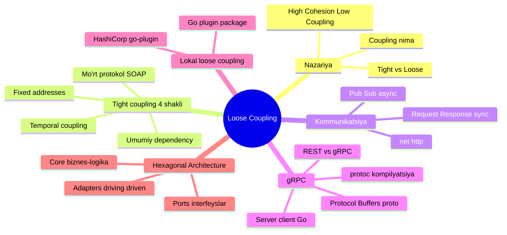
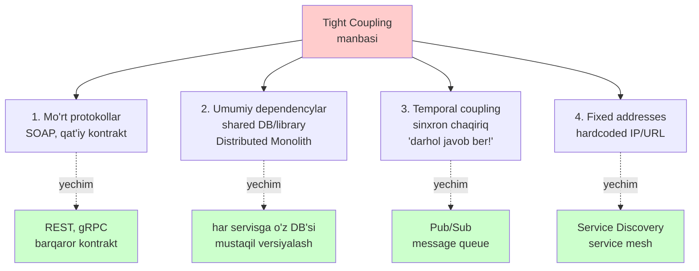
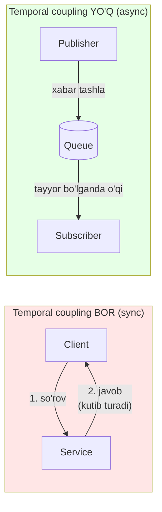
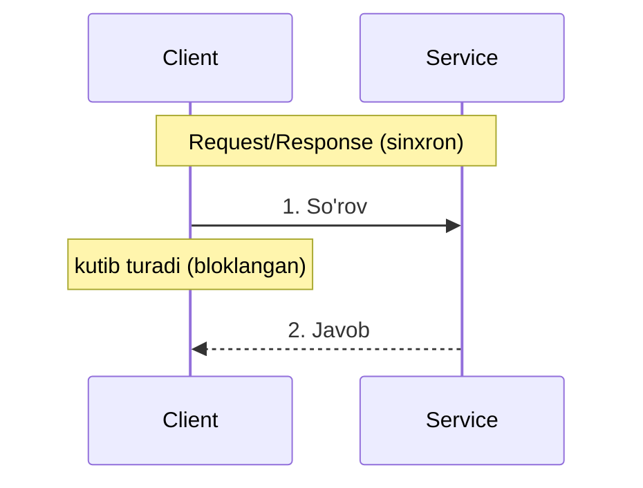
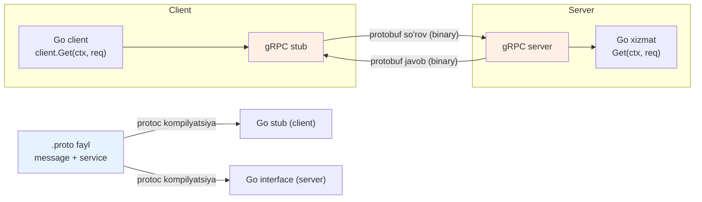
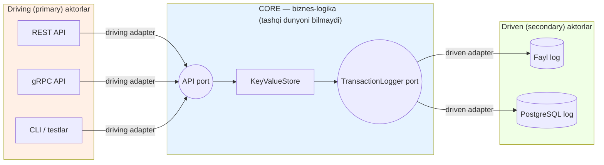

# Loose Coupling (Kuchsiz bog'liqlik)

> **TL;DR** — **Coupling** (bog'liqlik) — bu komponentlarning bir-birining ichki tuzilishini qanchalik "bilishi". **Tight coupling** (tesniy bog'liqlik) yomon: bir komponentni o'zgartirsang, boshqasi ham buziladi. **Loose coupling** (kuchsiz bog'liqlik) yaxshi: komponentlar bir-biri haqida minimal biladi va faqat **barqaror abstraksiya** (interface, kontrakt, protokol) orqali gaplashadi. Kitob (Cloud Native Go, Titmus) tight coupling'ning **4 shaklini** ajratadi: mo'rt protokollar (SOAP), umumiy dependencylar (shared DB/library — "distributed monolith"), vaqtdagi bog'liqlik (temporal coupling — sinxron chaqiriqlar), va qat'iy manzillar (fixed addresses). Yechim: barqaror kontraktli protokollar (**REST**, ayniqsa **gRPC** + protocol buffers), asinxron message-passing (**pub/sub**), plugin tizimlari va cho'qqi sifatida **hexagonal architecture** (ports & adapters) — bunda biznes-logika tashqi dunyoni umuman bilmaydi.

---

## Bu darsning xaritasi



---

## 1. Coupling nima va nega u muhim

### Muammo: nega bu kerak?

Tasavvur qil, sen bir microservice yozding. U to'g'ri ishlayapti. Bir kun ertalab qo'shni jamoa **o'z servisining** bir maydonining nomini o'zgartirdi — va sening serviseng qulab tushdi. Sen hech narsaga tegmagan eding. Bu **tight coupling**ning klassik og'rig'i: birovning kichik o'zgarishi seni majburan o'zgartiradi.

### Analogiya: Lego vs yelim

Ikki detalni ulashning ikki yo'li bor:

- **Lego** — standart tishlar orqali ulanadi. Bir detalni sug'urib olib, boshqasini qo'yasan. Bu **loose coupling**.
- **Yelim** — ikki detalni bir-biriga yopishtirasan. Endi bittasini almashtirmoqchi bo'lsang, ikkalasini ham sindirasan. Bu **tight coupling**.

> Farqi shundaki: Lego'da ulanish nuqtasi **standart** (barqaror abstraksiya), yelimda esa ulanish **detalning aynan shakliga** bog'langan (ichki tuzilishga bog'liqlik).

### Sodda ta'rif

> **Coupling** — komponentlar bir-birining ichki tuzilish tafsilotlarini qanchalik bilishi darajasi. **Loose coupling** — komponentlar bir-biri haqida minimal biladi va barqaror abstraksiya orqali muloqot qiladi.

Buni tekshirishning oddiy savoli bor:

> **Oltin savol:** Bitta komponentga qancha va qanaqa o'zgartirish kirita olaman, ular boshqa komponentga **salbiy ta'sir qilmasdan**?

Javob "ko'p" bo'lsa — loose coupling. "Deyarli hech qanaqa" bo'lsa — tight coupling.

### High Cohesion + Low Coupling ideali

Bu ikkita tushuncha har doim juft yuradi (bu haqda alohida dars ham bor — pastdagi "Takrorlash" bo'limiga qara):

| Tushuncha | Ma'nosi | Qoida |
|---|---|---|
| **Cohesion** (ichki bog'lanish) | Modul **ichidagi** qismlar bir-biriga qanchalik tegishli | **Yuqori** bo'lsin — modul bitta aniq ishni qilsin |
| **Coupling** (tashqi bog'lanish) | Modullar **orasidagi** bog'lanish darajasi | **Past** bo'lsin — modullar mustaqil bo'lsin |

> **Oltin qoida:** Modul **ichida** — high cohesion (har modul bitta ishni qiladi). Modullar **orasida** — low coupling (ular faqat interface/API orqali gaplashadi).

Coupling turlarini taqqoslash:

| Coupling turi | Tavsif | Misol |
|---|---|---|
| **Tight Coupling** | Modullar bir-birining ichki tuzilishiga qattiq bog'langan | A modul B modulning `struct`ini to'g'ridan-to'g'ri ishlatadi |
| **Loose Coupling** | Modullar faqat interface yoki signal orqali aloqa qiladi | A modul B modulga `Storage` interfeysi orqali murojaat qiladi |

Kod darajasidagi misol (Go): agar funksiyang `os.File`ni talab qilsa — u faylga **qattiq bog'langan**. Agar `io.Reader`ni talab qilsa — u fayl bilan ham, tarmoq bilan ham, xotira bilan ham ishlaydi. Ikkinchisi loose coupling.

> **Diqqat:** Ozgina coupling har doim ham yomon emas, ayniqsa loyihaning boshida. Abstraksiyani haddan tashqari ko'paytirib, muloqotni murakkablashtirib yuborish oson. **Erta optimizatsiya — barcha yovuzlikning ildizi.** Ba'zan tezlik kritik bo'lsa, abstraksiyani olib tashlab tight coupling qilish ataylab qilinadigan foydali optimizatsiya bo'lishi mumkin.

### Loose coupling'ning 5 afzalligi

1. **Mustaqil rivojlanish** — bir komponentdagi o'zgarish boshqalariga ta'sir qilmaydi
2. **Mustaqil deploy** — har bir komponentni alohida yangilash mumkin
3. **Moslashuvchanlik** — komponentni almashtirish oson (Lego kabi)
4. **Xatolikka chidamlilik** — bir komponent qulasa, butun tizim qulamaydi
5. **Masshtablilik** — har bir komponentni alohida scale qilish mumkin

#### 🤔 O'ylab ko'r

> Funksiyang `*bytes.Buffer` (konkret tip) qabul qiladi. Uni testda mock qilish qiyin. Nega? Va qaysi bitta o'zgarish buni oson qiladi?

<details>
<summary>💡 Javobni ko'rish</summary>

Konkret `*bytes.Buffer`ga bog'langaning uchun testda faqat aynan shu tipni bera olasan — mock qo'ya olmaysan. Agar parametrni **`io.Writer` interfeysiga** o'zgartirsang, testda istalgan soxta yozuvchini (fake writer) bera olasan. Bu — coupling'ni interface orqali kamaytirish. Interface = "yelim" o'rniga "Lego tishi".
</details>

---

## 2. Tight coupling'ning 4 shakli (kitob)

Distributed tizimda tight coupling paydo bo'lishining son-sanoqsiz yo'li bor, lekin ularning barchasida bitta umumiy ildiz bor: komponent boshqa komponentning **o'zgarmaydi deb noto'g'ri hisoblagan** biror xususiyatiga bog'lanadi. Kitob ularni 4 klassga guruhlaydi.



### 2.1 Mo'rt protokollar (fragile protocols)

**Muammo.** 1990-yillar oxirida **SOAP** (Simple Object Access Protocol) paydo bo'ldi. U kengaytiriluvchan bo'lishga mo'ljallangan edi va servislar mijozlar rioya qilishi shart bo'lgan **kontrakt** (XML tilida) taqdim etardi. Kontrakt g'oyasi o'sha davr uchun katta yutuq edi. Lekin amalda SOAP juda **mo'rt** chiqdi: agar kontrakt biror tarzda o'zgarsa, **barcha mijoz ilovalarini** ham o'zgartirishga to'g'ri kelardi. Ya'ni SOAP mijozlari o'z servislari bilan tesniy bog'langan edi.

**Analogiya.** SOAP kontrakti — bu ikki odam o'rtasidagi shunday shartnoma-ki, unda bitta so'zni o'zgartirsang, butun shartnoma bekor bo'ladi va qaytadan imzolash kerak. Yaxshi kontrakt esa — unga yangi band **qo'shsang** ham, eskilari ishlab turadigan kontrakt.

**Yechim.** SOAP tez unutildi, o'rniga **REST** keldi (yaxshiroq, lekin baribir tight coupling'ga olib kelishi mumkin). 2016-yilda Google **gRPC**ni chiqardi — u **protocol buffers** orqali oldinga va orqaga muvofiqlikni (forward/backward compatibility) saqlagan holda kontraktni o'zgartirishga ruxsat beradi.

> **Kalit fikr:** Yaxshi protokol serverni yangilashga imkon beradi, mijozlarni majburan yangilamasdan. SOAP buni qila olmasdi, gRPC qila oladi.

### 2.2 Umumiy dependencylar (shared dependencies) — Distributed Monolith

**Muammo.** 2016-yilda Facebook'dan Ben Christensen "**distributed monolith**" (taqsimlangan monolit) atamasini kiritdi. Bu antipattern shundaki: servislar bir-biri bilan ishlash uchun **muayyan library'lardan** — va ularning **muayyan versiyalaridan** — foydalanishga majbur. Bunday tizimlar shu qadar dependency bilan yuklangan-ki, library'ni yangilash **barcha servislarni bir vaqtda** yangilashni talab qiladi.

**Analogiya.** Tasavvur qil, uydagi hamma xonaning chirog'i bitta umumiy o'chirgichga ulangan. Bitta xonada lampochkani almashtirish uchun butun uyning tokini o'chirishga majbursan. "Mustaqil xonalar" — aslida bir-biriga bog'langan.

**Distributed monolith nima?** — Bu microservices asosidagi tizim, lekin ichida tesniy bog'langan servislar bor. Natijada:

- Bitta servisdagi kichik o'zgarish boshqalarida ham o'zgarish talab qiladi
- Servislarni mustaqil deploy qilib bo'lmaydi
- Bir komponentdagi xato butun tizimni qulatishi mumkin
- Rollback (orqaga qaytarish) amalda imkonsiz

> **Distributed monolith — eng yomon variant:** u microservices'ning **murakkabligini** va monolitning **bog'liqligini** birlashtiradi, lekin ikkalasining ham afzalliklarini yo'qotadi. Undan har qanday narx evaziga qoching.

**Yechim.** Servislar umumiy library orqali emas, **barqaror tarmoq kontrakti** (masalan gRPC) orqali gaplashsin. Har servisning o'z ma'lumotlar bazasi bo'lsin (shared DB — bu ham umumiy dependency).

### 2.3 Vaqtdagi bog'liqlik (temporal coupling)

**Muammo.** Ko'pincha tizimlar shunday loyihalanadi-ki, mijoz servisdan **darhol javob** kutadi. **Request/response** (so'rov/javob) shablonini ishlatadigan tizimlar servis **doim tayyor va zudlik bilan javob beradi** deb yashirin taxmin qiladi. Agar bu shunday bo'lmasa — so'rov muvaffaqiyatsiz tugaydi. Mijoz va servis **vaqt bo'yicha** tesniy bog'langan deyiladi.

**Analogiya.** Temporal coupling — bu telefon qo'ng'irog'i: ikkovingiz ham **ayni vaqtda** liniyada bo'lishingiz kerak. Loose variant — SMS/xat qoldirish: sen xabar tashlaysan, u tayyor bo'lganda o'qiydi.

**Muhim nuance:** Temporal coupling har doim ham yomon emas! Odam tez javob kutayotganda (masalan, veb-sahifa yuklanishi) — bu hatto kerak. Lekin javobga vaqt cheklovi bo'lmasa, xabarni **oraliq navbatga** (queue) yuborish xavfsizroq — qabul qiluvchi tayyor bo'lganda oladi. Bu **pub/sub** shabloni.



### 2.4 Qat'iy manzillar (fixed addresses)

**Muammo.** Microservices bir-biri bilan gaplashishi uchun avvalo bir-birini **topishi** kerak. An'anaviy dunyoda servislar tarmoqda qat'iy, hammaga ma'lum joyda turardi (dastlab `hosts.txt`, keyin DNS va URL). Bu **uzoq yashaydigan** servislar uchun yaxshi. Lekin cloud'da servis nusxasining umri **oy-yillar bilan emas, soniya-daqiqalar** bilan o'lchanadi (autoscaling, konteyner qayta ishga tushishi, deploy). Bunday dinamik muhitda hardcoded URL va an'anaviy DNS — shunchaki **yana bir tight coupling shakli**.

**Yechim.** **Service Discovery** — servislar bir-birini IP bo'yicha emas, **nom bo'yicha** topadi. Undan ham yuqoriroq — **service mesh** (Envoy, Linkerd, Istio, Consul): alohida qatlam ajratiladi, u servislar orasidagi muloqotni soddalashtiradi.

> Bu shakl alohida darsda chuqur ochilgan: **[Service Discovery](../3.%20Distributed%20Patterns/4.%20Service%20Discovery.md)** — u aynan fixed addresses muammosining yechimi.

#### ✅ Tezkor tekshir

> "Distributed monolith" nega oddiy monolitdan ham yomonroq bo'lishi mumkin?

<details>
<summary>💡 Javobni ko'rish</summary>

Oddiy monolit hech bo'lmaganda **bitta** deploy birligi — uni boshqarish sodda. Distributed monolit esa monolitning barcha bog'liqliklarini saqlaydi, lekin ustiga **tarmoq** murakkabligini (network latency, xatolik, tarqoq deploy, versiyalash) qo'shadi. Ya'ni: monolitning kamchiligi + microservices'ning murakkabligi, ammo ikkalasining afzalliklarisiz.
</details>

---

## 3. Servislararo kommunikatsiya: 2 ta shablon

Servislar gaplashishi uchun ular xabar tuzilishini belgilaydigan **kontrakt** (ochiq yoki yashirin) o'rnatishi kerak. Bu kontrakt zarur, lekin ayni paytda unga bog'liq komponentlarni bir-biriga bog'laydi. Protokoldan tashqari, message-passing'ning ikkita katta klassi bor:

| Xususiyat | Request/Response (sinxron) | Publish/Subscribe (asinxron) |
|---|---|---|
| **Yo'nalish** | Ikki tomonlama | Bir tomonlama |
| **Kim kimga** | Point-to-point (1 jo'natuvchi, 1 qabul) | Bus/queue orqali (ko'p qabul qiluvchi) |
| **Kutish** | So'rovchi javobni kutib turadi | Kutmaydi, davom etadi |
| **Misol** | HTTP, REST, gRPC unary | Kafka, RabbitMQ, event bus |
| **Temporal coupling** | Bor | Yo'q |
| **Qachon** | Tez javob kerak, aniq 1 qabul | Ko'p qabul, javob shoshilinch emas |



Request/response afzalligi — tushunish va amalga oshirish oson, u ko'p yillar "default" shablon bo'lgan (ayniqsa ommaviy servislar uchun). Kamchiligi — u point-to-point va so'rovchi jarayonni javob kelguncha to'xtatib turishga majbur qiladi.

Request/response'ning 3 asosiy realizatsiyasi:

- **REST** — qulay va oddiy, tashqi (external) servislar uchun ajoyib tanlov. HTTP ustiga qurilgan.
- **RPC** (Remote Procedure Call) — dastur boshqa manzil fazosida (ko'pincha boshqa kompyuterda) protsedura ishga tushiradi. Go'da standart `net/rpc` bor; ko'p tilli variantlari — Apache Thrift va **gRPC**.
- **GraphQL** — REST'ga alternativa, murakkab ma'lumotlar to'plami bilan ishlashda kuchli.

---

## 4. net/http bilan HTTP so'rovlar yuborish

HTTP — request/response'ning eng keng tarqalgan protokoli. Go'ning standart kutubxonasi `net/http` bir zo'r HTTP client va server implementatsiyasini beradi. Unda GET, HEAD, POST metodlari uchun yordamchi funksiyalar bor:

```go
// GET so'rovini yuboradi
func Get(url string) (*http.Response, error)
// HEAD so'rovini yuboradi
func Head(url string) (*http.Response, error)
```

Ikkalasi ham URL string qabul qiladi, error va `*http.Response` pointer qaytaradi. `http.Response` structi juda foydali — unda status kodi va javob tanasi bor:

```go
type Response struct {
    Status        string        // masalan "200 OK"
    StatusCode    int           // masalan 200
    Header        Header        // sarlavhalar
    Body          io.ReadCloser // javob tanasi (stream!)
    ContentLength int64         // -1 = noma'lum
    Request       *Request
}
```

`Body` — bu `io.ReadCloser`, ya'ni javob **oqim (stream) rejimida** o'qiladi va uni **yopish (Close) shart**.

### To'liq GET misoli

```go
package main

import (
    "fmt"
    "io"
    "net/http"
)

func main() {
    // --- 1-qadam: GET so'rovini yuboramiz ---
    resp, err := http.Get("http://example.com")
    if err != nil {
        panic(err)
    }

    // --- 2-qadam: javob tanasini yopishni REJALASHTIRAMIZ (juda muhim!) ---
    defer resp.Body.Close()

    // --- 3-qadam: butun tanani []byte sifatida o'qiymiz ---
    body, err := io.ReadAll(resp.Body)
    if err != nil {
        panic(err)
    }

    // --- 4-qadam: chop etamiz ---
    fmt.Println(string(body))
}
```

**Output** (qisqartirilgan):
```
<!doctype html>
<html>
<head><title>Example Domain</title></head>
...
```

### ⚠️ Ko'p uchraydigan xato: Body.Close() ni unutish

**Noto'g'ri tasavvur:** "Javobni o'qib bo'ldim, hammasi tugadi." **Nega noto'g'ri:** `Body` — bu ochiq tarmoq ulanishi. Uni yopmasang, ulanish va xotira **oqib ketadi** (memory/connection leak). **To'g'risi:** javobni olganingdan keyin **darhol** `defer resp.Body.Close()` yoz.

### ⚠️ Ko'p uchraydigan xato: DefaultClient timeout'i 0

`http.Get`, `http.Post` kabi yordamchi funksiyalar aslida `http.DefaultClient`ni chaqiradi. Uning **timeout qiymati 0** — Go buni "**timeout yo'q**" deb tushunadi. Agar server javob bermay, ulanishni ham yopmay tursa — bu ayniqsa yomon, aniqlanmaydigan xotira oqishiga olib keladi.

**To'g'risi:** o'z clientingni yaratib, timeout o'rnat:

```go
var client = &http.Client{
    Timeout: time.Second * 10, // 10 soniyadan keyin uzadi
}
response, err := client.Get(url)
```

> **Kalit qoida:** Productionda hech qachon `http.DefaultClient`ga ishonma — har doim timeout'li o'z client'ingni yarat.

POST uchun `http.Post(url, contentType, body io.Reader)` va `http.PostForm` bor — ular ham xuddi shu tarzda `io.Reader` orqali tanani qabul qiladi.

---

## 5. gRPC — chuqur

### Nega gRPC?

**Muammo.** REST qulay, lekin: JSON matni katta va sekin parse bo'ladi, tiplar qat'iy emas (typo — runtime xato), har bir endpoint uchun qo'lda validatsiya yozasan. Katta traffik va microservices orasidagi ichki muloqotda bu qimmatga tushadi.

**gRPC nima?** — Google yaratgan, ko'p tilli, samarali RPC framework. REST **eng yaxshi amaliyotlar to'plami** bo'lsa, gRPC — **to'laqonli framework**: u mijozga boshqa tizimdagi funksiyani xuddi **lokal funksiya** kabi chaqirishga imkon beradi.

**Analogiya.** REST — bu pochta orqali xat yozish: konvert, marka, manzil, ochib o'qish — hammasini o'zing qilasan. gRPC — bu telefondan raqamni terib, odamni to'g'ridan-to'g'ri chaqirish: raqamni tergan zahoting u "lokalda"day gaplashaveradi, qolgan mexanikani framework hal qiladi.

gRPC afzalliklari REST ustidan:

- **Ixchamlik** — xabarlar kompakt binary format, kam tarmoq I/O (JSON'dan ~75% kichikroq bo'lishi mumkin)
- **Tezlik** — binary format tez parse bo'ladi
- **Qat'iy tiplilik** — xabarlar strongly typed, ko'p xatolarni yo'q qiladi
- **Ko'pfunksiyalilik** — autentifikatsiya, shifrlash, timeout, siqish tayyor holda

Kamchiliklari:

- **Kontraktga asoslangan** — tashqi (external) servislar bilan ishlashda noqulayroq
- **Binary format** — inson o'qiy olmaydi, debug/tekshirish qiyinroq

### gRPC umumiy oqimi



Kalit g'oya: `.proto` fayl **yagona haqiqat manbasi** (single source of truth). `protoc` kompilyatori undan ikki tomon uchun Go kodini generatsiya qiladi — **client stub** (mijoz uchun soxta funksiyalar) va **server interface** (server implementatsiya qilishi kerak bo'lgan kontrakt).

### 5.1 Protocol Buffers — message ta'rifi (.proto)

**Protocol buffers** — tildan mustaqil, strukturalangan ma'lumotlarni serializatsiya qilish mexanizmi. Uni **XML'ning binary versiyasi** deb o'ylash mumkin. Ma'lumotlar **message**larga (yozuvlarga) tuziladi, har message'da nom/qiymat juftliklari — **field**lar bo'ladi.

Birinchi qadam — `.proto` faylda message tuzilishini belgilash:

```protobuf
syntax = "proto3";
option go_package = "github.com/cloud-native-go/ch08/point";

// Point — 2 o'lchamli tekislikdagi nuqta (podpisli)
message Point {
  int32 x = 1;
  int32 y = 2;
  string label = 3;
}

// Line — boshlang'ich va oxirgi Point'larni saqlaydi
message Line {
  Point start = 1;
  Point end = 2;
  string label = 3;
}

// Polyline — ixtiyoriy sondagi (0 ham) Point'larni saqlaydi
message Polyline {
  repeated Point point = 1;
  string label = 2;
}
```

Diqqat qiling:

- **1-qator** `syntax = "proto3"` — sintaksis versiyasi. Yozmasang, kompilyator proto2 deb hisoblaydi. Bu birinchi izohsiz qator bo'lishi shart.
- **2-qator** `option go_package` — generatsiya qilingan kod joylashadigan Go paketiga to'liq yo'l.
- Har field'da **field raqami** bor (`= 1`, `= 2`...). Bu raqamlar binary formatda field'ni **identifikatsiya** qiladi.
- `repeated` — bu field bir nechta qiymat saqlashini bildiradi (massiv/slice kabi).

> **⚠️ Field raqami = tight coupling xavfi!** Field raqamlari ishlatilgandan keyin **hech qachon o'zgartirilmasligi kerak** — aks holda eski mijozlar buzuq ma'lumot o'qiydi. Aynan shuning uchun protocol buffers field'ni **`reserved`** (band) deb belgilashni qo'llab-quvvatlaydi, toki uni tasodifan qayta ishlatib bo'lmasin. Bu barqaror kontraktni saqlashning kaliti.

### 5.2 Key-value store uchun message'lar

Kitobning asosiy misoli — 5-bobda boshlangan **key-value store**ni gRPC bilan kengaytirish. Get, Put, Delete uchun message'lar:

```protobuf
syntax = "proto3";
option go_package = "github.com/cloud-native-go/ch08/keyvalue";

// Kalit bo'yicha qiymat so'raladi
message GetRequest {
  string key = 1;
}
message GetResponse {
  string value = 1;
}

// Kalit bilan qiymat saqlanadi
message PutRequest {
  string key = 1;
  string value = 2;
}
message PutResponse {}   // bo'sh — qaytariladigan maxsus narsa yo'q

// Kalit bo'yicha element o'chiriladi
message DeleteRequest {
  string key = 1;
}
message DeleteResponse {}
```

Diqqat: `*Request` — mijozdan serverga boradigan xabarlar, `*Response` — serverdan mijozga. **Error/status maydonlari qo'shilmagan** — chunki ular gRPC funksiyalari tomonidan mijoz tarafda avtomatik qaytariladi (bu haqda pastroqda).

### 5.3 Service (metodlar) ta'rifi

Message'lar (otlar) tayyor. Endi ularni ishlatadigan **metodlarni** (fe'llarni) `rpc` kalit so'zi bilan belgilaymiz — xuddi shu `keyvalue.proto` fayliga qo'shamiz:

```protobuf
service KeyValue {
  rpc Get(GetRequest) returns (GetResponse);
  rpc Put(PutRequest) returns (PutResponse);
  rpc Delete(DeleteRequest) returns (DeleteResponse);
}
```

Bu yerda faqat **interface** ta'riflanadi, funksiyalar hali implementatsiya qilinmaydi. Bularning barchasi **unary** RPC — mijoz 1 so'rov yuboradi, 1 javob oladi (eng oddiy tur; streaming variantlari ham bor, lekin bu yerda ko'rmaymiz).

### 5.4 protoc bilan kompilyatsiya

Avval kompilyatorni o'rnatish kerak (MacOS misoli):

```bash
brew install protobuf
protoc --version              # versiya 3+ bo'lsin

# Go plagini
go install google.golang.org/protobuf/cmd/protoc-gen-go
```

Keyin `.proto` faylni kompilyatsiya qilamiz:

```bash
protoc --proto_path=$SOURCE_DIR \
    --go_out=$DEST_DIR --go_opt=paths=source_relative \
    --go-grpc_out=$DEST_DIR --go-grpc_opt=paths=source_relative \
    $SOURCE_DIR/keyvalue.proto
```

Natijada **ikki fayl** hosil bo'ladi:
- `keyvalue.pb.go` — message tiplari (struct'lar)
- `keyvalue_grpc.pb.go` — server interface va client stub'lar

`paths=source_relative` flagi chiqish fayllarini kirish fayl yonidagi katalogga qo'yadi.

### 5.5 gRPC serverni implementatsiya qilish

Kompilyator `keyvalue_grpc.pb.go`da server interface generatsiya qiladi:

```go
type KeyValueServer interface {
    Get(context.Context, *GetRequest) (*GetResponse, error)
    Put(context.Context, *PutRequest) (*PutResponse, error)
    Delete(context.Context, *DeleteRequest) (*DeleteResponse, error)
}
```

Har metod `context.Context` va so'rov pointerini oladi, javob pointeri va error qaytaradi. Serverni yozish (qisqartirilgan — faqat Get):

```go
package main

import (
    "context"
    "log"
    "net"
    pb "github.com/cloud-native-go/ch08/keyvalue"
    "google.golang.org/grpc"
)

// --- 1-qadam: server struct pb.Unimplemented...ni EMBED qilishi SHART ---
type server struct {
    pb.UnimplementedKeyValueServer
}

// --- 2-qadam: metodni implementatsiya qilamiz ---
func (s *server) Get(ctx context.Context, r *pb.GetRequest) (*pb.GetResponse, error) {
    log.Printf("Received GET key=%v", r.Key)
    value, err := Get(r.Key)               // 5-bobda yozilgan lokal Get
    return &pb.GetResponse{Value: value}, err
}

func main() {
    // --- 3-qadam: gRPC server yaratib, KeyValueServer'ni ro'yxatga olamiz ---
    s := grpc.NewServer()
    pb.RegisterKeyValueServer(s, &server{})

    // --- 4-qadam: portni ochib, qabul siklini boshlaymiz ---
    lis, err := net.Listen("tcp", ":50051")
    if err != nil {
        log.Fatalf("failed to listen: %v", err)
    }
    if err := s.Serve(lis); err != nil {
        log.Fatalf("failed to serve: %v", err)
    }
}
```

**4 qadam:**

1. **`server` struct** `pb.UnimplementedKeyValueServer`ni **embed** qiladi — bu **majburiy**. gRPC buni talab qiladi.
2. **Metodlarni** implementatsiya qilamiz. Embed qilingan struct barcha metodlarga "implementatsiya qilinmagan" (unimplemented) default versiyalarni beradi — shuning uchun hammasini birdan yozish shart emas.
3. **Ro'yxatga olish** — `main`da server nusxasini yaratib, gRPC frameworkiga qayd etamiz.
4. **Qabul sikli** — `net.Listen` bilan portni ochib, `s.Serve`ga beramiz.

> **Notional machine:** `pb.UnimplementedKeyValueServer`ni embed qilganingda, sening `server` structing avtomatik ravishda barcha metodlarni "meros" qilib oladi — ular default'da "not implemented" xatosini qaytaradi. Sen faqat kerakli metodlarni **override** qilasan. Bu Go'ning kompozitsiya (embedding) mexanizmi: yangi metod qo'shilsa ham, eski serverlar kompilyatsiyadan tushmaydi.

### 5.6 gRPC clientni implementatsiya qilish

Client kodi **to'liq avtomatik generatsiya** qilinadi — ishlatish juda oson. Generatsiya qilingan client interface:

```go
type KeyValueClient interface {
    Get(ctx context.Context, in *GetRequest, opts ...grpc.CallOption) (*GetResponse, error)
    Put(ctx context.Context, in *PutRequest, opts ...grpc.CallOption) (*PutResponse, error)
    Delete(ctx context.Context, in *DeleteRequest, opts ...grpc.CallOption) (*DeleteResponse, error)
}
```

Client kodi (qisqartirilgan):

```go
func main() {
    // --- 1-qadam: gRPC serverga ulanamiz ---
    conn, err := grpc.Dial("localhost:50051",
        grpc.WithInsecure(), grpc.WithBlock(), grpc.WithTimeout(time.Second))
    if err != nil {
        log.Fatalf("did not connect: %v", err)
    }
    defer conn.Close()

    // --- 2-qadam: client nusxasini olamiz ---
    client := pb.NewKeyValueClient(conn)

    // --- 3-qadam: context orqali 1 soniya timeout o'rnatamiz ---
    ctx, cancel := context.WithTimeout(context.Background(), time.Second)
    defer cancel()

    // --- 4-qadam: metodni LOKAL funksiya kabi chaqiramiz ---
    r, err := client.Get(ctx, &pb.GetRequest{Key: "foo"})
    if err != nil {
        log.Fatalf("could not get value: %v", err)
    }
    log.Printf("Get returns: %s", r.Value)
}
```

`grpc.Dial` parametrlari:

- **`WithInsecure`** — transport xavfsizligini o'chiradi. **Productionda ishlatma!**
- **`WithBlock`** — ulanish o'rnatilguncha `Dial`ni bloklaydi (aks holda fonda o'rnatiladi)
- **`WithTimeout`** — belgilangan vaqtda ulanmasa, error qaytaradi

> **Kalit fikr:** `client.Get(...)` xuddi **oddiy lokal funksiya** kabi ko'rinadi va ishlaydi. Status kodlarini tekshirish, o'z clientingni yasash yoki boshqa murakkab operatsiyalar shart emas — hammasini gRPC framework qiladi. Aynan shu — RPC'ning kuchi.

### 5.7 REST vs gRPC — qachon qaysi biri?

| Mezon | REST | gRPC |
|---|---|---|
| **Format** | JSON/matn (inson o'qiydi) | Protobuf (binary, tez) |
| **Tezlik** | Sekinroq | ~2.5x throughput, past latency |
| **Tiplilik** | Bo'sh (schema ixtiyoriy) | Qat'iy (strongly typed) |
| **Transport** | HTTP/1.1 (odatda) | HTTP/2 (multiplexing) |
| **Streaming** | Faqat unary | Unary + client/server/bidi streaming |
| **Kod generatsiya** | Qo'lda yoki OpenAPI | Avtomatik (protoc), ko'p til |
| **Brauzer** | To'g'ridan-to'g'ri | Yo'q (gRPC-Web kerak) |
| **Debug** | Oson (curl, browser) | Qiyinroq (binary) |

**REST'ni tanla:**
- Ommaviy (public) API — tashqi dasturchilar oson integratsiya qilsin
- Oddiy CRUD operatsiyalar
- Brauzer/mijoz ilovalari

**gRPC'ni tanla:**
- Microservices orasidagi **ichki** muloqot (past latency, yuqori throughput)
- Real-time, streaming, IoT
- Ko'p tilli tizim (kod generatsiya foydasi)

> **Amaliy qoida:** tashqariga qaragan chegara — REST/GraphQL, ichki servislararo — gRPC. Ko'p tizimlar **ikkalasini** ham ishlatadi (hexagonal architecture buni oson qiladi — pastga qara).

---

## 6. Lokal resurslarni plugin orqali kuchsiz bog'lash

Loose coupling faqat tarmoq uchun emas. Ko'pincha **lokal** resurslarni ham almashtiriladigan qilish foydali: masalan, servis turli manbalardan (REST, gRPC, chatbot) ma'lumot qabul qilsin yoki turli xil chiqish (log) generatsiya qilsin. **Plugin** — bu g'oyaning eng dinamik ko'rinishi.

### 6.1 Go'ning standart `plugin` paketi

Go'da `plugin` paketi bor. Go plugin'lariga **3 ta talab**:

1. `main` paketida bo'lishi
2. bir yoki bir nechta funksiya/o'zgaruvchini eksport qilishi
3. `-buildmode=plugin` flagi bilan kompilyatsiya qilinishi

Plugin lug'ati:

| Termin | Ma'nosi |
|---|---|
| **Plugin** | `-buildmode=plugin` bilan kompilyatsiya qilingan `main` paketi |
| **Open** | Plugin'ni xotiraga yuklash, tekshirish, eksport simvollarini aniqlash |
| **Symbol** | Plugin eksport qilgan istalgan funksiya/o'zgaruvchi (`type Symbol interface{}`) |
| **Lookup** | Simvolni nomi bo'yicha topib olish |

Plugin foydali bo'lishi uchun uni chaqiradigan kod qanday simvolni qidirishni va u qaysi **kontraktga** (interface) mos kelishini bilishi kerak. Misolda plugin bitta `Animal` simvolini eksport qiladi, u `Sayer` interfeysiga mos:

```go
type Sayer interface {
    Says() string
}
```

Plugin kodi (`duck/duck.go`):

```go
package main

type duck struct{}

func (d duck) Says() string {
    return "quack!"
}

// Animal — eksport qilinadigan simvol
var Animal duck
```

Kompilyatsiya:

```bash
go build -buildmode=plugin -o duck/duck.so duck/duck.go
```

Natijada `.so` (shared library, ELF/Mach-O formatda) fayl hosil bo'ladi. Plugin'ni ishlatish (asosiy dastur):

```go
// --- 1-qadam: plugin faylini topamiz ---
name := os.Args[1]
module := fmt.Sprintf("./%s/%s.so", name, name)

// --- 2-qadam: plugin'ni ochamiz (xotiraga yuklaymiz) ---
p, err := plugin.Open(module)
if err != nil {
    log.Fatal(err)
}

// --- 3-qadam: "Animal" simvolini qidiramiz ---
symbol, err := p.Lookup("Animal")
if err != nil {
    log.Fatal(err)
}

// --- 4-qadam: simvolni Sayer interfeysiga tekshiramiz va ishlatamiz ---
animal, ok := symbol.(Sayer)
if !ok {
    log.Fatal("that's not a Sayer")
}
fmt.Printf("A %s says: %q\n", name, animal.Says())
```

**Output:**
```
$ go run main/main.go duck
A duck says: "quack!"
$ go run main/main.go frog
A frog says: "ribbit!"
```

> **Kalit fikr:** Asosiy dastur plugin'lar haqida **kompilyatsiya vaqtida** hech narsa bilmaydi. Keyinroq istalgan plugin yozib, asosiy kodni o'zgartirmasdan qo'sha olasan. Bu — loose coupling'ning dinamik ko'rinishi.

### ⚠️ Go plugin paketining jiddiy cheklovlari

**Noto'g'ri tasavvur:** "Go plugin'lari — universal kengaytirish mexanizmi." **Nega noto'g'ri:** ular juda ko'p cheklovga ega:

1. Faqat **Linux, FreeBSD, MacOS**da ishlaydi (Windows yo'q)
2. Plugin va asosiy dastur **aynan bir xil Go versiyasi** bilan kompilyatsiya qilinishi shart
3. Ishlatilgan barcha paketlarning versiyalari ham mos kelishi kerak
4. `CGO_ENABLED` majburan yoqiladi — cross-kompilyatsiya qiyinlashadi

**To'g'risi:** shu cheklovlar sababli Go plugin'lari **tarqatiladigan** (distributable) plugin'lar uchun mos emas — ular asosan **bitta kod bazasi** ichida ishlatilganda foydali.

### 6.2 HashiCorp go-plugin (RPC orqali)

2016-yilda HashiCorp Go uchun o'z plugin tizimini yaratdi. Go plugin'lari shared library'ga kompilyatsiya qilinsa, **HashiCorp plugin'lari alohida jarayon** (process) sifatida ishlaydi va `exec.Command` orqali ishga tushiriladi.

Bu yondashuvning aniq afzalliklari:

- **Asosiy jarayonni qulata olmaydi** — alohida process, plugin qulasa iste'molchi qulamaydi
- **Versiyaga chidamli** — faqat kontraktga mos kelishi kerak; aniq protokol versiyalashni qo'llab-quvvatlaydi
- **Nisbatan xavfsiz** — plugin faqat unga berilgan interface va parametrlarga kira oladi, iste'molchining manzil fazosiga emas

Kamchiliklari:

- **Ko'proq shablon kod** (boilerplate) yozish kerak
- **Sekinroq** — barcha muloqot RPC orqali boradi

Muloqot **RPC** orqali borgani uchun har tomon soxta (stub) kod bilan ishlaydi: `SayerRPC` (client tarafda RPC chaqiruvchi) va `SayerRPCServer` (server tarafda haqiqiy implementatsiyani chaqiruvchi). Ular umumiy `commons` paketda turadi (interface + handshake config), toki iste'molchi va plugin ular haqida kelishib olsin. **HandshakeConfig** — ulanish "paroli": versiyalar mos kelmasa, aniq xato beradi.

> **Solishtir:** Go plugin — tez, lekin mo'rt (versiya sezgir, bir process). HashiCorp plugin — sekinroq va ko'p kod, lekin mustahkam (alohida process, versiyaga chidamli, xavfsizroq). Tanlov — tezlik yoki mustahkamlik.

---

## 7. Hexagonal Architecture (Ports & Adapters) — loose coupling cho'qqisi

### Nega bu kerak?

**Muammo.** Sen key-value store yozding. Bugun u REST orqali ishlaydi, ma'lumotni faylga saqlaydi. Ertaga boshliq "gRPC ham qo'sh, ma'lumotni PostgreSQL'ga saqla" deydi. Agar REST/gRPC va fayl/DB logikasi biznes-logika bilan **aralashib ketgan** bo'lsa — hamma joyni qayta yozasan. Bu og'riq.

**Yechim.** **Hexagonal architecture** (yoki **ports & adapters**) — Alistair Cockburn yaratgan arxitektura shabloni. U loose coupling va inversion of control'ni markaziy falsafa qilib qo'yadi: **biznes-logika tashqi dunyoni umuman bilmaydi.** U faqat kuchsiz bog'langan **portlar** va kontekstga bog'liq **adapterlar** orqali ishlaydi.

> **Oltin qoida:** Hexagonal architecture'da barcha bog'liqliklar **ichkariga** yo'naltirilgan. Yadro (core) tashqi dunyoni bilmaydi; adapterlar yadroga qanday ma'lumot uzatishni biladi; portlar tashqi aktorlar bilan qanday gaplashishni biladi.

> **Nomi haqida:** "Hexagonal" (olti burchak) so'zi aslida **hech narsa anglatmaydi**. Cockburn shunchaki chizishda yon-atrofga adapterlarni joylashga joy ko'p bo'lsin deb olti burchak tanlagan. Muhimi shakl emas — **bog'liqlik yo'nalishi**.

### Analogiya: kompyuter va USB portlari

Kompyuterni tasavvur qil. Uning ichida **protsessor** (biznes-logika) bor. U tashqi dunyo bilan **USB portlari** (ports) orqali gaplashadi. USB'ga sichqoncha, klaviatura, disk — istalgan **qurilma** (adapter) ulaysan. Protsessor sichqoncha qaysi firma ekanini bilmaydi — u faqat "USB kontrakti"ni biladi. Qurilmani almashtirasan — protsessor o'zgarmaydi. Aynan shu — hexagonal architecture.

### Uch komponent



| Komponent | Ma'nosi | Kim boshqaradi |
|---|---|---|
| **Core** (yadro) | Butun biznes-logika. Hech qanaqa texnologiya/framework'ga bog'lanmaydi | — |
| **Ports** (portlar) | Interfeyslar — aktorlar yadroga "ulanadi" | Kontrakt belgilaydi |
| **Adapters** (adapterlar) | Portga ulanib, yadro va aktor orasida signal uzatadi | Konkret texnologiya |

**Ikki xil port/adapter** (Cockburn terminologiyasi):

| Tur | Boshqa nomi | Kim boshqaradi | Misol |
|---|---|---|---|
| **Driving** (primary) | Inbound | Aktor **ilovani** boshqaradi | REST, gRPC, CLI, testlar |
| **Driven** (secondary) | Outbound | Ilova **aktorni** boshqaradi | Ma'lumotlar bazasi, message queue, fayl |

An'anaviy qatlamli arxitekturada barcha bog'liqliklar **bir yo'nalishda** (yuqoridan pastga). Hexagonal'da esa hammasi **ichkariga** yo'naltirilgan — bu asosiy farq.

### Key-value store'ni hexagonal qilib refactoring

Kitob 5-bobdagi key-value store'ni qayta tashkil qiladi. Struktura:

```
ch08/hexarch/
├── core/
│   └── core.go          # biznes-logika, TASHQI dependency YO'Q
├── frontend/
│   ├── grpc.go          # driving adapter (gRPC)
│   └── rest.go          # driving adapter (REST)
├── transact/
│   ├── filelogger.go    # driven adapter (fayl)
│   └── pglogger.go      # driven adapter (PostgreSQL)
└── main.go              # hammani ulaydi
```

- **`core`** — asosiy logika. Muhim: standart kutubxonadan tashqari **hech qanaqa dependency yo'q**.
- **`frontend`** — REST va gRPC **driving** adapterlari. Ular core'ga bog'liq.
- **`transact`** — fayl va PostgreSQL **driven** adapterlari. Ular ham core'ga bog'liq.
- **`main.go`** — core nusxasini yaratib, driven komponentlarni unga uzatadi, so'ng core'ni driving adapterlarga uzatadi.

#### Driven port: TransactionLogger (yadro ichida)

Bu port — yadro **boshqaradigan** narsa, shuning uchun interface yadro (`core`) ichida turadi:

```go
package core

// Driven port: yadro bu interface'ni CHAQIRADI
type TransactionLogger interface {
    WriteDelete(key string)
    WritePut(key, value string)
}

type KeyValueStore struct {
    m        map[string]string
    transact TransactionLogger   // <-- PORT
}

// Konstruktor orqali dependency injection
func NewKeyValueStore(tl TransactionLogger) *KeyValueStore {
    return &KeyValueStore{
        m:        make(map[string]string),
        transact: tl,
    }
}

func (store *KeyValueStore) Put(key, value string) error {
    store.m[key] = value
    store.transact.WritePut(key, value)   // portga signal
    return nil
}

func (store *KeyValueStore) Delete(key string) error {
    delete(store.m, key)
    store.transact.WriteDelete(key)
    return nil
}
```

Diqqat: `Put`/`Delete` endi **toza funksiya emas**, ular `KeyValueStore` structining metodlari. `KeyValueStore` ichida `TransactionLogger` **port**i bor — konkret fayl yoki DB'ni bilmaydi, faqat interface'ni biladi.

#### Driven adapter'ni tanlash: factory funksiya

Qaysi adapter'ni yuklashni qanday hal qilamiz? Go'da murakkab dependency injection annotatsiyalari yo'q. Eng ko'p ishlatiladigan yo'l — **factory funksiya**:

```go
func NewTransactionLogger(logger string) (core.TransactionLogger, error) {
    switch logger {
    case "file":
        return NewFileTransactionLogger(os.Getenv("TLOG_FILENAME"))
    case "postgres":
        return NewPostgresTransactionLogger(/* DB params */)
    case "":
        return nil, fmt.Errorf("transaction logger type not defined")
    default:
        return nil, fmt.Errorf("no such transaction logger %s", logger)
    }
}
```

Adapter qo'shish uchun kodni o'zgartirish kerak, lekin o'zgarish **bitta oson topiladigan joy** bilan cheklanadi. (Muqobil — plugin ishlatish, lekin amalda factory funksiya ko'proq qo'llaniladi.)

#### Driving port: FrontEnd (yadro tashqarisida)

REST va gRPC — bu yadroni **boshqaradigan** (driving) aktorlar. Ularni umumiy `FrontEnd` portiga moslashtiramiz:

```go
package frontend

// Driving port: aktor yadroni boshqaradi
type FrontEnd interface {
    Start(kv *core.KeyValueStore) error
}
```

`Start` metodi yadro API'sini (`*core.KeyValueStore`) qabul qiladi. REST adapter'i:

```go
package frontend

type restFrontEnd struct {
    store *core.KeyValueStore   // yadroga havola
}

func (f *restFrontEnd) Start(store *core.KeyValueStore) error {
    f.store = store
    r := mux.NewRouter()
    r.HandleFunc("/v1/{key}", f.keyValueGetHandler).Methods("GET")
    r.HandleFunc("/v1/{key}", f.keyValuePutHandler).Methods("PUT")
    r.HandleFunc("/v1/{key}", f.keyValueDeleteHandler).Methods("DELETE")
    return http.ListenAndServe(":8080", r)
}
```

Ilgari `main`da bo'lgan sozlash logikasi endi `Start` metodiga ko'chdi. gRPC adapter'i ham xuddi shu `FrontEnd` interfeysiga moslanadi.

#### Hammasini ulash: main.go

```go
func main() {
    // --- 1-qadam: DRIVEN adapter (TransactionLogger) yaratamiz ---
    //     U yadroga UZATILADI (yadro uni boshqaradi)
    tl, err := transact.NewTransactionLogger(os.Getenv("TLOG_TYPE"))
    if err != nil {
        log.Fatal(err)
    }

    // --- 2-qadam: CORE (yadro) yaratamiz, driven adapter'ni beramiz ---
    store := core.NewKeyValueStore(tl)
    store.Restore()

    // --- 3-qadam: DRIVING adapter (frontend) yaratamiz ---
    //     Yadro API'sini UNGA uzatamiz (u yadroni boshqaradi)
    fe, err := frontend.NewFrontEnd(os.Getenv("FRONTEND_TYPE"))
    if err != nil {
        log.Fatal(err)
    }

    // --- 4-qadam: qabul siklini boshlaymiz ---
    log.Fatal(fe.Start(store))
}
```

**Bog'liqlik yo'nalishi — kalit:**

- **Driven** adapter (TransactionLogger) **yadroga uzatiladi** — chunki yadro uni boshqaradi
- **Driving** adapter (FrontEnd) **yadroni oladi** — chunki u yadroni boshqaradi

> **Notional machine:** `core` paketi `frontend` yoki `transact` paketlarini **import qilmaydi** — aksincha, ular `core`ni import qiladi. Bog'liqlik grafida barcha o'q yadroga qarab yo'naladi. Shuning uchun yadroni testda REST/gRPC va DB'siz, faqat soxta (mock) logger bilan sinash mumkin. Environment o'zgaruvchisini (`TLOG_TYPE`, `FRONTEND_TYPE`) almashtirib, kodga tegmasdan fayl → PostgreSQL yoki REST → gRPC ga o'tasan.

#### 🤔 O'ylab ko'r

> Nega REST adapteri yadroni parametr sifatida **oladi**, lekin TransactionLogger adapteri aksincha yadroga **uzatiladi**? Yo'nalish nega teskari?

<details>
<summary>💡 Javobni ko'rish</summary>

Chunki **kim kimni boshqaradi** degan savol javobi teskari:

- **REST (driving)** — u yadroni **boshqaradi**: so'rov keladi → yadroning `Put`/`Get`ini chaqiradi. Shuning uchun REST'ga yadro API'si (`*KeyValueStore`) beriladi.
- **TransactionLogger (driven)** — uni **yadro boshqaradi**: yadro `Put` qilganda logger'ning `WritePut`ini chaqiradi. Shuning uchun logger yadroga beriladi.

Ikkala holatda ham **bog'liqlik ichkariga** — yadro tomon yo'naladi. Bu inversion of control'ning mohiyati.
</details>

---

## 8. Interview savollari

**1. Tight va loose coupling'ni bir jumlada farqlang. Loose coupling'ni qanday o'lchaysiz?**

<details>
<summary>💡 Javob</summary>

Tight coupling — komponentlar bir-birining ichki tuzilishini biladi va unga bog'langan; loose coupling — ular faqat barqaror abstraksiya (interface/kontrakt) orqali gaplashadi. O'lchash savoli: "Bitta komponentga qancha o'zgartirish kirita olaman, boshqasiga salbiy ta'sir qilmasdan?" Javob "ko'p" bo'lsa — loose.
</details>

**2. "Distributed monolith" nima va u nega paydo bo'ladi?**

<details>
<summary>💡 Javob</summary>

Bu microservices asosidagi tizim, lekin ichida tesniy bog'langan servislar bor — masalan, umumiy library/versiyaga yoki shared DB'ga bog'liqlik orqali. Bir servisni yangilash boshqalarni ham majburan yangilashni talab qiladi, mustaqil deploy imkonsiz. Natijada microservices'ning murakkabligi + monolitning bog'liqligi, lekin afzalliklarisiz. Sabab: servislar barqaror tarmoq kontrakti o'rniga umumiy kod/ma'lumot orqali bog'lanadi.
</details>

**3. gRPC REST'dan qanday afzalliklarga ega va qachon REST'ni tanlaysiz?**

<details>
<summary>💡 Javob</summary>

gRPC: kompakt binary format (protobuf), tezroq, qat'iy tiplilik, HTTP/2 streaming, avtomatik kod generatsiya, tayyor auth/timeout/compression. REST'ni tanlaymiz: ommaviy API (tashqi dasturchilar), oddiy CRUD, brauzer mijozlari, oson debug kerak bo'lganda. Odatda: tashqi chegara — REST, ichki servislararo — gRPC.
</details>

**4. Protocol buffers'da field raqamlari nega muhim va nega ularni o'zgartirmaslik kerak?**

<details>
<summary>💡 Javob</summary>

Field raqamlari binary formatda field'ni identifikatsiya qiladi (nom emas, raqam saqlanadi). Raqamni o'zgartirsang yoki qayta ishlatsang, eski mijozlar buzuq ma'lumot o'qiydi — bu backward compatibility'ni buzadi. Shuning uchun ishlatilgan raqam o'zgarmaydi; kerak bo'lsa field'ni `reserved` deb belgilanadi. Aynan shu mexanizm gRPC'ga barqaror (loose) kontrakt beradi.
</details>

**5. Hexagonal architecture'da driving va driven adapter'ni farqlang. Bog'liqlik qaysi yo'nalishda?**

<details>
<summary>💡 Javob</summary>

Driving (primary/inbound) — aktor ilovani boshqaradi (REST, gRPC, CLI, testlar); unga yadro API'si beriladi. Driven (secondary/outbound) — ilova aktorni boshqaradi (DB, queue, fayl); u yadroga beriladi. Ikkala holatda ham bog'liqlik **ichkariga**, yadro tomon yo'naladi — yadro tashqi paketlarni import qilmaydi, aksincha ular yadroni import qiladi.
</details>

**6. Go'ning standart `plugin` paketi va HashiCorp go-plugin orasidagi asosiy farq nima?**

<details>
<summary>💡 Javob</summary>

Go `plugin` — shared library (`.so`)ga kompilyatsiya qilinadi, iste'molchi bilan bir process'da ishlaydi: tez, lekin mo'rt (aynan bir xil Go va paket versiyalari kerak, faqat Unix). HashiCorp go-plugin — alohida process, RPC orqali gaplashadi: sekinroq va ko'proq boilerplate, lekin mustahkam (plugin qulasa asosiy process qulamaydi, versiyaga chidamli, xavfsizroq). Tanlov: tezlik yoki mustahkamlik/izolyatsiya.
</details>

---

## Xulosa

- **Coupling** — komponentlarning bir-birining ichki tuzilishini bilish darajasi. Maqsad: **high cohesion + low coupling** — modul ichida bitta ish, modullar orasida faqat interface/kontrakt orqali aloqa.
- Tight coupling'ning **4 shakli**: mo'rt protokollar (SOAP), umumiy dependencylar (distributed monolith), temporal coupling (sinxron chaqiriq), fixed addresses (hardcoded IP/URL).
- Servislararo muloqotning ikki klassi: **request/response** (sinxron, temporal coupling bor) va **pub/sub** (asinxron, temporal coupling yo'q).
- **net/http** — HTTP client/server; `Body.Close()`ni unutma va `DefaultClient`ning timeout'i 0 ekanini yodda tut.
- **gRPC** — protobuf `.proto` kontrakt → `protoc` → avtomatik client stub va server interface. Binary, tez, qat'iy tipli. Field raqamlari barqaror kontraktning kaliti.
- **Plugin**lar lokal loose coupling beradi: Go `plugin` (tez, mo'rt) vs HashiCorp go-plugin (RPC, mustahkam).
- **Hexagonal architecture** — loose coupling cho'qqisi: yadro tashqi dunyoni bilmaydi, barcha bog'liqlik ichkariga yo'naladi, driving/driven portlar orqali istalgan adapter ulanadi.

## 🧠 Eslab qol

- Loose coupling test savoli: "bir komponentni o'zgartirsam, boshqasiga ta'sir qiladimi?"
- Distributed monolith — eng yomon variant: murakkablik bor, afzallik yo'q.
- gRPC = `.proto` kontrakt + protoc kod generatsiyasi + binary tez muloqot; tashqi API uchun REST, ichki uchun gRPC.
- Protobuf field raqamini hech qachon qayta ishlatma — `reserved` qil.
- Hexagonal'da barcha bog'liqlik **ichkariga**, yadro tomon yo'naladi.

## ✅ O'z-o'zini tekshir (retrieval practice)

**1. Nega HTTP `DefaultClient` productionda xavfli?**

<details>
<summary>💡 Javob</summary>

Uning `Timeout` qiymati 0 — Go buni "timeout yo'q" deb tushunadi. Javob bermaydigan serverga ulanish cheksiz kutadi va aniqlanmaydigan xotira/ulanish oqishiga olib keladi. Yechim: `&http.Client{Timeout: ...}` bilan o'z client'ingni yaratish.
</details>

**2. Agar protobuf'da mavjud field'ning raqamini o'zgartirsang nima bo'ladi?**

<details>
<summary>💡 Javob</summary>

Backward compatibility buziladi: binary formatda field raqam bo'yicha identifikatsiya qilinadi, shuning uchun eski mijozlar ma'lumotni noto'g'ri (boshqa field'ga) o'qiydi. Shu sabab raqamlar o'zgarmaydi, kerak bo'lsa `reserved` qilinadi.
</details>

**3. Nega hexagonal architecture'da `core` paketi `frontend`ni import qilmaydi, aksincha `frontend` `core`ni import qiladi?**

<details>
<summary>💡 Javob</summary>

Chunki bog'liqlik ichkariga yo'naladi: yadro (core) biznes-logikaning "haqiqat manbasi" va u tashqi texnologiyalarni (REST/gRPC) bilmasligi kerak. Frontend — bu yadroni boshqaradigan driving adapter, shuning uchun u yadroga bog'liq, teskarisi emas. Bu yadroni tashqi texnologiyasiz test qilishga imkon beradi.
</details>

**4. Temporal coupling har doim yomonmi? Misol bilan.**

<details>
<summary>💡 Javob</summary>

Yo'q. Odam tez javob kutayotganda (masalan, veb-sahifa yuklanishi, login) sinxron request/response kerak — bu foydali temporal coupling. Lekin javobga vaqt cheklovi bo'lmasa (masalan, hisobot generatsiyasi, email yuborish), xabarni queue'ga tashlab pub/sub qilish xavfsizroq — qabul qiluvchi tayyor bo'lganda oladi.
</details>

**5. gRPC client'da `client.Get(ctx, req)` "lokal funksiya kabi" ishlaydi deymiz. Aslida "ostida" nima sodir bo'ladi?**

<details>
<summary>💡 Javob</summary>

Chaqiruv aslida generatsiya qilingan **stub**ga boradi. Stub so'rov (`GetRequest`)ni **protobuf binary** formatga serializatsiya qiladi, uni **HTTP/2** ustidan serverga yuboradi. Server tomon uni deserializatsiya qilib, ro'yxatga olingan `server.Get` metodini chaqiradi, javobni serializatsiya qilib qaytaradi. Stub javobni deserializatsiya qilib, `*GetResponse` va `error` sifatida beradi. Ya'ni "lokal" ko'rinish ostida serializatsiya + tarmoq + deserializatsiya yashiringan — framework buni sen uchun qiladi.
</details>

**6. Fixed addresses (hardcoded IP) nega cloud muhitda tight coupling hisoblanadi?**

<details>
<summary>💡 Javob</summary>

Chunki hardcoded IP "bu manzil o'zgarmaydi" degan noto'g'ri taxminga tayanadi. Cloud'da esa IP soniya sayin o'zgaradi (autoscaling, konteyner qayta ishga tushishi, deploy). Servis boshqa servisning aynan IP'siga bog'lansa — u IP o'zgargan zahoti aloqa uziladi. Yechim: Service Discovery (nom bo'yicha topish) yoki service mesh.
</details>

## 🛠 Amaliyot

### 1. Oson (Modify)

Yuqoridagi `http.Get` misolini o'zgartir: `http.DefaultClient` o'rniga **5 soniya timeout'li o'z `http.Client`ingni** yasa va `client.Get(url)` bilan so'rov yubor. Status kodini ham chop et.

<details>
<summary>💡 Hint</summary>

```go
client := &http.Client{Timeout: 5 * time.Second}
resp, err := client.Get("http://example.com")
// ...
fmt.Println("Status:", resp.StatusCode)
```
`time` paketini import qilishni unutma.
</details>

### 2. O'rta (faded example — skeleton'ni to'ldir)

Quyidagi protobuf va Go skeletonini to'ldir: kalit bo'yicha qiymatni **oshiruvchi** (increment) counter servisi. `// TODO` joylarini to'ldir.

```protobuf
syntax = "proto3";
option go_package = "example/counter";

message IncRequest {
  string key = 1;
}
message IncResponse {
  // TODO: yangi qiymatni qaytaradigan field qo'sh (int64)
}

service Counter {
  // TODO: Inc metodini e'lon qil (IncRequest -> IncResponse)
}
```

```go
type server struct {
    pb.UnimplementedCounterServer
    counts map[string]int64
}

func (s *server) Inc(ctx context.Context, r *pb.IncRequest) (*pb.IncResponse, error) {
    // TODO: s.counts[r.Key] ni 1 ga oshir
    // TODO: yangi qiymatni IncResponse ichida qaytar
}
```

<details>
<summary>💡 Hint</summary>

```protobuf
message IncResponse {
  int64 value = 1;
}
service Counter {
  rpc Inc(IncRequest) returns (IncResponse);
}
```
```go
func (s *server) Inc(ctx context.Context, r *pb.IncRequest) (*pb.IncResponse, error) {
    s.counts[r.Key]++
    return &pb.IncResponse{Value: s.counts[r.Key]}, nil
}
```
Eslatma: bir vaqtda ko'p goroutine yozsa, `map`ni `sync.Mutex` bilan himoya qilish kerak bo'ladi.
</details>

### 3. Qiyin (Make — noldan yoz)

Hexagonal architecture'ni **kichik loyihada** qo'lla. `Notifier` degan **driven port** yarat (`Send(message string) error`) va ikkita adapter yoz: `ConsoleNotifier` (konsolga chop etadi) va `FileNotifier` (faylga yozadi). Yadro `AlertService` bu portni ishlatsin. `main`da environment o'zgaruvchisi (`NOTIFIER_TYPE`) orqali factory funksiya bilan adapter tanla — kodni o'zgartirmasdan console'dan file'ga o'ta olishing kerak.

<details>
<summary>💡 Hint</summary>

Struktura g'oyasi:
```
core/     → AlertService + Notifier interface (port)
adapters/ → ConsoleNotifier, FileNotifier + NewNotifier factory
main.go   → NewNotifier(os.Getenv("NOTIFIER_TYPE")) → core.NewAlertService(n)
```
Kalit tekshiruv: `core` paketi `adapters` paketini **import qilmasin**. Agar import qilsa — bog'liqlik yo'nalishi buzilgan.
</details>

## 🔁 Takrorlash

**Bog'liq oldingi mavzular:**

- [High Cohesion - Low Coupling](../../1.%20Design%20Patterns/1.1%20Principles/5.%20High%20Cohesion%20-%20Low%20Coupling.md) — bu darsning nazariy poydevori
- [Service Discovery](../3.%20Distributed%20Patterns/4.%20Service%20Discovery.md) — fixed addresses muammosining yechimi
- Interfeyslar (Go asoslari) — loose coupling'ning asosiy vositasi
- Context paketi — gRPC va HTTP timeout/cancellation uchun

**Takrorlash jadvali** (spaced repetition):

| Qachon | Nima qilish |
|---|---|
| **Ertaga** | "O'z-o'zini tekshir" 6 savoliga xotiradan javob ber |
| **3 kundan keyin** | gRPC oqimi va hexagonal diagrammalarini qog'ozga qaytadan chiz |
| **1 haftadan keyin** | "Amaliyot" 3-topshiriqni (Notifier) noldan yoz |

**Feynman testi:**

> Bu mavzuni kod so'zlarini ishlatmasdan, bir do'stingga **3 jumlada** tushuntirib bera olasanmi? Masalan: "Loose coupling — komponentlarni Lego kabi bir-biriga ulash, yelim bilan yopishtirmaslik. Ular faqat standart 'ulanish nuqtasi' (interface/kontrakt) orqali gaplashadi, shuning uchun bittasini almashtirsang boshqasi buzilmaydi. Eng yuqori darajasi — hexagonal architecture, unda biznes-logika tashqi dunyoni umuman bilmaydi."

---

## Manbalar

- **Cloud Native Go** (Matthew A. Titmus, 2022) — 8-bob "Loose Coupling" (asosiy manba)
- Alistair Cockburn — [Hexagonal Architecture (ports & adapters)](https://alistair.cockburn.us/hexagonal-architecture)
- [gRPC vs REST taqqoslash — AWS](https://aws.amazon.com/compare/the-difference-between-grpc-and-rest/)
- [gRPC vs REST performance — Toptal](https://www.toptal.com/grpc/grpc-vs-rest-api)