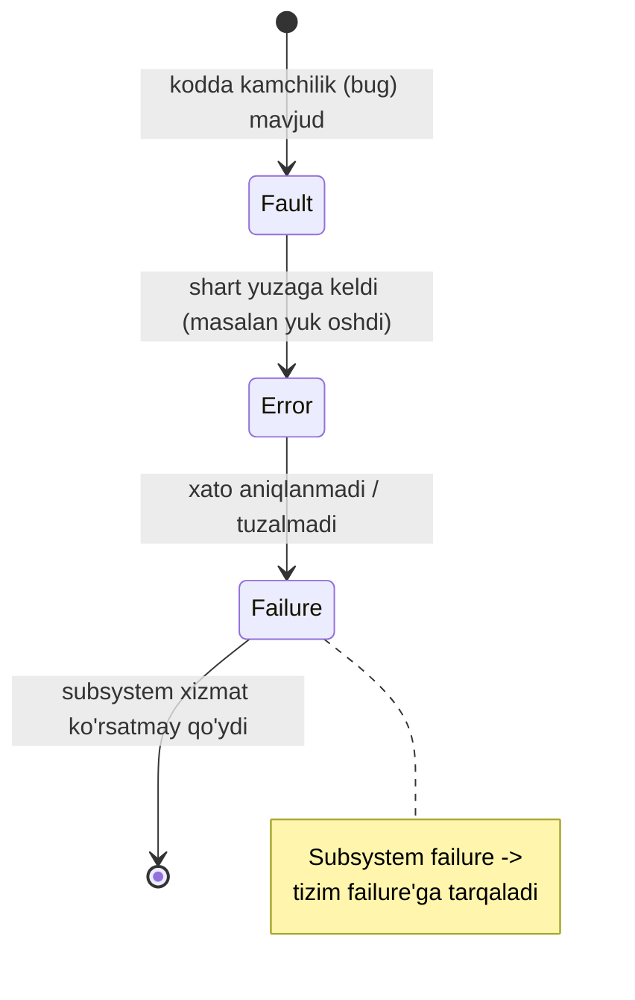
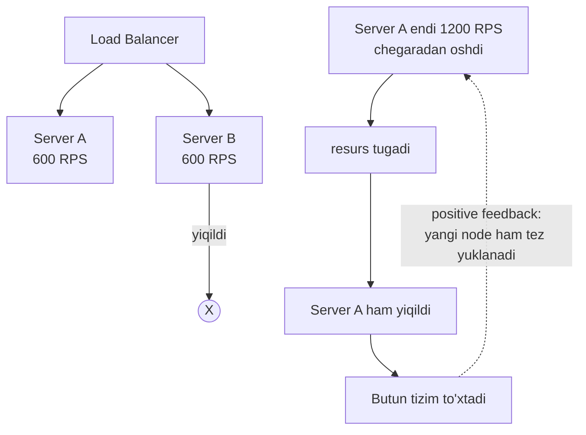
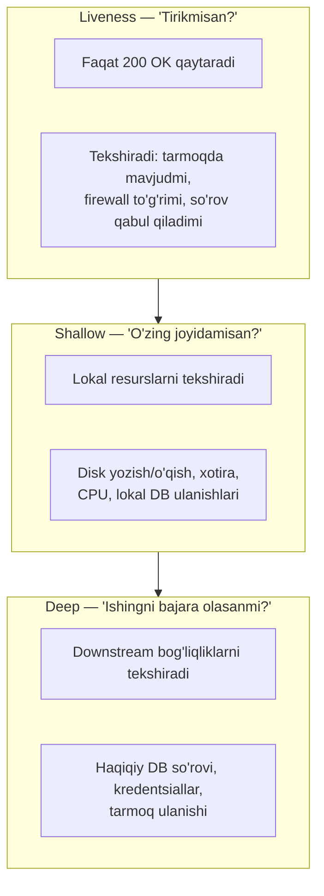
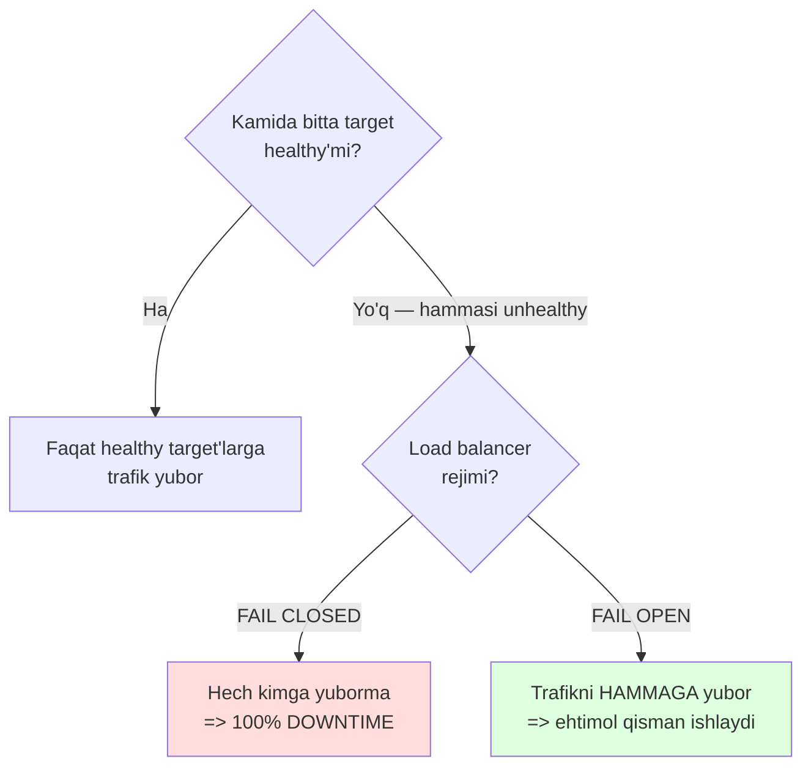

# Resilience (Chidamlilik)

> Manba: "Cloud Native Go" (Matthew A. Titmus, 2022), 9-bob "Resilience".
> Bu fayl umumiy kartinani va kitobdagi Go misollarini beradi. Alohida pattern'lar chuqur ochilgan fayllarga link qo'yilgan.

---

## TL;DR (bir qarashda)

- **Cloud'da sboy — bu istisno emas, normal holat.** To'g'ri savol "sboy bo'ladimi?" emas, "sboy bo'lganda tizim nima qiladi?".
- **Resilience != reliability.** Resilience — sboyga bardosh berib ishlashda davom etish; reliability — umuman sboysiz ishlash ehtimoli. Resilience — reliability'ning bir bo'lagi.
- Murakkab tizimlar **bir zumda emas, bitta komponentdan boshlab, zanjir bilan** yiqiladi: `fault -> error -> failure`.
- Eng xavfli rejim — **cascading failure**: tizimning o'zini tuzatishga urinishi uni yanada tez qulatadi (positive feedback loop).
- **Retry** foydali, lekin **backoff + jitter**siz retry — o'zi cascading failure sababi (retry storm).
- **Idempotency** retry'ni xavfsiz qiladi: bir xabarni ikki marta yuborsang ham natija bir xil.
- **Redundancy** availability'ni oshiradi (matematik jihatdan), lekin serial zanjirdagi eng zaif bo'g'in umumiy chidamlilikni cheklaydi.
- **Health check** 3 xil: liveness (tirikmi?), shallow (lokal resurslar joyidami?), deep (downstream bog'liqliklar ishlayaptimi?).
- **Fail open**: barcha instance unhealthy bo'lsa, load balancer trafikni baribir hammaga yuboradi — 100% downtime'dan yaxshiroq.

---

## 1. Nega bu mavzu muhim: bir tunlik Amazon sboyi

2015-yil sentyabr, tunning ikkisi. Amazon ichki tarmog'ining bir qismi jimgina ishlashdan to'xtadi. Voqea qisqa edi, lekin u **DynamoDB** xizmatiga xizmat qiluvchi ko'plab serverlarga ta'sir qildi.

Odatda bu katta muammo bo'lmasdi: sboyga uchragan serverlar shunchaki qayta ulanishga urinardi. Ular o'zining cluster'dagi a'zoligi haqidagi ma'lumotni maxsus **metadata service**dan olardi. Ulay olmasa — biroz kutib, keyin qayta urinardi.

Ammo bu safar tarmoq tiklanganda, **butun bir armiya storage server bir vaqtda** metadata service'dan a'zolik ma'lumotini so'radi. Servis shu qadar yuklandiki, so'rovlar — hatto sboyga uchramagan serverlardan kelganlar ham — timeout bo'yicha rad etila boshladi.

Storage server'lar "itoatkorlik bilan" timeout'ga javob berdi: offline rejimga o'tib, keyin qayta urindi. Bu metadata service'ni yanada ko'proq yuklab, yana ko'proq server'ni offline qildi. Bir necha daqiqada sboy butun cluster'ni qamrab oldi.

Bundan ham yomoni — ulkan miqdordagi qayta urinishlar (**retry storm** — qayta urinishlar bo'roni) shunday yuk yaratdiki, servis hatto quvvat qo'shish so'roviga ham javob bermay qoldi. Muhandislar servisga trafikni **qo'lda bloklab**, bosimni pasaytirishga majbur bo'ldi. Sboy tugashiga qariyb **5 soat** ketdi.

> Asosiy saboq: bu sboyning bitta sababi yo'q edi. Tarmoq, storage server, metadata service — har biri boshqasining muammosidan o'zini **izolyatsiya qila olganda**, tizim odam aralashuvisiz tiklanardi. Chidamlilik — aynan shu izolyatsiya san'ati.

**Analogiya:** Kema suv o'tkazmaydigan bo'limlarga (bulkhead) bo'linadi. Bitta bo'lim teshilsa, suv butun kemaga tarqalmaydi — kema suzishda davom etadi. Cloud tizimida ham maqsad — sboyni bitta "bo'lim" ichida ushlab qolish.

---

## 2. Resilience vs Reliability: ikki o'xshash, lekin boshqa tushuncha

Bu ikki atama juda tez-tez chalkashtiriladi. Farqi nozik, ammo muhim.

| Xususiyat | Resilience (chidamlilik) | Reliability (ishonchlilik) |
|---|---|---|
| **Ta'rif** | Xato va nosozliklarga qaramay to'g'ri ishlashda davom etish darajasi | Belgilangan vaqt oralig'ida kutilgan xatti-harakatni saqlab qolish qobiliyati |
| **Savol** | "Sboy bo'lganda tizim qanchalik yaxshi bardosh beradi?" | "Umuman sboy bo'lish ehtimoli qancha?" |
| **Holat modeli** | Uzluksiz spektr: to'liq ishlash -> degradatsiya -> qisman -> tiklanish | Binar: yo ishladi, yo ishlamadi |
| **Fokus** | Sboydan **keyin** tiklanish | Sboyning **oldini** olish |

> Oltin qoida: **Resilience — reliability'ni ta'minlovchi omillardan faqat bittasi.** Ishonchli tizim (reliable) shart chidamli (resilient) emas, va aksincha. Yuqori availability uchun ikkalasi ham kerak.

Web tadqiqotlari ham buni tasdiqlaydi: reliability sboy **ehtimolini** o'lchaydi (binar fazoviy holat — sboydan qochdi yoki qochmadi), resilience esa sboyga **bardosh berish va tiklanish** qobiliyatini o'lchaydi (degradatsiyadan to'liq tiklanishgacha bo'lgan graduatsiyalangan continuum).

**Analogiya:** Reliability — hech qachon kasal bo'lmaslik. Resilience — kasal bo'lganda ham oyoqda turib, tez tuzalib ketadigan immunitet. Cloud'da "hech qachon kasal bo'lmaslik" imkonsiz, shuning uchun immunitetga sarmoya kiritamiz.

---

## 3. Tizim sboyi nima: fault -> error -> failure

Sboyni tushunish uchun avval **"tizim"** nima ekanini aniqlash kerak.

Tizim — umumiy maqsad uchun birga ishlaydigan komponentlar to'plami. Muhim nuqta: **har bir komponent (subsystem) o'zi ham bir tizim**, u yana kichikroq subsystem'lardan iborat, va hokazo.

**Analogiya (avtomobil):** Dvigatel — o'nlab subsystem'dan biri. Lekin dvigatelning o'zi murakkab tizim: uning ichida sovutish subsystem'i bor, unda esa termostat, unda esa sovutuvchi suyuqlik aylanishini boshqaruvchi termorele bor. Minglab qism, va **har biri ishdan chiqishi mumkin**.

Murakkab tizim bir zumda va to'liq yiqilmaydi — sboy **oldindan aytish mumkin bo'lgan bosqichlarga** bo'linadi:

1. **Fault (nosozlik/kamchilik)** — dasturchilar buni "bug" deb ataydi. Termorele yopishib qolishga moyilligi — bu fault. U hali muammo emas, faqat *potentsial*.
2. **Error (xato)** — tizimning kutilgan va haqiqiy xatti-harakati orasidagi nomuvofiqlik. Termorele haqiqatan yopishib qolsa — bu error. Ko'p error'lar aniqlanib, qayta ishlanadi. Ammo aniqlanmagan error'lar...
3. **Failure (sboy)** — tizim endi to'g'ri xizmat ko'rsata olmaganda yuz beradi. Termorele yuqori haroratga javob bermay qo'ysa — u "failed". **Subsystem darajasidagi failure -> tizim darajasidagi failure'ga aylanadi.**



Avtomobil misolida zanjir: termorele yopishdi -> termostat ishlamadi -> sovutuvchi suyuqlik aylanmadi -> dvigatel qizib ketdi -> o'chdi -> mashina to'xtadi.

> Nega bu muhim: agar sboyni butun tizimga tarqalishidan **oldin lokalizatsiya** qila olsak, tizim tiklanadi (yoki hech bo'lmasa "o'z shartlari bilan" yiqiladi). Chidamlilik pattern'lari — komponent chegaralari bo'ylab o'rnatilgan **tayanchlar va predoxranitel klapanlar**.

---

## 4. Cascading failure: tizim o'zini o'zi qulatadi

Bu — eng xavfli va eng keng tarqalgan sboy rejimi. Amazon misolidagi asosiy mexanizm aynan shu edi.

**Ta'rif:** Cascading failure (kaskadli sboy) — tizimni tashkil etuvchi bir yoki bir nechta node ishdan chiqib, qolgan node'larga **halokatli darajada yuk oshganda** yuz beradi. Oshgan yuk overload'ga, u resurs tugashiga, u esa butun tizim to'xtashiga olib keladi.

Barcha cascading failure'larning umumiy jihati — **positive feedback loop** (musbat qayta aloqa halqasi). Tizimning bir qismidagi lokal sboy boshqa komponentlarni **kompensatsiya** qilishga majbur qiladi, ammo bu kompensatsiya muammoni yanada kuchaytiradi.

**Klassik sabab — overload.** Ikkita server bo'lsin, har biri sekundiga 600 ta so'rov (RPS) ishlaydi, load balancer ortida. Bittasi (Server B) yiqilsa, uning 600 RPS'i Server A ustiga tushadi — endi Server A 1200 RPS ko'taradi. Bu uning chegarasidan oshadi, A ham yiqiladi. Butun tizim to'xtadi.



> Positive feedback tabiati cascading failure'dan **oddiy quvvat qo'shish bilan** chiqishni qiyinlashtiradi. Yangi node'lar ham darhol yuklanib, o'sha halqani davom ettiradi. Ba'zan yagona yechim — **butun servisni o'chirib**, muammoli trafikni bloklab, keyin yukni bosqichma-bosqich oshirishdir.

**Analogiya:** Metrodagi vahima. Bitta chiqish yopilsa, hamma qolgan chiqishga yuguradi -> u tiqiladi -> ko'proq vahima -> yana ko'proq bosim. Yechim — odamlarni to'lqin-to'lqin, nazorat bilan chiqarish (bu — load shedding va throttling).

---

## 5. Overload'ning oldini olish: throttling, load shedding, graceful degradation

Har bir servisning chegarasi bor. Chegaraga yetganda servisda ikki yo'ldan biri qoladi: so'rovlarni **rad etish** yoki **sifatni pasaytirish**. Uch asosiy strategiya:

| Strategiya | Qachon ishlaydi | Mohiyati | Xarakter |
|---|---|---|---|
| **Throttling** | So'rov belgilangan tezlikdan tez kelganda | Ortiqchasini rad etadi (masalan HTTP 429) | Proaktiv, kvota asosida |
| **Load shedding** | Resurs (CPU/RAM/queue) chegaraga yaqinlashganda | Trafik bir qismini ataylab tashlaydi (HTTP 503) | Reaktiv, resurs asosida |
| **Graceful degradation** | Overload yaqinlashganda | Rad etish o'rniga sifatni pasaytiradi (kesh, arzon algoritm) | Nozik, foydalanuvchiga do'stona |

Bu strategiyalar bir-birini istisno qilmaydi — servis ikkalasini birga ishlatishi mumkin.

**Throttling** avtomobildagi drossel klapaniga o'xshaydi: dvigatelga tushadigan yoqilg'i emas, foydalanuvchi yuboradigan so'rov miqdorini cheklaydi. Odatda **har foydalanuvchi uchun alohida** (kvota) qo'llaniladi.

**Load shedding** — server to'yinish nuqtasiga yaqinlashganini bashorat qilib, trafikning bir qismini nazorat bilan tashlash. Kitobda `gorilla/mux` middleware bilan oddiy misol berilgan: queue chuqurligi chegaradan oshsa, `503 Service Unavailable` qaytariladi.

```go
const MaxQueueDepth = 1000

// --- Middleware: har so'rovda chaqiriladi ---
func loadSheddingMiddleware(next http.Handler) http.Handler {
    return http.HandlerFunc(func(w http.ResponseWriter, r *http.Request) {
        // --- 1-qadam: joriy queue chuqurligini tekshiramiz ---
        if CurrentQueueDepth() > MaxQueueDepth {
            log.Println("load shedding engaged")
            // --- 2-qadam: overload -> so'rovni tashlab yuboramiz ---
            http.Error(w, "overloaded", http.StatusServiceUnavailable)
            return
        }
        // --- 3-qadam: hammasi joyida -> keyingi handler'ga uzatamiz ---
        next.ServeHTTP(w, r)
    })
}
```

**Graceful degradation** — eng nozigi. Rad etish o'rniga har so'rovga sarflanadigan ishni kamaytirasan: keshdagi (ehtimol biroz eskirgan) ma'lumotni qaytarasan yoki arzonroq, kamroq aniq algoritm ishlatasan.

> Bu uch mavzu (throttling / load shedding / backpressure / graceful degradation / backoff) chuqur, alohida kod misollari bilan bu yerda ochilgan: [[8. Backpressure - Load Shedding]]. Throttle pattern'ining to'liq token bucket implementatsiyasi: [[5. Throttle - Rate Limiting]].

Qisqacha eslatma: kitobning per-user Throttle implementatsiyasi timer (`time.Ticker`) ishlatmaydi — bucket **so'rov kelganda**, oldingi so'rovdan o'tgan vaqtga qarab to'ldiriladi. Bu fon jarayonlarsiz yaxshiroq masshtablanadi. Cheklovga uchraganda error emas, `false` qaytadi — chunki **cheklov xato emas**.

---

## 6. Retry chuqur: backoff, jitter va retry storm

Retry — chidamlilikning eng jozibali, ammo eng xavfli quroli. Kitobdagi ogohlantiruvchi hikoya bilan boshlaymiz.

### 6.1. Sodda retry — cascading failure bombasi

Mana bu kod ishlab chiqarish tizimida topilgan:

```go
res, err := SendRequest()
for err != nil {
    res, err = SendRequest()   // xato bo'lsa -> darhol qayta urin
}
```

Ko'rinishidan bexavtar. Ammo bu kod yuzlab serverga deploy qilingandan keyin, downstream servis yiqilganda, **butun tizim qulab tushdi**. Har bir instance retry loop'iga kirdi, sekundiga minglab so'rov yubordi, tarmoqni tiqib qo'ydi.

Bu — **retry storm**. Yaxshi niyatli logika (bitta komponentni chidamli qilish) kattaroq tizimga zarar yetkazdi. Downstream servisni to'xtatgan shart bartaraf etilsa ham, u **qayta ishga tusha olmaydi** — chunki darhol ulkan yuk ostida qoladi.

> Oltin qoida: **Retry logikasi yozganingizda HAR DOIM backoff (kechikishni oshirish) algoritmidan foydalan.**

### 6.2. Fixed delay — yaxshiroq, lekin yetarli emas

```go
res, err := SendRequest()
for err != nil {
    time.Sleep(2 * time.Second)   // har urinishdan oldin 2 sekund kut
    res, err = SendRequest()
}
```

1000 ta instance uchun simulyatsiya: so'rov soni kamayadi, lekin baribir katta bo'lib qoladi. Kam instance'da yaxshi, ammo yomon masshtablanadi.

### 6.3. Exponential backoff — mashhur, ammo hali kamchilikli

Kechikish har urinishda taxminan **ikki barobar** oshadi, belgilangan maksimumgacha.

```go
res, err := SendRequest()
base, cap := time.Second, time.Minute
// --- backoff base'dan boshlanadi, har iteratsiyada 2x oshadi (<<= 1) ---
for backoff := base; err != nil; backoff <<= 1 {
    if backoff > cap {
        backoff = cap        // maksimumdan oshmasin
    }
    time.Sleep(backoff)
    res, err = SendRequest()
}
```

Muammo: 1000 ta node bir vaqtda xato oldi -> ular bir vaqtda backoff hisoblaydi -> **urinishlar guruhlanib qoladi** (sinxron to'lqinlar). Har to'lqin yana overload keltirib chiqaradi.

### 6.4. Exponential backoff + jitter — yakuniy yechim

Yechim — kechikishga **tasodifiylik (jitter — chayqalish)** qo'shish. Shunda urinishlar vaqt bo'ylab tekis tarqaladi.

```go
res, err := SendRequest()
base, cap := time.Second, time.Minute
for backoff := base; err != nil; backoff <<= 1 {
    if backoff > cap {
        backoff = cap
    }
    // --- 1-qadam: tasodifiy jitter hisoblaymiz (0 .. backoff*3) ---
    jitter := rand.Int63n(int64(backoff * 3))
    // --- 2-qadam: base + jitter = yakuniy uyqu vaqti ---
    sleep := base + time.Duration(jitter)
    time.Sleep(sleep)
    res, err = SendRequest()
}
```

Endi 1000 ta node'ning urinishlari **bir zumga to'planmaydi**, deyarli doimiy tezlikda tarqaladi. Downstream servis nafas oladi va tiklanadi.

**Analogiya:** Konsert tugadi, 1000 kishi bir vaqtda chiqishga yugursa — tiqilinch (exponential without jitter). Har kimga tasodifiy 0-30 sekund kutish aytilsa — oqim tekis (jitter).

> Eslatma: Go'da `math/rand` har ishga tushganda **bir xil** "tasodifiy" ketma-ketlik beradi (`rand.Seed(1)` kabi), agar seed o'rnatilmasa. Real jitter uchun seed'ni sozlash muhim.

⚠️ **Ko'p uchraydigan xatolar:**
- **Xato:** "Retry — bu shunchaki loop". **To'g'risi:** backoff + jitter'siz retry — cascading failure quroli.
- **Xato:** Retry'ni **hamma** xatoda qo'llash. **To'g'risi:** faqat **vaqtinchalik** (transient) xatolarda retry qil; `400 Bad Request` kabi doimiy xatoda retry befoyda.
- **Xato:** Cheksiz retry. **To'g'risi:** maksimal urinishlar sonini yoki umumiy deadline'ni cheklab qo'y.

Retry pattern'ining to'liq, mustaqil tahlili: [[2. Retry]].

🤔 **O'ylab ko'r:** Nega 6.3'dagi exponential backoff (jitter'siz) 1000 node'da hali ham muammo tug'diradi, garchi kechikishlar oshsa ham?

<details>
<summary>Javobni ko'rish</summary>

Chunki barcha node'lar **bir vaqtda** (downstream yiqilgan payt) xato oladi va **bir xil formula** bilan backoff hisoblaydi. Natijada ularning urinishlari sinxron **to'lqinlarga** guruhlanadi: 1s'da hammasi, 2s'da hammasi, 4s'da hammasi... Har to'lqin yetarlicha baland bo'lib overload keltiradi. Jitter aynan shu sinxronlikni buzadi.
</details>

---

## 7. Circuit Breaker va Timeout

### 7.1. Circuit Breaker — qisqacha mohiyat

Circuit Breaker (zanjir uzgich) downstream komponentga ketma-ket **muvaffaqiyatsiz** so'rovlar sonini eslab turadi. Sanoq chegaradan oshsa — zanjir "uziladi", va yangi so'rovlar **darhol** rad etiladi (yoki oldindan belgilangan qiymat qaytadi). Biroz kutgach zanjir avtomatik "ulanadi".

**Analogiya:** Uydagi elektr avtomati (predoxranitel). Qisqa tutashuv bo'lsa, u zanjirni uzadi — simlar yonib ketmaydi. Muammo tuzalgach, uni qayta yoqasan.

Foydasi: yaroqsiz so'rovlarga resurs va tarmoqni sarflamaslik + **yiqilgan servisga tiklanish uchun vaqt berish**.

**Circuit Breaker vs Throttle — chalkashtirmang:**

| | Circuit Breaker | Throttle |
|---|---|---|
| Nimaga qaraydi | Ketma-ket **muvaffaqiyatsiz** so'rovlar soniga | So'rov **tezligiga** (muvaffaqiyat/muvaffaqiyatsizlikdan qat'iy nazar) |
| Odatda qayerda | **Chiquvchi** (outgoing) so'rovlarda | **Kiruvchi** (incoming) trafikda |
| Maqsad | Yiqilgan bog'liqlikdan izolyatsiya | Resurs iste'molini cheklash |

To'liq implementatsiya va state machine: [[3. Circuit Breaker]].

### 7.2. Timeout — nega "muqarrar sboyni tezlashtirish" kerak

Timeout'ning muhimligi ko'zga tashlanmaydi. Tasavvur qil: servis DB'ga so'rov yuboradi. DB birdan sekinlashadi. Har bir so'rov DB bilan ulanishni **ushlab turadi**. So'rovlar to'planadi -> connection pool tugaydi. Agar DB umumiy bo'lsa -> boshqa servislar ham yiqiladi -> cascading failure.

Agar servis timeout bilan kutishni to'xtatsa, u shunchaki **sifatni pasaytirardi**, darhol yiqilmasdi.

> Oltin qoida: **Agar sboy muqarrar deb o'ylasang — uni tezlashtir.** Umidsiz kutish resurslarni band qilib turadi.

Go'da timeout va cancel uchun idiomatik vosita — `context.Context`.

#### Server tomonda: DB so'roviga context timeout

```go
// --- id bo'yicha username oladi, 15s timeout bilan ---
func UserName(ctx context.Context, id int) (string, error) {
    const query = "SELECT username FROM users WHERE id=?"
    // --- ota-context'dan 15s deadline'li yangi context yasaymiz ---
    dctx, cancel := context.WithTimeout(ctx, 15*time.Second)
    defer cancel()   // resurslarni bo'shatishni kafolatlaymiz

    var username string
    // --- QueryRowContext context'ni hisobga oladi: deadline'da ulanish bo'shaydi ---
    err := db.QueryRowContext(dctx, query, id).Scan(&username)
    return username, err
}
```

#### HTTP handler: client uzilishini DB uzilishiga bog'lash

```go
func UserGetHandler(w http.ResponseWriter, r *http.Request) {
    id := mux.Vars(r)["id"]

    // --- 1-qadam: so'rov context'i. Client ulanishni uzsa -> cancel keladi ---
    rctx := r.Context()
    // --- 2-qadam: 10s timeout qo'shamiz ---
    ctx, cancel := context.WithTimeout(rctx, 10*time.Second)
    defer cancel()

    // --- 3-qadam: bu context UserName'ga uzatiladi ->
    //     HTTP yopilsa, DB ulanishi ham yopiladi ---
    username, err := UserName(ctx, id)
    switch {
    case errors.Is(err, sql.ErrNoRows):
        http.Error(w, "no such user", http.StatusNotFound)
    case errors.Is(err, context.DeadlineExceeded):
        http.Error(w, "database timeout", http.StatusGatewayTimeout)
    case err != nil:
        http.Error(w, err.Error(), http.StatusInternalServerError)
    default:
        w.Write([]byte(username))
    }
}
```

Notional machine: `r.Context()` — client HTTP/2 ulanishni yopganda yoki `ServeHTTP` tugaganda cancel signali keladigan kanal. Undan `WithTimeout` bilan hosil qilingan context "bola" bo'ladi — ota bekor bo'lsa, barcha bolalar ham bekor bo'ladi. Shunday qilib butun zanjir (HTTP -> DB) bir signal bilan bo'shatiladi.

#### HTTP client timeout

⚠️ **Xato:** `http.Get` va `http.Post` yordamchi funksiyalari **timeout'siz** (default 0 = cheksiz). To'g'risi — o'z `Client`'ingni yasa:

```go
var client = &http.Client{
    Timeout: time.Second * 10,   // 0 (default) = cheksiz kutish!
}
response, err := client.Get(url)
```

Agar mavjud context'ni ishlatish kerak bo'lsa — `http.NewRequestWithContext` orqali:

```go
func (c *ClientContext) GetContext(ctx context.Context, url string) (*http.Response, error) {
    req, err := http.NewRequestWithContext(ctx, "GET", url, nil)
    if err != nil {
        return nil, err
    }
    return c.Do(req)
}
```

#### gRPC client timeout

gRPC client'lari ham default timeout'siz. Eski `grpc.WithTimeout` **deprecated** — o'rniga `grpc.DialContext` + `context.WithTimeout`:

```go
func TimeoutKeyValueGet() *pb.Response {
    // --- 1-qadam: 5s timeout'li context ---
    ctx, cancel := context.WithTimeout(context.Background(), 5*time.Second)
    defer cancel()

    // --- 2-qadam: DialContext context'ni qabul qiladi (Dial emas) ---
    opts := []grpc.DialOption{grpc.WithInsecure(), grpc.WithBlock()}
    conn, err := grpc.DialContext(ctx, serverAddr, opts...)
    if err != nil {
        grpclog.Fatalf(err)
    }
    defer conn.Close()

    // --- 3-qadam: xuddi shu context'ni chaqiruvda qayta ishlatamiz ---
    client := pb.NewKeyValueClient(conn)
    response, err := client.Get(ctx, &pb.GetRequest{Key: key})
    if err != nil {
        grpclog.Fatalf(err)
    }
    return response
}
```

⚠️ **Muhim:** Xuddi shu context'ni ham dial, ham chaqiruv uchun ishlatsang, timeout **umumiy** bo'ladi — u dial + chaqiruvga jami 5s beradi. Timeout qiymatini rejalashtirganda buni hisobga ol.

Timeout pattern'ining alohida tahlili: [[1. Timeout]].

---

## 8. Idempotency: retry'ni xavfsiz qiluvchi xususiyat

Cloud ilovalar tarmoq dunyosida yashaydi, tarmoq esa ishonchsiz. Xabar yubording, javob kelmadi. Nega? Xabar yo'qoldimi? Yetib bordi-yu, javob yo'qoldimi? Yoki hammasi joyida, faqat sekinmi? **Buni bilishning iloji yo'q.**

Yagona chora — **qayta yuborish**. Lekin buni xavfsiz qilish uchun operatsiyalar **idempotent** bo'lishi kerak.

**Ta'rif:** Idempotent operatsiya — bir marta bajarilsa ham, ko'p marta bajarilsa ham **bir xil natija** beruvchi operatsiya. Matematik tilda: `f(f(x)) = f(x)`. Masalan `abs(x)` idempotent: `abs(abs(x)) = abs(x)`.

**Analogiya:** Liftning "chaqirish" tugmasi — necha marta bossang ham lift bir marta keladi (idempotent). Aksincha, "bir chashka kofe qo'sh" buyrug'i — har bosishda yangi chashka (idempotent EMAS).

### 8.1. Nega muhim

- **Xavfsizroq:** Javob kelmaganda qayta yuborasan. Agar servis birinchi so'rovni allaqachon bajargan bo'lsa — idempotent metodda zarar yo'q.
- **Soddaroq:** Idempotent metodlar avtonom va oddiy. `PUT` (kalit/qiymat qo'yish) vs `CREATE` (agar kalit bor bo'lsa xato) — `PUT` mantig'i sodda.
- **Deklarativroq:** "Nima kerak"ni aytadi, "qanday qilish"ni emas. Bu nojo'ya effektlarni kamaytiradi.

### 8.2. Yomon misol: CRUD (idempotent EMAS)

```go
var store = make(map[string]string)

func Create(key, value string) error {
    // --- kalit allaqachon bor bo'lsa -> XATO ---
    if _, ok := store[key]; ok {
        return errors.New("duplicate key")
    }
    store[key] = value
    return nil
}

func Update(key, value string) error {
    // --- kalit yo'q bo'lsa -> XATO ---
    if _, ok := store[key]; !ok {
        return errors.New("no such key")
    }
    store[key] = value
    return nil
}
```

Muammo: `Create`'ni qayta chaqirsang — `duplicate key` xatosi. Retry ishlamaydi. Bundan tashqari, joriy holatni tekshiruvchi ortiqcha logika bor.

### 8.3. Yaxshi misol: idempotent Set/Delete

```go
var store = make(map[string]string)

// --- Set: bor-yo'qligini tekshirmaydi, shunchaki yozadi ---
func Set(key, value string) {
    store[key] = value
}

// --- Delete: xato qaytarmaydi, shunchaki o'chiradi ---
func Delete(key string) {
    delete(store, key)
}
```

`Create` va `Update` bitta `Set`'ga birlashdi. Bir xil chaqiruv necha marta bo'lsa ham natija bir xil — **idempotent**. Retry xavfsiz.

### 8.4. Skalyar operatsiyalar muammosi

"PUT yaxshi, lekin **`hisobga 500$ qo'sh`** kabi operatsiya-chi?" — juda o'rinli savol.

```json
{ "credit": { "accountID": 12345, "amount": 500 } }
```

Bu so'rovni **qayta yuborish** hisobga ortiqcha 500$ qo'shadi. Bank buni yoqtirmaydi. Yechim — har operatsiyaga **noyob `transactionID`**:

```json
{ "credit": { "accountID": 12345, "amount": 500, "transactionID": 789 } }
```

Qabul qiluvchi ko'rilgan `transactionID`'larni eslab qoladi va takroriy tranzaksiyalarni **aniqlab, rad etadi**. Skalyar operatsiya idempotent bo'ldi.

**Notional machine:** Bu — "idempotency key" pattern'i. Server odatda ko'rilgan kalitlarni tez qidiruv uchun bir jadval/keshda saqlaydi. Kalit oldin ko'rilgan bo'lsa, operatsiyani qayta bajarmaydi, **saqlangan javobni** qaytaradi.

To'liq tahlil (HTTP metodlarining idempotentligi, xavfsizlik): [[6. Idempotency]].

⚠️ **Ko'p uchraydigan xato:** `GET` idempotent va **safe**, `PUT`/`DELETE` idempotent (lekin safe emas), `POST` odatda idempotent EMAS. Ko'pchilik `POST`'ni ham beixtiyor retry qiladi — bu takror yozuvlarga olib keladi. `POST` uchun idempotency key ishlat.

---

## 9. Redundancy: dublikatlash hamma narsani hal qiladimi?

**Redundancy** (ortiqchalik) — kritik komponentlarni dublikatlash. Chidamlilikni oshirishning odatda **birinchi mudofaa chizig'i**.

Public cloud'da bu — komponentni bir necha instance'da, ideal holda bir necha zona yoki regionda joylashtirish. Kubernetes'da — replica sonini 1'dan katta qilish (`replicas: 3`).

### 9.1. Availability matematikasi: nega 3 nusxa sehrli

Bitta servis 99% availability bersin (`As = 0.99`). Bu "ikki to'qqiz" — unchalik yaxshi emas.

Ikki bir xil instance **parallel** ishlatsak? Ikkalasi ham ishlamay qolish ehtimoli: `(1 - 0.99) x (1 - 0.99) = 0.0001`. Demak availability `= 1 - 0.0001 = 0.9999` (to'rt to'qqiz).

Umumiy formula (parallel, teng `Ai`): `As = 1 - (1 - Ai)^N`.

| Komponentlar | Availability | Yillik downtime |
|---|---|---|
| 1 ta | 99% (2 to'qqiz) | 3.65 kun |
| 2 ta parallel | 99.99% (4 to'qqiz) | 52.6 daqiqa |
| 3 ta parallel | 99.9999% (6 to'qqiz) | 31.56 sekund |

> Shuning uchun cloud provayderlar ilovani **3 nusxada** joylashtirishni maslahat beradi: har biri alohida ishonchsiz bo'lsa ham, uchtasi birga hayratlanarli 6 to'qqiz beradi.

### 9.2. Nega redundancy hamma narsani hal qilmaydi

Komponentlar **serial** (ketma-ket) ulansa — masalan, load balancer nostupli servislar oldida — hikoya boshqacha. Serial tizim availability'si — komponentlar availability'larining **ko'paytmasi**.

99.9999% load balancer + 99% servis to'plami:
`0.99 x 0.999999 = 0.98999901` — bu load balancer'nikidan ham **past**!

> Oltin qoida: **Serial tizimning umumiy chidamliligi uning eng zaif bo'g'inidan yuqori bo'la olmaydi.** Zanjir eng zaif halqasi qadar mustahkam.

⚠️ **Fault masking (nosozlikni yashirish) — yashirin xavf.** 3 node'li tizimda bittasi yiqilsa, boshqalari kompensatsiya qilsa — sen **hech narsani sezmaysan**. Nosozlik niqoblanadi. Bu progressiv sboylarni yashiradi va oxir-oqibat butun redundancy bir zumda yo'qolib, **kutilmagan halokat** keladi. Yechim — health check'lar orqali har instance holatini kuzatish.

### 9.3. Autoscaling

Yuk vaqt bilan o'zgaradi (kunduzi ko'p, kechasi kam). **Autoscaling** — talabga qarab resurslarni (server instance, Kubernetes pod) avtomatik qo'shish/olib tashlash. Kubernetes'da: horizontal (pod soni) va vertical (CPU/RAM limitlari) autoscaling.

Amaliy maslahatlar:
- **Oqilona maksimum** o'rnat — g'ayrioddiy spike (yoki cascading failure!) butun byudjetni yeb qo'ymasin. Bu yerda throttling/load shedding ham asqotadi.
- **Ishga tushish vaqtini minimallashtir** — server image'larni oldindan tayyorla, container'larni kichik qil.
- Scaling **vaqt talab qiladi** — servisda scaling'siz ozgina zaxira bo'lsin.
- Eng yaxshi scaling — **umuman kerak bo'lmaydigani** (masalan, oldindan zaxira quvvat).

Autoscaling pattern'i: [[9. Autoscaling]].

---

## 10. Health checks: "sog'lom" degani nima?

Bir necha instance bo'lsa, load balancer kerak. Instance yiqilsa, load balancer u yerga trafik yubormasligi kerak. Buni qanday biladi? — **Health check** orqali.

Oddiy holatda health check — API endpoint (masalan `/healthz`), u instance sog'lom bo'lsa `200 OK`, aks holda `503 Service Unavailable` qaytaradi.

> **Analogiya (Cindy Sridharan):** Health check'lar bloom filter'ga o'xshaydi. Muvaffaqiyatsiz natija — servis **aniq** ishlamayapti degani. Muvaffaqiyatli natija — servis **"ehtimol"** sog'lom degani (100% kafolat emas).

Instance yiqilishining ikki keng sababi bor, va ular 3 xil health check strategiyasini keltirib chiqaradi:
- **Lokal sboy** — ilova bug'i yoki resurs tugashi (CPU, RAM, DB ulanishlari).
- **Uzoq (downstream) sboy** — bog'liqlikdagi muammo (DB yoki boshqa servis).



### 10.1. Liveness check — "tirikmisan?"

Har doim, nima bo'lishidan qat'iy nazar, **"success"** qaytaradi. Foydasizdek tuyuladi, lekin tasdiqlaydi: instance so'rov qabul qilyapti va javob beryapti; tarmoqda yetib boriladi; firewall/security group to'g'ri sozlangan.

```go
// --- Liveness: hech narsa tekshirmaydi, faqat OK qaytaradi ---
func healthLivenessHandler(w http.ResponseWriter, r *http.Request) {
    w.WriteHeader(http.StatusOK)
    w.Write([]byte("OK"))
}
```

Kamchilik: instance aslida ishini bajara oladimi — bilmaymiz. Afzallik: eng arzon, hech qachon xato pozitiv bermaydi.

⚠️ `gorilla/mux` ishlatsang, ro'yxatdan o'tgan middleware (masalan load shedding) health check'ga **ta'sir qilishi** mumkin — buni hisobga ol.

### 10.2. Shallow check — "o'zing joyidamisan?"

Liveness'dan uzoqroq boradi: **lokal** resurslarni tekshiradi (disk bo'sh joyi, yozish huquqi, xotira, CPU, yordamchi jarayonlar). Lekin downstream bog'liqliklarga tegmaydi.

```go
func healthShallowHandler(w http.ResponseWriter, r *http.Request) {
    // --- 1-qadam: vaqtinchalik fayl yaratamiz (disk + huquq testi) ---
    tmpFile, err := ioutil.TempFile(os.TempDir(), "shallow-")
    if err != nil {
        http.Error(w, err.Error(), http.StatusServiceUnavailable)
        return
    }
    defer os.Remove(tmpFile.Name())

    // --- 2-qadam: faylga yozib ko'ramiz ---
    if _, err = tmpFile.Write([]byte("Check.")); err != nil {
        http.Error(w, err.Error(), http.StatusServiceUnavailable)
        return
    }
    // --- 3-qadam: faylni yopa olamizmi ---
    if err := tmpFile.Close(); err != nil {
        http.Error(w, err.Error(), http.StatusServiceUnavailable)
        return
    }
    w.WriteHeader(http.StatusOK)
}
```

**Aniqroq**, va sboylar barcha instance'ga bir vaqtda ta'sir qilmaydi (har instance'ning lokal muammosi o'ziga xos). Lekin **xato negativ** ehtimoli bor: tashqi resurs sabab servis ishlamasa, shallow check buni sezmaydi. Aniqlikni oshirsang — sezgirlikni yo'qotasan.

⚠️ **Nozik nuqta:** Linux'da `/tmp` ko'pincha RAM-disk. Agar haqiqiy diskka yozishni tekshirmoqchi bo'lsang, boshqa katalog tanla — aks holda noto'g'ri narsani tekshirasan.

### 10.3. Deep check — "ishingni bajara olasanmi?"

Downstream bog'liqliklar bilan muloqotni **to'g'ridan-to'g'ri** tekshiradi: DB ulanishi, kredentsiallar, tarmoq. Eng to'liq manzara.

```go
func healthDeepHandler(w http.ResponseWriter, r *http.Request) {
    // --- 1-qadam: 5s timeout'li context (deep check qimmat -> cheklaymiz) ---
    ctx, cancel := context.WithTimeout(r.Context(), 5*time.Second)
    defer cancel()

    // --- 2-qadam: haqiqiy DB so'rovi (yengil, lekin real) ---
    if err := service.GetUser(ctx, 0); err != nil {
        http.Error(w, err.Error(), http.StatusServiceUnavailable)
        return
    }
    w.WriteHeader(http.StatusOK)
}
```

"Haqiqiy" so'rov shunchaki "DB ochiqmi" tekshiruvidan afzal: (1) servis nima qilishini aniq aks ettiradi; (2) so'rov vaqti DB salomatligi o'lchovi bo'la oladi.

**Deep check'ning katta xavfi:** bog'liqlik sboyi instance sboyi deb qabul qilinadi. DB sekinlashsa — **barcha** instance bir vaqtda unhealthy bo'ladi. Load balancer hammasini "o'lik" deb bilib, trafikni to'xtatadi -> cascading failure. Shuning uchun deep check bilan **circuit breaker** ishlat va load balancer'ni **fail open** rejimida sozla.

### 10.4. Qaysi birini qachon ishlatish

| | Liveness | Shallow | Deep |
|---|---|---|---|
| Nimani tekshiradi | Tirikligini | Lokal resurslar | Downstream bog'liqliklar |
| Narxi | Juda arzon | O'rtacha | Qimmat |
| Sezgirlik | Past | O'rta | Yuqori |
| Aniqlik (specificity) | Yuqori | Yuqori | Past (xato pozitivga moyil) |
| Barcha instance'ga bir vaqtda ta'sir | Yo'q | Kam ehtimol | **Ha (xavfli!)** |
| Qachon | Tez, lokal liveness probe | Instance o'zi sog'ligini bilish | Markazlashgan monitoring, ehtiyotkorlik bilan |

> Amazon amaliyoti (Builders' Library): tezkor load balancer health check'larni **lokal** (liveness/shallow) bilan cheklaydi, chuqur bog'liqlik tekshiruvlariga esa **markazlashgan tizimlar** ehtiyotkorlik bilan javob beradi. Sabab — deep check load balancer darajasida cascading failure keltirib chiqarishi mumkin.

Health Check pattern'i: [[8. Health Check]]. Bulkhead (izolyatsiya) bilan bog'liq: [[7. Bulkhead]].

---

## 11. Fail open vs Fail closed

**Muammo:** Barcha instance'lar bir vaqtda o'zini "unhealthy" deb e'lon qilsa nima bo'ladi? Deep check ishlatilganda bu **juda ehtimol** (DB sekinlashsa hammasi yiqiladi). Load balancer'da **nol** sog'lom target qoladi.

Ikki xatti-harakat mumkin:

- **Fail closed** (sukut bo'yicha xavfsiz): sog'lom target yo'q -> hech kimga trafik yuborma. Natija — **100% downtime**. Ba'zan bu kutilgan (masalan security tekshiruvi buzilsa, kirishni bloklash).
- **Fail open**: barcha target unhealthy bo'lsa -> load balancer trafikni **baribir hammaga** yuboradi, holatidan qat'iy nazar.



**Fail open mantig'i:** Ko'pincha "hamma unhealthy" — deep check'ning **xato pozitivi** (DB vaqtincha sekinladi, lekin ko'p so'rov aslida bajariladi). Bunday holda hech narsa yubormasdan 100% o'lish o'rniga, trafikni yuborish ko'proq foydali. Fail open **deep check'ni xavfsizroq** qiladi.

Web tadqiqoti (AWS ELB): agar barcha zonalarda barcha target bir vaqtda health check'dan o'tmasa, load balancer **fail open** qiladi — trafikni barcha target'larga holatidan qat'iy nazar yo'naltiradi. Bu — to'liq xizmat yo'qotilishining oldini oluvchi xavfsizlik mexanizmi.

⚠️ **Ehtiyotkorlik (AWS Builders' Library):** Amazon jamoalari fail open'ga ham shubha bilan qaraydi — chunki uni **barcha** overload, qisman sboy va "kulrang" (gray) sboy holatlarida bashorat qilish qiyin. Fail open — foydali, ammo "sehrli tugma" emas.

> Amaliy qoida: **deep health check ishlatsang -> fail open yoq + circuit breaker qo'sh.** Shallow/liveness bilan cheklansang, fail closed ham xavfsiz bo'lishi mumkin.

🤔 **O'ylab ko'r:** Nega deep health check + fail closed kombinatsiyasi eng xavfli variant?

<details>
<summary>Javobni ko'rish</summary>

Deep check downstream (masalan DB) holatiga bog'liq. DB **bitta** bo'lgani uchun, u sekinlashsa **barcha** instance bir vaqtda unhealthy bo'ladi (umumiy sabab). Fail closed rejimida load balancer nol sog'lom target ko'rib, **butun** trafikni to'xtatadi -> 100% downtime. Holbuki instance'larning ko'pchiligi aslida so'rovlarni bajara olardi. Bu — instance-lar aybsiz bo'lsa ham, xato pozitiv butun tizimni o'chiradi. Fail open aynan shu holatni yumshatadi.
</details>

---

## Interview savollari

**1. Resilience va reliability farqi nima?**
<details>
<summary>Javob</summary>

Reliability — tizimning belgilangan vaqt oralig'ida sboysiz ishlash **ehtimoli** (binar: ishladi/ishlamadi, sboyning oldini olishga qaratilgan). Resilience — sboy **yuz berganda** ham to'g'ri ishlashda davom etish va tiklanish **darajasi** (uzluksiz spektr, tiklanishga qaratilgan). Resilience — reliability'ning tarkibiy qismi. Yuqori availability uchun ikkalasi ham kerak; birini yaxshilash ikkinchisini avtomatik yaxshilamaydi.
</details>

**2. Cascading failure nima va uni nima kuchaytiradi?**
<details>
<summary>Javob</summary>

Bir yoki bir necha node yiqilib, qolganlarga halokatli yuk oshib, ular ham yiqilishi. Uni **positive feedback loop** kuchaytiradi: tizimning kompensatsiya urinishi (retry, qayta ulanish, boshqa node'larga yuk o'tkazish) muammoni yanada battar qiladi. Shuning uchun oddiy quvvat qo'shish ko'pincha yordam bermaydi — yangi node ham darhol yuklanadi. Oldini olish: throttling, load shedding, backoff+jitter, circuit breaker, bulkhead.
</details>

**3. Nima uchun jitter'siz exponential backoff yetarli emas?**
<details>
<summary>Javob</summary>

Barcha client bir vaqtda (downstream yiqilgan payt) xato oladi va bir xil formula bilan backoff hisoblaydi. Natijada urinishlar **sinxron to'lqinlarga** guruhlanadi (1s, 2s, 4s...), har to'lqin overload keltiradi. Jitter (tasodifiy chayqalish) bu sinxronlikni buzadi, urinishlarni vaqt bo'ylab tekis tarqatadi.
</details>

**4. `POST` operatsiyasini qanday idempotent qilasan?**
<details>
<summary>Javob</summary>

Skalyar/yaratuvchi operatsiyalarga noyob **idempotency key** (masalan `transactionID`) qo'shasan. Server ko'rilgan kalitlarni saqlaydi; kalit qaytadan kelsa, operatsiyani qayta bajarmasdan saqlangan javobni qaytaradi. Bu takroriy debit/kredit yoki dublikat yozuvlarning oldini oladi. Retry mavjud dunyoda bu tarmoq ishonchsizligiga qarshi asosiy himoya.
</details>

**5. Liveness, shallow va deep health check farqini ayt. Qaysi biri cascading failure'ga sabab bo'lishi mumkin?**
<details>
<summary>Javob</summary>

Liveness — faqat "tirikmi" (200 OK), hech narsa tekshirmaydi. Shallow — lokal resurslar (disk, xotira, CPU). Deep — downstream bog'liqliklar (DB, boshqa servis). **Deep check** cascading failure'ga sabab bo'lishi mumkin: umumiy bog'liqlik (DB) sekinlashsa, **barcha** instance bir vaqtda unhealthy bo'ladi, load balancer hammasini o'chiradi. Shuning uchun deep check bilan fail open + circuit breaker ishlatiladi.
</details>

**6. "Barcha instance unhealthy" bo'lganda load balancer nima qilishi kerak — fail open yoki fail closed?**
<details>
<summary>Javob</summary>

Ko'p hollarda (ayniqsa deep check ishlatilsa) — **fail open**: trafikni baribir hammaga yubor. Chunki "hamma unhealthy" ko'pincha xato pozitiv (bog'liqlik vaqtincha sekinladi), va instance'lar ko'p so'rovni aslida bajara oladi. Fail closed bu holda 100% downtime beradi. Istisno: security kabi holatlar, u yerda fail closed ataylab tanlanadi. Fail open ham "sehrli" emas — hamma overload turida ishlashi kafolatlanmaydi.
</details>

---

## O'z-o'zini tekshir (retrieval practice)

1. Fault, error, failure zanjirini avtomobil termostati misolida tushuntir.
<details><summary>Javob</summary>Fault = termorele yopishishga moyil (bug). Error = termorele haqiqatan yopishib qoldi (kutilgan vs haqiqiy nomuvofiqlik). Failure = termorele yuqori haroratga javob bermay qo'ydi -> dvigatel qizib o'chdi. Subsystem failure tizim failure'ga aylanadi.</details>

2. Nima bo'ladi, agar retry loop'ida `time.Sleep` ham, jitter ham bo'lmasa, va downstream servis yiqilsa?
<details><summary>Javob</summary>Retry storm: har instance sekundiga minglab so'rov yuboradi, tarmoqni tiqadi, downstream tiklana olmaydi (darhol yuklanadi) — cascading failure. Bu aynan kitobdagi ishlab chiqarish sboyi edi.</details>

3. Nega serial tizimda 99.9999% load balancer + 99% servis to'plami availability'si 99%'dan past?
<details><summary>Javob</summary>Serial tizim availability'si ko'paytma: 0.999999 x 0.99 = 0.98999901. Serial zanjir eng zaif bo'g'inidan kuchli bo'la olmaydi; load balancer qo'shilishi umumiy sonni biroz pasaytiradi.</details>

4. Shallow check nega `/tmp`'ga yozib diskni tekshirsa noto'g'ri bo'lishi mumkin?
<details><summary>Javob</summary>Linux'da `/tmp` ko'pincha RAM-disk, shuning uchun haqiqiy diskka yozishni tekshirmaysan. Disk sog'ligini tekshirish uchun boshqa katalog kerak.</details>

5. Fault masking nega xavfli, garchi u sboyni "yashirsa" ham?
<details><summary>Javob</summary>Progressiv sboyni ko'zdan yashiradi: node'lar birma-bir yiqilib boradi, ammo qolganlari kompensatsiya qilib turadi. Oxir-oqibat redundancy tugab, tizim **bir zumda va halokatli** yiqiladi. Health check bu holatni ko'rinadigan qiladi.</details>

---

## Amaliyot

1. **Oson (Modify).** 6.4'dagi backoff+jitter kodiga **maksimal urinishlar soni** (masalan 5) qo'sh, undan keyin xato qaytar.
<details><summary>Hint</summary>`for` sharti yoniga hisoblagich qo'sh: `for attempts := 0; err != nil && attempts < 5; attempts++`. Loop tugagach `err`'ni tekshir.</details>

2. **O'rta (faded example).** Deep health check'ni to'ldir: DB va kesh ikkalasini **bir vaqtda** (parallel) tekshir, ikkalasi ham OK bo'lsa 200 qaytar.
```go
func healthDeepHandler(w http.ResponseWriter, r *http.Request) {
    ctx, cancel := context.WithTimeout(r.Context(), 5*time.Second)
    defer cancel()

    // TODO: db va cache tekshiruvini goroutine + errgroup bilan parallel ishga tushir
    // TODO: agar birortasi xato bersa -> 503 qaytar
    // TODO: ikkalasi OK bo'lsa -> 200 qaytar
}
```
<details><summary>Hint</summary>`golang.org/x/sync/errgroup` ishlat: `g, ctx := errgroup.WithContext(ctx)`, keyin `g.Go(func() error { return checkDB(ctx) })` va `g.Go(func() error { return checkCache(ctx) })`, oxirida `if err := g.Wait(); err != nil { 503 }`. Kitobdagi maslahat: bog'liqliklarni imkon qadar bir vaqtda tekshir.</details>

3. **Qiyin (Make).** Noldan `Throttled` funksiya yoz: har foydalanuvchi (UID) uchun token bucket, timer'siz — bucket so'rov kelganda o'tgan vaqtga qarab to'ldirilsin. Cheklovga uchraganda `false` qaytar (error emas).
<details><summary>Hint</summary>`map[string]*bucket` sakla, har bucket'da `tokens` va oxirgi `time`. Yangi UID -> `max-1` token bilan yarat. Aks holda `refillInterval := time.Since(b.time) / d` orqali qo'shiladigan token'ni hisobla. Token < 1 bo'lsa `false`. Ishlab chiqarish uchun `sync.Mutex` va LRU kesh qo'sh — bu qismni [[5. Throttle - Rate Limiting]]'dan tekshir.</details>

---

## Xulosa

- **Cloud'da sboy — normal holat, istisno emas.** To'g'ri strategiya — barcha komponent qachondir yiqiladi deb faraz qilib, ularni xatoga chiroyli javob beradigan qilib loyihalash.
- **Resilience != reliability.** Resilience — sboyga bardosh berish va tiklanish; reliability — sboyning oldini olish. Resilience — reliability'ning bir bo'lagi.
- Murakkab tizimlar **bitta komponentdan** boshlab yiqiladi: `fault -> error -> failure`. Sboyni chegarada lokalizatsiya qilsang, tizim tiklanadi.
- **Cascading failure** — positive feedback loop; tizimning o'zini tuzatish urinishi uni tez qulatadi. Oldini olish server tomonda: throttling, load shedding, graceful degradation.
- **Retry** foydali, lekin **backoff + jitter**siz — cascading failure quroli (retry storm). Har doim backoff + jitter ishlat.
- **Timeout va circuit breaker** client tomonda resurslarni himoya qiladi. Go'da idiomatik vosita — `context.Context` (server DB timeout, HTTP client, gRPC DialContext).
- **Idempotency** retry'ni xavfsiz qiladi: idempotent Set/Delete oddiy va takrorga chidamli; skalyar operatsiyalar uchun idempotency key (transactionID).
- **Redundancy** availability'ni matematik ko'paytiradi (3 nusxa = 6 to'qqiz), lekin serial zanjir eng zaif bo'g'in bilan cheklanadi; fault masking'dan ehtiyot bo'l.
- **Health check** 3 xil: liveness / shallow / deep — narx, sezgirlik, aniqlik bo'yicha kelishuv (trade-off).
- **Deep check + fail open + circuit breaker** — downstream sboyida butun tizimni himoya qiluvchi kombinatsiya.

## Eslab qol

- Sboy — normal; savol "qachon yiqiladi" emas, "yiqilganda nima qiladi".
- Backoff'siz retry = cascading failure bombasi.
- Idempotency retry'ni xavfsiz qiladi.
- Serial tizim eng zaif bo'g'in qadar chidamli.
- Deep check + fail open = downstream sboyida omon qolish.

## Takrorlash va bog'liq mavzular

**Alohida chuqur ochilgan pattern'lar:**
- [[3. Circuit Breaker]] — state machine, yiqilgan bog'liqlikdan izolyatsiya
- [[2. Retry]] — backoff strategiyalari, transient vs permanent xatolar
- [[6. Idempotency]] — HTTP metodlari, idempotency key
- [[5. Throttle - Rate Limiting]] — token bucket, per-user kvota
- [[1. Timeout]] — context bilan deadline tarqatish
- [[7. Bulkhead]] — resurslarni izolyatsiya qilish (kema bo'limlari)
- [[8. Health Check]] — probe turlari va load balancer integratsiyasi
- [[9. Autoscaling]] — talabga qarab quvvat sozlash
- [[8. Backpressure - Load Shedding]] — overload boshqaruvi, graceful degradation, backpressure

**Bog'liq cloud native xususiyatlar:**
- Scalability (redundancy va autoscaling bilan chambarchas)
- Observability (health check + monitoring fault masking'ni ochadi)

**Takrorlash jadvali:**
- **Ertaga:** "O'z-o'zini tekshir" 1-3 savollarga qayta javob ber.
- **3 kundan keyin:** Interview savollari 2, 3, 5 (cascading failure, jitter, health check turlari).
- **1 haftadan keyin:** Butun "Amaliyot" bo'limini kodsiz eslab, keyin yozib ko'r.

**Feynman testi:** Chidamlilikni kod so'zlarisiz, do'stingga 3 jumlada tushuntira olasanmi? Masalan: "Cloud'da qismlar doim buziladi. Chidamlilik — bitta qism buzilganda uni izolyatsiya qilib, butun tizimni qulashdan saqlash. Buning uchun sboyni tez tan olamiz (timeout, health check), ehtiyotkorlik bilan qayta urinamiz (backoff+jitter), zaxira nusxa saqlaymiz (redundancy) va tizim o'zini o'zi qulatmasligiga qarshi tormoz qo'yamiz (circuit breaker, throttling)."

---

### Manbalar

- Matthew A. Titmus, "Cloud Native Go" (O'Reilly, 2022), 9-bob "Resilience".
- Pragmatic Engineer — Resiliency in Distributed Systems.
- Gremlin — The guide to reliability in distributed systems.
- AWS Builders' Library — Implementing health checks (David Yanacek).
- AWS Elastic Load Balancing docs — Health checks / fail open behavior.
