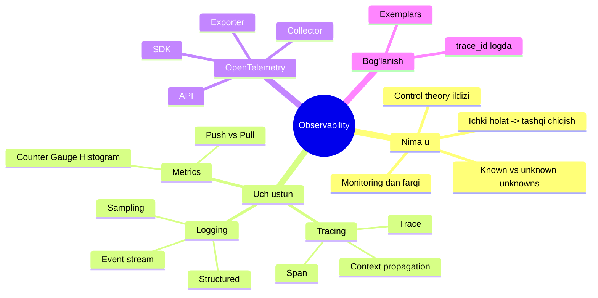
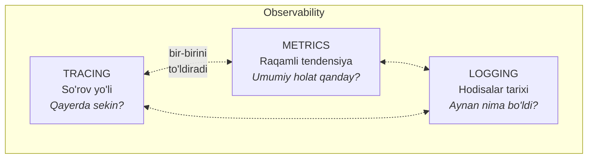
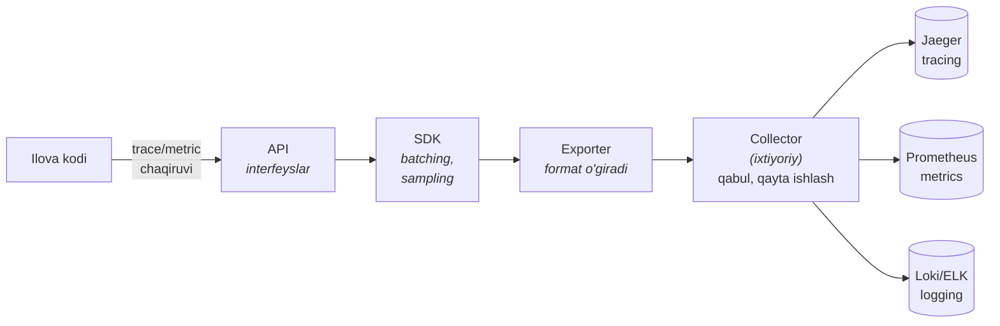
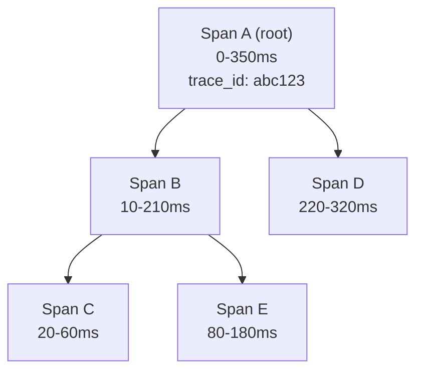
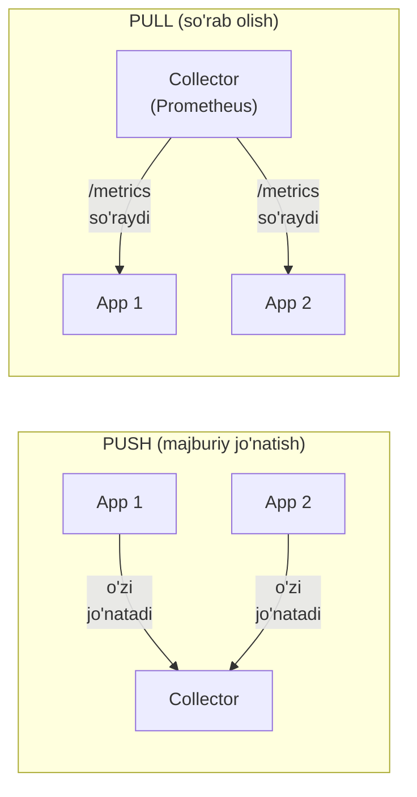
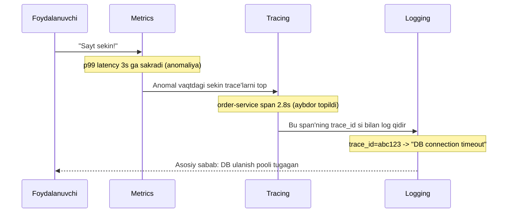

# 6. Observability (Kuzatiluvchanlik)

> Manba: "Cloud Native Go" — Matthew Titmus (2022), 11-bob.
> Zamonaviy qism: opentelemetry.io Go SDK (v1.x, GA) va Charity Majors (Honeycomb) g'oyalari bilan yangilangan.

---

## TL;DR (eng muhimi 30 soniyada)

- **Observability** — bu tizimning *ichki* holatini uning *tashqi* chiqishlaridan (log, metric, trace) qay darajada aniq bilib olish mumkinligini bildiruvchi tizim xossasi. Bu control theory (boshqaruv nazariyasi) dan olingan tushuncha.
- **Monitoring** oldindan bilingan savollarga javob beradi ("known unknowns"), **observability** esa siz hali o'ylab ham ko'rmagan yangi savollarni berish imkonini beradi ("unknown unknowns").
- Uch ustun: **tracing** (so'rov yo'li), **metrics** (raqamli tendensiyalar), **logging** (hodisalar tarixi). Ular alohida foydali, lekin birga bog'langanda kuchayadi.
- **OpenTelemetry (OTel)** — telemetriya ma'lumotlarini ifodalash, yig'ish va uzatishni standartlashtiruvchi loyiha. OpenTracing + OpenCensus birlashmasidan tug'ilgan. Komponentlari: API, SDK, exporter, collector.
- Go'da: `TracerProvider` + `exporter` bilan tracing, `MeterProvider` + instrument'lar bilan metrics, **Zap** yoki **`log/slog`** bilan structured logging.
- **DIQQAT:** kitob 2021-yilgi OTel v0.17.0 alpha API'siga tayanadi. Bu material zamonaviy v1.x (GA) API bilan yangilangan — farqlar alohida jadvallarda ko'rsatilgan.

---

## Mavzu xaritasi



---

## 1. Observability nima?

### 1.1. Muammo: qorong'i xonada tayoq bilan

Tasavvur qil: sen 30 ta microservice'dan iborat tizim yozding. Bir kuni foydalanuvchi "sahifa sekin ochilyapti" deb shikoyat qildi. Lekin **qaysi** service sekin? So'rov API Gateway'dan o'tdi, keyin auth-service, keyin order-service, keyin database... Qayerda tiqilib qoldi?

An'anaviy monitoring senga faqat "CPU 80%" yoki "500 error qaytdi" deydi. Lekin **nega** 500 qaytganini aytmaydi. Sen kodni qayta ochib, yangi log qo'shib, qayta deploy qilishing kerak bo'ladi. Bu — qorong'i xonada tayoq bilan yo'l izlashga o'xshaydi.

> Bulutli (cloud native) tizimlarda ko'pchilik nosozlik sabablari endi tarmoq yoki apparatda emas, balki **bizning o'z service'larimizda va ular orasidagi o'zaro ta'sirda** yashiringan. Hech qanday framework yomon yozilgan dasturni tuzatmaydi — Kubernetes'ga ko'chirilgan tartibsiz ilova baribir tartibsiz bo'lib qoladi.

### 1.2. Analogiya: shifokor va bemor

Observability'ni tushunish uchun **shifokorni** tasavvur qil. Shifokor bemorning *ichini* to'g'ridan-to'g'ri ko'ra olmaydi. U faqat *tashqi belgilarga* qaraydi: harorat, puls, qon bosimi, tahlil natijalari. Shu tashqi ko'rsatkichlar orqali u ichki holatni (kasallikni) **taxmin qiladi**.

Yaxshi jihozlangan shifoxona — bu observable tizim: bemor haqida shuncha ko'p va sifatli o'lchov borki, shifokor **yangi, kutilmagan savol** ("jigar ishlayaptimi?") tug'ilganda ham darhol javob topadi. Yomon jihozlangan shifoxonada esa faqat "bemor tirikmi yoki yo'q" degan bitta ko'rsatkich bor.

> **Analogiya chegarasi:** shifokor ba'zan bemorni kesib ko'radi (invaziv). Observability esa aksincha — kodni *qayta yozmasdan*, faqat mavjud tashqi chiqishlardan javob topishga intiladi. Agar javob topish uchun har safar yangi kod deploy qilish kerak bo'lsa, tizim observable emas.

### 1.3. Sodda ta'rif

Observability tushunchasi aslida **control theory** (boshqaruv nazariyasi) dan olingan: tizim *observable* deyiladi, agar uning ichki holatini faqat tashqi chiqishlaridan tiklab olish mumkin bo'lsa.

> **Observability** (kuzatiluvchanlik) — bu tizimning shunday xossasiki, u sizga **minimal oldingi bilim** bilan, **yangi kod yozmasdan**, tizim haqida hali o'ylab ko'rmagan **yangi savollarni** tez va izchil berish imkonini beradi.

Bu — barqarorlik (stability) yoki boshqariluvchanlik (manageability) kabi **tizim xossasi**. Uni *sotib olib bo'lmaydi*. Xuddi bolg'a o'zi ko'prikni mustahkam qilmagani kabi, hech qanday vendor asbobi sizga "observability sotib" bera olmaydi. Asbob yordam beradi, lekin uni qanday ishlatish sizga bog'liq.

### 1.4. Monitoring vs Observability: eng muhim farq

Charity Majors (Honeycomb asoschisi) buni eng aniq ifodalagan:

> Monitoring — bu **known unknowns** (bilingan noma'lumlar) haqida: sen oldindan bilasanki, disk to'lishi mumkin, shuning uchun disk to'lishini kuzatasan.
> Observability — bu **unknown unknowns** (bilinmagan noma'lumlar) haqida: sen hali paydo bo'lmagan, o'ylab ham ko'rmagan nosozlikni ham tekshira olasan.

An'anaviy monitoring har bir yangi nosozlik turini oldindan bilishni talab qiladi. Yangi nosozlik chiqsa — odatda o'z tajribangda — uning belgisini monitoring to'plamiga qo'shasan, va jarayon qaytadan boshlanadi. Bu oddiy tizimlarda ishlaydi, lekin ikkita muammosi bor:

1. Yangi savol berish uchun ko'pincha **yangi kod yozib deploy qilish** kerak — bu qiyin, sekin va asabiy.
2. Murakkablik oshgach, "unknown unknowns" soni "known unknowns" sonidan **ko'payib** ketadi. Nosozliklar ko'pincha oldindan aytib bo'lmaydigan, uzun zanjirli sabablardan kelib chiqadi. Hammasini oldindan monitoring qilish deyarli imkonsiz.

| Xususiyat | Monitoring | Observability |
|---|---|---|
| Asosiy savol | "Ishlayaptimi?" | "Nega ishlamayapti?" |
| Nimaga qaratilgan | Known unknowns | Unknown unknowns |
| Savollar | Oldindan belgilangan | Ad hoc, yangi |
| Yangi savol uchun | Ko'pincha yangi kod kerak | Kod o'zgartirmay javob |
| Ma'lumot cardinality | Past bo'lsa yetadi | Yuqori (high cardinality) kerak |
| Tabiati | Reaktiv (nosozlikdan keyin) | Eksploratsion (izlanuvchan) |

> **Oltin qoida:** Monitoring senga tizim *buzilganini* aytadi. Observability senga *nega* buzilganini so'rash imkonini beradi.

**High cardinality** (yuqori kardinallik) tushunchasi bu yerda kalit. Cardinality — bu bir metrikaga biriktirilgan noyob teg (label) qiymatlari soni. Masalan `user_id` juda yuqori kardinallikka ega (millionlab noyob qiymat), `country` esa past. Yuqori cardinality — bu ma'lumotni ko'p xil kesimda so'rash mumkinligini bildiradi, ya'ni oldin o'ylab ko'rmagan savolni berish ehtimoli ortadi.

---

## 2. Observability'ning uch ustuni

Observability'ning uchta eng keng tarqalgan asbobi: **tracing**, **metrics** va **logging**. Ularni "uch ustun" (three pillars) deb atashadi.



### 2.1. Uchta ustun nima uchun kerak — restoran analogiyasi

Tasavvur qil, sen restoran egasisan va "buyurtmalar sekin tayyorlanyapti" degan shikoyat oldingsan:

- **Metrics** — bu boshqaruv paneli: "bugun o'rtacha tayyorlanish vaqti 25 daqiqa, kecha 10 edi". Bu senga **muammo borligini** va **umumiy manzarani** ko'rsatadi, lekin sababni aytmaydi.
- **Tracing** — bu bitta buyurtmaning to'liq yo'lini kuzatish: ofitsiant 2 daqiqa, oshxonaga yuborish 1 daqiqa, go'sht pishirish 20 daqiqa. Endi sen **qayerda** tiqilishni bilding — go'sht bo'limi.
- **Logging** — bu go'sht bo'limi oshpazining daftari: "20:15 gaz bosimi pasaydi". Endi sen **aniq sababni** bilding.

> Har bir usul alohida foydali, lekin haqiqiy observable tizim ularni **o'zaro bog'laydi**: metrics buzuq trace'larni topishga yordam beradi, trace'lar esa asosiy sababni ko'rsatuvchi log'larga havola qiladi.

### 2.2. Uch ustunni taqqoslash

| | Tracing | Metrics | Logging |
|---|---|---|---|
| Nima | So'rovning tizim bo'ylab yo'li | Vaqt bo'yicha raqamli o'lchovlar | O'zgarmas hodisalar yozuvi |
| Javob beradi | "Qayerda sekin/buzildi?" | "Tendensiya, anomaliya qanday?" | "Aniq nima sodir bo'ldi?" |
| Ma'lumot turi | DAG (span'lar grafi) | Time series (raqam) | Matn/JSON yozuvlar |
| Kuchli tomoni | Service'lararo bog'liqlik | Trend, prognoz, alert | Kontekst, tafsilot |
| Zaif tomoni | Har bir qadam instrument kerak | "Nega" ni aytmaydi | Katta hajm, qimmat |
| Asbob misoli | Jaeger, Zipkin, Tempo | Prometheus, Grafana | ELK, Loki, Splunk |

> **"Uch ustun" atamasiga tanqid:** shunchaki log yozish, metric yig'ish va trace qilish tizimni avtomatik observable qilmaydi. Bu uchtasi — faqat *asboblar*. Observability esa ularni **to'g'ri tushunib, bog'lab** ishlatishdan tug'iladigan xossa.

---

## 3. OpenTelemetry (OTel)

### 3.1. Muammo: har bir vendor o'z tilida gapiradi

2015-2019 yillarda telemetriya olamida tartibsizlik hukm surardi. O'nlab vendor'lar (Datadog, New Relic, Jaeger, Zipkin...) har biri o'z API'si, o'z formati bilan chiqdi. Agar sen bir vendor'ni tanlasang, kodingni to'lig'icha uning kutubxonasiga bog'lab qo'yasan. Vendor'ni almashtirmoqchi bo'lsang — butun instrumentatsiyani qayta yozishing kerak. Bu **vendor lock-in** (vendor qulligi) deyiladi.

Ikkita standartlashtirish urinishi bo'ldi: **OpenTracing** (tracing uchun) va **OpenCensus** (metrics + tracing uchun). Lekin ikkitasi bo'lishi o'zi yana bir muammo edi.

### 3.2. Yechim: OTel — bitta standart

**OpenTelemetry (OTel)** — OpenTracing va OpenCensus birlashmasidan tug'ilgan CNCF loyihasi. U service emas, balki telemetriya ma'lumotlarini (trace, metric, log) **ifodalash, yig'ish va uzatishni standartlashtiruvchi** spetsifikatsiyalar va kutubxonalar to'plami.

> **Analogiya:** OTel — bu telemetriya olamining **USB-C razyomi**. Ilgari har bir qurilma o'z zaryadlagichini talab qilardi (vendor lock-in). Endi bitta standart razyom bor — kodingni bir marta OTel bilan instrument qilasan, keyin istagan backend'ga (Jaeger, Prometheus, Honeycomb, Datadog) ulaysan, kodni o'zgartirmasdan.

### 3.3. OTel komponentlari



| Komponent | Vazifasi | Analogiya |
|---|---|---|
| **Spetsifikatsiya** | Barcha API, SDK va protokollar uchun talab va kutilmalar | Qonun matni |
| **API** | Kodga OTel qo'shish uchun interfeyslar | Rozetka (nima ulanishini bilmaydi) |
| **SDK** | API va exporter orasidagi amaliy implementatsiya: batching, filtrlash, sampling | Elektr taqsimlagich |
| **Exporter** | Ma'lumotni ma'lum joyga (fayl, Jaeger, Honeycomb) uzatuvchi plagin | Adapter/vilka |
| **Collector** | Ixtiyoriy, lekin foydali: telemetriyani qabul qilib, qayta ishlab, bir yoki bir necha manzilga yo'naltiruvchi mustaqil proxy | Pochta saralash markazi |

> **Muhim nozik nuqta:** OTel'ning **backend (server) qismi yo'q**. U faqat yig'adi, qayta ishlaydi va uzatadi. Ma'lumotni qabul qilib saqlaydigan backend'ni (Jaeger, Prometheus, Grafana...) siz o'zingiz beryapsiz.

🤔 **O'ylab ko'r:** Nima uchun exporter'ni SDK'dan alohida komponent qilishgan? Nega uni to'g'ridan-to'g'ri API ichiga qurmaganlar?

<details>
<summary>💡 Javobni ko'rish</summary>

Chunki bu **decoupling** (bog'liqlikni ajratish) beradi. Exporter alohida bo'lgani uchun sen backend'ni (Jaeger'dan Honeycomb'ga) faqat exporter'ni almashtirib o'zgartirasan — ilova kodiga tegmasdan. Bu OTel'ning butun mavjudlik sababi: vendor lock-in'dan qutulish. Xuddi Stability Patterns'dagi "loose coupling" prinsipi kabi.
</details>

---

## 4. Tracing chuqur

### 4.1. Muammo: o'ldirishni tekshirish

Distributed system'da nosozlikni topish — bu **qotillikni tekshirishga** o'xshaydi. Jasad bor (500 error), lekin qotil qaysi service'da yashiringan? So'rov 10 ta service'dan o'tdi, har biri boshqasini chaqirdi, kimdir sekin ishladi. Oddiy log senga faqat bitta service ichini ko'rsatadi; jarayon service chegarasidan o'tganda iz yo'qoladi.

**Tracing** aynan shu muammoni hal qilish uchun ixtiro qilingan: u so'rovning tizim bo'ylab tarqalishini — hatto process va tarmoq chegaralaridan ham o'tib — kuzatadi va butun oqimni **DAG** (Directed Acyclic Graph — yo'naltirilgan asiklik graf) ga aylantiradi.

### 4.2. Ikki asosiy tushuncha: span va trace

- **Span** (operatsiya) — so'rov bajaradigan **bitta ish birligi**. Har bir span'da nomi, boshlanish vaqti va davomiyligi bor. Span'lar ichma-ich joylashishi va tartiblanishi mumkin (sabab-oqibat modelini aks ettiradi).
- **Trace** (trek) — so'rov tizimdan o'tishida bajarilgan **barcha span'lar** to'plami. Trace'ni span'lardan tashkil topgan DAG yoki "stack trace" deb tasavvur qilsa bo'ladi.

> **Analogiya:** Trace — bu **posilkaning yetkazib berish tarixi**. Har bir skanerlash nuqtasi (omborga keldi, mashinaga yuklandi, kuryerga berildi) — bu bitta **span**. Butun yo'l, boshdan oxirigacha — bu **trace**. Har bir span boshlangan vaqti va qancha turgani bilan yoziladi.

```mermaid
gantt
    title Trace: bitta so'rov 5 ta span orqali (350 ms)
    dateFormat X
    axisFormat %L ms
    section A (root)
    A butun so'rov          :a, 0, 350
    section B
    B (A ichida)            :b, 10, 200
    section C
    C (B ichida)            :c, 20, 40
    section D
    D (A ichida)            :d, 220, 100
    section E
    E                       :e, 80, 100
```



Yuqoridagi gantt trace'ni **timeline** (histogramma) ko'rinishida ko'rsatadi: har bir chiziqning boshlanish o'rni va uzunligi span'ning boshlanish vaqti va davomiyligini bildiradi. Xuddi shu trace'ni **daraxt** (parent-child) ko'rinishida ham chizsa bo'ladi:



### 4.3. Context propagation — sirli ip

So'rov birinchi service'ga kirganda, unga global noyob **trace_id** beriladi. Bu ID keyingi har bir chaqiruv bilan birga uzatiladi. Har bir yangi instrument nuqtasi shu trace_id bilan yangi span yaratadi va metama'lumotni boyitib, so'rov bilan birga uzatadi.

Bu **context propagation** (kontekstni tarqatish) deyiladi. Go'da bu `context.Context` orqali amalga oshadi — trace_id va joriy span kontekst ichida "yashiringan" holda funksiyadan funksiyaga o'tadi.

> **Notional machine (kompyuterda aslida nima bo'ladi):** `tracer.Start(ctx, "name")` chaqirganingda ikkita narsa qaytadi: yangi `Span` obyekti VA yangi `context.Context`. Yangi context — bu eskisining nusxasi, lekin ichiga joriy span "solingan". Sen bu yangi context'ni pastdagi funksiyalarga uzatasan; ular undan parent span'ni topib, o'z span'larini uning *bolasi* qilib bog'lashadi. Agar eski context'ni uzatsang — bog'lanish uziladi va span'lar aloqasiz "yetim" bo'lib qoladi.

### 4.4. Go'da tracing sozlash — zamonaviy SDK

> **DIQQAT — kitob API'si eskirgan!** Kitob OTel **v0.17.0 (alpha)** ni ishlatadi. Bu material zamonaviy **v1.x (GA)** API'ni beradi. Asosiy farqlar:

| Kitob (v0.17.0, 2021) | Zamonaviy (v1.x, GA) |
|---|---|
| `go.opentelemetry.io/otel/label` | `go.opentelemetry.io/otel/attribute` |
| `label.String("k","v")` | `attribute.String("k","v")` |
| `stdout.NewExporter(...)` | `stdouttrace.New(...)` |
| `jaeger.NewRawExporter(...)` | **Jaeger exporter olib tashlandi** -> OTLP exporter (`otlptracehttp`/`otlptracegrpc`) |
| `sdktrace.WithSyncer(exp)` | `trace.WithBatcher(exp)` (production uchun tavsiya) |
| `meter.NewInt64Counter(...)` | `meter.Int64Counter(...)` |
| Metrics API alpha, chalkash | Metrics API GA, barqaror |

Zamonaviy sozlash (v1.x) — `main` funksiyasida bir marta:

```go
// --- 1-qadam: exporter yaratamiz (konsolga chiroyli JSON) ---
exp, err := stdouttrace.New(stdouttrace.WithPrettyPrint())
if err != nil {
    log.Fatal(err)
}

// --- 2-qadam: resource — bu service kim ekanini bildiradi ---
res, _ := resource.New(context.Background(),
    resource.WithAttributes(semconv.ServiceName("fibonacci")))

// --- 3-qadam: TracerProvider yaratamiz (batching bilan) ---
tp := trace.NewTracerProvider(
    trace.WithBatcher(exp),          // production uchun batch (paket) rejimi
    trace.WithResource(res),
)
defer tp.Shutdown(context.Background()) // dastur tugaganda buffer'ni bo'shatadi

// --- 4-qadam: uni global provider qilib o'rnatamiz ---
otel.SetTracerProvider(tp)
```

Import'lar (zamonaviy):

```go
import (
    "go.opentelemetry.io/otel"
    "go.opentelemetry.io/otel/attribute"
    "go.opentelemetry.io/otel/exporters/stdout/stdouttrace"
    "go.opentelemetry.io/otel/sdk/resource"
    "go.opentelemetry.io/otel/sdk/trace"
    semconv "go.opentelemetry.io/otel/semconv/v1.24.0"
)
```

> **Jaeger'ga uzatish (zamonaviy yo'l):** kitobdagi maxsus Jaeger exporter **olib tashlangan** (2023). Endi Jaeger'ning o'zi **OTLP** protokolini tushunadi. Shuning uchun universal OTLP exporter ishlatiladi:
> ```go
> exp, _ := otlptracehttp.New(context.Background(),
>     otlptracehttp.WithEndpoint("localhost:4318"),
>     otlptracehttp.WithInsecure())
> ```

### 4.5. Kodni instrument qilish

Provider tayyor bo'lgach, `tracer` olib, span yaratamiz:

```go
// --- tracer'ni global provider'dan olamiz ---
tr := otel.Tracer("fibonacci") // qisqartma; = otel.GetTracerProvider().Tracer(...)

func main() {
    // ... provider sozlash yuqorida ...

    // --- root span'ni boshlaymiz; yangi ctx trace_id'ni saqlaydi ---
    ctx, sp := tr.Start(context.Background(), "main")
    defer sp.End() // End chaqirmasak span hech qachon yakunlanmaydi!

    SomeFunction(ctx) // ctx'ni pastga uzatamiz
}

func SomeFunction(ctx context.Context) {
    // --- olingan ctx'dan child span yasaymiz ---
    _, sp := tr.Start(ctx, "SomeFunction")
    defer sp.End()
    // ... foydali ish ...
}
```

`Tracer` interfeysi juda sodda — bor-yo'g'i bitta metod:

```go
type Tracer interface {
    Start(ctx context.Context, spanName string, opts ...SpanStartOption)
        (context.Context, Span)
}
```

### 4.6. Span metama'lumotlari: attribute va event

Span'ga ikki xil qo'shimcha ma'lumot beriladi:

- **Attribute** (atribut) — kalit/qiymat juftligi. Keyinchalik filtrlash, guruhlash uchun. Masalan `n=6`.
- **Event** (hodisa) — span ichida ma'lum bir vaqtda sodir bo'lgan, o'qishga qulay xabar.

```go
// --- attribute'ni span yaratishda beramiz ---
ctx, sp := tr.Start(ctx, "calc",
    trace.WithAttributes(attribute.Int("n", n)))
defer sp.End()

// --- yoki keyinroq qo'shamiz ---
sp.SetAttributes(attribute.Int("result", result))

// --- event: mutex olinish/qaytarilish vaqtini belgilash ---
sp.AddEvent("Acquiring mutex lock")
mutex.Lock()
sp.AddEvent("Releasing mutex lock")
mutex.Unlock()
```

### 4.7. Avtomatik instrumentatsiya — `otelhttp`

Har bir handler'ni qo'lda instrument qilish zerikarli. OTel mashhur kutubxonalar (net/http, gorilla/mux, grpc) uchun **avtomatik instrumentatsiya** o'ramlarini beradi. Ular handler'ni o'rab, har so'rov uchun avtomatik span yaratadi:

```go
// --- oddiy net/http (instrumentatsiyasiz) ---
http.Handle("/", http.HandlerFunc(fibHandler))

// --- otelhttp bilan avtomatik trace ---
http.Handle("/",
    otelhttp.NewHandler(http.HandlerFunc(fibHandler), "root"))
```

`otelhttp.NewHandler` handler'ni oladi va yangi handler qaytaradi, u har so'rovda "root" nomli span yaratadi. Handler ichida joriy span'ni context'dan olish mumkin:

```go
func fibHandler(w http.ResponseWriter, req *http.Request) {
    ctx := req.Context()               // so'rov context'i
    sp := trace.SpanFromContext(ctx)   // avtomatik yaratilgan span
    sp.SetAttributes(attribute.Int("parameter", n))
}
```

> **Client tomonini ham instrument qilish kerak!** To'liq distributed trace uchun trace metama'lumoti service chegaralaridan o'tishi shart. Ya'ni faqat server emas, **client** (HTTP/gRPC chaqiruvchi) tomon ham instrument qilinishi lozim — aks holda trace_id keyingi service'ga yetib bormaydi va trace ikkiga "sinadi".

### 4.8. Fibonacci misoli (qisqartirilgan)

Kitobning to'liq misoli — n-Fibonacci sonini hisoblovchi web-service. Har bir rekursiv chaqiruv o'z span'ini yaratadi:

```go
func Fibonacci(ctx context.Context, n int) chan int {
    ch := make(chan int)
    go func() {
        tr := otel.Tracer("fibonacci")
        // --- har chaqiruv o'z span'ini yaratadi, ctx bilan bog'langan ---
        cctx, sp := tr.Start(ctx, fmt.Sprintf("Fibonacci(%d)", n),
            trace.WithAttributes(attribute.Int("n", n)))
        defer sp.End()

        result := 1
        if n > 1 {
            a := Fibonacci(cctx, n-1) // cctx = child context uzatiladi
            b := Fibonacci(cctx, n-2)
            result = <-a + <-b
        }
        sp.SetAttributes(attribute.Int("result", result))
        ch <- result
    }()
    return ch
}
```

`curl localhost:3000?n=6` yuborilganda, konsol exporter shunday JSON chiqaradi (qisqartirilgan):

```json
{
  "SpanContext": { "TraceID": "4253c86e...", "SpanID": "817822..." },
  "ParentSpanID": "0000000000000000",
  "Name": "main",
  "Attributes": [
    { "Key": "n", "Value": { "Type": "INT64", "Value": 6 } },
    { "Key": "result", "Value": { "Type": "INT64", "Value": 13 } }
  ],
  "ChildSpanCount": 1
}
```

Jaeger'ni ishga tushirish (Docker):

```bash
docker run -d --name jaeger -p 16686:16686 -p 4318:4318 \
  jaegertracing/all-in-one:latest
# UI: http://localhost:16686
```

🤔 **O'ylab ko'r:** Yuqoridagi `Fibonacci` funksiyasida `defer sp.End()` ni olib tashlasak nima bo'ladi?

<details>
<summary>💡 Javobni ko'rish</summary>

Span **hech qachon yakunlanmaydi**. `End()` — bu span'ning davomiyligini "muhrlaydigan" va uni exporter'ga yuborishga tayyorlaydigan chaqiruv. Uni chaqirmasang:
1. Span'ning `EndTime` yozilmaydi, davomiyligi noma'lum qoladi.
2. Ko'p SDK implementatsiyalarida yakunlanmagan span exporter'ga umuman uzatilmaydi — ya'ni Jaeger'da uni ko'rmaysan.
3. Ba'zi holatlarda yakunlanmagan span'lar xotirada to'planib, memory leak'ga olib keladi.

Shuning uchun `tr.Start(...)` dan keyin darhol `defer sp.End()` yozish — deyarli har doim to'g'ri odat.
</details>

### 4.9. Tracing'da ko'p uchraydigan xatolar

⚠️ **Xato 1: eski context'ni uzatish.**
```go
ctx, sp := tr.Start(ctx, "parent")
defer sp.End()
doWork(oldCtx) // XATO: yangi ctx emas, eski uzatildi -> span bog'lanmaydi
```
To'g'risi: `Start` qaytargan **yangi** `ctx`'ni uzat. Aks holda child span parent'ni topa olmaydi va trace ikkiga bo'linadi.

⚠️ **Xato 2: `WithSyncer`'ni production'da ishlatish.**
Har span'ni darhol tarmoq orqali yuborish (syncer) ilovani sekinlashtiradi. Production'da **`WithBatcher`** ishlat — u span'larni buferlab, paket qilib yuboradi.

⚠️ **Xato 3: `Shutdown` chaqirmaslik.**
`tp.Shutdown()` chaqirmasang, buferdagi yakuniy span'lar hech qachon yuborilmasdan qoladi — oxirgi trace'lar yo'qoladi. Har doim `defer tp.Shutdown(ctx)`.

⚠️ **Xato 4: yuqori cardinality'ni attribute'ga tiqish (haddan tashqari).**
`user_id`, `request_id` kabi cheksiz noyob qiymatlarni har span'ga qo'yish backend'ni ko'mib tashlashi mumkin. Tracing uchun bu ba'zan foydali, lekin metrics'da bu falokat (pastroqda ko'ramiz).

---

## 5. Metrics chuqur

### 5.1. Muammo: har bir hodisani yozib bo'lmaydi

Trace har bir so'rovni batafsil yozadi — bu qimmat. Agar sen faqat "sekundiga nechta so'rov keldi?" yoki "xotira qancha?" degan **umumlashgan raqamni** bilmoqchi bo'lsang, har bir so'rovni to'liq yozish isrofgarchilik. Kerak bo'lgani — **ixcham raqamli o'lchov**, vaqt bo'yicha.

### 5.2. Metrics nima

**Metric** — komponent, jarayon yoki harakatning vaqt bo'yicha o'zgarishini tavsiflovchi raqamli ma'lumotlar to'plami. Bitta o'lchov nuqtasi **sample** (namuna) deyiladi: nomi, qiymati va millisekund aniqligidagi vaqt belgisi bor.

Bir sample kam qiymatga ega, lekin bir xil nomli sample'lar ketma-ketligi — **time series** (vaqt qatori) — juda kuchli. Uni grafikka chizib, tendensiya, anomaliya va chetlanishlarni ko'rish mumkin.

> **Analogiya:** Metric — bu mashinaning **tezlik va yoqilg'i strelkasi**. U har bir aylananing tafsilotini (trace) bermaydi, lekin "hozir tezlik 90, benzin yarim" degan umumlashgan holatni bir qarashda ko'rsatadi. Vaqt bo'yicha kuzatsang — tendensiyani (benzin qancha tez tugayapti) bilasan.

### 5.3. Push vs Pull — ikki model

Metrics yig'ishning ikki arxitekturasi bor:



- **Push**: ilova o'zi metric'larni markaziy serverga jo'natadi (StatsD, Graphite). Ilova serverning manzilini bilishi kerak.
- **Pull**: server (Prometheus) belgilangan interval bilan ilovaning `/metrics` endpoint'iga borib, metric'larni **o'zi so'rab oladi**.

| | Push | Pull |
|---|---|---|
| Kim tashabbuskor | Ilova jo'natadi | Server so'raydi |
| Manzilni kim biladi | Ilova serverni bilishi kerak | Server ilovani topishi kerak (discovery) |
| Qisqa umrli process (FaaS) | Qulay (o'zi jo'natadi) | Qiyin (gateway kerak) |
| Tirikligini bilish | Qiyinroq | Oson ("scrape muvaffaqiyatli?") |
| Qo'lda tekshirish | Yo'q | Brauzerdan `/metrics` ochsa bo'ladi |
| Tarmoq | Bir yo'nalishli, yengilroq | Ikki yo'nalishli |
| Misol | StatsD, Graphite | **Prometheus** |

> **Qaysi biri yaxshi?** Prometheus muallifi Brian Brazil aytganidek: injinerlik nuqtai nazaridan bu **ahamiyatsiz** — ikkalasining ham afzalligi va kamchiligi bor, va biroz harakat bilan istalganini amalga oshirasan. "Eng yaxshi" — bu sening tizim talablaringga mos keladigani.

### 5.4. Prometheus bilan pull

Prometheus — pull modelidagi eng mashhur ochiq kodli monitoring toolkit. U metric'larni HTTP orqali so'rab, o'zining time-series bazasida ko'p o'lchovli qiymatlar sifatida saqlaydi va PromQL so'rov tilini beradi.

Ilova o'z metric'larini `/metrics` endpoint'ida ochib beradi:

```go
// --- Prometheus exporter (zamonaviy) — Reader sifatida ishlaydi ---
exporter, err := prometheus.New()
if err != nil {
    log.Fatal(err)
}
provider := metric.NewMeterProvider(metric.WithReader(exporter))
otel.SetMeterProvider(provider)

// --- Prometheus scrape qiladigan endpoint'ni ochamiz ---
http.Handle("/metrics", promhttp.Handler())
log.Fatal(http.ListenAndServe(":3000", nil))
```

`prometheus.yml` konfiguratsiyasi:

```yaml
scrape_configs:
  - job_name: fibonacci
    scrape_interval: 5s
    static_configs:
      - targets: ['host.docker.internal:3000']
```

`curl localhost:3000/metrics` chiqishi:

```
# HELP fibonacci_requests_total Total number of Fibonacci requests.
# TYPE fibonacci_requests_total counter
fibonacci_requests_total{application="fibonacci"} 25
# TYPE memory_usage_bytes gauge
memory_usage_bytes{application="fibonacci"} 7.5e+07
# TYPE num_goroutines gauge
num_goroutines{application="fibonacci"} 6
```

### 5.5. Meter va instrument turlari

Metric yozish uchun **Meter** olasan, undan **instrument** yaratasan. Instrument turi o'lchov turiga bog'liq. Ikki asosiy o'lchov:

1. **Sync (sinxron)** — kod aniq chaqiradi ("hozir so'rov keldi, +1").
2. **Async (asinxron/observer)** — SDK vaqti-vaqti bilan callback chaqirib qiymatni "kuzatadi" (masalan xotira hajmi).

Kitob 12 xil instrument sanaydi (int64/float64 x 3 rejim x sync/async). Zamonaviy v1.x buni **soddalashtirdi** — asosiy instrument'lar:

| Instrument | Turi | Xatti-harakati | Misol |
|---|---|---|---|
| **Counter** | sync | Faqat oshadi (monoton) | So'rovlar soni, xatolar soni |
| **UpDownCounter** | sync | Oshadi/kamayadi | Faol ulanishlar soni |
| **Histogram** | sync | Taqsimotni to'playdi (bucket) | So'rov davomiyligi, javob hajmi |
| **Gauge** | sync | Joriy qiymatni yozadi | Hozirgi harorat |
| **ObservableCounter** | async | Monoton, callback orqali | CPU sekundlari |
| **ObservableUpDownCounter** | async | Oshadi/kamayadi, callback | Ochiq fayllar soni |
| **ObservableGauge** | async | Joriy qiymat, callback | Xotira hajmi, goroutine soni |

> **Analogiya:**
> - **Counter** = mashina **kilometraj hisoblagichi** (faqat oshadi, hech qachon kamaymaydi).
> - **UpDownCounter / Gauge** = **yoqilg'i strelkasi** (oshadi ham, kamayadi ham).
> - **Histogram** = **imtihon baholari taqsimoti** (nechta 3, nechta 4, nechta 5) — o'rtachadan ko'ra ko'proq narsa aytadi.

### 5.6. Sync instrument (Counter) — zamonaviy

```go
// --- meter olamiz ---
meter := otel.Meter("fibonacci")

// --- counter instrument yaratamiz (bir marta) ---
requests, err := meter.Int64Counter("fibonacci_requests_total",
    metric.WithDescription("Total number of Fibonacci requests."))
if err != nil {
    log.Fatal(err)
}

// --- har so'rovda +1 (attribute bilan) ---
requests.Add(ctx, 1,
    metric.WithAttributes(attribute.String("application", "fibonacci")))
```

`Add` metodi (concurrent-safe) uch narsa oladi: context, oshirish miqdori, va attribute'lar. Attribute'lar metric cardinality'sini oshiradi — ya'ni ma'lumotni ko'proq kesimda so'rash imkonini beradi.

### 5.7. Async instrument (ObservableGauge) — zamonaviy

Xotira yoki goroutine soni kabi qiymatlar uchun observer qulay — o'z fon jarayoningni yozib o'tirishing shart emas, SDK callback'ni o'zi chaqiradi:

```go
meter := otel.Meter("fibonacci")

// --- goroutine sonini kuzatuvchi async gauge ---
_, err := meter.Int64ObservableGauge("num_goroutines",
    metric.WithDescription("Number of running goroutines."),
    metric.WithInt64Callback(func(_ context.Context, o metric.Int64Observer) error {
        // --- SDK bu callback'ni yig'ish paytida o'zi chaqiradi ---
        o.Observe(int64(runtime.NumGoroutine()))
        return nil
    }),
)
```

> **Notional machine:** Sync counter'da SEN qiymatni "itarasan" (`Add`). Async gauge'da SDK **seni chaqiradi** — belgilangan interval kelganda, SDK callback funksiyangni ishga tushiradi va sen o'sha payt joriy qiymatni `Observe` qilasan. Shuning uchun async'da cheksiz `for` loop yozib o'tirishing shart emas.

> **Metrics API farqi (kitob vs zamonaviy):** Kitobda metrics API alpha edi, `meter.RecordBatch(...)` bilan cheksiz loop yozib qo'lda push qilinardi va bir vaqtda faqat bitta metric exporter ishlatish mumkin edi. Zamonaviy GA API'da bu cheklovlar yo'q — observable callback'lar toza, va bir necha reader/exporter parallel ishlaydi.

🤔 **O'ylab ko'r:** So'rov davomiyligini o'lchash uchun Counter, Gauge yoki Histogram — qaysi birini tanlaysan? Nega?

<details>
<summary>💡 Javobni ko'rish</summary>

**Histogram**. Sabab:
- **Counter** faqat sanaydi (nechta so'rov), davomiylikni bermaydi.
- **Gauge** faqat oxirgi qiymatni yozadi — "oxirgi so'rov 200ms" — lekin taqsimotni yo'qotasan.
- **Histogram** butun taqsimotni bucket'larga bo'lib to'playdi, shuning uchun **p50, p95, p99 persentil**larni hisoblay olasan. "So'rovlarning 99% i 300ms dan tez" — bu latency uchun eng muhim ko'rsatkich. O'rtacha (average) yolg'onchi bo'lishi mumkin: bir necha juda sekin so'rov o'rtachani "yashiradi", lekin p99'da ko'rinadi.
</details>

### 5.8. Metrics'da ko'p uchraydigan xatolar

⚠️ **Xato 1: yuqori cardinality label.**
```go
requests.Add(ctx, 1, metric.WithAttributes(
    attribute.String("user_id", userID))) // FALOKAT
```
Har bir noyob `user_id` alohida time series yaratadi. Million foydalanuvchi = million time series = Prometheus o'ladi. Metric label'lari **past cardinality** bo'lishi shart (status_code, method, endpoint — ha; user_id, request_id — yo'q). Yuqori cardinality kerak bo'lsa — trace yoki log ishlat.

⚠️ **Xato 2: instrument'ni qayta-qayta yaratish.**
Instrument'ni har chaqiruvda emas, **bir marta** (startup'da) yaratib, saqlab qo'y. Har safar yaratish resurs isrofi va xato.

⚠️ **Xato 3: latency uchun Gauge ishlatish.**
Gauge faqat oxirgi qiymatni saqlaydi. Latency uchun **Histogram** kerak — persentillar uchun.

⚠️ **Xato 4: pull modelida load balancer ortidagi service.**
Prometheus har scrape'da load balancer orqali **tasodifiy** instansiyaga tushadi — natijada N instansiyaning har biri 1/N ma'lumot beradi va hammasi bitta nishonga o'xshab ko'rinadi. Har instansiyani alohida discover qilish kerak.

---

## 6. Logging chuqur

### 6.1. Log — observability'ning eng qadimgi va eng oddiy usuli

Uch ustundan **logging** eng oson amalga oshiriladi: hodisani yozish uchun oldindan hech qanday ishlov kerak emas — eng oddiy holatda `fmt.Println` ham log. Lekin aynan shu soddaligi tuzoq: yomon log tizimni observable emas, balki chalkash qiladi.

> **Log** — ilova vaqt o'tishi bilan hosil qiladigan, alohida e'tiborga loyiq hodisalarning **o'zgarmas xronologiyasi**. An'anaviy faylda saqlanardi, endi ko'pincha qidiriladigan ma'lumotlar ombori (Elasticsearch, Loki) da.

### 6.2. Log'ning yashirin narxi

Log **qimmat**. Kitobdagi hisob-kitob: AWS'da 16 MB/s diskli oddiy server, har so'rovga 16 ta hodisa x 1024 bayt. Agar service sekundiga 512 so'rov qabul qilsa = 8192 hodisa/s = 8 MB/s log = disk o'tkazuvchanligining **yarmi**.

Agar log'ni to'g'ridan-to'g'ri Splunk/Datadog'ga jo'natsang, AWS chiqish trafigi $0.08/GB. Bitta instansiya uchun yiliga **~$250,000**, ellikta instansiya uchun — **$12 milliondan** ortiq. Faqat ma'lumot uzatish uchun.

> **Xulosa:** faqat kerakli narsani yoz. Production'da severity porogini (odatda `WARN`) ishlat. Log I/O yuki service yuki bilan **chiziqli** oshadi: N foydalanuvchi x M operatsiya = N*M hodisa.

### 6.3. Best practice 1: log'ni event stream sifatida ko'r (12-factor XI)

12-Factor App metodologiyasining **XI-prinsipi**: log'ni ma'lumot ombori emas, balki **event stream** (hodisalar oqimi) deb qara. Ilova log'ni faylga yozish, aylantirish (rotation), saqlash bilan **shug'ullanmasligi kerak**. U shunchaki hodisalarni buferlanmagan holda to'g'ridan-to'g'ri **`stdout`** va **`stderr`** ga chiqaradi.

> **Analogiya:** Ilova — bu **oshpaz**, log — bu uning ovoz chiqarib aytgan har bir harakati. Oshpaz o'z gaplarini yozib, papkaga tikib o'tirmaydi — u shunchaki ovoz chiqaradi. Yozib olishni **ish muhiti** (execution environment) hal qiladi: development'da terminalga, production'da esa ELK/Loki'ga yo'naltiradi. Bu ilovaga erkinlik beradi.

### 6.4. Best practice 2: structured logging

An'anaviy log — formatsiz matn:

```
2020/11/09 02:15:10 User 12345: GET /help in 23ms
2020/11/09 02:15:11 Database error: connection reset by peer
```

Buni kompyuter uchun tahlil qilish qiyin — matnni parse qilishing kerak. **Structured logging** (tuzilgan log) esa har hodisani JSON qiladi:

```json
{"time":1604888110,"level":"info","method":"GET","path":"/help","duration":23,"message":"Access"}
{"time":1604888111,"level":"error","error":"connection reset by peer","database":"user","message":"Database error"}
```

Endi har maydon alohida field — filtrlash, qidirish, agregatsiya oson va arzon.

> **Oltin qoida:** Log'ni odam o'qishi uchun emas, **kompyuter tahlili** uchun optimallashtir. Milliardlab hodisada bu farq qor uyumidek to'planadi.

Har structured log yozuvida bo'lishi kerak: **time** (vaqt), **level** (INFO/WARN/ERROR), va bir yoki bir necha **kontekst maydoni** (aynan holat haqida ma'lumot).

### 6.5. Best practice 3: dynamic sampling (kam, lekin sifatli)

Debug log foydali, lekin katta hajmli. Uni production'da o'chirib (`WARN` porogi) qo'yasan — lekin nosozlik chiqqanda aynan debug kerak bo'ladi. **Dynamic sampling** yechim: debug'ning **bir qismini** yozib turasan. Masalan sekundiga birinchi 3 tasini yoz, keyin har 3-tasidan bittasini. Shunda debug ma'lumot bor, lekin ko'p emas.

### 6.6. Standart `log` package

Go'ning standart `log` package'i sodda. Import'dan boshqa hech qanday sozlash kerak emas:

```go
package main
import "log"

func main() {
    log.Print("Hello, World!")
}
// Chiqish: 2020/11/10 09:15:39 Hello, World!
```

`log.Print` avtomatik vaqt belgisini qo'shadi. Foydali funksiyalar:

- `log.Fatal(...)` = `Print` + `os.Exit(1)` (log yozib, dasturni to'xtatadi)
- `log.Panic(...)` = `Print` + `panic(...)`
- `log.SetOutput(io.Writer)` — chiqishni faylga yoki boshqa joyga yo'naltirish
- `log.SetFlags(log.Ldate | log.Ltime | log.Lshortfile)` — fayl nomi, qator raqamini qo'shish

> **Standart `log`ning eng katta kamchiligi:** u **log level'larni** (INFO/WARN/ERROR) va structured logging'ni qo'llab-quvvatlamaydi. Shuning uchun jiddiy loyihalarda Zap yoki `slog` ishlatiladi.

### 6.7. Zap — nega tez?

**Zap** (Uber) — Go'ning eng mashhur structured logging kutubxonalaridan biri. Nega tez? Chunki u **zero-allocation** (nol xotira ajratish) yo'liga intiladi: reflection va string formatlashdan qochadi.

| Package | Vaqt (kontekst bilan) | Zap'dan farqi | Ajratilgan obyekt |
|---|---|---|---|
| **Zap** | 862 ns/op | +0% | 5 obyekt/op |
| Zerolog | 4021 ns/op | +366% | 76 obyekt/op |
| Logrus | 29501 ns/op | +3322% | 125 obyekt/op |

Zap standart `log`dan ~3 barobar, Logrus'dan **~33 barobar** tez.

> **Notional machine — nega allocation muhim?** Go'da har `interface{}` ga qiymat solganda yoki string birlashtirganda **heap allocation** yuz beradi, bu esa keyinchalik **garbage collector (GC)** ni ishga soladi. GC — bu pauza, bu CPU. Zap typed field'lar (`zap.String`, `zap.Int`) ishlatib, reflection va allocation'dan qochadi — shuning uchun tez va GC'ga bosim kam.

### 6.8. Zap: typed vs sugared logger

Zap'ning ikki ko'rinishi bor:

**1. Typed (standart) logger** — tez, xavfsiz tiplar, faqat structured:

```go
logger, _ := zap.NewProduction()
defer logger.Sync()

// --- typed field'lar: tez, allocation kam ---
logger.Info("failed to fetch URL",
    zap.String("url", url),
    zap.Int("attempt", 3),
    zap.Duration("backoff", time.Second),
)
// {"level":"info","msg":"failed to fetch URL","url":"...","attempt":3,"backoff":"1s"}
```

**2. SugaredLogger** — biroz sekinroq, lekin qulayroq (kalit/qiymat va printf uslubi):

```go
sugar := logger.Sugar()

// --- kalit/qiymat juftliklari (typed emas) ---
sugar.Infow("failed to fetch URL", "url", url, "attempt", 3)

// --- printf uslubi ---
sugar.Infof("failed to fetch URL: %s", url)
```

| | Typed (`Logger`) | Sugared (`SugaredLogger`) |
|---|---|---|
| Tezlik | Eng tez | Biroz sekinroq (reflection) |
| Tip xavfsizligi | To'liq | Yo'q (kalit/qiymat) |
| Qulaylik | Kamroq | Ko'proq (printf bor) |
| Qachon | Hot path, yuqori yuk | Oddiy joylar |

> **Muhim:** har funksiyada yangi logger yaratma! Global instansiyani yoki `zap.L()` (typed) / `zap.S()` (sugared) global funksiyalarini ishlat. Zap logger'lari concurrent-safe.

### 6.9. Zap: dynamic sampling

Zap dynamic sampling'ni `zap.SamplingConfig` bilan sozlaydi:

```go
cfg := zap.NewDevelopmentConfig()
cfg.Sampling = &zap.SamplingConfig{
    Initial:    3, // har sekundda birinchi 3 hodisani yoz
    Thereafter: 3, // porogdan keyin har 3-tasidan 1 tasini yoz
}
logger, _ := cfg.Build()
zap.ReplaceGlobals(logger)
```

10 ta bir xil hodisa yozishga urinilsa, natija: 1, 2, 3 yoziladi, keyin har 3-tasi (6, 9) — qolgani tashlanadi.

### 6.10. `log/slog` — zamonaviy standart alternativa

> **Kitobdan keyin paydo bo'lgan MUHIM yangilik:** Go 1.21 (2023) da standart kutubxonaga **`log/slog`** kirdi. Endi structured logging uchun tashqi kutubxona **shart emas** — standart `slog` bor. Zap hali ham eng tez, lekin ko'p loyiha uchun `slog` yetarli va "batareyalar ichida" keladi.

```go
import "log/slog"

// --- JSON handler bilan logger (structured) ---
logger := slog.New(slog.NewJSONHandler(os.Stdout, nil))

// --- typed atribut'lar bilan (Zap'ga o'xshash) ---
logger.Info("failed to fetch URL",
    slog.String("url", url),
    slog.Int("attempt", 3),
    slog.Duration("backoff", time.Second),
)
// {"time":"...","level":"INFO","msg":"failed to fetch URL","url":"...","attempt":3,"backoff":"1s"}

// --- dynamic level: ishlash paytida darajani o'zgartirish ---
levelVar := new(slog.LevelVar)      // atomik, concurrent-safe
levelVar.Set(slog.LevelInfo)
h := slog.NewJSONHandler(os.Stdout, &slog.HandlerOptions{Level: levelVar})
// keyinroq, restart'siz:
levelVar.Set(slog.LevelDebug)       // endi debug ham yoziladi
```

| | Zap | `log/slog` |
|---|---|---|
| Manba | Tashqi (go.uber.org/zap) | **Standart kutubxona** |
| Tezlik | Eng tez (zero-alloc) | Tez, lekin Zap'dan sekinroq |
| API | `zap.String(...)` | `slog.String(...)` (juda o'xshash) |
| Qachon tanlash | Ekstremal performance, mavjud Zap kod | Yangi loyiha, oddiylik, kam bog'liqlik |

### 6.11. Logging'da ko'p uchraydigan xatolar

⚠️ **Xato 1: formatsiz (unstructured) log.**
`log.Printf("user %s did %s", u, a)` — keyin buni parse qilish qiyin. Structured yoz: `slog.Info("action", "user", u, "action", a)`.

⚠️ **Xato 2: log'ni faylga yozish + rotation'ni ilovada boshqarish.**
12-factor XI'ni buz: `stdout`ga chiqar, qolganini muhitga qoldir.

⚠️ **Xato 3: maxfiy ma'lumotni log qilish.**
Parol, token, karta raqami, shaxsiy ma'lumot log'ga **hech qachon** tushmasin.

⚠️ **Xato 4: production'da hammani DEBUG'da log qilish.**
Narxi va I/O yuki portlab ketadi. Porog `WARN`/`INFO`, kerak bo'lganda dynamic sampling yoki dynamic level.

---

## 7. Uch ustunni bir-biriga bog'lash

Alohida olganda har ustun cheklangan. Kuch — ularni **o'zaro bog'lashda**.



### 7.1. trace_id'ni log'ga qo'shish — eng muhim bog'lanish

Eng amaliy va kuchli bog'lanish: har log yozuviga joriy **trace_id**'ni qo'shish. Shunda Jaeger'da sekin trace'ni topsang, uning trace_id'si bo'yicha aynan o'sha so'rovning log'larini topa olasan.

```go
func handler(w http.ResponseWriter, r *http.Request) {
    ctx := r.Context()
    // --- joriy span'dan trace_id ni olamiz ---
    span := trace.SpanFromContext(ctx)
    traceID := span.SpanContext().TraceID().String()

    // --- trace_id ni har log yozuviga qo'shamiz ---
    logger.Info("processing order",
        slog.String("trace_id", traceID),
        slog.String("order_id", orderID),
    )
}
```

> **Bu observability'ning "yelim"i:** metrics -> trace -> log zanjiri aynan `trace_id` orqali ulanadi. Bunsiz uch ustun uchta alohida orol bo'lib qoladi.

### 7.2. Exemplars — metric'dan trace'ga sakrash

**Exemplar** — bu metric sample'ga biriktirilgan namunaviy **trace_id**. Masalan histogram bucket'idagi "3 sekundlik so'rov" sample'ga o'sha sekin so'rovning trace_id'si yopishtiriladi.

Foydasi: Grafana'da latency grafigini ko'rib, aynan cho'qqidagi nuqtaga bosib, **to'g'ridan-to'g'ri o'sha sekin trace'ga** o'tasan. Bu — metrics (umumiy manzara) va tracing (aniq so'rov) orasidagi eng silliq ko'prik. OTel metrics exemplar'larni qo'llab-quvvatlaydi.

---

## Interview savollari

**1. Observability bilan monitoring o'rtasidagi farq nima?**

<details>
<summary>Javob</summary>

Monitoring — oldindan belgilangan savollarga javob beradi ("known unknowns"): sen nima buzilishi mumkinligini bilib, o'shani kuzatasan. Observability — tizim xossasi bo'lib, senga hali o'ylab ko'rmagan **yangi savollarni** kod yozmasdan berish imkonini beradi ("unknown unknowns"). Monitoring "ishlayaptimi?" ga, observability "nega ishlamayapti?" ga javob beradi. Distributed, murakkab tizimlarda "unknown unknowns" ko'payadi, shuning uchun observability zarur bo'ladi.
</details>

**2. Uch ustun (tracing, metrics, logging) — har biri qachon eng foydali?**

<details>
<summary>Javob</summary>

- **Metrics**: umumiy holat, tendensiya, alert — "muammo bormi va u qanchalik katta?". Arzon, ixcham.
- **Tracing**: so'rov distributed tizimda **qayerda** sekinlashdi/buzildi — service'lararo bog'liqlik.
- **Logging**: aniq bir hodisada **nima** sodir bo'ldi — batafsil kontekst.

Odatda: metrics anomaliyani ko'rsatadi -> tracing aybdor service'ni topadi -> logging asosiy sababni beradi.
</details>

**3. Push va pull metric modellari farqi, qaysi biri qachon?**

<details>
<summary>Javob</summary>

Push'da ilova metric'ni serverga o'zi jo'natadi (StatsD) — qisqa umrli process'lar (FaaS, batch) uchun qulay, ilova server manzilini bilishi kerak. Pull'da server (Prometheus) ilovaning `/metrics` endpoint'idan o'zi so'rab oladi — service tirikligini bilish oson, brauzerdan qo'lda tekshirsa bo'ladi, lekin service discovery kerak. Injinerlik jihatdan ikkalasi ham yaroqli; tanlov tizim talablariga bog'liq.
</details>

**4. Metric cardinality nima va nega u muhim? Yuqori cardinality label qanday xavf tug'diradi?**

<details>
<summary>Javob</summary>

Cardinality — bir metrikaga biriktirilgan noyob label qiymatlari kombinatsiyalari soni. Yuqori cardinality observability uchun yaxshi: ma'lumotni ko'p kesimda so'rash imkonini beradi. LEKIN metric'da (Prometheus) har noyob label kombinatsiyasi alohida time series yaratadi. `user_id` kabi cheksiz cardinality label million time series hosil qilib, xotira va disk portlashiga olib keladi. Yechim: metric label'lari past cardinality bo'lsin (method, status_code); yuqori cardinality kerak bo'lsa — tracing yoki logging ishlat.
</details>

**5. OTel'da span'ni yakunlash uchun `defer span.End()` nega deyarli har doim yoziladi? Uni unutsak nima bo'ladi?**

<details>
<summary>Javob</summary>

`End()` span'ning `EndTime` va davomiyligini "muhrlaydi" va uni exporter'ga uzatishga tayyorlaydi. Unutsak: span davomiyligi noma'lum qoladi, ko'p SDK yakunlanmagan span'ni umuman eksport qilmaydi (Jaeger'da ko'rinmaydi), va span'lar xotirada to'planib memory leak berishi mumkin. `defer` ishlatiladi, chunki funksiya qanday tugashidan (return, panic) qat'i nazar `End()` chaqirilishini kafolatlaydi.
</details>

**6. Nega structured logging (JSON) formatsiz matndan afzal, va uch ustunni bir-biriga qanday bog'laysan?**

<details>
<summary>Javob</summary>

Structured log (JSON) har maydonni alohida field qiladi — kompyuter tomonidan filtrlash, qidirish, agregatsiya arzon va tez. Formatsiz matnni esa parse qilish kerak, katta hajmda qimmat. Uch ustunni bog'lash: har log yozuviga joriy **trace_id**'ni qo'shasan (`span.SpanContext().TraceID()`), shunda metric anomaliyadan -> sekin trace'ga -> o'sha trace_id bo'yicha log'ga o'ta olasan. Metric'dan trace'ga sakrash uchun **exemplar** (metric sample'ga yopishtirilgan trace_id) ishlatiladi.
</details>

**7. Zap nega standart `log`dan tez, va `log/slog` uni qanday o'zgartirdi?**

<details>
<summary>Javob</summary>

Zap **zero-allocation** yo'liga intiladi: typed field'lar (`zap.String`, `zap.Int`) ishlatib, reflection va string formatlashdan qochadi. Kam allocation = kam GC bosimi = tez. Standart `log` esa `interface{}` va formatlash bilan ko'p allocation qiladi. Go 1.21 (2023) da standart kutubxonaga `log/slog` qo'shildi — endi structured logging uchun tashqi kutubxona shart emas. `slog` API'si Zap'ga o'xshash (`slog.String(...)`), ammo Zap hali ham eng tez; `slog` esa "batareyalar ichida" keladi va ko'p loyiha uchun yetarli.
</details>

---

## Xulosa

- **Observability** — tizimning ichki holatini tashqi chiqishlaridan bilish xossasi (control theory ildizi); uni sotib bo'lmaydi, u kod va madaniyatdan tug'iladi.
- **Monitoring vs observability**: monitoring "known unknowns" (oldindan bilingan) uchun, observability "unknown unknowns" (kutilmagan yangi savollar) uchun.
- **Uch ustun** — tracing (qayerda?), metrics (qancha/tendensiya?), logging (aynan nima?) — alohida foydali, birga bog'langanda kuchli.
- **OpenTelemetry** telemetriyani standartlashtiradi (OpenTracing + OpenCensus), vendor lock-in'dan qutqaradi; komponentlari: API, SDK, exporter, collector — backend yo'q.
- **Tracing**: span (ish birligi) + trace (butun yo'l) + context propagation (`context.Context` orqali trace_id uzatish); `TracerProvider`, `tracer.Start/End`, attribute/event, `otelhttp` avtomatik.
- **Metrics**: push (StatsD) vs pull (Prometheus); Counter/UpDownCounter/Gauge/Histogram, sync va async; label cardinality'ni past tut.
- **Logging**: event stream (12-factor XI), structured JSON, "kam lekin sifatli", dynamic sampling; Zap (zero-alloc) yoki zamonaviy `log/slog`.
- **DIQQAT:** kitob OTel v0.17.0 (alpha) — zamonaviy v1.x (GA) da `label`->`attribute`, `stdout`->`stdouttrace`, Jaeger exporter->OTLP, `NewInt64Counter`->`Int64Counter`.

## 🧠 Eslab qol

- Observability sotib olinmaydi — u tizim xossasi, monitoring esa faqat asbob.
- Monitoring = "ishlayaptimi?"; observability = "nega ishlamayapti?".
- Metric label'lari past cardinality bo'lsin; yuqori cardinality kerak bo'lsa trace/log ishlat.
- Trace span'ni har doim `defer span.End()` bilan yakunla, yangi `ctx`'ni pastga uzat.
- Log'ni `stdout`ga structured (JSON) yoz, trace_id qo'sh — bu uch ustunni bog'laydigan yelim.

## ✅ O'z-o'zini tekshir (retrieval practice)

**1. Nega bir xil so'rov log'ining bir qismini production'da o'chirib qo'ymay, balki dynamic sampling qilish afzal?**

<details>
<summary>Javob</summary>
Debug log katta hajmli va qimmat, shuning uchun butunlay yozish resurs (disk, tarmoq, pul) isrofi. Butunlay o'chirsang esa, nosozlik chiqqanda aynan debug ma'lumot yo'q bo'ladi va uni yoqib, qayta deploy qilib, muammoni kutishga to'g'ri keladi. Dynamic sampling ("birinchi 3 ta, keyin har 3-dan 1 ta") — o'rta yo'l: debug ma'lumotning vakillik namunasi doim bor, lekin hajmi cheklangan. Bu incident'da tiklanish vaqtini (MTTR) qisqartiradi.
</details>

**2. `tr.Start()` qaytargan yangi `ctx` o'rniga eski context'ni pastdagi funksiyaga uzatsang trace bilan nima bo'ladi?**

<details>
<summary>Javob</summary>
Trace **sinadi**. Pastdagi funksiya eski context'dan parent span'ni topa olmaydi, shuning uchun o'z span'ini root sifatida (yoki aloqasiz) yaratadi. Natijada bitta so'rov bir necha uzuq trace'ga bo'linadi va Jaeger'da to'liq daraxtni ko'rmaysan. Sabab: trace_id va joriy span aynan yangi context ichida "yashiringan".
</details>

**3. So'rov latency'sini kuzatish uchun Gauge emas, Histogram tanlanadi — nega average yolg'onchi bo'lishi mumkin?**

<details>
<summary>Javob</summary>
Gauge faqat oxirgi qiymatni saqlaydi — taqsimotni yo'qotasan. Average esa bir nechta juda sekin so'rovni ko'plab tez so'rovlar orasida "yuvib" yuboradi: o'rtacha 50ms bo'lishi mumkin, lekin foydalanuvchilarning 1% i 5 sekund kutayotgan bo'ladi. Histogram butun taqsimotni bucket'larga to'playdi, shuning uchun **p95/p99 persentil**ni hisoblab, "eng yomon tajriba"ni ko'rsatadi — bu SLO uchun asosiy ko'rsatkich.
</details>

**4. Nima uchun `user_id`'ni trace attribute qilish odatda maqbul, lekin metric label qilish falokat?**

<details>
<summary>Javob</summary>
Trace har so'rov uchun alohida yozuv — `user_id` qo'shsang, keyin aniq foydalanuvchi so'rovini topib debug qilasan, bu foydali va tabiiy yuqori cardinality. Metric esa time series sifatida agregatlanadi: har noyob label kombinatsiyasi alohida series ochadi. Million `user_id` = million series = Prometheus xotirasi/diski portlaydi (cardinality explosion). Metric'da label past cardinality (status, method) bo'lishi shart.
</details>

**5. OTel'da collector ixtiyoriy bo'lsa ham, uni qo'yishning afzalligi nima?**

<details>
<summary>Javob</summary>
Collector — mustaqil proxy sifatida telemetriyani qabul qilib, qayta ishlab (batch, filtr, PII tozalash, sampling), bir yoki bir necha backend'ga yo'naltiradi. Afzalliklari: (1) ilova kodini backend'dan yanada ajratadi — backend'ni collector konfiguratsiyasida almashtirasan, ilovaga tegmaysan; (2) markazlashgan qoidalar (sampling, tozalash) bir joyda; (3) qattiq nazorat qilinadigan korporativ muhitda tarmoq chiqishini bitta nuqtaga jamlaydi. Kod faqat collector'ni biladi, backend'larni bilmaydi.
</details>

## 🛠 Amaliyot

**1. Oson (Modify).**
Yuqoridagi `Fibonacci` misoliga yangi attribute qo'sh: har span'ga hisoblash rekursiya chuqurligini `attribute.Int("depth", ...)` sifatida yoz. Keyin Jaeger'da span'larni bu attribute bo'yicha filtrlab ko'r.

<details>
<summary>Hint</summary>
`Fibonacci(ctx, n)`ga `depth int` parametrini qo'sh, har rekursiv chaqiruvda `depth+1` uzat. Span'da: `sp.SetAttributes(attribute.Int("depth", depth))`.
</details>

**2. O'rta (faded example — bo'sh joylarni to'ldir).**
Quyidagi HTTP handler'ga so'rov davomiyligini o'lchaydigan **Histogram** metrikasini qo'sh:

```go
var latency metric.Float64Histogram

func initMetrics() error {
    meter := otel.Meter("web")
    var err error
    latency, err = meter.Float64Histogram("http_request_duration_seconds",
        // TODO: WithDescription va WithUnit("s") qo'sh
    )
    return err
}

func handler(w http.ResponseWriter, r *http.Request) {
    start := time.Now()
    // ... foydali ish ...
    // TODO: o'tgan vaqtni sekundlarda hisobla
    // TODO: latency.Record(...) chaqir, ctx va status_code attribute bilan
}
```

<details>
<summary>Hint</summary>

```go
latency, err = meter.Float64Histogram("http_request_duration_seconds",
    metric.WithDescription("HTTP so'rov davomiyligi"),
    metric.WithUnit("s"))
// ...
elapsed := time.Since(start).Seconds()
latency.Record(r.Context(), elapsed,
    metric.WithAttributes(attribute.Int("status_code", 200)))
```
</details>

**3. Qiyin (Make — noldan yoz).**
Ikkita kichik service yoz (`gateway` -> `backend`), HTTP orqali bog'langan. `otelhttp` bilan **ikkala tomonni** ham (server va client) instrument qil, shunda bitta trace_id ikkala service'dan ham o'tsin. Konsol exporter chiqishida gateway va backend span'lari **bir xil TraceID**ga ega ekanini tasdiqla. Har log yozuviga trace_id qo'shib, `slog` bilan JSON log chiqar.

<details>
<summary>Hint</summary>
Client tomon uchun `otelhttp.NewTransport(http.DefaultTransport)`ni `http.Client{Transport: ...}`ga ber va so'rovni `http.NewRequestWithContext(ctx, ...)` bilan yubor — shunda trace context HTTP header (`traceparent`) orqali backend'ga o'tadi. Backend'da `otelhttp.NewHandler` dan foydalan. trace_id: `trace.SpanFromContext(ctx).SpanContext().TraceID().String()`.
</details>

## 🔁 Takrorlash

**Bog'liq oldingi mavzular:**
- [13. Distributed Tracing](<../2. Stability Patterns/13. Distributed Tracing.md>) — tracing g'oyasining qisqa ko'rinishi; bu material uni chuqurlashtiradi.
- Stability Patterns (loose coupling, decoupling) — OTel exporter/collector arxitekturasi shu prinsiplarga tayanadi.
- 12-Factor App XI-prinsipi (logs as event streams) — logging bo'limining asosi.

**Takrorlash jadvali** (spaced repetition — "O'z-o'zini tekshir" savollariga qayt):
- **Ertaga:** monitoring vs observability, uch ustun rollarini eslab chiqar.
- **3 kundan keyin:** push vs pull, cardinality, Histogram vs Gauge savollarini yechib ko'r.
- **1 haftadan keyin:** OTel pipeline (API->SDK->exporter->collector->backend) va trace_id bilan uch ustunni bog'lashni kod yozmasdan tushuntirib ber.

**Feynman testi:** Bu mavzuni kod so'zlarini ishlatmasdan, bir do'stingga 3 jumlada tushuntirib bera olasanmi? Masalan: "Observability — bu tizimni ichidan ochmasdan, faqat u chiqarayotgan belgilardan nima bo'layotganini tushunish. Buning uchun uch xil belgi bor: so'rovning yo'li (tracing), umumiy raqamlar (metrics) va hodisalar kundaligi (logging). Ularni bitta ip — trace_id — bilan bog'lasang, muammoning tepasidan tubigacha tez yetib borasan."

---

*Manba: "Cloud Native Go" (Matthew Titmus, 2022), 11-bob "Observability". Zamonaviy OpenTelemetry Go SDK (v1.x, GA) opentelemetry.io hujjatlari va Charity Majors (Honeycomb) observability g'oyalari bilan yangilangan.*
