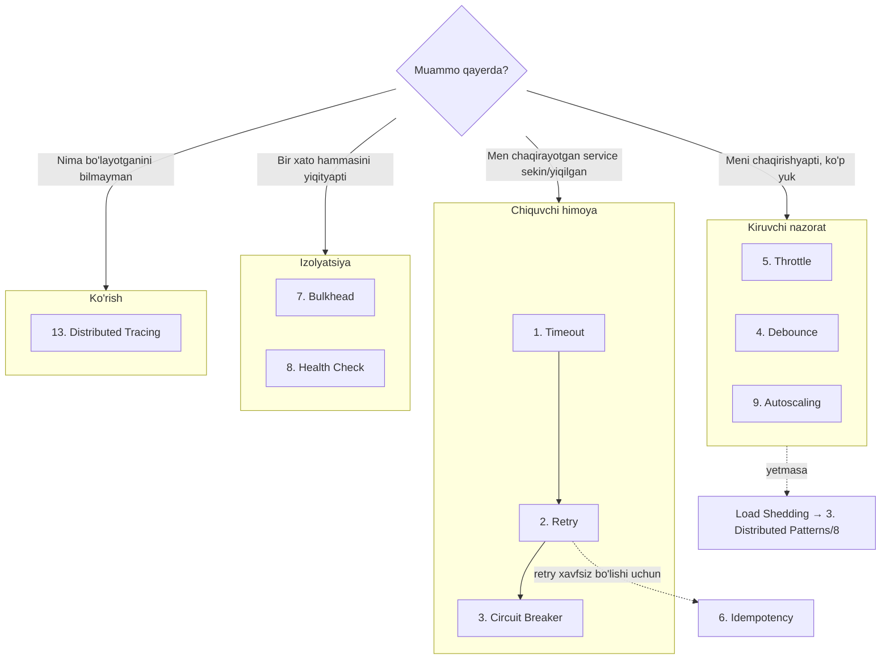

# Stability Patterns

Bitta service darajasida ishlaydigan chidamlilik patternlari. [1. Cloud Native App](../1.%20Cloud%20Native%20App/0.%20README.md) atributlarini (asosan **Resilience**) amalga oshiruvchi konkret asboblar; servicelar *orasidagi* muammolar uchun [3. Distributed Patterns](../3.%20Distributed%20Patterns/0.%20README.md) ga qarang.

## Mundarija — mantiqiy guruhlar bo'yicha

**Chiquvchi chaqiriq himoyasi (resilience zanjiri — shu tartibda qo'llang):**

| # | Pattern | Bir jumlada |
|---|---------|------------|
| 1 | [Timeout](1.%20Timeout.md) | Javobni abadiy kutma — har chaqiriqqa muddat qo'y |
| 2 | [Retry](2.%20Retry.md) | Vaqtinchalik xatoni backoff+jitter bilan qayta urin |
| 3 | [Circuit Breaker](3.%20Circuit%20Breaker.md) | Yiqilgan service'ni urishni to'xtat, tiklanishga imkon ber |

**Kiruvchi oqim nazorati:**

| # | Pattern | Bir jumlada |
|---|---------|------------|
| 4 | [Debounce](4.%20Debounce.md) | Ketma-ket kelgan bir xil chaqiriqlardan faqat bittasini bajar |
| 5 | [Throttle / Rate Limiting](5.%20Throttle%20-%20Rate%20Limiting.md) | Chaqiriqlar chastotasini token bucket bilan chekla |

**To'g'ri semantika va o'z holatini bilish:**

| # | Pattern | Bir jumlada |
|---|---------|------------|
| 6 | [Idempotency](6.%20Idempotency.md) | Takror chaqiriq natijani o'zgartirmasin — retry'ning sharti |
| 7 | [Bulkhead](7.%20Bulkhead.md) | Resurslarni bo'linmalarga ajrat — biri to'lsa boshqasi ishlasin |
| 8 | [Health Check](8.%20Health%20Check.md) | Liveness / shallow / deep — tiriklikni to'g'ri e'lon qil |
| 9 | [Autoscaling](9.%20Autoscaling.md) | Yukka qarab instance sonini avtomatik boshqar |

**Infrastruktura va migratsiya:**

| # | Pattern | Bir jumlada |
|---|---------|------------|
| 10 | [Sidecar](10.%20Sidecar.md) | Yordamchi vazifalarni yonma-yon konteynerga chiqar |
| 11 | [Ambassador](11.%20Ambassador.md) | Tashqariga chiqishni maxsus proxy orqali qil |
| 12 | [Strangler Fig](12.%20Strangler%20Fig.md) | Monolith'ni bosqichma-bosqich "bo'g'ib" almashtir |
| 13 | [Distributed Tracing](13.%20Distributed%20Tracing.md) | Request yo'lini servicelar bo'ylab kuzat |

## Qaysi pattern qachon — qaror daraxti

## Oltin qoidalar

1. **Tartib muhim:** avval Timeout (poydevor), keyin Retry (faqat idempotent operatsiyalarga!), oxirida Circuit Breaker. Retry'siz CB — ehtiyotkor, CB'siz Retry — retry storm xavfi.
2. **Har chiquvchi chaqiriqda kamida Timeout bo'lsin** — `context.Context` Go'da buning yagona idiomatik yo'li.
3. **Kiruvchi va chiquvchi himoyani farqla:** Throttle/Debounce — kiruvchi, Timeout/Retry/CB — chiquvchi.
4. Bu patternlar kodda (kutubxona) yoki infra'da (Envoy/Istio sidecar, API Gateway) yashashi mumkin — **ikkalasida ham takrorlamang**.

## Manba

Asos: "Cloud Native Go" (Titmus, 2022) 4-bob (Circuit Breaker, Debounce, Retry, Throttle, Timeout — Go kodlari) va 9-bob (backoff/jitter, health checks, autoscaling, idempotency). Sidecar/Ambassador/Strangler Fig — Azure Architecture Center va Martin Fowler materiallari.
