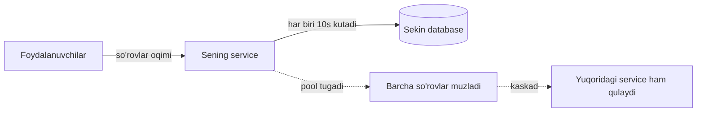
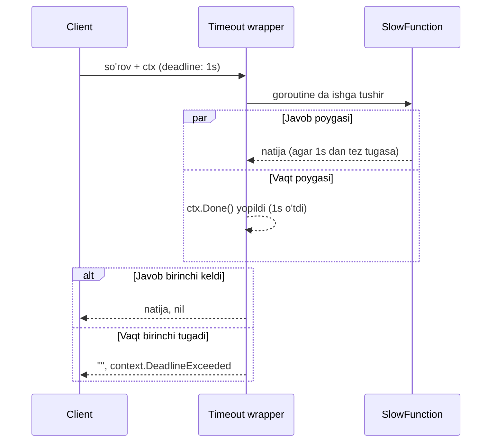
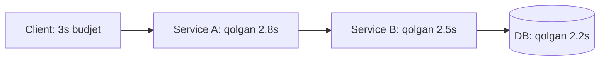

# 1. Timeout

> **TL;DR:** Timeout — bu jarayonga "javob kelmasligi aniq bo'lgach, kutishni to'xtat" degan buyruq. U resilience zanjiridagi **eng birinchi himoya chizig'i**: sekin javob beruvchi bog'liqlik (dependency) bizning resurslarimizni band qilib, cheksiz ushlab turmasligi uchun kerak. Timeout bo'lmasa Retry ham, Circuit Breaker ham to'g'ri ishlay olmaydi.

Bu — resilience "uchlik zanjiri" ning birinchi bo'g'ini:

> **Timeout** -> [Retry](./2.%20Retry.md) -> [Circuit Breaker](./3.%20Circuit%20Breaker.md)

Tartib tasodifiy emas: avval **timeout** qo'yasan (qachon voz kechishni bilish uchun), keyin **retry** qo'shasan (voz kechilgan urinishni takrorlash uchun), oxirida **circuit breaker** o'raysan (takror-takror muvaffaqiyatsiz bog'liqlikdan butunlay uzoqlashish uchun).

---

## Muammo — sekin javob tez tarqaladigan zaharga aylanadi

Tasavvur qil: sening service'ing har bir so'rovda database'ga murojaat qiladi. Odatda bu 20 millisekundda tugaydi. Bir kuni database sekinlashadi va har bir so'rov **10 sekund** javob berishni boshlaydi.

Nima bo'ladi? Har bir kiruvchi so'rov database bilan bitta connection'ni **10 sekund** band qilib turadi. Connection pool (ulanishlar zaxirasi) da faqat 100 ta connection bor. Sekundiga 50 ta yangi so'rov kelsa — 2 sekunddan keyin pool bo'shab qoladi, keyingi barcha so'rovlar navbatda muzlab qoladi.



Eng yomoni: database **umumiy** (shared) bo'lsa, bu sekinlik boshqa service'larga ham tarqaladi. Bitta komponentning sekinligi **cascading failure** (zanjirli qulash) ga aylanadi. Kitob buni aynan shunday ifodalaydi: "agar mag'lubiyat muqarrar deb hisoblasang, uni tezlashtirgan ma'qul".

> **Oltin qoida:** Sabrsizlik bu yerda fazilat. Javob kelmasligi aniq bo'lsa, kutishdan ko'ra tez xato qaytargan (fail fast) — resurslarni tejaydi va qulashni lokalizatsiya qiladi.

Distributed computing ning birinchi yolg'oni — "network ishonchli" (the network is reliable). Aslida switch'lar ishdan chiqadi, router va firewall noto'g'ri sozlanadi, paketlar yo'qoladi. Timeout aynan shu yolg'onga qarshi eng oddiy javob.

---

## Mohiyati — restoranda ovqat kutish

Analogiya: restoranga kirding, ofitsiantga buyurtma berding. Agar ovqat **1 soat** kelmasa, sen abadiy o'tirmaysan — turasan va ketasan. Bu — timeout.

Timeout ikki narsani beradi:
1. **Senga** — vaqting behuda ketmaydi, boshqa restoranga borasan (yoki retry qilasan).
2. **Restoranga** — stol bo'shaydi, boshqa mijozga xizmat qila oladi.

Analogiya chegarasi: restoranda sen ketganingni oshpaz bilmaydi va baribir ovqatni pishirishda davom etadi (resurs isrofi). Yaxshi timeout esa `context.Context` orqali **oshpazga ham** "to'xta, endi kerak emas" signalini yuboradi. Aynan shu narsa Go dagi context'ni oddiy `time.Sleep` dan ustun qiladi — bu **deadline propagation** (muddatni pastga uzatish).

---

## Qanday ishlaydi

Timeout'ning yuragi — ikki hodisadan **qay biri birinchi bo'lsa**, o'shanga reaksiya qilish: "javob keldi" yoki "vaqt tugadi". Go da bu `select` bilan tabiiy ifodalanadi.



Eng muhim tushuncha — `context.Context`. Bu Go 1.7 dan beri standart interfeys bo'lib, jarayonlar orasida **deadline** (oxirgi muddat), **cancel signal** (bekor qilish signali) va so'rov qiymatlarini uzatadi. Uning to'rt metodi bor, lekin timeout uchun ikkitasi asosiy:

```go
type Context interface {
    // Done ctx bekor bo'lganda yopiladigan channel qaytaradi
    Done() <-chan struct{}
    // Err ctx nega tugaganini bildiradi (DeadlineExceeded yoki Canceled)
    Err() error
    Deadline() (deadline time.Time, ok bool)
    Value(key interface{}) interface{}
}
```

`Done()` yopilganda "to'xta" signalidir; `Err()` sababini aytadi.

---

## Go implementatsiyasi

### 1-usul — context bilan (idiomatik yo'l)

Agar sekin funksiya `context.Context` qabul qilsa (yaxshi API'lar shunday qiladi), timeout atigi uch qatorga tushadi:

```go
// --- 1-qadam: bo'sh root context olamiz ---
ctx := context.Background()

// --- 2-qadam: undan 10 soniyalik timeout'li hosila (derived) context yasaymiz ---
ctxt, cancel := context.WithTimeout(ctx, 10*time.Second)

// --- 3-qadam: cancel'ni defer qilamiz — resurs sizib ketmasligi (goroutine leak) uchun ---
defer cancel()

// --- 4-qadam: funksiyaga context'ni uzatamiz; u 10s da o'zini to'xtatadi ---
result, err := SomeFunction(ctxt)
```

**Notional machine (ichkarida nima bo'ladi):** `WithTimeout` yangi context struct yaratadi va ichida bitta timer (`time.Timer`) ishga tushiradi. 10 soniyadan keyin timer ishga tushib, context'ning ichki `Done` channel'ini **yopadi**. Channel yopilishi — bu broadcast: shu channel'ni kuzatayotgan barcha goroutine'lar bir vaqtda "to'xta" signalini oladi. `Err()` esa `context.DeadlineExceeded` qaytaradi.

> `defer cancel()` ni **hech qachon** unutma. U timer'ni to'xtatib, context resurslarini bo'shatadi. Bo'lmasa funksiya vaqtidan oldin tugasa ham timer 10 soniya osilib turadi.

`WithTimeout` va `WithDeadline` farqi:

| Funksiya | Argument | Ma'nosi |
|---|---|---|
| `WithTimeout(ctx, d)` | davomiylik (`time.Duration`) | "**shundan** 10s o'tsa to'xta" |
| `WithDeadline(ctx, t)` | aniq vaqt (`time.Time`) | "soat **15:04:05** da to'xta" |
| `WithCancel(ctx)` | yo'q | faqat qo'lda `cancel()` bilan to'xtatiladi |

Uchalasi ham **hosila context** va `CancelFunc` qaytaradi. Muhim qoida:

> Context bekor qilinganda, undan **hosila** bo'lgan barcha context'lar ham bekor bo'ladi; lekin **ota** context'ga ta'sir qilmaydi.

### 2-usul — context qabul qilmaydigan funksiyani o'rash

Ba'zan (ayniqsa uchinchi tomon kutubxonalarida) sekin funksiya `Context` qabul qilmaydi va uni refactor qilib bo'lmaydi. U holda funksiyani **goroutine** ichida chaqirib, `select` bilan poyga uyushtiramiz. Kitobdagi klassik `Timeout` wrapper'i:

```go
// SlowFunction — context bilmaydigan, uzoq ishlaydigan funksiya
type SlowFunction func(string) (string, error)

// WithContext — natijada olinadigan, context'ni tushunadigan yangi imzo
type WithContext func(context.Context, string) (string, error)

func Timeout(f SlowFunction) WithContext {
    return func(ctx context.Context, arg string) (string, error) {
        // --- 1-qadam: natija va xato uchun channel'lar ---
        chres := make(chan string)
        cherr := make(chan error)

        // --- 2-qadam: sekin funksiyani alohida goroutine'da ishga tushiramiz ---
        go func() {
            res, err := f(arg)
            chres <- res
            cherr <- err
        }()

        // --- 3-qadam: kim birinchi bo'lsa — natija yoki timeout ---
        select {
        case res := <-chres:
            return res, <-cherr
        case <-ctx.Done():
            return "", ctx.Err()
        }
    }
}
```

Ishlatilishi bevosita chaqiruvdan deyarli farq qilmaydi, faqat ikki bosqich: avval wrapper'ni olamiz, keyin uni chaqiramiz.

```go
func main() {
    ctx := context.Background()
    ctxt, cancel := context.WithTimeout(ctx, 1*time.Second)
    defer cancel()

    timeout := Timeout(Slow)              // wrapper
    res, err := timeout(ctxt, "some input") // chaqiruv
    fmt.Println(res, err)
}
```

Chiqish (agar `Slow` 1 soniyadan uzoq ishlasa):

```
 context deadline exceeded
```

> ⚠️ **Diqqat — goroutine leak:** 2-usulda timeout ishga tushsa, `Timeout` funksiyasi qaytadi, lekin ichkaridagi goroutine `f(arg)` ni bajarishda **davom etadi**. `chres <- res` da esa hech kim o'qimaydi, shuning uchun goroutine abadiy bloklanib qoladi (leak). Buni oldini olish uchun channel'larni **buffered** qilish kerak: `make(chan string, 1)`. Shunda goroutine yozib bo'lib, tinch tugaydi. Kitobdagi minimal misolda bu yo'q — production'da qo'shib qo'y.

### 🤔 O'ylab ko'r

`select` ichida `case <-ctx.Done()` ni butunlay olib tashlasak, faqat `case res := <-chres` qolsa, nima bo'ladi?

<details>
<summary>💡 Javobni ko'rish</summary>

Timeout mexanizmi butunlay yo'qoladi. `select` faqat bitta case'ga ega bo'ladi, ya'ni oddiy `res := <-chres` bilan bir xil — funksiya `SlowFunction` tugaguncha (balki abadiy) bloklanadi. Bu bizni boshidagi muammoga qaytaradi: resurslar cheksiz band bo'ladi.
</details>

### Server tomonida timeout — database

Kitobdagi eng amaliy misol: HTTP handler kiruvchi so'rov context'ini oladi, unga o'z timeout'ini qo'shadi va database'ga uzatadi.

```go
func UserName(ctx context.Context, id int) (string, error) {
    const query = "SELECT username FROM users WHERE id=?"

    // --- kiruvchi ctx'dan 15s timeout'li hosila yasaymiz ---
    dctx, cancel := context.WithTimeout(ctx, 15*time.Second)
    defer cancel()

    var username string
    // QueryRowContext — context'ni tushunadigan variant; 15s da connection'ni bo'shatadi
    err := db.QueryRowContext(dctx, query, id).Scan(&username)
    return username, err
}
```

Standart `sql` paketida ko'p metodlarning `...Context` varianti bor (`QueryRow` -> `QueryRowContext`). Ular timeout va cancel'ni bevosita database driver'gacha yetkazadi.

Handler darajasida esa **client uzilishi** ham timeout signaliga aylanadi:

```go
func UserGetHandler(w http.ResponseWriter, r *http.Request) {
    id := mux.Vars(r)["id"]

    // r.Context() — client aloqani uzsa yoki ServeHTTP tugasa, bu ctx bekor bo'ladi
    rctx := r.Context()
    ctx, cancel := context.WithTimeout(rctx, 10*time.Second)
    defer cancel()

    username, err := UserName(ctx, id)
    switch {
    case errors.Is(err, sql.ErrNoRows):
        http.Error(w, "no such user", http.StatusNotFound)
    case errors.Is(err, context.DeadlineExceeded):
        http.Error(w, "database timeout", http.StatusGatewayTimeout)
    case err != nil:
        http.Error(w, err.Error(), http.StatusInternalServerError)
    default:
        w.Write([]byte(username))
    }
}
```

**Notional machine:** `r.Context()` HTTP so'rovga bog'langan context'dir. Client browser'ni yopsa (HTTP/2) yoki `ServeHTTP` tugasa, bu context avtomatik bekor bo'ladi. Biz undan hosila yasaganimiz uchun, HTTP so'rovning o'limi to'g'ridan-to'g'ri database connection'ining yopilishiga bog'lanadi. Zanjir: HTTP uzildi -> ctx bekor -> dctx bekor -> database connection bo'shadi. Bu **deadline propagation** ning go'zal namunasi.

---

## Real dunyoda

### `http.Client` — uchta xil timeout

Distributed system'da eng ko'p uchraydigan **tuzoq**: `http.Get` va `http.Post` yordamchi funksiyalari **default timeout'siz** ishlaydi. Ularning timeout'i `0` — Go da bu "timeout yo'q, abadiy kut" degani. Sekin server sening service'ingni osib qo'yishi mumkin.

Eng oddiy tuzatish — o'z `Client`'ingni yasa:

```go
var client = &http.Client{
    Timeout: 10 * time.Second, // butun so'rovga (dial + TLS + response) umumiy chegara
}
response, err := client.Get(url)
```

Lekin `Client.Timeout` — bu **umumiy** timeout. Amaliyotda so'rovning har bir bosqichini alohida boshqarish kerak. Buning uchun `http.Transport` ishlatiladi:

| Timeout turi | Qayerda | Nimani cheklaydi |
|---|---|---|
| `DialContext` (Dialer.Timeout) | Transport | TCP ulanish o'rnatish vaqti |
| `TLSHandshakeTimeout` | Transport | TLS qo'l berishish (handshake) vaqti |
| `ResponseHeaderTimeout` | Transport | So'rov yuborilgach, javob header'larini kutish |
| `Client.Timeout` | Client | Butun so'rov (dial + TLS + tana o'qish) |
| `context` deadline | Har chaqiruv | Eng moslashuvchan, per-request |

```go
transport := &http.Transport{
    DialContext: (&net.Dialer{
        Timeout: 2 * time.Second, // TCP dial
    }).DialContext,
    TLSHandshakeTimeout:   2 * time.Second,
    ResponseHeaderTimeout: 3 * time.Second,
}
client := &http.Client{Transport: transport, Timeout: 10 * time.Second}
```

Eng moslashuvchan yo'l — har so'rovga context berish (`http.NewRequestWithContext`):

```go
func (c *ClientContext) GetContext(ctx context.Context, url string) (*http.Response, error) {
    req, err := http.NewRequestWithContext(ctx, "GET", url, nil)
    if err != nil {
        return nil, err
    }
    return c.Do(req)
}
```

### gRPC — deadline propagation

gRPC client'lari ham default'da timeout'siz, lekin context orqali deadline berish idiomatik yo'l. Eski `grpc.WithTimeout` **deprecated** (foydalanishdan chiqarilgan) — o'rniga `grpc.DialContext` + `context.WithTimeout` ishlat:

```go
func TimeoutKeyValueGet() *pb.Response {
    // 5s deadline — dial va keyingi RPC chaqiruvlar uchun birgalikda
    ctx, cancel := context.WithTimeout(context.Background(), 5*time.Second)
    defer cancel()

    opts := []grpc.DialOption{grpc.WithInsecure(), grpc.WithBlock()}
    conn, err := grpc.DialContext(ctx, serverAddr, opts...)
    if err != nil {
        grpclog.Fatalf(err)
    }
    defer conn.Close()

    client := pb.NewKeyValueClient(conn)
    response, err := client.Get(ctx, &pb.GetRequest{Key: key}) // xuddi shu ctx qayta ishlatiladi
    if err != nil {
        grpclog.Fatalf(err)
    }
    return response
}
```

gRPC'ning eng kuchli tomoni: deadline **avtomatik tarqaladi**. A service B'ni chaqirsa, qolgan vaqt (deadline) B'ga metadata orqali uzatiladi; B esa C'ni chaqirsa — yana kamayadi. Bu **deadline propagation** butun zanjir bo'ylab ishlaydi. Diqqat: bir context'ni ham dial, ham RPC uchun ishlatsang, ikkalasi bitta byudjetni bo'lishadi.

### Kubernetes va Envoy

Infratuzilma darajasida ham timeout hamma joyda: Kubernetes'da liveness/readiness probe'larda `timeoutSeconds` bor. Envoy va service mesh'larda (Istio) route darajasida `timeout`, `idle_timeout` sozlanadi. API Gateway'lar upstream'ga timeout qo'yadi. Ya'ni timeout — kod, kutubxona **va** platforma darajasida takrorlanadigan, ko'p qatlamli himoya.

### Timeout qiymatini qanday tanlash — p99 asosida

Bu eng ko'p savol tug'diradigan qism. Tasodifiy son (masalan "5 soniya") qo'yma. AWS Builders' Library maslahati: timeout'ni **latency taqsimotining yuqori percentile'lariga** qarab tanla.

- **p50 (median)** — so'rovlarning yarmi shundan tez.
- **p99** — so'rovlarning 99% shundan tez tugaydi.
- **p99.9** — deyarli barchasi.

Amaliy qoida: timeout'ni **p99 (yoki p99.9) dan biroz yuqori** qo'y. Sabab:
- Juda **past** qo'ysang — normal, biroz sekinroq so'rovlarni ham o'ldirasan (false timeout), retry storm'ni qo'zg'aysan.
- Juda **yuqori** qo'ysang — timeout kech ishlaydi, resurslar uzoq band bo'ladi, fail fast foydasi yo'qoladi.

> Timeout = "sog'lom, lekin sekinroq" so'rovni o'tkazadigan, "kasal" so'rovni esa kesadigan chegara. p99 aynan shu chegarani ko'rsatadi.

### Timeout budget va deadline propagation

Ko'p qatlamli tizimda har bir qatlamga alohida timeout qo'yish xato. To'g'ri yondashuv — **timeout budget**: client boshida bitta umumiy deadline belgilaydi (masalan 3s), va bu deadline butun zanjir bo'ylab context orqali tarqaladi.



Har bir hop biroz vaqt "yeydi", va pastdagi komponentga **qolgan** vaqt uzatiladi. Agar B ga so'rov yetganda budjet allaqachon tugagan bo'lsa, B umuman ishni boshlamaydi — bekorga resurs sarflamaydi. gRPC buni built-in qiladi; HTTP'da context'ni qo'lda uzatib erishiladi.

---

## Tuzoqlar va anti-patternlar

- **Timeout'siz `http.Get`/`http.Post`.** Default `Timeout: 0` — abadiy kutish. Har doim o'z `http.Client`'ingni timeout bilan yasa yoki `NewRequestWithContext` ishlat.
- **`defer cancel()` ni unutish.** Har bir `WithTimeout`/`WithDeadline`/`WithCancel` uchun `cancel` chaqirilishi shart. Bo'lmasa — timer va goroutine leak.
- **Context'ni goroutine'ga uzatmaslik.** Timeout qo'ydingu, lekin ichkaridagi og'ir ish context'ni tekshirmasa (`select { case <-ctx.Done() }` yoki `ctx.Err()`), u to'xtamaydi — faqat chaqiruvchi qaytadi, ish davom etadi.
- **Bitta context'ni juda ko'p operatsiyaga ulash.** Bir `ctx` ni dial va bir nechta RPC uchun ishlatsang, hammasi bitta deadline'ni bo'lishadi — kutmagan joyda tugab qolishi mumkin.
- **Timeout'ni retry bilan aralashtirmaslik xatosi.** Juda **qisqa** timeout + agressiv **retry** = self-inflicted retry storm. Sekin, lekin sog'lom so'rovlarni o'ldirib, ustiga qayta-qayta urinasan. Timeout va retry birga sozlanishi kerak ([Retry](./2.%20Retry.md) ga qara).
- **Unbuffered channel'li wrapper.** Yuqorida ko'rilgan goroutine leak. Buffered channel (`make(chan T, 1)`) yechadi.

---

## Bog'liq patternlar

| Pattern | Aloqasi | Link |
|---|---|---|
| Retry | Timeout bo'yicha kesilgan urinishni takrorlaydi; timeout retry'ning sharti | [2. Retry](./2.%20Retry.md) |
| Circuit Breaker | Ko'p timeout ketma-ket kelsa, CB "ochiladi" va so'rovlarni to'xtatadi | [3. Circuit Breaker](./3.%20Circuit%20Breaker.md) |
| Backpressure / Load Shedding | Timeout — client tomonida; load shedding — server tomonida ortiqcha yukni tashlaydi | [Backpressure - Load Shedding](../3.%20Distributed%20Patterns/8.%20Backpressure%20-%20Load%20Shedding.md) |
| Resilience (umumiy) | Timeout — resilience'ning eng birinchi qatlami | [Resilience](../1.%20Cloud%20Native%20App/4.%20Resilience.md) |

---

## Interview savollari

**1. Nega timeout resilience zanjirining eng birinchi qatlami deb ataladi?**

<details>
<summary>Javob</summary>

Chunki timeout'siz Retry ham, Circuit Breaker ham to'g'ri ishlay olmaydi. Timeout "qachon voz kechishni" belgilaydi — bu qaror bo'lmasa, so'rov cheksiz osilib qoladi va resurs (connection, goroutine, memory) tugaydi. Retry faqat kesilgan (timeout bo'lgan) urinishni takrorlaydi; Circuit Breaker esa ketma-ket timeout/xatolarni sanab, "ochiladi". Ikkalasi ham timeout signalisiz mavjud emas. Bundan tashqari timeout eng oddiy va eng kam kod talab qiladigan himoya — shuning uchun birinchi qo'yiladi.
</details>

**2. `context.WithTimeout` va `context.WithDeadline` orasidagi farq nima? Qachon qaysi biri qulay?**

<details>
<summary>Javob</summary>

`WithTimeout(ctx, d)` — nisbiy davomiylik ("shu paytdan 5s o'tsa"). `WithDeadline(ctx, t)` — mutlaq vaqt ("soat 15:04:05 da"). Aslida `WithTimeout` ichkarida `WithDeadline(ctx, time.Now().Add(d))` ni chaqiradi. Deadline propagation'da `WithDeadline` qulay: butun zanjir bir xil mutlaq muddatga bog'lanadi, har hop nisbiy vaqtni qayta hisoblamaydi. `WithTimeout` esa lokal, izolyatsiyalangan operatsiyalarga qulayroq.
</details>

**3. `defer cancel()` ni unutsak nima bo'ladi?**

<details>
<summary>Javob</summary>

Context ichidagi timer (`time.Timer`) va unga bog'liq resurslar timeout tugaguncha (yoki GC uni yig'guncha) osilib qoladi. Bu resurs (memory) leak. `go vet` bu holatni "the cancel function is not used on all paths" deb ogohlantiradi. Funksiya deadline'dan oldin tugasa ham, `cancel()` timerni darhol to'xtatadi va tozalaydi. Shuning uchun `WithTimeout`/`WithCancel` dan keyin darhol `defer cancel()` yozish qat'iy qoida.
</details>

**4. Timeout qiymatini qanday tanlaysan? Nega "5 soniya" yomon javob?**

<details>
<summary>Javob</summary>

"5 soniya" — tasodifiy son, latency taqsimoti bilan bog'lanmagan. To'g'ri yo'l: real metrikalar (p50, p99, p99.9) yig'ib, timeout'ni **p99 yoki p99.9 dan biroz yuqori** qo'yish. Juda past timeout sog'lom-lekin-sekinroq so'rovlarni o'ldirib retry storm keltiradi; juda yuqori timeout fail-fast foydasini yo'qotadi va resurslarni uzoq band qiladi. Timeout — sog'lom so'rovni o'tkazib, kasal so'rovni kesadigan optimal chegara.
</details>

**5. `Client.Timeout` va `Transport.ResponseHeaderTimeout` orasidagi farq nima?**

<details>
<summary>Javob</summary>

`Client.Timeout` — butun so'rov sikliga umumiy chegara: DNS + TCP dial + TLS handshake + so'rov yuborish + javob tanasini (body) o'qish, hammasini o'z ichiga oladi. `ResponseHeaderTimeout` — faqat so'rov to'liq yuborilgach, server javob header'larini yuborishini kutish vaqti (body hisobga olinmaydi). Ikkinchisi granular: sekin dial va sekin server javobini alohida ajratadi. Katta fayl yuklab olishda `Client.Timeout` xavfli bo'lishi mumkin (butun yuklashni cheklaydi), shuning uchun granular Transport timeout'lari afzalroq.
</details>

---

## Eslab qol

- **Timeout — resilience'ning eng birinchi qatlami**: "javob kelmasligi aniq bo'lsa, kutishni to'xtat".
- Go da idiomatik timeout = `context.Context` + `WithTimeout`/`WithDeadline`, va har doim `defer cancel()`.
- `http.Get`/`http.Post` default'da **timeout'siz** (`0`) — har doim o'z `Client`'ingni yasa yoki context ishlat.
- Timeout qiymatini **p99/p99.9 latency**ga qarab tanla, tasodifiy songa emas.
- **Deadline propagation**: client bitta budjet belgilaydi, u context orqali butun zanjirga tarqaladi — pastdagi komponent bekorga ishlamaydi.
- Keyingi bo'g'in: [Retry](./2.%20Retry.md) — timeout bo'yicha kesilgan urinishni **xavfsiz** takrorlash.
