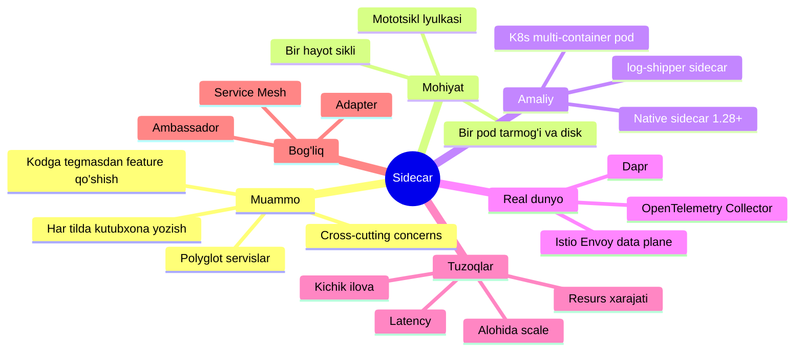
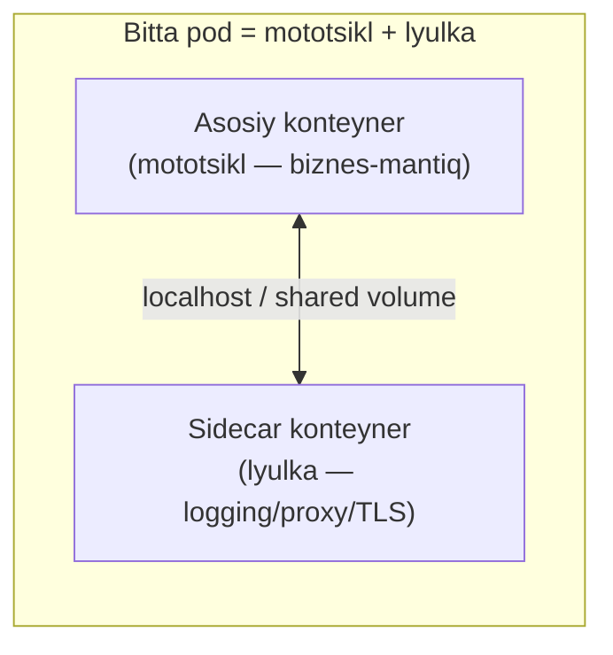
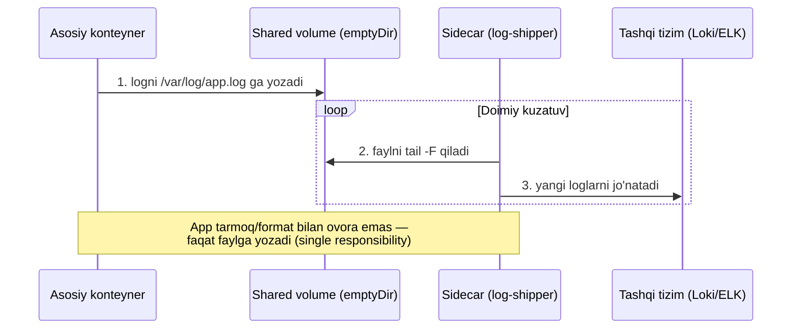
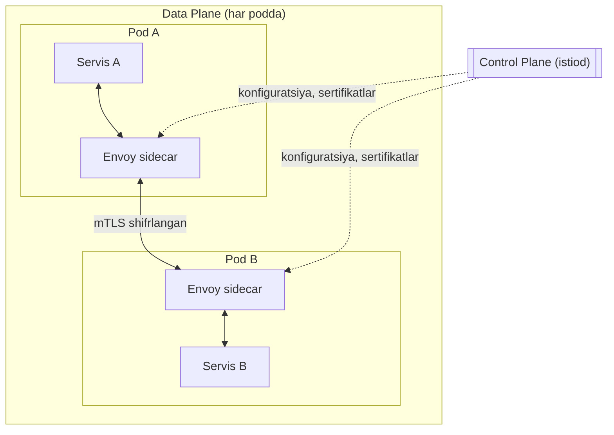
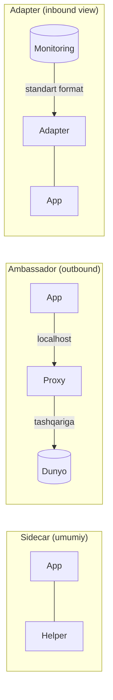

# 10. Sidecar

> **TL;DR:** Sidecar — bu asosiy ilova konteyneri yoniga, u bilan **bir xost/bir pod** ichida joylashtiriladigan yordamchi konteyner. U logging, monitoring, proxy, config-reload, TLS kabi *cross-cutting* (barcha servislarga umumiy) vazifalarni ilova kodiga tegmasdan bajaradi. Asosiy ilova va sidecar bir hayot siklini bo'lishadi: birga tug'iladi, birga o'ladi.

---

## Mavzu xaritasi



---

## Muammo — qaysi og'riqni hal qiladi

Tasavvur qil: sening tizimingda 12 ta microservice bor. Uchtasi **Go**, beshtasi **Python**, ikkitasi **Node.js**, qolgani **Java**. Endi rahbariyat aytadi: "Barcha servislarga bir xil **structured logging**, **distributed tracing** va **mTLS** (o'zaro TLS shifrlash) qo'shamiz."

Klassik yo'l bilan bu — kabus:

- Har bir til uchun **alohida client kutubxona** yozish yoki topish kerak (Go SDK, Python SDK, Node SDK...).
- Har bir jamoa o'z kodini o'zgartirishi, qayta build va deploy qilishi kerak.
- Legacy servis (kodini hech kim tushunmaydigan eski Java ilova) umuman o'zgartirib bo'lmaydi.
- Versiyalar bir-biriga mos kelmaydi: bir jamoa tracing kutubxonasini yangiladi, boshqasi eski versiyada qoldi.

> Muammoning mohiyati: **cross-cutting concern** (barcha servislarga tegishli, lekin biznes-mantiqqa aloqasi yo'q vazifa) har bir servisning kodiga "yopishib" qoladi. Uni markazlashtirib bo'lmaydi.

Ikkita yomon variant qoladi:

| Yondashuv | Muammo |
| --- | --- |
| Kodga qattiq bog'lash (in-process kutubxona) | Til bilan bog'lanib qolasan, izolyatsiya yo'q — bitta bug butun ilovani yiqitadi |
| Alohida remote servis | Har chaqiruvda tarmoq latency, kutubxona baribir har tilda kerak |

Sidecar — aynan shu ikki yomon variant orasidagi "oltin o'rta".

---

## Mohiyati — mototsikl lyulkasi analogiyasi

Sidecar so'zining o'zi **mototsikl yonidagi lyulka**dan olingan (inglizcha *sidecar* — yon arava).



Lyulka mototsikldan **alohida qism**, lekin:

- Bir shassiga biriktirilgan — birga yuradi, birga to'xtaydi (**bir hayot sikli**).
- Mototsikl haydovchisi lyulkadagi yo'lovchi bilan gaplashishi oson — yaqin (**past latency**, `localhost` orqali).
- Lyulkani yechib, boshqasini qo'yish mumkin — mototsiklga tegmasdan (**mustaqil yangilanish**).
- Lyulka mototsikl bo'lmasa mavjud bo'lmaydi — u yordamchi, bosh emas.

**Analogiya chegarasi (misconception oldini olish):** Lyulka doim yo'lovchi tashiydi (chiquvchi yordamchi). Lekin sidecar *ixtisoslashmagan* — u proxy ham, log yig'uvchi ham, config kuzatuvchi ham bo'lishi mumkin. Chiquvchi trafik proxy'siga *ixtisoslashgan* sidecar — bu alohida nom oladi: **Ambassador** (keyingi darsda). Ya'ni: har Ambassador — sidecar, lekin har sidecar — Ambassador emas.

---

## Sodda ta'rif

> **Sidecar** — asosiy ilova bilan bir xost (odatda bir Kubernetes pod) ichida ishlaydigan, uning hayot siklini bo'lishadigan, biznes-mantiqqa aloqasi yo'q yordamchi (cross-cutting) vazifalarni bajaruvchi alohida konteyner.

Uch xislati bir vaqtda bo'lishi shart:
1. **Co-location** — asosiy ilova bilan bir joyda (bir pod).
2. **Shared lifecycle** — birga yaratiladi, birga o'chiriladi.
3. **Separate process** — alohida konteyner/protsess (izolyatsiya, boshqa til).

---

## Qanday ishlaydi

Kubernetes pod'i — bu **bir yoki bir nechta konteyner** uchun umumiy "qobiq". Bir pod ichidagi konteynerlar ikki narsani bo'lishadi:

- **Tarmoq namespace'i** — ikkovi ham `localhost` (127.0.0.1) orqali gaplasha oladi. App `localhost:15000`ga yozsa, sidecar uni ushlaydi.
- **Volume** (ixtiyoriy) — umumiy disk. App logni faylga yozadi, sidecar shu faylni o'qib tashqariga jo'natadi.



Diqqat qil: **asosiy ilova hech nima bilmaydi**. U shunchaki faylga yozadi. Loglarni qayerga, qaysi formatda, qaysi protokol bilan jo'natish — bularning hammasi sidecar'ning ishi. Ilova kodiga bir qator ham qo'shilmadi.

---

## Amaliy misol

### 1-misol: klassik multi-container pod (app + log-shipper)

```yaml
# --- 1-qadam: pod ta'rifi ---
apiVersion: v1
kind: Pod
metadata:
  name: web-app
spec:
  # --- 2-qadam: umumiy disk (ikkala konteyner ko'radi) ---
  volumes:
    - name: logs
      emptyDir: {}          # pod bilan yashaydigan vaqtinchalik disk

  containers:
    # --- 3-qadam: ASOSIY konteyner — faqat biznes-mantiq ---
    - name: app
      image: myorg/web-app:1.4
      volumeMounts:
        - name: logs
          mountPath: /var/log/app   # shu yerga log yozadi

    # --- 4-qadam: SIDECAR — loglarni tashqariga jo'natadi ---
    - name: log-shipper
      image: grafana/fluent-bit:2.2
      volumeMounts:
        - name: logs
          mountPath: /var/log/app   # AYNAN o'sha diskni o'qiydi
```

**Nima bo'ldi?** `app` konteyneri `/var/log/app/`ga yozadi. `log-shipper` (fluent-bit) o'sha diskni kuzatib, yangi loglarni Loki yoki ELK'ga jo'natadi. Ilova kodida "log qayerga ketadi?" degan savol umuman yo'q.

> 🤔 **O'ylab ko'r:** Bu ikki konteyner qaysi resurslarni bo'lishadi, qaysilarini yo'q? Agar `emptyDir`ni olib tashlasak, sidecar loglarni ko'ra oladimi?

<details>
<summary>💡 Javobni ko'rish</summary>

Bo'lishadi: **tarmoq namespace'i** (localhost) va **umumiy volume**lar. Bo'lishmaydi: **fayl tizimining qolgan qismi** (har konteynerning o'z image'i, o'z root FS'i) va **protsess namespace'i** (odatda alohida).

`emptyDir`ni olib tashlasak — sidecar `app`ning log faylini **ko'ra olmaydi**, chunki har konteynerning o'z izolyatsiyalangan disk'i bor. Umumiy volume — aynan shu ko'prik.
</details>

### 2-misol: Native Sidecar (Kubernetes 1.28+)

Klassik usulda katta muammo bor edi: **tartib kafolatlanmaydi**. Pod ishga tushganda `app` sidecar'dan oldin tayyor bo'lib qolishi, yoki pod o'chirilganda sidecar app'dan oldin o'lib, oxirgi loglar yo'qolishi mumkin edi.

Kubernetes 1.28'dan (stable — 1.33) **native sidecar** paydo bo'ldi: bu `initContainers` ichida `restartPolicy: Always` bilan e'lon qilingan konteyner.

```yaml
apiVersion: apps/v1
kind: Deployment
metadata:
  name: web-app
spec:
  replicas: 1
  selector:
    matchLabels: { app: web-app }
  template:
    metadata:
      labels: { app: web-app }
    spec:
      # --- 1-qadam: SIDECAR initContainers ichida, lekin Always bilan ---
      initContainers:
        - name: log-shipper
          image: grafana/fluent-bit:2.2
          restartPolicy: Always      # <-- SEHR shu yerda: init emas, sidecar bo'ladi
          volumeMounts:
            - { name: logs, mountPath: /var/log/app }

      # --- 2-qadam: asosiy konteyner ---
      containers:
        - name: app
          image: myorg/web-app:1.4
          volumeMounts:
            - { name: logs, mountPath: /var/log/app }

      volumes:
        - name: logs
          emptyDir: {}
```

**`restartPolicy: Always` nima o'zgartiradi?**

| Xususiyat | Oddiy init container | Native sidecar (Always) | Oddiy sidecar (containers) |
| --- | --- | --- | --- |
| Ishga tushishi | Pod boshida, bir marta | App'dan **oldin** tayyor bo'ladi | App bilan parallel, tartib yo'q |
| Yashash muddati | App boshlanishidan oldin tugaydi | Butun pod umri davomida | Butun pod umri davomida |
| To'xtash tartibi | — | App to'xtagach, **teskari tartibda** | Kafolatsiz |
| Probe (liveness/readiness) | Yo'q | Bor | Bor |

Ya'ni native sidecar kafolat beradi: **sidecar app'dan oldin tayyor, app'dan keyin o'ladi** — proxy yoki log-shipper uchun aynan kerakli xatti-harakat.

> 🤔 **O'ylab ko'r:** Nega `log-shipper`ni app'dan **keyin** o'chirish muhim? Oddiy `containers`da ular parallel o'chsa nima yo'qoladi?

<details>
<summary>💡 Javobni ko'rish</summary>

App to'xtashdan oldin **oxirgi loglarni** yozadi (masalan "graceful shutdown" xabarlari, xatolar). Agar log-shipper app'dan oldin o'lsa, aynan shu eng qimmatli, avariya payti loglari yo'qoladi. Native sidecar app to'xtaguncha kutadi, keyin loglarni tozalab (flush) o'chadi.
</details>

---

## Real dunyoda

### Istio / Envoy — Service Mesh ning data plane'i

Bugungi eng mashhur sidecar qo'llanishi — **service mesh**. Istio har bir pod'ga avtomatik ravishda **Envoy** proxy konteynerini "inject" qiladi (istio-proxy).



Servislar orasidagi **butun tarmoq trafigi** Envoy sidecar'lar orqali o'tadi. Bu esa quyidagilarni ilova kodiga tegmasdan beradi:

- **mTLS** — servislar orasida avtomatik shifrlash.
- **Load balancing, retry, timeout, circuit breaking** — barqarorlik pattern'lari infratuzilma darajasida.
- **Telemetry** — har chaqiruv uchun metrics, tracing, loglar.
- **Traffic splitting** — canary/blue-green deploy (masalan 5% trafik yangi versiyaga).

`istiod` (control plane) yuqori darajadagi qoidalarni Envoy'ga tushunarli konfiguratsiyaga aylantirib, sidecar'larga tarqatadi.

> Diqqat: yangi **Istio Ambient mode** sidecar'ni pod'dan olib, node darajasidagi `ztunnel`ga ko'chiradi — chunki har podda Envoy tutish qimmat (resurs). Bu — sidecar'ning "resurs xarajati" tuzog'iga sanoat javobi.

### Boshqa mashhur sidecar'lar

| Sidecar | Vazifasi |
| --- | --- |
| **Dapr** | Til-agnostik "distributed application runtime" — state, pub/sub, service invocation `localhost` orqali |
| **OpenTelemetry Collector** | Metrics/traces/loglarni yig'ib, boyitib, tashqi tizimga jo'natadi |
| **Envoy (standalone)** | Proxy, TLS termination, protocol bridge |
| **git-sync / config-reloader** | Config yoki sertifikatni yangilanganda ilovaga qayta yuklaydi |

---

## Tuzoqlar va anti-patternlar

⚠️ **1. "Har narsani sidecar'ga tiqish" (sidecar sprawl).**
Noto'g'ri tasavvur: "Sidecar zo'r, hamma yordamchi kodni shunga chiqaramiz." Nega yomon: har sidecar CPU/RAM yeydi, va u **har bir pod nusxasida** takrorlanadi. 1000 ta pod = 1000 ta sidecar nusxasi. To'g'risi: faqat haqiqiy cross-cutting, til-agnostik vazifalarni chiqar.

⚠️ **2. Kichik ilova uchun sidecar.**
Agar ilovang kichik bo'lsa, sidecar'ning resurs narxi (masalan Envoy ~50-150 MB RAM) asosiy ilovadan katta bo'lishi mumkin. Bu holda oddiy in-process kutubxona arzonroq.

⚠️ **3. Latency-ga sezgir tez IPC.**
Sidecar orqali o'tish `localhost` bo'lsa ham nol emas — har chaqiruvga ~0.1-1 ms qo'shiladi. Konteynerlar orasida **juda tez-tez** (sekundiga million marta) muloqot bo'lsa, sidecar noto'g'ri tanlov. Bunday holda in-process kutubxona ishlat.

⚠️ **4. Komponentni alohida scale qilish kerak bo'lsa.**
Sidecar app bilan **1:1** scale bo'ladi (har app nusxasiga bitta sidecar). Agar yordamchi komponentni mustaqil ko'paytirish kerak bo'lsa (masalan og'ir batch protsessor), uni **alohida servis** qil, sidecar emas.

⚠️ **5. Til-bog'liq (framework-agnostik emas) IPC tanlash.**
Sidecar bilan aloqada Go'ga xos gob yoki Java serializatsiyasidan foydalansang, sidecar'ning til-agnostiklik afzalligini yo'qotasan. HTTP/gRPC kabi neytral protokol ishlat.

> **Oltin qoida:** Sidecar — *cross-cutting, til-agnostik, app bilan bir sur'atda scale bo'ladigan* vazifalar uchun. Aks holda — kutubxona yoki alohida servis.

---

## Bog'liq patternlar

Brendan Burns va David Oppenheimer ("Design Patterns for Container-Based Distributed Systems", HotCloud 2016) **single-node** (bir mashinadagi kooperativ konteynerlar) uchun uchta patternni ajratdi. Sidecar — ularning umumiy nomi, Ambassador va Adapter esa uning ixtisoslashgan turlari:

| Pattern | Aloqasi | Yo'nalish | Link |
| --- | --- | --- | --- |
| **Ambassador** | Chiquvchi (outbound) trafik uchun ixtisoslashgan sidecar — app'ni tashqi dunyoga ulaydi | App → Dunyo | [11. Ambassador](11.%20Ambassador.md) |
| **Adapter** | App chiqishini (masalan monitoring formatini) tashqi dunyo uchun standartlashtiruvchi sidecar | Dunyo ← App | (bu repoda alohida yo'q) |
| **API Gateway / BFF** | Gateway — butun tizim chetidagi bitta kirish nuqtasi; sidecar — har pod ichida | Chekka vs pod | [7. API Gateway - BFF](../3.%20Distributed%20Patterns/7.%20API%20Gateway%20-%20BFF.md) |
| **Circuit Breaker** | Sidecar (Envoy) ichida amalga oshiriladigan barqarorlik mantig'i | Ichki komponent | [1. Circuit Breaker](3.%20Circuit%20Breaker.md) |

Burns taxonomiyasini bir jumlada eslab qol:

> **Sidecar** — app'ni *kuchaytiradi*; **Ambassador** — app'ni *tashqi dunyoga* proxy qiladi; **Adapter** — app'ni *tashqi dunyoga standart ko'rinishda* taqdim etadi.



---

## Interview savollari

**1. Sidecar bilan oddiy kutubxona (library) orasidagi farq nima? Qachon qaysi birini tanlaysan?**

<details>
<summary>Javob</summary>

Kutubxona ilova protsessi ichida (in-process) ishlaydi: eng past latency, chuqur integratsiya, lekin **tilga bog'liq** va izolyatsiya yo'q (bug butun ilovani yiqitadi). Sidecar alohida protsess: **til-agnostik**, izolyatsiyalangan, mustaqil yangilanadi, lekin IPC latency va resurs narxi qo'shiladi.

Tanlov: bitta til bo'lsa va latency kritik bo'lsa → kutubxona. Ko'p til (polyglot), legacy kod, alohida jamoa egaligi, mustaqil yangilanish kerak bo'lsa → sidecar.
</details>

**2. Bir pod ichidagi konteynerlar nimani bo'lishadi, nimani bo'lishmaydi?**

<details>
<summary>Javob</summary>

Bo'lishadi: **tarmoq namespace'i** (bir xil IP, `localhost` orqali muloqot), **umumiy volume**lar (aniq mount qilinsa), ixtiyoriy holda IPC/PID namespace. Bo'lishmaydi: har konteynerning **o'z root fayl tizimi** (o'z image'i), o'z CPU/RAM cheklovlari (odatda). Aynan shu sabab log-shipper app'ning logini ko'rishi uchun umumiy `emptyDir` volume kerak.
</details>

**3. Native sidecar (init container + `restartPolicy: Always`) klassik `containers` ichidagi sidecar'dan nimasi bilan yaxshi?**

<details>
<summary>Javob</summary>

U **hayot siklini kafolatlaydi**: sidecar asosiy konteynerdan **oldin** tayyor bo'ladi (proxy yoki log-shipper app boshlanishidan avval ishga tushishi kerak) va app to'xtagach **teskari tartibda** o'chadi (oxirgi loglar yo'qolmaydi). Oddiy `containers`da bunday tartib kafolatlanmaydi. Bundan tashqari native sidecar liveness/readiness probe'larni qo'llab-quvvatlaydi va Job/CronJob tugashiga to'sqinlik qilmaydi.
</details>

**4. Nega Istio Ambient mode sidecar'ni pod'dan olib tashladi? Bu sidecar pattern'ining qaysi kamchiligini ko'rsatadi?**

<details>
<summary>Javob</summary>

Har podda Envoy sidecar tutish **resurs xarajati** juda katta: minglab pod = minglab Envoy nusxasi (har biri o'nlab-yuzlab MB RAM). Bu sidecar'ning asosiy kamchiligi — u **har app nusxasida takrorlanadi**. Ambient mode proxy'ni node darajasidagi bitta `ztunnel`ga ko'chirib, per-pod overhead'ni kamaytiradi. Bu — sidecar universal yechim emasligini ko'rsatadi: masshtab kattalashganda per-instance narx muammoga aylanadi.
</details>

**5. Sidecar orqali o'tish qanday qo'shimcha xarajatlar (trade-off) keltiradi?**

<details>
<summary>Javob</summary>

Uchta asosiy narx: (1) **Latency** — har chaqiruvga IPC/tarmoq qatlamidan o'tish vaqti qo'shiladi (`localhost` bo'lsa ham nol emas). (2) **Resurs** — har pod uchun qo'shimcha CPU/RAM. (3) **Murakkablik** — deploy, versiyalash, kuzatiladigan komponentlar soni ortadi. Shuning uchun latency-kritik tez IPC, kichik ilova yoki bitta til holatlarida sidecar noto'g'ri tanlov bo'lishi mumkin.
</details>

---

## Eslab qol

- **Sidecar = asosiy ilova yonidagi lyulka** — bir pod, bir hayot sikli, alohida konteyner. Cross-cutting vazifalarni ilova kodiga tegmasdan bajaradi.
- **Bir pod = umumiy tarmoq (localhost) + ixtiyoriy umumiy volume.** Aynan shu ikki ko'prik orqali app va sidecar gaplashadi.
- **Til-agnostiklik** — sidecar'ning eng katta kuchi: bir Envoy/Dapr/OTel Collector istalgan tildagi ilovaga xizmat qiladi.
- **Native sidecar (k8s 1.28+)** = `initContainers` + `restartPolicy: Always` — hayot siklini kafolatlaydi (app'dan oldin start, keyin stop).
- **Sidecar bepul emas:** latency, per-instance resurs narxi. Kichik ilova, tez IPC yoki bitta til bo'lsa — kutubxona yaxshiroq.
- **Burns taxonomiyasi:** Sidecar (umumiy) → Ambassador (outbound proxy) → Adapter (app'ni standartlashtiradi).

---

## 🔁 Takrorlash

- **Bog'liq oldingi mavzular:** [11. Ambassador](11.%20Ambassador.md) (chiquvchi trafik uchun ixtisoslashgan sidecar), [7. API Gateway - BFF](../3.%20Distributed%20Patterns/7.%20API%20Gateway%20-%20BFF.md), [1. Circuit Breaker](3.%20Circuit%20Breaker.md).
- **Takrorlash jadvali:** ertaga → 3 kundan keyin → 1 haftadan keyin yuqoridagi "Interview savollari"ga qaytib, javoblarni yodingdan aytib ko'r.
- **Feynman testi:** "Sidecar nima?" degan savolga kod so'zlarisiz, mototsikl-lyulka analogiyasi bilan 3 jumlada tushuntirib ber. Ambassador'dan farqini ham qo'sh.
