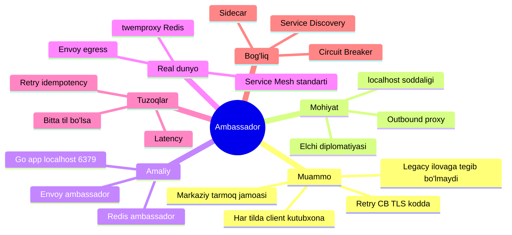
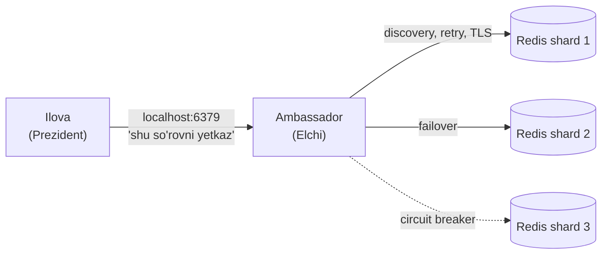
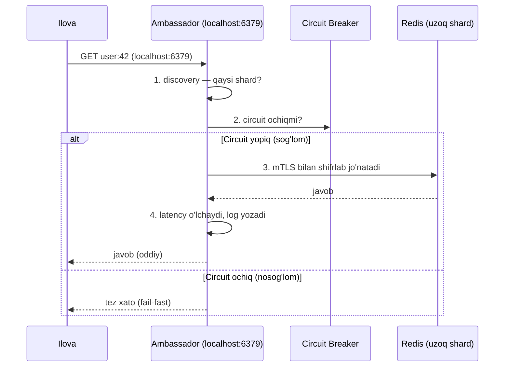
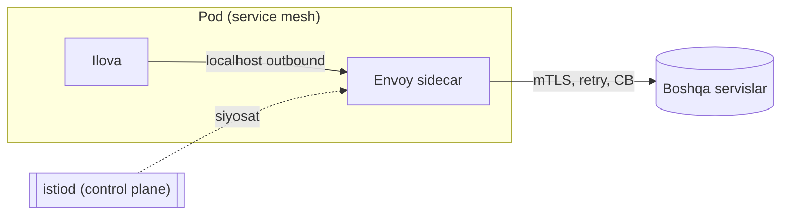
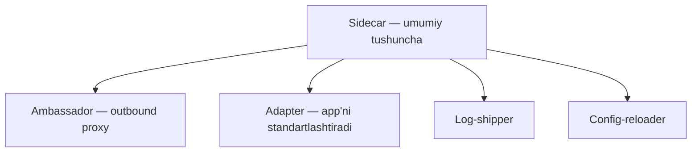

# 11. Ambassador

> **TL;DR:** Ambassador — bu ilova bilan bir xostda joylashgan, uning nomidan **tashqi dunyoga tarmoq so'rovlarini yuboradigan** proxy (out-of-process). Ilova shunchaki `localhost`ga ulanadi, ambassador esa service discovery, retry, circuit breaking, TLS, monitoring kabi barcha murakkab "ulanish" ishlarini o'z zimmasiga oladi. Bu — chiquvchi (outbound) trafik uchun **ixtisoslashgan sidecar**.

---

## Mavzu xaritasi



---

## Muammo — qaysi og'riqni hal qiladi

Eslaysanmi, [Sidecar](10.%20Sidecar.md) darsida polyglot (ko'p tilli) tizimga cross-cutting funksiyalar qo'shish qiyinligini ko'rdik? Ambassador — o'sha muammoning **chiquvchi tarmoq** qismidagi aniq yechimi.

Tasavvur qil: ilovang Redis'ga ulanadi. Lekin production'da Redis oddiy emas:

- Redis **sharded** (bir nechta node'ga bo'lingan) — qaysi kalit qaysi node'da ekanini bilish kerak.
- Node yiqilsa, **failover** — boshqa replica'ga o'tish kerak.
- Ulanish **TLS** bilan shifrlangan bo'lishi kerak.
- Vaqtinchalik xato bo'lsa **retry** qilish kerak (backoff bilan).
- Node doim yiqilsa **circuit breaker** ochilishi kerak.

Endi bu mantiqni **har bir tildagi** ilovaga yozib chiqishni tasavvur qil: Go'da, Python'da, Node'da... Har biri o'z Redis client kutubxonasi bilan, o'z retry mantig'i bilan, o'z TLS sozlamasi bilan.

> Muammoning mohiyati: **tashqi dunyoga ulanish murakkabligi** har bir ilovaning kodiga tarqalib ketadi. Markaziy infratuzilma jamoasi bu mantiqni bir joyda boshqara olmaydi, chunki u o'nlab kod bazasiga sochilgan.

Yana yomoni: legacy ilova. Kodini hech kim tushunmaydigan eski servisga "TLS qo'sh" desa — deyarli imkonsiz.

---

## Mohiyati — elchi (ambassador) analogiyasi

**Ambassador** — inglizcha "elchi". Diplomatik elchini o'ylab ko'r:

- Prezident boshqa davlat bilan to'g'ridan-to'g'ri gaplashmaydi — **elchi** orqali gaplashadi.
- Elchi mahalliy tilni biladi, protokolni biladi, xavfsizlikni ta'minlaydi, kim bilan qanday gaplashishni biladi.
- Prezident faqat "shu xabarni yetkaz" deydi — qolganini elchi hal qiladi.
- Elchi almashsa ham, prezidentning ishi o'zgarmaydi.



Ilova uchun butun tashqi murakkablik **bitta oddiy `localhost` ulanishiga** aylanadi. "Redis qayerda? Nechta shard? Qaysi biri yiqilgan? TLS kaliti qani?" — bularning hech biri ilovaning boshini og'ritmaydi.

**Analogiya chegarasi (misconception oldini olish):** Elchi ikki tomonlama gaplashadi. Ambassador esa asosan **bir yo'nalishga ixtisoslashgan — chiquvchi (outbound)** so'rovlar: ilova → tashqi dunyo. Kiruvchi trafikni standartlashtirish (masalan monitoring formatini) — bu boshqa pattern, **Adapter**. Va yodda tut: Ambassador — bu [Sidecar](10.%20Sidecar.md)ning maxsus turi (outbound proxy vazifasiga ixtisoslashgan), teskarisi emas.

---

## Sodda ta'rif

> **Ambassador** — ilova bilan bir xostda ishlaydigan, ilova nomidan tashqi servislarga tarmoq so'rovlarini yuboruvchi proxy konteyner; u ulanish, xavfsizlik va barqarorlik (retry, circuit breaking, TLS) vazifalarini ilovadan o'ziga oladi va ilovaga oddiy `localhost` interfeysini taqdim etadi.

---

## Qanday ishlaydi

Kalit g'oya: ilova **tashqi manzilni bilmaydi**. U doim `localhost`ning ma'lum bir portiga ulanadi. Ambassador o'sha portni tinglaydi va so'rovni haqiqiy manzilga yo'naltiradi.



E'tibor ber: **1-4 qadamlarning hammasi ambassador ichida** sodir bo'ladi. Ilova faqat "GET user:42" jo'natdi va javob oldi. U discovery, TLS, circuit breaker haqida hech nima bilmaydi.

Bu — [Sidecar](10.%20Sidecar.md)dagi kabi **bir pod ichida** ishlaydi: umumiy tarmoq namespace'i tufayli `localhost` orqali muloqot mumkin.

---

## Amaliy misol

### 1-misol: Go ilovasi + Redis ambassador (fikrning mohiyati)

Avval **ambassador bo'lmagan** holatga qaraylik — barcha murakkablik ilova kodida:

```go
// --- YOMON: ulanish murakkabligi ilova kodida ---
func newRedis() *redis.ClusterClient {
    return redis.NewClusterClient(&redis.ClusterOptions{
        // har bir shard manzilini ilova bilishi kerak
        Addrs:        []string{"redis-0:6379", "redis-1:6379", "redis-2:6379"},
        TLSConfig:    loadTLS(),      // TLS mantig'i shu yerda
        MaxRetries:   3,              // retry mantig'i shu yerda
        DialTimeout:  2 * time.Second,
    })
    // + circuit breaker, + discovery, + metrics... hammasi shu faylda
}
```

Har til, har servis uchun shuni takrorlash kerak. Endi **ambassador bilan** — ilova kodi shu darajada soddalashadi:

```go
// --- YAXSHI: ilova faqat localhost'ga ulanadi ---
func newRedis() *redis.Client {
    // Ambassador localhost:6379 da tinglaydi.
    // Discovery, TLS, retry, circuit breaker — hammasi ambassador ichida.
    return redis.NewClient(&redis.Options{
        Addr: "127.0.0.1:6379",   // oddiy — bitta localhost manzil
    })
}
```

**Nima o'zgardi?** Ilova endi Redis'ning topologiyasini, TLS'ini, retry'sini **umuman bilmaydi**. U faqat "yonimdagi elchiga" ulanadi. Butun murakkablik ambassador konteynerining konfiguratsiyasiga ko'chdi.

### 2-misol: Kubernetes pod'da Envoy ambassador

```yaml
# --- 1-qadam: pod — ilova + ambassador (Envoy) ---
apiVersion: v1
kind: Pod
metadata:
  name: app-with-ambassador
spec:
  containers:
    # --- 2-qadam: ASOSIY ilova — faqat localhost'ga ulanadi ---
    - name: app
      image: myorg/app:2.1
      env:
        - name: REDIS_ADDR
          value: "127.0.0.1:6379"   # ambassador porti

    # --- 3-qadam: AMBASSADOR — chiquvchi trafik proxy'si ---
    - name: ambassador
      image: envoyproxy/envoy:v1.30
      ports:
        - containerPort: 6379        # ilova shu yerga ulanadi
      volumeMounts:
        - name: envoy-config
          mountPath: /etc/envoy      # discovery, retry, TLS, CB shu yerda

  volumes:
    - name: envoy-config
      configMap:
        name: envoy-ambassador-config
```

Envoy'ning konfiguratsiyasida (`envoy-ambassador-config`) upstream Redis cluster'ining manzillari, retry siyosati, circuit breaker chegaralari va TLS sertifikatlari tavsiflanadi. Ilova bularning hech birini ko'rmaydi.

> 🤔 **O'ylab ko'r:** Ambassador retry qiladi. Agar ilova Redis'ga `INCR counter` (hisoblagichni oshirish) jo'natsa va tarmoq xatosi tufayli ambassador uni 2 marta yuborsa nima bo'ladi?

<details>
<summary>💡 Javobni ko'rish</summary>

Hisoblagich **ikki marta oshadi** — noto'g'ri natija! Retry faqat **idempotent** (bir necha marta bajarilsa ham natija bir xil bo'ladigan) operatsiyalar uchun xavfsiz. `GET` idempotent, `INCR` esa yo'q.

Shuning uchun ambassador'da "hamma narsani retry qil" — xavfli. Ideal yechim: ilova kontekst (masalan HTTP header yoki metadata) orqali "bu operatsiyani retry qilma" deb ayta olishi kerak. Bu — Azure hujjatlarida ta'kidlangan asosiy ehtiyot chorasi.
</details>

---

## Real dunyoda

### twemproxy — klassik Redis/Memcached ambassador

Burns va Oppenheimer'ning asl maqolasidagi mashhur misol: ilova `localhost:11211` (Memcached) yoki `localhost:6379` (Redis)ga ulanadi, yonidagi **twemproxy** (nutcracker) konteyneri esa:

- Kalitni to'g'ri shard'ga yo'naltiradi (consistent hashing).
- Yiqilgan node'ni chetlab o'tadi.
- Ulanishlarni pool qiladi.

Ilova uchun bir nechta shard'li Redis cluster — bitta oddiy `localhost` ulanishga aylanadi.

### Envoy — egress (chiquvchi) proxy sifatida

Envoy'ni ambassador rejimida ishlatish sanoat standarti. U chiquvchi HTTP/gRPC/TCP so'rovlar uchun:

| Vazifa | Envoy ambassador beradi |
| --- | --- |
| Service discovery | Upstream endpoint'larni dinamik topadi |
| Load balancing | Round-robin, least-request, ring hash |
| Resiliency | Retry, timeout, circuit breaking, outlier detection |
| Xavfsizlik | mTLS, sertifikat rotatsiyasi |
| Observability | Har so'rov uchun metrics, tracing, access log |

### Service Mesh — Ambassador'ni standartlashtirdi



Bugun Istio/Linkerd kabi **service mesh** aslida Ambassador pattern'ini (chiquvchi trafik) va Sidecar pattern'ini birlashtirib **standartlashtirdi**. Har podga inject qilingan Envoy bir vaqtning o'zida:

- **Chiquvchi** trafik uchun — ambassador (retry, CB, discovery, mTLS).
- **Kiruvchi** trafik uchun — reverse proxy.

Ya'ni ilgari qo'lda quriladigan ambassador'ni endi service mesh avtomatik, deklarativ (YAML orqali) beradi. Aynan shuning uchun Azure aytadi: agar platformangda service mesh bo'lsa, o'zingga custom ambassador yozma — tayyoridan foydalan.

---

## Tuzoqlar va anti-patternlar

⚠️ **1. Retry'ni ko'r-ko'rona qo'llash (idempotency muammosi).**
Noto'g'ri tasavvur: "Ambassador retry qiladi — men xotirjamman." Nega yomon: idempotent bo'lmagan operatsiya (masalan to'lov, `INCR`) ikki marta bajarilib, ma'lumot buziladi. To'g'risi: retry'ni faqat idempotent operatsiyalarga qo'lla, ilova kontekst orqali "retry qilma" deya olsin.

⚠️ **2. Latency-ga sezgir yo'lda ambassador.**
Har chiquvchi so'rov endi qo'shimcha bir hop (proxy) orqali o'tadi. Mikrosekundlar muhim bo'lgan yo'llarda bu sezilarli. Bunday holda to'g'ridan-to'g'ri client kutubxona yaxshiroq.

⚠️ **3. Bitta til uchun ambassador qurish.**
Agar butun tizim faqat Go'da bo'lsa, ambassador'ning til-agnostiklik afzalligi yo'qoladi. Oddiy Go kutubxonasini (retry, CB bilan) paket sifatida tarqatgan arzonroq va tezroq.

⚠️ **4. Ambassador'ni general bo'lmagan mantiq bilan to'ldirish.**
Agar chiquvchi mantiq ilovaning chuqur biznes-holatiga bog'liq bo'lsa (masalan foydalanuvchi roliga qarab marshrutlash), uni ambassador'ga chiqarish sun'iy va noqulay. Ambassador — **umumiy (generalizable)** ulanish mantig'i uchun.

⚠️ **5. Sidecar bilan chalkashtirish.**
Ambassador — chiquvchi trafik uchun ixtisoslashgan sidecar. "Sidecar = ambassador" deb o'ylash noto'g'ri: sidecar log-shipper, config-reloader ham bo'lishi mumkin — ular ambassador emas.

> **Oltin qoida:** Ambassador chiquvchi ulanishning *umumiy, til-agnostik, idempotentlikka mos* murakkabligini ilovadan olib tashlash uchun. Aks holda — kutubxona yoki service mesh.

---

## Bog'liq patternlar

| Pattern | Aloqasi | Link |
| --- | --- | --- |
| **Sidecar** | Ambassador — Sidecar'ning chiquvchi trafikka ixtisoslashgan turi. Har Ambassador — sidecar, har sidecar — Ambassador emas | [10. Sidecar](10.%20Sidecar.md) |
| **Circuit Breaker** | Ambassador ichida amalga oshiriladigan asosiy barqarorlik mantig'i (nosog'lom upstream'ni chetlash) | [1. Circuit Breaker](3.%20Circuit%20Breaker.md) |
| **Service Discovery** | Ambassador upstream endpoint'larni topish uchun discovery'dan foydalanadi | [4. Service Discovery](../3.%20Distributed%20Patterns/4.%20Service%20Discovery.md) |
| **API Gateway / BFF** | Gateway — tizimga **kiruvchi** trafik chekkasi; Ambassador — har poddan **chiquvchi** trafik | [7. API Gateway - BFF](../3.%20Distributed%20Patterns/7.%20API%20Gateway%20-%20BFF.md) |

**Sidecar vs Ambassador — bir jadvalda:**

| Xususiyat | Sidecar (umumiy) | Ambassador (maxsus) |
| --- | --- | --- |
| Vazifa | Har qanday cross-cutting yordam (log, config, proxy...) | Faqat chiquvchi tarmoq proxy'si |
| Trafik yo'nalishi | Har xil | App → tashqi dunyo (outbound) |
| Ilova ko'rinishi | Turlicha | Doim `localhost` interfeysi |
| Misol | fluent-bit log-shipper | twemproxy, Envoy egress |



---

## Interview savollari

**1. Ambassador va Sidecar orasidagi farq nima?**

<details>
<summary>Javob</summary>

Sidecar — **umumiy atama**: asosiy ilova yonidagi har qanday cross-cutting yordamchi konteyner (log-shipper, config-reloader, proxy...). Ambassador — Sidecar'ning **ixtisoslashgan turi**: faqat **chiquvchi (outbound) tarmoq trafigini** proxy qiladi va ilovaga `localhost` interfeysini beradi. Ya'ni har Ambassador — sidecar, lekin har sidecar Ambassador emas. (Burns taxonomiyasi: Sidecar → Ambassador / Adapter.)
</details>

**2. Nima uchun ambassador'da retry'ni ehtiyotkorlik bilan yoqish kerak?**

<details>
<summary>Javob</summary>

Chunki ambassador ilovaning operatsiyasi **idempotent** ekanini bilmaydi. `GET`ni qayta yuborish xavfsiz, lekin `INCR`, to'lov, buyurtma yaratish kabi operatsiyalarni ikki marta yuborish ma'lumotni buzadi. Yechim: retry'ni faqat idempotent yo'llarda yoqish yoki ilova kontekst (header/metadata) orqali "retry qilma" deb ayta olishi.
</details>

**3. Legacy ilovaga TLS/mTLS qo'shish kerak, lekin kodini o'zgartirib bo'lmaydi. Ambassador qanday yordam beradi?**

<details>
<summary>Javob</summary>

Legacy ilova hech qanday shifrlashni bilmasdan oddiy `localhost`ga plaintext ulanadi. Yonidagi ambassador konteyneri o'sha trafikni ushlab, tashqi dunyoga **mTLS bilan shifrlab** jo'natadi. Ilova koidiga bir qator ham tegilmaydi — barcha TLS mantig'i alohida, mustaqil boshqariladigan ambassador konteynerida. Aynan shu Ambassador pattern'ining eng kuchli qo'llanishlaridan biri.
</details>

**4. Service mesh (Istio) Ambassador pattern'ini qanday "standartlashtirdi"?**

<details>
<summary>Javob</summary>

Ilgari ambassador'ni qo'lda quriladigan edi (twemproxy, Envoy config). Service mesh har podga Envoy'ni **avtomatik inject** qilib, chiquvchi trafik uchun ambassador vazifasini (retry, circuit breaking, discovery, mTLS) deklarativ YAML orqali beradi. Endi dasturchi ambassador yozmaydi — control plane (istiod) uni konfiguratsiya qiladi. Shuning uchun mesh mavjud bo'lsa, custom ambassador qurish tavsiya etilmaydi.
</details>

**5. Qachon ambassador o'rniga oddiy client kutubxona ma'qul?**

<details>
<summary>Javob</summary>

Uch holatda: (1) butun tizim **bitta tilda** — til-agnostiklik afzalligi yo'q; (2) **latency kritik** — qo'shimcha proxy hop qimmat; (3) ulanish mantig'ini **umumlashtirib bo'lmaydi** yoki u ilova bilan chuqur integratsiyalashgan. Bunday hollarda retry/CB bilan tayyor kutubxonani paket sifatida tarqatgan arzonroq.
</details>

---

## Eslab qol

- **Ambassador = elchi** — ilova nomidan tashqi dunyo bilan gaplashadi; ilova faqat `localhost`ga ulanadi.
- **Ambassador — chiquvchi (outbound) trafikka ixtisoslashgan sidecar.** Har Ambassador sidecar, teskarisi emas.
- **Ilovaga soddalik beradi:** discovery, retry, circuit breaking, TLS — hammasi ambassador ichida, ilova kodida emas.
- **Retry faqat idempotent operatsiyalar uchun xavfsiz** — ambassador'da eng katta tuzoq shu.
- **Service mesh (Istio/Envoy)** bu pattern'ni avtomatik, deklarativ qilib standartlashtirdi.
- **Bitta til yoki latency-kritik** bo'lsa — kutubxona ambassador'dan yaxshiroq.

---

## 🔁 Takrorlash

- **Bog'liq oldingi mavzular:** [10. Sidecar](10.%20Sidecar.md) (umumiy tushuncha), [1. Circuit Breaker](3.%20Circuit%20Breaker.md), [4. Service Discovery](../3.%20Distributed%20Patterns/4.%20Service%20Discovery.md), [7. API Gateway - BFF](../3.%20Distributed%20Patterns/7.%20API%20Gateway%20-%20BFF.md).
- **Takrorlash jadvali:** ertaga → 3 kundan keyin → 1 haftadan keyin "Interview savollari"ga qaytib javoblarni yodingdan ayt.
- **Feynman testi:** Do'stingga elchi analogiyasi bilan Ambassador'ni 3 jumlada tushuntir. So'ng "nega bu shunchaki sidecar emas?" degan savolga javob ber.
