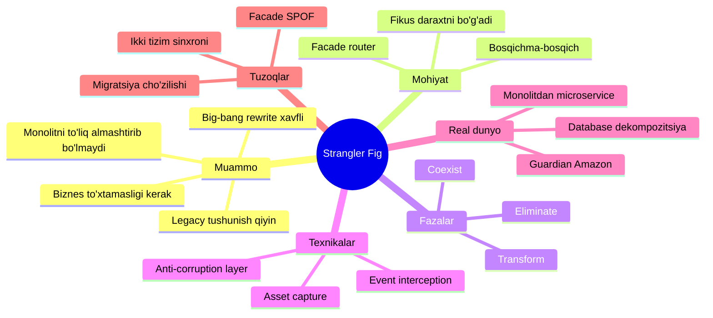
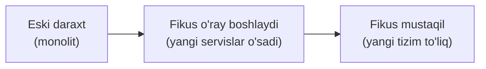
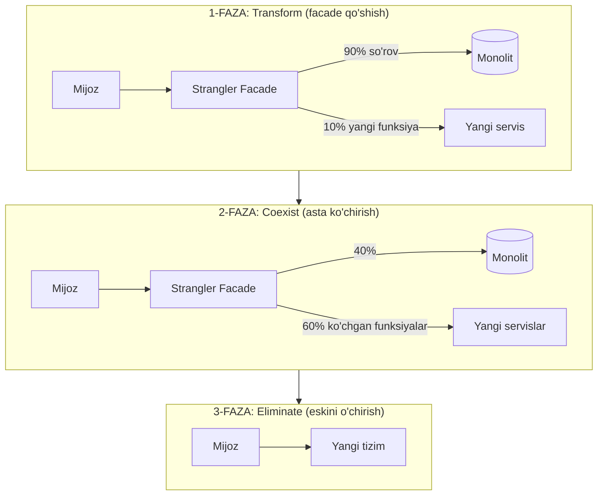
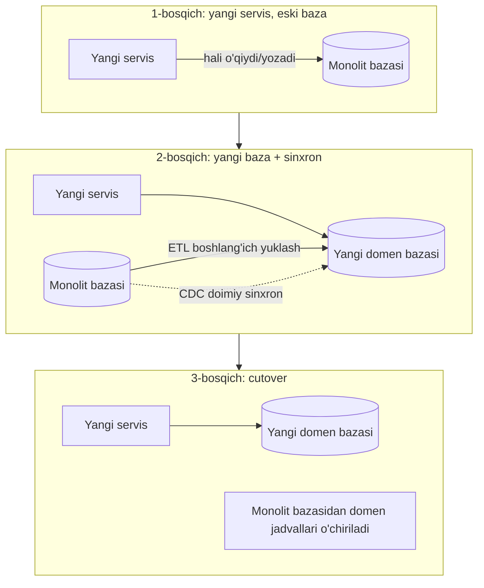
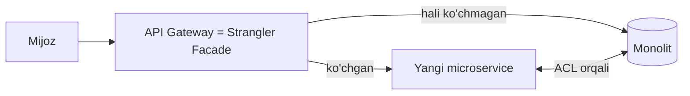

# 12. Strangler Fig

> **TL;DR:** Strangler Fig — eski monolit tizimni **bir zarbada emas, bosqichma-bosqich** yangi tizimga (odatda microservice'larga) ko'chirish patterni. Old qatlamdagi **facade/router** so'rovlarni ushlab, har bir yangi tayyor bo'lgan funksiyani asta-sekin yangi tizimga yo'naltiradi. Eski tizim "bo'g'ilib", oxir-oqibat butunlay o'chiriladi. Nomi — daraxtni asta o'rab, bo'g'ib o'ldiradigan **fikus (strangler fig)** o'simligidan olingan (Martin Fowler, 2004).

---

## Mavzu xaritasi



---

## Muammo — qaysi og'riqni hal qiladi

Tasavvur qil: kompaniyada 8 yil davomida o'sgan katta **monolit** ilova bor. U ishlaydi, lekin:

- Texnologiyasi eskirgan (masalan eski framework, endi qo'llab-quvvatlanmaydi).
- Har yangi funksiya qo'shish tobora qiyinlashgan — kod chalkash, bog'liqliklar ko'p.
- Bitta o'zgarish butun tizimni sindirishi mumkin — deploy qo'rqinchli.

Rahbariyat "yangidan yozamiz" (rewrite) deydi. Bu — **Big Bang rewrite** vasvasasi. Martin Fowler buni nega xavfli deb ataydi:

| Big Bang rewrite xavfi | Nima uchun |
| --- | --- |
| Juda uzoq davom etadi | Foydalanuvchilar yillab yangi qiymat ko'rmaydi |
| Eski tizimni to'liq tushunish qiyin | "Bu kod nega bunday?" — hech kim bilmaydi |
| Ko'p eski xatti-harakatni takrorlash shart emas | Keraksiz funksiyaga vaqt ketadi |
| Butun risk bir nuqtada to'planadi | "Katta o'tish kuni" — hammasi bir vaqtda sinishi mumkin |

> Muammoning mohiyati: katta tizimni **bir vaqtda** almashtirish — kamdan-kam muvaffaqiyat qiladi. Bizga tizimni **ishlab turgan holda**, xatarni kichik bo'laklarga bo'lib ko'chiradigan yondashuv kerak.

Strangler Fig — aynan shu yechim: risk kichik qadamlarga bo'linadi, biznes bir kun ham to'xtamaydi.

---

## Mohiyati — fikus (strangler fig) analogiyasi

Martin Fowler 2001-yilda Avstraliya (Kvinslend) tropik o'rmonida **strangler fig** (bo'g'uvchi fikus) o'simligini ko'rgan va bu metaforani topgan.

Fikus qanday o'sadi:

1. Uning urug'i baland daraxtning shoxida unib chiqadi.
2. Ildizlari asta-sekin pastga, daraxt tanasini o'rab tushadi.
3. Yillar davomida fikus daraxtdan oziqlanadi, uni o'rab, "bo'g'a" boshlaydi.
4. Oxir-oqibat asl daraxt o'ladi, fikus esa o'z-o'zini tutib turadigan mustaqil daraxtga aylanadi.



Xuddi shunday, yangi tizim eski monolit "atrofida" o'sadi, funksiyalarni birma-bir o'ziga oladi, va oxirida eski tizim "o'ladi" (o'chiriladi).

**Analogiya chegarasi (misconception oldini olish):** Tabiatda fikus daraxtni **o'ldirish uchun** o'sadi. Bizning maqsad esa vayron qilish emas — **muammosiz o'tish**. Yana: fikus tabiiy, boshqarilmaydigan jarayon; Strangler Fig migratsiyasi esa **rejalashtiriladi va boshqariladi** (qaysi funksiya birinchi ko'chadi — biznes qiymati bo'yicha tanlanadi).

---

## Sodda ta'rif

> **Strangler Fig** — eski tizimni bosqichma-bosqich yangisiga ko'chirish patterni: old qatlamdagi facade (proxy/router) so'rovlarni ushlab, har bir yangi tayyor funksiyani eski tizimdan yangisiga yo'naltiradi; barcha funksiyalar ko'chgach, eski tizim va facade o'chiriladi.

Kalit komponent — **facade** (fasad): mijoz va ikkala tizim orasidagi vositachi. Mijoz migratsiya borayotganini **umuman sezmaydi** — u doim bir xil interfeys bilan ishlaydi.

---

## Qanday ishlaydi — 3 fazali migratsiya

Butun jarayonni uch fazaga bo'lish mumkin: **Transform → Coexist → Eliminate**.



| Faza | Nima bo'ladi | Facade holati |
| --- | --- | --- |
| **1. Transform** | Facade qo'yiladi. Boshida deyarli hamma so'rov monolitga ketadi. Bitta-ikkita funksiya yangi servisga | Ko'p → monolit |
| **2. Coexist** | Funksiyalar birma-bir yangi tizimga ko'chadi. Ikki tizim **yonma-yon** ishlaydi, facade trafikni asta yangisiga suradi | Trafik yangisiga ko'chadi |
| **3. Eliminate** | Barcha funksiya ko'chgach, monolit o'chiriladi. Keyin facade ham olib tashlanadi, mijoz to'g'ridan-to'g'ri yangi tizimga ulanadi | Facade o'chiriladi |

### Ikkita muhim texnika

**1. Event interception (hodisani ushlash).**
Facade yoki router kiruvchi so'rovlarni (yoki hodisalarni) ushlab, ularni eski yoki yangi tizimga yo'naltiradi. Bu — Strangler Fig'ning yuragidir: **so'rovni ushlash imkoni bo'lishi shart**. Agar so'rovni ushlab bo'lmasa (masalan mijoz to'g'ridan-to'g'ri, chetlab o'tib ulanaversa), pattern ishlamaydi.

**2. Asset capture (aktivni egallash).**
Funksiya bilan bir qatorda uning **ma'lumotlari** ham yangi tizimga ko'chiriladi. Ko'pincha bu eng qiyin qism: monolitning umumiy bazasidan domenga tegishli jadvallarni ajratib olish (ETL bilan dastlabki yuklash + CDC bilan sinxronlash). Ikki tizim ma'lumotni bir vaqtda ko'ra olishi kerak.

---

## Amaliy misol

### 1-misol: Go'da oddiy Strangler Facade (reverse proxy router)

Facade'ning mohiyati — **yo'l (route) bo'yicha marshrutlash**: ko'chgan yo'llar yangi servisga, qolgani monolitga.

```go
// --- 1-qadam: eski va yangi tizim manzillari ---
func newStranglerFacade() http.Handler {
    legacy, _ := url.Parse("http://monolith.internal:8080")
    newSvc, _ := url.Parse("http://users-service.internal:9090")

    legacyProxy := httputil.NewSingleHostReverseProxy(legacy)
    newProxy := httputil.NewSingleHostReverseProxy(newSvc)

    mux := http.NewServeMux()

    // --- 2-qadam: KO'CHGAN funksiya -> yangi servisga ---
    mux.Handle("/api/users/", newProxy)

    // --- 3-qadam: qolgan HAMMA narsa -> hali monolitda ---
    mux.Handle("/", legacyProxy)

    return mux
}
```

**Nima bo'ldi?** `/api/users/` bilan boshlanadigan so'rovlar yangi `users-service`ga ketadi. Boshqa barcha so'rovlar hali monolitga. Mijoz bu bo'linishni **sezmaydi** — u doim facade'ga (bitta manzilga) murojaat qiladi.

Ertaga `/api/orders/` ko'chsa, shunchaki bitta yangi qator qo'shiladi:

```go
    // Yangi ko'chgan funksiya -> facade'ga bir qator qo'shildi
    mux.Handle("/api/orders/", ordersProxy)
```

Monolit koidiga tegilmaydi, mijoz kodiga tegilmaydi — faqat facade konfiguratsiyasi o'zgaradi. Bu — pattern'ning kuchi.

> 🤔 **O'ylab ko'r:** Yangi `users-service` foydalanuvchi ma'lumotini o'zgartiradi, lekin monolitdagi "buyurtma" funksiyasi hali o'sha foydalanuvchi ma'lumotini o'qiydi. Ikki tizim bir ma'lumotni ko'rishi kerak. Buni qanday hal qilasan?

<details>
<summary>💡 Javobni ko'rish</summary>

Bu — **asset capture** va **cross-system dependency** muammosi. Bir necha yechim:

1. **Umumiy baza (vaqtinchalik):** ikkala tizim boshida bir bazaga yozadi (2-faza).
2. **CDC sinxronizatsiya:** monolit bazasidan yangi domen bazasiga o'zgarishlar real vaqtda ko'chiriladi (Change Data Capture).
3. **Anti-corruption Layer (ACL):** yangi tizim eski tizimga (yoki teskari) murojaat qilganda, orada tarjimon qatlam turadi — u eski tizimning "iflos" modelini yangi tizimga o'tkazmaydi.

Muhimi: migratsiya davomida **ikki tizim birga yashaydi (coexist)** va bir-birini chaqira olishi kerak.
</details>

### 2-misol: Ma'lumotlar bazasini dekompozitsiya qilish (asset capture)

Ko'pincha eng qiyin qism — monolitning umumiy bazasi. Azure hujjatlaridagi bosqichlar:



- **1-bosqich:** yangi servis paydo bo'ladi, lekin hali monolit bazasiga yozadi.
- **2-bosqich:** yangi domen bazasi yaratiladi. ETL bilan tarixiy ma'lumot ko'chiriladi, CDC bilan doimiy sinxronlanadi. Ikki baza tekshiriladi (consistency validation).
- **3-bosqich (cutover):** yangi baza "haqiqat manbai" (system of record) bo'ladi. Monolit bazasidan domen jadvallari o'chiriladi.

> Muhim: **2-fazada va 3-faza boshida rollback mumkin** (domen jadvallari va sinxron hali monolitda). Domen jadvallari o'chirilgach, rollback juda qimmat va xatarli. Shuning uchun eski jadvallarni o'chirish — har domen uchun **ataylab qilingan oxirgi qadam**.

---

## Real dunyoda

### Klassik migration case'lar

| Kompaniya / holat | Qanday qo'lladi |
| --- | --- |
| **The Guardian** | Eski Content API monolitini Strangler Fig bilan bosqichma-bosqich yangi platformaga ko'chirdi (Fowler ko'p keltiradigan misol) |
| **Amazon / e-commerce** | Bitta katta monolitni domenlar bo'yicha (buyurtma, to'lov, katalog) microservice'larga uzoq yillar davomida ko'chirdi |
| **Legacy DB dekompozitsiyasi** | Umumiy monolit baza domenga xos bazalarga ETL + CDC bilan ajratildi (Azure misoli) |

### API Gateway bilan aloqasi

Strangler Facade ko'pincha **API Gateway** ustida quriladi. Gateway allaqachon barcha kiruvchi trafikni ushlaydi (single entry point) — bu esa Strangler Fig uchun ideal marshrutlash nuqtasi. Ya'ni gateway'ning routing qoidalarini o'zgartirib, funksiyalarni asta yangi servisga surish mumkin.

> To'liq: [API Gateway va BFF](../3.%20Distributed%20Patterns/7.%20API%20Gateway%20-%20BFF.md) — gateway routing, aggregation va TLS termination'ni bir joyda hal qiladi; Strangler Facade shu imkoniyatlar ustida ishlaydi.

### Anti-corruption Layer (ACL) bilan birga

Migratsiya davomida yangi tizim eski tizimni chaqirishi kerak bo'ladi (yoki teskari). Agar to'g'ridan-to'g'ri chaqirsa, eski tizimning "iflos" modeli yangi toza dizaynga sizib kiradi. **Anti-corruption Layer** — orada turgan tarjimon qatlam, yangi tizim modelini eski semantikadan himoya qiladi. Bu Strangler Fig bilan deyarli doim juftlikda ishlatiladi.

---

## Tuzoqlar va anti-patternlar

⚠️ **1. Facade — single point of failure (SPOF) ga aylanishi.**
Barcha trafik facade orqali o'tadi. Agar u yiqilsa — butun tizim yiqiladi. To'g'risi: facade'ni yuqori-mavjud (HA), gorizontal scale bo'ladigan qilib qur, monitoring o'rnat.

⚠️ **2. Migratsiya cho'zilib, "abadiy coexist" holatiga tushish.**
Noto'g'ri tasavvur: "Ikki tizim yonma-yon ishlaydi — shoshilmasa ham bo'ladi." Nega yomon: ikki tizimni bir vaqtda saqlash **qo'sh xarajat** (infra, jamoa, sinxron). To'g'risi: har domenni ko'chirishga aniq muddat qo'y, migratsiya rejasi va oxiri bo'lsin.

⚠️ **3. Ma'lumot sinxronizatsiyasini yetarli sinamaslik.**
Ikki baza (eski + yangi) o'rtasida CDC/ETL sinxronida ma'lumot chalkashligi (data drift) yuzaga kelishi mumkin. Cutover'dan oldin **consistency validation** shart, aks holda ma'lumot yo'qoladi.

⚠️ **4. So'rovni ushlab bo'lmaydigan tizimda qo'llash.**
Agar mijoz eski tizimga to'g'ridan-to'g'ri, facade'ni chetlab ulanaversa — event interception ishlamaydi va pattern qulaydi. Barcha kirish nuqtalari facade orqali o'tishi kafolatlanishi kerak.

⚠️ **5. Eski tizim kodini o'zgartira olmaslik.**
Ko'chgan funksiyani eski tizimda o'chirish (yoki ichki chaqiruvlarni yo'naltirish) uchun uning kodini o'zgartirish kerak bo'ladi. Agar manba kod yo'q bo'lsa (yopiq vendor tizimi) — Strangler Fig qiyinlashadi.

### Qachon Strangler Fig KERAK EMAS

| Holat | Nega |
| --- | --- |
| Tizim **kichik** | To'liq qayta yozish arzon va tez — facade murakkabligi ortiqcha |
| So'rovni **ushlab bo'lmaydi** | Event interception imkonsiz — pattern ishlamaydi |
| Eski tizim **manba kodi yo'q** | Ko'chgan funksiyani eskisida o'chirib bo'lmaydi |
| Tizimni **tez o'chirish** kerak | Strangler asta-sekin — shoshilinch to'liq almashtirishga mos emas |

> **Oltin qoida:** Katta, murakkab, ishlab turishi shart bo'lgan tizimni bir zarba bilan almashtirma — uni fikusdek asta-sekin o'rab, funksiyama-funksiya ko'chir va oxirida o'chir.

---

## Bog'liq patternlar

| Pattern | Aloqasi | Link |
| --- | --- | --- |
| **API Gateway / BFF** | Gateway barcha kiruvchi trafikni ushlaydi — Strangler Facade uchun ideal marshrutlash nuqtasi | [7. API Gateway - BFF](../3.%20Distributed%20Patterns/7.%20API%20Gateway%20-%20BFF.md) |
| **Sidecar** | Ba'zan ambassador/sidecar orqali legacy servisga tarmoq imkoniyati qo'shilib, migratsiya osonlashtiriladi | [10. Sidecar](10.%20Sidecar.md) |
| **Ambassador** | Legacy ilova chiquvchi trafigini yangi tizimga yo'naltirishda ishlaydi | [11. Ambassador](11.%20Ambassador.md) |
| **Anti-corruption Layer** | Migratsiya davomida yangi tizimni eski model semantikasidan himoya qiladi (deyarli doim juftlikda) | (bu repoda alohida yo'q) |
| **Saga** | Ko'chgan servislar orasidagi taqsimlangan tranzaksiyalarni boshqarish | [1. Saga](../3.%20Distributed%20Patterns/1.%20Saga.md) |



---

## Interview savollari

**1. Nega Big Bang rewrite Strangler Fig'dan xavfliroq?**

<details>
<summary>Javob</summary>

Big Bang rewrite butun tizimni bir vaqtda almashtiradi: (1) uzoq davom etadi va bu davrda foydalanuvchi yangi qiymat ko'rmaydi; (2) eski tizim xatti-harakatini to'liq tushunish qiyin; (3) risk bitta "katta o'tish kuni"ga to'planadi — hammasi birdan sinishi mumkin. Strangler Fig riskni kichik, mustaqil qadamlarga bo'ladi, biznes to'xtamaydi va har qadamda tekshirish/rollback imkoni bor.
</details>

**2. Strangler Fig'ning uch fazasini ayt va har birida facade nima qiladi.**

<details>
<summary>Javob</summary>

**Transform** — facade qo'yiladi, deyarli hamma so'rov monolitga, bitta-ikkitasi yangi servisga. **Coexist** — funksiyalar birma-bir ko'chadi, ikki tizim yonma-yon ishlaydi, facade trafikni asta yangisiga suradi. **Eliminate** — hamma funksiya ko'chgach monolit o'chiriladi, so'ng facade ham olib tashlanadi va mijoz to'g'ridan-to'g'ri yangi tizimga ulanadi.
</details>

**3. "Event interception" va "asset capture" nima? Nega ular muhim?**

<details>
<summary>Javob</summary>

**Event interception** — facade/router kiruvchi so'rovlarni ushlab, eski yoki yangi tizimga yo'naltirishi. So'rovni ushlab bo'lmasa (mijoz chetlab o'tsa) pattern ishlamaydi — shuning uchun bu asos. **Asset capture** — funksiya bilan birga uning ma'lumotini ham yangi tizimga ko'chirish (ETL + CDC). Bu odatda eng qiyin qism, chunki ikki tizim migratsiya davomida bir ma'lumotni ko'ra olishi kerak.
</details>

**4. Facade single point of failure bo'lib qolmasligi uchun nima qilasan?**

<details>
<summary>Javob</summary>

Facade'ni **yuqori-mavjud (HA)** va gorizontal scale bo'ladigan qilib qurish (bir nechta nusxa, load balancer orqali), sog'liq tekshiruvi (health check) va monitoring o'rnatish, hamda uni yengil (faqat marshrutlash) tutish — og'ir biznes-mantiqni facade'ga tiqmaslik. Ko'pincha bu rolni allaqachon HA bo'lgan API Gateway bajaradi.
</details>

**5. Qaysi hollarda Strangler Fig noto'g'ri tanlov?**

<details>
<summary>Javob</summary>

(1) Tizim **kichik** va to'liq qayta yozish arzon — facade murakkabligi keraksiz. (2) So'rovni **ushlab bo'lmaydi** — event interception imkonsiz. (3) Eski tizim **manba kodi yo'q** — ko'chgan funksiyani eskisida o'chirib bo'lmaydi. (4) Tizimni **tez butunlay o'chirish** kerak — Strangler asta-sekinligi buni imkonsiz qiladi.
</details>

---

## Eslab qol

- **Strangler Fig = fikus daraxtni bo'g'adi** — yangi tizim eski monolit atrofida o'sib, funksiyalarni birma-bir o'ziga oladi, oxirida eskisi o'chiriladi.
- **Facade/router — pattern yuragi:** so'rovlarni ushlab, ko'chganini yangi tizimga, qolganini monolitga yo'naltiradi. Mijoz migratsiyani sezmaydi.
- **3 faza:** Transform (facade qo'y) → Coexist (asta ko'chir) → Eliminate (eskini o'chir).
- **Big Bang rewrite xavfli:** risk bir nuqtada to'planadi. Strangler riskni kichik qadamlarga bo'ladi.
- **Asset capture (ma'lumot ko'chirish)** — ko'pincha eng qiyin qism: ETL boshlang'ich yuklash + CDC sinxron + consistency validation, keyin cutover.
- **Kichik tizim, so'rovni ushlab bo'lmaslik yoki manba kod yo'qligida** — Strangler Fig noto'g'ri tanlov.

---

## 🔁 Takrorlash

- **Bog'liq oldingi mavzular:** [7. API Gateway - BFF](../3.%20Distributed%20Patterns/7.%20API%20Gateway%20-%20BFF.md) (facade/routing asosi), [10. Sidecar](10.%20Sidecar.md), [11. Ambassador](11.%20Ambassador.md), [1. Saga](../3.%20Distributed%20Patterns/1.%20Saga.md) (ko'chgan servislar orasidagi tranzaksiya).
- **Takrorlash jadvali:** ertaga → 3 kundan keyin → 1 haftadan keyin "Interview savollari"ga qaytib javoblarni yodingdan ayt.
- **Feynman testi:** Do'stingga fikus (strangler fig) analogiyasi bilan monolitdan microservice'ga o'tishni 3 jumlada, kod so'zlarisiz tushuntir. So'ng "nega Big Bang emas?" savoliga javob ber.
