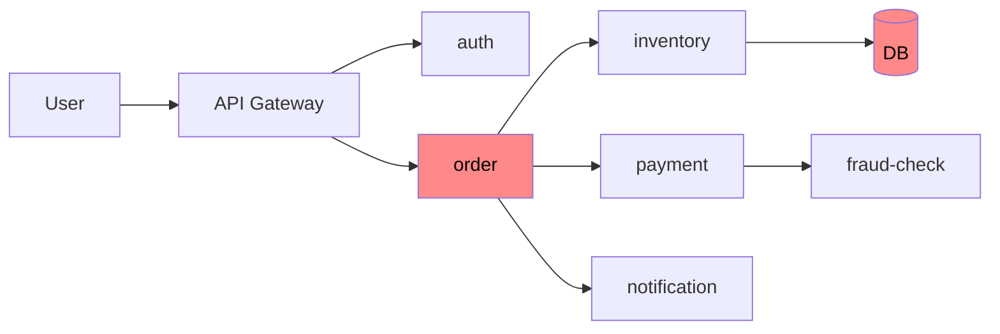
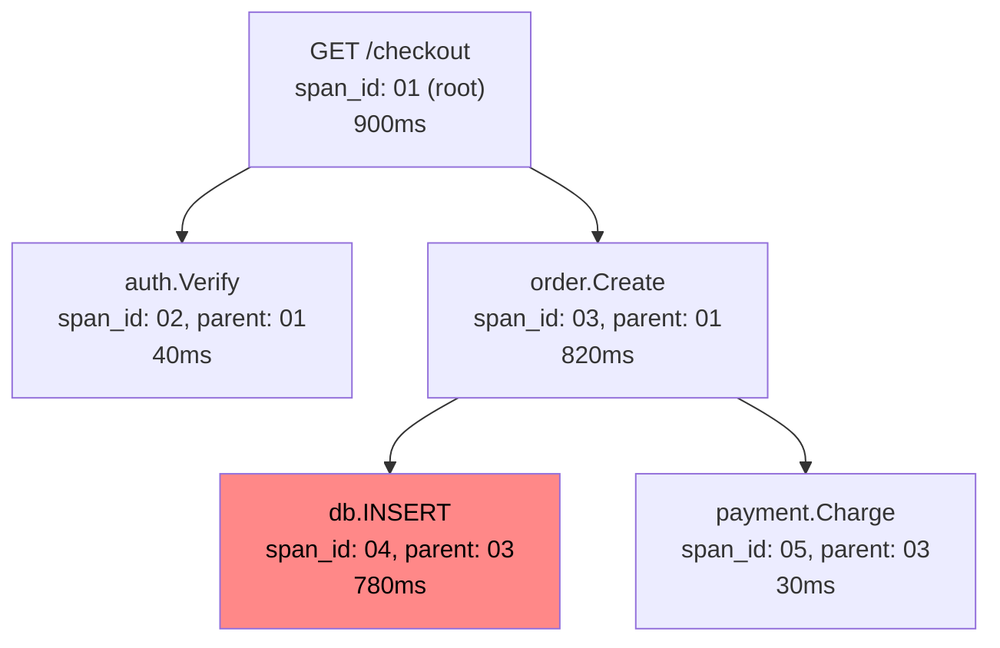
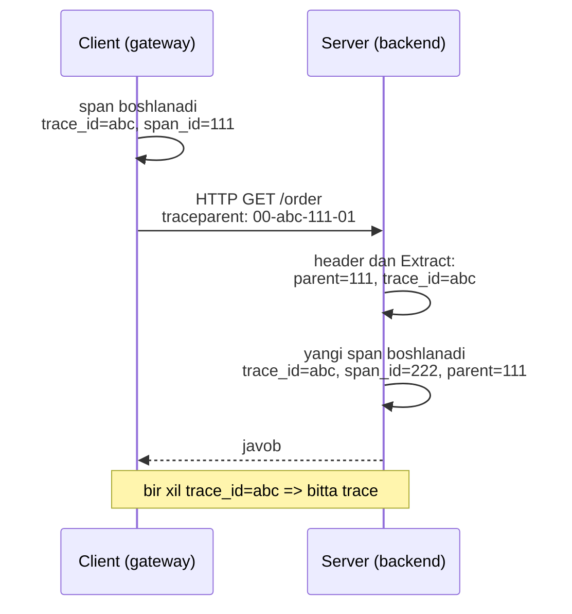

# 13. Distributed Tracing

> **TL;DR:** Distributed tracing — bitta so'rovni u o'nlab microservice'dan o'tayotganda uzluksiz kuzatib boradigan usul. Har bir qadam **span**, butun yo'l esa **trace** deb ataladi va ular bitta **trace_id** bilan bog'lanadi. Bu material propagation mexanikasi (W3C Trace Context), sampling strategiyalari va amaliy debugging'ga chuqur kiradi; umumiy OpenTelemetry sozlash uchun [Observability](<../1. Cloud Native App/6. Observability.md>) faylini ko'r.

---

## Muammo — "qayerda sekin?" savoli

Tasavvur qil: foydalanuvchi "checkout" tugmasini bosdi, lekin sahifa 3 sekund ochilmadi. Bu bitta so'rov API Gateway'dan kirib, ketma-ket **10 ta service**dan o'tadi:



Har bir service **o'z log'ini** yozadi. Lekin bu log'lar bir-biriga bog'lanmagan:

```
[auth]      12:00:01.100  GET /verify  ok  8ms
[order]     12:00:01.140  create order 12345
[inventory] 12:00:01.900  reserve items ... 780ms
[payment]   12:00:02.050  charge  ok  30ms
```

Endi savol: **qaysi so'rov qaysi log'ga tegishli?** Sekundiga minglab so'rov kelayotgan bo'lsa, bu to'rt qatordagi log'lar bir xil foydalanuvchining bitta bosishimi yoki turli so'rovlarmi — bilib bo'lmaydi. Latency qayerda "yo'qolganini" ham topa olmaysan: `inventory` 780ms turibdi, lekin u chindan aybdormi yoki shunchaki boshqa so'rovni bajarayotganmidi?

An'anaviy monitoring "order-service p99 latency 2s" deb aytadi, lekin **nega** va **qaysi bosqichda** deyishga ojiz. Bu — [Observability](<../1. Cloud Native App/6. Observability.md>) muammosining tracing hal qiladigan qismi.

> **Muammoning mohiyati:** log service chegarasidan o'tganda **iz yo'qoladi**. Bizga so'rovni bitta uzluksiz ip bilan boshdan oxirigacha bog'laydigan mexanizm kerak.

---

## Mohiyati — posilka tracking analogiyasi

Tracing'ni tushunish uchun **posilka yetkazib berishni** tasavvur qil. Sen internetdan mahsulot buyurtma qilding va tracking raqami olding. Endi har bir bosqichni ko'ra olasan:

- "Omborga qabul qilindi" — 10:00
- "Saralash markaziga yuborildi" — 12:30
- "Kuryerga berildi" — 14:00
- "Yetkazildi" — 16:45

Har bir **skanerlash nuqtasi** — bu bitta **span** (operatsiya, ish birligi). Ular boshlanish vaqti va davomiyligi bilan yoziladi. Butun yo'l — omborga qabuldan yetkazishgacha — bu **trace** (trek). Barcha skanerlashlar bitta **tracking raqami** (= `trace_id`) bilan bog'langani uchun sen posilkaning **qayerda tiqilib qolganini** darhol ko'rasan: "saralash markazida 4 soat turibdi".

> **Distributed tracing** — so'rovning distributed tizim bo'ylab tarqalishini (hatto process va tarmoq chegaralaridan ham o'tib) kuzatib, butun oqimni **DAG** (Directed Acyclic Graph — yo'naltirilgan asiklik graf) ga aylantiruvchi usul.

**Analogiya chegarasi:** posilkada odatda bitta chiziqli yo'l bor. Trace esa **shoxlanadi** — bitta so'rov bir vaqtda bir necha service'ni parallel chaqirishi mumkin (posilka bir vaqtda ikkita mashinada ketmaydi, lekin so'rov ikkita service'ni chaqira oladi). Shuning uchun trace daraxt (tree), oddiy ro'yxat emas.

### Asosiy tushunchalar

| Tushuncha | Nima | Posilka analogiyasi |
|---|---|---|
| **Trace** | Butun so'rovning to'liq yo'li (span'lar to'plami) | Butun yetkazib berish tarixi |
| **Span** | Bitta ish birligi (nom + boshlanish + davomiylik) | Bitta skanerlash nuqtasi |
| **trace_id** | Butun trace uchun global noyob ID (16 bayt) | Tracking raqami |
| **span_id** | Bitta span uchun ID (8 bayt) | Skanerlash yozuvi raqami |
| **parent_span_id** | Bu span'ni kim chaqirgani | "Oldingi bosqich" |
| **Attribute** | Span'ga qo'shilgan kalit/qiymat (`http.method=GET`) | Posilka og'irligi, o'lchami |
| **Event** | Span ichida ma'lum vaqtdagi belgi | "Kuryer eshikni taqilladi" |
| **Status** | Span natijasi: `Ok` yoki `Error` | "Yetkazildi" / "Qaytarildi" |

> Span'lar ichma-ich joylashadi va **parent-child** (ota-bola) munosabatini hosil qiladi — bu sabab-oqibat zanjirini modellashtiradi. Bitta span'ning davomiyligi ichida uning bolalari bajariladi.

Bu tushunchalar [Observability](<../1. Cloud Native App/6. Observability.md>) faylida qisqacha berilgan; bu yerda biz ularning **mexanikasiga** kiramiz.

---

## Qanday ishlaydi

### Span anatomiyasi

Bitta span aslida quyidagilardan iborat kichik yozuv:

```json
{
  "trace_id":       "4bf92f3577b34da6a3ce929d0e0e4736",
  "span_id":        "00f067aa0ba902b7",
  "parent_span_id": "0000000000000000",
  "name":           "GET /checkout",
  "start_time":     "2026-07-08T12:00:01.100Z",
  "end_time":       "2026-07-08T12:00:02.000Z",
  "attributes":     { "http.method": "GET", "http.status_code": 200 },
  "events":         [ { "time": "...12:00:01.5", "name": "cache miss" } ],
  "status":         "Ok"
}
```

`parent_span_id` `0000000000000000` bo'lsa — bu **root span** (ildiz), ya'ni trace'ning boshi. Qolgan har bir span o'z ota-onasiga ishora qiladi. Backend shu ishoralar bo'yicha daraxtni qayta tiklaydi:



Endi javob ko'rinib turibdi: `order.Create` 820ms turdi, chunki uning ichidagi `db.INSTALL`... yo'q, `db.INSERT` 780ms yedi. **Aybdor — database so'rovi.** Log devorini o'qimasdan, bir qarashda topdik.

### Context propagation — sirli ip

Eng qiyin savol: `span_id: 04` qanday qilib `trace_id: 4bf9...` va `parent: 03` ekanini **bildi**? Axir u boshqa funksiyada, ehtimol boshqa serverda. Javob — **context propagation** (kontekstni tarqatish).

Ikki xil propagation bor:

1. **In-process** (bitta process ichida) — Go'da `context.Context` orqali. Joriy span kontekst ichida "yashiringan" holda funksiyadan funksiyaga o'tadi.
2. **Cross-process** (service'lararo) — HTTP/gRPC **header** orqali. trace_id va span_id maxsus header'ga "qadoqlanib" tarmoq bo'ylab yuboriladi.



> **Notional machine (kompyuterda aslida nima bo'ladi):** `tracer.Start(ctx, "name")` chaqirilganda ikkita narsa qaytadi — yangi `Span` VA yangi `context.Context`. Yangi context eskisining nusxasi, lekin ichiga joriy span "solingan". Client HTTP so'rov yuborganda propagator shu context'dan trace_id/span_id ni o'qib, `traceparent` header'iga **yozadi** (Inject). Server tomonda propagator header'ni **o'qib** (Extract), yangi context yaratadi — endi server'ning span'i client span'ini parent deb biladi. Ikkala service bir xil trace_id ni ko'radi.

### W3C Trace Context — `traceparent` header formati

Ilgari har bir vendor o'z header'ini ishlatardi (`X-B3-*` Zipkin, `uber-trace-id` Jaeger...). 2020-yilda **W3C Trace Context** standarti chiqdi va endi bu — sanoat standarti. OTel uni sukut bo'yicha ishlatadi.

`traceparent` header aynan shunday ko'rinadi:

```
traceparent: 00-4bf92f3577b34da6a3ce929d0e0e4736-00f067aa0ba902b7-01
             ▲              ▲                        ▲              ▲
          version        trace-id                span-id      trace-flags
```

| Maydon | Uzunlik | Misol | Ma'no |
|---|---|---|---|
| **version** | 1 bayt (2 hex) | `00` | Format versiyasi (`ff` yaroqsiz) |
| **trace-id** | 16 bayt (32 hex) | `4bf92f35...e4736` | Butun trace ID (barcha nol taqiqlangan) |
| **span-id** | 8 bayt (16 hex) | `00f067aa0ba902b7` | Jo'natuvchi span ID (parent bo'ladi) |
| **trace-flags** | 1 bayt (2 hex) | `01` | Bayroqlar; eng o'ng bit = **sampled** |

Eng muhim nozik nuqta — **trace-flags** ning oxirgi biti (sampled flag):

- `01` — bu trace **sampled** (yozib olingan), keyingi service ham uni yozsin.
- `00` — bu trace yozilmayapti, keyingi service ham vaqt sarflamasin.

Bu bir bit sampling qarorini butun zanjir bo'ylab **izchil** saqlaydi (buni pastda "Sampling" bo'limida ko'ramiz).

### `tracestate` va `baggage`

`traceparent` bilan birga ikkita qo'shimcha mexanizm yuradi:

- **`tracestate`** — vendor'ga xos qo'shimcha ma'lumot uchun (maks 32 juft kalit/qiymat): `tracestate: rojo=00f067aa0ba902b7,congo=t61rcWkgMzE`. Odatda bunga o'zing tegmaysan.
- **`baggage`** — bu **sening** biznes ma'lumoting, butun trace bo'ylab avtomatik ko'chib yuradigan kalit/qiymat. Masalan `user.tier=premium` ni gateway'da qo'ysang, u barcha downstream service'larga o'zi yetib boradi — har birida qo'lda uzatishing shart emas.

```go
// --- baggage: butun so'rov bo'ylab ko'chadigan biznes konteksti ---
member, _ := baggage.NewMember("user.tier", "premium")
bag, _ := baggage.New(member)
ctx = baggage.ContextWithBaggage(ctx, bag)
// endi bu ctx bilan yuborilgan har qanday HTTP so'rov "baggage" header'ini ham olib ketadi
```

> **Ogohlantirish:** baggage har bir so'rov header'ida tarmoq bo'ylab yuboriladi — u yerga katta yoki maxfiy ma'lumot solma. Faqat kichik, foydali kontekst (tier, tenant id, feature flag).

### Propagator API — Go'da sozlash

Propagation ishlashi uchun bir marta **global propagator** o'rnatiladi. Bu barcha `otelhttp`/`otelgrpc` avtomatik instrumentatsiyaga qaysi format bilan header yozish/o'qishni bildiradi:

```go
// --- main() da bir marta: W3C traceparent + baggage ---
otel.SetTextMapPropagator(
    propagation.NewCompositeTextMapPropagator(
        propagation.TraceContext{}, // traceparent / tracestate
        propagation.Baggage{},      // baggage
    ),
)
```

Odatda `otelhttp` bularni o'zi qiladi. Lekin instrumentatsiyasiz bir joyda qo'lda ham qilsa bo'ladi:

```go
// --- client tomon: context'dan header'ga yozish (Inject) ---
otel.GetTextMapPropagator().Inject(ctx,
    propagation.HeaderCarrier(req.Header))

// --- server tomon: header'dan context'ga o'qish (Extract) ---
ctx := otel.GetTextMapPropagator().Extract(r.Context(),
    propagation.HeaderCarrier(r.Header))
```

🤔 **O'ylab ko'r:** Client `traceparent` header yubordi, lekin server tomonda propagator **o'rnatilmagan** (`SetTextMapPropagator` chaqirilmagan yoki noto'g'ri format). Trace bilan nima bo'ladi?

<details>
<summary>Javobni ko'rish</summary>

Trace **ikkiga bo'linadi**. Server header'ni o'qiy olmagani uchun kelgan trace_id/parent'ni topmaydi, natijada o'z span'ini **yangi root** sifatida yaratadi (yangi trace_id bilan). Jaeger'da sen bitta uzluksiz daraxt o'rniga ikkita alohida trace ko'rasan va ular bir-biriga bog'lanmaydi. Shuning uchun **client va server ikkalasida ham** bir xil propagator o'rnatilishi shart — bu tez-tez uchraydigan "trace nega uzilgan?" xatosining asosiy sababi.
</details>

---

## Sampling — qancha va qanday tanlash

### Muammo: hamma so'rovni yozib bo'lmaydi

Har bir so'rovni to'liq yozish **qimmat**. Sekundiga 100 000 so'rov keladigan tizimda bu terabaytlab trace ma'lumoti, backend'ni ko'mib tashlaydigan tarmoq trafigi va ulkan schyot degani. Lekin bu trace'larning 99% i bir xil, sog'lom, zerikarli so'rovlar. Bizga kerakligi — **vakillik namunasi** + **barcha muammoli so'rovlar**.

**Sampling** — qaysi trace'larni saqlab, qaysilarini tashlashni hal qilish. Ikki katta yondashuv bor: **head-based** (boshda) va **tail-based** (oxirida).

### Head-based sampling — qaror boshda

Qaror **so'rov boshlanganda**, root span yaratilishida qabul qilinadi va sampled flag orqali butun zanjirga tarqaladi. Go SDK'dagi tayyor sampler'lar:

| Sampler | Xatti-harakati | Qachon |
|---|---|---|
| `AlwaysSample()` | Har trace'ni yozadi | Development, past trafik, debug |
| `NeverSample()` | Hech narsa yozmaydi | O'chirish uchun |
| `TraceIDRatioBased(0.1)` | trace_id asosida 10% ni yozadi | Production, barqaror ulush |
| `ParentBased(root)` | Parent'ning qaroriga bo'ysunadi | **Deyarli har doim (o'ram)** |

`NewTracerProvider` ning **sukut sampler'i** — `ParentBased(AlwaysSample())`.

**`TraceIDRatioBased` nega izchil?** Qaror trace_id ning o'zidan (hash) hisoblanadi, tasodifiy tanga tashlashdan emas. Shuning uchun bir xil trace_id ni ko'rgan **barcha service** bir xil qarorga keladi — trace butun yoki umuman yozilmaydi, "yarim" bo'lib qolmaydi.

**`ParentBased` nega muhim?** U root bo'lmagan span'larda **parent'ning sampled flag'iga bo'ysunadi**. Ya'ni gateway "bu trace sampled" desa (`traceparent ... -01`), barcha downstream service ham yozadi; "sampled emas" (`-00`) desa — hech kim yozmaydi. Bu — trace'ning **butunligini** kafolatlaydi.

```go
// --- production sampler: root'da 10%, keyin parent qaroriga bo'ysun ---
tp := trace.NewTracerProvider(
    trace.WithSampler(
        trace.ParentBased(trace.TraceIDRatioBased(0.1)),
    ),
    trace.WithBatcher(exp),
    trace.WithResource(res),
)
```

> **Notional machine:** sampler qarori root span `Start` bo'lganda bir marta ishlaydi. Agar "yozilmasin" chiqsa, SDK **non-recording span** yaratadi — bu deyarli bepul no-op obyekt: attribute qo'shsang ham hech narsa saqlanmaydi, exporter'ga uzatilmaydi. Shuning uchun sampling faqat backend narxini emas, ilovaning CPU/xotira yukini ham kamaytiradi.

### Tail-based sampling — qaror oxirida

Head sampling'ning kamchiligi: qaror **boshda**, trace hali tugamasdan qabul qilinadi. Ya'ni 10% ratio bilan, aynan **xato bo'lgan** yoki **eng sekin** so'rov o'sha tashlab yuboriladigan 90% ga tushib qolishi mumkin — eng kerakli trace yo'qoladi.

**Tail-based sampling** buni hal qiladi: qaror **trace to'liq tugagach** qabul qilinadi. Bu odatda **OpenTelemetry Collector** ichidagi `tail_sampling` processor'da bo'ladi:

- Barcha xato (`status=Error`) trace'larni **100%** saqla.
- 1 sekunddan sekin trace'larni **100%** saqla.
- Qolgan normal trace'larni **1%** saqla.

Narxi: collector bitta trace'ning **barcha span'larini** xotirada yig'ib turishi kerak (u tugaguncha), bu esa stateful va resurs talab qiladi. Bundan tashqari bitta trace'ning hamma span'lari **bitta collector** instansiyasiga tushishi shart (trace_id bo'yicha load balancing).

### Head vs Tail — taqqoslash

| | Head-based | Tail-based |
|---|---|---|
| Qaror qachon | So'rov boshida | Trace tugagach |
| Qayerda | SDK (ilova ichida) | Collector |
| Trace mazmunini ko'radimi | Yo'q (hali tugamagan) | Ha (to'liq) |
| Xato/sekin trace'ni kafolatlaydimi | Yo'q | Ha |
| Resurs | Arzon, oddiy | Qimmat, stateful |
| Ilova yukini kamaytiradimi | Ha (non-recording) | Yo'q (avval hammasi yig'iladi) |

> **Amaliy qoida:** kichik/o'rta tizimda `ParentBased(TraceIDRatioBased(...))` head sampling yetarli. Katta, muhim tizimda **kombinatsiya**: ilovada yengil head sampling bilan hajmni kamaytir, keyin collector'da tail sampling bilan barcha xatoli/sekin trace'larni "aqlli" saqla. Balans — **xarajat** (kam saqla) va **to'liqlik** (muhimni yo'qotma) orasida.

---

## Go implementatsiyasi

Endi 2 service'li real mini-stsenariy quramiz: **gateway** service HTTP orqali **backend** service'ni chaqiradi. Maqsad — bitta so'rov ikkala service'da ham **bir xil trace_id** bilan ko'rinsin.

Umumiy provider/exporter sozlash (`TracerProvider`, resource, OTLP) [Observability faylida](<../1. Cloud Native App/6. Observability.md>) to'liq berilgan — bu yerda takrorlamaymiz, faqat tracing'ga xos qismlarni yozamiz.

### Server (backend) — avtomatik instrumentatsiya + manual child span

```go
// --- handler'ni otelhttp bilan o'raymiz: har so'rovga avtomatik server span ---
func main() {
    handler := http.HandlerFunc(orderHandler)
    http.Handle("/order", otelhttp.NewHandler(handler, "POST /order"))
    log.Fatal(http.ListenAndServe(":8081", nil))
}

func orderHandler(w http.ResponseWriter, r *http.Request) {
    // --- 1-qadam: so'rov context'i (unda client'dan kelgan parent bor) ---
    ctx := r.Context()
    tr := otel.Tracer("backend")

    // --- 2-qadam: qo'lda child span (DB ishi uchun alohida o'lchov) ---
    ctx, span := tr.Start(ctx, "db.INSERT order")
    defer span.End()
    span.SetAttributes(attribute.String("db.system", "postgres"))

    if err := insertOrder(ctx); err != nil {
        // --- 3-qadam: xatoni span'ga yozamiz (Jaeger'da qizil ko'rinadi) ---
        span.RecordError(err)
        span.SetStatus(codes.Error, "insert failed")
        http.Error(w, "db error", 500)
        return
    }
    fmt.Fprintln(w, "order created")
}
```

Muhim uch nuqta:
- `otelhttp.NewHandler` **server span**'ini avtomatik yaratadi va client'dan kelgan `traceparent` header'ni **o'zi Extract qiladi** (agar propagator o'rnatilgan bo'lsa).
- `tr.Start` bilan yasalgan span avtomatik server span'ining **bolasi** bo'ladi, chunki biz `r.Context()` ni uzatdik.
- Xato bo'lganda `RecordError` + `SetStatus(codes.Error, ...)` — **ikkalasi ham** kerak. `RecordError` xatoni event sifatida yozadi, `SetStatus` esa span'ni "buzuq" deb belgilaydi (UI'da qizil).

### Client (gateway) — client tomonini instrument qilish

To'liq trace uchun **client tomon ham** instrument qilinishi shart, aks holda `traceparent` header umuman yuborilmaydi:

```go
// --- otelhttp.NewTransport: har chiquvchi so'rovga traceparent header qo'shadi ---
client := http.Client{
    Transport: otelhttp.NewTransport(http.DefaultTransport),
}

func callBackend(ctx context.Context) error {
    // --- ctx'ni so'rovga bog'laymiz: shu orqali trace context header'ga tushadi ---
    req, _ := http.NewRequestWithContext(ctx, "POST",
        "http://localhost:8081/order", nil)
    resp, err := client.Do(req) // Transport avtomatik Inject qiladi
    if err != nil {
        return err
    }
    defer resp.Body.Close()
    return nil
}
```

Eng muhim detal — `http.NewRequestWithContext(ctx, ...)`. Aynan shu `ctx` orqali `otelhttp.NewTransport` joriy trace context'ni topib, `traceparent` header'iga yozadi. Oddiy `http.NewRequest` (context'siz) ishlatilsa — header bo'sh ketadi va trace uziladi.

### Natija — bir xil trace_id

Ikkala service'ni ishga tushirib bitta so'rov yuborsang, konsol/Jaeger'da ikkala span ham **bir xil TraceID** ga ega bo'ladi, faqat `SpanID`/`ParentSpanID` farq qiladi:

```json
// gateway (client span)
{ "TraceID":"abc123...", "SpanID":"111...", "ParentSpanID":"000...", "Name":"HTTP POST" }
// backend (server span)
{ "TraceID":"abc123...", "SpanID":"222...", "ParentSpanID":"111...", "Name":"POST /order" }
```

`ParentSpanID: 111` — backend'ning span'i gateway'ning span'iga bog'langanini isbotlaydi. Bitta trace hosil bo'ldi.

### Kitob misoli (Fibonacci) va eskirgan API

Titmus'ning "Cloud Native Go" kitobida to'liq misol — n-Fibonacci sonini hisoblaydigan web-service, har rekursiv chaqiruv o'z span'ini yaratadi:

```go
func Fibonacci(ctx context.Context, n int) chan int {
    ch := make(chan int)
    go func() {
        tr := otel.Tracer("fibonacci")
        // --- har chaqiruv o'z span'ini yaratadi, ctx bilan bog'lanadi ---
        cctx, sp := tr.Start(ctx, fmt.Sprintf("Fibonacci(%d)", n),
            trace.WithAttributes(attribute.Int("n", n)))
        defer sp.End()
        result := 1
        if n > 1 {
            result = <-Fibonacci(cctx, n-1) + <-Fibonacci(cctx, n-2)
        }
        ch <- result
    }()
    return ch
}
```

> **DIQQAT — kitob API'si eskirgan!** Kitob OpenTelemetry **v0.17.0 (alpha)** ni ishlatadi. Zamonaviy **v1.x (GA)** da bir nechta muhim narsa o'zgargan:

| Kitob (v0.17.0, 2021) | Zamonaviy (v1.x, GA) |
|---|---|
| `otel/label` + `label.String(...)` | `otel/attribute` + `attribute.String(...)` |
| `stdout.NewExporter(...)` | `stdouttrace.New(...)` |
| **`jaeger.NewRawExporter(...)`** | **Jaeger exporter olib tashlandi** -> `otlptracehttp`/`otlptracegrpc` (OTLP) |
| `sdktrace.WithSyncer(exp)` | `trace.WithBatcher(exp)` (production tavsiya) |
| Propagator qo'lda, chalkash | `otel.SetTextMapPropagator(...)` + W3C standart |

Eng katta o'zgarish — 2023-yilda **maxsus Jaeger exporter olib tashlandi**, chunki Jaeger'ning o'zi endi OTLP tushunadi. Universal OTLP exporter ishlatiladi:

```go
// --- zamonaviy: universal OTLP exporter (Jaeger, Tempo, vendor — hammasi qabul qiladi) ---
exp, _ := otlptracehttp.New(context.Background(),
    otlptracehttp.WithEndpoint("localhost:4318"),
    otlptracehttp.WithInsecure())
```

---

## Real dunyoda

### Backend'lar (trace'ni saqlab, ko'rsatadi)

| Vosita | Kim | Xususiyati |
|---|---|---|
| **Jaeger** | CNCF (dastlab Uber) | Eng mashhur ochiq kodli; endi **native OTLP** qabul qiladi |
| **Grafana Tempo** | Grafana Labs | Arzon (faqat obyekt storage), Grafana bilan uzviy |
| **Zipkin** | Ochiq kod (dastlab Twitter) | Tarixiy, yengil, sodda |
| **Datadog / Honeycomb / New Relic** | Kommersiya | Boy UI, high-cardinality tahlil, tail sampling xizmat sifatida |
| **AWS X-Ray / Google Cloud Trace** | Bulut provayderlari | O'z ekotizimiga integratsiya |

OTel'ning butun kuchi shundaki — kodni **bir marta** OTel bilan instrument qilasan, keyin exporter'ni almashtirib istagan backend'ga o'tasan (vendor lock-in yo'q).

### Jaeger'ni ishga tushirish (zamonaviy)

Kitobdagi eski `jaegertracing/all-in-one:1.21` maxsus 14268-portni ishlatardi. Zamonaviy Jaeger (**v1.35+**) native OTLP'ni **4317** (gRPC) va **4318** (HTTP) portlarida qabul qiladi:

```bash
docker run -d --name jaeger \
  -e COLLECTOR_OTLP_ENABLED=true \
  -p 16686:16686 -p 4317:4317 -p 4318:4318 \
  jaegertracing/all-in-one:latest
# UI: http://localhost:16686
```

Endi ilovadan to'g'ridan-to'g'ri OTLP bilan Jaeger'ga yuborasan — oraliqda alohida Jaeger exporter yoki Collector shart emas.

### Trace <-> log <-> metric bog'lash

Tracing yolg'iz emas — [Observability](<../1. Cloud Native App/6. Observability.md>) faylida chuqur ko'rsatilganidek, uch ustun `trace_id` orqali bog'lanadi:

- **Log'da `trace_id`**: har log yozuviga joriy trace_id qo'shsang, Jaeger'da sekin trace'ni topib, o'sha trace_id bo'yicha aynan o'sha so'rovning log'larini topasan.
- **Exemplars**: metric sample'ga namunaviy trace_id yopishtiriladi — Grafana'da latency cho'qqisiga bosib to'g'ridan-to'g'ri sekin trace'ga o'tasan.

```go
// --- span'dan trace_id ni olib, log'ga qo'shish (eng muhim bog'lanish) ---
span := trace.SpanFromContext(ctx)
traceID := span.SpanContext().TraceID().String()
slog.Info("processing order",
    slog.String("trace_id", traceID),
    slog.String("order_id", orderID))
```

---

## Tuzoqlar va anti-patternlar

⚠️ **1. Span-spam (har narsani span qilish).**
Har bir kichik funksiyaga span yaratma — bu shovqin, ortiqcha yuk va ulkan storage. **To'g'risi:** span faqat ma'noli ish birligiga (tarmoq chaqiruvi, DB so'rovi, jiddiy hisob) yarat. Mayda tafsilotlar uchun **attribute** yoki **event** ishlat, alohida span emas.

⚠️ **2. Production'da sampling'siz ishlatish.**
`AlwaysSample()` bilan katta trafikda ishlash — narx portlashi va backend'ni ko'mish. **To'g'risi:** `ParentBased(TraceIDRatioBased(...))` yoki collector'da tail sampling.

⚠️ **3. Async/queue ishlar uchun parent-child kutish.**
Producer message'ni queue'ga tashlaydi va **o'z span'ini yakunlaydi**; consumer keyinroq (balki daqiqalardan so'ng) uni oladi. Bu paytda producer span allaqachon tugagan — u parent bo'la olmaydi. Parent-child o'rniga **span link** ishlat:

```go
// --- consumer: tugagan producer span'iga LINK (parent emas) bilan bog'lanish ---
producerCtx := otel.GetTextMapPropagator().Extract(ctx, msgHeaderCarrier)
link := trace.LinkFromContext(producerCtx)
ctx, span := tr.Start(ctx, "consume message", trace.WithLinks(link))
defer span.End()
```

⚠️ **4. Clock skew (soatlar mos emas).**
Turli serverlarning soatlari biroz farq qiladi — natijada child span parent'dan **oldin** boshlangandek yoki manfiy davomiylik ko'rinadi. **Yumshatish:** NTP bilan soatlarni sinxronla; cross-host **absolyut** vaqtga tayanma, **nisbiy** davomiylik va daraxt tuzilishiga qara.

⚠️ **5. Client tomonni instrument qilmaslik.**
Faqat server'ni instrument qilsang, `traceparent` header hech qachon yuborilmaydi va har service alohida trace bo'lib qoladi. **Ikkala tomon** ham instrument qilinishi shart.

⚠️ **6. Eski context'ni uzatish.**
`ctx, span := tr.Start(ctx, ...)` dan keyin pastga **eski** context'ni uzatsang, child parent'ni topmaydi va trace uziladi. Doim `Start` qaytargan **yangi** ctx'ni uzat.

⚠️ **7. Xato bo'lganda span status'ini o'rnatmaslik.**
`RecordError` ni chaqirib, `SetStatus(codes.Error, ...)` ni unutsang — xato Jaeger'da yashirin qoladi, span "yashil" ko'rinadi. Ikkalasini birga ishlat.

⚠️ **8. Maxfiy ma'lumotni attribute/baggage ga solish.**
Parol, token, karta raqami span attribute yoki baggage'ga **hech qachon** tushmasin — trace ma'lumoti keng ko'rinadigan va uzoq saqlanadigan joy.

---

## Bog'liq patternlar

| Pattern | Bog'liqligi |
|---|---|
| [Observability](<../1. Cloud Native App/6. Observability.md>) | Tracing — observability uch ustunidan biri; umumiy OTel setup shu yerda |
| [Circuit Breaker](<3. Circuit Breaker.md>) | Trace circuit breaker qachon "ochilganini" span event bilan ko'rsatadi |
| [Retry](<2. Retry.md>) | Har retry urinishi alohida span — nechta urinish bo'lganini trace'da ko'rasan |
| [Timeout](<1. Timeout.md>) | Qaysi span timeout tufayli bekor bo'lganini trace ochib beradi |
| [Sidecar / Ambassador](<10. Sidecar.md>) | Service mesh (Istio) sidecar'i trace context'ni avtomatik propagate qiladi |
| [Health Check](<8. Health Check.md>) | Health endpoint'larni odatda sampling'dan chiqarib tashlaymiz (shovqin) |

---

## Interview savollari

**1. `traceparent` header nimalardan iborat va sampled flag nima vazifa bajaradi?**

<details>
<summary>Javob</summary>

`traceparent` to'rt maydondan iborat: `version-traceid-spanid-flags` (masalan `00-4bf9...e4736-00f067aa0ba902b7-01`). trace-id 16 bayt (butun trace'ni belgilaydi), span-id 8 bayt (jo'natuvchi span, keyingi service'da parent bo'ladi), version 1 bayt, trace-flags 1 bayt. trace-flags ning eng o'ng biti — **sampled flag**: `01` bo'lsa trace yozib olinmoqda va keyingi service ham davom ettirishi kerak, `00` bo'lsa yozilmayapti. Bu bir bit sampling qarorini butun distributed zanjir bo'ylab izchil saqlaydi.
</details>

**2. Head-based va tail-based sampling farqi nima, qaysi biri xatoli trace'ni yo'qotmasligini kafolatlaydi?**

<details>
<summary>Javob</summary>

Head sampling qarorni **so'rov boshida** (root span'da) qabul qiladi va sampled flag orqali tarqatadi — arzon va oddiy, lekin trace mazmunini ko'rmaydi, shuning uchun aynan xatoli/sekin trace tashlanib ketishi mumkin. Tail sampling qarorni **trace tugagach** (odatda Collector'da) qabul qiladi — barcha span'larni ko'rgani uchun "xato bo'lganini 100% saqla, sekinni saqla, qolganini 1%" kabi aqlli qoidalar qo'ya oladi. Xatoli trace'ni yo'qotmaslikni **tail sampling** kafolatlaydi, lekin u stateful va qimmat. Ko'p tizim ikkalasini birga ishlatadi.
</details>

**3. `ParentBased` sampler nega deyarli har doim `TraceIDRatioBased` ustidan o'ram sifatida ishlatiladi?**

<details>
<summary>Javob</summary>

`TraceIDRatioBased` yolg'iz ishlatilsa, har service o'z mustaqil qarorini qabul qilishi mumkin — bu trace'ni "yarim" (ba'zi span'lar bor, ba'zilari yo'q) qilib qo'yadi. `ParentBased` esa root bo'lmagan span'larni **parent'ning sampled flag'iga bo'ysundiradi**: root "yozilsin" desa, butun zanjir yozadi; "yo'q" desa hech kim yozmaydi. Natijada trace **butun** bo'ladi. Ratio faqat root'da (parent yo'q joyda) qo'llanadi. Sukut sampler ham `ParentBased(AlwaysSample)`.
</details>

**4. Message queue orqali ketgan async ishni nega parent-child emas, span link bilan bog'lash kerak?**

<details>
<summary>Javob</summary>

Parent-child munosabatida parent o'z bolalari tugaguncha "ochiq" turadi. Async'da producer message'ni queue'ga tashlab, javob kutmasdan **o'z span'ini yakunlaydi** — consumer esa keyinroq (balki ancha keyin) ishlaydi. Tugagan span parent bo'la olmaydi. Shuning uchun **span link** ishlatiladi: consumer span'i producer span'iga "sabab" sifatida ishora qiladi, lekin ota-bola sifatida emas. Link bir necha trace'ni ham bog'lay oladi (masalan bitta consumer ko'p message'ni batch qilganda).
</details>

**5. Trace, log va metric'ni bir-biriga qanday bog'laysan va nega bu muhim?**

<details>
<summary>Javob</summary>

Eng amaliy bog'lanish — har **log** yozuviga joriy `trace_id` ni qo'shish (`span.SpanContext().TraceID()`). Shunda sekin trace'ni topgach, o'sha trace_id bo'yicha aynan o'sha so'rovning log'larini qidirasan. **Metric**'dan trace'ga o'tish uchun **exemplar** — metric sample'ga yopishtirilgan namunaviy trace_id — ishlatiladi; Grafana'da latency cho'qqisiga bosib to'g'ridan-to'g'ri sekin trace'ga o'tasan. Bu bog'lanishsiz uch ustun uchta alohida orol bo'lib qoladi; bog'langanda esa "metric anomaliya -> aybdor trace -> asosiy sabab log" zanjirini soniyalarda bosib o'tasan.
</details>

---

## Eslab qol

- **Span** = bitta ish birligi, **trace** = butun so'rov yo'li; ular bitta **trace_id** bilan bog'lanadi.
- Context bitta process ichida `context.Context`, service'lar orasida **`traceparent` HTTP header** orqali ko'chadi.
- `traceparent` = `version-traceid-spanid-flags`; oxirgi bit — **sampled flag**, sampling qarorini butun zanjirga tarqatadi.
- **Head sampling** arzon, lekin xatoli trace'ni yo'qotishi mumkin; **tail sampling** to'liq, lekin qimmat va stateful.
- `ParentBased(TraceIDRatioBased(...))` — trace butunligini saqlaydigan standart production sampler.
- **Client tomonni ham** instrument qil, doim **yangi ctx**'ni uzat — aks holda trace uziladi.
- Async (queue) ish uchun parent-child emas, **span link** ishlat.
- Xatoda `RecordError` + `SetStatus(codes.Error, ...)` ikkalasini birga; span span qilaverma (**span-spam**dan qoch).

---

*Manba: "Cloud Native Go" (Matthew Titmus, 2022), 11-bob "Observability" (tracing qismi). Zamonaviy OpenTelemetry Go SDK (v1.x, GA), [W3C Trace Context](https://www.w3.org/TR/trace-context/), [opentelemetry.io sampling](https://opentelemetry.io/docs/concepts/sampling/) va [Jaeger native OTLP](https://www.jaegertracing.io/) hujjatlari bilan yangilangan. Umumiy OTel setup: [Observability](<../1. Cloud Native App/6. Observability.md>).*
