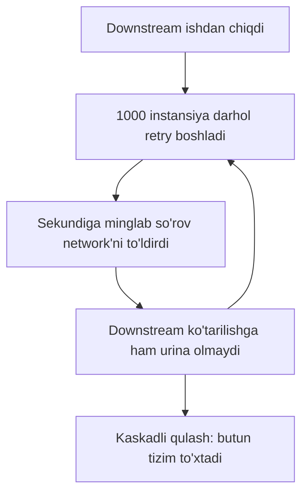
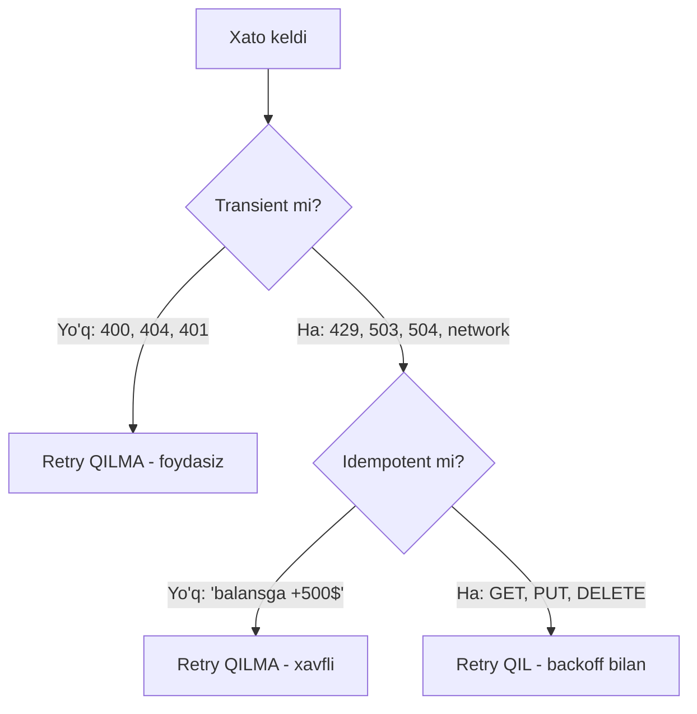
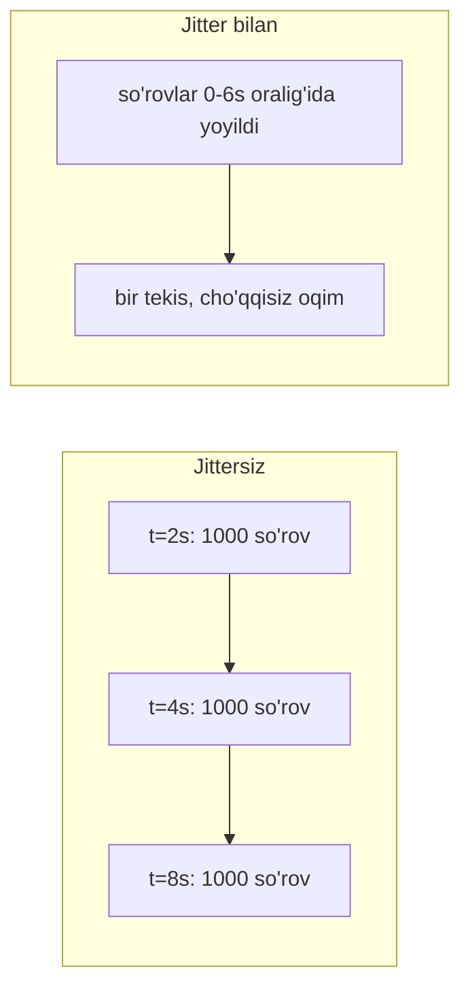
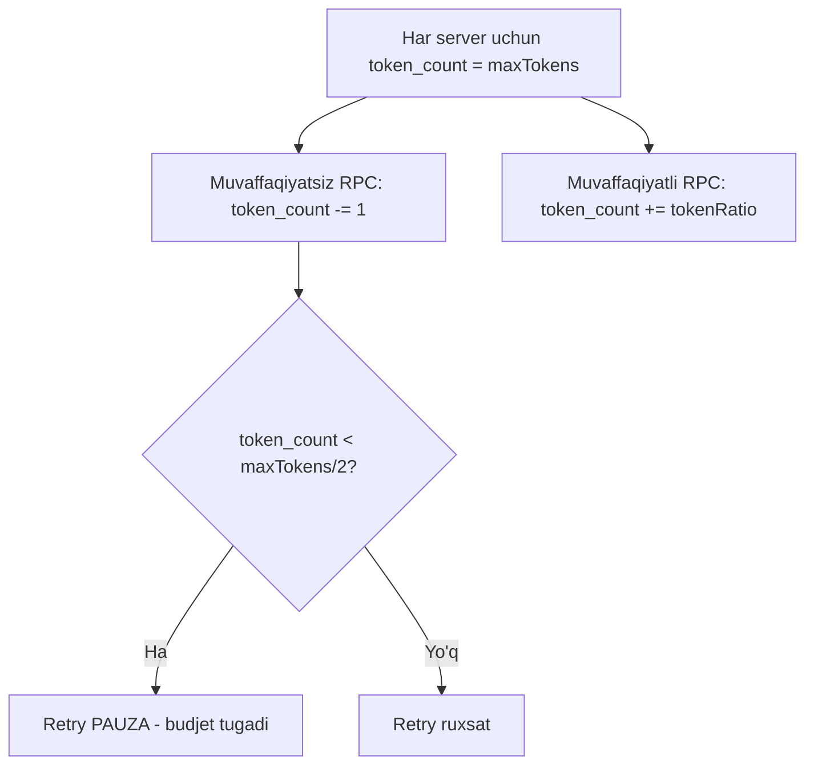

# 2. Retry

> **TL;DR:** Retry — bu vaqtinchalik (transient) xatoni tan olib, muvaffaqiyatsiz operatsiyani **qayta urinish**. To'g'ri qilinsa (backoff + jitter + faqat idempotent operatsiyalar) service barqarorligini keskin oshiradi; noto'g'ri qilinsa (naive loop) — butun tizimni qulatadigan **retry storm** keltirib chiqaradi. Retry — resilience zanjirining ikkinchi bo'g'ini.

Zanjirdagi o'rni:

> [Timeout](./1.%20Timeout.md) -> **Retry** -> [Circuit Breaker](./3.%20Circuit%20Breaker.md)

Avval [Timeout](./1.%20Timeout.md) qo'ydik — endi timeout bo'yicha (yoki boshqa transient xato bilan) kesilgan urinishni **xavfsiz** takrorlaymiz. Retry o'zi ham keyingi bo'g'in — [Circuit Breaker](./3.%20Circuit%20Breaker.md) — bilan chegaralanadi, chunki cheksiz retry o'z-o'zicha xavfli.

---

## Muammo — "shunchaki qayta urin" degan sodda kod tizimni qulatadi

Distributed system'da xatoning **vaqtinchalik** bo'lishi — reallik. Downstream service bir soniyaga overload bo'lishi, network paketi yo'qolishi, avtomatik masshtablanish (auto-scaling) yangi instansiya ko'tarayotgan paytda `503` qaytishi mumkin. Bunday xatolar **o'z-o'zidan** yo'qoladi. Shuning uchun aqlli echim — bir oz kutib, qayta urinish.

Lekin mana bu kodni ko'r — real production'da topilgan:

```go
res, err := SendRequest()
for err != nil {
    res, err = SendRequest()
}
```

Sodda va vasvasaga soluvchi ko'rinadi, to'g'rimi? Aynan shu kod bir necha yuz serverga tarqatilgach, downstream service ishdan chiqqanda **butun tizim qulagan**.



Bu — **retry storm** (qayta urinishlar bo'roni). Bu Amazon DynamoDB'ning 2015-yilgi mashhur uzilishining sababi bo'lgan: metadata service sekinlashgach, storage server'lar "itoatkorlik bilan" qayta-qayta urina boshlagan, bu esa yukni yanada oshirib, uzilishni **5 soatga** cho'zgan. Downstream tuzalgan bo'lsa ham, ustiga darhol shunchalik yuk tushadiki, u qayta ko'tarila olmaydi.

> **Oltin qoida:** Retry — foydali, lekin har retry **backoff algoritmi** bilan birga bo'lishi shart. Backoff'siz retry — himoya emas, o'z-o'zini yaralaydigan qurol.

---

## Mohiyati — eshikni taqillatish

Analogiya: do'stingning uyiga bording, eshigini taqillatding — javob yo'q. Nima qilasan?

- **Yomon usul:** eshikni to'xtovsiz, jon-jahding bilan urib turaverasan. Bu — naive retry loop. Qo'shnilar bezovta, eshik sinishi mumkin, do'sting bo'lsa dushdan chiqishga ham ulgurmaydi.
- **Yaxshi usul:** taqillatasan, biroz kutasan, yana taqillatasan — har safar **ko'proq** kutasan (exponential backoff). Va boshqa mehmonlar bilan bir vaqtda taqillatib qolmaslik uchun kutish vaqtini **tasodifiy** biroz o'zgartirasan (jitter).

Analogiya chegarasi: uyda do'sting **bor** deb ishonasan (transient — u dushda). Agar do'sting **umuman uyda bo'lmasa** (permanent xato — masalan `404 Not Found` yoki `400 Bad Request`), taqillatishning ma'nosi yo'q. Retry faqat **vaqtinchalik** muammolar uchun. Bu farqni ajrata olish — retry'ning eng muhim qismi.

---

## Qanday ishlaydi

### Qachon retry qilish MUMKIN

Ikki shart bir vaqtda bajarilishi kerak:

1. **Xato transient (vaqtinchalik) bo'lsa** — o'z-o'zidan yo'qolishi mumkin bo'lgan xato.
2. **Operatsiya idempotent bo'lsa** — bir necha marta bajarilsa ham natija bir xil bo'ladigan operatsiya.



Transient xatolarning tipik belgilari (HTTP):

| Kod | Ma'nosi | Retry? |
|---|---|---|
| `429 Too Many Requests` | Rate-limit; server "sekinroq" deyapti | Ha (backoff bilan) |
| `503 Service Unavailable` | Vaqtinchalik overload/maintenance | Ha |
| `504 Gateway Timeout` | Upstream javob bermadi | Ha (ehtiyot bilan) |
| `400 Bad Request` | So'rov noto'g'ri | **Yo'q** — qayta yuborsang ham xato |
| `401 / 403` | Autentifikatsiya/ruxsat | **Yo'q** |
| `404 Not Found` | Resurs yo'q | **Yo'q** |

gRPC'da bu farq aniqroq: `UNAVAILABLE` — transient, retry qilsa bo'ladi; `RESOURCE_EXHAUSTED` — server sizni backpressure qilyapti, **darhol** retry qilma.

> ⚠️ **Idempotency — hayot-mamot masalasi.** "Balansga 500$ qo'sh" operatsiyasini retry qilsang, network sababli javob yo'qolgan bo'lsa, mijoz hisobiga **1000$** tushadi. Bank buni kechirmaydi. Idempotency haqida to'liq: [6. Idempotency](./6.%20Idempotency.md). Qisqacha yechim — har operatsiyaga `transactionID` biriktir, qabul qiluvchi takroriy ID'ni rad etsin.

---

## Go implementatsiyasi

### Kitobdagi asosiy `Retry` funksiyasi

Kitob `Effector` tipini e'lon qiladi — retry qilinadigan funksiyaning imzosi. `Retry` uni o'rab, retry mantig'ini qo'shgan closure qaytaradi.

```go
// Effector — potentsial muvaffaqiyatsiz operatsiya imzosi
type Effector func(context.Context) (string, error)

func Retry(effector Effector, retries int, delay time.Duration) Effector {
    return func(ctx context.Context) (string, error) {
        // --- 1-qadam: r=0 dan boshlab, cheksiz halqa (chiqish ichkarida) ---
        for r := 0; ; r++ {
            // --- 2-qadam: asl funksiyani chaqiramiz ---
            response, err := effector(ctx)

            // --- 3-qadam: muvaffaqiyat YOKI urinishlar tugadi -> qaytamiz ---
            if err == nil || r >= retries {
                return response, err
            }

            log.Printf("Attempt %d failed; retrying in %v", r+1, delay)

            // --- 4-qadam: delay kutamiz, LEKIN ctx bekor bo'lsa darhol chiqamiz ---
            select {
            case <-time.After(delay):
            case <-ctx.Done():
                return "", ctx.Err()
            }
        }
    }
}
```

**Notional machine:** `Retry` — closure qaytaradi, lekin bu closure'da **tashqi holat (state) yo'q** (Circuit Breaker'dan farqli). Shuning uchun mutex kerak emas — har chaqiruv mustaqil. `select` ichidagi ikki case muhim: `time.After(delay)` kutish uchun, `ctx.Done()` esa **kutish paytida** timeout/cancel kelsa darhol chiqish uchun. Ya'ni retry ham [Timeout](./1.%20Timeout.md) context'iga bo'ysunadi — umumiy deadline tugasa, retry to'xtaydi.

Sinab ko'rish uchun kitob "3 marta xato beradigan, keyin muvaffaqiyat" funksiyasini yasaydi:

```go
var count int

func EmulateTransientError(ctx context.Context) (string, error) {
    count++
    if count <= 3 {
        return "intentional fail", errors.New("error")
    }
    return "success", nil
}

func main() {
    r := Retry(EmulateTransientError, 5, 2*time.Second)
    res, err := r(context.Background())
    fmt.Println(res, err)
}
```

Chiqish:

```
2020/... Attempt 1 failed; retrying in 2s
2020/... Attempt 2 failed; retrying in 2s
2020/... Attempt 3 failed; retrying in 2s
success <nil>
```

To'rtinchi urinishda `count > 3` bo'lgani uchun `success` qaytadi.

### 🤔 O'ylab ko'r

`if err == nil || r >= retries` shartidan `r >= retries` qismini olib tashlasak nima bo'ladi?

<details>
<summary>💡 Javobni ko'rish</summary>

Retry **cheksiz** bo'lib qoladi — funksiya faqat `err == nil` bo'lganda to'xtaydi. Downstream butunlay o'lgan bo'lsa, bu boshidagi naive loop muammosiga qaytaradi (retry storm). `r >= retries` — bu **maksimal urinishlar chegarasi**; usiz retry havfli. `ctx.Done()` biroz himoya beradi (deadline tugasa chiqadi), lekin deadline uzoq bo'lsa baribir minglab urinish bo'lishi mumkin.
</details>

---

## Backoff evolyutsiyasi: fixed -> exponential -> +jitter

Kitob 9-bobda retry'ning "kechikish (backoff)" algoritmini **uch bosqichda** rivojlantiradi. Bu — retry'ni tushunishning eng muhim qismi.

### Bosqich 1 — Fixed delay (belgilangan kechikish)

Har urinishdan oldin **bir xil** vaqt kutish:

```go
res, err := SendRequest()
for err != nil {
    time.Sleep(2 * time.Second)
    res, err = SendRequest()
}
```

Naive loop'dan yaxshiroq — so'rovlar sonini kamaytiradi. Lekin **masshtablanmaydi**: 1000 ta instansiya bir vaqtda ishga tushsa, har 2 soniyada 1000 ta so'rov birdan keladi. Network baribir to'lib ketishi mumkin.

### Bosqich 2 — Exponential backoff (eksponensial kechikish)

Har urinishda kutish vaqti **ikki barobar** oshadi (2s, 4s, 8s, 16s...), belgilangan `cap` (yuqori chegara) gacha:

```go
res, err := SendRequest()
base, cap := time.Second, time.Minute

for backoff := base; err != nil; backoff <<= 1 { // backoff <<= 1 => ikki barobar
    if backoff > cap {
        backoff = cap
    }
    time.Sleep(backoff)
    res, err = SendRequest()
}
```

**Notional machine:** `backoff <<= 1` — bit siljitish, ya'ni `backoff = backoff * 2`. Bu downstream'ga vaqt beradi: birinchi urinishlar tez, keyin borgan sari kamdan-kam. Lekin bu ham **yetarli emas**. Muammo: 1000 ta instansiya bir vaqtda xato olsa, ular ham **bir vaqtda** kutadi va **bir vaqtda** qayta uradi. Natijada so'rovlar to'lqin-to'lqin (synchronized bursts) bo'lib keladi — har to'lqin baribir yuk cho'qqisini yaratadi.

### Bosqich 3 — Exponential backoff + jitter (tasodifiy tebranish)

Yechim — kutish vaqtiga **tasodifiylik** qo'shish. Shunda 1000 ta instansiya bir vaqtda emas, vaqt bo'ylab **yoyilib** urinadi. Kitobdagi kod:

```go
res, err := SendRequest()
base, cap := time.Second, time.Minute

for backoff := base; err != nil; backoff <<= 1 {
    if backoff > cap {
        backoff = cap
    }
    // jitter: 0 dan (backoff*3) gacha tasodifiy son qo'shiladi
    jitter := rand.Int63n(int64(backoff * 3))
    sleep := base + time.Duration(jitter)
    time.Sleep(sleep)
    res, err = SendRequest()
}
```

Natija — so'rovlar **taxminan bir tekis tezlikda** taqsimlanadi, yuk cho'qqilari yo'qoladi. Downstream nafas oladi va tuzaladi.



> ⚠️ **Diqqat — `rand` deterministik.** Go'ning `math/rand` paketi `rand.Seed` chaqirilmasa, har ishga tushishda **bir xil** "tasodifiy" ketma-ketlik beradi (`rand.Seed(1)` kabi). Eski Go'da `rand.Seed(time.Now().UnixNano())` qo'yish kerak edi. Go 1.20+ da global generator avtomatik seed qilinadi. Har holda jitter'da bu nuance'ni eslab qol.

### Jitter variantlari (AWS)

AWS "Exponential Backoff and Jitter" maqolasi uch variantni tavsiflaydi:

| Variant | Formula (pseudocode) | Xususiyati |
|---|---|---|
| **Full jitter** | `sleep = random(0, min(cap, base*2^n))` | Maksimal yoyilish; eng kam raqobat (contention) |
| **Equal jitter** | `sleep = cap/2 + random(0, cap/2)` | Yarmi kafolatlangan kutish + yarmi tasodif |
| **Decorrelated** | `sleep = min(cap, random(base, last_sleep*3))` | Oldingi kutishga bog'liq; adaptiv |

Amaliyotda **full jitter** eng ko'p tavsiya etiladi — u synchronized retry'larni butunlay yo'q qiladi.

---

## Real dunyoda

### Retry storm va uni oldini olish

Retry storm — **cascading failure** ning eng ko'p uchraydigan turi. Yaxshi niyat bilan yozilgan retry mantig'i, katta tizimga zarar keltiradi. Ayniqsa xavfli holat: har **qatlamda** retry qilish. A -> B -> C zanjirida har biri 3 marta retry qilsa, C ga jami `3*3*3 = 27` so'rov yetadi — **multiplicative blow-up**.

Google SRE tavsiyalari:
- **Faqat rad etuvchi qatlamning bevosita ustidagi qatlamda** retry qil — har joyda emas.
- **Per-request retry budgeti**: bitta so'rov uchun maksimal 3 urinish; keyin xato yuqoriga qaytadi.

### Retry budget — token bucket

**Retry budget** — retry'lar sonini **umumiy** cheklaydi, alohida so'rov emas. G'oya: retry'lar so'rovlarning ma'lum foizidan (masalan **10%**) oshmasin.

Google SRE'da har client retry nisbatini kuzatadi; nisbat 10% dan oshsa, retry to'xtaydi. Bu amplifikatsiyani eng yomon holatda ham atigi **1.1x** ga cheklaydi.

gRPC'ning token bucket implementatsiyasi:



Xato bo'lsa token kamayadi, muvaffaqiyat bo'lsa oshadi. Token yarmidan pastga tushsa — retry to'xtaydi, downstream tuzalguncha. Bu retry'ni "o'z-o'zini cheklaydigan" qiladi.

### Kutubxonalar

- **`github.com/cenkalti/backoff`** — exponential backoff + jitter, context bilan integratsiya. Go'da eng mashhur retry kutubxonasi.
- **`github.com/grpc-ecosystem/go-grpc-middleware` (retry interceptor)** — gRPC uchun retry policy.
- **gRPC built-in retry** — `service config` orqali deklarativ: `maxAttempts`, `initialBackoff`, `backoffMultiplier`, `retryableStatusCodes`.
- **Kubernetes / Envoy / Istio** — `retryPolicy` (route darajasida): `numRetries`, `perTryTimeout`, `retryOn`. Ya'ni retry platform darajasida ham sozlanadi.

---

## Tuzoqlar va anti-patternlar

- **Backoff'siz retry (naive loop).** `for err != nil { retry() }` — eng klassik xato, retry storm keltiradi. Har doim exponential backoff + jitter.
- **Non-idempotent operatsiyani retry qilish.** "Pul o'tkazish", "buyurtma yaratish" kabi operatsiyalar retry'da ikki marta bajarilib qolishi mumkin. Idempotency kaliti/tokeni kerak ([6. Idempotency](./6.%20Idempotency.md)).
- **Permanent xatoni retry qilish.** `400`, `401`, `404` ni retry qilish — bekorga resurs sarfi. Faqat transient (`429`, `503`, `504`, network) ni retry qil.
- **Har qatlamda retry (nested retries).** A, B, C — har biri retry qilsa, multiplicative blow-up (`3*3*3=27`). Faqat bitta qatlamda retry qil.
- **Retry'ni timeout'siz ishlatish.** Retry context deadline'ga bo'ysunmasa, umumiy budjetni buzadi. Har retry [Timeout](./1.%20Timeout.md) ostida bo'lsin.
- **Retry budgetsiz cheksiz retry.** `maxAttempts` va retry budget (token bucket / 10% nisbat) bo'lmasa, tizim o'zini o'zi DDoS qiladi.
- **`rand` ni seed qilmaslik (eski Go).** Jitter deterministik bo'lib qolsa, yoyilish yo'qoladi.

---

## Bog'liq patternlar

| Pattern | Aloqasi | Link |
|---|---|---|
| Timeout | Retry timeout bo'yicha kesilgan urinishni takrorlaydi; har retry context deadline'ga bo'ysunadi | [1. Timeout](./1.%20Timeout.md) |
| Circuit Breaker | Retry cheklangan urinish qiladi; CB esa ketma-ket xatolarda butunlay uzoqlashadi. Ular birga ishlaydi | [3. Circuit Breaker](./3.%20Circuit%20Breaker.md) |
| Idempotency | Retry faqat idempotent operatsiyalarda xavfsiz | [6. Idempotency](./6.%20Idempotency.md) |
| Backpressure / Load Shedding | Retry budget — client tomonida; load shedding — server tomonida ortiqcha yukni tashlaydi | [Backpressure - Load Shedding](../3.%20Distributed%20Patterns/8.%20Backpressure%20-%20Load%20Shedding.md) |
| Resilience (umumiy) | Retry — resilience'ning ikkinchi qatlami | [Resilience](../1.%20Cloud%20Native%20App/4.%20Resilience.md) |

---

## Interview savollari

**1. Retry qilishdan oldin qanday ikki shartni tekshirasan?**

<details>
<summary>Javob</summary>

Birinchi: xato **transient (vaqtinchalik)** bo'lishi kerak — `429`, `503`, `504`, network xatolari o'z-o'zidan yo'qolishi mumkin. `400`, `401`, `404` — permanent, retry foydasiz. Ikkinchi: operatsiya **idempotent** bo'lishi kerak — bir necha marta bajarilsa ham natija bir xil. `GET`, `PUT`, `DELETE` odatda idempotent; "balansga qo'sh" kabi scalar operatsiyalar emas (ular uchun idempotency kaliti kerak). Ikkala shart bajarilmasa, retry zarar keltiradi.
</details>

**2. Retry storm nima va nega jitter uni oldini oladi?**

<details>
<summary>Javob</summary>

Retry storm — downstream ishdan chiqqanda ko'plab client'lar bir vaqtda qayta-qayta urinib, network va downstream'ni yanada bo'g'ib qo'yishi. Downstream tuzalsa ham, ustiga darhol shunchalik yuk tushadiki, qayta ko'tarila olmaydi (DynamoDB 2015). Oddiy exponential backoff yetmaydi, chunki barcha client'lar **bir vaqtda** kutib, **bir vaqtda** urinadi (synchronized bursts). Jitter — kutish vaqtiga tasodifiylik qo'shib, urinishlarni vaqt bo'ylab yoyadi, natijada yuk bir tekis taqsimlanadi va cho'qqilar yo'qoladi.
</details>

**3. Exponential backoff'ning uch bosqichli evolyutsiyasini tushuntir.**

<details>
<summary>Javob</summary>

(1) **Fixed delay** — har urinishda bir xil kutish (2s, 2s, 2s). So'rovlarni kamaytiradi, lekin masshtablanmaydi. (2) **Exponential** — kutish ikki barobardan oshadi (2s, 4s, 8s), cap gacha. Downstream'ga tobora ko'proq vaqt beradi, lekin client'lar sinxron urinaveradi. (3) **Exponential + jitter** — kutishga tasodifiy tebranish qo'shiladi; client'lar vaqt bo'ylab yoyilib, taxminan bir tekis tezlikda urinadi. Bu — production'da tavsiya etiladigan yakuniy variant.
</details>

**4. Retry budget nima va u nima uchun kerak?**

<details>
<summary>Javob</summary>

Retry budget — retry'lar sonini **umumiy** (aggregate) cheklaydigan mexanizm, alohida so'rov chegarasidan tashqari. Masalan: retry'lar barcha so'rovlarning 10% dan oshmasin (Google SRE). Yoki token bucket: har xato token kamaytiradi, muvaffaqiyat oshiradi; token yarmidan pastga tushsa retry to'xtaydi (gRPC). Kerak, chunki `maxAttempts` alohida so'rovni cheklaydi, lekin **minglab** so'rov bir vaqtda 3 martadan retry qilsa ham storm bo'ladi. Budget umumiy amplifikatsiyani (masalan 1.1x ga) cheklaydi.
</details>

**5. A -> B -> C zanjirida har qatlam 3 marta retry qilsa, C ga necha so'rov yetishi mumkin? Bu nega xavfli?**

<details>
<summary>Javob</summary>

`3 * 3 * 3 = 27` so'rov. Bu — **multiplicative blow-up (retry amplification)**. Har qatlam mustaqil retry qilgani uchun urinishlar ko'payib boradi. C sekinlashsa, unga 27 barobar yuk tushadi — bu retry storm'ni kuchaytiradi. Yechim (Google SRE): retry'ni faqat **rad etuvchi qatlamning bevosita ustida** qil, har joyda emas; va retry budget qo'y. Ideal holatda faqat bitta qatlam retry qiladi.
</details>

---

## Eslab qol

- Retry faqat **transient xato** VA **idempotent operatsiya** bo'lgandagina xavfsiz.
- Backoff'siz retry = **retry storm** = cascading failure. Har retry **exponential backoff + jitter** bilan.
- Backoff evolyutsiyasi: fixed -> exponential -> **+jitter** (yakuniy tavsiya: full jitter).
- **Retry budget** (token bucket / 10% nisbat) umumiy amplifikatsiyani cheklaydi; `maxAttempts` yolg'iz yetarli emas.
- Retry'ni har qatlamda qilma — **multiplicative blow-up** (`3*3*3=27`); faqat bitta qatlamda.
- Har retry [Timeout](./1.%20Timeout.md) deadline'ga bo'ysunsin; keyingi bo'g'in [Circuit Breaker](./3.%20Circuit%20Breaker.md) — ketma-ket xatolarda butunlay uzoqlashadi.
