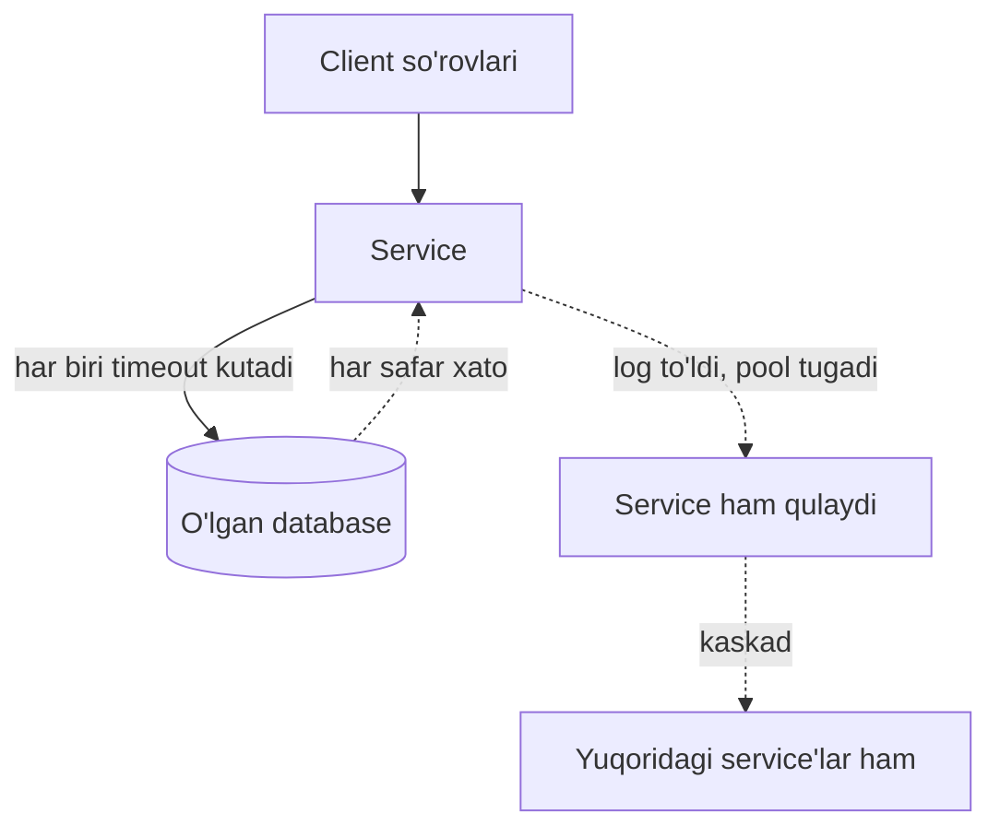
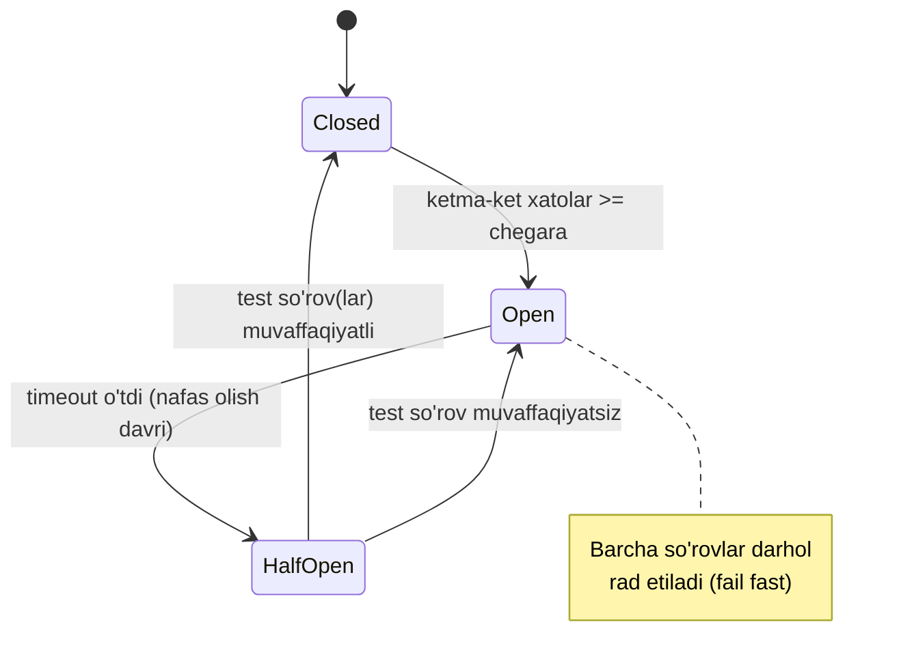
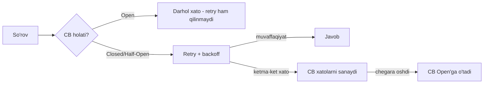

# 3. Circuit Breaker

> **TL;DR:** Circuit Breaker (o'zib qo'yuvchi/avtomat) — ishlamayotgan downstream service'ga qayta-qayta murojaat qilishni **butunlay to'xtatib**, darhol xato qaytaradigan mexanizm. U ketma-ket xatolarni sanaydi va chegaradan oshsa "ochiladi" (fail fast). Bu — kaskadli qulashni oldini oladi va o'lgan service'ga tuzalish uchun vaqt beradi. Resilience zanjirining uchinchi, eng aqlli bo'g'ini.

Zanjirdagi o'rni:

> [Timeout](./1.%20Timeout.md) -> [Retry](./2.%20Retry.md) -> **Circuit Breaker**

Avval [Timeout](./1.%20Timeout.md) qo'ydik (qachon voz kechish), keyin [Retry](./2.%20Retry.md) qo'shdik (xavfsiz takrorlash). Lekin retry ham cheksiz emas: agar downstream **butunlay** o'lgan bo'lsa, har so'rovda retry qilish bekorga resurs sarfi. Circuit Breaker aynan shu holatni tutadi — ko'p xatodan keyin u so'rovlarni umuman o'tkazmaydi.

---

## Muammo — o'lgan service'ga taqillatishda davom etish

Klassik stsenariy: service so'rov oladi, database'ga murojaat qiladi, javob qaytaradi. Endi database **ishdan chiqdi**. Nima bo'ladi?

Circuit Breaker'siz service database'ga so'rov yuborishda **davom etadi**:
- Har so'rov timeout'ni kutadi (masalan 10s) — resurs band.
- Loglar xato xabarlari bilan to'lib ketadi.
- Connection pool tugaydi.
- Oxir-oqibat service ham qulaydi yoki foydasiz xato qaytaradi.



Muammoning mohiyati: downstream o'lgani **aniq** bo'lsa ham, har so'rov baribir urinib ko'radi va timeout'ni kutadi. Bu — vaqt va resurs isrofi. Bundan tashqari, o'lgan database'ga to'xtovsiz so'rov yuborish uni tuzalishga ham qo'ymaydi (retry storm bilan bir xil zarar).

> **Oltin qoida:** Downstream o'lgani ma'lum bo'lsa, unga urinib timeout kutgandan ko'ra, **darhol xato qaytar** (fail fast). Bu resursni tejaydi va o'lgan service'ga nafas oldiradi.

---

## Mohiyati — uydagi elektr avtomatı

Analogiya: uyingdagi elektr shitidagi **avtomat** (circuit breaker). Simda qisqa tutashuv (short circuit) bo'lsa, avtomat darhol **o'zib** (uzib) qo'yadi. Nega? Chunki tok o'tishda davom etsa — sim yonadi, yong'in chiqadi. Avtomat "tez uzib qo'yish" bilan katta falokatni oldini oladi.

Muammo tuzalgach, avtomatni **qo'lda** yoqasan. Software'da esa avtomat biroz vaqtdan keyin **o'zi** "yoqishga urinib ko'radi" — bir-ikki test so'rov yuboradi. Ular muvaffaqiyatli bo'lsa, to'liq yoqiladi.

Analogiya chegarasi: elektr avtomatı tok kuchini (amper) o'lchaydi; software Circuit Breaker esa **ketma-ket xatolar sonini** o'lchaydi. Va yana: software CB o'zini avtomatik tiklaydi (half-open holati), elektrikniki esa yo'q.

---

## Qanday ishlaydi — uch holat

Circuit Breaker uch holatli mashina (state machine):

| Holat | Ma'nosi | So'rovlar |
|---|---|---|
| **Closed** (yopiq) | Sog'lom, normal ish | Hammasi o'tadi; xatolar sanaladi |
| **Open** (ochiq) | Nosoz; so'rovlar bloklangan | Hech biri o'tmaydi; darhol xato (fail fast) |
| **Half-Open** (yarim ochiq) | Sinov davri | Cheklangan test so'rovlar o'tadi |

> Diqqat — nomlar chalkash: elektrda "closed" (yopiq zanjir) = tok **o'tadi** = normal. "Open" (uzilgan zanjir) = tok **o'tmaydi** = bloklangan. Software'da ham xuddi shunday.



Oqim:
1. **Closed** — hammasi normal. CB ketma-ket xatolarni sanaydi.
2. Xatolar chegaradan (masalan 5 ta ketma-ket) oshsa -> **Open**.
3. **Open** — barcha so'rovlar darhol rad etiladi. Downstream nafas oladi.
4. Timeout (masalan 2s) o'tgach -> **Half-Open**.
5. **Half-Open** — bir necha test so'rov o'tkaziladi. Muvaffaqiyatli bo'lsa -> **Closed** (tiklandi). Xato bo'lsa -> yana **Open** (odatda kutish vaqti ikki barobar oshadi).

---

## Go implementatsiyasi

### Kitobdagi `Breaker` (closure bilan)

Kitob `Circuit` tipini e'lon qiladi — downstream bilan aloqadagi funksiya imzosi. `Breaker` uni o'raydi va xuddi shu imzoli yangi funksiya qaytaradi (bu — Adapter pattern'ning maxsus turi).

```go
// Circuit — downstream service bilan aloqadagi funksiya imzosi
type Circuit func(context.Context) (string, error)

func Breaker(circuit Circuit, failureThreshold uint) Circuit {
    // --- Tashqi holat (closure ichida saqlanadi) ---
    var consecutiveFailures int = 0
    var lastAttempt = time.Now()
    var m sync.RWMutex

    return func(ctx context.Context) (string, error) {
        // --- 1-qadam: read-lock bilan holatni o'qiymiz ---
        m.RLock()
        d := consecutiveFailures - int(failureThreshold)
        if d >= 0 {
            // chegaradan oshdik -> Open. Qachon qayta urinsa bo'ladi?
            shouldRetryAt := lastAttempt.Add(time.Second * 2 << d) // 2s, 4s, 8s...
            if !time.Now().After(shouldRetryAt) {
                m.RUnlock()
                return "", errors.New("service unreachable") // fail fast
            }
        }
        m.RUnlock()

        // --- 2-qadam: (Closed yoki Half-Open) haqiqiy so'rovni yuboramiz ---
        response, err := circuit(ctx)

        // --- 3-qadam: write-lock bilan natijani yozamiz ---
        m.Lock()
        defer m.Unlock()
        lastAttempt = time.Now()

        if err != nil {
            consecutiveFailures++      // xato -> hisoblagichni oshir
            return response, err
        }

        consecutiveFailures = 0        // muvaffaqiyat -> reset (Closed'ga qayt)
        return response, nil
    }
}
```

**Notional machine:** `Breaker` — closure qaytaradi. Closure ichidagi `consecutiveFailures`, `lastAttempt`, `m` — **tashqi holat**, ular chaqiruvlar orasida saqlanadi (Retry'dan farqi shu — Retry'da state yo'q edi). Shuning uchun bu yerda `sync.RWMutex` **zarur**: ko'p goroutine bir vaqtda closure'ni chaqirishi mumkin, holat esa umumiy. `RLock` (read lock) — bir nechta o'quvchiga ruxsat; `Lock` (write lock) — faqat bitta yozuvchiga.

Diqqatga sazovor tafsilotlar:
- **`2 << d`** — exponential backoff: har muvaffaqiyatsiz seriyadan keyin kutish vaqti taxminan ikki barobar oshadi (`2s, 4s, 8s...`). Bu — Half-Open'ga o'tishni sekinlashtirib, o'lgan service'ni bezovta qilmaydi.
- **Half-Open holati aniq nomlanmagan**, lekin mavjud: `shouldRetryAt` o'tgach, closure **bitta** haqiqiy so'rov o'tkazadi. U muvaffaqiyatli bo'lsa `consecutiveFailures = 0` (Closed), xato bo'lsa hisoblagich oshadi (yana Open).

Kitob ta'kidlaydi: bu — sodda va keng tarqalgan backoff algoritmi, lekin **ideal emas** — jitter yo'q. Real production'da jitter qo'shish kerak (qarang: [Retry](./2.%20Retry.md) dagi backoff evolyutsiyasi).

### 🤔 O'ylab ko'r

`Breaker` ichida `2 << d` o'rniga oddiy fixed `2 * time.Second` qo'ysak, nima o'zgaradi?

<details>
<summary>💡 Javobni ko'rish</summary>

Backoff **eksponensial** emas, **fixed** bo'lib qoladi: downstream o'lgan bo'lsa, har 2 soniyada bir marta test so'rov yuboriladi. Bu ko'proq yuk beradi va o'lgan service'ga kamroq nafas oladi. `2 << d` esa `d` (chegaradan qancha oshgani) oshgani sari kutishni ikki barobar cho'zadi — service qanchalik uzoq o'lik bo'lsa, uni shunchalik kam bezovta qiladi. Bu Retry'dagi exponential backoff bilan bir xil g'oya.
</details>

### sony/gobreaker — production kutubxonasi

Amaliyotda o'z Breaker'ingni yozmaysan — tayyor kutubxona ishlatasan. Go'da eng mashhuri — **`github.com/sony/gobreaker`**. U `Settings` struct bilan sozlanadi:

```go
import "github.com/sony/gobreaker"

var cb *gobreaker.CircuitBreaker

func init() {
    settings := gobreaker.Settings{
        Name:        "HTTP GET",
        MaxRequests: 3,               // Half-Open'da nechta so'rovga ruxsat
        Interval:    5 * time.Second, // Closed'da hisoblagichni tozalash davri
        Timeout:     10 * time.Second,// Open -> Half-Open o'tish vaqti
        ReadyToTrip: func(counts gobreaker.Counts) bool {
            // Qachon Open'ga o'tish? Bu yerda: 3+ ketma-ket xato
            return counts.ConsecutiveFailures > 3
        },
        OnStateChange: func(name string, from, to gobreaker.State) {
            log.Printf("CB %s: %s -> %s", name, from, to)
        },
    }
    cb = gobreaker.NewCircuitBreaker(settings)
}
```

Ishlatilishi — `Execute` ichiga funksiyani o'rash:

```go
func Get(url string) ([]byte, error) {
    body, err := cb.Execute(func() (interface{}, error) {
        resp, err := http.Get(url)
        if err != nil {
            return nil, err
        }
        defer resp.Body.Close()
        return io.ReadAll(resp.Body)
    })
    if err != nil {
        return nil, err // CB ochiq bo'lsa: gobreaker.ErrOpenState
    }
    return body.([]byte), nil
}
```

`Settings` maydonlarining ma'nosi:

| Maydon | Vazifasi |
|---|---|
| `MaxRequests` | Half-Open holatda o'tishga ruxsat berilgan maksimal so'rovlar |
| `Interval` | Closed holatda ichki hisoblagichlarni tozalash davri (`0` = tozalanmaydi) |
| `Timeout` | Open holat davomiyligi; keyin Half-Open'ga o'tadi (default 60s) |
| `ReadyToTrip` | `Counts` oladi, `true` qaytarsa -> Open. Bu yerda o'z shartingni yozasan |
| `OnStateChange` | Holat o'zgarganda chaqiriladi (monitoring/alert uchun) |
| `IsSuccessful` | Qaysi xato "muvaffaqiyat" hisoblanishini belgilaydi (masalan `404` xato emas) |

`Counts` struct kuzatadi: `Requests`, `TotalSuccesses`, `TotalFailures`, `ConsecutiveSuccesses`, `ConsecutiveFailures`. `ReadyToTrip`'da bularni ishlatib murakkab shart yozasan (masalan "xato nisbati > 60%").

### Distributed Circuit Breaker

Bir service'ning ko'p instansiyasi bo'lsa, har biri o'z CB holatini alohida saqlaydi. Umumiy holat kerak bo'lsa (barcha instansiyalar bir vaqtda "biladi"), holatni **Redis** yoki **Memcached** kabi umumiy xotirada saqlash mumkin. Bu kitobda ham eslatiladi.

---

## Real dunyoda

- **`sony/gobreaker`** — eng keng tarqalgan Go kutubxonasi (yuqorida ko'rildi).
- **`github.com/afex/hystrix-go`** — Netflix Hystrix portı; CB + bulkhead + metrics.
- **Envoy / Istio** — service mesh darajasida CB (`outlier detection`): nosoz upstream'ni load balancer poolidan chiqarib tashlaydi. Bu — infra darajasidagi Circuit Breaker.
- **gRPC** — `xDS` orqali outlier detection, yoki client interceptor'lar.
- **Resilience4j** (Java), **Polly** (.NET) — boshqa ekotizimlardagi ekvivalentlar; g'oya bir xil.

Kubernetes kontekstida CB liveness/readiness probe bilan birlashadi: nosoz pod readiness'dan tushib, trafik olmaydi — bu ham CB mantig'ining bir ko'rinishi.

---

## Circuit Breaker vs Retry — farqi va birga ishlashi

Ikkalasi ham resilience pattern, lekin **turli** muammoni hal qiladi:

| Jihat | Retry | Circuit Breaker |
|---|---|---|
| Maqsad | Bitta so'rovni **takrorlash** | Ko'p xatoda **butunlay to'xtash** |
| Qamrov | Bitta so'rov ichida | Ko'p so'rov bo'ylab (holat saqlaydi) |
| Holat (state) | Yo'q (stateless) | Bor (Closed/Open/Half-Open) |
| Reaksiya | "Yana urinib ko'ray" | "Endi urinmayman, fail fast" |

Ular **birga** ishlaydi va bir-birini to'ldiradi:



**Muhim nuance:** CB **ichida** retry qilma, yoki retry **ichida** CB'ni noto'g'ri joylashtirma. To'g'ri tartib odatda: **CB tashqarida, retry ichida** — agar CB ochiq bo'lsa, retry umuman boshlanmaydi (bekorga urinmaydi). Bu retry storm'ni ham oldini oladi.

---

## Circuit Breaker vs Throttle — kitobdagi taqqoslash

Bu ikki pattern yuzaki o'xshaydi (ikkalasi ham resilience va vaqt birligidagi chaqiruvlarni boshqaradi), lekin mohiyatan **farqli**:

| Jihat | Circuit Breaker | Throttle |
|---|---|---|
| Nimaga qaraydi | Ketma-ket **xatolar** soni | Chaqiruvlar **chastotasi** (tezligi) |
| Muvaffaqiyat ahamiyati | Faqat xatolar muhim | Muvaffaqiyat/xato — farqi yo'q |
| Odatda qayerda | **Chiquvchi** (outgoing) so'rovlar | **Kiruvchi** (incoming) trafik |
| Maqsad | Nosoz downstream'dan uzoqlashish | Yukni chegaralash (rate limiting) |

Kitob aniq aytadi: **Circuit Breaker** odatda faqat chiquvchi so'rovlarga qo'llanadi va u so'rovlar **chastotasiga** umuman qaramaydi — faqat **ketma-ket muvaffaqiyatsiz** so'rovlarga qaraydi. **Throttle** esa avtomobildagi drossel kabi ishlaydi: so'rovlar sonini (muvaffaqiyat yoki xatodan qat'i nazar) maksimal tezlik bilan cheklaydi, odatda kiruvchi trafikka.

Qisqasi: **CB "nosoz bo'lgani uchun" to'xtatadi; Throttle "ko'p bo'lgani uchun" cheklaydi.**

---

## Tuzoqlar va anti-patternlar

- **Backoff'siz (yoki jitter'siz) CB.** Half-Open'ga o'tish fixed vaqtda bo'lsa, o'lgan service'ni tez-tez bezovta qiladi. Kitob kodidagi `2 << d` — exponential; production'da jitter ham qo'sh.
- **Chegarani noto'g'ri sozlash.** Juda past `failureThreshold` — CB tez-tez ochiladi (bezovta), juda yuqori — kech ochiladi (foyda yo'q). Real metrikalar bilan sozla.
- **Har so'rovga alohida CB instansiyasi.** CB holat saqlaydi — u **umumiy** (shared) bo'lishi kerak. Har so'rovda `NewCircuitBreaker` chaqirsang, holat hech qachon yig'ilmaydi.
- **CB va Retry'ni noto'g'ri joylashtirish.** Retry tashqarida, CB ichida bo'lsa — CB ochiq bo'lsa ham retry qayta-qayta uradi. To'g'risi: CB tashqarida.
- **Timeout'siz CB.** CB ichidagi funksiya timeout'siz bo'lsa, "muvaffaqiyatsiz" hech qachon aniqlanmaydi (abadiy kutadi). [Timeout](./1.%20Timeout.md) CB'ning sharti.
- **Xato turini ajratmaslik.** `404` yoki `400` (permanent, client xatosi) CB'ni ochirmasligi kerak — ular downstream nosozligi emas. `IsSuccessful` bilan filtrla.
- **Half-Open'da juda ko'p so'rovga ruxsat.** Tuzalayotgan service'ga birdan katta yuk tushib, yana o'ldirishi mumkin. `MaxRequests` ni kam qo'y.

---

## Bog'liq patternlar

| Pattern | Aloqasi | Link |
|---|---|---|
| Timeout | CB ichidagi funksiya timeout bilan chegaralanishi shart; timeout "muvaffaqiyatsiz"ni aniqlaydi | [1. Timeout](./1.%20Timeout.md) |
| Retry | Retry bitta so'rovni takrorlaydi; CB ko'p xatoda butunlay to'xtaydi. Birga ishlaydi (CB tashqarida) | [2. Retry](./2.%20Retry.md) |
| Throttle | CB "nosozlik" uchun to'xtatadi; Throttle "chastota" uchun cheklaydi | [Backpressure - Load Shedding](../3.%20Distributed%20Patterns/8.%20Backpressure%20-%20Load%20Shedding.md) |
| Backpressure / Load Shedding | CB — client tomonida chiquvchi; load shedding — server tomonida kiruvchi yukni tashlaydi | [Backpressure - Load Shedding](../3.%20Distributed%20Patterns/8.%20Backpressure%20-%20Load%20Shedding.md) |
| Resilience (umumiy) | CB — resilience'ning uchinchi, eng aqlli qatlami | [Resilience](../1.%20Cloud%20Native%20App/4.%20Resilience.md) |

---

## Interview savollari

**1. Circuit Breaker'ning uch holatini va o'tishlarni tushuntir.**

<details>
<summary>Javob</summary>

**Closed** (yopiq) — normal ish, barcha so'rovlar o'tadi, CB ketma-ket xatolarni sanaydi. Ketma-ket xatolar chegaradan oshsa -> **Open**. **Open** (ochiq) — barcha so'rovlar darhol rad etiladi (fail fast), downstream'ga umuman murojaat qilinmaydi; downstream nafas oladi. Timeout o'tgach -> **Half-Open**. **Half-Open** (yarim ochiq) — cheklangan test so'rov(lar) o'tkaziladi. Muvaffaqiyatli bo'lsa -> **Closed** (tiklandi). Xato bo'lsa -> yana **Open** (odatda kutish vaqti ikki barobar oshadi).
</details>

**2. Circuit Breaker va Retry orasidagi farq nima? Ular birga qanday ishlaydi?**

<details>
<summary>Javob</summary>

Retry — **bitta** so'rovni takrorlaydi, stateless, "yana urinaman" mantig'i. CB — **ko'p** so'rov bo'ylab holat saqlaydi, "endi urinmayman" mantig'i (ketma-ket xatoda ochiladi). Birga: odatda **CB tashqarida, retry ichida** — CB ochiq bo'lsa retry umuman boshlanmaydi, bu bekor urinishlar va retry storm'ni oldini oladi. CB retry'ni to'xtatuvchi "yuqori chegara" vazifasini bajaradi: individual retry cheklangan, CB esa umuman uzoqlashadi.
</details>

**3. Circuit Breaker va Throttle qanday farq qiladi?**

<details>
<summary>Javob</summary>

CB **xatolar soniga** qaraydi (chastotaga emas), odatda **chiquvchi** so'rovlarga, va faqat **ketma-ket muvaffaqiyatsiz** so'rovlarda ishga tushadi — maqsadi nosoz downstream'dan uzoqlashish. Throttle **chaqiruvlar chastotasiga** qaraydi (muvaffaqiyat/xatodan qat'i nazar), odatda **kiruvchi** trafikka, avtomobil drosseli kabi maksimal tezlikni cheklaydi — maqsadi rate limiting. Qisqasi: CB "nosoz bo'lgani uchun" to'xtatadi, Throttle "ko'p bo'lgani uchun" cheklaydi.
</details>

**4. Kitobdagi `Breaker` implementatsiyasida nega `sync.RWMutex` kerak, `Retry`'da esa mutex kerak emas edi?**

<details>
<summary>Javob</summary>

Chunki `Breaker` **tashqi holat** saqlaydi: `consecutiveFailures`, `lastAttempt`. Bu holat closure ichida bo'lib, ko'p goroutine bir vaqtda closure'ni chaqirganda umumiy o'zgaruvchilarga kirishadi — data race bo'ladi. `RWMutex` uni himoya qiladi (o'qish uchun `RLock`, yozish uchun `Lock`). `Retry` esa **stateless** — har chaqiruv o'z lokal `r` hisoblagichiga ega, umumiy o'zgaruvchan holat yo'q, shuning uchun mutex ham kerak emas.
</details>

**5. Half-Open holati nima uchun kerak? Usiz CB qanday muammoga duch keladi?**

<details>
<summary>Javob</summary>

Half-Open — downstream tuzalganini **xavfsiz tekshirish** uchun oraliq holat. Usiz CB faqat Open va Closed bo'lardi: Open'dan to'g'ridan-to'g'ri Closed'ga o'tsa, birdan **butun** trafik tuzalayotgan (balki hali to'liq tiklanmagan) service'ga tushib, uni yana o'ldirishi mumkin (flapping). Half-Open esa faqat bir-ikki **test** so'rov o'tkazadi: ular o'tsa -> Closed (asta-sekin to'liq trafik), o'tmasa -> yana Open. Bu — controlled recovery.
</details>

---

## Eslab qol

- Circuit Breaker — o'lgan downstream'ga urinishni to'xtatib, **darhol xato qaytaradi** (fail fast).
- Uch holat: **Closed** (normal) -> **Open** (bloklangan, fail fast) -> **Half-Open** (sinov) -> Closed/Open.
- CB **holat saqlaydi** — shuning uchun `sync.RWMutex` bilan himoyalanadi va **umumiy** (shared) instansiya bo'lishi kerak.
- Production'da o'zing yozma — **`sony/gobreaker`** ishlat (`ReadyToTrip`, `Timeout`, `MaxRequests`).
- CB vs Retry: retry bitta so'rovni takrorlaydi, CB ko'p xatoda butunlay to'xtaydi — birga ishlaydi (**CB tashqarida, retry ichida**).
- CB vs Throttle: CB **xatoga** qaraydi (chiquvchi), Throttle **chastotaga** (kiruvchi).
- Zanjir yakuni: [Timeout](./1.%20Timeout.md) -> [Retry](./2.%20Retry.md) -> **Circuit Breaker** — uch bo'g'in birga to'liq resilience beradi.
