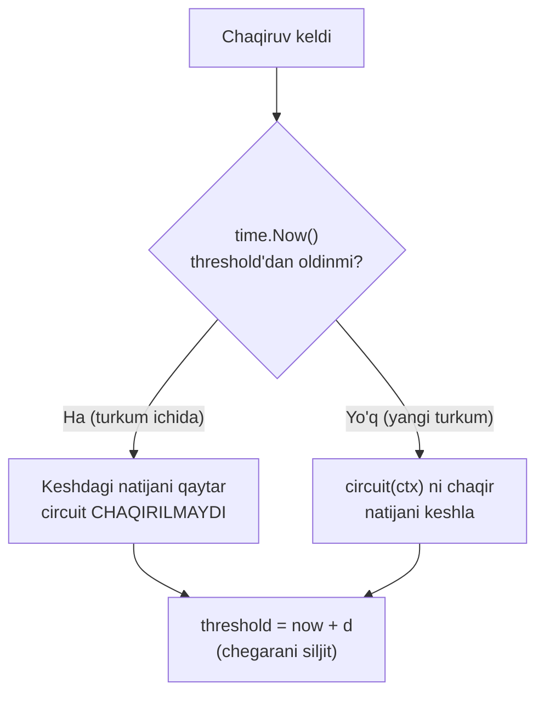

# 4. Debounce (Antidrebezg)

> **TL;DR:** Debounce — vaqt bo'yicha zich joylashgan bir turkum ("burst") chaqiruvdan faqat **bittasini** o'tkazadigan stability pattern: yo turkumning **birinchisini** (DebounceFirst), yo **oxirgisini** (DebounceLast). Qolgan hammasi tashlab yuboriladi. Maqsad — takroriy, qimmat yoki keraksiz operatsiyalarni bostirib, bitta mazmunli chaqiruvga aylantirish.

Manba: "Cloud Native Go" (M. Titmus, 2022, 4-bob) + frontend debounce amaliyoti.
Bog'liq: [5. Throttle - Rate Limiting](<5. Throttle - Rate Limiting.md>) · [Resilience](<../1. Cloud Native App/4. Resilience.md>)

---

## Muammo — bir xil ishni ketma-ket qayta-qayta bajarish

Tasavvur qiling, foydalanuvchi qidiruv maydoniga "golang" deb yozmoqda. Agar har bir tugma bosilganda darrov serverga so'rov jo'natsak:

```
g   -> so'rov 1
go  -> so'rov 2
gol -> so'rov 3
gola-> so'rov 4   (xato terildi)
gol -> so'rov 5   (o'chirildi)
gola-> so'rov 6
golan-> so'rov 7
golang-> so'rov 8
```

Foydalanuvchi bir so'z yozguncha **8 ta** so'rov ketdi. Ularning 7 tasi keraksiz — foydalanuvchi hali yozib tugatmagan edi. Bu:

| Og'riq | Nima bo'ladi |
|--------|--------------|
| **Isrof** | 8 tadan 7 tasi keraksiz DB/API so'rovi — CPU, tarmoq, pul behuda |
| **Race natija** | So'rov 7 so'rov 8'dan keyin qaytib kelsa, ekranda eski natija ko'rinadi |
| **Rate limit** | Tashqi API tez orada `429 Too Many Requests` bilan sizni bloklaydi |
| **UI qotishi** | Har harfda og'ir hisob-kitob — brauzer/interfeys sekinlashadi |

Server tomonida ham xuddi shu muammo: kamdan-kam yangilanadigan uzoq resursni (masalan konfiguratsiya, narxlar jadvali) bir necha goroutine bir vaqtda so'rasa, aslida bittasi yetardi — qolgani bir xil javobni takror oladi.

> **Muammoning mohiyati:** hodisalar zich turkum (burst) bo'lib keladi, lekin ularning hammasiga alohida javob berish shart emas — bittasi butun turkum uchun yetarli.

---

## Mohiyati — lift eshigi analogiyasi

Liftga chiqdingiz, eshik yopilmoqchi. Shu payt yana odam kirdi — sensor buni sezib, taymerini **noldan qayta boshlaydi** va eshik ochiq turadi. Yana kimdir kirdi — taymer yana qayta boshlanadi. Odamlar kirishdan **to'xtaganidan keyin** ma'lum vaqt (masalan 3 soniya) jimlik bo'lsa — **shundagina** eshik yopiladi.

Eshik har bir odamga alohida "yopilaman-ochilaman" deb sakramaydi. U **oxirgi harakatdan keyin jimlik kutadi** va faqat bitta marta yopiladi. Bu — aynan **DebounceLast**.

Endi liftning "chaqirish" tugmasini eslang: uni asabiy 10 marta bossangiz ham, lift **birinchi** bosishga javob beradi, qolgan 9 tasi behuda. Bu — **DebounceFirst**.

> **Sodda ta'rif:** Debounce — bir-biriga yaqin (zich) chaqiruvlar turkumini kuzatib, ulardan faqat bittasini (birinchi yoki oxirgi) haqiqiy funksiyaga o'tkazadigan, qolganini yutib yuboradigan o'ram (closure).

**Analogiya chegarasi:** lift eshigi sensori "harakat bor/yo'q" ni fizik sezadi. Debounce esa faqat **vaqtni** o'lchaydi: "oxirgi chaqiruvdan beri d vaqt o'tdimi?". U chaqiruvlar mazmunini ("g" va "golang" farqini) bilmaydi — faqat vaqt oralig'ini biladi.

Pattern nomi elektronikadan kelgan: kalit (switch) kontaktlari ulanganda "dirillaydi" (bounce) — bir necha marta tez ochilib-yopiladi. Bu dirillashni bostirib, bitta toza signal berish "antidrebezg" (de-bounce) deyiladi. Bizning kod ham xuddi shuni qiladi: chaqiruvlar dirillashini bitta signalga tekislaydi.

---

## Qanday ishlaydi

Ikkita variant bor va ular **teskari** vaqtlashtiradi:

| Variant | Qachon chaqiradi | Qaysi natijani beradi | Qayerda ko'p ishlatiladi |
|---------|------------------|------------------------|---------------------------|
| **DebounceFirst** | Turkumning **boshida**, darhol | Birinchi javobni keshlab qaytaradi | Server-side — darhol javob kerak bo'lsa |
| **DebounceLast** | Turkum **tugagach**, jimlikdan keyin | Oxirgi (eng yangi) natijani beradi | Frontend — foydalanuvchi ma'lumot terib bo'lguncha kutish |

Umumiy mexanizm: har chaqiruvda **threshold** (chegara vaqti) `now + d` ga siljitiladi. Chegaradan oldin kelgan chaqiruvlar turkumga tegishli deb hisoblanadi.



Turkum tugashini (jimlikni) vizual tasavvur qiling. Nuqtalar — chaqiruv urinishlari, `X` — haqiqatan bajarilgan chaqiruv:

```
Chaqiruvlar:   . . . .        . . .          .
DebounceFirst: X                X              X     (turkum BOSHIda)
DebounceLast:        X                X        X     (turkum OXIRIda, jimlikdan so'ng)
```

DebounceFirst darhol o'tkazadi, keyin turkum tugaguncha jim. DebounceLast esa turkum tugab, jimlik cho'kkandan keyingina bitta chaqiruv qiladi.

---

## Go implementatsiyasi

### Umumiy tip

Kitobdagi barcha stability patternlar bir xil imzoga (signature) ega — bu ularni bir-biriga zanjirband qilishga imkon beradi. Debounce ham [Circuit Breaker](<3. Circuit Breaker.md>) bilan bir xil `Circuit` tipidan foydalanadi:

```go
// Circuit — chastotasini cheklamoqchi bo'lgan funksiyamiz imzosi.
// context.Context — bekor qilish/timeout signalini uzatish uchun.
type Circuit func(context.Context) (string, error)
```

Bir xil imzo tufayli patternlarni **kombinatsiya** qilish mumkin:

```go
// Debounce va Breaker ni birga ishlatamiz: avval chastotani jilovlash,
// keyin xatoliklardan himoya.
wrapped := Breaker(Debounce(myFunction), 3)
response, err := wrapped(ctx)
```

### Variant 1 — DebounceFirst (birinchi chaqiruvga javob)

Bu variant soddaroq: faqat oxirgi chaqiruv vaqtini saqlaymiz va turkum ichida kelgan chaqiruvga **keshdagi** natijani qaytaramiz.

```go
func DebounceFirst(circuit Circuit, d time.Duration) Circuit {
    // --- 1-qadam: o'ram ichida yashaydigan holat (closure state) ---
    var threshold time.Time   // turkum tugash vaqti
    var result string         // keshlangan natija
    var err error             // keshlangan xato
    var m sync.Mutex          // parallel chaqiruvlarni himoya qiladi

    // --- 2-qadam: Circuit imzosidagi o'ramni qaytaramiz ---
    return func(ctx context.Context) (string, error) {
        m.Lock()
        // --- 3-qadam: chiqishda HAR SAFAR chegarani now+d ga siljit ---
        defer func() {
            threshold = time.Now().Add(d)
            m.Unlock()
        }()

        // --- 4-qadam: hali turkum ichidamizmi? keshni qaytar ---
        if time.Now().Before(threshold) {
            return result, err
        }

        // --- 5-qadam: yangi turkum boshi — circuit'ni haqiqatan chaqir ---
        result, err = circuit(ctx)
        return result, err
    }
}
```

**Notional machine — xotirada nima bo'ladi:**

- `threshold`, `result`, `err`, `m` — o'ram (closure) ichida "yopiq" o'zgaruvchilar. Ular funksiya qaytgandan keyin ham **yashab qoladi**, chunki qaytarilgan anonim funksiya ularga havola ushlab turadi. Bu — closure holati.
- Butun tana `m.Lock()` bilan qulflangan: turkum boshida bir vaqtda kelgan bir nechta goroutine **navbatga turadi**. Birinchisi `circuit`ni chaqirib natijani keshlaydi, qolganlari o'sha keshlangan natijani oladi.
- `defer` tufayli chegara (`threshold`) **har** haqiqiy chaqiruvda emas, **har bir** o'ram chaqiruvida yangilanadi. Ya'ni turkum "tirik" turgan sari eshik oldinga surilaveradi.

> Kitob ta'kidi: DebounceFirst butun funksiyani mutex ichiga o'rab, ko'p oqimli muhitda maksimal xavfsizlikka erishadi va `circuit` **aynan bir marta**, turkum boshida chaqirilishini kafolatlaydi.

Ishga tushirilganda (masalan `d = 1s`, chaqiruvlar 100ms oralab keladi):

```
[chaqiruv 1] -> circuit CHAQIRILDI  -> "javob-A", nil
[chaqiruv 2] -> kesh                -> "javob-A", nil
[chaqiruv 3] -> kesh                -> "javob-A", nil
... 1 soniya jimlik ...
[chaqiruv 9] -> circuit CHAQIRILDI  -> "javob-B", nil   (yangi turkum)
```

> 🤔 **O'ylab ko'r:** Agar `circuit(ctx)` chaqiruvi 5 soniya davom etsa va `d = 1s` bo'lsa, birinchi chaqiruv ketayotganda kelgan ikkinchi goroutine nima qiladi?

<details>
<summary>💡 Javobni ko'rish</summary>

Ikkinchi goroutine `m.Lock()` da **bloklanadi** va birinchisi tugaguncha kutadi. Birinchisi tugagach mutex bo'shaydi, ikkinchisi kirib `threshold`ni tekshiradi — endi `result` allaqachon keshlangan, shuning uchun `circuit` qayta chaqirilmaydi, keshdagi "javob-A" qaytadi. Ya'ni og'ir operatsiya faqat bir marta bajariladi, boshqalar javobga "ilashib" oladi.
</details>

### Variant 2 — DebounceLast (oxirgi chaqiruvga javob)

Bu variant murakkabroq, chunki turkum **tugashini** kutish kerak. Buning uchun `time.Ticker` (belgilangan oraliqda signal beradigan taymer) fonda ishlaydi va "chegaradan o'tdikmi?" deb tekshiradi.

```go
type Circuit func(context.Context) (string, error)

func DebounceLast(circuit Circuit, d time.Duration) Circuit {
    // --- 1-qadam: closure holati ---
    var threshold time.Time = time.Now()
    var ticker *time.Ticker
    var result string
    var err error
    var once sync.Once   // fon goroutine'ni AYNAN bir marta ishga tushiradi
    var m sync.Mutex

    return func(ctx context.Context) (string, error) {
        m.Lock()
        defer m.Unlock()

        // --- 2-qadam: har chaqiruvda chegarani oldinga sur ---
        threshold = time.Now().Add(d)

        // --- 3-qadam: fon kuzatuvchini faqat BIR marta yoq ---
        once.Do(func() {
            ticker = time.NewTicker(time.Millisecond * 100)
            go func() {
                // --- 5-qadam: tozalash — ticker'ni to'xtat, once'ni tikla ---
                defer func() {
                    m.Lock()
                    ticker.Stop()
                    once = sync.Once{}
                    m.Unlock()
                }()

                // --- 4-qadam: har 100ms da chegaradan o'tdikmi tekshir ---
                for {
                    select {
                    case <-ticker.C:
                        m.Lock()
                        if time.Now().After(threshold) {
                            result, err = circuit(ctx) // jimlik! circuit'ni chaqir
                            m.Unlock()
                            return
                        }
                        m.Unlock()
                    case <-ctx.Done():
                        m.Lock()
                        result, err = "", ctx.Err()
                        m.Unlock()
                        return
                    }
                }
            }()
        })

        return result, err
    }
}
```

**Notional machine — bu yerda nima sodir bo'ladi:**

- **`sync.Once`** — `Do(...)` ichidagi kodni jarayon davomida **faqat bir marta** ishga tushiradi. Shuning uchun turkumdagi 100 ta chaqiruv kelsa ham, fon goroutine bittagina yaratiladi.
- **`time.Ticker`** — har 100ms da `ticker.C` kanaliga signal yuboradi. Bu "har 100ms da tekshiruv qil" degan yurak urishi (heartbeat). Har chaqiruvda yangi Ticker yaratish qimmat bo'lgani uchun bittasini qayta ishlatamiz.
- Har haqiqiy chaqiruvda `threshold = now + d`. Turkum davom etar ekan, `now` hech qachon `threshold`dan o'tolmaydi (chunki chegara doim oldinga suriladi). Chaqiruvlar **to'xtagach**, 100ms lar o'tib `now > threshold` bo'ladi — mana shu jimlik nuqtasida `circuit` bir marta chaqiriladi.
- `circuit` chaqirilgach fon goroutine `return` qiladi. `defer` `ticker.Stop()` va `once = sync.Once{}` ni bajaradi — bu `once`ni "qayta zaryadlab", keyingi turkum uchun yangi fon goroutine yaratilishiga yo'l ochadi.

> Kitob ta'kidi: butun tekshiruv `sync.Once` ichida bo'lgani uchun fon jarayon aynan bir marta ishga tushadi; `threshold` esa turkumning oxirini belgilaydi. Farqi ham shu — DebounceFirst darhol, DebounceLast jimlikni kutib chaqiradi.

> 🤔 **O'ylab ko'r:** `once = sync.Once{}` qatorini tozalash `defer`idan olib tashlasak nima bo'ladi?

<details>
<summary>💡 Javobni ko'rish</summary>

`sync.Once` bir marta ishlagach, `Do` boshqa hech qachon ichidagi kodni ishlatmaydi. Agar uni qayta tiklamasak, birinchi turkum tugagach fon goroutine o'ladi va **boshqa hech qachon** yangisi yaralmaydi. Natijada ikkinchi turkumdan boshlab hech qanday chaqiruv `circuit`ga yetmaydi — pattern buzilib, funksiya doim eski keshni qaytaraveradi. `once`ni tiklash aynan shuning oldini oladi.
</details>

### DebounceFirst vs DebounceLast — qisqa taqqoslash

| Xususiyat | DebounceFirst | DebounceLast |
|-----------|---------------|--------------|
| Chaqiruv vaqti | Turkum boshida, darhol | Turkum oxirida, jimlikdan keyin |
| Javob tezligi | Tez (keshlangan) | Kechikadi (d qadar) |
| Qo'shimcha goroutine | Yo'q | Bor (Ticker kuzatuvchi) |
| `sync.Once` kerakmi | Yo'q | Ha |
| Tipik joy | Server-side | Frontend, autocomplete |

---

## Real dunyoda

### Frontend debounce bilan solishtirish

Debounce yillar davomida JavaScript dunyosida ishlatilib kelingan — brauzerni sekinlatishi mumkin bo'lgan operatsiyalar sonini cheklash uchun. Tanish misollar:

- **Qidiruv/autocomplete** — foydalanuvchi terishdan to'xtaguncha (masalan 300ms jimlik) taklif oynasi chiqmaydi. Bu — DebounceLast.
- **Tugmani tez-tez bosish** — faqat oxirgisi (yoki birinchisi) hisobga olinadi, qolgani e'tiborsiz.
- **Window resize / scroll** — har piksel o'zgarishida emas, harakat tugagach bir marta qayta hisoblash.

Lodash'dagi mashhur `_.debounce(fn, wait, {leading, trailing})` aynan shu ikki variantni beradi: `leading: true` -> DebounceFirst, `trailing: true` (standart) -> DebounceLast. Ya'ni Go'dagi ikki funksiya frontend'dagi ikki bayroqning aynan o'zi.

> Server dasturchilari UI dasturchilaridan ko'p narsa o'rganishi mumkin: ular ishonchlilik, kechikish va o'tkazuvchanlik muammolarini yillab hal qilib kelishmoqda. Xuddi shu debounce yondashuvi bilan kamdan-kam yangilanadigan uzoq resursni ortiqcha so'rovlarsiz olish mumkin.

### Go ekotizimi

- Standart kutubxonada tayyor Debounce yo'q — bu odatda closure sifatida qo'lda yoziladi (kitobdagidek).
- Frontend'dagi kabi keng tarqalgan pattern bo'lgani uchun ko'p loyihalar o'z `debounce.go` yordamchisini yozadi.
- Infra darajasida: fayl kuzatuvchilar (fsnotify) tez-tez fayl o'zgarishlarini debounce qilib, bitta "qayta yuklash" (reload) hodisasiga aylantiradi.

---

## Tuzoqlar va anti-patternlar

⚠️ **1. Debounce'ni oddiy kesh deb tushunish.** Noto'g'ri tasavvur: "u shunchaki javobni saqlaydi". Aslida u **turkumni** aniqlaydi — chegara har chaqiruvda oldinga suriladi. Turkum tinim olmasa, DebounceFirst hech qachon yangi chaqiruv qilmaydi. To'g'risi: bu vaqt oynasi bo'yicha bostirish, oddiy TTL kesh emas.

⚠️ **2. Mutex'ni unutish.** Closure holati (`threshold`, `result`) bir nechta goroutine tomonidan bir vaqtda o'zgartiriladi. Mutexsiz bu **data race**. To'g'risi: butun kritik qismni `sync.Mutex` bilan o'rash (kitobdagidek).

⚠️ **3. DebounceLast'da har chaqiruvda yangi Ticker.** Noto'g'ri: har chaqiruvda `time.NewTicker` yaratish. Nega yomon: zich turkumda minglab Ticker va goroutine yaraladi — resurs isrofi. To'g'risi: `sync.Once` bilan bitta fon goroutine va bitta Ticker.

⚠️ **4. DebounceLast'ni darhol javob kerak joyda ishlatish.** DebounceLast kamida `d` qadar kechikadi. HTTP so'roviga sinxron javob kutayotgan joyda bu foydalanuvchini kuttiradi. To'g'risi: server-side sinxron javobga DebounceFirst.

⚠️ **5. `ctx.Done()`ni e'tiborsiz qoldirish.** So'rov bekor qilinsa (foydalanuvchi sahifani yopdi), fon goroutine abadiy ishlab, **goroutine leak** bo'ladi. To'g'risi: `select` ichida `<-ctx.Done()` shoxini ushlab, toza chiqish.

---

## Bog'liq patternlar

| Pattern | Aloqasi | Link |
|---------|---------|------|
| **Throttle** | Ikkalasi ham chastotani cheklaydi; Throttle vaqt birligidagi **maksimal sonni** ushlaydi, Debounce esa **turkumdan bittasini** o'tkazadi | [5. Throttle - Rate Limiting](<5. Throttle - Rate Limiting.md>) |
| **Circuit Breaker** | Bir xil `Circuit` imzosi — zanjirband qilinadi; Breaker xatolikka, Debounce chastotaga qaraydi | [1. Circuit Breaker](<3. Circuit Breaker.md>) |
| **Retry** | Teskari maqsad: Retry ko'proq urinadi, Debounce kamroq chaqiradi | [2. Retry](<2. Retry.md>) |
| **Backpressure / Load Shedding** | Yuqori darajadagi oqim boshqaruvi; Debounce mikro-darajada ortiqcha chaqiruvni yutadi | [Backpressure](<../3. Distributed Patterns/8. Backpressure - Load Shedding.md>) |

### Debounce vs Throttle — mohiy farq (kitob, 4.4-rasm)

Bu ikki pattern ko'rinishdan o'xshaydi (ikkalasi ham chaqiruv sonini kamaytiradi), lekin vaqtlashtirishi boshqacha:

| | **Debounce** | **Throttle** |
|--|--------------|--------------|
| Nima cheklaydi | Chaqiruvlar **turkumini** (burst) | Vaqt birligidagi **maksimal chastotani** |
| Nechta o'tkazadi | Turkumdan **1 ta** (birinchi yoki oxirgi) | Vaqt birligida **N ta gacha** |
| Metafora | Lift eshigi — jimlikni kutadi | Avtomobil drossel zaslonkasi — oqimni cheklaydi |
| Ko'p ishlatiladi | Foydalanuvchi kiritishi, autocomplete | API rate limiting, DDoS himoyasi |

Sodda qilib: **Debounce** — "to'xtaganingdan keyin bir marta ish qil"; **Throttle** — "qancha bossang ham, sekundiga N martadan ko'p qilmayman". Batafsil: [Throttle darsi](<5. Throttle - Rate Limiting.md>).

---

## Interview savollari

**1. DebounceFirst va DebounceLast farqi nima, qaysi birini qayerda ishlatasiz?**

<details>
<summary>Javob</summary>

DebounceFirst turkumning **birinchi** chaqiruvini darhol bajaradi va qolganiga keshlangan natijani qaytaradi — darhol javob kerak bo'lgan server-side stsenariylar uchun. DebounceLast turkum **tugashini** (jimlikni) kutadi va oxirgi, eng yangi holatga bir marta javob beradi — foydalanuvchi ma'lumot terib bo'lguncha kutish kerak bo'lgan frontend (autocomplete) uchun. Farqi vaqtlashtirish: birinchisi tez, ikkinchisi to'liqroq lekin kechikadi.
</details>

**2. Nega DebounceLast'da `sync.Once` va fon goroutine kerak, DebounceFirst'da esa yo'q?**

<details>
<summary>Javob</summary>

DebounceFirst faqat "hozir turkum ichidamizmi?" degan sinxron savolga javob beradi — buni chaqiruv paytida to'g'ridan-to'g'ri tekshirish mumkin. DebounceLast esa **kelajakdagi** jimlik nuqtasini aniqlashi kerak; buni faqat vaqtni davomiy kuzatib turgan fon jarayon qila oladi (Ticker). `sync.Once` esa har turkum uchun aynan bitta shunday kuzatuvchi ishga tushishini kafolatlaydi.
</details>

**3. Debounce'ni Circuit Breaker bilan zanjirband qilish mumkinmi? Nega?**

<details>
<summary>Javob</summary>

Ha. Ikkalasi ham bir xil `Circuit func(context.Context) (string, error)` imzosiga ega, shuning uchun biri ikkinchisini o'rashi mumkin: `Breaker(Debounce(fn), 3)`. Bu Go'ning funksiyalarni birinchi darajali qiymat sifatida ishlatishi va bir xil imzoli patternlar kombinatsiyasi tufayli ishlaydi.
</details>

**4. DebounceLast'da goroutine leak qaysi holatda yuz beradi va qanday oldi olinadi?**

<details>
<summary>Javob</summary>

Agar `ctx` bekor qilinsa-yu `select` ichida `<-ctx.Done()` shoxi bo'lmasa, fon goroutine abadiy Ticker'ni kutib qoladi — leak. Kitobdagi implementatsiyada `case <-ctx.Done():` shoxi bor: kontekst bekor bo'lganda goroutine `ctx.Err()`ni saqlab, `defer` orqali Ticker'ni to'xtatib toza chiqadi.
</details>

**5. Debounce va Throttle qanday farq qiladi? Foydalanuvchi tugmani 1 soniyada 10 marta bossa, har biri nechta chaqiruv o'tkazadi?**

<details>
<summary>Javob</summary>

Debounce turkumni ko'radi: DebounceFirst 1 ta (birinchi bosish), DebounceLast 1 ta (jimlikdan keyin) o'tkazadi. Throttle esa chastota cheklovi bilan ishlaydi: masalan "sekundiga 3 marta" bo'lsa, 3 ta chaqiruv o'tadi, qolgan 7 tasi rad etiladi. Debounce turkumni **bittaga** siqadi, Throttle esa oqimni **belgilangan chastotagacha** kesadi.
</details>

---

## Eslab qol

- **Debounce = turkumdan bitta chaqiruv**: zich hodisalar ko'pligini bittaga siqadi.
- **First = darhol (server), Last = jimlikdan keyin (frontend)** — ikkalasi teskari vaqtlashtiradi.
- **`threshold = now + d` har chaqiruvda siljiydi** — turkum tinim olmasa eshik doim oldinga suriladi.
- **DebounceLast'da `sync.Once` + `time.Ticker`** bitta fon kuzatuvchi va toza `ctx.Done()` chiqishi shart.
- **Debounce turkumni, Throttle chastotani** cheklaydi — bu ikkisini adashtirmang.
