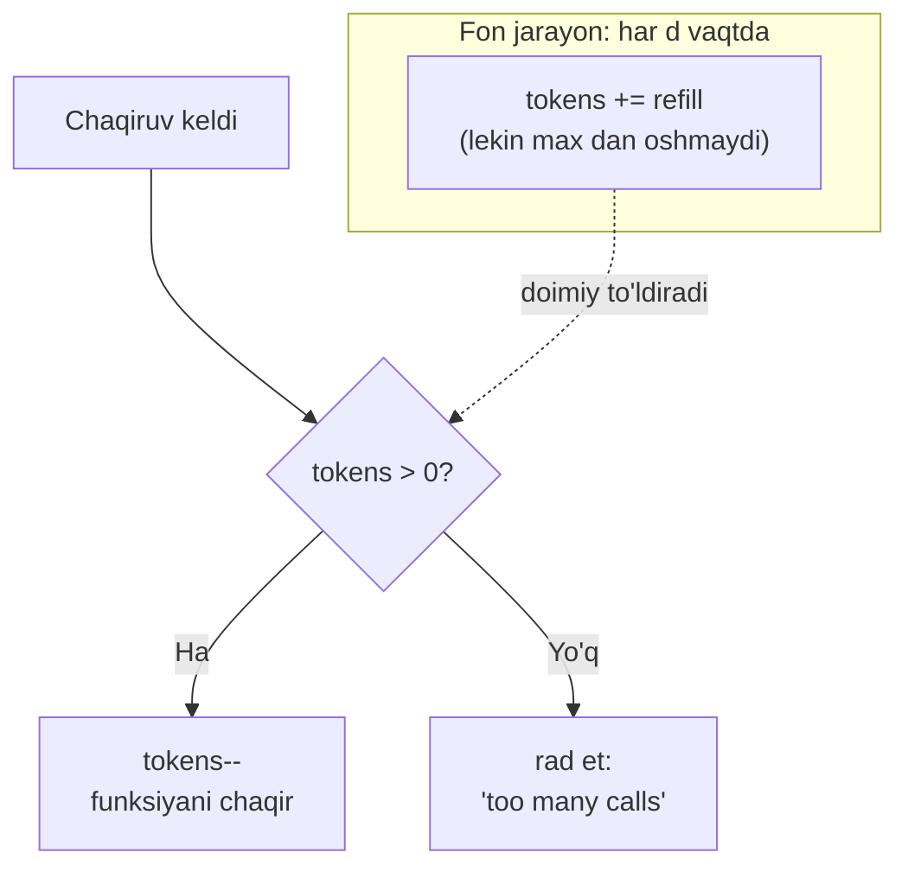

# 5. Throttle - Rate Limiting (Drossel zaslonkasi)

> **TL;DR:** Throttle — funksiya chaqiruvlarini **vaqt birligidagi ma'lum songacha** cheklaydigan stability pattern. U kutilmagan "burst"larni (portlashlarni) tekislaydi, tizim to'yinishining oldini oladi. Standart implementatsiya — **token bucket** (jeton savati) algoritmi; sanoat standarti esa `golang.org/x/time/rate` paketi.

Manba: "Cloud Native Go" (M. Titmus, 2022, 4-bob) + `golang.org/x/time/rate` docs + rate limiting algoritmlari taqqoslashi.
Bog'liq: [4. Debounce](<4. Debounce.md>) · [Resilience](<../1. Cloud Native App/4. Resilience.md>) · [Backpressure - Load Shedding](<../3. Distributed Patterns/8. Backpressure - Load Shedding.md>)

---

## Muammo — nazoratsiz "burst" tizimni yiqitadi

Xizmatingiz sekundiga 1000 ta so'rovni bemalol ko'taradi. Bir kuni marketing aksiyasi boshlanadi va bir zumda 50 000 ta foydalanuvchi kirib keladi:

```
Normal:  ~~~~~~~~~~   (1000 rps, hammasi joyida)
Burst:   |||||||||||  (50000 rps bir zumda — tizim to'yindi)
```

Nima bo'ladi:

| Og'riq | Natija |
|--------|--------|
| **To'yinish (saturation)** | CPU/xotira/DB ulanishlari tugaydi, hamma so'rov sekinlashadi |
| **Sifatning tushishi** | Barcha foydalanuvchi uchun kechikish portlaydi |
| **Cascading failure** | Sekinlashgan xizmat undan keyingi xizmatlarni ham yiqitadi |
| **Pul** | Pullik tashqi API'da har ortiqcha so'rov qo'shimcha to'lov |

Avtoskeyling (avtomatik masshtablash) yordam bergani bilan — u **sekin** ishlaydi (yangi instans ko'tarilishiga daqiqalar ketadi). Portlash esa soniyalarda keladi. Kerak bo'lgan narsa — kirishdayoq oqimni **darhol** cheklaydigan qopqoq.

Real cheklov misollari:
- foydalanuvchiga xizmatga sekundiga 10 martadan ko'p murojaat qilmaslik;
- mijoz muayyan funksiyani har 500ms da faqat 1 marta chaqira olishi;
- bitta akkauntga 24 soatda faqat 3 marta xato login urinishi.

> **Muammoning mohiyati:** tizim quvvati chekli. Kirishni chastotaga ko'ra oldindan cheklamasak, portlash uni to'liq yiqitadi.

---

## Mohiyati — drossel zaslonkasi va jeton savati

Pattern nomi avtomobil **drossel zaslonkasidan** (throttle) kelgan — u dvigatelga tushadigan yoqilg'i miqdorini cheklaydi. Pedalni qanchalik qattiq bossangiz ham, zaslonka belgilangan maksimaldan ortiq yoqilg'i o'tkazmaydi. Throttle pattern ham xuddi shunday: mijoz qancha urinsa ham, funksiyani vaqt birligida belgilangan chastotadan ko'p chaqirtirmaydi.

Ichki mexanizm esa **metro turniketiga** o'xshaydi. Turniket jetonlar bilan ishlaydi:

- Har o'tishda bitta **jeton** (token) sarflaysiz.
- Jetonlar savatga (bucket) doimiy tezlikda tushib turadi — masalan har 100ms da bitta.
- Savat bo'sh bo'lsa — o'tolmaysiz (yoki kutasiz, yoki rad etilasiz).
- Savat to'lgan bo'lsa (bir muddat o'tmagansiz), bir necha kishi **ketma-ket tez** o'tib ketishi mumkin — bu ruxsat etilgan **burst**.

> **Sodda ta'rif:** Throttle — chaqiruvlarni "jeton savati" orqali o'tkazadigan o'ram (closure): jeton bo'lsa o'tkazadi va bittasini sarflaydi, jeton yo'q bo'lsa rad etadi; jetonlar esa belgilangan tezlikda to'ldirib turiladi.

**Analogiya chegarasi:** avtomobil zaslonkasi uzluksiz (analog) oqimni cheklaydi. Token bucket esa **diskret** — jeton yo bor, yo yo'q. Yana: zaslonka hech qachon "zaxira" to'plamaydi, token bucket esa savatga jeton yig'ib, keyin qisqa portlashga ruxsat beradi. Aynan shu "yig'ilgan zaxira" token bucket'ni **leaky bucket**dan ajratadi (quyida jadvalda).

---

## Qanday ishlaydi

Token bucket'ning ikkita parametri bor: **savat hajmi** (burst, `b`) va **to'ldirish tezligi** (rate, `r`). Savat to'la boshlanadi.



Jetonlar oqimini vaqt bo'yicha tasavvur qiling (savat hajmi 3, har 1s da +1):

```
Vaqt:    0s      1s      2s      3s
Savat:   [***]   [*]     [**]    [***]
         to'la           +1      +1 (max)
Chaqiruv: XXX     -X-     ...     ...
          3 o'tdi  1 rad   ...
```

Boshida savat to'la (3 jeton) — 3 ta chaqiruv **darhol** o'tadi (burst). Keyin savat bo'shaydi, chaqiruvlar to'ldirish tezligiga (`r`) bo'ysunadi. Bu Throttle'ning kuchi: **o'rtacha chastotani ushlaydi, lekin qisqa portlashga imkon beradi**.

---

## Go implementatsiyasi

### 1. Kitobdagi token bucket (qo'lda yozilgan)

Boshqa stability patternlar kabi Throttle ham `Effector` funksiyani o'rab, chastota cheklovi mantig'ini qo'shadi. Bu yerda eng oddiy strategiya — **jeton yo'q bo'lsa xato qaytarish** — ishlatilgan.

```go
type Effector func(context.Context) (string, error)

func Throttle(e Effector, max uint, refill uint, d time.Duration) Effector {
    // --- 1-qadam: savat to'la holatda boshlanadi ---
    var tokens = max
    var once sync.Once

    return func(ctx context.Context) (string, error) {
        // --- 2-qadam: kontekst bekor bo'lgan bo'lsa darrov chiq ---
        if ctx.Err() != nil {
            return "", ctx.Err()
        }

        // --- 3-qadam: to'ldiruvchi fon goroutine'ni BIR marta yoq ---
        once.Do(func() {
            ticker := time.NewTicker(d)
            go func() {
                defer ticker.Stop()
                for {
                    select {
                    case <-ctx.Done():
                        return
                    case <-ticker.C:
                        // --- 4-qadam: har d vaqtda refill jeton qo'sh ---
                        t := tokens + refill
                        if t > max {
                            t = max // savat hajmidan oshmaydi
                        }
                        tokens = t
                    }
                }
            }()
        })

        // --- 5-qadam: jeton bo'lmasa rad et ---
        if tokens <= 0 {
            return "", fmt.Errorf("too many calls")
        }

        // --- 6-qadam: jetonni sarfla va funksiyani chaqir ---
        tokens--
        return e(ctx)
    }
}
```

**Notional machine — xotirada nima bo'ladi:**

- `tokens` — closure ichidagi hisoblagich. Savat shu. Boshida `max` ga teng (savat to'la).
- **`sync.Once`** — to'ldiruvchi fon goroutine'ni jarayon davomida **aynan bir marta** ishga tushiradi. Birinchi chaqiruvdayoq Ticker va goroutine paydo bo'ladi, keyingi chaqiruvlarda `once.Do` ichidagi kod **o'tkazib** yuboriladi.
- **`time.Ticker`** har `d` vaqtda `ticker.C` kanaliga signal beradi. Fon goroutine har signalda `tokens`ga `refill` qo'shadi, lekin `max`dan oshirmaydi.
- Asosiy oqim jetonni tekshiradi: bor bo'lsa kamaytiradi (`tokens--`) va `e(ctx)`ni chaqiradi; yo'q bo'lsa `too many calls` xatosi.

Ishga tushirilganda (`max=3, refill=1, d=1s`, chaqiruvlar bir zumda keladi):

```
[chaqiruv 1] tokens 3->2  -> OK
[chaqiruv 2] tokens 2->1  -> OK
[chaqiruv 3] tokens 1->0  -> OK
[chaqiruv 4] tokens 0     -> "too many calls"
... 1 soniya o'tdi, fon +1 ...
[chaqiruv 5] tokens 1->0  -> OK
```

> 🤔 **O'ylab ko'r:** Bu kodda `tokens` bir goroutine tomonidan (fon) yoziladi, boshqasi (asosiy) tomonidan o'qiladi/yoziladi. Bu yerda nima muammo bor?

<details>
<summary>💡 Javobni ko'rish</summary>

Bu **data race**: `tokens` mutex yoki atomic bilan himoyalanmagan. `go run -race` bilan ishlatsangiz ogohlantiradi. Kitob soddalik uchun bu detalni tashlab ketgan; ishlab chiqarish (production) kodida `tokens`ni `sync.Mutex` yoki `atomic.Int64` bilan himoya qilish yoki tayyor `golang.org/x/time/rate` paketini ishlatish kerak. Aynan shuning uchun keyingi bo'limda standart paketni ko'ramiz.
</details>

### 2. Sanoat standarti — `golang.org/x/time/rate`

Qo'lda yozilgan token bucket o'rgatish uchun yaxshi, lekin ishlab chiqarishda `golang.org/x/time/rate` paketini ishlating. U to'g'ri, thread-safe token bucket beradi.

Ikki asosiy tushuncha:
- **`Limit`** — sekundiga ruxsat etilgan hodisalar soni (float64). `rate.Every(200*time.Millisecond)` -> sekundiga 5.
- **`Limiter`** — `rate.NewLimiter(r Limit, b int)`: `r` — to'ldirish tezligi, `b` — burst (savat hajmi).

```go
// sekundiga 5 ta, burst = 10 (bir zumda 10 tagacha portlashga ruxsat)
limiter := rate.NewLimiter(rate.Every(200*time.Millisecond), 10)
```

Uchta ishlatish uslubi — muammoingizga qarab tanlanadi:

| Metod | Xatti-harakat | Qachon ishlatiladi |
|-------|---------------|--------------------|
| **`Allow()`** | Jeton bo'lsa `true`, bo'lmasa `false` — **kutmaydi** | Ortiqcha so'rovni **tashlash** (drop), 429 qaytarish |
| **`Wait(ctx)`** | Jeton kelguncha **bloklab kutadi** | Ortiqchani tashlamay **sekinlashtirish** (client-side) |
| **`Reserve()`** | Qancha kutish kerakligini `Reservation` qilib qaytaradi | Kutishni o'zingiz boshqarmoqchi bo'lganda |

```go
// --- Allow: ortiqchani tashla (server-side rate limit) ---
if !limiter.Allow() {
    http.Error(w, "429 Too Many Requests", http.StatusTooManyRequests)
    return
}

// --- Wait: jeton kelguncha kut (client-side, tashqi API'ga hurmat) ---
if err := limiter.Wait(ctx); err != nil {
    return err // ctx bekor bo'ldi yoki deadline o'tdi
}
callExternalAPI()

// --- Reserve: kutish muddatini o'zim boshqaraman ---
r := limiter.Reserve()
if !r.OK() {
    return errors.New("limit ostida bajarib bo'lmadi")
}
time.Sleep(r.Delay())
Act()
```

> **Muhim farq:** `Allow` — "hoziroq mumkinmi?" (drop uchun); `Wait` — "mumkin bo'lguncha kutaman" (throttle uchun); `Reserve` — "qancha kutishim kerakligini ayt, keyin o'zim hal qilaman". `Wait` deadline/bekor qilishni hurmat qilgani uchun ko'p holatda tavsiya etiladi.

Paket yana `SetLimit`/`SetBurst` bilan **ish vaqtida** cheklovni o'zgartirishga (adaptiv rate limiting), `Tokens()` bilan qolgan jetonni ko'rishga imkon beradi.

### Per-client rate limiting

Amalda odatda **har mijozga alohida** limiter kerak (bir mijoz boshqasini "yeb qo'ymasin"):

```go
// har IP uchun alohida Limiter saqlaymiz (soddalashtirilgan)
var limiters sync.Map // map[string]*rate.Limiter

func getLimiter(ip string) *rate.Limiter {
    l, _ := limiters.LoadOrStore(ip, rate.NewLimiter(rate.Every(time.Second), 5))
    return l.(*rate.Limiter)
}
```

Real tizimda eski IP'larni tozalash (TTL) va xotira o'sishini nazorat qilish kerak.

---

## Real dunyoda

### Server-side vs client-side throttling

Throttle ikki tomonda ham qo'llanadi va maqsadi teskari:

| | **Server-side** | **Client-side** |
|--|-----------------|-----------------|
| Maqsad | O'zini portlashdan himoya qilish | Tashqi API cheklovini hurmat qilish |
| Ortiqcha so'rov | **Rad etiladi** (429) | **Kutadi** (sekinlashadi) |
| Tipik metod | `Allow()` | `Wait(ctx)` |
| Signal | `429 + Retry-After` sarlavhasi | Kutib, keyin yuborish |

**Server-side:** cheklovdan oshgan mijozga `429 Too Many Requests` qaytariladi. To'g'ri xulq — javobga **`Retry-After`** sarlavhasini qo'shish, mijozga "qancha kutib qayta urin" deb aytish:

```go
w.Header().Set("Retry-After", "2") // 2 soniyadan keyin qayta urin
http.Error(w, "rate limit exceeded", http.StatusTooManyRequests)
```

**Client-side:** siz tashqi API'ga so'rov yuborayotgan mijozsiz. Uni portlatib `429`/ban olmaslik uchun **o'zingizni** `Wait(ctx)` bilan sekinlashtirasiz — ya'ni cheklovga rioya qiluvchi tomon bo'lasiz.

### Jeton yetmaganda strategiyalar (kitob)

Savatda jeton yo'q bo'lsa nima qilish kerak — bu tanlov:

1. **Xato qaytarish** — eng oddiy; RESTful xizmat `429` bilan javob beradi (kitobdagi implementatsiya).
2. **Oxirgi muvaffaqiyatli javobni qaytarish** — funksiya juda erta chaqirilganda bir xil natija bersa foydali (JavaScript dunyosida keng tarqalgan).
3. **Navbatga qo'yish** — so'rovni saqlab, jeton kelganda bajarish; hammani xizmat qiladi, lekin eng murakkab va xotira tugash xavfi bor.

### Infra darajasida

Throttle faqat kod ichida emas — butun stekda uchraydi:

- **API Gateway / reverse proxy** (Nginx `limit_req`, Kong, Envoy) — kod yozmasdan kirish darajasida rate limit.
- **Cloud API'lar** (AWS, Stripe, GitHub) — hammasi rate limitni `429 + Retry-After` bilan qaytaradi.
- **Distributed rate limiting** — bir necha instans o'rtasida umumiy hisob uchun Redis (`INCR` + `EXPIRE`) ishlatiladi.

---

## Rate limiting algoritmlari — qisqacha taqqoslash

Token bucket yagona yo'l emas. To'rt asosiy algoritm:

| Algoritm | G'oyasi | Burst | Aniqlik | Kamchilik |
|----------|---------|-------|---------|-----------|
| **Token bucket** | Savatga jeton to'ladi, chaqiruv jeton sarflaydi | **Ruxsat beradi** (savat hajmigacha) | Yaxshi | Aniq holatni saqlash kerak |
| **Leaky bucket** | So'rovlar navbatga tushadi, doimiy tezlikda "oqib" chiqadi | **Yo'q** (silliq oqim) | Yaxshi | Burst yo'q — ba'zan juda qattiq |
| **Fixed window** | Har oynada (masalan 1 daqiqa) sanaymiz | Oyna chegarasida buziladi | Past | Oyna chekkasida **2x** oshib ketishi mumkin |
| **Sliding window** | Suriladigan oyna bo'yicha sanaymiz | Silliq | Yuqori | Ko'proq xotira/hisob |

Qisqacha tanlov qoidasi:
- **Token bucket** — nazorat ostidagi burstga ruxsat kerak bo'lsa (ko'pchilik public API uchun eng yaxshi standart).
- **Leaky bucket** — chiqish oqimi qat'iy silliq bo'lishi kerak bo'lsa (traffic shaping).
- **Fixed window** — eng sodda, lekin chegara muammosi bor.
- **Sliding window** — aniqlik va kam xotira muvozanati kerak bo'lsa (Cloudflare o'lchovida ~0.003% xato).

Batafsil oqim boshqaruvi (backpressure, load shedding, adaptiv usullar) uchun: [Backpressure - Load Shedding](<../3. Distributed Patterns/8. Backpressure - Load Shedding.md>).

---

## Tuzoqlar va anti-patternlar

⚠️ **1. `tokens`ni himoyasiz o'zgartirish.** Noto'g'ri: kitobdagidek `tokens`ni mutexsiz ikki goroutine'dan yozish — data race. To'g'risi: `sync.Mutex`/`atomic` yoki tayyor `x/time/rate`.

⚠️ **2. Global (bitta) limiter'ni hamma mijozga qo'llash.** Bir agressiv mijoz butun limitni yeb, halol mijozlarni ochlikda qoldiradi. To'g'risi: **per-client** (IP/API-key) limiter.

⚠️ **3. `429` ni `Retry-After`siz qaytarish.** Mijoz qachon qayta urinishni bilmay, darrov qayta urinib **retry storm** (qayta urinish bo'roni) hosil qiladi. To'g'risi: `Retry-After` sarlavhasini har doim qo'shing.

⚠️ **4. Client-side'da `Allow()` ni `Wait()` o'rniga ishlatish.** `Allow()` ortiqcha so'rovni **tashlaydi** — tashqi API'ga hurmat kontekstida bu ma'lumot yo'qotish. To'g'risi: client-side'da odatda `Wait(ctx)` (sekinlashtirish).

⚠️ **5. Burst = 1 qo'yib, keyin "nega portlashga ruxsat yo'q?" deyish.** Burst savat hajmi; 1 bo'lsa hech qanday zaxira to'planmaydi. Nazorat ostidagi portlash kerak bo'lsa `b`ni oshiring.

⚠️ **6. Distributed tizimda har instansda alohida in-memory limiter.** 5 instans -> real limit 5x bo'lib ketadi. To'g'risi: umumiy hisob uchun Redis kabi markaziy store.

---

## Bog'liq patternlar

| Pattern | Aloqasi | Link |
|---------|---------|------|
| **Debounce** | Ikkalasi ham chastotani cheklaydi; Debounce turkumdan bittasini, Throttle vaqt birligidagi N tasini o'tkazadi | [4. Debounce](<4. Debounce.md>) |
| **Circuit Breaker** | Ikkalasi ham chaqiruv sonini boshqaradi, lekin turli mezon bilan (quyida farqi) | [1. Circuit Breaker](<3. Circuit Breaker.md>) |
| **Retry** | Retry `429`ni ko'rib backoff bilan qayta urinadi; Throttle esa `429`ni chiqaruvchi tomon | [2. Retry](<2. Retry.md>) |
| **Backpressure / Load Shedding** | Throttle — oqim boshqaruvining bir bo'lagi; yuqori darajada backpressure va load shedding to'ldiradi | [Backpressure](<../3. Distributed Patterns/8. Backpressure - Load Shedding.md>) |

### Circuit Breaker vs Throttle — mohiy farq (kitob)

Ko'rinishdan ikkalasi ham "vaqt birligidagi chaqiruvni boshqaradigan" ustuvorlik patterni, lekin jiddiy farq bor:

| | **Circuit Breaker** | **Throttle** |
|--|---------------------|--------------|
| Nimaga qaraydi | Ketma-ket **xatolar** soniga | So'rov **chastotasiga** (muvaffaqiyat/xatodan qat'i nazar) |
| Chastota muhimmi | Yo'q — faqat xato soni | Ha — asosiy mezon |
| Odatda qayerda | **Chiquvchi** so'rovlarga | Ko'pincha **kiruvchi** trafikka |
| Maqsad | Ishlamayotgan xizmatga urishni to'xtatish | Portlashni tekislash, to'yinishni oldini olish |

Qisqasi: Circuit Breaker "narigi tomon buzilgan bo'lsa, urishni to'xtat" deydi; Throttle esa "narigi tomon sog'lom bo'lsa ham, sekundiga N martadan ko'p urma" deydi.

### Debounce vs Throttle — qisqa jadval

| | **Debounce** | **Throttle** |
|--|--------------|--------------|
| Nima cheklaydi | Chaqiruvlar **turkumini** (burst) | Vaqt birligidagi **chastotani** |
| Nechta o'tkazadi | Turkumdan **1 ta** | Vaqt birligida **N ta gacha** |
| Metafora | Lift eshigi — jimlikni kutadi | Drossel zaslonkasi — oqimni cheklaydi |

To'liq muhokama: [Debounce darsi](<4. Debounce.md>).

---

## Interview savollari

**1. Token bucket va leaky bucket farqi nima?**

<details>
<summary>Javob</summary>

Token bucket savatga jeton to'playdi va **nazorat ostidagi burst**ga ruxsat beradi (savat to'la bo'lsa, bir necha chaqiruv ketma-ket o'tadi). Leaky bucket esa so'rovlarni navbatga qo'yib, ularni **doimiy, silliq** tezlikda chiqaradi — burst yo'q. Token bucket real foydalanuvchi naqshlariga (vaqti-vaqti bilan portlash) moslroq; leaky bucket chiqish oqimi qat'iy tekis bo'lishi kerak joyda (traffic shaping) yaxshiroq.
</details>

**2. `Allow()`, `Wait()` va `Reserve()` orasidagi farq nima, qaysi birini qachon ishlatasiz?**

<details>
<summary>Javob</summary>

`Allow()` jeton bo'lsa `true`, bo'lmasa `false` qaytaradi va kutmaydi — ortiqcha so'rovni **tashlash** (server-side, 429) uchun. `Wait(ctx)` jeton kelguncha bloklab kutadi va deadline/bekor qilishni hurmat qiladi — ortiqchani tashlamay **sekinlashtirish** (client-side) uchun. `Reserve()` qancha kutish kerakligini `Reservation` qilib qaytaradi — kutishni o'zingiz boshqarmoqchi bo'lganda. Ko'p holatda `Wait` tavsiya etiladi.
</details>

**3. Fixed window algoritmining "chegara muammosi" nima?**

<details>
<summary>Javob</summary>

Fixed window har qat'iy oyna ichida (masalan har daqiqa) so'rovni sanaydi. Mijoz oyna oxirida limitni to'ldirib, keyingi oyna boshida yana to'ldirsa, ikki oyna chegarasida qisqa vaqtda **limitning 2 barobari** o'tib ketishi mumkin. Sliding window oynani surib borib shu kamchilikni bartaraf qiladi.
</details>

**4. Circuit Breaker va Throttle qanday farq qiladi?**

<details>
<summary>Javob</summary>

Circuit Breaker **xatolar**ga qaraydi — ketma-ket xatolar chegaradan oshsa "zanjirni uzadi" va odatda chiquvchi so'rovlarga qo'llanadi; chastota uni qiziqtirmaydi. Throttle esa **chastotaga** qaraydi — muvaffaqiyat/xatodan qat'i nazar, so'rovni maksimal tezlikka cheklaydi va odatda kiruvchi trafikka qo'llanadi. Biri "buzilganda to'xta", ikkinchisi "juda tez urma".
</details>

**5. 5 instansli xizmatda har instansda in-memory `rate.Limiter` qo'ysangiz, real limit qanday bo'ladi?**

<details>
<summary>Javob</summary>

Har instans o'z lokal savatini yuritadi, shuning uchun umumiy limit taxminan **5 barobar** oshib ketadi (masalan har biri 100 rps -> jami ~500 rps). To'g'ri yechim — umumiy holatni markazlashtirish: Redis kabi tashqi store'da jetonlarni hisoblash (distributed rate limiting), yoki kirishni bitta API Gateway darajasida cheklash.
</details>

---

## Eslab qol

- **Throttle = chastota cheklovi**: vaqt birligida N tagacha chaqiruv, ortig'i rad yoki kutadi.
- **Token bucket** — savatga jeton to'ladi, chaqiruv jeton sarflaydi; savat hajmi (burst) nazorat ostidagi portlashga ruxsat beradi.
- **Production'da `golang.org/x/time/rate`** ishlating: `Allow` (drop), `Wait` (sekinlashtir), `Reserve` (o'zing boshqar).
- **Server-side 429 + Retry-After**, client-side esa `Wait` bilan o'zini sekinlashtiradi.
- **Circuit Breaker xatolarga, Throttle chastotaga** qaraydi — ularni adashtirmang.
