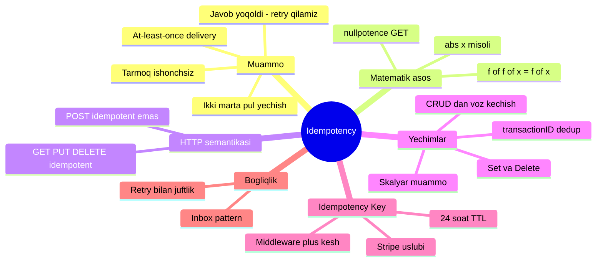
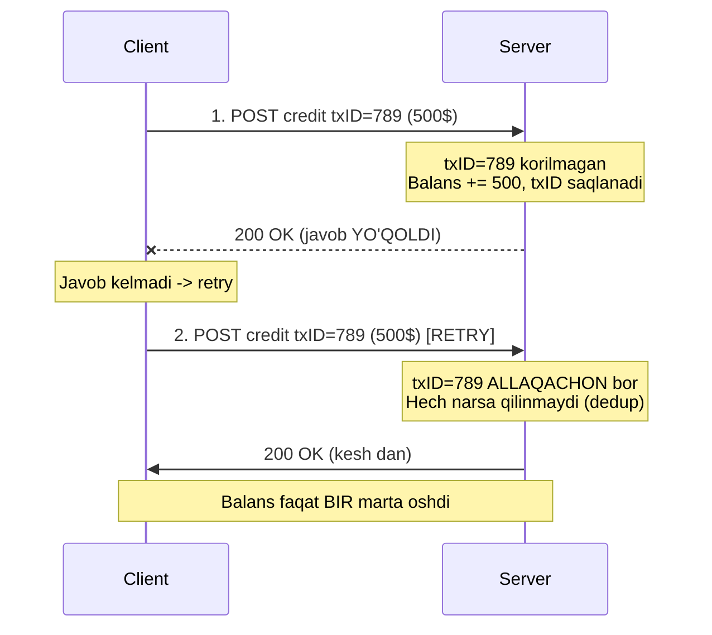

# 6. Idempotency

> **TL;DR:** Idempotent operatsiya — bu **bir marta ham, ming marta ham bajarilsa, natija bir xil** bo'ladigan operatsiya. Cloud'da tarmoq ishonchsiz: so'rov yo'qolishi, javob kechikishi mumkin, shuning uchun retry (qayta urinish) muqarrar. Operatsiyani idempotent qilsang — bir xabarni ikki marta yuborsang ham hech narsa buzilmaydi, ya'ni **retry xavfsiz** bo'ladi. Bu cloud-native tizimning eng muhim xossalaridan biri.

---

## Bu darsning xaritasi



---

## Muammo — javobi yo'qolgan so'rovni qayta yuborsak nima bo'ladi?

Tasavvur qil: mobil ilova bank server'iga so'rov yubordi — "12345 hisobga 500 dollar qo'sh". Server so'rovni qabul qildi, hisobni yangiladi, `200 OK` javobini jo'natdi. Lekin javob **yo'lda yo'qoldi** — Wi-Fi uzildi, paket yetib kelmadi.

Ilova endi nima qiladi? U javob olmadi, shuning uchun tabiiy ravishda **qayta uradi** (retry). Server ikkinchi so'rovni ham qabul qiladi va hisobga **yana 500 dollar** qo'shadi. Foydalanuvchi bir marta pul tashladi — hisobda 1000 dollar paydo bo'ldi. Bank buni yoqtirmaydi.

> **Kitobdan (Cloud Native Go, Titmus):** "Xabar yuborib javob olmasangiz, sababini bilolmaysiz. Xabar yo'lda yo'qoldimi? Adresat xabarni oldi-yu, javob yo'lda yo'qoldimi? Yoki hammasi joyida-yu, shunchaki borib-kelish vaqti odatdagidan ko'proqmi? Yagona chora — xabarni qayta yuborish. Lekin barmoq bukib omadga umid qilish yetarli emas: bu muqarrarlikni oldindan rejalashtirib, funksiyalarni idempotent qilib loyihalab, qayta yuborishni xavfsiz qilish kerak."

Muammoning ildizi — **at-least-once delivery** (kamida-bir-marta yetkazish). Ishonchsiz tarmoqda tizim xabar **kamida bir marta** yetib borishini kafolatlashi mumkin, lekin **aynan bir marta** (exactly-once) yetkazishni kafolatlay olmaydi. Demak dublikatlar muqarrar — savol faqat shundaki, tizim ularga tayyor bo'ladimi yo'qmi.

Bu muammo `2. Retry.md` bilan chambarchas bog'liq: retry chidamlilikni oshiradi, lekin faqat operatsiya idempotent bo'lsagina xavfsiz. Idempotentliksiz retry — bu falokat generatori.

---

## Mohiyati — lift tugmasi analogiyasi

Lift tugmasini bir marta bosasan — lift chaqiriladi. Yana besh marta bossang — hech narsa o'zgarmaydi, lift baribir bitta marta keladi. Tugma **idempotent**: "lift chaqirilgan" holati bir xil bo'lib qolaveradi, necha marta bosishing muhim emas.

Endi buni **noidempotent** narsa bilan solishtir: bankomatda "500 dollar yech" tugmasi. Har bosishda yangi 500 dollar chiqadi. Bu — `x += 1` kabi: har chaqiriq yangi holat yaratadi.

> **Oltin qoida:** Idempotent operatsiya **holatni belgilaydi** ("hisob balansi 1000 bo'lsin"), noidempotent operatsiya **holatni o'zgartiradi** ("hisobga 500 qo'sh"). Birinchisini xavfsiz takrorlash mumkin, ikkinchisini yo'q.

**Analogiya chegarasi:** lift tugmasi analogiyasi "natija bir xil" g'oyasini yaxshi ko'rsatadi, lekin chalkashtirmaslik kerak — idempotentlik "hech narsa qilmaydi" degani emas. Birinchi chaqiriq **holatni o'zgartiradi** (lift chaqiriladi), keyingilari esa holatni o'zgartirmaydi. "Umuman ta'sir qilmaslik" — bu boshqa, aloqador xossa: **nullpotence**.

### Nullpotence — idempotentlikning qarindoshi

Ba'zi operatsiyalar umuman **hech qanday side effect** (yon ta'sir) qilmaydi. Masalan, `x = x` o'zgaruvchiga o'zini tayinlash yoki HTTP `GET` — shunchaki o'qish. Bular nafaqat idempotent, balki **nullpotent**: holatni umuman o'zgartirmaydi.

| Operatsiya | Idempotentmi? | Nullpotentmi? | Sababi |
|-----------|--------------|--------------|--------|
| `x = 1` | Ha | Yo'q | Holatni o'zgartiradi, lekin takror o'zgartirmaydi |
| `x = x` | Ha | Ha | Holat umuman o'zgarmaydi |
| `x += 1` | Yo'q | Yo'q | Har chaqiriq yangi holat yaratadi |
| HTTP `GET` | Ha | Ha | Faqat o'qiydi |
| HTTP `PUT` | Ha | Yo'q | Resursni o'rnatadi (takror bir xil natija) |
| HTTP `POST` | Yo'q | Yo'q | Har chaqiriq yangi resurs yaratadi |

### Matematik ta'rif

Idempotentlik tushunchasi algebradan kelib chiqqan. Sof matematik tilda: funksiya idempotent deyiladi, agar barcha `x` uchun

```
f(f(x)) = f(x)
```

Ya'ni funksiyani natijaning ustidan yana bir marta qo'llasang — natija o'zgarmaydi. Masalan, absolyut qiymat `abs(x)` — idempotent funksiya, chunki har qanday `x` uchun `abs(x) = abs(abs(x))`. Bir marta manfiylikni olib tashlaganingdan keyin, yana necha marta qo'llasang ham qiymat o'zgarmaydi.

---

## Qanday ishlaydi

Idempotentlikning ikki asosiy manbai bor. Birinchisi — **operatsiyaning tabiati** (masalan `PUT` yoki `Set`, ya'ni holatni belgilash). Ikkinchisi — **dedup** (deduplication, dublikatlarni aniqlab tashlash) `transactionID` yoki `Idempotency-Key` orqali, agar operatsiyaning o'zi tabiatan idempotent bo'lmasa (masalan pul qo'shish).



Diagrammadagi asosiy g'oya: server har so'rovga yagona `txID` (yoki idempotency key) berkitadi. Birinchi so'rovda operatsiya bajariladi va `txID` "ko'rilganlar" ro'yxatiga yoziladi. Retry kelganda server `txID` allaqachon ro'yxatda ekanini ko'rib, operatsiyani **qaytadan bajarmaydi**, balki avvalgi natijani qaytaradi.

---

## Go implementatsiyasi

### 1-qadam: noidempotent CRUD — muammoni ko'ramiz

Kitobda oddiy key/value store misolida CRUD (create, read, update, delete) usulini idempotent bo'lmagan tarzda yozamiz:

```go
// --- YOMON: CRUD - noidempotent ---
var store = make(map[string]string)

func Create(key, value string) error {
    // Kalit allaqachon bor bo'lsa - xatolik
    if _, ok := store[key]; ok {
        return errors.New("duplicate key")
    }
    store[key] = value
    return nil
}

func Update(key, value string) error {
    // Kalit yo'q bo'lsa - xatolik
    if _, ok := store[key]; !ok {
        return errors.New("no such key")
    }
    store[key] = value
    return nil
}
```

**Muammo:** Agar `Create` chaqirig'ini retry qilsang, ikkinchi urinish `duplicate key` xatolik qaytaradi — garchi birinchi urinish aslida muvaffaqiyatli o'tgan bo'lsa ham. Client "xatolik" deb o'ylab chalkashadi. Bundan tashqari, har chaqiriqda `if _, ok := store[key]` tekshiruvi bor — bu ortiqcha, murakkab logika.

### 2-qadam: idempotent versiya — Set va Delete

```go
// --- YAXSHI: idempotent ---
var store = make(map[string]string)

// Set - "create" va "update" ni birlashtiradi.
// Necha marta chaqirsang ham natija bir xil.
func Set(key, value string) {
    store[key] = value
}

// Delete - kalit yo'q bo'lsa ham xatolik bermaydi.
// Ikki marta o'chirsang - baribir "o'chirilgan" holati.
func Delete(key string) {
    delete(store, key)
}
```

Bu versiya bir necha jihatdan yaxshiroq. **Birinchidan**, alohida "create" va "update" kerak emas — bittasi (`Set`) yetarli. **Ikkinchidan**, holatni oldindan tekshirish yo'q, shuning uchun kod qisqa. **Uchinchidan**, eng muhimi — retry xavfsiz: `Set` va `Delete` bir necha marta bir xil parametr bilan chaqirilsa, natija doim bir xil.

**Notional machine (ichida nima bo'layapti):** `store` — bu xotiradagi hash-jadval (`map`). `store[key] = value` operatsiyasi kalitga mos katakni qidiradi va qiymatni **ustidan yozadi** (overwrite). Katakda avval nima bo'lganidan qat'i nazar, yakuniy holat bir xil — shuning uchun idempotent. `delete(store, key)` esa katakni olib tashlaydi; katak allaqachon yo'q bo'lsa, hech narsa qilmaydi va panika ham chiqarmaydi.

### 3-qadam: HTTP `PUT` handler — idempotentlik amalda

```go
// PUT /key/{key} - resursni o'rnatadi (idempotent)
func keyValuePutHandler(w http.ResponseWriter, r *http.Request) {
    key := mux.Vars(r)["key"]

    value, err := io.ReadAll(r.Body)
    if err != nil {
        http.Error(w, err.Error(), http.StatusInternalServerError)
        return
    }

    Set(key, string(value)) // idempotent - retry xavfsiz
    w.WriteHeader(http.StatusCreated)
}
```

`PUT` — HTTP semantikasi bo'yicha idempotent metod. Client bu endpoint'ga so'rovni xohlagancha qayta yuborishi mumkin — server holati bir xil bo'lib qolaveradi. Aynan shuning uchun `PUT` cloud API'lar uchun `POST`'dan ko'ra afzalroq.

### 4-qadam: skalyar operatsiyalar muammosi va yechimi

`Set`/`Delete` "bor yoki yo'q" tipidagi operatsiyalar uchun oson. Lekin **skalyar operatsiya** — masalan "hisobga 500 dollar qo'sh" — bilan nima qilamiz? Uni takrorlash har safar yangi 500 dollar qo'shadi. Yechim — har tranzaksiyaga yagona `transactionID` berish va uni eslab qolish:

```go
// --- transactionID orqali dedup ---
type Ledger struct {
    mu       sync.Mutex
    balances map[int]int  // accountID -> balans
    seen     map[int]bool // transactionID -> bajarilganmi
}

func (l *Ledger) Credit(accountID, amount, txID int) {
    l.mu.Lock()
    defer l.mu.Unlock()

    // Bu tranzaksiya allaqachon bajarilganmi? -> chiqib ket
    if l.seen[txID] {
        return // idempotent: dublikatni jimgina tashlaymiz
    }

    l.balances[accountID] += amount
    l.seen[txID] = true // txID ni "korilganlar" ga yozamiz
}
```

Endi client JSON payload'ida `transactionID` yuboradi:

```json
{ "credit": { "accountID": 12345, "amount": 500, "transactionID": 789 } }
```

Retry kelganda `txID=789` allaqachon `seen` da bo'ladi, shuning uchun `Credit` hech narsa qilmaydi. **Balans faqat bir marta oshadi.** Idempotentlikka erishildi.

> **Diqqat — notional machine:** `sync.Mutex` bu yerda majburiy. Agar ikki retry **bir vaqtda** kelsa (concurrent), ikkalasi ham `if l.seen[txID]` tekshiruvidan `false` bilan o'tib, balansni ikki marta oshirishi mumkin edi — bu **race condition**. Mutex "faqat bitta goroutine bir vaqtda kirsin" deb kafolatlaydi, shuning uchun tekshiruv va yozish **atomik** bo'ladi.

### 5-qadam: Stripe uslubidagi Idempotency-Key middleware

Har bir biznes operatsiyasiga `transactionID` qo'shish o'rniga, uni **umumiy middleware** darajasida hal qilish mumkin. Bu — Stripe'ning mashhur yondashuvi: client `Idempotency-Key` header yuboradi, server esa har kalit bo'yicha **birinchi javobni keshlaydi** va keyingi bir xil kalitli so'rovlarga o'sha keshlangan javobni qaytaradi.

```go
type cachedResult struct {
    status int
    body   []byte
}

type IdempotencyStore struct {
    mu      sync.Mutex
    entries map[string]cachedResult // Idempotency-Key -> javob
}

func (s *IdempotencyStore) Middleware(next http.Handler) http.Handler {
    return http.HandlerFunc(func(w http.ResponseWriter, r *http.Request) {
        // --- 1-qadam: kalitni olamiz; yo'q bo'lsa oddiy o'tkazamiz ---
        key := r.Header.Get("Idempotency-Key")
        if key == "" {
            next.ServeHTTP(w, r)
            return
        }

        // --- 2-qadam: kalit allaqachon keshda bormi? -> keshdan qaytaramiz ---
        s.mu.Lock()
        if res, ok := s.entries[key]; ok {
            s.mu.Unlock()
            w.WriteHeader(res.status)
            _, _ = w.Write(res.body)
            return
        }
        s.mu.Unlock()

        // --- 3-qadam: birinchi marta - javobni "yozib olamiz" ---
        rec := httptest.NewRecorder()
        next.ServeHTTP(rec, r)

        // --- 4-qadam: natijani keshga saqlab, clientga qaytaramiz ---
        s.mu.Lock()
        s.entries[key] = cachedResult{status: rec.Code, body: rec.Body.Bytes()}
        s.mu.Unlock()

        w.WriteHeader(rec.Code)
        _, _ = w.Write(rec.Body.Bytes())
    })
}
```

**Qanday ishlaydi:** `httptest.NewRecorder()` — bu "soxta" `ResponseWriter`, u haqiqiy javobni clientga yubormasdan **xotirada ushlab turadi**. Handler unga yozadi, biz esa yozilgan `status` va `body` ni keshga saqlaymiz, so'ng haqiqiy `w` ga ko'chiramiz. Retry kelganda handler **umuman ishga tushmaydi** — javob to'g'ridan-to'g'ri keshdan chiqadi.

> 🤔 **O'ylab ko'r:** Agar kesh (`entries` map) hech qachon tozalanmasa, uzoq ishlaydigan server'da nima bo'ladi?

<details>
<summary>💡 Javobni ko'rish</summary>

**Memory leak** — xotira sizib ketishi. Har yangi `Idempotency-Key` map'ga qo'shilaveradi va hech qachon o'chmaydi, natijada map cheksiz o'sib, server xotirasini tugatadi. Shuning uchun Stripe kalitlarni **24 soatdan keyin avtomatik o'chiradi** (TTL). Production'da bu keshni Redis kabi tashqi store'da TTL bilan saqlash yoki LRU cache ishlatish kerak. Bunda yana bir bonus: bir necha server nusxasi keshni **birgalikda ishlatadi**, aks holda har nusxa o'z keshiga ega bo'lib, load balancer so'rovni boshqa nusxaga yo'naltirsa dedup ishlamaydi.
</details>

---

## Real dunyoda

**Stripe idempotency keys.** Stripe API'da har `POST` so'roviga `Idempotency-Key` header qo'shish mumkin (odatda **V4 UUID**). Stripe birinchi so'rovning **status kodi va body**'sini saqlaydi va bir xil kalitli keyingi so'rovlarga aynan o'sha natijani qaytaradi — hatto `500` xatolikni ham. Kalitlar **24 soatdan keyin** o'chiriladi. `GET` va `DELETE` uchun kalit kerak emas, chunki ular allaqachon idempotent. Muhim nuqta: Stripe natijani faqat **endpoint bajarila boshlaganidan keyin** keshlaydi — validatsiya xatosi bo'lsa keshlamaydi, ya'ni bunday so'rovni xavfsiz retry qilish mumkin.

**HTTP/REST standarti.** Idempotentlik g'oyasi 1997-yilda HTTP/1.1 standartida (RFC 2068, mualliflari Tim Berners-Lee va Roy Fielding) rasmiylashtirilgan. Standart bo'yicha:

| Metod | Idempotent | Safe (nullpotent) |
|-------|-----------|-------------------|
| GET | Ha | Ha |
| HEAD | Ha | Ha |
| PUT | Ha | Yo'q |
| DELETE | Ha | Yo'q |
| POST | **Yo'q** | Yo'q |
| PATCH | Yo'q (odatda) | Yo'q |

Muhim: HTTP idempotentlikni **kafolatlamaydi** — bu shunchaki kelishuv (convention). Sen `GET`'ni noidempotent qilib yozishing texnik jihatdan mumkin (garchi bu juda yomon g'oya bo'lsa ham). Idempotentlik **frameworkda emas, sening biznes-logikangda** yashaydi.

**Message broker'lar.** Kafka, RabbitMQ, SQS kabi tizimlar deyarli har doim **at-least-once** kafolat beradi — ya'ni xabar dublikat bo'lishi mumkin. Shuning uchun consumer'lar **idempotent** bo'lishi shart. Bu naqsh `../3. Distributed Patterns/2. Outbox - Inbox.md` da chuqur ochilgan: **Inbox pattern** aynan `message_id` bo'yicha dublikatlarni filtrlaydigan idempotent consumer'dir — yuqoridagi `transactionID` dedup g'oyasining aynan o'zi.

**Kubernetes va deploylar.** `kubectl apply` — idempotent: bir xil manifestni necha marta qo'llasang ham, cluster holati bir xil bo'ladi (declarative model). Bu idempotentlikning kuchi: sen "nima bo'lishi kerakligini" aytasan, "qanday qilishni" emas.

---

## Tuzoqlar va anti-patternlar

⚠️ **1. Retry qildim, lekin operatsiya idempotent emas.** Eng ko'p uchraydigan xato. Retry logikasini qo'shib, lekin server tomonini idempotent qilmaslik — bu ikki marta pul yechish, ikki marta buyurtma yaratish demakdir. **To'g'risi:** retry va idempotentlik doim **juftlikda** kelishi kerak (`2. Retry.md` ga qara).

⚠️ **2. `POST`'ni idempotent deb o'ylash.** `POST /orders` har chaqiriqda **yangi buyurtma** yaratadi. Uni retry qilsang — dublikat buyurtmalar. **To'g'risi:** yo `PUT` (client ID beradigan) ishlat, yo `Idempotency-Key` qo'sh.

⚠️ **3. Dedup keshini TTL'siz qoldirish.** `seen` yoki `entries` map cheksiz o'sib, memory leak keltirib chiqaradi. **To'g'risi:** TTL yoki LRU eviction qo'y; production'da Redis kabi tashqi keshda saqla.

⚠️ **4. Concurrent retry'da race condition.** Ikki dublikat bir vaqtda kelsa, "ko'rdimmi?" tekshiruvi va "bajarish" atomik bo'lmasa, ikkalasi ham o'tib ketadi. **To'g'risi:** `sync.Mutex`, DB'da `UNIQUE` constraint yoki `INSERT ... ON CONFLICT DO NOTHING` ishlat.

⚠️ **5. Idempotency key'ni tanadan (payload) hosil qilish.** Ba'zilar kalitni so'rov tanasining hash'idan yasaydi. Muammo: bir xil summa bilan **ikkita alohida** to'lov (masalan ikki kunlik obuna) bir xil hash olib, ikkinchisi "dublikat" deb rad etiladi. **To'g'risi:** kalitni **client** har yangi mantiqiy operatsiya uchun yangi UUID sifatida generatsiya qilsin.

---

## Bog'liq patternlar

| Pattern | Aloqasi | Link |
|---------|---------|------|
| Retry | Retry idempotentliksiz xavfli; ikkalasi doim juftlikda ishlaydi | [Retry](2.%20Retry.md) |
| Outbox / Inbox | Inbox = `message_id` bo'yicha dedup qiluvchi idempotent consumer | [Outbox - Inbox](../3.%20Distributed%20Patterns/2.%20Outbox%20-%20Inbox.md) |
| Resilience | Idempotentlik — cloud chidamlilikning asosiy poydevorlaridan biri | [Resilience](../1.%20Cloud%20Native%20App/4.%20Resilience.md) |
| Circuit Breaker | Retry + circuit breaker + idempotency birgalikda retry storm'ni oldini oladi | [Circuit Breaker](3.%20Circuit%20Breaker.md) |

---

## Interview savollari

**1. Idempotentlik nima va nima uchun cloud'da muhim?**

<details>
<summary>Javob</summary>

Idempotent operatsiya — bir marta ham, ko'p marta ham bajarilsa natijasi bir xil bo'ladigan operatsiya (`f(f(x)) = f(x)`). Cloud'da muhim, chunki tarmoq ishonchsiz: so'rov yoki javob yo'qolishi mumkin va client majburan retry qiladi (at-least-once delivery). Operatsiya idempotent bo'lsa, retry hech narsani buzmaydi — bu tizimni xavfsiz va bashorat qilinadigan qiladi.
</details>

**2. Qaysi HTTP metodlari idempotent, qaysilari yo'q va nega?**

<details>
<summary>Javob</summary>

`GET`, `HEAD`, `PUT`, `DELETE` — idempotent. `GET`/`HEAD` shunchaki o'qiydi (yana nullpotent ham). `PUT` resursni **o'rnatadi** — takror o'rnatsang natija bir xil. `DELETE` — o'chirilgan holat takror o'chirishda o'zgarmaydi. `POST` — idempotent **emas**, chunki har chaqiriqda yangi resurs yaratadi. `PATCH` odatda idempotent emas. Muhim: HTTP buni kafolatlamaydi, bu faqat convention — idempotentlik biznes-logikada ta'minlanadi.
</details>

**3. Idempotentlik va nullpotence orasidagi farq nima?**

<details>
<summary>Javob</summary>

Idempotent operatsiya **birinchi marta holatni o'zgartirishi mumkin**, lekin keyingi takrorlashlar o'zgartirmaydi (masalan `x = 1` yoki `PUT`). Nullpotent operatsiya esa **umuman side effect qilmaydi**, hech qanday holatni o'zgartirmaydi (masalan `x = x` yoki `GET`). Har qanday nullpotent operatsiya idempotent, lekin har idempotent operatsiya nullpotent emas.
</details>

**4. "Hisobga 500 dollar qo'sh" kabi skalyar operatsiyani qanday idempotent qilasan?**

<details>
<summary>Javob</summary>

Operatsiyaning o'zi tabiatan idempotent emas (har chaqiriq yangi holat), shuning uchun **dedup** qo'shamiz: har tranzaksiyaga yagona `transactionID` (yoki `Idempotency-Key`) beramiz. Server bajarilgan `txID`'larni eslab qoladi; retry kelganda `txID` allaqachon ko'rilgan bo'lsa — operatsiyani qaytadan bajarmaydi. Bunda concurrent retry'ga qarshi atomiklik (mutex yoki DB `UNIQUE` constraint) kerak, aks holda race condition yuzaga keladi.
</details>

**5. Stripe idempotency key qanday ishlaydi va natijani qancha vaqt saqlaydi?**

<details>
<summary>Javob</summary>

Client `POST` so'roviga `Idempotency-Key` header (odatda V4 UUID) qo'shadi. Stripe birinchi so'rovning status kodi va body'sini saqlaydi va bir xil kalitli keyingi so'rovlarga aynan o'sha natijani qaytaradi — hatto `500` xatolikni ham. Kalitlar **24 soatdan keyin** avtomatik o'chiriladi. `GET`/`DELETE` uchun kalit kerak emas. Natija faqat endpoint bajarila boshlaganidan keyin keshlanadi — validatsiya xatosida keshlanmaydi.
</details>

---

## Eslab qol

- **Idempotent = takrorga bardosh.** Bir marta ham, ming marta ham bajarilsa natija bir xil: `f(f(x)) = f(x)`.
- **Cloud'da retry muqarrar** (at-least-once delivery), shuning uchun idempotentlik **retry'ni xavfsiz qiladi** — ikkalasi doim juftlikda.
- **HTTP'da GET/PUT/DELETE idempotent, POST emas** — lekin bu faqat convention, kafolatni sen biznes-logikada ta'minlaysan.
- **Tabiatan idempotent operatsiya** (`Set`, `PUT`) — eng oson yo'l; **skalyar operatsiya** (pul qo'shish) uchun `transactionID`/`Idempotency-Key` orqali dedup qil.
- **Dedup keshiga TTL va concurrency himoyasi** shart — aks holda memory leak va race condition.
