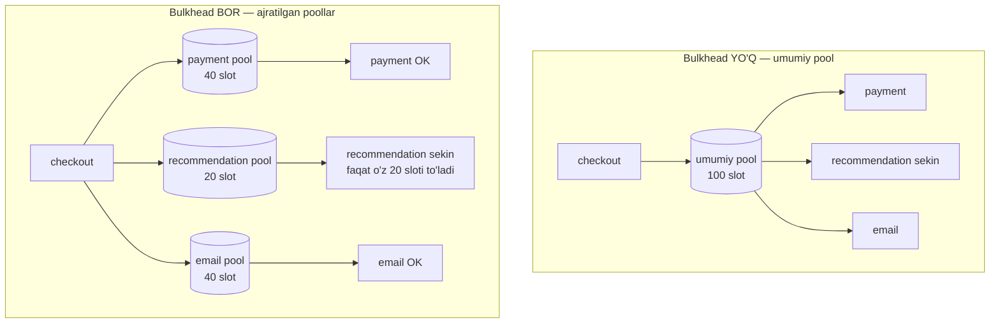

# 7. Bulkhead

> **TL;DR:** Bulkhead — bu resurslarni bir-biridan izolyatsiya qilingan "bo'linmalar"ga ajratish pattern'i. Bitta dependency (bog'liq service) sekinlashsa yoki yiqilsa, faqat o'shanga ajratilgan bo'linma "suvga to'ladi" — connection va goroutine zaxirasi tugaydi. Qolgan bo'linmalar tegilmaydi, tizim ishlashda davom etadi. Maqsad: bitta lokal nosozlik butun servicening barcha resursini yeb qo'yishining oldini olish (cascading failure).

---

## Muammo — bitta sekin dependency butun servicing'ni yiqitadi

Tasavvur qil: `checkout` service uchta downstream'ga murojaat qiladi:

- `payment` — to'lovni amalga oshiradi (kritik),
- `recommendation` — "sizga yoqishi mumkin" ro'yxati (ikkinchi darajali),
- `email` — chek yuboradi (kritik).

Odatda hammasi bitta umumiy resurs zaxirasidan foydalanadi: **bitta HTTP connection pool** va cheklanmagan sonda goroutine. Bir kuni `recommendation` sekinlashadi (latency 50ms dan 30 soniyaga chiqadi — hali *yiqilmagan*, shunchaki sekin).

Nima bo'ladi?

1. Har bir kiruvchi so'rov `recommendation`ni kutayotgan goroutine'ni band qiladi.
2. Goroutine'lar to'planadi, connection pool tugaydi (**resource exhaustion**).
3. Endi `payment` va `email` uchun ham bo'sh connection qolmaydi — garchi ular sog'lom bo'lsa ham.
4. Butun `checkout` javob bermay qoladi. Ikkinchi darajali `recommendation` butun tijoratni to'xtatdi.

Bu — klassik **cascading failure** (zanjirli nosozlik): kitobdagi Amazon DynamoDB voqeasida ham xuddi shu bo'lgan — bir qism yuki qolgan qismga o'tib, butun klaster ketma-ket qulagan.

> **Og'riq:** izolyatsiyasiz — bitta dependency'ning "sekinligi" barcha dependency'larning "yiqilishiga" aylanadi. Resurs umumiy bo'lgani uchun nosozlik erkin tarqaladi.

---

## Mohiyati — Titanic'ning suv o'tkazmas bo'linmalari

Nomning kelib chiqishi kemadan. Kema korpusi ichi **bulkhead** deb ataladigan suv o'tkazmas devorlar bilan bo'linmalarga bo'linadi. Agar korpus bir joydan teshilsa, faqat **o'sha bo'linma** suvga to'ladi — qolganlari quruq qoladi va kema suzishda davom etadi.

Titanic aynan shu tamoyil ustiga qurilgan edi. Lekin u cho'kdi — nega? Chunki bo'linma devorlari **yetarlicha baland emas edi**: suv bir bo'linmadan oshib, ketma-ket keyingisiga quyilgan. Bu — bizga muhim saboq: bulkhead faqat chegaralar to'g'ri o'lchangandagina himoya qiladi. Noto'g'ri sozlangan izolyatsiya — izolyatsiya emas.

Software'da xuddi shunday: har bir dependency uchun **alohida resurs bo'linmasi** ajratamiz — alohida connection pool, alohida goroutine limiti. `recommendation` "teshilsa", faqat uning bo'linmasi to'ladi; `payment` va `email` quruq qoladi.

> Cell-based architecture ham shu g'oyaning kattaroq ko'lami: tizim mustaqil "hujayralar"ga bo'linadi, biri yiqilsa boshqasi ishlaydi.

---

## Qanday ishlaydi

Asosiy g'oya: **umumiy resursni bo'lib tashla**. Ikkita joyda qo'llanadi:

- **Consumer tomonida** (biz kimnidir chaqiruvchimiz) — har dependency uchun alohida pool/semaphore.
- **Service tomonida** (bizni chaqirishadi) — har consumer/tenant uchun alohida instance.



Diagrammadagi asosiy farq: pastki holatda `recommendation` "teshilsa", faqat uning **20 sloti** to'ladi. `payment` va `email` o'z bo'linmasida ishlashda davom etadi. Yuqorida esa bitta teshik butun 100 slotni yutib yuboradi.

### Ikki xil izolyatsiya strategiyasi

| Xususiyat | Thread-pool (Go'da: worker/goroutine pool) | Semaphore |
|-----------|--------------------------------------------|-----------|
| Ish qayerda bajariladi | Alohida goroutine'larda (chaqiruvchidan uzoqda) | Chaqiruvchining o'z goroutine'ida |
| Timeout / uzish | Bor — kutayotgan ishni tashlab ketish mumkin | Yo'q — chaqiruvchi goroutine bloklanib qoladi |
| Overhead | Yuqoriroq (context switch, navbat) | Past (shunchaki hisoblagich) |
| Qachon | Latency o'zgaruvchan, ishonchsiz dependency | Juda tez, ishonchli, in-memory chaqiriqlar |

Netflix Hystrix aynan shu ikki strategiyaga tayanadi. Ular default sifatida **thread-pool** ni tavsiya qiladi, chunki u timeout qo'ya oladi va sekin dependency'dan "voz kechish" imkonini beradi. Semaphore faqat mikro-soniyalik, ishonchli chaqiriqlar uchun.

---

## Go implementatsiyasi

Go'da "thread pool" o'rniga **goroutine** va **channel** ishlatamiz. Eng sodda va idiomatik bulkhead — **buffered channel semaphore**.

### 1) Buffered channel semaphore — concurrency'ni cheklash

Buffered channel'ni "belgilar qutisi" deb tasavvur qil: qutida `N` ta belgi bor. Ishni boshlash uchun belgi olasan, tugatganda qaytarasan. Belgi qolmasa — kutasan. Bu har dependency uchun bir vaqtdagi chaqiriqlar sonini `N` bilan cheklaydi.

```go
// --- 1-qadam: dependency uchun "bo'linma" — sig'imi N bo'lgan semaphore ---
type Bulkhead struct {
    sem chan struct{} // har bir bo'sh joy = bitta ruxsat
}

func NewBulkhead(n int) *Bulkhead {
    return &Bulkhead{sem: make(chan struct{}, n)} // buffered: N ta slot
}

// --- 2-qadam: ish oldidan slot band qilamiz, tugagach bo'shatamiz ---
func (b *Bulkhead) Do(ctx context.Context, fn func() error) error {
    select {
    case b.sem <- struct{}{}: // slot bor — kirdik
        defer func() { <-b.sem }() // defer bilan har doim bo'shatamiz
        return fn()
    case <-ctx.Done(): // slot yo'q va muddat tugadi — kutmay chiqamiz
        return ctx.Err()
    }
}
```

**Notional machine — ostida aslida nima bo'ladi?** `b.sem <- struct{}{}` buffer'ga bitta bo'sh element yozishga urinadi. Buffer to'la bo'lsa (`N` ta chaqiriq allaqachon ishlayapti), bu operatsiya **bloklanadi** — goroutine scheduler tomonidan uxlatiladi. `select` bizga ikkinchi variant beradi: `ctx.Done()` yopilsa (timeout/cancel), kutishni tashlab, `context.DeadlineExceeded` qaytaramiz. `struct{}{}` — nol baytli tur, xotira sarflamaydi; bizga faqat *sanash* kerak, qiymat emas.

> O'ylab ko'r: Agar `defer func() { <-b.sem }()` qatorini olib tashlasak, uzoq muddatda nima bo'ladi?

<details>
<summary>Javobni ko'rish</summary>

Slot hech qachon qaytarilmaydi. Har muvaffaqiyatli chaqiriqdan keyin buffer'da bitta bo'sh joy kamayadi. `N` ta chaqiriqdan so'ng buffer butunlay to'ladi va **hamma keyingi chaqiriq abadiy bloklanadi** (yoki timeout bilan qaytadi). Bu — semaphore leak. `defer` shuning uchun kritik: panic bo'lsa ham slot qaytariladi.
</details>

### 2) Har dependency uchun ajratilgan `http.Client`

Semaphore chaqiriqlar *sonini* cheklaydi, lekin TCP connection'lar ham umumiy resurs. Standart `http.DefaultClient` — bitta umumiy pool. To'g'ri bulkhead uchun **har dependency'ga alohida `http.Client`** (demak alohida connection pool) beramiz:

```go
// --- Har dependency uchun alohida Transport = alohida connection pool ---
func newClient(maxConns int) *http.Client {
    return &http.Client{
        Timeout: 3 * time.Second, // Timeout pattern bilan birga
        Transport: &http.Transport{
            MaxConnsPerHost:     maxConns, // shu host'ga jami connection cheki
            MaxIdleConnsPerHost: maxConns,
        },
    }
}

var (
    paymentClient = newClient(40) // payment o'z 40 ta connection'i bilan
    recClient     = newClient(20) // recommendation alohida 20 ta bilan
)
```

Endi `recommendation` sekinlashib o'z 20 ta connection'ini band qilsa ham, `paymentClient` ning 40 ta connection'i tegilmaydi. Ikki mustaqil bo'linma.

### 3) Ikkalasini birlashtirish

Amaliyotda semaphore (concurrency cheki) + alohida `http.Client` (connection cheki) birga ishlatiladi:

```go
// --- payment bo'linmasi: 40 slotli semaphore + 40 connectionli client ---
var paymentBulkhead = NewBulkhead(40)

func CallPayment(ctx context.Context, body io.Reader) (*http.Response, error) {
    var resp *http.Response
    err := paymentBulkhead.Do(ctx, func() error {
        req, _ := http.NewRequestWithContext(ctx, "POST", paymentURL, body)
        r, err := paymentClient.Do(req)
        resp = r
        return err
    })
    return resp, err
}
```

Output (recommendation yiqilgan, payment sog'lom holatda):

```text
2026/07/08 12:00:01 recommendation: context deadline exceeded (bo'linma to'la)
2026/07/08 12:00:01 payment: 200 OK        <- payment tegilmadi
2026/07/08 12:00:02 recommendation: context deadline exceeded
2026/07/08 12:00:02 payment: 200 OK        <- checkout ishlashda davom etadi
```

Diqqat: `recommendation` xatosini `checkout` **yutib**, bo'sh ro'yxat bilan davom etishi kerak (graceful degradation) — pattern faqat izolyatsiya qiladi, qarorni sen qabul qilasan.

---

## Real dunyoda

**Kutubxonalar / freymvorklar:**

- **Netflix Hystrix** (Java) — bulkhead'ning eng mashhur amaliyoti; har dependency uchun alohida thread pool (odatda 5–20 threaddan 40+ pool). Kuniga 10+ mlrd chaqiriqni shu izolyatsiya bilan boshqargan.
- **resilience4j** (Java), **Polly** (.NET) — thread-pool va semaphore bulkhead'larni tayyor beradi.
- Go'da alohida "bulkhead" kutubxonasi kam kerak — `chan struct{}` semaphore va `golang.org/x/sync/semaphore.Weighted` idiomatik yechim.

**Kubernetes — bu ham bulkhead:**

Bulkhead faqat kod emas, ko'pincha infratuzilma darajasida amalga oshiriladi:

| Mexanizm | Qanday izolyatsiya beradi |
|----------|---------------------------|
| **resource requests/limits** | Har pod o'z CPU/memory chegarasida; biri "ochko'zlik" qilsa boshqa podlarni ochlikda qoldirmaydi |
| **Namespace + ResourceQuota** | Bir team/muhit boshqasining resursini yeb qo'ymaydi |
| **Pod anti-affinity** | Bir servicening replikalarini turli node'larga tarqatadi — bitta node yiqilsa hammasi ketmaydi |
| **Alohida node pool / cluster** | Kritik ish yuki (payment) va batch ishlarni jismonan ajratish |

Azure hujjatidagi eng oddiy misol — podni o'z resurs chegarasi bilan izolyatsiya qilish:

```yaml
apiVersion: v1
kind: Pod
metadata:
  name: drone-management
spec:
  containers:
  - name: drone-management-container
    image: drone-service
    resources:
      requests:
        memory: "64Mi"
        cpu: "250m"
      limits:              # <- bu limit = bulkhead devori
        memory: "128Mi"
        cpu: "1"
```

**Circuit Breaker bilan birga.** Bulkhead va Circuit Breaker bir-birini to'ldiradi:

- **Bulkhead** — nosozlikni *ushlab turadi*: sekin dependency faqat o'z bo'linmasini to'ldiradi.
- **Circuit Breaker** — nosozlikni *to'xtatadi*: dependency yiqilganini sezib, chaqiriqlarni umuman yubormay tez xato qaytaradi va unga tiklanishga vaqt beradi.

Ideal zanjir: `Timeout` -> `Retry` -> `Circuit Breaker`, hammasini `Bulkhead` bilan o'rab. Batafsil: [3. Circuit Breaker](3.%20Circuit%20Breaker.md).

---

## Tuzoqlar va anti-patternlar

- **Pool o'lchamini noto'g'ri sozlash.** Juda kichik — throughput bo'g'iladi (sog'lom paytda ham so'rovlar kutadi). Juda katta — izolyatsiya yo'qoladi (bo'linma butun mashina resursini yeydi, Titanic'dagi past devor). O'lchamni yuk testi bilan tanla, taxmin bilan emas.
- **Yashirin umumiy resurs.** Ikki bo'linmani ajratdim deb o'ylaysan, lekin ular baribir **bitta DB**, **bitta CPU** yoki **bitta downstream** ga tayanadi. Bu — *fault masking*: izolyatsiya soxta, nosozlik baribir tarqaladi.
- **Semaphore bulkhead'dan timeout kutish.** Semaphore chaqiruvchi goroutine'ni *bloklaydi* — u timeout bermaydi. Timeout kerak bo'lsa, `context` bilan `select` ishlat (yuqoridagi kod) yoki thread-pool uslubiga o't.
- **Over-partitioning.** Har mayda funksiyaga alohida bo'linma — resurs isrofi va boshqaruv murakkabligi. Bo'linmalarni biznes chegaralari (bounded context) bo'yicha ajrat, har HTTP endpoint uchun emas.
- **Monitoringsiz bulkhead.** Har bo'linmaning to'lish darajasini (rejection soni, kutish vaqti) o'lchamasang, teshikni sezmaysan. Fault masking aynan shu yerdan boshlanadi.
- **Ikki joyda takrorlash.** Izolyatsiyani ham kodda, ham infra'da (Envoy/Istio, K8s limits) qo'ysang — chegaralar bir-biriga urishadi. Bittasini tanla.

---

## Bog'liq patternlar

| Pattern | Aloqasi | Link |
|---------|---------|------|
| Circuit Breaker | Bulkhead nosozlikni ushlab turadi, CB uni to'xtatadi — birga ishlatiladi | [3. Circuit Breaker](3.%20Circuit%20Breaker.md) |
| Timeout | Bulkhead slotini tez bo'shatish uchun har chaqiriqda timeout shart | [1. Timeout](1.%20Timeout.md) |
| Retry | Retry bulkhead bo'linmasini tez to'ldirib yuborishi mumkin — ehtiyot bo'l | [2. Retry](2.%20Retry.md) |
| Throttle / Rate Limiting | Kiruvchi oqimni cheklaydi; bulkhead resursni bo'ladi — birgalikda overload'ni to'sadi | [5. Throttle / Rate Limiting](5.%20Throttle%20-%20Rate%20Limiting.md) |
| Load Shedding | Bo'linma to'lganda ortiqcha yukni tashlab yuborish | [Backpressure - Load Shedding](../3.%20Distributed%20Patterns/8.%20Backpressure%20-%20Load%20Shedding.md) |
| Resilience (atribut) | Bulkhead — Resilience atributini amalga oshiruvchi asboblardan biri | [4. Resilience](../1.%20Cloud%20Native%20App/4.%20Resilience.md) |

---

## Interview savollari

**1. Bulkhead qanday muammoni hal qiladi va nega Circuit Breaker'ning o'zi yetarli emas?**

<details>
<summary>Javob</summary>

Bulkhead **resource exhaustion orqali tarqaladigan cascading failure**'ni hal qiladi: sekin dependency umumiy pool'ni band qilib, sog'lom dependency'larni ham ishdan chiqaradi. Circuit Breaker faqat *yiqilgan* (xato qaytaradigan) dependency'ni sezadi. Ammo dependency **yiqilmasdan, shunchaki sekinlashsa**, CB ochilmasligi mumkin — chaqiriqlar hali "muvaffaqiyatli", faqat 30 soniya kutadi. Ana shu paytda goroutine/connection zaxirasi tugaydi. Bulkhead aynan shu holatni ushlaydi: bo'linma to'ladi, lekin faqat o'zi. Shuning uchun ikkalasi birga ishlatiladi.
</details>

**2. Thread-pool bulkhead bilan semaphore bulkhead o'rtasidagi farq nima? Qachon qaysi birini tanlaysan?**

<details>
<summary>Javob</summary>

**Semaphore** — shunchaki hisoblagich; ish chaqiruvchining o'z goroutine'ida bajariladi. Overhead past, lekin **timeout bera olmaydi** — chaqiruvchi bloklanadi. In-memory yoki mikro-soniyalik, ishonchli chaqiriqlar uchun. **Thread-pool** (Go'da alohida worker goroutine'lar) — ish boshqa goroutine'da bajariladi, shuning uchun **timeout qo'yish va sekin ishni tashlab ketish mumkin**; evaziga context switch overhead'i bor. O'zgaruvchan latency'li, ishonchsiz tarmoq dependency'lari uchun thread-pool (Netflix'ning default tanlovi).
</details>

**3. Go'da `chan struct{}` orqali semaphore qanday ishlaydi va nega `struct{}` ishlatiladi?**

<details>
<summary>Javob</summary>

Sig'imi `N` bo'lgan **buffered channel** yaratamiz. Slot band qilish — buffer'ga yozish (`sem <- struct{}{}`), bo'shatish — o'qish (`<-sem`). Buffer to'lsa, yozish bloklanadi — bu bir vaqtdagi ishlar sonini `N` bilan cheklaydi. `struct{}` — **nol baytli tur**: bizga qiymat emas, faqat *sanash* kerak, shuning uchun xotira sarflamaydigan bo'sh tur eng to'g'ri tanlov. `select` bilan `ctx.Done()` qo'shsak, kutishni ham uza olamiz.
</details>

**4. "Ikki bo'linmani ajratdim" desam ham nosozlik baribir tarqaldi. Sabab nima bo'lishi mumkin?**

<details>
<summary>Javob</summary>

Katta ehtimol **yashirin umumiy resurs** bor: ikki bo'linma alohida connection pool'ga ega bo'lsa ham, ikkalasi **bir xil DB**, **bir xil downstream service** yoki **bir xil CPU/xotira** ga tayanadi. Izolyatsiya faqat *yuqori* qatlamda, *pastki* qatlamda umumiy resurs qolgan. Bu — fault masking. Yechim: izolyatsiyani butun zanjir bo'ylab kuzat va har bo'linmaning to'lish metrikalarini monitoring qil.
</details>

**5. Kubernetes'da bulkhead qanday amalga oshiriladi (kod yozmasdan)?**

<details>
<summary>Javob</summary>

Bir necha darajada: (1) **resource requests/limits** — har pod o'z CPU/memory chegarasida, biri boshqasini ochlikda qoldirmaydi; (2) **Namespace + ResourceQuota** — team/muhitlar orasida izolyatsiya; (3) **pod anti-affinity** — replikalarni turli node'larga tarqatish; (4) **alohida node pool yoki cluster** — kritik va batch ish yuklarini jismonan ajratish. Azure tavsiyasi: platformaning tayyor izolyatsiya mexanizmlaridan foydalan, ularni kodda qayta yozma.
</details>

---

## Eslab qol

- **Bulkhead = suv o'tkazmas bo'linma.** Bitta teshik faqat o'z bo'linmasini to'ldiradi, kema (tizim) suzishda davom etadi.
- **Muammo — resource exhaustion.** Umumiy pool bo'lsa, bitta sekin dependency barcha goroutine/connection'ni band qilib, sog'lomlarini ham yiqitadi.
- **Go'da eng sodda bulkhead — buffered `chan struct{}` semaphore** + har dependency uchun alohida `http.Client` (alohida connection pool).
- **Thread-pool timeout beradi, semaphore bermaydi.** O'zgaruvchan latency uchun thread-pool, mikro-tez chaqiriq uchun semaphore.
- **Kubernetes'da bulkhead = resource limits + namespace quota + anti-affinity.** Faqat kod emas, ko'pincha infra darajasida.
- **Circuit Breaker bilan juftlik.** Bulkhead ushlaydi, CB to'xtatadi — sekinlik va yiqilishni birga qoplaydi.
- **Chegara o'lchami hal qiladi.** Noto'g'ri o'lchangan bo'linma — Titanic'ning past devori kabi foydasiz.
