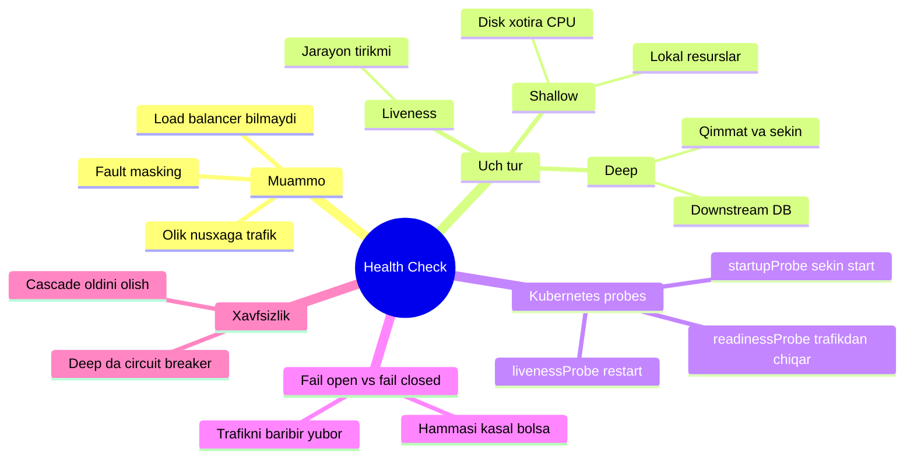
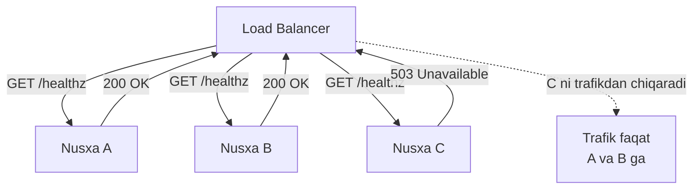
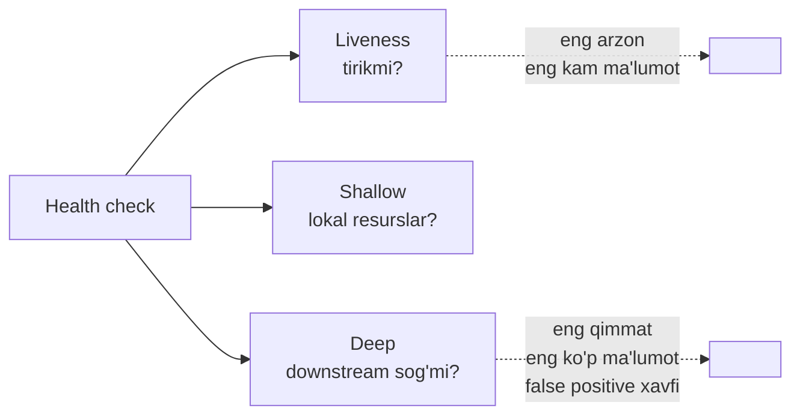
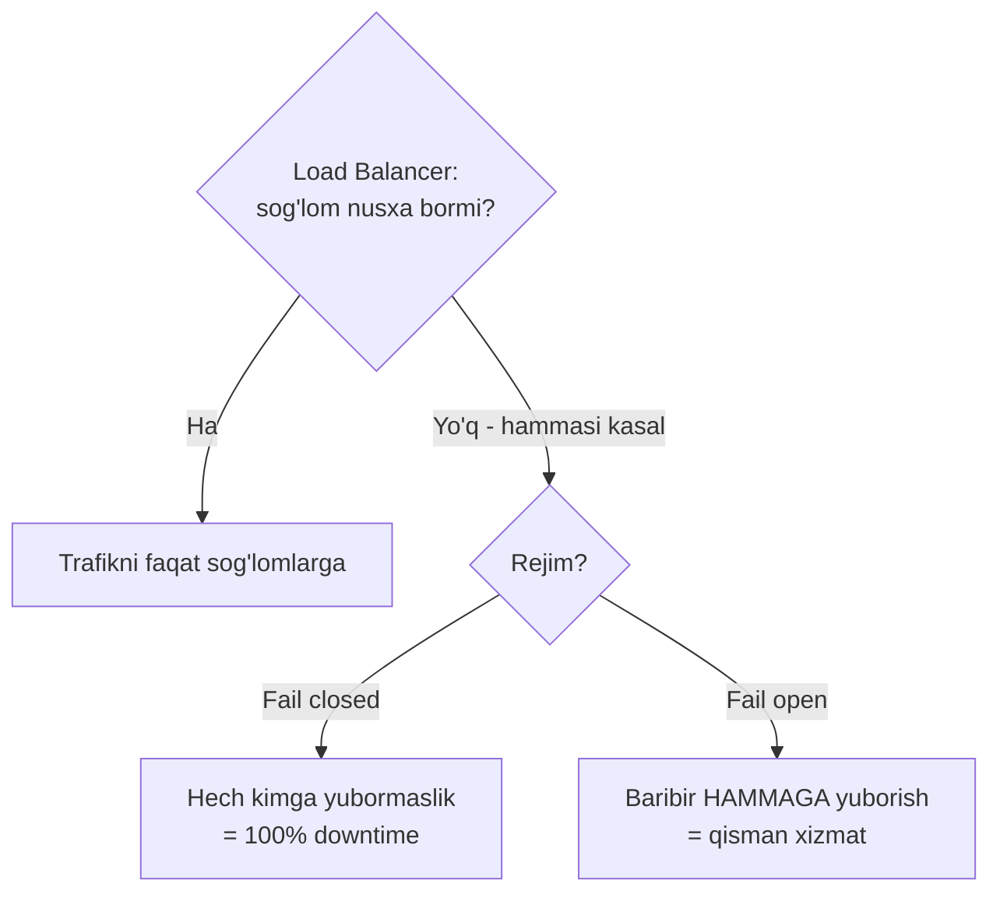

# 8. Health Check

> **TL;DR:** Health check — bu servisning "sog'mi yoki kasal" ekanini so'rab bilish uchun ochiladigan maxsus endpoint (masalan `/healthz`). Load balancer, monitoring va service registry undan foydalanib, o'lik nusxaga trafik yubormaydi. Uch turi bor: **liveness** (jarayon tirikmi?), **shallow** (o'zi ishlay oladimi — disk, xotira?), **deep** (bog'liqliklari sog'mi — DB, downstream?). Har biri sezgirlik va aniqlik o'rtasida boshqa muvozanat tanlaydi.

---

## Bu darsning xaritasi



---

## Muammo — load balancer o'lik nusxaga trafik yuborsa nima bo'ladi?

Chidamlilik uchun biz servisni bir necha nusxada (replica) ishga tushiramiz va oldiga **load balancer** qo'yamiz — u trafikni nusxalar orasida taqsimlaydi. Yaxshi. Lekin bitta nusxa qulasa — jarayon o'ldi, DB ulanishi uzildi, yoki deadlock bo'ldi — nima bo'ladi?

Load balancer buni **bilmaydi**. U trafikning uchdan bir qismini hamon o'lik nusxaga yuboraveradi. Foydalanuvchilarning uchdan biri xatolik oladi, garchi ikki sog'lom nusxa bekor turgan bo'lsa ham. Load balancerga "bu nusxa kasal, unga yuborma" deb aytadigan **mexanizm** kerak.

> **Kitobdan (Cloud Native Go, Titmus):** "Servisning bir necha nusxasi bo'lishi load balancing mexanizmini nazarda tutadi... lekin servis nusxasi ishdan chiqsa nima bo'ladi? Tabiiyki, bu holda load balancer trafikni eski yo'l bilan yubormasligi kerak. Buni qanday tashkil qilamiz? Health check ishlatib."

Yana bir yashirin xavf — **fault masking** (nosozlikni niqoblash). Uch nusxadan biri jimgina qulaydi, qolgan ikkitasi uning ishini "yashirin" ko'tarib ketadi. Sen hech narsani sezmaysan. Lekin himoya zaxirasi (redundancy) allaqachon yo'qolgan — yana bittasi qulasa, tizim to'satdan va falokatli tarzda yiqiladi. Health check aynan shu yashirin nosozlikni **ko'rinadigan** qiladi.

> **Oltin qoida:** Servisning "tirik" ekani — u "sog'lom" degani emas. Health check aynan shu farqni load balancerga tushuntirib beradi.

---

## Mohiyati — poliklinikadagi tibbiy ko'rik

Ishga qabul qilishda tibbiy ko'rik uch xil chuqurlikda bo'lishi mumkin:

- **Nafas olyaptimi?** — eng oddiy tekshiruv. Odam tirik, javob beradi. Bu **liveness**.
- **O'zi mustaqil yura oladimi, ko'zi ko'radimi?** — tananing o'z a'zolarini tekshirish. Bu **shallow** check (lokal resurslar: disk, xotira, CPU).
- **Yuragi, jigari, buyragi to'g'ri ishlayaptimi?** — chuqur, qimmat analizlar, tashqi laboratoriya kerak. Bu **deep** check (tashqi bog'liqliklar: DB, downstream servislar).

Chuqurroq tekshiruv — ko'proq ma'lumot, lekin ko'proq vaqt va xarajat. Va u **noto'g'ri tashxis** (false positive) xavfini oshiradi: laboratoriya buzuq bo'lsa (DB sekin), sog'lom odamni "kasal" deb yozib qo'yishing mumkin.

> **Analogiya chegarasi:** Odamda "nafas olyapti-yu, lekin ongsiz" holat kam uchraydi. Serverda esa bu juda tez-tez bo'ladi — jarayon tirik, port javob beradi, lekin ichida deadlock yoki DB ulanishi uzilgan. Aynan shuning uchun bitta liveness check yetmaydi.

---

## Qanday ishlaydi

Health check — bu HTTP endpoint (masalan `/healthz`), u sog'lom bo'lsa `200 OK`, kasal bo'lsa `503 Service Unavailable` qaytaradi. Load balancer uni davriy so'rab turadi (poll) va javobga qarab nusxani trafikka qo'shadi yoki chiqaradi.



Tekshiruvning uch turi — bir-birini almashtiruvchi emas, balki **chuqurlik darajalari**. Ko'p tizim ikkitasini birga ishlatadi: liveness (tirikmi? — restart uchun) va deep/shallow (sog'mi? — trafik uchun).



| Tur | Nimani tekshiradi | Xarajat | Sezgirlik | Aniqlik (false positive) |
|-----|-------------------|---------|-----------|---------------------------|
| Liveness | Jarayon javob beradimi | Juda arzon | Past | Kam yolg'on |
| Shallow | Lokal resurslar (disk, RAM) | Arzon | O'rta | Kam yolg'on |
| Deep | Downstream (DB, servis) | Qimmat | Yuqori | **Ko'p yolg'on** |

---

## Go implementatsiyasi

### 1-qadam: Liveness — "tirikmanmi?"

Liveness check hech narsani tekshirmaydi — shunchaki `200 OK` qaytaradi. Foydasiz ko'rinadi, lekin u muhim narsani tasdiqlaydi: jarayon **ishlab turibdi**, tarmoq orqali yetsa bo'ladi, firewall to'g'ri sozlangan.

```go
// --- Liveness: har doim OK qaytaradi ---
func healthLivenessHandler(w http.ResponseWriter, r *http.Request) {
    w.WriteHeader(http.StatusOK)
    _, _ = w.Write([]byte("OK"))
}

func main() {
    r := mux.NewRouter()
    r.HandleFunc("/healthz", healthLivenessHandler)
    log.Fatal(http.ListenAndServe(":8080", r))
}
```

**Notional machine:** Bu handler ishga tushishi uchun Go runtime'ning **HTTP goroutine**'si tirik bo'lishi va so'rovni handler'gacha yetkaza olishi kerak. Agar jarayon deadlock'da qolsa yoki umuman javob bermasa, bu handler ham javob bermaydi — aynan shu "javob yo'q" holati liveness'ning kasalligini bildiradi. Ya'ni liveness "hech narsa qilmasa"'ning o'zi ma'lumot: agar u javob bera olsa — jarayon tirik.

> **Diqqat (gorilla/mux tuzog'i):** Agar routerga load shedding kabi middleware ro'yxatdan o'tkazgan bo'lsang, u **health check'ga ham** ta'sir qilishi mumkin. Load shedding middleware `/healthz`'ni `503` bilan rad etsa, load balancer sog'lom nusxani "o'lik" deb o'ylab, keraksiz restart qiladi.

### 2-qadam: Shallow — "o'zim ishlay olamanmi?"

Shallow check lokal resurslarni tekshiradi: disk bo'sh joyi, yozish huquqi, apparatura. Downstream'ga tegmaydi. Kitobdagi misol — diskka yozib-o'chirib ko'rish:

```go
// --- Shallow: lokal diskka yozib ko'ramiz ---
func healthShallowHandler(w http.ResponseWriter, r *http.Request) {
    // 1-qadam: vaqtinchalik fayl yaratamiz (masalan /tmp/shallow-123456)
    tmpFile, err := os.CreateTemp(os.TempDir(), "shallow-")
    if err != nil {
        http.Error(w, err.Error(), http.StatusServiceUnavailable)
        return
    }
    defer os.Remove(tmpFile.Name())

    // 2-qadam: faylga yozib ko'ramiz
    if _, err = tmpFile.Write([]byte("Check.")); err != nil {
        http.Error(w, err.Error(), http.StatusServiceUnavailable)
        return
    }

    // 3-qadam: faylni yopa olamizmi
    if err := tmpFile.Close(); err != nil {
        http.Error(w, err.Error(), http.StatusServiceUnavailable)
        return
    }

    w.WriteHeader(http.StatusOK)
}
```

Bu kod bir vaqtning o'zida bo'sh disk joyi, yozish huquqi va apparatura sog'ligini tekshiradi — cache yoki temp fayl yozadigan servis uchun juda foydali.

> ⚠️ **Kitobdagi ogohlantirish:** Bu misol `os.TempDir()` (Linux'da `/tmp`) ga yozadi, lekin ko'p distributivlarda `/tmp` — bu **RAM-disk** (xotiradagi disk). Agar sen haqiqiy diskka yozishni tekshirmoqchi bo'lsang, boshqa katalog tanla — aks holda mutlaqo boshqa narsani tekshirasan.

**Nima uchun shallow deep'dan xavfsizroq:** Shallow faqat **lokal** narsalarni ko'radi, shuning uchun uning xatosi **bitta nusxaga xos** — barcha nusxalar bir vaqtda "kasal" bo'lib qolmaydi. Deep esa DB'ga bog'liq — DB sekinlashsa, **barcha** nusxa bir vaqtda "kasal" deb belgilanadi.

### 3-qadam: Deep — "bog'liqliklarim sog'mi?"

Deep check servisning haqiqiy ishini bajara olishini tekshiradi — masalan DB'ga so'rov yuboradi:

```go
// --- Deep: DB'ga haqiqiy so'rov yuboramiz ---
func healthDeepHandler(w http.ResponseWriter, r *http.Request) {
    // Timeout majburiy: DB osilib qolsa, health check ham osilib qolmasin
    ctx, cancel := context.WithTimeout(r.Context(), 5*time.Second)
    defer cancel()

    // service.GetUser - DB'ga so'rov yuboradigan haqiqiy metod
    if err := service.GetUser(ctx, 0); err != nil {
        http.Error(w, err.Error(), http.StatusServiceUnavailable)
        return
    }

    w.WriteHeader(http.StatusOK)
}
```

**Nima uchun oddiy "DB ping" emas, haqiqiy so'rov?** Ikki sabab: (1) haqiqiy so'rov servis aslida qiladigan ishga yaqinroq, ya'ni aniqroq; (2) so'rov vaqtini DB sog'ligining o'lchovi sifatida ishlatish mumkin — sekinlashsa, `context` timeout uni ushlaydi.

> **Timeout'ning ahamiyati (notional machine):** `context.WithTimeout` 5 soniyalik "muddat" o'rnatadi. DB javob bermasa, `GetUser` ichidagi `QueryContext` bu muddatda avtomatik uziladi va `context.DeadlineExceeded` xatosi qaytadi. Aks holda health check har so'rovda DB ulanishini ushlab, **connection pool'ni tugatib**, o'zi cascade sabab bo'lardi. Bu bevosita `5. Timeout.md` bilan bog'liq.

### 4-qadam: Deep check + Circuit Breaker — cascade'ni oldini olish

Deep check'ning eng katta xavfi: DB sekinlashsa, **barcha** nusxa bir vaqtda `503` qaytaradi, load balancer hammasini trafikdan chiqaradi — va servis butunlay o'ladi, garchi jarayonlarning o'zi sog'lom bo'lsa ham. Buni yumshatish uchun deep check'ni **circuit breaker** bilan o'raymiz:

```go
// db tekshiruvi circuit breaker bilan o'ralgan.
// DB ketma-ket qulasa, breaker "ochiladi" va DB'ni tinch qo'yadi,
// unga qayta-qayta urinib yanada yuklamaydi.
var checkDB = breaker.Wrap(func(ctx context.Context) error {
    return service.GetUser(ctx, 0)
})

func healthDeepHandler(w http.ResponseWriter, r *http.Request) {
    ctx, cancel := context.WithTimeout(r.Context(), 5*time.Second)
    defer cancel()

    if err := checkDB(ctx); err != nil {
        http.Error(w, err.Error(), http.StatusServiceUnavailable)
        return
    }
    w.WriteHeader(http.StatusOK)
}
```

Circuit breaker DB ketma-ket qulaganda "ochiladi" va keyingi tekshiruvlarni **darhol** (DB'ga tegmasdan) rad etadi. Bu kasal DB'ga tiklanishga vaqt beradi va health check'lar DB'ni yanada yuklashiga yo'l qo'ymaydi (`1. Circuit Breaker.md`).

---

## Kubernetes probes

Kubernetes health check g'oyasini uch turdagi **probe** sifatida rasmiylashtirgan. Ular kitobdagi liveness/shallow/deep bilan bir xil emas — Kubernetes ularni **maqsad** bo'yicha ajratadi (restart qilish kerakmi yoki trafikdan chiqarish kerakmi).

| Probe | Nimani so'raydi | Muvaffaqiyatsizlikda kubelet nima qiladi |
|-------|-----------------|-------------------------------------------|
| **livenessProbe** | Konteyner "tirikmi" (sinmaganmi)? | Konteynerni **o'ldirib qayta ishga tushiradi** (restart) |
| **readinessProbe** | Konteyner trafik qabul qilishga **tayyormi**? | Pod'ni Service endpoint'laridan **olib tashlaydi** (restart YO'Q, trafik to'xtaydi) |
| **startupProbe** | Sekin ishga tushuvchi konteyner **yonib bo'ldimi**? | Konteynerni restart qiladi; muvaffaqiyatga qadar liveness/readiness'ni **ushlab turadi** |

Eng muhim farq: **liveness qulasa — restart**, **readiness qulasa — trafikdan chiqadi (restart yo'q)**. Buni chalkashtirish jiddiy xatolik: agar DB tekshiruvini **liveness**'ga qo'ysang, DB sekinlashganda Kubernetes barcha pod'ni cheksiz restart qilib, holatni battar qiladi. DB tekshiruvi **readiness**'ga tegishli.

```yaml
apiVersion: v1
kind: Pod
metadata:
  name: my-service
spec:
  containers:
  - name: app
    image: my-service:1.0
    ports:
    - containerPort: 8080
    # startupProbe: sekin yonadigan ilova uchun. Yonguncha
    # liveness va readiness kutadi. 30 x 10s = 300s gacha ruxsat.
    startupProbe:
      httpGet:
        path: /healthz
        port: 8080
      failureThreshold: 30
      periodSeconds: 10
    # livenessProbe: jarayon sinmaganmi? Qulasa -> restart.
    # Bu yerda faqat liveness (arzon, downstream'siz) tekshiruv bo'lsin.
    livenessProbe:
      httpGet:
        path: /healthz
        port: 8080
      initialDelaySeconds: 3
      periodSeconds: 10
      failureThreshold: 3
    # readinessProbe: trafik qabul qilishga tayyormi? DB kabi
    # downstream tekshiruvlar SHU YERGA (restart emas, trafikdan chiqar).
    readinessProbe:
      httpGet:
        path: /ready
        port: 8080
      initialDelaySeconds: 5
      periodSeconds: 10
      failureThreshold: 3
```

**Asosiy sozlamalar:** `initialDelaySeconds` (birinchi tekshiruvgacha kutish), `periodSeconds` (qanchalik tez-tez), `timeoutSeconds` (javobni kutish muddati), `failureThreshold` (necha ketma-ket muvaffaqiyatsizlikdan keyin "kasal" deb belgilash), `successThreshold` (necha muvaffaqiyatdan keyin "sog'" deb belgilash). Probe'lar `httpGet`'dan tashqari `exec` (buyruq bajarish), `tcpSocket` (port ochilyaptimi) va `grpc` (gRPC health check) turlarini ham qo'llab-quvvatlaydi.

---

## Fail open vs fail closed

Deep check'ni ishlatganda muqarrar savol tug'iladi: **agar barcha nusxa bir vaqtda "kasal" desa nima qilamiz?** DB sekinlashsa, aynan shu bo'ladi va u tez-tez uchraydi.

- **Fail closed** ("xatolikda yopil"): kasal nusxaga trafik yuborma. Mantiqan to'g'ri, lekin **barcha** nusxa kasal bo'lsa — load balancer trafikni **hech kimga** yubormaydi, ya'ni 100% downtime.
- **Fail open** ("xatolikda ochil"): agar **barcha** nusxa health check'dan yiqilsa, load balancer trafikni baribir **hammasiga** yuboradi.

> **Kitobdan:** "Fail open g'oyasi sog'lom aqlga biroz zid tuyuladi, lekin u deep health check'lardan foydalanishni xavfsizroq qiladi: downstream bog'liqlikda muammo yuzaga kelganda ham trafik oqishda davom etadi."

Mantiq oddiy: agar hamma nusxa "kasal" bo'lsa, ehtimol muammo nusxalarda emas, **umumiy downstream'da** (DB'da). Barcha nusxani o'chirib qo'yish DB muammosini hal qilmaydi — faqat downtime qo'shadi. Kasal nusxa ham hech bo'lmaganda **cache'dan javob** yoki qisman xizmat berishi mumkin — bu 100% xatolikdan yaxshiroq.



---

## Real dunyoda

**Kubernetes probes** — bugungi eng keng tarqalgan health check mexanizmi (yuqorida batafsil). Har production servis uchun kamida liveness va readiness probe sozlash — standart amaliyot.

**Service Discovery / registry.** Consul (HashiCorp), etcd, Eureka kabi service registry'lar health check'ni **ro'yxat gigienasini** saqlash uchun ishlatadi: nusxa sog'lom bo'lsagina registry'da qoladi, aks holda ro'yxatdan chiqariladi. Consul, masalan, har `2XX` kodini muvaffaqiyat, `429 Too Many Requests`'ni ogohlantirish, qolganini xatolik deb hisoblaydi. Bu bevosita `../3. Distributed Patterns/4. Service Discovery.md` bilan bog'liq — health check registrydagi "tirik nusxalar" ro'yxatini toza tutadi.

**Endpoint nomlash konvensiyasi.** Ko'p tizim `/healthz`, `/livez`, `/readyz` nomlarini ishlatadi (oxiridagi `z` — Google'dan kelgan an'ana, real endpoint'lar bilan to'qnashmaslik uchun). Standart javob: sog'lom bo'lsa `200 OK`, kasal bo'lsa `503 Service Unavailable`.

**Convention emas, sarlavha (header) tuzog'i.** `net/http`ning `http.Get` yordamchisi default'da timeout'siz (`0` = cheksiz). Health check client'ida albatta timeout o'rnat, aks holda kasal servis health checker'ni ham osib qo'yadi.

---

## Tuzoqlar va anti-patternlar

⚠️ **1. DB tekshiruvini liveness'ga qo'yish.** Eng ko'p uchraydigan va xavfli xato. DB sekinlashsa, Kubernetes barcha pod'ni cheksiz restart qiladi — bu holatni battar qiladi va cascade keltirib chiqaradi. **To'g'risi:** downstream tekshiruvlar **readiness**'ga (yoki fail open bilan deep check'ga) tegishli; liveness faqat jarayonning o'zini tekshirsin.

⚠️ **2. Fail closed bilan deep check.** Barcha nusxa DB muammosidan "kasal" bo'lganda 100% downtime. **To'g'risi:** deep check bilan **fail open** ishlat.

⚠️ **3. Har downstream'ni tekshirish.** Health check'da 10 ta tashqi servisni tekshirsang, ulardan bittasi qulaganda sening servising ham "kasal" bo'ladi — hatto o'sha bog'liqlik kritik bo'lmasa ham. **To'g'risi:** faqat **mutlaqo zarur** bog'liqliklarni tekshir; bir nechtasini **parallel** tekshir.

⚠️ **4. Deep check'ni timeout va circuit breaker'siz qoldirish.** Health check DB ulanishlarini ushlab connection pool'ni tugatadi yoki kasal DB'ni yanada yuklaydi. **To'g'risi:** `context` timeout + circuit breaker qo'sh.

⚠️ **5. Health check'ni juda tez-tez chaqirish.** Deep check qimmat; `periodSeconds`ni juda kichik qo'ysang, health check'ning o'zi yukni oshiradi. **To'g'risi:** deep uchun kattaroq interval, `failureThreshold` bilan flapping (tez-tez holat almashishi)ni yumshat.

---

## Bog'liq patternlar

| Pattern | Aloqasi | Link |
|---------|---------|------|
| Service Discovery | Health check registrydagi tirik nusxalar ro'yxatini toza tutadi | [Service Discovery](../3.%20Distributed%20Patterns/4.%20Service%20Discovery.md) |
| Circuit Breaker | Deep check'ni o'rab, cascade'ni oldini oladi | [Circuit Breaker](3.%20Circuit%20Breaker.md) |
| Timeout | Deep check DB'da osilib qolmasligi uchun timeout majburiy | [Timeout](1.%20Timeout.md) |
| Resilience | Health check + redundancy + load balancing = chidamlilik poydevori | [Resilience](../1.%20Cloud%20Native%20App/4.%20Resilience.md) |

---

## Interview savollari

**1. Liveness, readiness va startup probe orasidagi farq nima?**

<details>
<summary>Javob</summary>

**Liveness** — konteyner "tirikmi (sinmaganmi)?"; qulasa kubelet uni **restart** qiladi. **Readiness** — konteyner "trafik qabul qilishga tayyormi?"; qulasa pod Service endpoint'laridan **chiqariladi** (restart yo'q, trafik to'xtaydi). **Startup** — sekin ishga tushuvchi ilova uchun; u muvaffaqiyat qilguncha liveness va readiness kutadi, shu bilan sekin start'ni noto'g'ri "o'lik" deb hisoblab restart qilishning oldini oladi.
</details>

**2. Liveness, shallow va deep health check nima bilan farq qiladi?**

<details>
<summary>Javob</summary>

**Liveness** hech narsani tekshirmaydi, faqat `200 OK` qaytaradi — jarayon tirik va tarmoqda yetsa bo'ladimi degan savolga javob. **Shallow** lokal resurslarni tekshiradi (disk, xotira, yozish huquqi) — downstream'ga tegmaydi, shuning uchun xatosi bitta nusxaga xos. **Deep** downstream bog'liqliklarni tekshiradi (DB, boshqa servis) — eng ko'p ma'lumot beradi, lekin qimmat va false positive'ga moyil, chunki DB muammosi barcha nusxani "kasal" qiladi.
</details>

**3. Nima uchun DB tekshiruvini liveness probe'ga qo'yish xavfli?**

<details>
<summary>Javob</summary>

DB vaqtincha sekinlashsa yoki qulasa, liveness probe barcha pod'da yiqiladi va Kubernetes ularni **cheksiz restart** qila boshlaydi. Restart DB muammosini hal qilmaydi — aksincha, endi ishlashga urinayotgan pod'lar ham yo'q qilinadi, natijada cascade failure. DB kabi downstream tekshiruvlar **readiness**'ga (trafikdan chiqarish, restart emas) tegishli.
</details>

**4. Fail open nima va nega u deep check bilan kerak?**

<details>
<summary>Javob</summary>

Fail open — agar load balancer'ning **barcha** nishoni (target) health check'dan yiqilsa, u trafikni baribir hammasiga yuboradi. Deep check bilan kerak, chunki umumiy downstream (DB) muammosi barcha nusxani bir vaqtda "kasal" qilishi mumkin. Fail closed bo'lsa — bu 100% downtime; fail open esa qisman xizmat (masalan cache'dan javob) berishga imkon beradi, chunki muammo, ehtimol, nusxalarda emas, downstream'da.
</details>

**5. Deep health check'da qanday himoya choralarini ishlatasan?**

<details>
<summary>Javob</summary>

(1) `context` **timeout** — DB osilib qolsa health check osilmasin va connection pool tugamasin. (2) **Circuit breaker** — DB ketma-ket qulaganda tekshiruvlarni darhol rad etib, kasal DB'ni yuklamaslik. (3) Faqat **kritik** bog'liqliklarni, imkon bo'lsa **parallel** tekshirish. (4) Load balancer'da **fail open**. (5) `failureThreshold` bilan flapping'ni yumshatish.
</details>

---

## Eslab qol

- **Health check load balancerga "sog' nusxaga yubor, kasalini o'tkazma" deb aytadi** — o'lik nusxaga trafik ketishini va fault masking'ni oldini oladi.
- **Uch chuqurlik:** liveness (tirikmi), shallow (lokal resurslar), deep (downstream) — chuqurroq = ko'proq ma'lumot, lekin qimmatroq va ko'proq false positive.
- **Kubernetes'da: liveness qulasa restart, readiness qulasa trafikdan chiqadi** — DB tekshiruvi readiness'ga, hech qachon liveness'ga qo'yilmasin.
- **Deep check = fail open** — barcha nusxa kasal bo'lsa, trafikni baribir yubor (100% downtime'dan yaxshiroq).
- **Deep check'ni timeout + circuit breaker bilan o'ra** — aks holda health check'ning o'zi cascade sabab bo'ladi.
