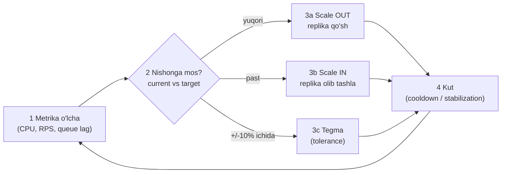

# 9. Autoscaling

> **TL;DR:** Autoscaling — yukka qarab resurslarni (instance, pod, CPU/memory) avtomatik qo'shish yoki olib tashlash. Bu load balancing g'oyasining dinamik davomi: kunduzi trafik oshsa quvvat ko'payadi, kechasi kamaysa kamayadi. Natijada tizim kutilmagan yukni ham ko'taradi va bo'sh turgan resurs uchun pul isrof qilinmaydi. Sharti — service **stateless** bo'lishi.

---

## Muammo — statik quvvat: yo pul isrof, yo overload

Servicega tushadigan yuk vaqt bilan o'zgaradi. Klassik misol (kitobdan): foydalanuvchilarga xizmat qiluvchi web-service — **kunduzi yuk yuqori, kechasi past**.

Endi statik miqdorda server bilan qursang, ikkita yomon variant qoladi:

- **Peak (eng yuqori) yuk uchun qurdim.** Kechasi 90% server bo'sh turadi — CPU aylanadi, hisob ostidan pul ketadi. **Pul isrofi.**
- **O'rtacha yoki kechgi yuk uchun qurdim.** Kunduzi peak kelganda serverlar to'lib ketadi — latency oshadi, so'rovlar tushadi, bazan **cascading failure**. **Overload.**

Ikkala holatda ham asosiy sabab bitta: **quvvat qo'lda, statik belgilangan, lekin talab dinamik.** Odam har safar yukni kuzatib, qo'lda server qo'shib-olib tura olmaydi (ayniqsa yarim tunda).

> **Og'riq:** Talab har soatda o'zgaradi, quvvat esa qotib qolgan. Yo ortiqcha to'laysan, yo mijozni yo'qotasan.

**Redundancy bilan bog'lanish.** Kitob autoscaling'ni **service redundancy** (bir nechta bir xil instance) mavzusidan keltirib chiqaradi. Bir necha parallel instance — bu chidamlilik matematikasi:

| Instance soni | Availability | Yillik nofaollik |
|---------------|--------------|------------------|
| 1 ta | 99% ("2 to'qqiz") | ~3.65 kun |
| 2 ta parallel | 99.99% ("4 to'qqiz") | ~52.6 daqiqa |
| 3 ta parallel | 99.9999% ("6 to'qqiz") | ~31.6 soniya |

Har biri alohida ishonchsiz bo'lsa ham, parallel instance'lar availability'ni keskin oshiradi — shuning uchun bulut provayderlari **3 replika** tavsiya qiladi. Autoscaling — bu redundancy'ni **dinamik boshqarish**: nechta replika kerakligini yukka qarab o'zi hal qiladi.

> **Diqqat:** parallel instance ishonchni oshiradi, lekin oldida turgan **ketma-ket** komponent (masalan bitta load balancer) uni pasaytiradi. "Ketma-ket tizim chidamliligi uning eng zaif bo'g'inidan yuqori bo'la olmaydi."

---

## Mohiyati — supermarketdagi kassalar

Supermarketni tasavvur qil. Navbat uzaya boshlasa, menejer **qo'shimcha kassa ochadi**; olomon tarqasa **kassa yopadi**. Autoscaling — o'sha menejer, faqat avtomatik.

Ikki xil "kassa ochish" bor:

- **Horizontal scaling** — ko'proq **kassir** qo'shish (ko'proq pod/instance). "Scale out / scale in."
- **Vertical scaling** — bitta kassirga kuchliroq **kassa apparati** berish (ko'proq CPU/memory). "Scale up / scale down."

Analogiya chegarasi: supermarketda kassa ochish soniyalar oladi, cloud'da yangi instance ko'tarilishi **daqiqalar** olishi mumkin (cold start). Shuning uchun navbat *butunlay* uzayguncha kutib bo'lmaydi — biroz zaxira bilan oldindan ochish kerak.

> Oltin qoida (kitobdan): **eng yaxshi masshtablash — hech qachon kerak bo'lmaydigani.** Ya'ni avval kodni samarali qil, keshla, keraksiz ishni kechiktir — keyin autoscaling'ga tayan.

---

## Qanday ishlaydi

Autoscaling — bu **control loop** (boshqaruv sikli): o'lcha -> nishon bilan solishtir -> moslash -> kut -> qaytadan.



Ushbu sikl uch xil "vaqt strategiyasi"da ishlashi mumkin:

| Tur | Qachon masshtablaydi | Misol |
|-----|----------------------|-------|
| **Reactive** | Metrika nishondan oshgach (joriy holatga javob) | CPU 70% dan oshdi -> replika qo'sh |
| **Predictive** | Bashorat/ML asosida, oldindan | Har seshanba 9:00 da yuk oshishi trend'da -> 8:45 da tayyorla |
| **Scheduled** | Oldindan belgilangan jadval bo'yicha | Black Friday 00:00 -> 50 replika |

Eng keng tarqalgani — **reactive**. Predictive va scheduled uni cold start muammosidan qutqarish uchun qo'shiladi (yuk kelishidan *oldin* tayyor bo'lish).

### Horizontal vs Vertical

| | Horizontal (out/in) | Vertical (up/down) |
|-|--------------------|--------------------|
| Nima o'zgaradi | Instance/pod **soni** | Bitta pod'ning **CPU/memory** si |
| Chegarasi | Deyarli cheksiz (yana pod qo'sh) | Bitta mashina hajmi bilan cheklangan |
| To'xtatishmi | Yo'q (yangi pod qo'shiladi) | Ko'pincha ha (pod qayta yaratiladi) |
| Sharti | Service **stateless** bo'lishi shart | State bo'lsa ham ishlaydi |

Horizontal — bulut dunyosining asosiy tanlovi, chunki chegarasiz va uzilishsiz. Lekin u faqat **stateless** service'da ishlaydi (batafsil: [2. Scalability](../1.%20Cloud%20Native%20App/2.%20Scalability.md)).

---

## Go implementatsiyasi

Amaliyotda autoscaling'ni **o'zing yozmaysan** — Kubernetes yoki bulut platformasi buni bajaradi. Ammo (1) qaror mantig'ini tushunish va (2) service'ingni scaling'ga **tayyor** qilish sening ishing. Ikkalasini Go'da ko'rsatamiz.

### 1) HPA formulasini Go'da modellash

Kubernetes HPA replika sonini shu formula bilan hisoblaydi:

```text
desiredReplicas = ceil( currentReplicas * currentMetric / targetMetric )
```

Uni Go'da yozib, mantiqni his qilamiz:

```go
// --- 1-qadam: nishon va joriy holatga qarab kerakli replikani hisoblash ---
func desiredReplicas(current int, currentMetric, targetMetric float64) int {
    ratio := currentMetric / targetMetric
    // tolerance: +/-10% ichida bo'lsa umuman tegmaymiz (flapping'ning oldini oladi)
    if math.Abs(ratio-1.0) < 0.1 {
        return current
    }
    return int(math.Ceil(float64(current) * ratio))
}

// --- 2-qadam: min/max bilan cheklash (byudjetni himoya qilish) ---
func clamp(n, min, max int) int {
    if n < min { return min }
    if n > max { return max }
    return n
}
```

**Misol.** Hozir 4 pod ishlayapti, o'rtacha CPU 90%, nishon 50%:

```text
ratio = 90 / 50 = 1.8
desired = ceil(4 * 1.8) = ceil(7.2) = 8 pod
```

Agar CPU 30% ga tushsa: `ceil(4 * 0.6) = 3 pod`. Agar CPU 52% bo'lsa: `1.04` — tolerance ichida, **tegmaydi** (52/50 = 1.04 < 1.1).

**Notional machine.** HPA bu hisobni har ~15 soniyada takrorlaydi. `math.Ceil` muhim: 7.2 pod bo'lmaydi — yuqoriga yaxlitlaymiz, aks holda quvvat yetmaydi. Tolerance (+/-10%) — kichik tebranishlarda pod qo'shib-olib turmaslik uchun; usiz tizim **flapping** qiladi.

> O'ylab ko'r: `tolerance` tekshiruvini olib tashlasak, CPU 50% atrofida (goh 51%, goh 49%) tebranganda nima bo'ladi?

<details>
<summary>Javobni ko'rish</summary>

Tizim **flapping/thrashing** qiladi: 51% da pod qo'shadi, keyin yuk taqsimlanib 49% ga tushadi -> pod oladi -> yana 51% -> yana qo'shadi... Cheksiz tebranish. Har pod ko'tarilishi resurs va cold start vaqti talab qiladi, shuning uchun bu ham qimmat, ham beqaror. Tolerance va **stabilization window** aynan shuni to'sadi.
</details>

### 2) Service'ni scaling'ga tayyor qilish — readiness + graceful shutdown

Autoscaler xotirjam pod **qo'shishi va olishi** uchun service'ing ikki narsani bilishi kerak: "men tayyorman" deyish (readiness) va "meni o'chirishyapti, ishimni tugatay" (graceful shutdown).

```go
// --- 1-qadam: readiness endpoint — pod trafik qabul qilishga tayyormi? ---
func readyz(w http.ResponseWriter, r *http.Request) {
    if atomic.LoadInt32(&ready) == 1 {
        w.WriteHeader(http.StatusOK) // LB/HPA: bu podga trafik yubor
        return
    }
    http.Error(w, "starting", http.StatusServiceUnavailable) // hali kutil
}

// --- 2-qadam: SIGTERM'da graceful shutdown (scale-in paytida) ---
func main() {
    srv := &http.Server{Addr: ":8080"}
    go srv.ListenAndServe()

    stop := make(chan os.Signal, 1)
    signal.Notify(stop, syscall.SIGTERM) // K8s scale-in'da SIGTERM yuboradi
    <-stop

    atomic.StoreInt32(&ready, 0) // "endi trafik yubormang"
    ctx, cancel := context.WithTimeout(context.Background(), 15*time.Second)
    defer cancel()
    srv.Shutdown(ctx) // joriy so'rovlarni tugatib, keyin o'chir
}
```

**Nega muhim?** Scale-in paytida Kubernetes podga `SIGTERM` yuboradi. Agar service darhol o'lsa, **jarayondagi so'rovlar uziladi** (500 xatolar). To'g'ri yo'l: avval `readyz` ni `false` qil (yangi trafik kelmasin), keyin joriy so'rovlarni tugat, keyin o'ch. Bu — autoscaling'ni foydalanuvchi sezmasligining sharti.

Output (scale-in vaqtida):

```text
2026/07/08 03:00:00 SIGTERM keldi, readiness=false
2026/07/08 03:00:00 3 ta faol so'rov tugatilmoqda...
2026/07/08 03:00:02 graceful shutdown tugadi, pod o'chdi
```

---

## Real dunyoda

Kubernetes autoscaling'ning to'rt asosiy quroli bor — ular **turli darajada** ishlaydi va birga ishlatiladi.

### HPA — Horizontal Pod Autoscaler (pod soni)

Eng ko'p ishlatiladigan. Metrikaga qarab **pod sonini** o'zgartiradi.

- **Manba:** `metrics-server` (CPU/memory) yoki custom/external metrics API.
- **Formula:** `ceil(currentReplicas * currentMetric / targetMetric)`, +/-10% tolerance.
- **Sikl:** har ~15 soniya.
- **Flapping himoyasi:** scale-**down** uchun default **5 daqiqa** `stabilizationWindowSeconds` (shoshilmay kamaytiradi); scale-**up** darhol (0s).

```yaml
apiVersion: autoscaling/v2
kind: HorizontalPodAutoscaler
metadata:
  name: checkout
spec:
  scaleTargetRef:
    kind: Deployment
    name: checkout
  minReplicas: 2         # redundancy uchun kamida 2-3
  maxReplicas: 20        # byudjet himoyasi — MUHIM
  metrics:
  - type: Resource
    resource:
      name: cpu
      target:
        type: Utilization
        averageUtilization: 60
  behavior:
    scaleDown:
      stabilizationWindowSeconds: 300  # flapping'ni to'sadi
```

CPU dan tashqari **custom metrics** (masalan `http_requests_per_second` har pod uchun) yoki **external metrics** (masalan navbat uzunligi) bo'yicha ham masshtablash mumkin — bu CPU'dan ko'ra to'g'ridan-to'g'ri talab signali.

### VPA — Vertical Pod Autoscaler (pod hajmi)

Pod sonini emas, har pod'ning **CPU/memory request/limit** ini moslaydi. Rejimlari:

| Rejim | Nima qiladi |
|-------|-------------|
| `Off` | Faqat tavsiya beradi, o'zgartirmaydi |
| `Initial` | Faqat pod yaratilganda request qo'yadi |
| `Auto`/`Recreate` | Podni **qayta yaratib** yangi request qo'yadi |

> **Diqqat:** HPA va VPA'ni **bir xil metrika** (masalan CPU) ustida birga ishlatma — ular bir-biriga qarshi ishlaydi (biri pod qo'shadi, ikkinchisi CPU o'zgartiradi, hisob chalkashadi). HPA'ni CPU'ga, VPA'ni faqat memory'ga qo'yish yoki VPA'ni `Off`/`Initial` da ishlatish — xavfsiz.

### Cluster Autoscaler (node soni)

HPA pod qo'shadi, lekin **node'da joy bo'lmasa** pod `Pending` bo'lib qoladi. Cluster Autoscaler o'sha yerda ishga tushadi:

- **Scale-up:** joylashtirib bo'lmaydigan (`Pending`/unschedulable) pod paydo bo'lsa — cloud provayderdan yangi node so'raydi (~10s da tekshiradi, node ~15 daqiqada kelishini kutadi).
- **Scale-down:** node'ning CPU+memory so'rovlari uning sig'imining **50% dan past** bo'lib **10 daqiqa** turgan bo'lsa — podlarni ko'chirib, node'ni o'chiradi.

Uyg'unlik: **HPA -> pod qo'shadi -> CA -> node qo'shadi.** Yuk tushganda teskari.

### KEDA — event-driven autoscaling

HPA CPU/memory'da yaxshi, lekin **event/queue** ga asoslangan ish uchun (masalan Kafka consumer) noto'g'ri signal beradi — CPU past bo'lsa ham navbatda 100 000 xabar kutayotgan bo'lishi mumkin. KEDA aynan shuni hal qiladi:

- HPA'ni **almashtirmaydi**, unga metrika beradigan adapter sifatida ishlaydi.
- **70+ scaler:** Kafka lag, RabbitMQ queue length, AWS SQS, Prometheus, ...
- **Scale to zero:** event bo'lmasa podni **0 ga** tushiradi (HPA buni qila olmaydi) — pul tejaydi.
- `ScaledObject` (Deployment uchun) va `ScaledJob` (Job/batch uchun).

Masalan, to'lov ishlovchisi Kafka'dan xabar o'qiydi: consumer lag 100 dan oshsa KEDA HPA orqali 2 dan 10 podgacha ko'taradi; lag nolga tushsa podlarni 0 ga oladi.

**Cloud provayderlar** ham server darajasida autoscaling beradi (AWS Auto Scaling Group, GCP MIG, Azure VMSS) — bu Cluster Autoscaler ostidagi qatlam.

---

## Tuzoqlar va anti-patternlar

- **Flapping / thrashing.** Nishon atrofida tebranganda pod qo'shib-olib turish. Yechim: **tolerance** (+/-10%) + **stabilization window** (scale-down uchun 5 daqiqa) + cooldown. Scale-up tez, scale-down sekin bo'lsin.
- **Cold start.** Yangi pod/instance ko'tarilishi vaqt oladi (image tortish, JVM/runtime warm-up). Yuk *kelgandan keyin* masshtablasang, kech qolasan. Yechim: image'ni kichik qil, startup'ni tezlashtir, biroz **zaxira quvvat** (headroom) ushla, kerak bo'lsa predictive/scheduled scaling qo'sh.
- **Bottleneck'ni ko'chirish.** Stateless app'ni 100 podga ko'tarding — endi ularning hammasi **bitta DB** ga uriladi, connection limit portlaydi. Masshtablash muammoni yechmadi, uni **pastga** (DB'ga) surdi. Yechim: connection pooling, read replica, kesh, PgBouncer kabi proxy.
- **State'ni pod ichida saqlash.** Session/fayl/kesh pod ichida bo'lsa, scale-in paytida u yo'qoladi va scale-out'da yangi pod uni bilmaydi. **Stateless bo'lish shart** — state'ni tashqi store'ga (Redis, DB, S3) chiqar.
- **`maxReplicas` qo'ymaslik.** Retry storm yoki DDoS kelganda autoscaler cheksiz pod ko'taradi va **byudjetni yeb bitiradi**. Har doim aqlli maksimum qo'y; ustiga throttling/load shedding qo'sh.
- **HPA + VPA'ni bir metrikaga qo'yish.** Ular kurashadi. Farqli metrikalarga ajrat.
- **"Autoscaling barcha muammoni yechadi" deb o'ylash.** Masshtablash vaqt talab qiladi va samarasiz kodni tuzatmaydi. Eng yaxshi masshtablash — kerak bo'lmagani.

---

## Bog'liq patternlar

| Pattern | Aloqasi | Link |
|---------|---------|------|
| Scalability (atribut) | Autoscaling — Scalability'ni amalga oshiradi; stateless bo'lish sharti o'sha yerda | [2. Scalability](../1.%20Cloud%20Native%20App/2.%20Scalability.md) |
| Resilience (atribut) | Redundancy + autoscaling birga availability'ni oshiradi | [4. Resilience](../1.%20Cloud%20Native%20App/4.%20Resilience.md) |
| Health Check | HPA/LB pod sog'ligini readiness/liveness orqali biladi | [8. Health Check](8.%20Health%20Check.md) |
| Throttle / Rate Limiting | maxReplicas'ga yetganda ortiqcha yukni cheklaydi | [5. Throttle / Rate Limiting](5.%20Throttle%20-%20Rate%20Limiting.md) |
| Load Shedding | Masshtablash yetishmasa ortiqcha yukni tashlab yuboradi | [Backpressure - Load Shedding](../3.%20Distributed%20Patterns/8.%20Backpressure%20-%20Load%20Shedding.md) |
| Bulkhead | Har bo'linmani mustaqil masshtablash mumkin | [7. Bulkhead](7.%20Bulkhead.md) |

---

## Interview savollari

**1. HPA replika sonini qanday hisoblaydi? Formulani yoz va misol keltir.**

<details>
<summary>Javob</summary>

`desiredReplicas = ceil(currentReplicas * currentMetricValue / desiredMetricValue)`. Masalan 4 pod, o'rtacha CPU 90%, nishon 50%: `ceil(4 * 90/50) = ceil(7.2) = 8`. Agar nisbat +/-10% (tolerance) ichida bo'lsa — masshtablamaydi (masalan 52/50 = 1.04). `ceil` shuning uchun kerakki, quvvat kamayib qolmasligi uchun doim yuqoriga yaxlitlanadi.
</details>

**2. Reactive, predictive va scheduled scaling farqi nima? Qachon qaysi biri kerak?**

<details>
<summary>Javob</summary>

**Reactive** — hozirgi metrikaga javoban (CPU oshdi -> qo'sh); sodda, lekin cold start tufayli kechikadi. **Predictive** — trend/ML asosida yuk kelishidan *oldin* tayyorlaydi (takrorlanadigan kunlik/haftalik trend uchun). **Scheduled** — belgilangan vaqtda (Black Friday, ish boshlanishi 9:00). Amaliyotda reactive asos, predictive/scheduled uni cold start muammosidan qutqaradi.
</details>

**3. Flapping (thrashing) nima va Kubernetes uni qanday to'sadi?**

<details>
<summary>Javob</summary>

Flapping — nishon atrofida tebranganda pod'larni tez-tez qo'shib-olib turish, cheksiz beqarorlik. Har o'zgarish resurs va cold start talab qiladi. Kubernetes uni uch narsa bilan to'sadi: (1) **tolerance** +/-10% — kichik farqda tegmaydi; (2) **stabilization window** — scale-down default 5 daqiqa kutadi; (3) scale-up tez, scale-down sekin (asimmetrik). Cluster Autoscaler'da ham `scale-down-unneeded-time` (10 daqiqa) va `scale-down-delay-after-add` bor.
</details>

**4. Nega autoscaling faqat stateless service'da to'g'ri ishlaydi?**

<details>
<summary>Javob</summary>

Horizontal scaling istalgan podni yaratib-o'chira oladi va istalgan pod istalgan so'rovni bajara olishi kerak. Agar state (session, fayl, kesh) pod ichida saqlansa: scale-in'da u **yo'qoladi**, scale-out'da yangi pod uni **bilmaydi**, LB so'rovni boshqa podga yuborsa foydalanuvchi o'z ma'lumotini topolmaydi. Yechim — state'ni tashqi umumiy store'ga (Redis, DB, S3) chiqarish, podni "arzon, almashtiriladigan" qilib saqlash.
</details>

**5. Servisni 50 podga masshtabladim, lekin latency baribir oshdi. Sabab?**

<details>
<summary>Javob</summary>

Katta ehtimol **bottleneck pastga ko'chdi**. Stateless app qatlami masshtablandi, lekin 50 podning hammasi bitta umumiy resursga — odatda **DB** ga — uriladi: connection pool limiti portlaydi, DB CPU to'ladi, latency oshadi. Masshtablash muammoni yechmadi, uni pastroq qatlamga surdi. Yechim: connection pooling (PgBouncer), read replica, kesh qatlami, yoki DB'ni ham masshtablanadigan qilish. Har doim butun zanjirni kuzat — eng zaif bo'g'in umumiy chidamlilikni belgilaydi.
</details>

---

## Eslab qol

- **Autoscaling = supermarket kassa menejeri.** Navbat uzaysa kassa ochadi, tarqasa yopadi — avtomatik, yukka qarab.
- **Statik quvvat yomon:** peak uchun qursang pul isrof, o'rtacha uchun qursang overload. Autoscaling bu tanlovni yo'q qiladi.
- **Horizontal = ko'proq pod** (chegarasiz, stateless shart), **vertical = kuchliroq pod** (mashina hajmi bilan cheklangan).
- **HPA formulasi:** `ceil(currentReplicas * currentMetric / targetMetric)`, +/-10% tolerance, scale-down 5 daqiqa stabilization.
- **To'rt qurol:** HPA (pod soni), VPA (pod hajmi), Cluster Autoscaler (node soni), KEDA (event/queue, scale-to-zero).
- **Stateless bo'lish shart** — state pod ichida bo'lsa scale-in'da yo'qoladi.
- **Eng katta tuzoqlar:** flapping (cooldown bilan to's), cold start (headroom ushla), bottleneck'ni DB'ga ko'chirish, `maxReplicas` qo'ymaslik (byudjet portlaydi).
- **Oltin qoida:** eng yaxshi masshtablash — hech qachon kerak bo'lmaydigani (avval kodni samarali qil).
