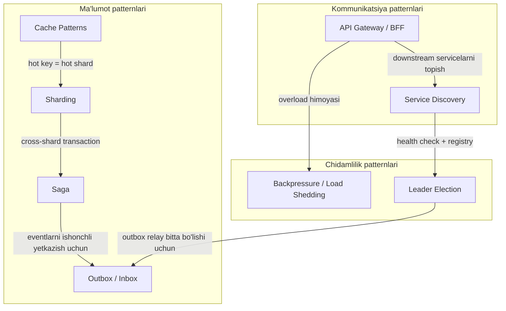

# Distributed / Microservice Patterns

Bu papka distributed systems va microservice arxitekturasidagi asosiy patternlarni qamrab oladi. `2. Stability Patterns/` papkasidagi patternlar (Circuit Breaker, Retry, Timeout, Bulkhead...) **bitta service ichidagi chidamlilik** haqida bo'lsa, bu yerdagi patternlar **servicelar orasidagi muammolarni** hal qiladi: distributed transaction, ishonchli message yetkazish, ma'lumotni taqsimlash, servicelarni topish va yukni boshqarish.

## Mundarija

| # | Pattern | Qaysi muammoni hal qiladi |
|---|---------|---------------------------|
| 1 | [Saga](1.%20Saga.md) | Bir nechta service bo'ylab distributed transaction — 2PC siz atomiklik |
| 2 | [Outbox / Inbox](2.%20Outbox%20-%20Inbox.md) | DB yozuvi + message publish ni atomik qilish (dual write problem) |
| 3 | [Cache Patterns](3.%20Cache%20Patterns.md) | Cache-Aside, Read/Write-Through, Write-Behind — tezlik va consistency balansi |
| 4 | [Service Discovery](4.%20Service%20Discovery.md) | Efemer IP lar dunyosida servicelarni qanday topish |
| 5 | [Leader Election](5.%20Leader%20Election.md) | Ko'p instance ichidan bittasini koordinator qilib saylash, split-brain oldini olish |
| 6 | [Sharding](6.%20Sharding.md) | Ma'lumotni segmentlarga bo'lish — lock contention dan tortib DB gacha |
| 7 | [API Gateway / BFF](7.%20API%20Gateway%20-%20BFF.md) | Clientlar uchun yagona kirish nuqtasi, aggregation, har client uchun moslashgan backend |
| 8 | [Backpressure / Load Shedding](8.%20Backpressure%20-%20Load%20Shedding.md) | Overload dan himoya — yukni sekinlashtirish yoki ongli ravishda tashlash |

## Patternlar qanday bog'langan

Oddiy o'qish tartibi: **4 → 7 → 8** (kommunikatsiya va himoya), keyin **1 → 2** (distributed data consistency), keyin **3 → 6 → 5** (ma'lumotni taqsimlash va koordinatsiya).

## Manba kitob: Cloud Native Go (Matthew Titmus, 2022)

Materiallar tayyorlashda `Patterns/oblachnyj_go_titmus_2022.pdf` (ruscha nashri, DMK Press, 418 sahifa) to'liq ko'rib chiqildi. Kitob tuzilishi va bizning mavzularga aloqasi:

### I qism — Cloud muhiti (1–2 boblar)

- **1-bob. "Cloud" application nima?** — Cloud native ta'rifi 5 atribut orqali: scalability, loose coupling, resilience, manageability, observability. Asosiy g'oya: cloud texnologiyalar "ko'plik" (miqdor) afzalligidan foydalanish va "ishonchsizlik" kamchiligini qoplash uchun mavjud.
- **2-bob. Nega Go cloud dunyosini boshqaradi** — CSP modeli (goroutine + channel), struktura tipizatsiya, tez build, memory safety, static linking. Docker, Kubernetes, Consul, etcd — barchasi Go da yozilgani bejiz emas.

### II qism — Go konstruksiyalari (3–5 boblar)

- **3-bob. Go asoslari** — tilning qisqa sharhi (types, slices, maps, interfaces, goroutines, channels, select).
- **4-bob. Cloud application patternlari** — kitobning eng qimmatli bobi:
  - `context` package — deadline, timeout, cancellation
  - Stability patterns: Circuit Breaker, Debounce, Retry, Throttle, Timeout (bular `2. Stability Patterns/` papkasida yoritilgan)
  - Concurrency patterns: Fan-In, Fan-Out, Future, **Sharding** (→ [6. Sharding](6.%20Sharding.md) faylida chuqur yoritilgan)
- **5-bob. Cloud service qurish** — key-value store ni bosqichma-bosqich qurish: monolith → transaction log (file + Postgres) → TLS → Docker konteynerlash. Idempotency tushunchasi shu yerda kiritiladi.

### III qism — Cloud atributlari (6–11 boblar)

- **6-bob. Hammasi ishonchlilik haqida** — dependability nazariyasi (Laprie), fault prevention/tolerance/removal/forecasting, "Twelve-Factor App" metodologiyasining zamonaviy tahlili.
- **7-bob. Scalability** — vertical vs horizontal scaling, 4 ta bottleneck (CPU, memory, disk I/O, network I/O), state muammosi, LRU cache (→ [3. Cache Patterns](3.%20Cache%20Patterns.md)), lock contention ni sharding bilan kamaytirish (→ [6. Sharding](6.%20Sharding.md)), goroutine leak lar, monolith vs microservices vs serverless.
- **8-bob. Loose coupling** — tight coupling turlari: mo'rt protokollar, umumiy dependency, vaqtga bog'liqlik, **fixed addresses** (→ [4. Service Discovery](4.%20Service%20Discovery.md) uchun motivatsiya). REST vs gRPC, plugin tizimlari, hexagonal architecture.
- **9-bob. Resilience** — bizning mavzularga eng aloqador bob:
  - Cascading failures, overload oldini olish: **throttling, load shedding, graceful degradation** (→ [8. Backpressure](8.%20Backpressure%20-%20Load%20Shedding.md))
  - Retry + exponential backoff + jitter, circuit breaking, timeouts (context bilan)
  - Idempotency, redundancy, autoscaling, health checks (liveness / shallow / deep), fail open
- **10-bob. Manageability** — konfiguratsiya (env vars, flags, JSON/YAML fayllar, Viper), feature flags (dynamic flag → oddiy A/B routing).
- **11-bob. Observability** — uch ustun: tracing, metrics, logging. OpenTelemetry + Jaeger + Prometheus + Zap amaliyoti.

### Kitobdan olingan asosiy saboqlar

1. **Cloud = ishonchsiz muhitda ishonchli tizim qurish.** Alohida server/tarmoq/instance har doim sinishi mumkin — pattern lar shu haqiqatni qabul qilishdan boshlanadi.
2. **State — scalability dushmani.** Application state ni tashqariga chiqaring (Redis, DB, S3), service stateless bo'lsin.
3. **Hamma narsaga timeout va context.** Go da `context.Context` — cancellation va deadline ning yagona idiomatik yo'li.
4. **Instance lar — "rogli mol, uy hayvoni emas"** (cattle, not pets): immutable, almashtiriladigan, qadrsiz.
5. **Loose coupling hamma darajada:** protokolda (gRPC/REST), vaqtda (message queue), manzilda (service discovery).
