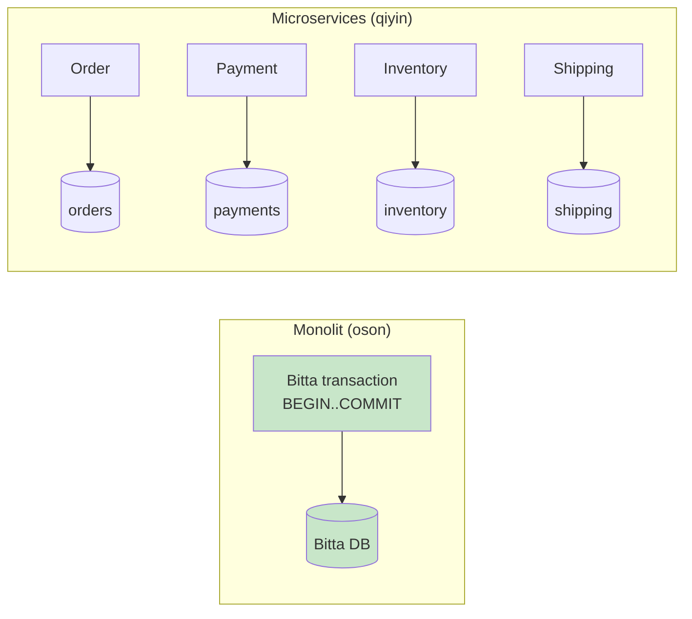
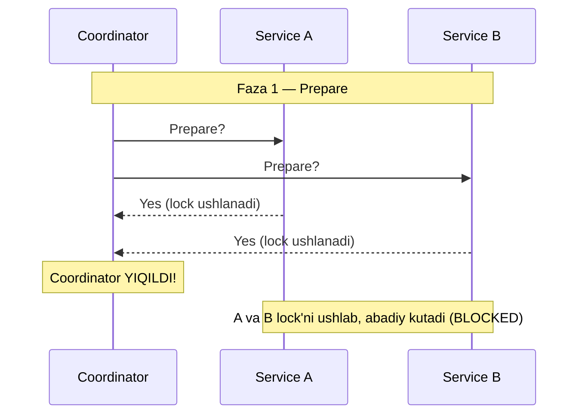
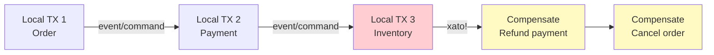
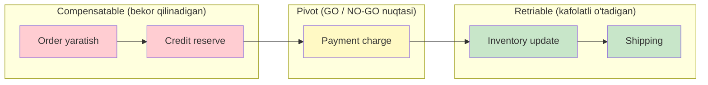
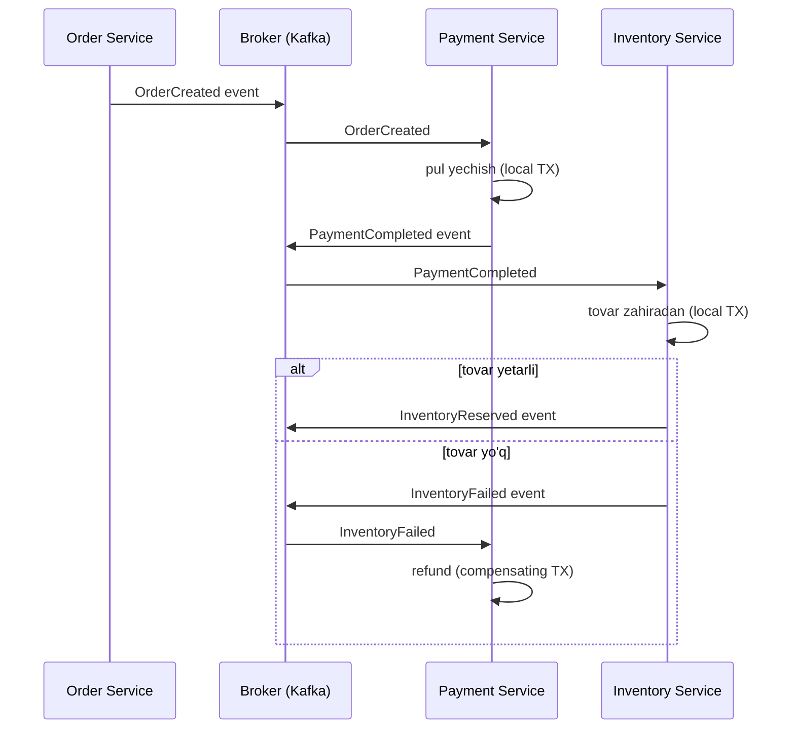
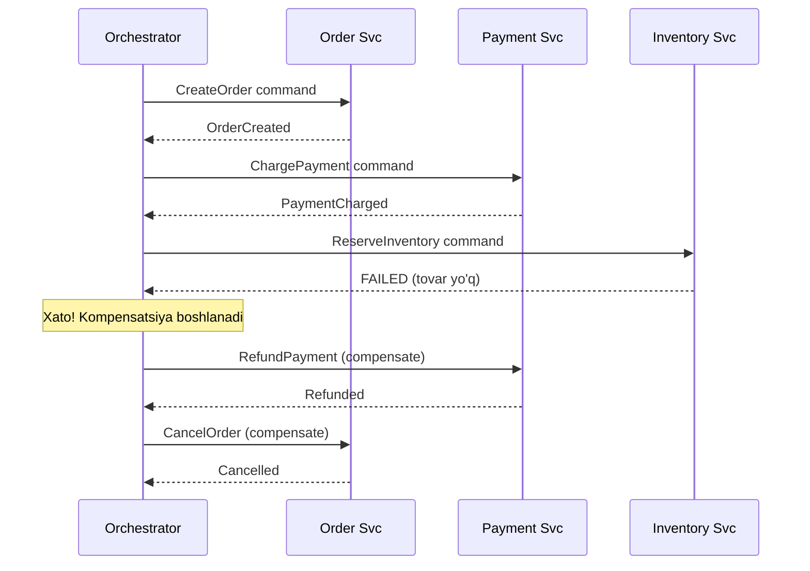
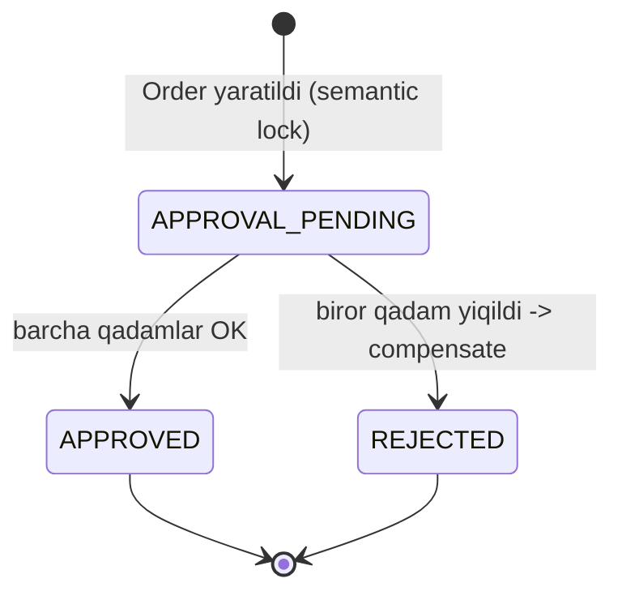
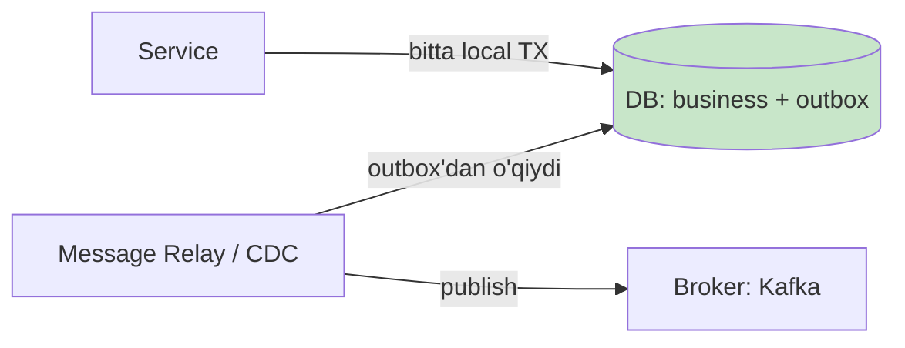

# Saga Pattern

> Distributed systems: bir nechta microservice orasida ma'lumot yaxlitligini (data consistency) saqlash usuli.

---

## TL;DR (eng qisqa xulosa)

- **Muammo:** Bitta biznes amaliyoti (masalan, buyurtma berish) bir nechta microservice va bir nechta ma'lumotlar bazasiga tegadi. Har birining o'z DB'si bor. Klassik ACID `transaction` bitta DB ichida ishlaydi, lekin servicelar orasida ishlamaydi.
- **Nima uchun 2PC emas:** Two-Phase Commit (2PC) resurslarni bloklaydi, coordinator single point of failure bo'ladi va availability'ni pasaytiradi. Microservice dunyosida bu qabul qilib bo'lmas narsa.
- **Yechim (Saga):** Bitta katta distributed transaction o'rniga — ketma-ket **local transaction**lar zanjiri. Har bir qadam o'z DB'sida commit qiladi. Biror qadam yiqilsa, oldingi qadamlar **compensating transaction** (orqaga qaytaruvchi amal) bilan bekor qilinadi.
- **Ikki tur:**
  - **Choreography** — markaziy boshqaruvchi yo'q, servicelar bir-biriga `event` yuboradi (broker orqali).
  - **Orchestration** — markaziy `orchestrator` har bir qadamga buyruq beradi va javobni kutadi.
- **Narxi:** Atomicity o'rniga **eventual consistency**. Va isolation yo'qoladi (dirty read, lost update) — buni maxsus countermeasure'lar bilan hal qilamiz.

---

## 1. Muammo: nega bizga distributed transaction kerak?

### Hook: bir DB'da hammasi oson edi

Monolit dasturda buyurtma berishni eslaysanmi? Bitta ma'lumotlar bazasi, bitta `transaction`:

```sql
BEGIN;
  INSERT INTO orders ...;        -- buyurtma yaratildi
  UPDATE accounts SET balance ...; -- pul yechildi
  UPDATE inventory SET qty ...;    -- tovar zahiradan ayrildi
COMMIT;
```

Agar biror joyda xato bo'lsa — `ROLLBACK` va **hammasi** o'z holiga qaytadi. Bu bizga bekorga tegmagan sovg'a edi: DB o'zi ACID kafolatini beradi.

> **ACID** = Atomicity (hammasi yoki hech nima), Consistency, Isolation (transactionlar bir-biriga xalaqit bermaydi), Durability (commit bo'lgach yo'qolmaydi).

### Microservice'da bu sovg'a yo'qoladi

Endi tasavvur qil: sen tizimni **Database per Service** patterni bo'yicha qurgansan. Har bir service o'z DB'sini boshqaradi:

- `Order Service` -> orders DB
- `Payment Service` -> payments DB
- `Inventory Service` -> inventory DB
- `Shipping Service` -> shipping DB

Endi buyurtma berish 4 ta alohida DB'ga tegadi. `BEGIN ... COMMIT` bittasini o'rab olmaydi — ular jismonan boshqa-boshqa mashinalarda.

**Og'riq shu yerda:** Payment o'tdi, lekin Inventory'da tovar tugab qolgan bo'lsa nima bo'ladi? Pul yechildi, tovar yo'q. Kim buni orqaga qaytaradi?



---

## 2. Nega 2PC (Two-Phase Commit) ishlamaydi?

Birinchi tabiiy fikr: "distributed transaction manager ishlataylik". Bu **2PC** deb ataladi.

### Analogiya: to'yni bir vaqtda tasdiqlash

Tasavvur qil, sen 3 do'stingni to'yga chaqirmoqchisan, lekin **faqat uchalasi ham kela olsa** borishni xohlaysan. 2PC shunday ishlaydi:

1. **Prepare faza:** Har biriga qo'ng'iroq qilib: "Kela olasanmi? Kalendaringda shu kunni **band qilib tur**" deysan. Hammasi "ha" desa...
2. **Commit faza:** "Zo'r, hammaga aytdim, boramiz!" deysan.

Muammo: agar sen (coordinator) 2-fazadan oldin telefoningni yo'qotib qo'ysang — uchala do'sting ham kalendarini **band qilib**, sendan xabar kutib o'tiraveradi. Boshqa hech narsa reja qila olmaydi. Bloklanish (blocking) shu.

### 2PC'ning 3 ta o'ldiruvchi muammosi

| Muammo | Nima bo'ladi | Oqibat |
|--------|--------------|--------|
| **Blocking (bloklanish)** | Participant "ha" degach, coordinator'dan COMMIT/ABORT kelguncha lock'ni ushlab turadi | Coordinator 30 soniya yiqilsa — barcha qatorlar 30 soniya bloklangan |
| **Coordinator = SPOF** | Coordinator markaziy nuqta; u yiqilsa butun jarayon to'xtaydi | Single Point Of Failure — tizim bir nuqtaga bog'lanib qoladi |
| **Availability pasayadi** | Servicelardan biri javob bermasa, butun transaction kutadi | CAP teoremasi bo'yicha: kuchli consistency uchun availability qurbon bo'ladi |

> **Oltin qoida:** Microservice'ning butun mohiyati — servicelar mustaqil, loose coupling, yuqori availability. 2PC esa aynan shu 3 xususiyatni buzadi. Shuning uchun uni ko'pincha ishlatmaymiz.



---

## 3. Saga nima?

### Sodda ta'rif

> **Saga** — bu bir nechta service bo'ylab cho'zilgan biznes amaliyotni bajaradigan **local transactionlar ketma-ketligi**. Har bir local transaction o'z service'ining DB'sida commit qiladi va keyingi qadamni ishga tushiradi. Agar biror qadam biznes qoidasini buzsa, saga oldingi qadamlarni **compensating transaction**lar bilan bekor qiladi.

### Analogiya: sayohat bron qilish

Sen ta'tilga chiqmoqchisan. 3 narsani bron qilishing kerak:

1. **Aviabilet** -> to'ladim, bron bo'ldi
2. **Mehmonxona** -> to'ladim, bron bo'ldi
3. **Taksi (transfer)** -> bo'sh mashina yo'q! Xato.

Endi sen barcha bronni **bir vaqtda** qila olmaysan (bu 2PC bo'lardi — uchala kompaniya seni kutib turishi kerak edi). Aksincha, ketma-ket bron qilding. Taksi topilmagach:

- Mehmonxonani **bekor qilaman** (compensating transaction)
- Aviabiletni **bekor qilaman** (compensating transaction, ya'ni "refund")

**Analogiya chegarasi:** ⚠️ E'tibor ber — bu `ROLLBACK` emas! Aviabiletni "refund" qilganingda pulning bir qismi ushlanib qolishi mumkin, tarixda "bekor qilingan bron" izi qoladi. Ya'ni saga **avvalgi holatni tiklamaydi**, balki uning **ta'sirini semantik jihatdan qoplaydi** (semantic rollback). Bu klassik DB rollback'idan tub farqi.

### ACID emas — BASE

Saga bizni ACID'dan BASE'ga o'tkazadi:

| ACID (monolit) | BASE (saga) |
|----------------|-------------|
| **A**tomicity — hammasi yoki hech nima | **B**asically **A**vailable — doim ishlaydi |
| **C**onsistency — darhol izchil | **S**oft state — holat vaqtincha noaniq bo'lishi mumkin |
| **I**solation — ajratilgan | **E**ventual consistency — oxir-oqibat izchil bo'ladi |
| **D**urability | |

> **Asosiy almashuv (trade-off):** Saga atomicity va kuchli isolation'ni **eventual consistency** ga almashtiradi. Ya'ni saga davomida boshqa foydalanuvchi "yarim tayyor" holatni ko'rishi mumkin, lekin oxir-oqibat tizim izchil holatga keladi.



---

## 4. Compensating transaction dizayni

Bu — saga'ning eng nozik qismi. ACID'da rollback'ni DB bepul qiladi. Saga'da esa **har bir orqaga qaytaruvchi amalni qo'lda o'zing yozasan**.

### 4.1 Semantic rollback (ma'noviy qaytarish)

Compensating transaction avvalgi holatni **fizik tiklamaydi**, balki uning ta'sirini **ma'no jihatdan** yo'qqa chiqaradi:

| Forward transaction | Compensating transaction | Izoh |
|---------------------|--------------------------|------|
| Kartadan pul yechish | Pulni qaytarish (refund) | "Delete" emas — refund; tarix qoladi |
| Tovarni zahiradan olish | Tovarni zahiraga qaytarish | Miqdorni tiklash |
| Buyurtma yaratish | Buyurtmani "CANCELLED" qilish | Qatorni o'chirmaymiz, statusni o'zgartiramiz |

### 4.2 Transaction turlari: compensatable, pivot, retriable

Chris Richardson saga'ni 3 fazaga bo'ladi. Buni tushunish saga dizaynining kaliti:



- **Compensatable transaction** — keyin bekor qilinishi mumkin bo'lgan qadam (compensating transaction'ga ega). Masalan: buyurtma yaratish.
- **Pivot transaction** — "qaytish yo'q" nuqtasi (go/no-go point). Bu qadam commit bo'lsa, saga oxirigacha **majburan** yakunlanadi. Undan oldin — orqaga qaytish mumkin; undan keyin — faqat oldinga. Pivot na compensatable, na retriable bo'lishi mumkin.
- **Retriable transaction** — pivot'dan keyingi qadamlar. Ular **muvaffaqiyatli bo'lishi kafolatlangan** (kerak bo'lsa qayta-qayta urinib bo'lsa ham). Chunki ularni orqaga qaytarib bo'lmaydi — faqat oldinga surish mumkin.

> **Muhim mantiq:** compensatable bo'lmagan har qanday qadam retriable bo'lishi SHART. Chunki uni bekor qila olmaymiz — demak, u albatta oxir-oqibat o'tishi kerak (retry bilan).

### 4.3 Idempotency — majburiy shart

Retry bo'lganda bir amal ikki marta bajarilib qolishi mumkin. Shuning uchun har bir qadam **idempotent** bo'lishi kerak: bir necha marta chaqirilsa ham, natija bir marta chaqirilgandagi bilan bir xil.

Buni **idempotency key** bilan ta'minlaymiz (masalan `orderId`):

```go
// --- Idempotent to'lov: bir key ikki marta kelsa ham bir marta charge qilinadi ---
func (p *PaymentService) Charge(orderID string, amount int) error {
    // 1-qadam: bu orderID uchun avval charge bo'lganmi tekshiramiz
    if p.alreadyCharged(orderID) {
        return nil // ikkinchi marta hech narsa qilmaymiz
    }
    // 2-qadam: charge qilamiz va key'ni saqlaymiz
    if err := p.chargeCard(orderID, amount); err != nil {
        return err
    }
    p.markCharged(orderID)
    return nil
}
```

---

## 5. Ikki tur: Choreography va Orchestration

Saga'ni ikki xil boshqarish mumkin. Farqi — "kim keyingi qadamni ishga tushiradi?"

### 5.1 Choreography (event-driven, markazsiz)

**G'oya:** Markaziy boshqaruvchi yo'q. Har bir service o'z ishini bajaradi va `event` chiqaradi (message `broker` orqali — masalan Kafka). Boshqa service bu event'ni eshitib, o'z qadamini bajaradi.

**Analogiya:** Raqs ansambli (choreography = raqs). Dirijyor yo'q — har bir raqqos oldingi harakatni ko'rib, o'z harakatini boshlaydi. Hamma bir-birini kuzatadi.



**Afzalliklari:** loose coupling, markaziy nuqta yo'q, oddiy saga'lar uchun engil.
**Kamchiliklari:** oqimni kuzatish qiyin (biror joyda "sehr" sodir bo'ladi), debug og'ir, servicelar orasida yashirin bog'liqlik va halqasimon (cyclic) bog'liqlik xavfi.

### 5.2 Orchestration (markaziy orchestrator)

**G'oya:** Bitta markaziy `orchestrator` (dirijyor) bor. U har bir service'ga "sen shu ishni qil" deb **buyruq (command)** yuboradi, javobini kutadi, keyin navbatdagi qadamga o'tadi. Xato bo'lsa, kompensatsiyani ham o'zi boshqaradi.

**Analogiya:** Simfonik orkestr dirijyori. Har bir cholg'uchi faqat dirijyorga qaraydi. Dirijyor "endi sen chal" deb ishora beradi. Butun mantiq bitta joyda.



**Afzalliklari:** butun mantiq bir joyda — tushunish/debug oson, holatni ko'rish oson, kompensatsiyani boshqarish oson, halqasimon bog'liqlik yo'q.
**Kamchiliklari:** orchestrator SPOF bo'lishi mumkin (lekin uni ham HA qilib qurish mumkin), biznes mantig'i orchestrator'ga to'planib ketishi xavfi.

### 5.3 Taqqoslash jadvali

| Mezon | Choreography | Orchestration |
|-------|--------------|---------------|
| Boshqaruv | Markazsiz, event-driven | Markaziy orchestrator |
| Bog'lanish | Broker orqali event | Command/reply |
| Coupling | Bo'sh (loose) | Orchestrator'ga bog'liq |
| Oqimni kuzatish | Qiyin | Oson |
| Debug | Og'ir | Yengil |
| SPOF | Yo'q | Orchestrator (HA qilinsa yechiladi) |
| Yangi qadam qo'shish | Bir nechta service'ga tegadi | Faqat orchestrator'ga |
| Qachon tanlash | Kam qadamli, oddiy saga | Ko'p qadamli, murakkab saga |

> **Amaliy tavsiya:** 2-4 qadamli oddiy oqimlar uchun choreography yetadi. Murakkab, uzoq ishlaydigan, ko'p shartli oqimlar uchun orchestration tanlang — kuzatish va debug osonligi bebaho.

---

## 6. Isolation yo'qligi va countermeasure'lar

Saga'da "I" (Isolation) yo'q. Saga davomida boshqa transaction "yarim tayyor" ma'lumotni ko'rib qolishi mumkin. Bu anomaliyalarga olib keladi.

### Uch asosiy anomaliya

- **Dirty read (iflos o'qish):** Saga A biror qiymatni o'zgartirdi (hali tugamagan), Saga B uni o'qidi. Keyin A kompensatsiya qildi — B eskirgan/noto'g'ri ma'lumot bilan qoldi.
- **Lost update (yo'qolgan yangilanish):** A o'zgartirgan qiymatni B ustiga yozib yubordi.
- **Non-repeatable read:** Bir saga ichida bitta qiymatni ikki marta o'qidik — ikki xil natija chiqdi.

### Countermeasure'lar (himoya usullari)

| Countermeasure | G'oyasi | Misol |
|----------------|---------|-------|
| **Semantic lock** | Yozuvga "hali tayyor emas" flag qo'yish | Order status = `APPROVAL_PENDING`; boshqalar buni "yakuniy" deb ko'rmaydi |
| **Commutative updates** | Amallarni tartibdan qat'i nazar bir xil natija beradigan qilish | `debit()` va `credit()` — tartib muhim emas, balans bir xil |
| **Pessimistic view** | "Xavfli" qadamlarni (resurs beruvchi) saga oxiriga surish | Pulni oldin yechish, keyin kredit berish — dirty read'dan qochish |
| **Reread value** | Yozishdan oldin qiymat o'zgarmaganini qayta tekshirish | Optimistic lock kabi: version tekshirish |
| **Version file** | Amallarni yozib borib, keyin to'g'ri tartibga solish | Non-commutative amallarni commutative'ga aylantirish |

**Semantic lock — eng ko'p ishlatiladigani.** Buyurtmaga `APPROVAL_PENDING` degan flag qo'yamiz. Saga tugaguncha boshqa jarayonlar bu buyurtmani "tasdiqlangan" deb hisoblamaydi. Saga muvaffaqiyatli tugasa — `APPROVED`, aks holda `REJECTED`.



---

## 7. Go'da amaliy misol: E-commerce Order Saga (Orchestration)

Endi hammasini birlashtiramiz. **Orchestration** variantini yozamiz, chunki u mantiqni bir joyda ko'rsatadi va o'rganish uchun aniqroq.

Oqim: **Order -> Payment -> Inventory -> Shipping**. Har bir qadamning `Execute` (forward) va `Compensate` (undo) metodi bor. Orchestrator qadamlarni ketma-ket bajaradi; xato bo'lsa, bajarilganlarini **teskari tartibda** compensate qiladi.

### 7.1 Step interface va turlari

```go
package saga

import (
    "context"
    "fmt"
)

// --- Step: har bir saga qadami forward va compensate amaliga ega ---
type Step struct {
    Name       string
    Execute    func(ctx context.Context) error // forward transaction
    Compensate func(ctx context.Context) error // compensating transaction
}
```

Har bir qadam — oddiy struct. `Execute` — asosiy ish, `Compensate` — orqaga qaytarish. Idea shu qadar sodda: interface o'rniga funksiyalar ishlatdik (Go'da bu qulay).

### 7.2 Orchestrator: forward va rollback mantig'i

```go
// --- Saga: qadamlar ro'yxati (orchestrator) ---
type Saga struct {
    steps []Step
}

func (s *Saga) AddStep(step Step) { s.steps = append(s.steps, step) }

// --- Run: qadamlarni ketma-ket bajaradi; xato bo'lsa teskari compensate ---
func (s *Saga) Run(ctx context.Context) error {
    var completed []Step // muvaffaqiyatli bajarilganlar

    for _, step := range s.steps {
        fmt.Printf(">> Execute: %s\n", step.Name)
        if err := step.Execute(ctx); err != nil {
            fmt.Printf("!! FAILED: %s (%v) -> compensation boshlanadi\n", step.Name, err)
            s.compensate(ctx, completed) // orqaga qaytarish
            return fmt.Errorf("saga failed at %s: %w", step.Name, err)
        }
        completed = append(completed, step) // yakunlanganlar ro'yxatiga
    }
    fmt.Println(">> Saga muvaffaqiyatli yakunlandi")
    return nil
}
```

```go
// --- compensate: bajarilgan qadamlarni TESKARI tartibda bekor qiladi ---
func (s *Saga) compensate(ctx context.Context, completed []Step) {
    for i := len(completed) - 1; i >= 0; i-- {
        step := completed[i]
        if step.Compensate == nil {
            continue // retriable qadam — compensate yo'q
        }
        fmt.Printf("<< Compensate: %s\n", step.Name)
        if err := step.Compensate(ctx); err != nil {
            // real hayotda: bu xatoni log qilib, retry queue'ga qo'yamiz
            fmt.Printf("XX Compensation xato: %s (%v)\n", step.Name, err)
        }
    }
}
```

**Notional machine — xotirada nima bo'lyapti?** `completed` slice orqaga qaytarish uchun "tarix"ni saqlaydi. Har `Execute` muvaffaqiyatli bo'lsa, qadam shu slice'ga qo'shiladi. Xato yuz berganda biz slice'ni **oxiridan boshiga** (LIFO — stack kabi) yuramiz: oxirgi bajarilgan birinchi bo'lib bekor qilinadi. Bu aynan sayohat analogiyasidagi tartib: mehmonxona (oxirgi) avval, aviabilet (birinchi) keyin bekor qilinadi.

### 7.3 Servicelar va saga'ni yig'ish

```go
// --- Soddalashtirilgan servicelar (real hayotda bular alohida microservice) ---
type Services struct{}

func (Services) CreateOrder(ctx context.Context) error   { fmt.Println("   order yaratildi"); return nil }
func (Services) CancelOrder(ctx context.Context) error   { fmt.Println("   order bekor qilindi"); return nil }
func (Services) ChargePayment(ctx context.Context) error { fmt.Println("   pul yechildi"); return nil }
func (Services) RefundPayment(ctx context.Context) error { fmt.Println("   pul qaytarildi"); return nil }
func (Services) ReserveStock(ctx context.Context) error  { return fmt.Errorf("tovar zahirada yo'q") } // ATAYIN xato
func (Services) ReleaseStock(ctx context.Context) error  { fmt.Println("   tovar qaytarildi"); return nil }
```

```go
func main() {
    svc := Services{}
    saga := &Saga{}

    // --- 1-qadam: Order (compensatable) ---
    saga.AddStep(Step{Name: "CreateOrder", Execute: svc.CreateOrder, Compensate: svc.CancelOrder})
    // --- 2-qadam: Payment (compensatable, pivot'ga yaqin) ---
    saga.AddStep(Step{Name: "ChargePayment", Execute: svc.ChargePayment, Compensate: svc.RefundPayment})
    // --- 3-qadam: Inventory (bu yerda xato bo'ladi) ---
    saga.AddStep(Step{Name: "ReserveStock", Execute: svc.ReserveStock, Compensate: svc.ReleaseStock})

    _ = saga.Run(context.Background())
}
```

**Output:**

```
>> Execute: CreateOrder
   order yaratildi
>> Execute: ChargePayment
   pul yechildi
>> Execute: ReserveStock
!! FAILED: ReserveStock (tovar zahirada yo'q) -> compensation boshlanadi
<< Compensate: ChargePayment
   pul qaytarildi
<< Compensate: CreateOrder
   order bekor qilindi
```

Ko'ryapsanmi: `ReserveStock` yiqildi, uning o'zi hali hech narsani commit qilmagani uchun compensate bo'lmadi. Lekin undan oldingi ikki qadam — **teskari tartibda** — Payment refund, keyin Order cancel qilindi. Tizim izchil holatga qaytdi.

### 6-qadam: Predict savoli (PRIMM)

> 🤔 **O'ylab ko'r:** Agar `Compensate` funksiyasining o'zi (masalan `RefundPayment`) xato qaytarsa nima bo'ladi? Bizning kodda `compensate` metodi buni qanday boshqaradi va real production'da bu yetarlimi?

<details>
<summary>💡 Javobni ko'rish</summary>

Bizning kodda `compensate` faqat xatoni chop etadi va **davom etadi** (keyingi qadamni compensate qilaveradi). Bu production uchun **yetarli emas**: kompensatsiya xato bo'lsa, tizim izchilsiz holatda qoladi (pul yechilgan, lekin qaytarilmagan).

Real yechim:
- Compensating transaction'ni **idempotent** va **retriable** qilish (u albatta oxir-oqibat o'tishi kerak).
- Xatoni **dead-letter queue** ga yuborib, retry mexanizmi bilan qayta urinish.
- Oxirgi chora — operator uchun **alert** (qo'lda aralashuv).

Aynan shuning uchun compensating transaction'lar "kafolatlangan muvaffaqiyat" prinsipiga bo'ysunishi kerak.
</details>

### ⚠️ Ko'p uchraydigan xatolar

- **Xato:** "Compensate = DELETE, oddiy o'chirib tashlayman."
  **Nega noto'g'ri:** ko'p amallarni fizik qaytarib bo'lmaydi (yuborilgan email, o'tkazilgan pul). Va tarix yo'qoladi.
  **To'g'risi:** semantic rollback — refund, status o'zgartirish, teskari yozuv qo'shish.

- **Xato:** compensating transaction'ni idempotent qilmaslik.
  **Nega noto'g'ri:** retry bo'lganda pul ikki marta qaytarilib ketishi mumkin.
  **To'g'risi:** har bir compensate idempotency key bilan himoyalanadi.

- **Xato:** pivot'dan keyingi qadamni "compensatable" deb dizayn qilish.
  **Nega noto'g'ri:** pivot'dan keyin orqaga yo'l yo'q — u qadam retriable bo'lishi shart.
  **To'g'risi:** riskli/qaytarib bo'lmas amallarni pivot'dan keyinga, retriable sifatida qo'y.

---

## 8. Real dunyoda Saga

### 8.1 Transactional Outbox bilan bog'liqlik

Choreography'da bitta nozik muammo bor: service o'z DB'sini yangilashi **VA** event chiqarishi kerak — **atomik** ravishda. Agar DB commit bo'lib, event yuborishdan oldin service yiqilsa — event yo'qoladi, saga to'xtaydi.

**Yechim — Transactional Outbox:** event'ni ham **o'sha DB transaction ichida** `outbox` jadvaliga yozamiz. Keyin alohida jarayon (message relay / CDC) outbox'dan o'qib, broker'ga yuboradi.



Shunday qilib "DB yangilash + event chiqarish" atomik bo'ladi. Bu saga (ayniqsa choreography) uchun deyarli majburiy hamroh pattern.

### 8.2 Kafka bilan choreography

Amaliyotda choreography ko'pincha **Kafka** ustiga quriladi:
- Har bir service o'z topic'iga event yozadi (`OrderCreated`, `PaymentCompleted`).
- Boshqa servicelar bu topic'ga subscribe bo'lib, o'z qadamini bajaradi.
- Kafka'ning durability va ordering kafolatlari saga uchun mustahkam poydevor beradi.

### 8.3 Temporal / Cadence — orchestration'ni osonlashtirish

Orchestrator'ni qo'lda yozish (holatni saqlash, retry, crash'dan tiklanish) og'ir. **Temporal** (va uning ajdodi **Cadence**) aynan shu ishni o'z zimmasiga oladi:

- Saga'ni oddiy **workflow kodi** sifatida yozasan (goroutine kabi ketma-ket).
- Temporal **holatni avtomatik saqlaydi**: service crash bo'lsa, workflow o'sha joyidan davom etadi.
- **Retry policy** deklarativ — kodni o'zgartirmaysan.
- Sen faqat **compensation**larni yozasan; qolganini Temporal boshqaradi.

Temporal'da naqsh: har bir forward amaldan oldin compensation'ni ro'yxatga qo'shasan, xato bo'lsa `compensate()` chaqiriladi:

```go
// Temporal uslubidagi pseudo-kod (g'oyani ko'rsatish uchun)
saga := NewSaga()
saga.AddCompensation(activities.CancelHotel, hotelID)
activities.BookHotel(info)          // forward
saga.AddCompensation(activities.CancelFlight, flightID)
activities.BookFlight(info)         // forward
// xato bo'lsa:
//   saga.Compensate() -> teskari tartibda CancelFlight, CancelHotel
```

> **Amaliy xulosa:** kichik tizimda saga'ni qo'lda (yuqoridagi Go misolimizdek) yozish mumkin. Katta, uzoq ishlaydigan, ishonchli saga'lar uchun Temporal/Cadence yoki AWS Step Functions kabi tayyor orchestrator'lardan foydalanish tavsiya etiladi.

---

## 9. Saga vs 2PC — yakuniy taqqoslash

| Mezon | 2PC (Two-Phase Commit) | Saga |
|-------|------------------------|------|
| Consistency | Kuchli (strong), darhol | Eventual (oxir-oqibat) |
| Isolation | To'liq bor | Yo'q (countermeasure kerak) |
| Lock ushlash | Uzoq (transaction oxirigacha) | Yo'q — har qadam darhol commit |
| Blocking | Ha (coordinator kutiladi) | Yo'q |
| SPOF | Coordinator | Choreography'da yo'q, orchestration'da HA bilan yechiladi |
| Availability | Past | Yuqori |
| Rollback | Avtomatik (DB) | Qo'lda (compensating TX) |
| Murakkablik | Infratuzilma murakkab | Biznes mantiqi murakkab |
| Microservice'ga mosligi | Yomon | Yaxshi |

---

## Xulosa

- Microservice'da har service'ning o'z DB'si bor, shuning uchun servicelar bo'ylab bitta ACID transaction ishlatib bo'lmaydi.
- 2PC bu muammoni yechadi, lekin blocking, coordinator SPOF va past availability tufayli microservice'ga yaramaydi.
- **Saga** — local transactionlar zanjiri; xato bo'lsa, oldingi qadamlar **compensating transaction** bilan bekor qilinadi.
- Saga atomicity va isolation'ni **eventual consistency** ga almashtiradi (ACID -> BASE).
- Ikki tur: **choreography** (event-driven, markazsiz) va **orchestration** (markaziy orchestrator).
- Saga fazalari: **compensatable -> pivot (go/no-go) -> retriable**.
- Isolation yo'qligini **semantic lock**, commutative updates, pessimistic view kabi countermeasure'lar bilan yumshatamiz.
- Real dunyoda: choreography ko'pincha Kafka + **transactional outbox**, orchestration esa **Temporal/Cadence** yoki Step Functions bilan quriladi.

## 🧠 Eslab qol

- Saga = local transactionlar zanjiri + compensating transactionlar.
- Compensating transaction — fizik rollback emas, **semantic rollback** (refund, status o'zgartirish).
- **Pivot transaction** — "qaytish yo'q" nuqtasi; undan keyingi qadamlar retriable bo'lishi shart.
- Choreography = markazsiz (event), Orchestration = markaziy (command).
- Saga'da isolation yo'q — **semantic lock** eng ko'p ishlatiladigan countermeasure.

## ✅ O'z-o'zini tekshir (retrieval practice)

**1. Nega microservice'da 2PC ishlatilmaydi, garchi u kuchli consistency bersa ham?**

<details>
<summary>💡 Javob</summary>

Chunki 2PC resurslarni bloklaydi (participant coordinator'ni kutib lock ushlaydi), coordinator single point of failure bo'ladi va bularning hammasi availability'ni pasaytiradi. Microservice esa mustaqillik, loose coupling va yuqori availability'ni talab qiladi — 2PC aynan shularni buzadi.
</details>

**2. Compensating transaction bilan DB'ning `ROLLBACK`i orasidagi farq nima?**

<details>
<summary>💡 Javob</summary>

`ROLLBACK` avvalgi holatni **fizik** tiklaydi, hech qanday iz qoldirmaydi va DB uni avtomatik qiladi. Compensating transaction esa **semantik**: u yangi amal (masalan refund, status = CANCELLED) qo'shib, oldingi amalning **ta'sirini** yo'qqa chiqaradi — lekin tarix qoladi va uni **qo'lda** yozasan.
</details>

**3. Nima bo'ladi, agar pivot'dan keyingi qadamni compensatable qilib dizayn qilsak?**

<details>
<summary>💡 Javob</summary>

Bu dizayn xatosi. Pivot — "qaytish yo'q" nuqtasi; u commit bo'lgach saga oxirigacha yakunlanishi kerak. Pivot'dan keyingi qadamlarni bekor qilib bo'lmaydi, shuning uchun ular **retriable** (kafolatli o'tadigan) bo'lishi shart. Ularni compensatable qilsak, mantiq buziladi — orqaga yo'l yo'q, lekin biz qaytarishga urinamiz.
</details>

**4. Choreography va orchestration'dan qaysi birini murakkab, ko'p qadamli oqim uchun tanlaysan va nega?**

<details>
<summary>💡 Javob</summary>

Orchestration. Chunki butun mantiq bitta joyda (orchestrator'da) to'plangan — oqimni kuzatish, debug qilish va kompensatsiyani boshqarish ancha oson. Choreography ko'p qadamda "yashirin bog'liqlik" va halqasimon bog'liqlik yaratib, kuzatishni juda qiyinlashtiradi.
</details>

**5. Choreography'da service DB'ni yangilab, event yuborishdan oldin yiqilsa nima bo'ladi va buni qanday hal qilamiz?**

<details>
<summary>💡 Javob</summary>

Event yo'qoladi, saga to'xtab qoladi (ma'lumot yangilangan, lekin keyingi qadam ishga tushmaydi). Yechim — **Transactional Outbox**: event'ni ham o'sha DB transaction ichida `outbox` jadvaliga yozamiz, keyin alohida relay/CDC uni broker'ga yuboradi. Shunda "DB yangilash + event chiqarish" atomik bo'ladi.
</details>

## 🛠 Amaliyot

**1. Oson (Modify).** 7.2 dagi Go misolida `ReserveStock` ni muvaffaqiyatli (`return nil`) qilib, oxiriga `ShipOrder` (Execute + Compensate) qadamini qo'sh. Output qanday o'zgaradi? Barcha qadamlar o'tsa, compensation umuman chaqiriladimi?

<details>
<summary>💡 Hint</summary>

`ReserveStock` `return nil` qilsa va yangi qadam ham o'tsa — hech qanday compensation bo'lmaydi, faqat "Saga muvaffaqiyatli yakunlandi" chiqadi. `completed` slice'da 4 ta qadam bo'ladi, lekin `compensate` hech qachon chaqirilmaydi.
</details>

**2. O'rta (Faded example).** Quyidagi skeleton'ni to'ldirib, har qadamga idempotency qo'sh: qadam ikki marta chaqirilsa ham bir marta bajarilsin.

```go
type IdempotentStep struct {
    Name    string
    done    map[string]bool // key -> bajarilganmi
    Execute func(ctx context.Context, key string) error
}

func (s *IdempotentStep) Run(ctx context.Context, key string) error {
    // TODO: agar key allaqachon bajarilgan bo'lsa, nil qaytar
    // TODO: aks holda Execute'ni chaqir
    // TODO: muvaffaqiyatli bo'lsa, key'ni done'ga belgila
    return nil
}
```

<details>
<summary>💡 Hint</summary>

```go
func (s *IdempotentStep) Run(ctx context.Context, key string) error {
    if s.done[key] {
        return nil
    }
    if err := s.Execute(ctx, key); err != nil {
        return err
    }
    if s.done == nil {
        s.done = make(map[string]bool)
    }
    s.done[key] = true
    return nil
}
```
Real hayotda `done` map emas, balki DB'da saqlanadigan idempotency key jadvali bo'ladi.
</details>

**3. Qiyin (Make).** 7-bo'limdagi **orchestration** saga'ni **choreography** ko'rinishida noldan yoz: Go'da `chan Event` (broker o'rnida) yaratib, har bir service alohida goroutine bo'lsin. Har service o'z event'ini eshitib, ishini bajarib, keyingi event'ni channel'ga yuborsin. `InventoryFailed` event kelganda `Payment` refund qilsin.

<details>
<summary>💡 Hint</summary>

- `type Event struct { Type string; OrderID string }` va `bus := make(chan Event, 10)`.
- Har service — `for e := range bus { switch e.Type { ... } }` bo'lgan goroutine.
- `OrderCreated -> PaymentCompleted -> InventoryFailed -> (Payment) refund` zanjirini `switch` orqali qur.
- `sync.WaitGroup` yoki `done chan struct{}` bilan saga tugashini kutib ol.
- Diqqat: bu yerda markaziy `Run` yo'q — mantiq servicelar orasida tarqalgan. Aynan shu choreography'ning debug qiyinligini his qildiradi.
</details>

## 🔁 Takrorlash

**Bog'liq oldingi mavzular:**
- [Idempotency](../../1.%20Design%20Patterns/Stability%20patterns()/3.%20Idempotency.md) — saga qadamlari uchun majburiy shart
- [Retry](../../1.%20Design%20Patterns/Stability%20patterns()/2.%20Retry.md) — retriable transaction'lar shu prinsipga tayanadi
- [Circuit Breaker](../../1.%20Design%20Patterns/Stability%20patterns()/1.%20Circuit%20Breaker.md) — saga qadami service'ga chaqiriq qilganda himoya
- [Event Sourcing](../../1.%20Design%20Patterns/Event%20Sourcing/Event%20Sourcing.md) — choreography va outbox bilan chambarchas
- [DDD - Domain Events](../../2.%20Architecture%20Patterns/DDD/DOMAIN%20EVENTS/Untitled.md) — choreography'dagi event'lar shu tushunchadan

**Takrorlash jadvali** ("O'z-o'zini tekshir" savollariga qaytish):
- **Ertaga** — 5 ta savolga xotiradan javob ber.
- **3 kundan keyin** — choreography vs orchestration jadvalini qog'ozga yoddan chiz.
- **1 haftadan keyin** — Go orchestration misolini qarab turmasdan qayta yoz.

**Feynman testi:** Saga pattern'ni kod so'zlarini ishlatmasdan, do'stingga **3 jumlada** tushuntirib bera olasanmi? (Masalan: sayohat bron qilish analogiyasi bilan boshla — aviabilet, mehmonxona, taksi; biri bekor bo'lsa qolganlarini ham bekor qilish.)

---

## Manbalar

- [microservices.io — Pattern: Saga (Chris Richardson)](https://microservices.io/patterns/data/saga.html)
- [Temporal — The Saga Pattern Made Easy](https://temporal.io/blog/saga-pattern-made-easy)
- [AWS Prescriptive Guidance — Saga pattern](https://docs.aws.amazon.com/prescriptive-guidance/latest/cloud-design-patterns/saga.html)
- [Azure Architecture Center — Saga design pattern](https://learn.microsoft.com/en-us/azure/architecture/patterns/saga)
- [Chris Richardson — Microservices Patterns (kitob, 4-bob: saga countermeasures)](https://microservices.io/book)
