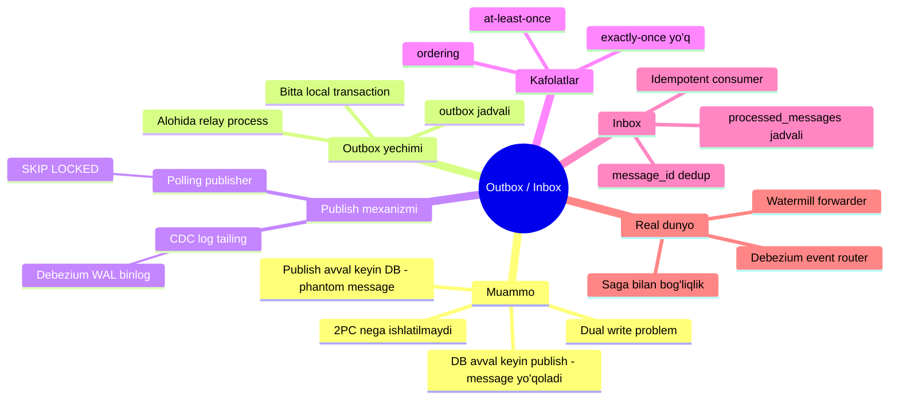
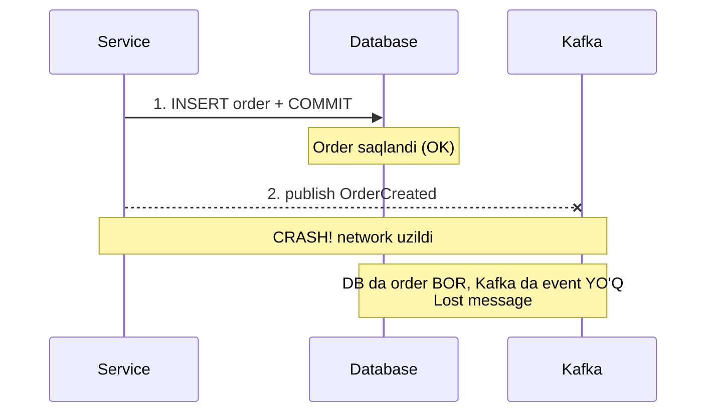
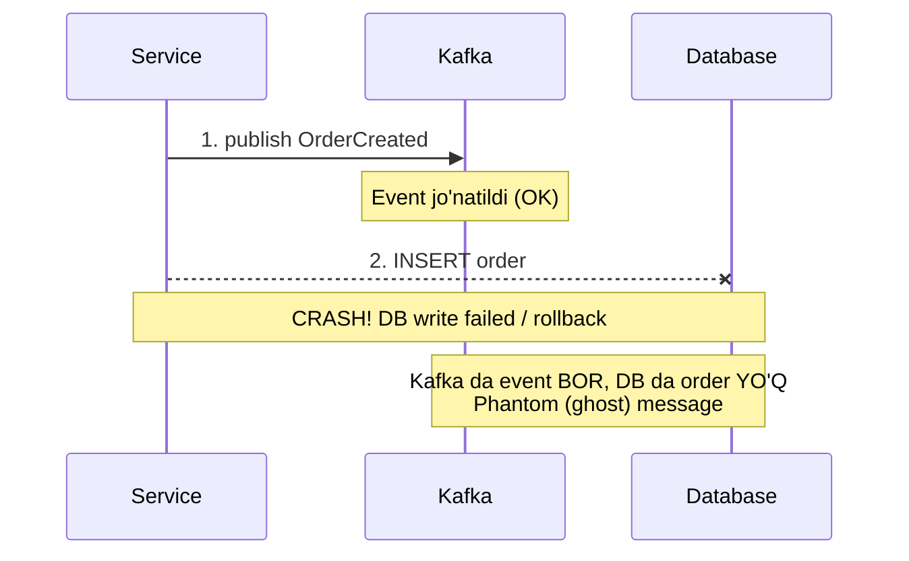
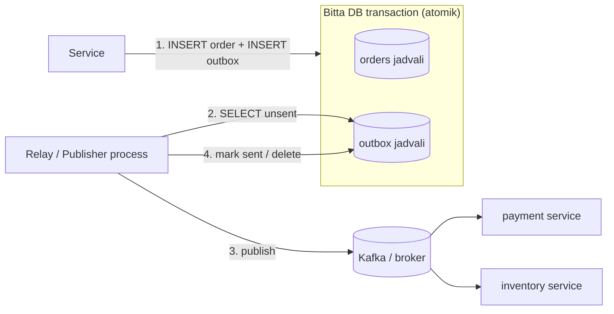
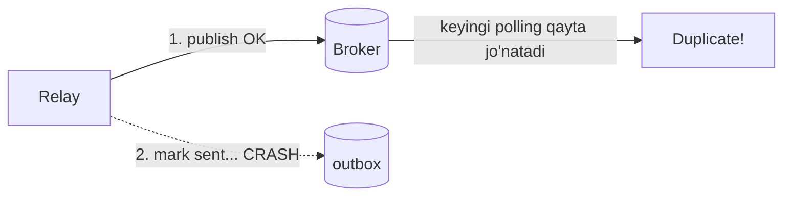
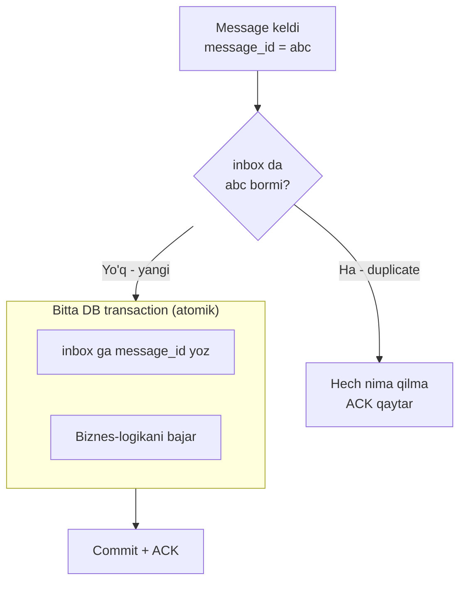
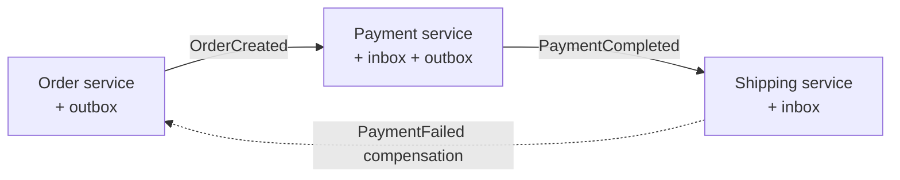

# Transactional Outbox / Inbox Pattern

## TL;DR

Mikroservisda ko'pincha bitta amalni bajarganda **ikkita joyga** yozish kerak bo'ladi: o'z database'ingga (order saqlash) va message broker'ga (Kafka'ga `OrderCreated` event jo'natish). Muammo shundaki, bu ikki yozuvni **atomik** (birga muvaffaqiyat yoki birga bekor) qilib bo'lmaydi — bu **dual write problem**.

**Outbox pattern** buni hal qiladi: event'ni broker'ga to'g'ridan-to'g'ri jo'natish o'rniga, biznes ma'lumoti bilan **bitta local transaction ichida** maxsus `outbox` jadvaliga yozamiz. Keyin alohida process (relay) outbox'ni o'qib, broker'ga jo'natadi.

**Inbox pattern** — consumer tomonining javobi: har bir message'ni bir marta ishlash uchun `inbox` jadvalida `message_id` bo'yicha duplicate'larni filtrlaydi (idempotent consumer).

> Oltin qoida: **Ikki tizimga yozishni bitta tizimga yozishga aylantir.** DB va broker'ga birga yoza olmasang — ikkalasini ham DBga yoz, keyin birini asta broker'ga ko'chir.

---

## Mavzu xaritasi



---

## 1. Muammo: Dual Write Problem

### Hook — nega bu kerak?

Tasavvur qil: e-commerce servisingda foydalanuvchi order beradi. Sen ikki ishni qilishing kerak:

1. `orders` jadvaliga order yozish (database).
2. `OrderCreated` event'ini Kafka'ga jo'natish — chunki `payment`, `inventory`, `notification` servislari buni kutmoqda.

Kod oddiy ko'rinadi:

```go
db.Save(order)              // 1-yozuv: database
kafka.Publish(orderEvent)   // 2-yozuv: broker
```

Lekin bu ikki qator **ikki xil tizimga** yozadi va ular orasida **atomiklik yo'q**. Aynan shu ikki qator butun distributed system'ingni buzishi mumkin.

### Analogiya — pochta qutisi

Sen muhim shartnomani rasmiylashtiryapsan. Ikki ish qilishing kerak:

- Shartnomani **seyfga** solib qulflash (database).
- Nusxasini **pochta orqali** hamkorlarga jo'natish (broker).

Agar seyfga solib, keyin pochtaga borishga ulgurmasdan uyingga ketib qolsang — hamkorlar shartnomadan bexabar. Agar avval pochtaga jo'natib, keyin seyfga solayotganda seyf buzilsa — hamkorlarda mavjud bo'lmagan shartnoma nusxasi bor.

> Outbox g'oyasi: shartnomani seyfga solayotganingda, **o'sha seyfga** "jo'natilishi kerak" degan xatni ham qo'shib qo'yasan. Keyin kotib har kuni seyfni ochib, jo'natilmagan xatlarni pochtaga tashiydi. Seyf qulflandimi — xat ham kafolatlangan, kotib albatta jo'natadi.

Analogiya chegarasi: seyf (DB) va kotib (relay) — ikki alohida narsa; kotib bir xatni ikki marta jo'natib yuborishi mumkin (buni keyin ko'ramiz).

### Sodda ta'rif

> **Dual write problem** — bitta amal ichida ikki mustaqil tizimga (odatda DB va message broker) yozish kerak bo'lganda, ularni atomik (birga commit yoki birga rollback) qilib bo'lmasligidan kelib chiqadigan inconsistency muammosi.

### Diagramma — ikki tartib, ikki falokat

**1-holat: avval DB, keyin publish** (message yo'qoladi)



**2-holat: avval publish, keyin DB** (phantom message)



Ikkala tartib ham buziladi:

| Tartib | Nima bo'ladi | Oqibat |
|--------|--------------|--------|
| Avval DB, keyin publish | Publish'dan oldin crash | **Lost message** — order bor, lekin hech kim xabardor emas |
| Avval publish, keyin DB | DB write fail bo'ladi | **Phantom message** — mavjud bo'lmagan order haqida event tarqaydi |

### Nega DB transaction + Kafka publish'ni birlashtirib bo'lmaydi?

Savol tabiiy: "SQL transaction ichiga Kafka publish'ni qo'ysak-chi?"

Bo'lmaydi, chunki:

- **Kafka transaction'i tashqi database'ni qamrab ololmaydi.** Kafka'ning o'z transaction'i bor, DB'ning o'z transaction'i bor — ular bir-birini bilmaydi. Birini rollback qilsang, ikkinchisi allaqachon commit qilingan bo'lishi mumkin.
- **Distributed transaction (2PC — two-phase commit)** nazariy yechim, lekin amalda ishlatilmaydi:
  - Sekin — coordinator ikki bosqichda hamma qatnashchini kutadi (yuqori latency).
  - Coupling — DB va broker bir-biriga qattiq bog'lanadi; biri o'lsa, ikkinchisi ham bloklanadi.
  - Ko'p broker (jumladan Kafka) va cloud DB'lar XA/2PC'ni to'liq qo'llab-quvvatlamaydi.
  - Operatsion murakkablik va nozik failure holatlari.

> Xulosa: atomik "DB + broker" yozuvi amalda mumkin emas. Shuning uchun muammoni **bitta tizim ichiga** ko'chiramiz — bu Outbox pattern.

### Ko'p uchraydigan xatolar (bu bosqichda)

- ⚠️ **"try/catch bilan hal qilaman"** — noto'g'ri tasavvur: publish fail bo'lsa DB'ni ham qaytaraman. Nega noto'g'ri: DB allaqachon commit qilingan bo'lishi mumkin, yoki compensating rollback paytida yana crash bo'ladi. To'g'risi: retry + outbox.
- ⚠️ **"publish deyarli hech qachon fail bo'lmaydi, e'tibor bermayman"** — noto'g'ri: network, broker restart, deploy paytida albatta bo'ladi. Katta hajmda "kamdan-kam" degani "har kuni bir necha marta" demakdir.

---

## 2. Yechim: Transactional Outbox

### G'oya

Ikki tizimga yozish o'rniga — **faqat database'ga** yozamiz, lekin ikki jadvalga bitta transaction ichida:

1. Biznes ma'lumoti → `orders` jadvali.
2. Jo'natilishi kerak bo'lgan event → `outbox` jadvali.

Ikkalasi **bitta local transaction**. Transaction commit bo'ldimi — ikkala yozuv ham bor. Rollback bo'ldimi — ikkalasi ham yo'q. Bu **atomiklik** kafolati, chunki bitta DBning bitta transaction'i.

Keyin **alohida process** (relay / message publisher) outbox jadvalini o'qib, event'larni broker'ga jo'natadi va "sent" deb belgilaydi.

### Diagramma — outbox oqimi



### Outbox jadval sxemasi (SQL)

```sql
-- --- outbox jadvali: jo'natilishi kutilayotgan event'lar "pochta qutisi" ---
CREATE TABLE outbox (
    id             UUID PRIMARY KEY DEFAULT gen_random_uuid(),
    aggregate_type VARCHAR(255) NOT NULL,   -- masalan: "order"
    aggregate_id   VARCHAR(255) NOT NULL,   -- qaysi order (ordering uchun key)
    event_type     VARCHAR(255) NOT NULL,   -- masalan: "OrderCreated"
    payload        JSONB        NOT NULL,   -- event tanasi (JSON)
    created_at     TIMESTAMPTZ  NOT NULL DEFAULT now(),
    sent_at        TIMESTAMPTZ              -- NULL = hali jo'natilmagan
);

-- Faqat jo'natilmaganlarni tez topish uchun partial index
CREATE INDEX idx_outbox_unsent
    ON outbox (created_at)
    WHERE sent_at IS NULL;
```

`aggregate_id` — bir aggregate'ning event'lari tartibini saqlash uchun kerak (masalan Kafka partition key sifatida). `sent_at IS NULL` bo'yicha partial index relay so'rovini tez qiladi.

### Worked example — transaction ichida order + outbox

```go
// --- Bitta local transaction ichida order VA outbox yozuvi ---
func CreateOrder(ctx context.Context, db *pgxpool.Pool, o Order) error {
    // --- 1-qadam: transaction ochamiz ---
    tx, err := db.Begin(ctx)
    if err != nil {
        return err
    }
    defer tx.Rollback(ctx) // commit bo'lmasa, avtomatik bekor bo'ladi

    // --- 2-qadam: biznes ma'lumot -> orders jadvali ---
    _, err = tx.Exec(ctx,
        `INSERT INTO orders (id, customer_id, amount, status)
         VALUES ($1, $2, $3, 'CREATED')`,
        o.ID, o.CustomerID, o.Amount)
    if err != nil {
        return err
    }

    // --- 3-qadam: XUDDI SHU transaction ichida outbox yozuvi ---
    payload, _ := json.Marshal(OrderCreated{OrderID: o.ID, Amount: o.Amount})
    _, err = tx.Exec(ctx,
        `INSERT INTO outbox (aggregate_type, aggregate_id, event_type, payload)
         VALUES ('order', $1, 'OrderCreated', $2)`,
        o.ID, payload)
    if err != nil {
        return err
    }

    // --- 4-qadam: ikkalasini BIRGA commit -> atomik ---
    return tx.Commit(ctx)
}
```

**Notional machine — aslida nima sodir bo'ladi?** `tx.Begin` DBda transaction ochadi (hali hech narsa boshqalarga ko'rinmaydi). Ikki `INSERT` DBning transaction buffer'iga tushadi. `tx.Commit` esa WAL (Write-Ahead Log)'ga bir marta yozib, ikkala qatorni ham **bir vaqtda** ko'rinadigan qiladi. Agar 3-qadamdan keyin crash bo'lsa — `defer Rollback` ishlaydi, `orders`'dagi yozuv ham yo'qoladi. Demak "order bor, outbox yo'q" holati **fizik jihatdan mumkin emas**.

### 🤔 O'ylab ko'r

Agar `CreateOrder` muvaffaqiyatli commit bo'ldi, lekin relay process hali ishga tushmagan (yoki o'lik) bo'lsa — event'chi nima bo'ladi? Yo'qoladimi?

<details>
<summary>💡 Javobni ko'rish</summary>

Yo'qolmaydi. Event `outbox` jadvalida `sent_at IS NULL` holatida **turaveradi**. Relay qachon tiklansa, o'sha yozuvni ko'radi va jo'natadi. Bu outbox'ning kuchi: broker vaqtincha o'lik bo'lsa ham, deploy bo'layotgan bo'lsa ham — event DBda xavfsiz saqlanadi, "kechiktirilib" yetkaziladi. Bu **latency** bilan **reliability** o'rtasidagi savdo (trade-off): event millisekund emas, balki soniyalar keyin kelishi mumkin, lekin **albatta keladi**.

</details>

---

## 3. Publish mexanizmlari: Polling vs CDC

Outbox jadvalini broker'ga qanday ko'chiramiz? Ikki asosiy yondashuv bor.

### 3.1 Polling Publisher

**G'oya:** alohida goroutine har necha yuz millisekundda outbox jadvalini SELECT qiladi, jo'natilmaganlarni oladi, publish qiladi, "sent" deb belgilaydi.

**Muammo:** agar bir nechta relay instance ishlayotgan bo'lsa (yoki bir instance ikki goroutine bilan), ikkalasi ham bir xil qatorlarni o'qib, event'ni **ikki marta** publish qilishi mumkin.

**Yechim — `SELECT ... FOR UPDATE SKIP LOCKED`:** bu Postgres imkoniyati bir necha worker'ga bir jadvalni bir-birini bloklamasdan bo'lib olishni beradi. Har worker boshqa worker band qilib turgan qatorlarni **o'tkazib yuboradi** (skip), faqat bo'shlarini oladi.

```go
// --- Har 500ms da outbox'ni tekshiruvchi relay loop ---
func relayLoop(ctx context.Context, db *pgxpool.Pool, broker Broker) {
    ticker := time.NewTicker(500 * time.Millisecond)
    defer ticker.Stop()
    for {
        select {
        case <-ctx.Done():
            return
        case <-ticker.C:
            if err := publishBatch(ctx, db, broker); err != nil {
                log.Printf("relay xato: %v", err)
            }
        }
    }
}
```

```go
// --- Bir batch outbox yozuvini publish qilish ---
func publishBatch(ctx context.Context, db *pgxpool.Pool, broker Broker) error {
    tx, err := db.Begin(ctx)
    if err != nil {
        return err
    }
    defer tx.Rollback(ctx)

    // --- 1-qadam: jo'natilmaganlarni BAND QILIB olamiz (SKIP LOCKED) ---
    rows, err := tx.Query(ctx, `
        SELECT id, aggregate_id, event_type, payload
          FROM outbox
         WHERE sent_at IS NULL
         ORDER BY created_at
         LIMIT 100
         FOR UPDATE SKIP LOCKED`)
    if err != nil {
        return err
    }
    var msgs []Message
    for rows.Next() {
        var m Message
        _ = rows.Scan(&m.ID, &m.Key, &m.Type, &m.Payload)
        msgs = append(msgs, m)
    }
    rows.Close()

    // --- 2-qadam: har birini broker'ga publish qilamiz ---
    ids := make([]string, 0, len(msgs))
    for _, m := range msgs {
        if err := broker.Publish(ctx, m); err != nil {
            return err // rollback -> lock bo'shaydi, keyingi urinishda qayta olinadi
        }
        ids = append(ids, m.ID)
    }

    // --- 3-qadam: "sent" deb belgilaymiz va commit ---
    if len(ids) > 0 {
        _, err = tx.Exec(ctx,
            `UPDATE outbox SET sent_at = now() WHERE id = ANY($1)`, ids)
        if err != nil {
            return err
        }
    }
    return tx.Commit(ctx)
}
```

**Notional machine:** `FOR UPDATE SKIP LOCKED` tanlangan qatorlarga **row-level lock** qo'yadi. Transaction commit yoki rollback bo'lgunicha lock ushlanadi. Boshqa worker `SKIP LOCKED` tufayli bu qatorlarni ko'rmagandek o'tib ketadi — shu bilan ikki worker **turli batch** oladi, duplicate publish keskin kamayadi va gorizontal masshtablanish "bepul" chiqadi.

> Diqqat: `FOR UPDATE SKIP LOCKED` bir aggregate'ning qatorlarini turli worker'larga bo'lib yuborishi mumkin — bu **global ordering'ni buzadi**. Agar tartib muhim bo'lsa, bitta relay instance ishlat yoki `aggregate_id` bo'yicha partition qil.

### 🤔 O'ylab ko'r

Yuqoridagi kodda 2-qadamda `broker.Publish` muvaffaqiyatli bo'ldi, lekin 3-qadam `UPDATE`dan oldin process crash bo'ldi. Keyin nima bo'ladi?

<details>
<summary>💡 Javobni ko'rish</summary>

Transaction commit bo'lmagani uchun `UPDATE sent_at` **bekor** bo'ladi — o'sha qatorlar hamon `sent_at IS NULL`. Keyingi polling'da ular yana olinadi va broker'ga **yana bir marta** publish qilinadi. Natijada consumer **duplicate** message oladi.

Bu aynan **at-least-once** semantikasining sababi: publish bo'ldi, lekin "belgilash" bo'lmadi. Shuning uchun consumer **idempotent** bo'lishi shart — bu bizni Inbox pattern'ga olib keladi.

</details>

### 3.2 Transaction Log Tailing / CDC

**G'oya:** outbox jadvalini SELECT qilish o'rniga, DBning **transaction log'ini** (Postgres: WAL, MySQL: binlog, DynamoDB: streams) o'qiymiz. Har bir yangi outbox qatori log'ga yozilishi bilanoq, uni ushlab broker'ga jo'natamiz.

Buni **Debezium** kabi CDC (Change Data Capture) vositasi qiladi: Postgres'ning logical replication'iga ulanadi, `outbox`ga bo'lgan `INSERT`larni real-time tutadi va Kafka'ga yo'naltiradi.

**Afzallik:** DBga qo'shimcha polling so'rovi yo'q, latency past (deyarli real-time), log tartibi tabiiy saqlanadi.

**Kamchilik:** DBga bog'liq (har DB uchun alohida yechim), Debezium + Kafka Connect kabi infra kerak, duplicate'lardan qochish nozik (log offset qayta o'qilishi mumkin).

### Taqqoslash jadvali: Polling vs CDC

| Xususiyat | Polling Publisher | CDC / Transaction log tailing |
|-----------|-------------------|-------------------------------|
| **Ishlash prinsipi** | Relay davriy ravishda `SELECT ... FOR UPDATE SKIP LOCKED` qiladi | WAL / binlog o'qilib o'zgarishlar tutiladi |
| **Latency** | Yuqoriroq (polling intervaliga bog'liq) | Past (deyarli real-time) |
| **DB yuki** | Doimiy SELECT (bo'sh bo'lsa ham) | Qo'shimcha so'rov yo'q, log o'qiladi |
| **Murakkablik** | Sodda, har SQL DBda ishlaydi | Murakkab: Debezium/Kafka Connect infra |
| **DBga bog'liqlik** | Yo'q (standart SQL) | Bor (WAL/binlog/streams) |
| **Ordering** | Qiyinroq (SKIP LOCKED buzishi mumkin) | Log tartibi tabiiy saqlanadi |
| **Duplicate** | Bor (mark-sent oldidan crash) | Bor (offset qayta o'qilishi) |
| **Qachon ishlatiladi** | Kichik/o'rta yuk, sodda stack, tez boshlash | Yuqori yuk, past latency, katta miqyos |

> Amaliy maslahat: **polling'dan boshla** (sodda, tez ishga tushadi). Yuk oshib, latency muhim bo'lsa CDC'ga o't. Ko'p loyihada bitta polling relay instance yetarli.

### Ko'p uchraydigan xatolar

- ⚠️ **"SKIP LOCKED'siz oddiy SELECT qilaman"** — noto'g'ri: bir necha instance bir xil qatorni oladi, katta duplicate. To'g'risi: `FOR UPDATE SKIP LOCKED` yoki bitta instance.
- ⚠️ **"BATCH_SIZE'ni 10000 qilaman, tezroq bo'ladi"** — noto'g'ri: uzun transaction uzoq lock ushlaydi, lag va contention oshadi. To'g'risi: 50–200 oralig'i.

---

## 4. Delivery semantikasi

### At-least-once — nega?

Outbox pattern **at-least-once** (kamida bir marta) yetkazishni kafolatlaydi:

- **Yo'qolmaydi** — event DBda commit bo'lgan, relay uni albatta jo'natadi (kerak bo'lsa qayta-qayta).
- **Ikki marta kelishi mumkin** — relay publish qilib, "sent" belgilashdan oldin crash bo'lsa, keyin yana publish qiladi.

### Nega exactly-once yo'q?

"Exactly-once" (aynan bir marta) — ikki tizim orasida umuman mumkin emas, chunki **"broker'ga publish" va "outbox'ni sent deb belgilash" ham dual write'dir!** Ya'ni delivery bosqichida yana o'sha muammo qaytadi:



Agar 1 va 2ni atomik qila olsak, boshidanoq dual write muammosi bo'lmasdi. Demak duplicate'dan qochib bo'lmaydi — faqat consumer tomonda ularni **filtrlash** mumkin.

> Amaliy formula: **at-least-once delivery + idempotent consumer = effectively-once processing.** Ya'ni message ikki marta kelsa ham, natija bir marta ishlangandek bo'ladi.

### Ordering (tartib)

Bir aggregate ustida `T1, T2` transaction'lar ketma-ket bajarilsa, ular `E1, E2` event'larni chiqaradi. `T1` `T2`dan oldin bo'lgani uchun `E1` `E2`dan oldin publish bo'lishi kerak.

- Bitta relay + `ORDER BY created_at` → tartib saqlanadi.
- Bir nechta worker + `SKIP LOCKED` → global tartib **buzilishi mumkin**.
- Yechim: **per-key ordering** — bir `aggregate_id`ning event'larini bir partition/worker'ga biriktir (Kafka'da partition key sifatida `aggregate_id`).

---

## 5. Inbox Pattern (Idempotent Consumer)

### Muammo — hook

Yuqorida ko'rdik: outbox at-least-once beradi, ya'ni consumer **duplicate** message oladi. Agar consumer har message'da hisobdan pul yechsa, duplicate = ikki marta yechildi. Falokat.

### Analogiya — mehmonlar ro'yxati

Tadbirga kiraverishda nazoratchi bor. Har kelgan mehmonning ismini **ro'yxatga** yozadi. Agar kimdir ikkinchi marta kirmoqchi bo'lsa, nazoratchi ro'yxatni ko'radi: "sen allaqachon kirgansan" — kiritmaydi.

Inbox jadvali — o'sha ro'yxat. `message_id` — mehmon ismi. Bir marta ishlangan message ikkinchi marta ishlanmaydi.

### Sodda ta'rif

> **Inbox pattern (idempotent consumer)** — consumer har message'ning `message_id`sini `inbox`/`processed_messages` jadvalida saqlab, allaqachon ishlangan message'larni aniqlab (dedup), ularni qayta ishlamaslik. Biznes-logika va inbox yozuvi **bitta transaction**da bajariladi.

### Diagramma — inbox dedup oqimi



### Inbox jadval sxemasi (SQL)

```sql
-- --- inbox: ishlangan message_id lar "mehmonlar ro'yxati" ---
CREATE TABLE inbox (
    message_id   UUID PRIMARY KEY,        -- broker/producer bergan unikal ID
    processed_at TIMESTAMPTZ NOT NULL DEFAULT now()
);
```

`message_id` PRIMARY KEY bo'lgani uchun bir xil ID ikki marta yozilmaydi — dedup shu unique constraint'ga tayanadi.

### Worked example — idempotent consumer

```go
// --- Kelgan message'ni idempotent tarzda ishlash ---
func handleMessage(ctx context.Context, db *pgxpool.Pool, m Message) error {
    // --- 1-qadam: transaction ochamiz ---
    tx, err := db.Begin(ctx)
    if err != nil {
        return err
    }
    defer tx.Rollback(ctx)

    // --- 2-qadam: message_id ni inbox ga yozishga urinamiz ---
    ct, err := tx.Exec(ctx,
        `INSERT INTO inbox (message_id) VALUES ($1)
         ON CONFLICT (message_id) DO NOTHING`, m.ID)
    if err != nil {
        return err
    }

    // --- 3-qadam: 0 qator qo'shildi = bu duplicate, o'tkazib yuboramiz ---
    if ct.RowsAffected() == 0 {
        return tx.Commit(ctx) // ACK qaytaramiz, lekin biznes-logika ishlamaydi
    }

    // --- 4-qadam: biznes-logika XUDDI SHU transaction ichida ---
    if err := applyBusinessLogic(ctx, tx, m); err != nil {
        return err // rollback: inbox yozuvi ham bekor bo'ladi -> qayta urinish mumkin
    }

    // --- 5-qadam: biznes o'zgarish + inbox yozuvi BIRGA commit ---
    return tx.Commit(ctx)
}
```

**Notional machine:** `ON CONFLICT DO NOTHING` — agar `message_id` allaqachon bor bo'lsa, INSERT hech nima qilmaydi va `RowsAffected() == 0` qaytaradi. Muhimi: biznes-logika (`applyBusinessLogic`) va inbox yozuvi **bir transaction**da. Shuning uchun "biznes bajarildi, lekin inbox yozilmadi" (yoki teskarisi) holati bo'lishi mumkin emas. Agar biznes-logika fail bo'lsa — inbox yozuvi ham rollback, message keyin qayta ishlanadi.

### 🤔 O'ylab ko'r

Nega inbox yozuvini biznes-logikadan **alohida** transaction'da qilmaslik kerak? Ya'ni avval `INSERT inbox` commit, keyin biznes-logika?

<details>
<summary>💡 Javobni ko'rish</summary>

Chunki u yana dual write'ga aylanadi! Agar `INSERT inbox` commit bo'lib, keyin biznes-logikadan oldin crash bo'lsa — `message_id` inbox'da "ishlangan" deb turadi, lekin biznes-logika **umuman bajarilmagan**. Message qayta kelganda "duplicate" deb o'tkazib yuboriladi va amal **butunlay yo'qoladi**.

Shuning uchun ikkalasi bitta transaction bo'lishi shart: yo ikkalasi ham bo'ladi, yo ikkalasi ham bo'lmaydi.

</details>

### Ko'p uchraydigan xatolar

- ⚠️ **"random UUID'ni consumer o'zi generatsiya qiladi"** — noto'g'ri: `message_id` **producer/broker** tomonidan barqaror berilishi kerak, aks holda duplicate'da ID har xil bo'lib, dedup ishlamaydi. Outbox'dagi `outbox.id`ni message ID sifatida ishlat.
- ⚠️ **"inbox jadvalini hech qachon tozalamayman"** — noto'g'ri: cheksiz o'sadi. To'g'risi: eski yozuvlarni davriy o'chir (masalan 30 kundan eski), yoki time-based partition.

---

## 6. Real dunyoda

### Debezium — Outbox Event Router

Debezium — eng mashhur CDC vositasi. Uning **Outbox Event Router SMT** (Single Message Transform) outbox pattern'ni "tayyor" holda beradi: Postgres WAL'dan outbox'ga bo'lgan INSERT'larni tutadi va Kafka topic'lariga yo'naltiradi.

Debezium kutadigan standart outbox jadval sxemasi:

| Ustun | Tur | Vazifasi |
|-------|-----|----------|
| `id` | UUID | Event unikal ID (dedup uchun, message header'ga tushadi) |
| `aggregatetype` | varchar | Qaysi Kafka **topic**ga borishini aniqlaydi (masalan `order`) |
| `aggregateid` | varchar | Message **key** (partition va ordering uchun) |
| `type` | varchar | Event turi (masalan `OrderCreated`) |
| `payload` | jsonb | Broker'ga jo'natiladigan asosiy ma'lumot |

`aggregatetype` topic nomini, `aggregateid` esa message key'ni belgilaydi — shu tufayli bir order'ning event'lari bir partition'da tartib bilan boradi.

### Watermill (Go) — Forwarder

**Watermill** — Go'da event-driven ilovalar uchun kutubxona. Uning **Forwarder** komponenti outbox pattern'ni implement qiladi:

- Sen SQL publisher'ni **decorator** bilan o'raysan; u message'larni broker o'rniga DBga (outbox rolidagi jadval) yozadi.
- Bu publish'ni biznes ma'lumot bilan **bitta transaction**da bajarish mumkin.
- Fon rejimida ishlaydigan **Forwarder daemon** o'sha jadvalni kuzatib, message'larni haqiqiy broker'ga (Kafka, Google Pub/Sub, ...) ko'chiradi.

```go
// --- Watermill: publisher'ni forwarder decorator bilan o'rash ---
pub := forwarder.NewPublisher(sqlPublisher, forwarder.PublisherConfig{
    ForwarderTopic: "outbox_topic", // DB dagi oraliq topic
})
// pub.Publish(...) endi biznes transaction ichida chaqiriladi,
// keyin Forwarder daemon uni haqiqiy broker'ga ko'chiradi.
```

MySQL, PostgreSQL, Firestore va Bolt qo'llab-quvvatlanadi.

---

## 7. Saga pattern bilan bog'liqligi

**Saga** — bir necha servisga tarqalgan biznes-jarayonni (masalan: order → payment → shipping) mahalliy transaction'lar zanjiri sifatida boshqaradigan pattern. Har qadam event/command chiqaradi, keyingi servis uni qabul qilib davom etadi.

Muammo: agar bir qadamdagi event **yo'qolsa**, butun saga **to'xtab qoladi** (order to'landi, lekin shipping'ga xabar bormadi). Bu yana dual write problem!

> Outbox — saga'ning "ishonchli asab tizimi": har saga qadami o'z local transaction'ida event'ni outbox'ga yozadi, relay uni kafolatli yetkazadi. Inbox esa har saga qadami command'ini **bir marta** ishlanishini ta'minlaydi (duplicate command = ikki marta to'lov bo'lmasin).



Ya'ni saga = "qanday qadamlar", outbox/inbox = "qadamlar orasidagi xabarlarni ishonchli yetkazish".

---

## 8. Kamchiliklar va ularni yumshatish

### Latency

Event darhol emas, relay uni olgandan keyin yetkaziladi. Polling'da bu polling intervaliga teng (masalan 500ms). Yumshatish: intervalni kichraytirish, yoki Postgres `LISTEN/NOTIFY` bilan relay'ni "uyg'otish", yoki CDC'ga o'tish.

### Outbox jadval o'sishi (cleanup)

Har event bir qator qoldiradi — jadval tez o'sadi, index sekinlashadi. Strategiyalar:

- **DELETE after publish** — `sent_at` belgilash o'rniga qatorni butunlay o'chirish (jadval doim kichik).
- **Davriy purge** — `DELETE FROM outbox WHERE sent_at < now() - interval '7 days'`.
- **Time-based partitioning** — kunlik partition, eskisini `DROP PARTITION` bilan tez o'chirish.

```sql
-- --- Bir haftadan eski jo'natilgan yozuvlarni tozalash ---
DELETE FROM outbox
 WHERE sent_at IS NOT NULL
   AND sent_at < now() - interval '7 days';
```

### Polling yuki

Bo'sh polling'lar ham DBga so'rov yuboradi. Yumshatish: adaptiv backoff (bo'sh bo'lsa interval oshadi), `LISTEN/NOTIFY`, yoki CDC.

### Developer intizomi

Eng nozik joy: dasturchi biznes yozuvi bilan birga outbox'ga yozishni **unutishi** mumkin. Yumshatish: repository/ORM darajasida event yozishni avtomatlashtirish (masalan domain event'larni commit'da avtomatik outbox'ga tushirish).

---

## Xulosa

- **Dual write problem** — DB va broker'ga atomik yoza olmaslik; ikki tartibda ham (lost message yoki phantom message) buziladi.
- **2PC** amaliy yechim emas: sekin, coupling, ko'p tizim qo'llab-quvvatlamaydi.
- **Outbox pattern** — biznes ma'lumot va event'ni **bitta local transaction**da DBga yozib, dual write'ni bitta yozuvga aylantiradi; alohida relay broker'ga ko'chiradi.
- **Polling vs CDC** — polling sodda va universal (`SELECT ... FOR UPDATE SKIP LOCKED`), CDC (Debezium/WAL) past latency lekin murakkab.
- **Delivery: at-least-once** — event yo'qolmaydi, lekin duplicate bo'lishi mumkin; exactly-once ikki tizim orasida imkonsiz.
- **Inbox pattern** — consumer `message_id` bo'yicha dedup qilib idempotent bo'ladi; biznes-logika + inbox yozuvi bitta transaction.
- **at-least-once + idempotent consumer = effectively-once.**
- Real dunyoda: Debezium event router, Watermill forwarder; saga event'larini ishonchli yetkazishda tayanch.

## 🧠 Eslab qol

- Ikki tizimga yozishni **bitta DB transaction**ga aylantir — bu outbox'ning butun mohiyati.
- Relay bir event'ni ikki marta jo'natishi mumkin, shuning uchun consumer **idempotent** bo'lishi shart.
- Inbox'da biznes-logika va `message_id` yozuvi **bir transaction**da bo'lishi majburiy.
- Polling'da `FOR UPDATE SKIP LOCKED` — bir nechta relay'ni duplicate'siz ishlatish kaliti.
- Exactly-once yo'q; maqsad — **effectively-once** (at-least-once + dedup).

## ✅ O'z-o'zini tekshir (retrieval practice)

**1.** Nega "avval publish, keyin DB'ga yozish" tartibi ham xavfli? Qanday nom bilan ataladi?

<details>
<summary>Javob</summary>

DB write fail bo'lsa, broker'da mavjud bo'lmagan amal haqida event turib qoladi — **phantom (ghost) message**. Consumer'lar bo'lmagan order'ni ishlaydi.

</details>

**2.** Outbox pattern nega exactly-once bera olmaydi?

<details>
<summary>Javob</summary>

Chunki "broker'ga publish" va "outbox'ni sent deb belgilash" — o'zi ham dual write. Publish'dan keyin, belgilashdan oldin crash bo'lsa, event qayta jo'natiladi. Duplicate'dan qochib bo'lmaydi, faqat consumer'da filtrlash mumkin.

</details>

**3.** Consumer'da `INSERT inbox`ni biznes-logikadan alohida transaction'da commit qilsak nima bo'ladi?

<details>
<summary>Javob</summary>

Yangi dual write yuzaga keladi: inbox commit bo'lib, biznes-logikadan oldin crash bo'lsa — message "ishlangan" deb belgilanadi, lekin amal bajarilmaydi. Qayta kelganda duplicate deb o'tkazib yuboriladi va amal **butunlay yo'qoladi**. Shuning uchun ikkalasi bir transaction bo'lishi shart.

</details>

**4.** `FOR UPDATE SKIP LOCKED`siz oddiy `SELECT ... WHERE sent_at IS NULL` ishlatsak, ikki relay instance bilan nima bo'ladi?

<details>
<summary>Javob</summary>

Ikkala instance ham bir xil qatorlarni o'qiydi va bir event'ni **ikki marta** publish qiladi — katta hajmda duplicate. `SKIP LOCKED` har worker'ga boshqasi band qilgan qatorlarni o'tkazib, faqat bo'shlarini olishga imkon beradi.

</details>

**5.** Polling relay latency'sini kamaytirishning CDC'siz yo'li qanday?

<details>
<summary>Javob</summary>

Polling intervalini kichraytirish (lekin DB yuki oshadi), yoki Postgres `LISTEN/NOTIFY` bilan yangi outbox yozuvi paydo bo'lganda relay'ni darhol "uyg'otish" — bo'sh polling'larsiz past latency.

</details>

## 🛠 Amaliyot

**1. Oson (Modify).** Yuqoridagi `publishBatch` funksiyasida `UPDATE outbox SET sent_at = now()` o'rniga **`DELETE FROM outbox WHERE id = ANY($1)`** qil. Bu qaysi cleanup strategiyasi? Qanday afzallik/kamchilik?

<details>
<summary>Hint</summary>

Jadval doim kichik qoladi (index tez), lekin jo'natilgan event'lar tarixi yo'qoladi (audit/debug qiyinlashadi). "Delete after publish" strategiyasi.

</details>

**2. O'rta (Faded example).** Idempotent consumer skeleton'ini to'ldir:

```go
func handlePayment(ctx context.Context, tx pgx.Tx, m Message) error {
    // TODO: message_id ni inbox ga INSERT ... ON CONFLICT DO NOTHING qil

    // TODO: agar RowsAffected() == 0 bo'lsa, duplicate -> nil qaytar (skip)

    // TODO: hisobdan pul yechish biznes-logikasini shu tx orqali bajar

    return nil
}
```

<details>
<summary>Hint</summary>

Tartib: (1) `tx.Exec("INSERT INTO inbox ... ON CONFLICT DO NOTHING", m.ID)`; (2) `if ct.RowsAffected() == 0 { return nil }`; (3) `tx.Exec("UPDATE accounts SET balance = balance - $1 WHERE id = $2", ...)`. Hammasi bir `tx` orqali — commit tashqarida.

</details>

**3. Qiyin (Make).** Noldan: `outbox` va `inbox` jadvallari, `CreateOrder` (transaction ichida order + outbox), polling relay goroutine (`SKIP LOCKED`, batch=50), va idempotent consumer yoz. `broker`ni oddiy in-memory channel bilan simulyatsiya qil, keyin relay'ni publish'dan keyin "belgilash"dan oldin ataylab crash qilib, consumer'da inbox duplicate'ni to'g'ri filtrlashini tekshir.

<details>
<summary>Hint</summary>

Test uchun: `broker.Publish`'dan keyin `panic`/`return err` qil (mark-sent'ga yetmasin). Relay qayta ishga tushganda o'sha event yana publish bo'ladi. Consumer'da birinchi marta biznes-logika ishlaydi, ikkinchi marta `inbox` `ON CONFLICT` tufayli skip qiladi. Balans **bir marta** o'zgargani = idempotency ishlayapti.

</details>

## Interview savollari

**1. Dual write problem nima va nega 2PC yechim emas?**

<details>
<summary>Javob</summary>

Bir amal ichida ikki mustaqil tizimga (DB + broker) atomik yoza olmaslik. 2PC nazariy hal qiladi, lekin: sekin (coordinator hammani kutadi), qattiq coupling (biri o'lsa hamma bloklanadi), ko'p broker/cloud DB uni qo'llab-quvvatlamaydi, operatsion murakkab. Shuning uchun amalda outbox ishlatiladi.

</details>

**2. Outbox pattern atomiklikni qanday ta'minlaydi?**

<details>
<summary>Javob</summary>

Biznes ma'lumot va event bitta **local DB transaction** ichida ikki jadvalga yoziladi. DBning ACID'i bir tizim ichida atomiklikni kafolatlaydi: commit bo'lsa ikkalasi bor, rollback bo'lsa ikkalasi yo'q. Broker'ga jo'natish esa keyin, alohida relay orqali.

</details>

**3. Polling publisher va CDC (log tailing) o'rtasidagi farq va tanlov mezoni?**

<details>
<summary>Javob</summary>

Polling: relay davriy SELECT qiladi (`SKIP LOCKED`), sodda, har SQL DBda ishlaydi, lekin latency va DB yuki bor. CDC: WAL/binlog o'qiladi, past latency, DBga qo'shimcha so'rov yo'q, lekin Debezium infra kerak va DBga bog'liq. Kichik/o'rta yukda polling, katta miqyos/past latency kerak bo'lsa CDC.

</details>

**4. Outbox at-least-once beradi. Consumer'da buni qanday xavfsiz qilasan?**

<details>
<summary>Javob</summary>

Inbox pattern (idempotent consumer): har message'ning barqaror `message_id`sini `inbox` jadvaliga yozib dedup qilaman. Biznes-logika + inbox yozuvi bitta transaction. Duplicate kelsa `ON CONFLICT DO NOTHING` tufayli skip bo'ladi. Natija: effectively-once.

</details>

**5. `message_id` qayerdan olinishi kerak va nega consumer o'zi generatsiya qilmasligi kerak?**

<details>
<summary>Javob</summary>

Producer/broker beradigan **barqaror** ID bo'lishi kerak (masalan `outbox.id`). Consumer o'zi random UUID bersa, bir message duplicate bo'lganda ID har xil chiqadi va dedup umuman ishlamaydi — ikki xil ID ikki xil yozuv sifatida ko'rinadi.

</details>

**6. Outbox jadvali cheksiz o'sishini qanday oldini olasan?**

<details>
<summary>Javob</summary>

Uch strategiya: (1) publish'dan keyin qatorni `DELETE` qilish (jadval doim kichik); (2) davriy purge — eski `sent_at` yozuvlarni o'chirish; (3) time-based partitioning va eski partition'ni `DROP`. Kichik jadval = tez partial index = tez polling.

</details>

## 🔁 Takrorlash

**Bog'liq oldingi mavzular:**

- [Idempotency](/Users/dev/Desktop/dev/dev/Patterns/1.%20Design%20Patterns/Stability%20patterns()/3.%20Idempotency.md) — inbox pattern to'g'ridan-to'g'ri shunga tayanadi.
- [Retry](/Users/dev/Desktop/dev/dev/Patterns/1.%20Design%20Patterns/Stability%20patterns()/2.%20Retry.md) — relay publish'ni qayta urinishi at-least-once'ning asosi.
- [Event Sourcing](/Users/dev/Desktop/dev/dev/Patterns/1.%20Design%20Patterns/Event%20Sourcing/Event%20Sourcing.md) — event'lar bilan ishlash falsafasi.
- [DDD Domain Events](/Users/dev/Desktop/dev/dev/Patterns/2.%20Architecture%20Patterns/DDD/DOMAIN%20EVENTS/Untitled.md) — outbox'ga tushadigan event'lar odatda domain event'lar.

**Takrorlash jadvali** — "O'z-o'zini tekshir" savollariga qaytish:

- **Ertaga** — 1, 2, 3-savollar (dual write, atomiklik, inbox transaction).
- **3 kundan keyin** — 4, 5-savollar (SKIP LOCKED, latency) + interview 3.
- **1 haftadan keyin** — barcha interview savollari + "Qiyin" amaliyotni yozib ko'r.

**Feynman testi:** Bu mavzuni kod so'zlarisiz, do'stingga 3 jumlada tushuntira olasanmi?

> Namuna: "Order saqlaganda Kafka'ga ham xabar berish kerak, lekin ikkalasini birga kafolatlab bo'lmaydi. Shuning uchun xabarni ham o'sha databasega, bitta transaction ichida 'jo'natiladiganlar' jadvaliga yozamiz; alohida ishchi keyin uni Kafka'ga ko'chiradi. Ishchi ba'zan bir xabarni ikki marta jo'natishi mumkin, shuning uchun qabul qiluvchi har xabar ID'sini eslab qolib, takrorini tashlab yuboradi."

---

## Manbalar

- [microservices.io — Transactional Outbox](https://microservices.io/patterns/data/transactional-outbox.html)
- [microservices.io — Polling Publisher](https://microservices.io/patterns/data/polling-publisher.html)
- [microservices.io — Transaction Log Tailing](https://microservices.io/patterns/data/transaction-log-tailing.html)
- [microservices.io — Idempotent Consumer](https://microservices.io/patterns/communication-style/idempotent-consumer.html)
- [Confluent — Understanding the Dual-Write Problem](https://www.confluent.io/blog/dual-write-problem/)
- [Debezium — Outbox Event Router](https://debezium.io/documentation/reference/stable/transformations/outbox-event-router.html)
- [Watermill — Forwarder](https://watermill.io/advanced/forwarder/)
- [event-driven.io — Outbox, Inbox patterns and delivery guarantees](https://event-driven.io/en/outbox_inbox_patterns_and_delivery_guarantees_explained/)
- [Transactional Outbox Pattern: From Theory to Production (SKIP LOCKED)](https://www.npiontko.pro/2025/05/19/outbox-pattern)
