# Cache Patterns (Caching strategiyalari)

> **Distributed Patterns — 3-dars**
> Oldingi bilim: `Stability patterns` (Circuit Breaker, Retry, Timeout) va System Design modulidagi caching asoslari ([`System Design/04-caching/`](../../../System%20Design/04-caching/)). U yerda cache **nima** ekanini o'rgangan bo'lsak, bu darsda cache-ni **qanday boshqarish** — ya'ni strategiyalarga (patternlarga) va ularning Go implementatsiyasiga chuqur kiramiz.

---

## TL;DR (qisqa mazmun)

Cache patternlar — "cache va asosiy manba (DB) orasidagi o'qish/yozish oqimini kim va qanday boshqaradi?" degan savolga beriladigan 5 ta klassik javob:

| Pattern | Bir jumlada |
|---------|-------------|
| **Cache-Aside** | Application o'zi boshqaradi: "avval cache-ga qara, miss bo'lsa DB-dan ol va cache-ga yoz". Eng keng tarqalgan. |
| **Read-Through** | Cache qatlamining o'zi miss bo'lganda DB-dan yuklaydi. Application DB-ni ko'rmaydi. |
| **Write-Through** | Yozuv cache orqali **sinxron** DB-ga boradi. Consistency zo'r, yozish sekin. |
| **Write-Behind (Write-Back)** | Yozuv avval faqat cache-ga, DB-ga **async batch** bilan. Juda tez, lekin data loss xavfi. |
| **Refresh-Ahead** | TTL tugashidan **oldin** cache-ni proaktiv yangilash. Hot data uchun miss-ni yashiradi. |

Va 3 ta o'lim tuzog'i: **cache stampede** (yechim: `singleflight`), **cache penetration** (yechim: negative caching + bloom filter), **hot key** (yechim: local cache + replikatsiya). Eng oxirida — 5 pattern taqqoslash jadvali va interview savollari.

---

## 1. Nega cache kerak? Latency piramidasi

### Muammo / Hook

Sen distributed backend yozyapsan. Bir user profilini ko'rsatish uchun DB-ga borasan — bu ~10 ms. Bitta user uchun sezilmaydi. Lekin sekundiga 50 000 so'rov kelsa, DB shu bir xil ishni 50 000 marta bajaradi: CPU 100%, disk I/O to'yingan, latency o'nlab marta oshadi. DB — tizimingdagi eng qimmat va eng qiyin masshtablanadigan qism. Cache aynan shu qimmat resursni asrash uchun bor.

### Analogiya — kutubxonachi va stol ustidagi kitoblar

Sen kutubxonachisan. Har kitob **omborda** (DB) — borib-kelish 10 daqiqa (sekin, qimmat). Eng ko'p so'raladigan 20 ta kitobni **stol ustiga** (cache = RAM) qo'yasan — cho'zilib olasan, 2 soniya.

- Mashhur kitob so'ralsa — stoldan berasan → **cache hit** (tez).
- Noyob kitob so'ralsa — omborga borasan → **cache miss** (sekin), keyin uni ham stolga qo'yasan.

**Analogiya chegarasi:** stol chekli — hamma kitob sig'maydi. Joy bo'shatish uchun kimni olib tashlash kerak degan savol tug'iladi (bu — **eviction**, 9-bo'limda). Cache-ning eng nozik joyi ham shu.

### Latency piramidasi — his qilib ko'r

Cache ishlashining butun sababi shu jadvalda: xotira turlari bir-biridan **ming-million baravar** farq qiladi (raqamlar Jeff Dean ("Numbers Every Programmer Should Know") va amaliy o'lchovlar asosida, taxminiy):

| Manba | Odatiy latency | DB-ga nisbatan |
|-------|---------------|----------------|
| L1 cache reference | ~1 ns | — |
| RAM (process ichida map) | ~100 ns | ~100 000x tez |
| Redis / Memcached (tarmoq orqali) | ~0.5-1 ms | ~50-200x tez |
| SSD random read | ~1 ms | ~50x tez |
| DB query (index bilan) | ~10-50 ms | 1x (bazaviy) |
| DB query (murakkab JOIN) | ~50-500 ms | 5-10x sekin |
| Boshqa DC-ga round trip | ~100-150 ms | — |

> **Oltin qoida:** Cache tezlik yutug'i emas — u **arxitektura himoyasi**. Cache DB-ni ortiqcha yukdan (va shu bilan tizimni qulashdan) asraydi. Latency — shunchaki yoqimli bonus.

### Cache hit / miss / hit ratio

- **Cache hit** — so'ralgan ma'lumot cache-da topildi (tez).
- **Cache miss** — cache-da yo'q, asosiy manbaga borish kerak (sekin).
- **Hit ratio** = `hits / (hits + misses)` — so'rovlarning necha foizi DB-siz javob oldi.

Nega hit ratio eng muhim metrika? Chunki u o'rtacha latency-ni bevosita belgilaydi. Miss ~100 ms, hit ~1 ms desak:

- 90% hit → o'rtacha `0.9x1 + 0.1x100` = **~11 ms**
- 99% hit → o'rtacha `0.99x1 + 0.01x100` = **~2 ms**

Ya'ni hit ratio-ni 90% dan 99% ga ko'tarish latency-ni yana ~5 baravar kamaytiradi. Shuning uchun caching optimizatsiyasi = hit ratio uchun kurash.

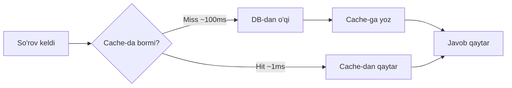

---

## 2. Cache-Aside (Lazy Loading) — eng keng tarqalgan pattern

### Muammo / Hook

Cache endigina qo'yildi — u bo'sh. Uni kim, qachon to'ldiradi? Eng oddiy va eng ko'p ishlatiladigan javob: **application-ning o'zi** boshqaradi. Bu pattern AWS hujjatlarida "lazy loading" deb ham ataladi, chunki ma'lumot cache-ga faqat **birinchi marta so'ralganda** ("dangasalik bilan") tushadi.

### Sodda ta'rif

> **Cache-Aside** — application avval cache-ga qaraydi; miss bo'lsa, o'zi DB-ga borib ma'lumotni oladi va keyingi safar uchun cache-ga yozib qo'yadi. Cache "chetda turadi" (aside), application uni to'g'ridan-to'g'ri boshqaradi.

### Diagramma — cache-aside oqimi

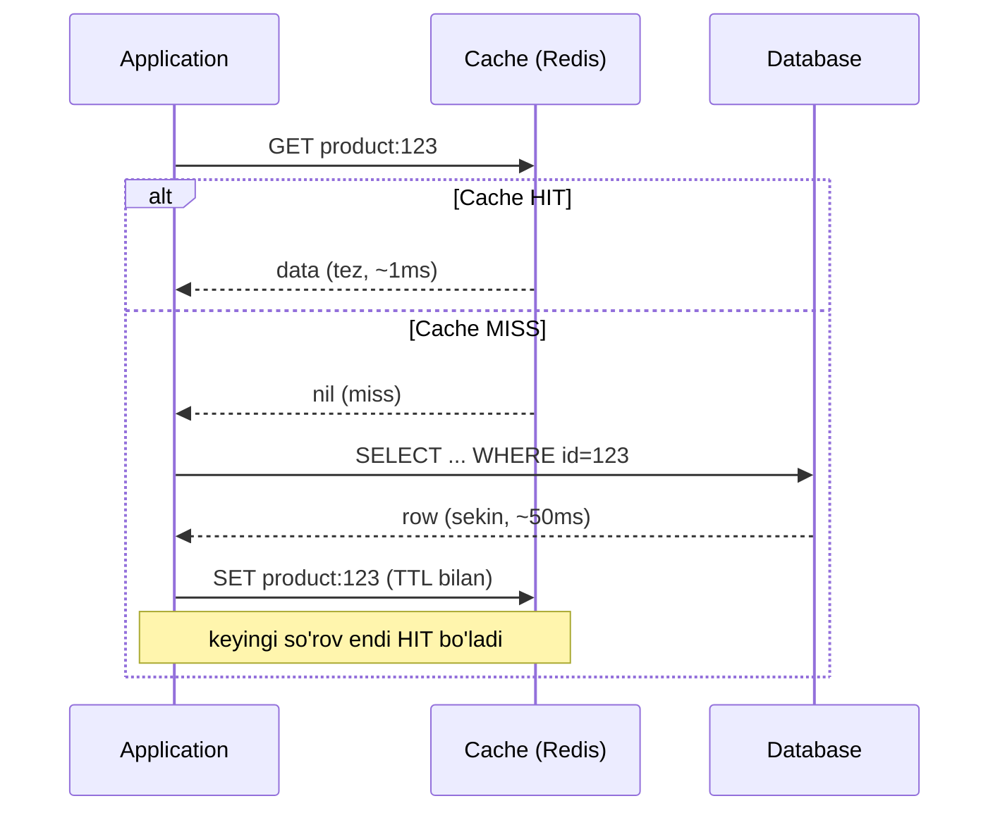

### Worked example — Go + Redis (subgoal label bilan)

```go
func GetProduct(ctx context.Context, id string) (*Product, error) {
    key := "product:" + id

    // --- 1-qadam: avval cache-ga qaraymiz (hit bo'lishini umid qilamiz) ---
    if b, err := rdb.Get(ctx, key).Bytes(); err == nil {
        var p Product
        _ = json.Unmarshal(b, &p)
        return &p, nil // HIT: DB-ga bormadik
    } else if err != redis.Nil {
        return nil, err // haqiqiy Redis xatosi (nil emas) — DB-ni bosmaymiz
    }

    // --- 2-qadam: MISS bo'ldi, asosiy manbadan (DB) o'qiymiz ---
    p, err := db.QueryProduct(ctx, id)
    if err != nil {
        return nil, err
    }

    // --- 3-qadam: keyingi safar HIT bo'lishi uchun cache-ga yozamiz ---
    if b, err := json.Marshal(p); err == nil {
        rdb.Set(ctx, key, b, 10*time.Minute) // TTL 10 daqiqa
    }
    return p, nil
}
```

**Notional machine (aslida nima bo'ladi):** `rdb.Get` tarmoq orqali Redis serveriga TCP paket yuboradi. Redis o'z RAM-idagi hash-table-dan `key`-ni qidiradi. Topsa — baytlarni qaytaradi (`err == nil`). Topmasa — maxsus `redis.Nil` xatosini qaytaradi. Diqqat: biz `err == redis.Nil` (miss) bilan boshqa xatolarni **ajratamiz** — Redis vaqtincha o'chib qolsa, har bir miss-ni DB-ga tashlab, DB-ni ham qulatib qo'ymaslik uchun.

### 🤔 O'ylab ko'r (PRIMM predict)

Agar 3-qadamda (`rdb.Set`) `err != redis.Nil` tekshiruvini olib tashlab, **har qanday** Get xatosida to'g'ridan-to'g'ri DB-ga borsak — Redis 30 soniyaga o'chib qolganda nima bo'ladi?

<details>
<summary>💡 Javobni ko'rish</summary>

Redis o'chsa, **har bir** so'rov "Get xatosi" oladi va to'g'ridan-to'g'ri DB-ga tushadi. Ya'ni cache himoyasi yo'qoladi va butun trafik (masalan 50 000 rps) DB-ga uriladi — DB qulaydi. Bu **cache-ni himoya deb bilishimizning** aynan sababi: cache o'lganda tizim **degraded** bo'lishi kerak, DB bilan birga **o'lmasligi** kerak. Shuning uchun ko'p tizimlar bu holatda circuit breaker + qat'iy rate limit qo'yadi.
</details>

### Kamchiliklar (⚠️ ko'p uchraydigan xatolar)

1. **First-miss latency (uch marta yurish).** Har miss = 3 ta operatsiya: cache-ga (nil), DB-ga (query), cache-ga (set). Birinchi so'ral aslida keshsizdan **sekinroq**. Yechim: muhim ma'lumotni oldindan **cache warming** (proaktiv to'ldirish) qilish.
2. **Stale data.** Cache faqat miss-da yoziladi; DB-da ma'lumot o'zgarsa, cache TTL tugaguncha eskirib turadi. Yechim: yozuvda invalidation (7-bo'lim).
3. **`redis.Nil`-ni oddiy xato bilan aralashtirish.** Yuqoridagi predict-da ko'rdik — miss va "Redis o'lgan" ni farqlamaslik DB-ni qulatadi.
4. **Xato natijani cache-lash.** DB xato qaytarsa, `nil`-ni cache-lama — aks holda TTL davomida hamma xato oladi.

---

## 3. Read-Through — cache o'zi yuklaydi

### Muammo / Hook

Cache-aside-da har chaqiruvchi joyda "cache-ga qara → DB → cache-ga yoz" mantig'ini **qo'lda** takrorlaysan. 10 ta funksiyada 10 marta yozasan — biri `redis.Nil`-ni tekshirmay qoladi, biri TTL qo'ymaydi. Xato tarqaladi.

### Yechim va farqi

> **Read-Through** — DB-dan yuklash mantig'i application-da emas, **cache qatlamining o'zida** yashaydi. Application faqat `cache.Get(key)` deydi; miss bo'lsa cache o'zi DB-ga borib, to'ldirib, qaytaradi. Application DB-ni **ko'rmaydi ham**.

Asosiy mantiq cache-aside bilan **bir xil** ("miss bo'lsa DB-dan yukla"). Yagona farq — bu mantiq **kimning ichida** turadi.

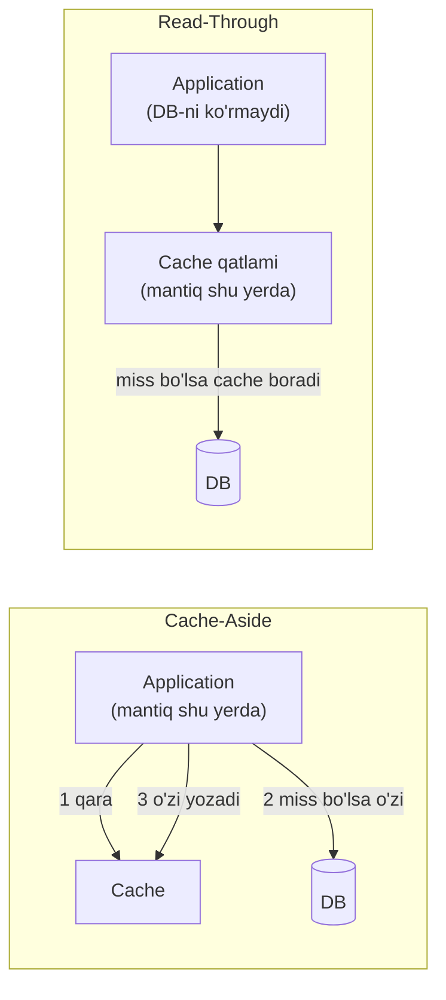

### Worked example — Go generic Read-Through cache

Go-da buni "loader" funksiyani cache ichiga berish orqali modellaymiz. Chaqiruvchi DB-ni ko'rmaydi:

```go
// ReadThroughCache — DB-ga borish mantig'i cache ICHIDA yashiringan
type ReadThroughCache[T any] struct {
    rdb    *redis.Client
    ttl    time.Duration
    loader func(ctx context.Context, key string) (T, error) // DB yuklovchi
}

func (c *ReadThroughCache[T]) Get(ctx context.Context, key string) (T, error) {
    var zero T
    // --- 1-qadam: cache ichida hit tekshiriladi ---
    if b, err := c.rdb.Get(ctx, key).Bytes(); err == nil {
        var v T
        _ = json.Unmarshal(b, &v)
        return v, nil
    } else if err != redis.Nil {
        return zero, err
    }
    // --- 2-qadam: MISS — cache O'ZI loader orqali DB-dan yuklaydi ---
    v, err := c.loader(ctx, key)
    if err != nil {
        return zero, err
    }
    // --- 3-qadam: cache o'zini o'zi to'ldiradi ---
    if b, err := json.Marshal(v); err == nil {
        c.rdb.Set(ctx, key, b, c.ttl)
    }
    return v, nil
}
```

Chaqiruvchi tomonda DB ko'rinmaydi — faqat toza `Get`:

```go
// Sozlash: loader bir marta beriladi
productCache := &ReadThroughCache[Product]{rdb: rdb, ttl: 10 * time.Minute,
    loader: func(ctx context.Context, key string) (Product, error) {
        return db.QueryProduct(ctx, key)
    }}

// Ishlatish: chaqiruvchi DB-ni butunlay unutdi
p, err := productCache.Get(ctx, "product:123")
```

### Cache-Aside vs Read-Through — jadval

| Xususiyat | Cache-Aside | Read-Through |
|-----------|-------------|--------------|
| DB-ga kim boradi? | Application kodi | Cache qatlami |
| Application DB-ni biladimi? | Ha | Yo'q (yashirin) |
| Kod takrorlanishi | Ko'p (har joyda) | Kam (bir marta) |
| Moslashuvchanlik | Yuqori (istalgan mantiq) | Cheklangan (qat'iy shakl) |
| Odatiy joyi | Application kodi | Library/framework (masalan `groupcache`) |

### ⚠️ Ko'p uchraydigan xato

**"Read-Through = boshqa pattern, u tezroq"** — noto'g'ri. Read-Through **tezlik jihatidan cache-aside bilan bir xil**; u faqat kod tashkilotchiligi (encapsulation) farqi. Chalkashlikning oldini olish uchun: read-through — bu cache-aside-ning "library ichiga yashirilgan" ko'rinishi.

---

## 4. Write-Through — yozuv cache orqali sinxron DB-ga

### Muammo / Hook

Shu paytgacha faqat **o'qishni** boshqardik. Endi user narxni o'zgartirsa — bu **yozish**. Ikkita nusxa bor: cache (Redis) va DB. Ularni qanday sinxron ushlaymiz? Eng ishonchli javob: har yozuvda **ikkalasiga ham darhol yoz**.

### Sodda ta'rif

> **Write-Through** — application yozuvni cache orqali (yoki cache bilan birga) **sinxron** DB-ga yozadi. Javob qaytganda **ikkala** joyda ham yangi qiymat turibdi. Cache hech qachon eskirmaydi.

### Worked example — Go

```go
func UpdatePriceWriteThrough(ctx context.Context, id string, price float64) error {
    // --- 1-qadam: asosiy manbaga (DB) yozamiz — HAQIQAT shu yerda ---
    if err := db.UpdatePrice(ctx, id, price); err != nil {
        return err // DB xato bersa cache-ga tegmaymiz
    }
    // --- 2-qadam: cache-ni ham DARHOL (sinxron) yangilaymiz ---
    p := Product{ID: id, Price: price}
    b, _ := json.Marshal(p)
    return rdb.Set(ctx, "product:"+id, b, 10*time.Minute).Err()
}
```

**Notional machine:** `db.UpdatePrice` diskka yozadi (fsync — sekin, ~ms), keyin `rdb.Set` Redis RAM-iga yozadi (tez). User `OK` olganda ikkala nusxa ham yangilangan — hech qanday "oraliq eskirish oynasi" yo'q. Diqqat: tartib **avval DB, keyin cache** (nega shunday — 10-bo'limda).

| Afzalligi | Kamchiligi |
|-----------|-----------|
| Cache va DB doim mos (strong-ga yaqin consistency) | Yozish sekin — ikki marta yozamiz |
| Yangilangan ma'lumot uchun miss bo'lmaydi | Kam o'qiladigan ma'lumot ham cache-ni behuda to'ldiradi (cache pollution) |
| O'qishga optimallashgan tizimda mukammal | Ikki yozuvdan biri muvaffaqiyatsiz bo'lsa — qisman nomuvofiqlik |

Write-Through ko'pincha **cache-aside bilan juftlanadi**: yozuv write-through, o'qish esa cache-aside. Bu — sanoat standarti (10-bo'lim).

### ⚠️ Ko'p uchraydigan xato

**Faqat cache-ga write-through qilib, o'qishni cache-aside qilmaslik.** Agar cache pollution-dan qo'rqib "write-through-ni faqat mashhur kalitlarga" cheklamoqchi bo'lsang — buni bilib qil. Ko'p ma'lumot bir marta yozilib deyarli o'qilmaydi; ularni write-through qilish RAM-ni behuda yeydi. Bunday ma'lumotga **write-around** (yozuvni to'g'ridan-to'g'ri DB-ga, cache-ni chetlab) to'g'riroq.

---

## 5. Write-Behind (Write-Back) — cache-ga yoz, DB-ga async batch

### Muammo / Hook

Sekundiga 500 000 increment (video view count, o'yin skori, metrikalar). Har birini darhol DB-ga yozsak — DB ko'tarolmaydi. Bu yerda tezlik ishonchlilikdan muhimroq: **avval cache-ga yoz, user-ga darhol `OK` de, DB-ni esa keyinroq batch qilib yangila**.

### Sodda ta'rif

> **Write-Behind (Write-Back)** — yozuv avval faqat cache-ga tushadi va darhol tasdiqlanadi; DB esa **asinxron**, fon rejimda, batch (to'plam) qilib yangilanadi. Juda tez, lekin flush-gacha cache o'chsa — ma'lumot yo'qoladi.

### Diagramma — Write-Through vs Write-Behind

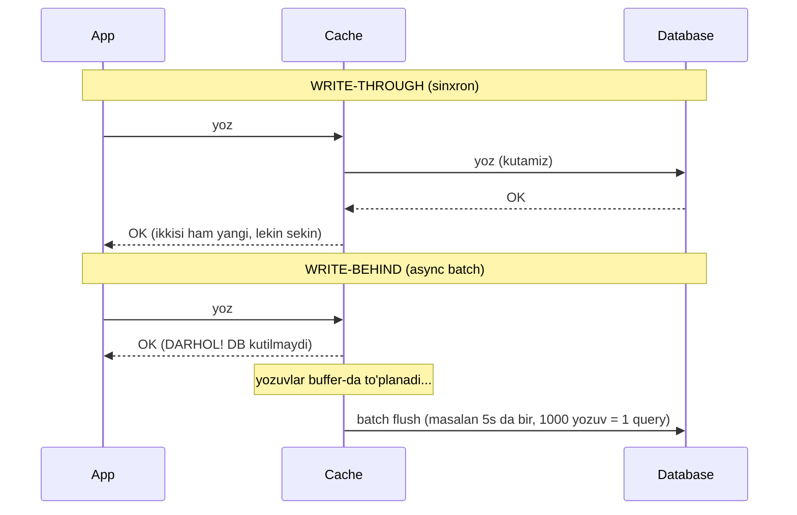

### Worked example — Go: buffered channel + background flusher

Go-da write-behind-ning eng tabiiy implementatsiyasi: yozuvlarni **buffered channel**-ga tashlaymiz, alohida goroutine ularni to'plab, davriy ravishda DB-ga batch qilib yozadi.

```go
type WriteBehind struct {
    buf chan writeOp        // buffered channel — yozuvlar navbati
    rdb *redis.Client
}
type writeOp struct{ key string; val []byte }

// --- 1-qadam: yozuv cache-ga tushadi va navbatga qo'yiladi, user kutmaydi ---
func (w *WriteBehind) Set(ctx context.Context, key string, val []byte) error {
    w.rdb.Set(ctx, key, val, 0)      // cache darhol yangi
    select {
    case w.buf <- writeOp{key, val}: // DB uchun navbatga qo'shildi
        return nil
    default:
        return errors.New("write buffer to'ldi (backpressure)") // buffer to'la
    }
}

// --- 2-qadam: fon goroutine buffer-ni to'plab, davriy batch yozadi ---
func (w *WriteBehind) runFlusher(ctx context.Context) {
    ticker := time.NewTicker(5 * time.Second)
    defer ticker.Stop()
    batch := make(map[string][]byte)

    flush := func() {
        if len(batch) == 0 { return }
        db.BatchUpsert(ctx, batch)    // 1000 yozuv = 1 katta query
        batch = make(map[string][]byte)
    }
    for {
        select {
        case op := <-w.buf:
            batch[op.key] = op.val    // takror kalit ustiga yozadi (dedup)
            if len(batch) >= 1000 { flush() } // buffer to'lsa darhol
        case <-ticker.C:
            flush()                   // vaqt kelsa flush (partial batch)
        case <-ctx.Done():
            flush()                   // to'xtashdan oldin oxirgi flush
            return
        }
    }
}
```

**Notional machine:** `w.buf` — bu Go runtime ichidagi navbat (ring buffer). `Set` unga element qo'shadi va darhol qaytadi (channel bo'sh joyi bo'lsa). Flusher goroutine `select` bilan uch manbadan birini kutadi: yangi yozuv, ticker signali yoki `ctx.Done()`. Bu — kitobdagi "Do not communicate by sharing memory; instead, share memory by communicating" prinsipi: mutex bilan umumiy map-ni qo'riqlash o'rniga, ma'lumotni channel orqali bitta egaga (flusher) uzatamiz.

> **Oltin qoida:** Write-behind-ni faqat **yo'qolishi maqbul** ma'lumot uchun ishlat (view count, metrika, o'yin skori). Bank puli, buyurtma, to'lovni **hech qachon** write-behind qilma.

### Data loss xavfi — diagramma

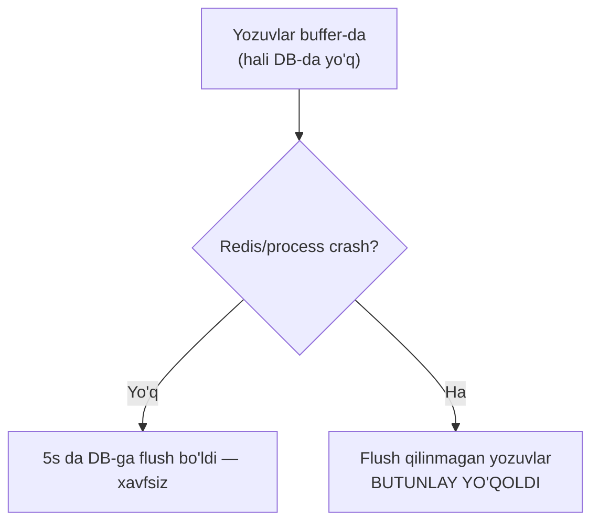

### 🤔 O'ylab ko'r (PRIMM predict)

Flusher har 5s da flush qiladi. Process 4-soniyada crash bo'ldi. Va `Set`-dagi `buf` **buffered** (sig'im 10000). Nima yo'qoladi?

<details>
<summary>💡 Javobni ko'rish</summary>

Oxirgi flush-dan keyingi (0-4 soniyada kelgan) **barcha** yozuvlar yo'qoladi — ular faqat channel buffer-da (RAM) edi, DB-ga yetib bormagan. Redis-ga yozilgan bo'lsa ham, Redis persistence (AOF/RDB) yoqilmagan bo'lsa u ham RAM-da. Xavfni kamaytirish: (1) flush oralig'ini qisqartirish, (2) Redis AOF `appendfsync everysec`, (3) yozuvni oldin durable log-ga (masalan Kafka) yozib, keyin write-behind. Lekin 0 xavf hech qachon kafolatlanmaydi — shuning uchun muhim ma'lumot write-behind qilinmaydi.
</details>

### ⚠️ Ko'p uchraydigan xato

**Buffer-ga backpressure qo'ymaslik.** Agar `buf` to'lsa va sen `default` (yoki drop) qo'ymasang, `w.buf <- op` **bloklanadi** — yozuvchi goroutine-lar qotib qoladi. Yoki cheksiz buffer qo'ysang, DB flush-dan sekin qolganda RAM to'lib OOM bo'ladi. Har doim: chekli buffer + to'lganda aniq siyosat (xato qaytar, drop qil yoki bloklan — bilib tanla).

---

## 6. Refresh-Ahead — TTL tugashidan oldin proaktiv yangilash

### Muammo / Hook

Mashhur kalit (masalan bosh sahifa) TTL-i tugaganda — o'sha lahzada u miss bo'ladi. Va o'sha bir zumda kelgan mingta so'rov birdaniga DB-ga uriladi (bu — cache stampede, 8-bo'lim). Buning oldini olishning bir yo'li: **TTL tugashini kutmaslik**, uni **oldindan** yangilab qo'yish.

### Sodda ta'rif

> **Refresh-Ahead** — cache elementi TTL-ning oxiriga yaqinlashganda (masalan 80% vaqt o'tganda), uni fon rejimida **oldindan** yangilab qo'yamiz. User doim hit oladi — u hech qachon "miss + DB kutish"-ni ko'rmaydi.

Read-Through-ning kengaytmasi deb bilsa bo'ladi: read-through miss-da **reaktiv** yuklaydi, refresh-ahead esa **proaktiv** yuklaydi.

### Diagramma — holat o'tishlari

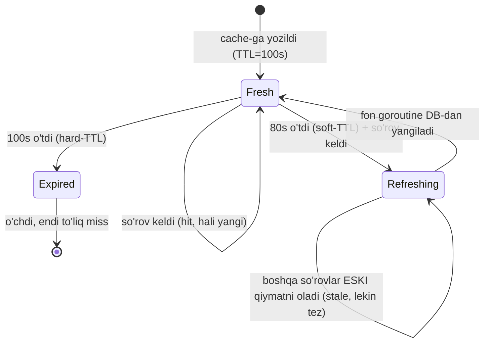

### Worked example — Go: soft-TTL bilan fon yangilash

G'oya: har elementga ikkita muddat qo'yamiz — **soft-TTL** (yangilashni boshlash vaqti) va **hard-TTL** (haqiqiy Redis TTL). So'rov soft-TTL-dan o'tgan elementni ko'rsa: eski qiymatni **darhol** qaytaradi (user kutmaydi), lekin fon goroutine-da yangilashni ishga tushiradi.

```go
type entry struct {
    Data     json.RawMessage `json:"data"`
    SoftTTL  time.Time       `json:"soft"` // shundan keyin proaktiv yangilanadi
}

func (c *RefreshAhead) Get(ctx context.Context, key string) ([]byte, error) {
    b, err := c.rdb.Get(ctx, key).Bytes()
    if err == redis.Nil {
        return c.loadAndStore(ctx, key) // to'liq miss — sinxron yukla
    } else if err != nil {
        return nil, err
    }
    var e entry
    _ = json.Unmarshal(b, &e)

    // --- soft-TTL o'tgan bo'lsa: eski qiymatni qaytar, FONDA yangila ---
    if time.Now().After(e.SoftTTL) {
        go func() {
            ctx := context.Background()
            _, _ = c.loadAndStore(ctx, key) // user kutmaydi
        }()
    }
    return e.Data, nil // doim tez javob (hatto stale bo'lsa ham)
}
```

**Notional machine:** `go func(){...}` yangi goroutine ochadi — u DB-ga borib yangilash bilan band bo'ladi, asosiy so'rov esa **kutmasdan** eski (lekin tez) qiymatni qaytaradi. Diqqat: `go`-goroutine-da chaqiruvchining `ctx`-ini ishlatma — u so'rov tugashi bilan bekor bo'ladi va yangilash to'xtaydi. Alohida `context.Background()` bering.

### ⚠️ Ko'p uchraydigan xatolar

1. **Fon yangilashni de-duplikatsiya qilmaslik.** Soft-TTL o'tgach, 1000 ta so'rov 1000 ta fon goroutine ochadi — bu yana stampede. Yechim: `singleflight` bilan bitta yangilashga cheklash (8-bo'lim).
2. **Har kalitga refresh-ahead qo'yish.** U faqat **hot** (tez-tez o'qiladigan, oldindan aytsa bo'ladigan) kalitlarga foydali. Kam o'qiladigan kalitlarni proaktiv yangilash — behuda DB yuki.
3. **Chaqiruvchi ctx-ni fon goroutine-ga berish.** So'rov tugashi bilan yangilash bekor bo'ladi va cache hech qachon yangilanmaydi.

---

## 7. Invalidation muammosi — cache-ni qachon o'chirish

### Muammo / Hook

> "Kompyuter fanida faqat ikkita qiyin narsa bor: cache invalidation va nomlarni tanlash." — Phil Karlton

DB o'zgardi, lekin cache-da eski nusxa. Uni qachon va qanday o'chiramiz? Uch yondashuv bor:

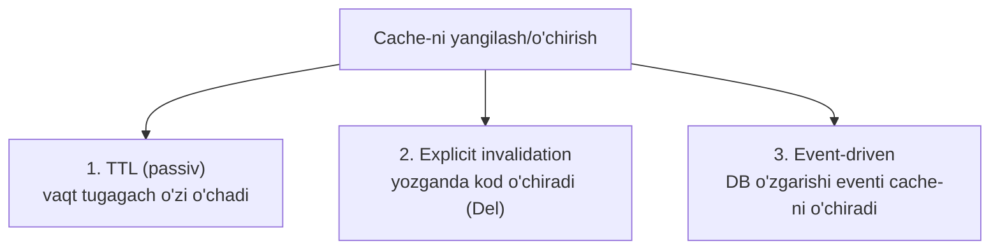

| Usul | Qanday ishlaydi | Afzalligi | Kamchiligi |
|------|-----------------|-----------|------------|
| **TTL** | Har element muddatga ega, tugaganda o'chadi | Oddiy, hech qanday kod kerak emas | TTL davomida stale bo'ladi |
| **Explicit** | Yozuv kodida `rdb.Del(key)` chaqiriladi | Deyarli darhol yangi | Har yozuv joyini eslab qolish kerak; distributed muhitda o'tkazib yuborish oson |
| **Event-driven** | DB change log (CDC/binlog/outbox) event-ni eshitib cache-ni o'chiradi | Application kodi bilmaydi ham, ishonchli | Infratuzilma murakkab (Kafka, Debezium) |

> **Oltin qoida:** TTL — bu "eng ko'p qancha eskirishi mumkin"ning **yuqori chegarasi**, yechim emas. Agar o'zgarish darhol ko'rinishi kerak bo'lsa — explicit yoki event-driven invalidation qo'sh, va TTL-ni **himoya to'ri** sifatida qoldir.

### Amaliy tavsiya

Ko'p tizim ikkalasini birga ishlatadi: **yozuvda explicit `Del` + har elementga zaxira TTL**. Explicit ishlamay qolsa (crash, bug), TTL baribir eskini tozalaydi. Bu — "belt and suspenders" (ikki qavat himoya).

---

## 8. Xavfli stsenariylar va yechimlar

Cache-ning eng mashhur uch falokati. Har birini interview-da so'rashadi.

### 8.1 Cache Stampede / Thundering Herd

**Muammo:** mashhur kalit TTL-i tugadi. O'sha lahzada kelgan 1000 ta so'rov barchasi miss ko'radi va **bir vaqtda** bir xil DB query-ni yuboradi. DB 1000 ta bir xil og'ir query-dan qulaydi. Bu — **cache stampede** (yoki **dogpile**, **thundering herd**).

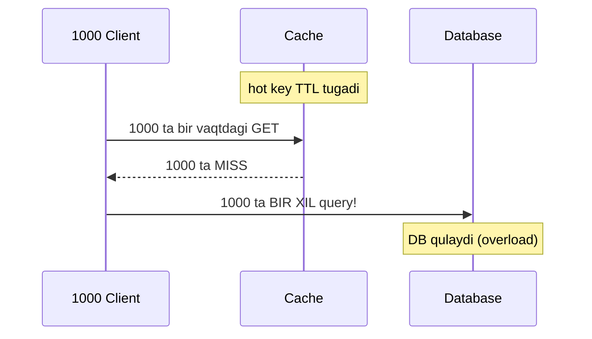

**Yechim: request coalescing (`singleflight`).** G'oya: bir xil kalit uchun bir vaqtda faqat **bitta** DB chaqiruvi "uchishda" (in-flight) bo'lsin. Qolgan 999 tasi o'sha bittasining natijasini **kutib**, birga oladi.

`golang.org/x/sync/singleflight` aynan buni beradi:

```go
import "golang.org/x/sync/singleflight"

type Cache struct {
    rdb *redis.Client
    g   singleflight.Group // bir xil kalit chaqiruvlarini birlashtiradi
}

func (c *Cache) Get(ctx context.Context, key string) ([]byte, error) {
    // --- 1-qadam: oddiy cache-aside hit tekshiruvi ---
    if b, err := c.rdb.Get(ctx, key).Bytes(); err == nil {
        return b, nil
    }
    // --- 2-qadam: MISS — singleflight bilan bitta chaqiruvga birlashtiramiz ---
    v, err, _ := c.g.Do(key, func() (interface{}, error) {
        // Bu blok bir xil key uchun bir vaqtda FAQAT BIR MARTA ishlaydi
        data, err := db.Query(ctx, key)
        if err != nil {
            return nil, err
        }
        c.rdb.Set(ctx, key, data, 10*time.Minute) // faqat 1 goroutine yozadi
        return data, nil
    })
    if err != nil {
        return nil, err
    }
    return v.([]byte), nil // 999 ta goroutine ham SHU natijani oladi
}
```

`Do(key, fn)` signaturasi: `(v interface{}, err error, shared bool)`. `shared == true` bo'lsa — natija boshqa chaqiruvchilar bilan bo'lishilgan (ya'ni stampede oldi olindi).

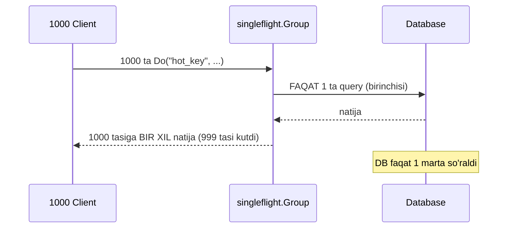

**Muqobil yechim: probabilistic early expiration (XFetch).** Distributed muhitda (ko'p server) singleflight faqat **bitta server ichidagi** so'rovlarni birlashtiradi. Butun cluster bo'ylab stampede-ni yumshatish uchun XFetch ishlatiladi — bu 6-bo'limdagi refresh-ahead-ning ehtimoliy varianti. Har o'qishda kichik ehtimol bilan **erta** yangilash qaroriga kelinadi; TTL yaqinlashgani sari ehtimol oshadi:

```go
// XFetch: qiymat + hisoblash vaqti (delta) + expiry saqlanadi
// beta oshsa — tezroq (agressiv) yangilaydi
func shouldRefreshEarly(delta time.Duration, expiry time.Time, beta float64) bool {
    gap := delta.Seconds() * beta * math.Log(rand.Float64()) // manfiy son
    return time.Now().Sub(expiry).Seconds() >= gap
}
```

Formula manbasi: Vattani, Chierichetti, Lowenstein — "Optimal Probabilistic Cache Stampede Prevention" (VLDB 2015). Amalda: **singleflight (bir server) + XFetch yoki jitter-li TTL (cluster)** birga ishlatiladi.

### 8.2 Cache Penetration — mavjud bo'lmagan ma'lumot

**Muammo:** hujumkor mavjud bo'lmagan ID-lar bilan API-ni bombardimon qiladi (`GET /user/-999`). Har biri cache-da yo'q (miss) → DB-da ham yo'q (null qaytadi) → cache-ga hech narsa yozilmaydi. Har so'rov DB-ga tushadi — cache butunlay chetlab o'tiladi (**penetration**).

Ikkita yechim:

**(1) Negative caching** — "topilmadi" javobini ham qisqa TTL bilan cache-la:

```go
if p, err := db.Query(ctx, id); err == sql.ErrNoRows {
    // "yo'q" ekanini QISQA TTL bilan cache-laymiz (masalan 30s)
    rdb.Set(ctx, key, []byte("__NULL__"), 30*time.Second)
    return nil, ErrNotFound
}
```

Diqqat: negative TTL **qisqa** bo'lsin — aks holda ma'lumot keyin qo'shilsa, uzoq vaqt "yo'q" ko'rinadi.

**(2) Bloom filter** — DB-da mavjud barcha valid kalitlarni space-efficient probabilistik strukturada saqlaymiz. So'rovdan oldin filter-dan so'raymiz. Bloom filter **false negative bermaydi** ("yo'q" desa — aniq yo'q), lekin kichik false positive beradi:

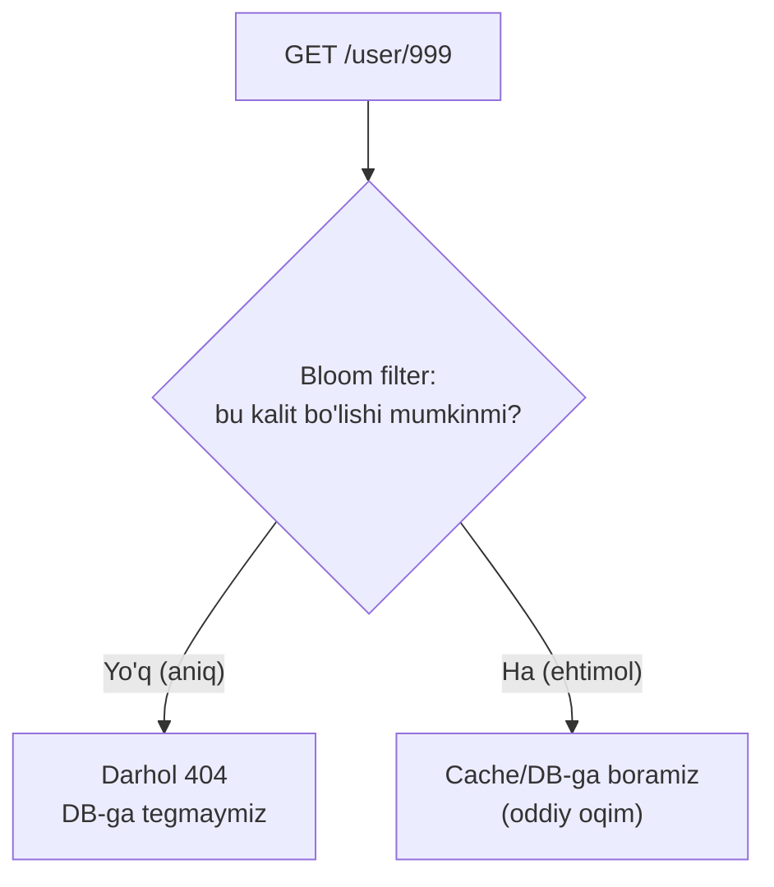

1 milliard kalit + 1% false positive uchun bloom filter ~1.2 GB oladi — DB-ni ming marta chetlab o'tishga arziydi. Redis-da `BF.ADD` / `BF.EXISTS` (RedisBloom moduli) bilan tayyor keladi.

### 8.3 Hot Key — bitta kalitga haddan tashqari trafik

**Muammo:** bitta kalit (masalan mashhur bloger posti, flash-sale mahsuloti) sekundiga millionlab so'rov oladi. Redis cluster-da bu kalit bitta shard-da yashaydi — o'sha bitta node CPU/tarmog'i to'yinadi, garchi butun cluster bo'sh bo'lsa ham. Bu — **hot key** (yoki **hot partition**) muammosi.

Yechimlar:

| Yechim | G'oya |
|--------|-------|
| **Local (L1) cache** | Har application server-da process-ichi (in-memory) cache qo'y. Hot key har server-da lokal ushlanadi — Redis-ga deyarli tegilmaydi. |
| **Key replication (splitting)** | `hot_key` ni `hot_key#1..#N` ga bo'l, har shard-da nusxa. O'qishda tasodifiy suffiks tanlanadi — yuk N node-ga tarqaladi. |
| **Read replica** | Redis read replica-lardan o'qish. |

Eng ko'p ishlatiladigan — **ikki qavatli cache**: L1 (local, process-ichi map yoki LRU) + L2 (Redis, shared). Hot key L1-da qoladi va Redis-ga umuman yetib bormaydi.

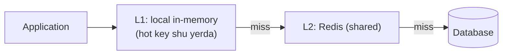

---

## 9. Eviction siyosatlari — cache to'lganda kimni chiqarish

### Muammo / Hook

RAM chekli. Redis 4 GB, ma'lumot 40 GB. Cache to'lganda yangi element uchun joy bo'shatish kerak — lekin kimni o'chirish? Bu qaror **eviction policy**. Kutubxona analogiyasidagi "stol to'ldi, qaysi kitobni omborga qaytaraman?" savoli.

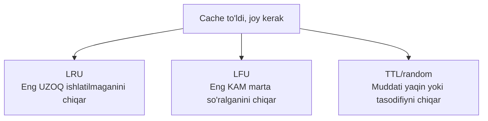

| Siyosat | Qoida | Qachon yaxshi | Zaifligi |
|---------|-------|---------------|----------|
| **LRU** (Least Recently Used) | Eng uzoq tegilmaganni chiqar | "Yaqinda ishlatilgan — yana ishlatiladi" (temporal locality). Eng keng tarqalgan | Bir martalik katta skan cache-ni "yuvib" yuboradi |
| **LFU** (Least Frequently Used) | Eng kam so'ralganni chiqar | Ba'zi elementlar **abadiy** mashhur bo'lsa | Eski mashhurlar "yopishib" qoladi, yangilarga joy bermaydi |
| **TTL-based / random** | Muddati yaqin yoki tasodifiy elementni chiqar | Sodda, arzon | Ishlatilishni hisobga olmaydi |

Redis-da bu — konfiguratsiya:

```bash
# redis.conf
maxmemory 4gb
maxmemory-policy allkeys-lru   # yoki: allkeys-lfu, volatile-ttl, allkeys-random
```

### LRU-ni ichidan ko'ramiz — data struktura

Application-ichi LRU cache qanday tuzilgan? Bu — klassik interview savoli. LRU ikki strukturadan iborat (kitobdagi tasvirga mos):

- **Doubly linked list** — qiymatlarni ishlatilish tartibida saqlaydi. Eng oxirida — eng yangi, eng boshida — eng eski.
- **Hash map** — har kalitni ro'yxatdagi tugunga (node) bog'laydi, `O(1)` topish uchun.

Har o'qish/yozishda o'sha tugun ro'yxat **oxiriga** ko'chiriladi. Shuning uchun eng uzoq tegilmagan tugun doim ro'yxat **boshida** turadi — eviction kerak bo'lsa o'sha o'chiriladi. Ikkala operatsiya ham `O(1)`.

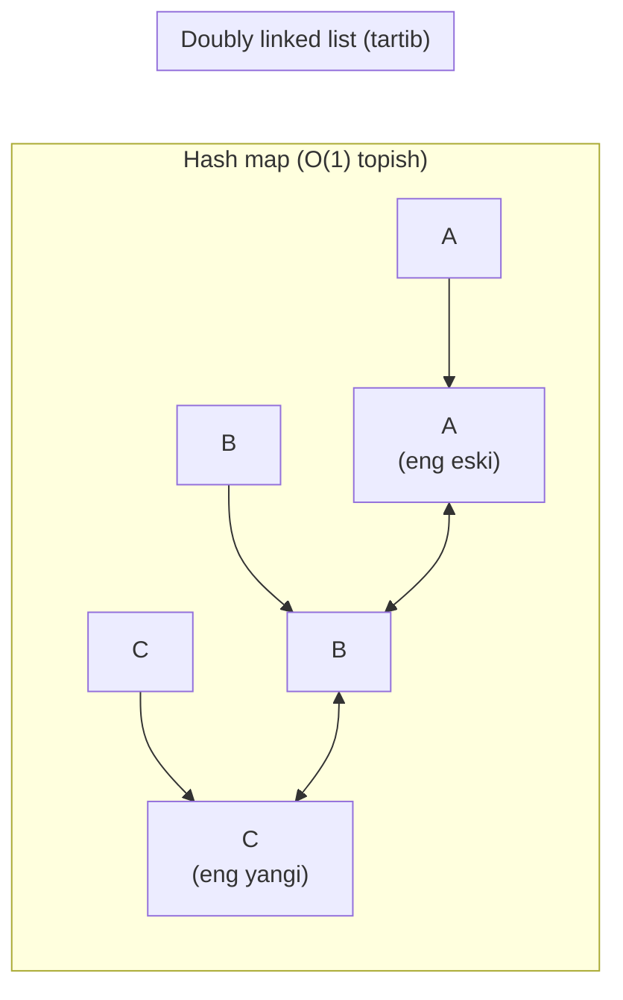

LRU qadamma-qadam (sig'im=3):

```
Boshlang'ich:   [A, B, C]     (chapda eng eski, A eng uzoq tegilmagan)
B so'raldi:     [A, C, B]     (B oxirga ko'chdi — eng yangi)
D so'raldi:     to'la! bosh = A → A chiqadi → [C, B, D]
```

### Go implementatsiya — hashicorp/golang-lru

Go standart kutubxonasida (hozircha) LRU yo'q. Eng mashhur va production-ready yechim — HashiCorp-ning ochiq kutubxonasi `hashicorp/golang-lru`, u ichida `sync.RWMutex` bilan concurrent-safe. Kitobdagi (Cloud Native Go) misolni zamonaviy generic (v2) API bilan beramiz:

```go
package main

import (
    "fmt"
    lru "github.com/hashicorp/golang-lru/v2"
)

var cache *lru.Cache[int, string]

func init() {
    // --- Sig'imi 2, eviction bo'lganda callback chaqiriladi ---
    cache, _ = lru.NewWithEvict(2, func(key int, value string) {
        fmt.Printf("Evicted: key=%v value=%v\n", key, value)
    })
}

func main() {
    cache.Add(1, "a")          // {1:a}
    cache.Add(2, "b")          // {1:a, 2:b} — cache to'ldi
    fmt.Println(cache.Get(1))  // "a true" — endi 1 eng yangi, 2 eng eski
    cache.Add(3, "c")          // joy yo'q → LRU=2 chiqadi → {1:a, 3:c}
    fmt.Println(cache.Get(2))  // "<nil> false" — topilmadi
}
```

Output:

```
a true
Evicted: key=2 value=b
 false
```

Nega `2` chiqdi, `1` emas? Chunki `cache.Get(1)` `1`-ni "yaqinda ishlatilgan" qildi, `2` esa eng uzoq tegilmagan bo'lib qoldi. `Add(3)` joy talab qilganda LRU aynan `2`-ni tanladi.

**Notional machine:** `cache.Get(1)` ichida golang-lru `RWMutex`-ni oladi, hash map-dan `1`-ning node-ini topadi, uni linked list oxiriga ko'chiradi va qulfni bo'shatadi. `Add(3)` esa `Len() >= size` ni ko'rib, list boshidagi node-ni (`2`) o'chiradi va `onEvict` callback-ni chaqiradi.

**Muhim cheklov (kitobdan):** golang-lru `RWMutex`-ga tayanadi. Sekundiga bir necha **million** operatsiya bo'lsa, lock contention (qulf uchun kurash) latency keltiradi. O'ta yuqori throughput uchun sharded cache (masalan Dgraph-ning `ristretto`) ko'riladi.

### ⚠️ Ko'p uchraydigan xatolar

1. **"LRU = eng eski qo'shilgan"** — noto'g'ri. LRU eng uzoq **ishlatilmagan**ni chiqaradi. "Eng eski qo'shilgan" — bu **FIFO**. Farq: LRU-da har o'qish elementni yangilaydi, FIFO-da o'qish tartibga ta'sir qilmaydi.
2. **Eviction-ni TTL bilan chalkashtirish.** TTL = vaqt tugagani uchun o'chirish. Eviction = joy yetmagani uchun o'chirish. TTL hali tugamagan element ham eviction-da chiqib ketishi mumkin.
3. **Concurrent map bilan qo'lda LRU yozib mutex qo'ymaslik.** Kitob aynan shuni ogohlantiradi: qulfsiz map-ga bir vaqtda yozish — race, panic yoki buzilgan holat.

---

## 10. Consistency — cache va DB-ni mos ushlash

### Muammo / Hook

Cache — DB-ning **nusxasi**, va nusxa doim asl bilan bir xil bo'lib turmaydi. Yozuvda tartib va usulni noto'g'ri tanlasak, cache va DB **doimiy** zid bo'lib qolishi mumkin (TTL-gacha tuzalmaydi).

### Sanoat standarti: Cache-Aside (o'qish) + explicit invalidation (yozish)

Eng ko'p ishlatiladigan kombinatsiya:
- **O'qish:** cache-aside (2-bo'lim).
- **Yozish:** avval DB-ga yoz, keyin cache-ni **o'chir** (`Del`, `Set` emas).

Nega `Del`, `Set` emas? Va nega "avval DB, keyin cache"? Ikkita race-ni ko'ramiz.

### Race A — noto'g'ri tartib (avval cache, keyin DB)

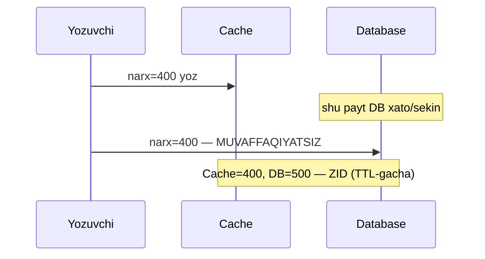

Yechim: **avval DB** (haqiqat DB-da), keyin cache. DB xato bersa cache-ga tegilmaydi.

### Race B — "delete keyin write" tartibida race (nega Set xavfli)

Bu cache-aside-ning eng mashhur race condition-i. Ikki goroutine: biri **o'qiydi** (miss), biri **yozadi**.

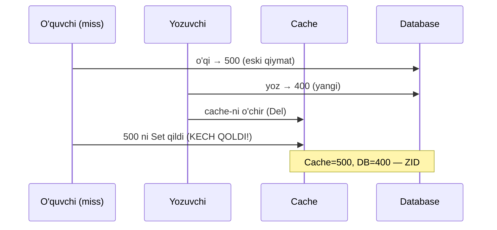

O'quvchi eski 500-ni DB-dan olib, sekin qolib, yozuvchidan **keyin** cache-ga yozib qo'ydi. Endi cache eski 500-ni saqlaydi — TTL-gacha noto'g'ri.

**Nega `Set` (o'qishda to'ldirish) buni kuchaytiradi:** cache-aside-da o'qishda `Set` qilamiz, yozishda esa `Del`. Race B da o'quvchining `Set`-i yozuvchining `Del`-idan keyin kelib qoladi. To'liq hal qilib bo'lmaydi, lekin yumshatiladi:

**Yechimlar:**

1. **Yozishda `Del`, `Set` emas.** Yozuvchi konkret qiymat yozmaydi (u ham eskirishi mumkin) — shunchaki o'chiradi. Keyingi o'qish majburan DB-dan (haqiqatdan) oladi.
2. **Delayed double delete.** Yozgach `Del`, so'ng qisqa kechikish (masalan 500ms) dan keyin **yana bir marta** `Del` — Race B da kech qolgan `Set`-ni ham tozalash uchun.
3. **Qisqa TTL — himoya to'ri.** Race sodir bo'lsa ham, ma'lumot eng ko'p TTL davomida zid qoladi, keyin avtomatik tuzaladi.
4. **Write-Through** (4-bo'lim) bilan yozishda cache-ni ham yangilash — lekin bu ham Race B-ga to'liq immunitet bermaydi; qat'iy consistency kerak bo'lsa versiyalash (CAS/version number) ishlatiladi.

> **Oltin qoida:** Cache-aside-da yozuvda **update emas, invalidate**: avval DB-ga yoz, keyin cache-ni `Del` qil. Qat'iy strong consistency kerak bo'lsa — cache emas, transactional yechim (yoki version-based cache) ko'r.

### ⚠️ Ko'p uchraydigan xato

**Yozishda `rdb.Set(key, yangiQiymat)` qilish.** Mantiqan to'g'ridek — "cache-ni ham yangiladim". Lekin Race B da bu eski o'qishning `Set`-i bilan poygaga kirishadi va eski qiymat yopishib qolishi mumkin. `Del` esa cache-ni "bo'sh"ga o'tkazadi — keyingi o'qish haqiqatni majburan DB-dan oladi.

---

## 11. Barcha 5 pattern — taqqoslash jadvali

| Pattern | Consistency | O'qish latency | Yozish latency | Data loss xavfi | Murakkablik | Eng mos use case |
|---------|-------------|----------------|----------------|-----------------|-------------|------------------|
| **Cache-Aside** | Eventual (stale bo'ladi) | Miss-da sekin, hit-da tez | Application boshqaradi | Yo'q | Past | Read-heavy, umumiy maqsad (eng keng tarqalgan) |
| **Read-Through** | Eventual | Cache-aside bilan bir xil | Alohida (ko'pincha write-through bilan) | Yo'q | O'rta (library) | Kod takrorlanishini yashirish, framework cache |
| **Write-Through** | Strong-ga yaqin | Tez (doim fresh) | Sekin (ikki yozuv) | Yo'q | O'rta | Consistency muhim, o'qish ko'p (profil, konfig) |
| **Write-Behind** | Eventual (kechikish bilan) | Tez | **Eng tez** | **Bor** (flush-gacha crash) | Yuqori | Yozuv juda ko'p, yo'qolishi maqbul (metrika, view count, skor) |
| **Refresh-Ahead** | Eventual (soft-stale) | **Eng barqaror tez** (miss yashirin) | Alohida | Yo'q | Yuqori | Hot, oldindan aytsa bo'ladigan kalitlar (bosh sahifa, top-N) |

> **Oltin qoida:** Standart tanlov — **Cache-Aside (o'qish) + Write-Through yoki Del-invalidation (yozish)**. Yozuv haddan tashqari ko'p bo'lsa → Write-Behind. Hot kalit stampede bersa → Refresh-Ahead + singleflight qo'sh.

---

## 12. Interview savollari

**1. Cache-aside va read-through orasidagi farq nima? Ular tezlik jihatidan farq qiladimi?**

<details>
<summary>Javob</summary>

Farq — DB-dan yuklash mantig'i **kimning ichida** ekani. Cache-aside-da bu mantiqni application kodi o'zi yozadi; read-through-da esa cache qatlami miss bo'lganda o'zi DB-ga boradi (application DB-ni ko'rmaydi). Tezlik jihatidan ular **bir xil** — bu faqat kod tashkiloti (encapsulation) farqi.
</details>

**2. Write-through va write-behind orasidagi asosiy trade-off nima? Qaysi biri qanday ma'lumot uchun?**

<details>
<summary>Javob</summary>

Write-through DB-ga **sinxron** yozadi — consistency zo'r, data loss yo'q, lekin yozish sekin (ikki yozuv). Write-behind avval faqat cache-ga yozadi va DB-ni async batch bilan yangilaydi — juda tez, lekin flush-gacha cache crash bo'lsa yozuvlar **yo'qoladi**. Write-through — bank, buyurtma, konfig uchun; write-behind — metrika, view count, o'yin skori (yo'qolishi maqbul) uchun.
</details>

**3. Cache stampede (thundering herd) nima va Go-da qanday hal qilasan?**

<details>
<summary>Javob</summary>

Hot kalit TTL-i tugaganda, o'sha lahzada kelgan minglab so'rov bir vaqtda miss ko'rib, bir xil DB query-ni yuboradi va DB-ni qulatadi. Go-da yechim — `golang.org/x/sync/singleflight`: `g.Do(key, fn)` bir xil kalit uchun bir vaqtda faqat bitta `fn` chaqiruvini bajaradi, qolganlari natijani kutib birga oladi. Distributed (cluster) darajada — probabilistic early expiration (XFetch) yoki TTL-ga jitter qo'shish.
</details>

**4. Cache penetration nima va bloom filter uni qanday to'xtatadi?**

<details>
<summary>Javob</summary>

Penetration — mavjud bo'lmagan kalitlarga so'rov (masalan hujumkor tasodifiy ID-lar yuboradi): har biri cache-da ham, DB-da ham yo'q, shuning uchun cache to'lmaydi va har so'rov DB-ga tushadi. Yechimlar: (1) negative caching — "yo'q" javobni qisqa TTL bilan cache-lash; (2) bloom filter — DB-dagi barcha valid kalitlarni saqlaydigan probabilistik struktura; so'rovdan oldin so'raladi, "yo'q" desa (false negative bermaydi) darhol 404 qaytariladi va DB-ga umuman tegilmaydi.
</details>

**5. Nega cache-aside-da yozuvda `Del` (o'chirish) `Set` (yangilash)-dan xavfsizroq? "Avval DB, keyin cache" tartibi nega muhim?**

<details>
<summary>Javob</summary>

`Set` konkret qiymat yozadi — parallel eski o'qish (miss) o'z eski qiymatini yozuvchidan keyin cache-ga qo'yib, uni bosib o'tishi mumkin (Race B). `Del` esa cache-ni "bo'sh"ga o'tkazadi; keyingi o'qish haqiqatni majburan DB-dan oladi, shuning uchun eski qiymat yopishib qolmaydi. "Avval DB, keyin cache" muhim, chunki teskarisida DB yozuvi muvaffaqiyatsiz bo'lsa cache yangi, DB eski qolib TTL-gacha zid bo'ladi.
</details>

**6. Hot key muammosi nima? Redis cluster-da bitta kalit millionlab so'rov olsa nima qilasan?**

<details>
<summary>Javob</summary>

Redis cluster-da har kalit bitta shard-da yashaydi. Bitta kalit juda mashhur bo'lsa — o'sha bitta node to'yinadi, garchi cluster bo'sh bo'lsa ham (hot partition). Yechimlar: (1) L1 local (process-ichi) cache — hot kalit har application server-da lokal ushlanadi, Redis-ga deyarli tegilmaydi; (2) key splitting/replication — kalitni `key#1..#N`-ga bo'lib bir nechta shard-ga tarqatish; (3) read replica-lardan o'qish. Eng ko'p — ikki qavatli (L1 local + L2 Redis) cache.
</details>

---

## Xulosa

- Cache — tezlik yutug'idangina emas, DB-ni ortiqcha yukdan asraydigan **arxitektura himoyasi**; latency piramidasi (RAM ~100ns vs DB ~50ms) buning sababi.
- **Cache-Aside** eng keng tarqalgan: application "cache-ga qara → miss bo'lsa DB → cache-ga yoz". Kamchiligi: first-miss latency va stale data.
- **Read-Through** shu mantiqni cache library ichiga yashiradi — tezligi bir xil, kod tozaroq.
- **Write-Through** yozuvni sinxron DB-ga oladi (consistency zo'r, sekin); **Write-Behind** async batch bilan yozadi (tez, lekin data loss xavfi) — Go-da buffered channel + background flusher.
- **Refresh-Ahead** TTL tugashidan oldin proaktiv yangilaydi — hot kalitda miss-ni yashiradi.
- Uch falokat: **cache stampede** (yechim: singleflight), **cache penetration** (yechim: negative caching + bloom filter), **hot key** (yechim: L1 local cache + key splitting).
- Eviction: **LRU** (doubly linked list + hash map, `O(1)`), **LFU**, **TTL** — Go-da `hashicorp/golang-lru`.
- Consistency: **avval DB, keyin cache `Del`** — Race A va Race B-dan himoya; cache tabiatan eventual consistency keltiradi.

## 🧠 Eslab qol

- Cache-Aside = "avval cache-ga qara, miss bo'lsa DB-dan yukla va yoz".
- Write-Through = ishonchli lekin sekin; Write-Behind = tez lekin flush-gacha crash-da yo'qoladi.
- Cache stampede yechimi Go-da — `singleflight.Group.Do`.
- Cache penetration yechimi — negative caching va bloom filter.
- Yozuvda `Del` ishlat, `Set` emas; tartib — avval DB, keyin cache.

## ✅ O'z-o'zini tekshir (retrieval practice)

**1. Cache-aside-da `redis.Nil` (miss) ni oddiy Redis xatosidan ajratmasak, Redis o'chib qolganda nima bo'ladi?**
<details>
<summary>Javob</summary>

Har so'rov "Get xatosi" olib to'g'ridan-to'g'ri DB-ga tushadi — butun trafik DB-ga uriladi va DB Redis bilan birga qulaydi. Cache himoyasi yo'qoladi. Shuning uchun miss va "Redis o'lgan"ni farqlash, o'lganda esa degraded rejim (rate limit/circuit breaker) muhim.
</details>

**2. Nega write-behind-da buffered channel-ga backpressure (chekli sig'im + to'lganda siyosat) shart?**
<details>
<summary>Javob</summary>

Cheksiz buffer — DB flush-dan sekin qolsa RAM to'lib OOM. Chekli buffer-ga default/siyosatsiz yozish — to'lganda yozuvchi goroutine-lar bloklanib qotadi. Shuning uchun to'lganda aniq qaror kerak: xato qaytar, drop qil yoki ataylab bloklan.
</details>

**3. Cache stampede-da singleflight distributed muhitda (10 ta server) to'liq yetarlimi? Yo'q bo'lsa, nega va nima qo'shiladi?**
<details>
<summary>Javob</summary>

Yetarli emas — singleflight faqat **bir process ichidagi** so'rovlarni birlashtiradi. 10 ta server bo'lsa, hali ham 10 ta DB query ketishi mumkin (har serverdan bittadan). Cluster darajasida qo'shimcha kerak: probabilistic early expiration (XFetch), TTL-ga jitter yoki distributed lock (masalan Redis SETNX).
</details>

**4. Refresh-ahead-da fon yangilashni de-duplikatsiya qilmasak nima bo'ladi?**
<details>
<summary>Javob</summary>

Soft-TTL o'tgach kelgan har so'rov o'z fon goroutine-ini ochadi — 1000 so'rov = 1000 yangilash goroutine-i, bu yana stampede. Yechim: yangilashni `singleflight` bilan bitta chaqiruvga cheklash.
</details>

**5. Cache-aside-da yozuvda `Set(yangiQiymat)` qilsak, qanday race yuzaga keladi va `Del` uni qanday hal qiladi?**
<details>
<summary>Javob</summary>

Race B: parallel eski o'qish (miss) DB-dan eski qiymatni olib, yozuvchidan keyin cache-ga `Set` qilib qo'yadi — eski qiymat yopishadi. `Set` yozuvchining yangi qiymatini ustidan bosishi mumkin. `Del` esa cache-ni bo'sh qiladi — keyingi o'qish haqiqatni DB-dan majburan oladi, eski qiymat yopishmaydi.
</details>

## 🛠 Amaliyot

**1. Oson (Modify).** 2-bo'limdagi `GetProduct` cache-aside kodiga negative caching qo'sh: `db.QueryProduct` `ErrNotFound` qaytarsa, `"__NULL__"` ni **30 soniyalik** TTL bilan cache-la va keyingi o'qishlarda uni miss emas, "yo'q" deb qaytar.
<details>
<summary>Ipucha</summary>

Get natijasida `bytes.Equal(b, []byte("__NULL__"))` ni tekshir → shu bo'lsa darhol `ErrNotFound` qaytar (DB-ga borma). DB `ErrNotFound` bersa `rdb.Set(key, "__NULL__", 30*time.Second)`. TTL-ni qisqa qo'y — ma'lumot keyin qo'shilsa uzoq "yo'q" ko'rinmasin.
</details>

**2. O'rta (faded example — TODO-larni to'ldir).** Quyidagi write-behind flusher skeletonini to'ldir:
```go
func (w *WriteBehind) runFlusher(ctx context.Context) {
    ticker := time.NewTicker(5 * time.Second)
    defer ticker.Stop()
    batch := make(map[string][]byte)
    flush := func() {
        // TODO: batch bo'sh bo'lsa qaytib chiq
        // TODO: db.BatchUpsert bilan yoz
        // TODO: batch-ni tozala (yangi map)
    }
    for {
        select {
        case op := <-w.buf:
            batch[op.key] = op.val
            // TODO: batch >= 1000 bo'lsa darhol flush
        case <-ticker.C:
            // TODO: flush chaqir
        case <-ctx.Done():
            // TODO: oxirgi flush + return
        }
    }
}
```
<details>
<summary>Ipucha</summary>

`flush`: `if len(batch)==0 { return }` → `db.BatchUpsert(ctx, batch)` → `batch = make(map[string][]byte)`. `case op`: `if len(batch) >= 1000 { flush() }`. `case ticker`: `flush()`. `case ctx.Done()`: `flush(); return`. `ctx.Done()`-dagi oxirgi flush muhim — aks holda graceful shutdown-da so'nggi yozuvlar yo'qoladi.
</details>

**3. Qiyin (Make — noldan).** `singleflight` bilan stampede-himoyalangan, `TTL + refresh-ahead` (soft-TTL) qo'shilgan generic `Cache[T]` yoz. Talablar: (a) hit-da darhol qaytar; (b) soft-TTL o'tgan bo'lsa eski qiymatni qaytarib, fonda `singleflight` orqali bitta yangilash boshla; (c) to'liq miss-da `singleflight` orqali sinxron yukla.
<details>
<summary>Ipucha</summary>

`struct{ rdb; g singleflight.Group; loader; soft, hard time.Duration }`. Get: Redis-dan `entry{Data, SoftTTL}` o'qi. `redis.Nil` → `g.Do(key, load)` sinxron. Hit va `time.Now().After(SoftTTL)` → `go func(){ g.Do(key, load) }()` (background, `context.Background()` bilan) va darhol `entry.Data` qaytar. `load` ichida DB-dan ol, `SoftTTL = now + soft`, Redis-ga `hard` TTL bilan `Set`. `singleflight` ikkala yo'lda ham stampede-ni ushlaydi.
</details>

## 🔁 Takrorlash

**Bog'liq oldingi mavzular:**
- [`System Design/04-caching/01-oqish-strategiyalari.md`](../../../System%20Design/04-caching/01-oqish-strategiyalari.md) — caching asoslari, hit/miss, eviction (bu dars uning ustiga qurilgan).
- [`System Design/04-caching/03-yozishni-kechiktirish-eventual-consistency.md`](../../../System%20Design/04-caching/03-yozishni-kechiktirish-eventual-consistency.md) — write strategiyalari va eventual consistency.
- [`2. Stability Patterns/3. Circuit Breaker.md`](../2.%20Stability%20Patterns/3.%20Circuit%20Breaker.md) — Redis o'lganda cache degraded rejimida circuit breaker.
- [`2. Stability Patterns/5. Throttle - Rate Limiting.md`](../2.%20Stability%20Patterns/5.%20Throttle%20-%20Rate%20Limiting.md) — cache penetration hujumida rate limit.

**Takrorlash jadvali:**
- **Ertaga:** "O'z-o'zini tekshir" 1, 3, 5-savollarga qaytib javob ber.
- **3 kundan keyin:** 5 pattern taqqoslash jadvalini (11-bo'lim) xotiradan qayta tuz.
- **1 haftadan keyin:** singleflight bilan stampede-himoyalangan cache-ni (Amaliyot 3) kodga qaramay qayta yoz.

**Feynman testi:** Kod so'zlarini ishlatmasdan, bir do'stingga 3 jumlada tushuntir: (1) cache-aside qanday ishlaydi, (2) write-through va write-behind farqi, (3) cache stampede nima va nega singleflight uni to'xtatadi.

---

## Manbalar

- Matthew A. Titmus, *Cloud Native Go* — LRU cache va `hashicorp/golang-lru` bo'limi (kitob parchasi).
- [AWS — Caching Best Practices](https://aws.amazon.com/caching/best-practices/) va [ElastiCache Caching Strategies](https://docs.aws.amazon.com/AmazonElastiCache/latest/dg/Strategies.html) — lazy loading (cache-aside) vs write-through.
- [Singleflight in Go: A Clean Solution to Cache Stampede (PickMe Engineering)](https://medium.com/pickme-engineering-blog/singleflight-in-go-a-clean-solution-to-cache-stampede-02acaf5818e3)
- [Probabilistic Early Expiration in Go (Dizzy Zone)](https://dizzy.zone/2024/09/23/Probabilistic-Early-Expiration-in-Go/) — XFetch formulasi.
- [Redis — cache penetration & bloom filters (OneUptime)](https://oneuptime.com/blog/post/2026-03-31-redis-how-to-use-bloom-filters-for-cache-penetration-prevention-in/view) va [Alex Xu — A Crash Course in Caching](https://blog.bytebytego.com/p/a-crash-course-in-caching-final-part).
