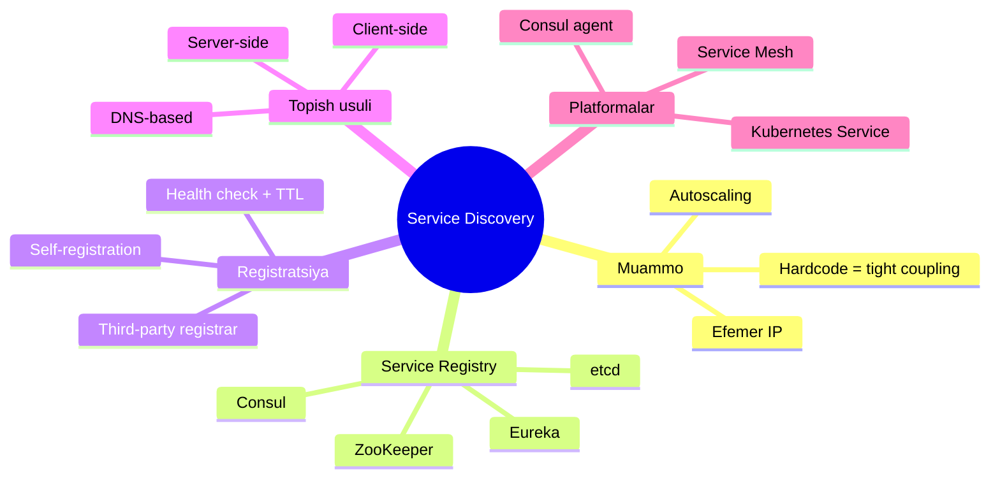
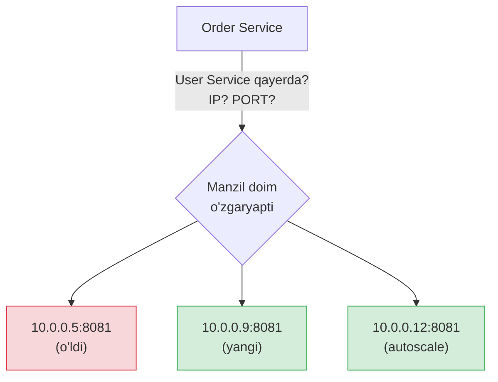
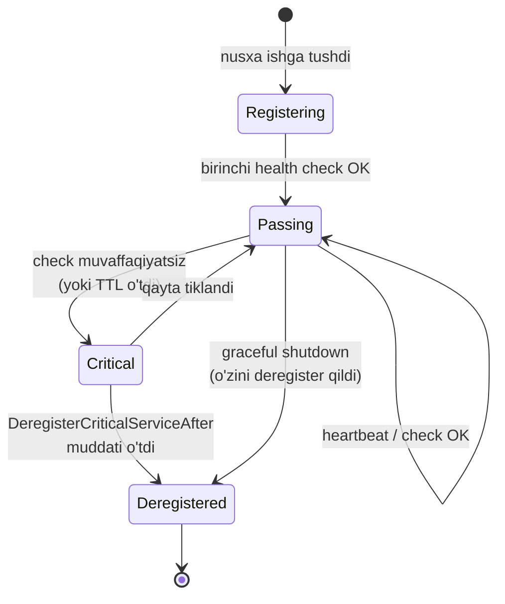
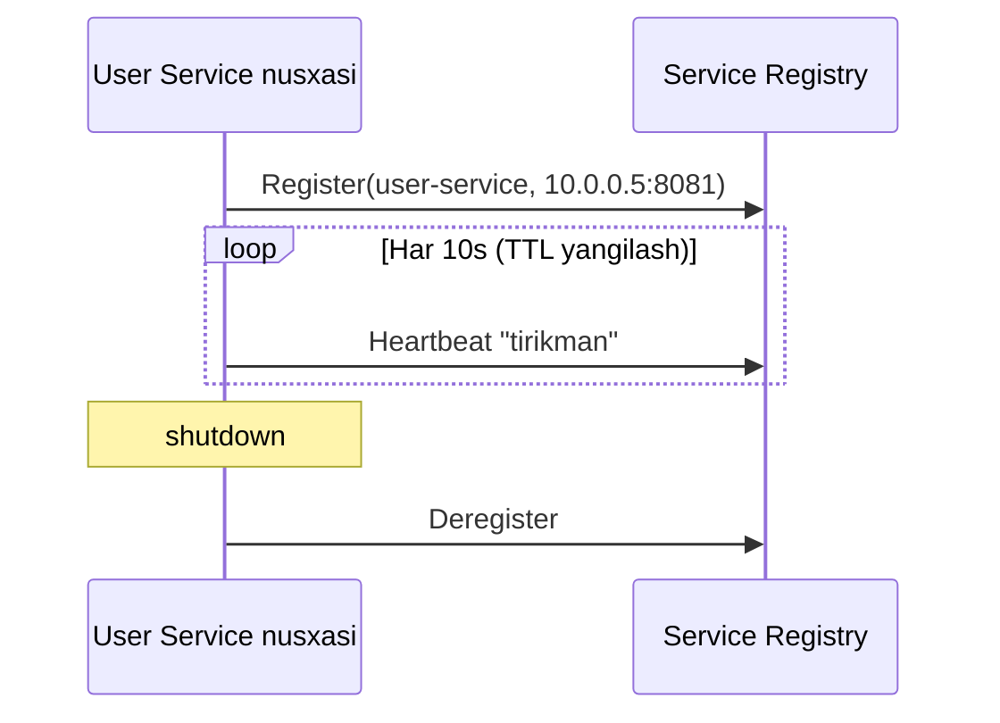
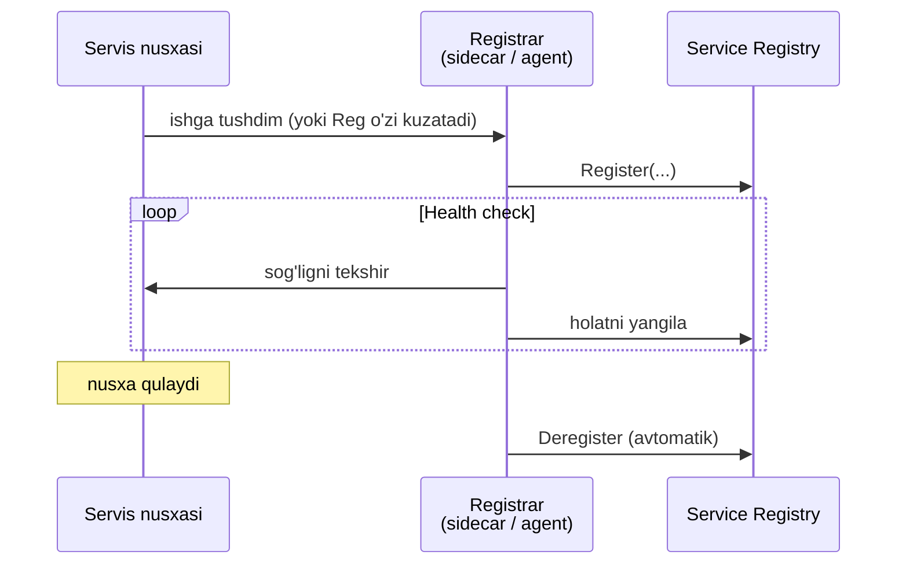
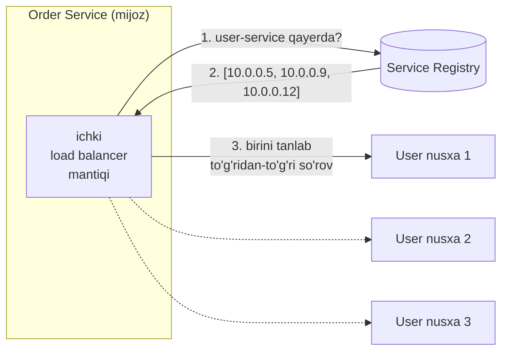
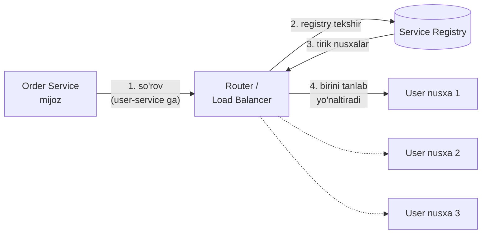
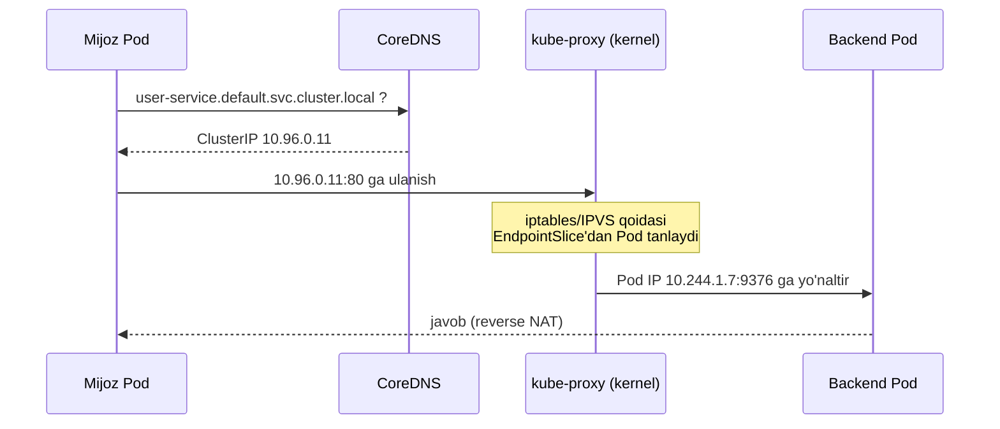
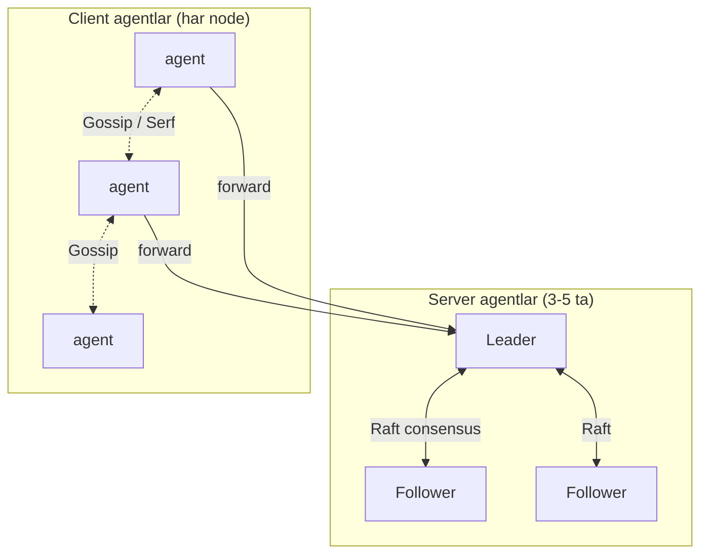
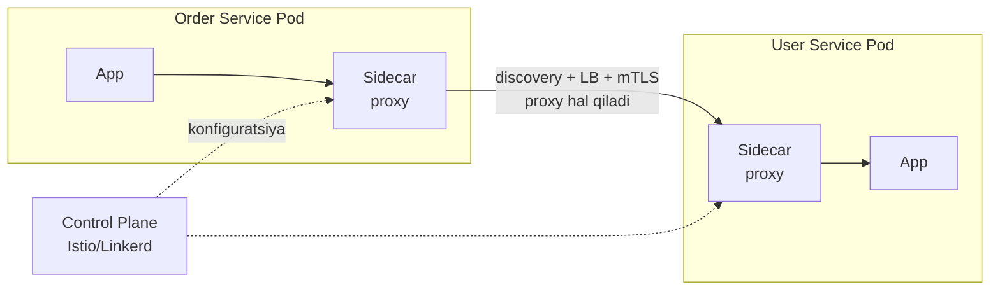

# Service Discovery

> **TL;DR** — Cloud muhitda servislarning IP manzillari **efemer** (qisqa umrli): konteynerlar o'chib-yonadi, autoscaling nusxalarni ko'paytirib-kamaytiradi, IP soniya sayin o'zgaradi. Manzilni kodga **hardcode** qilish = tight coupling = mo'rt tizim. **Service Discovery** buni hal qiladi: servislar bir-birini **IP bo'yicha emas, nom bo'yicha** topadi. Markazda **Service Registry** turadi — barcha tirik nusxalarning manzillari saqlanadigan dinamik "ma'lumotnoma". Registratsiya ikki xil: **self-registration** (servis o'zini yozadi) yoki **third-party registration** (registrar/sidecar yozadi). Topish ham ikki xil: **client-side** (mijoz registrydan o'qib o'zi load balancing qiladi) yoki **server-side** (load balancer/router yo'naltiradi). DNS, Kubernetes Service, Consul, etcd — bularning hammasi shu g'oyaning turli ko'rinishlari.

---

## Bu darsning xaritasi



---

## 1. Muammo: fixed addresses (qat'iy manzillar) endi ishlamaydi

Tasavvur qil — Order Service User Service'ni chaqirmoqchi. Buning uchun avval **uni topishi** kerak: qaysi IP, qaysi port? Tarmoqda servisni topish jarayoni aynan **service discovery** deb ataladi.

An'anaviy dunyoda bu muammo emas edi. Servislar tarmoqda **nisbatan qat'iy, hammaga ma'lum joyda** turardi. Boshida buni oddiy `hosts.txt` fayllari bilan qo'lda boshqarishardi, keyin tarmoq o'sgach **DNS** va **URL** manzillar paydo bo'ldi.

An'anaviy DNS **uzoq yashaydigan** (long-lived) servislar uchun juda mos: manzili yillar davomida deyarli o'zgarmaydi. Lekin microservices dunyosi buni ostin-ustun qildi.

> **Kitobdan (Cloud Native Go, Titmus):** "Efemer, microservices asosidagi ilovalarning ommalashuvi shunday dunyo yaratdiki, unda servis nusxasining umri ko'pincha oy yoki yillar bilan emas, **soniya yoki daqiqalar** bilan o'lchanadi. Bunday dinamik muhitda URL manzillar va an'anaviy DNS shunchaki **yana bir tight coupling shakliga** aylanadi."

Bu yerda muammoning ildizi — **tight coupling** (tesniy bog'liqlik). Ikki komponent bir-birining o'zgarmas deb o'ylagan xususiyatiga bog'lansa, aslida esa u xususiyat o'zgarsa — tizim buziladi. Hardcode qilingan IP aynan shunday: "bu manzil o'zgarmaydi" degan noto'g'ri taxminga tayanadi.

Cloud'da nima uchun IP doim o'zgaradi:

- **Autoscaling** — yuk oshsa User Service 3 nusxa, tushsa 1 nusxaga qaytadi. Har nusxaning IP'si boshqa.
- **Konteyner qayta ishga tushishi** — Pod qulasa, Kubernetes uni boshqa IP bilan qaytadan yaratadi.
- **Deploy** — yangi versiya chiqarilganda eski nusxalar o'ladi, yangilari boshqa manzilda tug'iladi.
- **Xatolik** — bir nusxa qulasa, unga so'rov yuborish = xatolik yoki timeout.



Kerak bo'lgan narsa — **dinamik, moslashuvchan manzillar kitobi**. Bu Service Discovery.

---

## 2. Analogiya: restoran administratori (maitre d')

Yaxshi restoranga borsang, bo'sh stolni **o'zing izlab yurmaysan**. Kirishda **administrator** (maitre d') turadi. Sen "4 kishilikmiz" deysan, u qaysi stol bo'shligini, qaysi ofitsiant erkin ekanini biladi va seni to'g'ri joyga o'tqazadi.

- Sen **qaysi stol** bo'shligini bilishing shart emas — administrator biladi.
- Bir ofitsiant tushlikka chiqsa, administrator seni boshqasiga yo'naltiradi.
- Yangi ofitsiant ishga chiqsa, administratorga "men keldim" deydi va endi mijozlarni oladi.

Bu — service discovery. **Administrator** = service registry. **Ofitsiantlar** = servis nusxalari. **"Men keldim"** = registration. **Ofitsiant xotasi** ("men bandman/bo'shman") = health check.

Ikkinchi kuchli analogiya — **telefon ma'lumotnomasi**. Odamning uy manzilini yodlab yurmaysan; ismi bo'yicha ma'lumotnomadan izlaysan. Odam ko'chib ketsa, ma'lumotnoma yangilanadi, sen doim to'g'ri manzilni olasan.

> **Analogiya chegarasi:** Telefon ma'lumotnomasi **statik** — yiliga bir marta chop etiladi. Service registry esa **jonli** — har soniyada yangilanadi va o'lik yozuvlarni o'zi avtomatik chiqaradi (health check). Aynan shu "jonlilik" service discovery'ni oddiy DNS'dan ajratib turadi.

---

## 3. Sodda ta'rif

> **Service Discovery** — servislar bir-birini qat'iy IP orqali emas, **mantiqiy nom bo'yicha** (masalan `user-service`) topadigan mexanizm; markazda **Service Registry** (tirik nusxalar manzillari bazasi) turadi.

Uch tarkibiy qism bor:

| Qism | Vazifasi | Analogiya |
| --- | --- | --- |
| **Service Registry** | Barcha tirik nusxalar manzilini saqlaydigan baza | Administrator daftari |
| **Registration** | Nusxa o'z manzilini registryga yozishi | "Men ishga keldim" |
| **Discovery** | Boshqa servis nom bo'yicha manzilni topishi | "Bo'sh stol qani?" |

---

## 4. Service Registry — hammasi shu yerdan boshlanadi

**Service Registry** (servislar reyestri) — bu, microservices.io ta'rifi bilan aytganda, "servislar, ularning nusxalari va joylashuvi haqidagi baza". U discovery'ning **yuragi**.

### 4.1. Registry nima qiladi

- Nusxa ishga tushganda o'zini **register** qiladi, o'chganda **deregister** qiladi.
- Mijoz yoki router nom bo'yicha so'raganda **joriy tirik nusxalar ro'yxatini** qaytaradi.
- Nusxaning **health check** API'sini chaqirib, u haqiqatan so'rovga javob bera oladimi — tekshiradi va **nosog'lom nusxalarni ro'yxatdan chiqaradi**.

### 4.2. Registry — kritik komponent (single point of failure xavfi)

microservices.io buni alohida ta'kidlaydi: registry — **kritik tizim komponenti**. Agar u qulasa, hamma servis bir-birini topa olmay qoladi. Shuning uchun:

- Registry **yuqori availability** (high availability) bilan, bir nechta nusxada ishlashi shart.
- Mijozlar registry javobini **cache** qilishi kerak (registry vaqtincha qulasa ham ishlashda davom etsin).
- Registry nusxalarining o'zi **qat'iy, hammaga ma'lum IP**larda turishi kerak — ya'ni registryni topish uchun yana discovery kerak bo'lmasin. Bu "tovuq va tuxum" muammosini uzadigan yagona nuqta.

Aynan shu sababli registrylar (Consul, etcd, ZooKeeper) ichida **consensus algoritmi** (Raft/Paxos) ishlatadi — bir nechta server nusxasi orasida ma'lumot bir xil (consistent) bo'lib qolishi uchun.

### 4.3. Health check va registry lifecycle

Registry o'lik nusxalarni qanday tozalaydi? Ikki asosiy usul:

| Usul | Qanday ishlaydi | Kim tashabbuskor |
| --- | --- | --- |
| **Heartbeat / TTL** | Nusxa muntazam "tirikman" signal yuboradi; TTL (Time To Live) muddati ichida signal kelmasa, yozuv o'lik deb belgilanadi | Nusxa (push) |
| **Active health check** | Registry o'zi nusxaning `/health` endpoint'iga so'rov yuborib tekshiradi | Registry (pull) |

Nusxaning registry ichidagi hayot sikli — state machine sifatida:



Muhim nozik nuqta: **"passing" (sog'lom) nusxagina discovery natijasiga tushadi**. "Critical" holatdagi nusxa ro'yxatda bo'lsa ham, mijozlarga qaytarilmaydi. Bu — registry'ning eng qimmatli xizmati: mijoz o'lik nusxaga urinmaydi.

---

## 5. Registratsiya usullari: kim registryga yozadi?

Nusxaning manzili registryga qanday tushadi? Ikki xil pattern bor va bu tanlov muhim.

### 5.1. Self-registration (o'zini o'zi ro'yxatlash)

Nusxaning **o'zi** ishga tushganda registryga "men shu yerdaman" deb yozadi va muntazam heartbeat yuborib turadi.



**Afzalliklari:**
- Sodda — alohida infratuzilma kerak emas.
- Nusxa **o'z holatini biladi** — nafaqat UP/DOWN, balki STARTING, AVAILABLE kabi nozik holatlarni bildira oladi.

**Kamchiliklari (microservices.io):**
- Servisni registry'ga **bog'lab qo'yadi** (coupling) — registration mantiqi biznes kodi ichiga aralashadi.
- **Har til/framework uchun** alohida registration kodi yozish kerak (Go, Java, Python — hammasida).
- **O'z-o'zini anglash cheklovi:** nusxa "ishlab turibdi, lekin so'rovga javob bera olmaydi" holatiga tushsa, ko'pincha o'zini deregister qilishga aqli yetmaydi (masalan deadlock'ga tushib qolgan).

### 5.2. Third-party registration (registrar / sidecar)

Alohida komponent — **registrar** — nusxalarni kuzatib, ularni registryga yozadi va o'chiradi. Servis kodi bu haqda **umuman bilmaydi**.



Real misollar: **Registrator** (Docker konteynerlarni kuzatib registryga yozadi), **AWS Auto Scaling Group** (EC2 nusxalarini load balancerga avtomatik yozadi), **Netflix Prana** (JVM bo'lmagan servislar uchun sidecar), Kubernetes/Marathon (o'rnatilgan mexanizm).

**Afzalliklari:**
- Biznes kodi registration'dan **butunlay xalos** — toza, decoupled.
- Bitta registrar barcha tillar uchun ishlaydi.

**Kamchiliklari:**
- Registrar nusxaning **ichki holatini chuqur bilmaydi** — "ishlayapti-yu javob bermayapti" holatini har doim ham ilg'amasligi mumkin.
- Registrar ham **kritik infratuzilma** — o'zi high availability talab qiladi.

> **Oltin qoida:** Yangi kodni registration bilan iflos qilishni istamasang va bir nechta til ishlatsang — **third-party registration** (sidecar/agent) tanla. Nozik holat modeli kerak bo'lsa va bitta tilda ishlasang — **self-registration** ham yetadi.

---

## 6. Client-side discovery (mijoz o'zi topadi)

Endi topish tomoniga o'tamiz. Birinchi model — **client-side discovery**: mijoz servisning o'zi registrydan manzilni oladi va **o'zi load balancing qilib** to'g'ridan-to'g'ri bog'lanadi.



Ketma-ketlik:
1. Mijoz registrydan `user-service`ning **barcha tirik nusxalarini** so'raydi.
2. Registry ro'yxatni qaytaradi.
3. Mijoz o'zidagi load balancing algoritmi (round-robin, random, least-connections) bilan **birini tanlab**, to'g'ridan-to'g'ri unga bog'lanadi.

Klassik misol — **Netflix stack**: **Eureka** (registry) + **Ribbon** (mijoz ichidagi load-balanced HTTP client).

**Afzalliklari:**
- **Kam tarmoq sakrashi** (network hop) — mijoz to'g'ridan-to'g'ri nusxaga boradi, oradagi vositachi yo'q.
- Mijoz **aqlli load balancing** qila oladi (masalan, eng yaqin datacenter'dagi nusxani tanlash).

**Kamchiliklari (microservices.io):**
- **Client coupling** — mijoz registry implementatsiyasiga qattiq bog'lanadi.
- **Ko'p tillilik murakkabligi** — har til/framework uchun discovery + load balancing kodini qayta yozish kerak (Ribbon Java uchun; Go, Python uchun alohida kutubxona kerak).

---

## 7. Server-side discovery (vositachi topadi)

Ikkinchi model — **server-side discovery**: mijoz discovery haqida **umuman o'ylamaydi**. U shunchaki hammaga ma'lum manzildagi **router/load balancer**'ga so'rov yuboradi; router registrydan o'qib, kerakli nusxaga yo'naltiradi.



Ketma-ketlik:
1. Mijoz **qat'iy manzildagi** router'ga so'rov yuboradi (masalan `user-service` DNS nomi orqali).
2. Router registrydan tirik nusxalarni oladi.
3. Router load balancing qilib birini tanlaydi.
4. So'rovni o'sha nusxaga uzatadi.

Real misollar: **AWS Elastic Load Balancer** (ELB — o'zi ham router, ham registry), **Kubernetes Service** (har node'da lokal proxy), **NGINX/Envoy**.

**Afzalliklari (microservices.io):**
- **Mijoz sodda** — discovery mantiqi mijozdan **butunlay olib tashlanadi**, u faqat router'ga so'rov yuboradi.
- **Til-agnostik** — har til uchun kod yozish shart emas, mantiq platformada.
- Ko'p cloud platformalar buni **o'rnatilgan** holda beradi.

**Kamchiliklari:**
- **Qo'shimcha komponent** — router'ning o'zini o'rnatish, sozlash, high availability qilish kerak (agar platforma bermasa).
- **Qo'shimcha tarmoq sakrashi** — so'rov oradagi router orqali o'tadi (bir hop ko'proq).
- Router **kerakli barcha protokollarni** (HTTP, gRPC, TCP) qo'llab-quvvatlashi kerak.

### Client-side vs Server-side — taqqoslash

| Mezon | Client-side | Server-side |
| --- | --- | --- |
| **Kim topadi** | Mijozning o'zi | Router / Load Balancer |
| **Mijoz murakkabligi** | Yuqori (discovery + LB mijozda) | Past (faqat so'rov yuboradi) |
| **Til-agnostiklik** | Yomon (har tilga alohida kod) | Yaxshi (mantiq platformada) |
| **Tarmoq sakrashi** | Kam (to'g'ridan-to'g'ri) | Ko'proq (+1 hop) |
| **Nazorat markazi** | Tarqoq | Markazlashgan |
| **Misol** | Eureka + Ribbon, Consul kutubxona | Kubernetes Service, AWS ELB |

---

## 8. DNS-based discovery — eng eski, eng keng tarqalgan

DNS (Domain Name System) — internetning original service discovery'si: nom (`google.com`) → IP. Uni microservices uchun ham ishlatish mumkin, chunki **har til DNS'ni tushunadi** — hech qanday maxsus kutubxona kerak emas.

### SRV recordlar

Oddiy **A record** faqat IP beradi. **SRV record** esa **IP + PORT + prioritet + og'irlik** beradi — bu load balancing uchun to'g'ridan-to'g'ri foydali:

```
_http._tcp.user-service.service.consul.  →  10.0.0.5:8081 (weight=10)
                                          →  10.0.0.9:8081 (weight=10)
```

### DNS caching muammosi

DNS'ning eng katta dardi — **caching**. DNS javoblari **TTL** bilan keladi va mijozlar (hamda oradagi resolver'lar, OS, JVM) javobni cache qiladi. Efemer muhitda bu xavfli:

- Nusxa o'ldi, lekin mijoz cache'da eski IP'ni ushlab turibdi → o'lik manzilga so'rov.
- Ba'zi til runtime'lari (masalan eski JVM) DNS'ni **abadiy** cache qiladi.
- TTL'ni juda past qilsang — DNS serveriga yuk oshadi.

Shu sababli sof DNS efemer microservices uchun ko'pincha yetarli emas; uni **qisqa TTL** va **health-check bilan integratsiya** qilingan registry (Consul DNS, Kubernetes CoreDNS) bilan birlashtirishadi.

> **Kitobdan (Titmus):** an'anaviy DNS uzoq yashaydigan servislar uchun yaxshi, lekin efemer nusxalar dunyosida u "yana bir tight coupling shakliga" aylanadi. Ya'ni DNS'ning o'zi yechim emas — u faqat health-check bilan jonli qilingandagina ishlaydi.

---

## 9. Kubernetes'da service discovery qanday ishlaydi

Kubernetes service discovery'ni **platformaga o'rnatib** yuborgan — bu server-side discovery'ning eng yaxshi namunasi. Dasturchi hech narsa yozmaydi.

### Asosiy komponentlar

| Komponent | Vazifasi |
| --- | --- |
| **Service** | Pod'lar to'plamiga **barqaror nom + virtual IP** beradigan abstraksiya |
| **ClusterIP** | Service'ga berilgan o'zgarmas virtual IP (klaster ichida) |
| **EndpointSlice** | Service ortidagi **tirik Pod IP'lari** ro'yxati (eski nomi Endpoints) |
| **kube-proxy** | Har node'da ishlab, ClusterIP → Pod IP yo'naltirishni (iptables/IPVS) sozlaydi |
| **CoreDNS** | Service nomini ClusterIP'ga aylantiruvchi DNS |

### To'liq oqim: mijoz Pod so'rov yuboradi



Qadam-baqadam **notional machine**:
1. Mijoz `user-service` nomiga DNS so'rov yuboradi. CoreDNS **ClusterIP**ni qaytaradi — bu o'zgarmas virtual IP, hech qachon o'zgarmaydi.
2. Mijoz ClusterIP'ga ulanadi.
3. **kube-proxy** oldindan kernel'ga (iptables yoki IPVS) yozib qo'ygan qoidalar ClusterIP'ga kelgan paketni **EndpointSlice**dagi tirik Pod'lardan biriga yo'naltiradi (load balancing shu yerda).
4. Muhimi: ClusterIP **haqiqiy mashina emas** — u shunchaki kernel qoidalarini ishga tushiruvchi virtual manzil. Hech kim unga to'g'ridan-to'g'ri "javob bermaydi".

Pod o'ladi → EndpointSlice avtomatik yangilanadi → kube-proxy qoidalarni yangilaydi. Dasturchi buni sezmaydi ham.

### Headless Service — DNS to'g'ridan-to'g'ri Pod IP beradi

`clusterIP: None` qo'ysang, Service **headless** bo'ladi: CoreDNS ClusterIP o'rniga **barcha Pod IP'larini** qaytaradi. Bu client-side discovery'ga o'xshaydi va **StatefulSet** (masalan har Pod'ning o'z identifikatori bo'lgan ma'lumotlar bazasi) uchun ishlatiladi.

---

## 10. Consul — chuqurroq

**Consul** (HashiCorp) — service discovery, health check, KV store va service mesh'ni birlashtirgan to'liq platforma. Ichki tuzilishini tushunish foydali.

### 10.1. Agent arxitekturasi

Consul **agent** har node'da ishlaydi va ikki rolda bo'ladi:

| Rol | Vazifasi |
| --- | --- |
| **Client agent** | Har servis node'ida ishlaydi; lokal servislarni register qiladi, health check yuritadi, so'rovlarni server'larga uzatadi |
| **Server agent** | Ma'lumotni saqlaydi (registry, KV); odatda 3 yoki 5 ta, o'zaro **Raft** bilan consensus qiladi |

### 10.2. Ikki protokol: gossip (Serf) va Raft

Consul ikki xil ma'lumotni ikki xil algoritm bilan boshqaradi:



- **Gossip (Serf kutubxonasi)** — barcha agentlar (kim tirik, kim o'ldi) haqidagi **membership** ma'lumotini "mish-mish" (epidemik) tarzda bir-biriga uzatadi. Markazsiz, tez, xatolikka chidamli. Node qulasa, gossip orqali sekundlar ichida hamma biladi.
- **Raft** — server agentlar orasida **kuchli consistency** kerak bo'lgan ma'lumot (registry katalogi, KV store) uchun. Bitta **leader** saylanadi, barcha yozuvlar u orqali o'tadi va follower'larga replikatsiya qilinadi.

Nima uchun ikkitasi? Gossip **tez, lekin taxminiy** (eventual) — membership uchun ideal. Raft **sekinroq, lekin qat'iy consistent** — muhim ma'lumot uchun. Har birining o'z o'rni bor.

### 10.3. Health check turlari

Consul bir nechta health check qo'llaydi: **HTTP** (endpoint'ga so'rov, 200 kutadi), **TCP** (port ochiqmi), **Script/gRPC**, va **TTL** (servis o'zi muntazam "tirikman" deydi). `DeregisterCriticalServiceAfter` — nosog'lom nusxa qancha vaqtdan keyin ro'yxatdan o'chiriladi.

### 10.4. Ikki interfeys: DNS va HTTP API

Consul discovery'ni **ikki yo'l** bilan beradi:
- **DNS interfeys** — `user-service.service.consul` so'rasang, tirik nusxalar IP'sini qaytaradi (kod o'zgartirmasdan ishlaydi).
- **HTTP API** — dasturiy tarzda so'rash, health filtrlar bilan (aynan Go kodda ishlatamiz).

Bundan tashqari Consul **KV store** (konfiguratsiya uchun) va service mesh (Consul Connect) beradi.

### 10.5. Go kodda Consul: register + discover

Endi worked example — Go'da Consul API bilan servisni **register** qilish va **discover** qilish. Kutubxona: `github.com/hashicorp/consul/api`.

**A qism — Consul mijozini yaratish va servisni register qilish:**

```go
// --- 1-qadam: Consul agentga ulanamiz (lokal agent: 127.0.0.1:8500) ---
config := api.DefaultConfig()
client, err := api.NewClient(config)
if err != nil {
    log.Fatal(err)
}

// --- 2-qadam: servisni health check bilan ta'riflaymiz ---
registration := &api.AgentServiceRegistration{
    ID:      "user-service-1",   // nusxa unikal ID'si
    Name:    "user-service",     // mantiqiy nom (discovery shu bo'yicha)
    Address: "10.0.0.5",
    Port:    8081,
    Check: &api.AgentServiceCheck{
        HTTP:                           "http://10.0.0.5:8081/health",
        Interval:                       "10s",  // har 10s tekshir
        Timeout:                        "1s",
        DeregisterCriticalServiceAfter: "1m",   // 1 daqiqa o'lik bo'lsa o'chir
    },
}

// --- 3-qadam: registryga yozamiz (self-registration) ---
if err := client.Agent().ServiceRegister(registration); err != nil {
    log.Fatal(err)
}
```

**Notional machine:** `ServiceRegister` chaqirilganda kod lokal Consul agentga (127.0.0.1:8500) HTTP so'rov yuboradi. Agent bu yozuvni server agentlarga uzatadi, ular Raft orqali kelishib registry katalogiga yozadi. Endi Consul har 10 soniyada `/health`'ni o'zi tekshiradi — bu **third-party health check**.

**B qism — boshqa servisdan discover qilish (faqat sog'lomlarini):**

```go
// --- 1-qadam: faqat "passing" (sog'lom) nusxalarni so'raymiz ---
// oxirgi "true" = faqat sog'lomlarini qaytar (passingOnly)
services, _, err := client.Health().Service("user-service", "", true, nil)
if err != nil {
    log.Fatal(err)
}
if len(services) == 0 {
    log.Fatal("sog'lom user-service topilmadi")
}

// --- 2-qadam: ro'yxatdan birini tanlaymiz (client-side load balancing) ---
entry := services[rand.Intn(len(services))]
addr := fmt.Sprintf("%s:%d", entry.Service.Address, entry.Service.Port)

// --- 3-qadam: to'g'ridan-to'g'ri so'rov yuboramiz ---
resp, err := http.Get("http://" + addr + "/users/5")
// ... resp bilan ishlash ...
```

Output (tasavvuran):
```
Topildi: [10.0.0.5:8081  10.0.0.9:8081]
Tanlandi: 10.0.0.9:8081
GET http://10.0.0.9:8081/users/5 -> 200 OK
```

E'tibor ber: `Health().Service(...)` ning oxirgi `true` argumenti **faqat sog'lom nusxalarni** qaytaradi — bu registry'ning eng qimmatli xizmati. Bu **client-side discovery** namunasi: ro'yxatni olib, o'zimiz `rand` bilan load balancing qildik.

> 🤔 **O'ylab ko'r:** Agar `Health().Service` chaqiruvidagi oxirgi argumentni `true` dan `false` ga o'zgartirsak nima bo'ladi?

<details>
<summary>💡 Javobni ko'rish</summary>

`false` bo'lsa Consul **barcha** nusxalarni qaytaradi — jumladan "critical" (nosog'lom) holatdagilarni ham. Natijada `rand` bilan **o'lik nusxa** tanlanib qolishi mumkin va `http.Get` xato yoki timeout beradi. Health check'ning butun ma'nosi shu argumentda: `true` bilan biz registry'ga "faqat so'rovga javob bera oladiganlarini ber" deymiz. Shuning uchun productionda deyarli doim `true`.
</details>

---

## 11. Service Mesh — discovery'ni platformaga ko'chirish

Service discovery, load balancing, retry, mTLS — bularni **har servisning kodiga** yozish charchatadi va takrorlanadi. **Service Mesh** (Istio, Linkerd, Consul Connect) bu mantiqni kod'dan **sidecar proxy**'ga ko'chiradi.



Har Pod yoniga **sidecar** (Envoy kabi proxy) qo'yiladi. Ilova shunchaki `localhost`'ga so'rov yuboradi; sidecar discovery, load balancing, retry, shifrlashni **o'zi** bajaradi. **Control Plane** (Istio/Linkerd) barcha sidecar'larni markazdan sozlaydi.

Foydasi: biznes kodi discovery haqida **umuman bilmaydi** — bu server-side discovery'ning eng toza shakli. Narxi: qo'shimcha murakkablik va har so'rovda +1 proxy hop.

> **Kitobdan (Titmus):** dinamik service discovery ehtiyoji "service mesh" kabi butunlay yangi strategiyalarni keltirib chiqardi — bunda taqsimlangan tizimdagi servislar aro aloqani soddalashtiradigan **alohida qatlam** ajratiladi. Envoy, Linkerd, Istio va HashiCorp Consul shu sohaning yetuk namunalari.

---

## 12. Umumiy taqqoslash jadvallari

### 12.1. Discovery usullari

| Mezon | Client-side | Server-side | DNS-based |
| --- | --- | --- | --- |
| **Discovery mantiqi qayerda** | Mijozda | Router'da | DNS resolver'da |
| **Kod o'zgartirish** | Kerak (kutubxona) | Kerak emas | Kerak emas |
| **Load balancing** | Mijoz aqlli qiladi | Router qiladi | Cheklangan (round-robin) |
| **Tarmoq sakrashi** | Kam | +1 hop | Kam |
| **Til-agnostiklik** | Yomon | Yaxshi | Eng yaxshi |
| **Asosiy dard** | Har tilga kod | Router HA | Caching / TTL |

### 12.2. Registry texnologiyalari

| Xususiyat | Consul | etcd | ZooKeeper | Kubernetes | Eureka |
| --- | --- | --- | --- | --- | --- |
| **Consensus** | Raft | Raft | ZAB (Paxos'ga o'xshash) | (etcd'ga tayanadi) | Peer replikatsiya (AP) |
| **Consistency** | CP (kuchli) | CP (kuchli) | CP (kuchli) | CP | **AP** (availability ustun) |
| **Health check** | Ha, boy (HTTP/TCP/TTL) | TTL (lease) | Ephemeral node | Ha (probe) | Client heartbeat |
| **DNS interfeys** | Ha | Yo'q | Yo'q | Ha (CoreDNS) | Yo'q |
| **KV store** | Ha | Ha (asosiy) | Ha (znode) | (etcd) | Yo'q |
| **Til** | Go | Go | Java | Go | Java |
| **Tipik ishlatilishi** | Multi-DC discovery + mesh | K8s backing store, config | Hadoop/Kafka koordinatsiya | Konteyner orkestratsiya | Java/Spring microservices |

Muhim nozik nuqta — **CAP** tanlovi: etcd, ZooKeeper, Consul **CP** (consistency ustun) — bo'linish (network partition) paytida noto'g'ri javob berishdan ko'ra javob **bermaslikni** afzal ko'radi. Eureka esa **AP** (availability ustun) — bo'linishda ham javob beradi, hatto ma'lumot biroz eskirgan bo'lsa ham. Discovery uchun ba'zilar AP'ni afzal ko'radi (biroz eski manzil, umuman javob yo'qdan yaxshiroq).

---

## 13. Interview savollari

<details>
<summary>1. Nega microservices'da manzilni hardcode qilib bo'lmaydi? Cloud'da IP nega o'zgaradi?</summary>

Cloud muhitda nusxalar **efemer**: autoscaling yuk bo'yicha nusxa sonini o'zgartiradi, konteyner qulasa boshqa IP bilan qayta tug'iladi, deploy'da eski nusxalar o'lib yangilari boshqa manzilda paydo bo'ladi. Hardcode qilingan IP "bu manzil o'zgarmaydi" degan noto'g'ri taxminga tayanadi — bu **tight coupling**. Manzil o'zgarishi bilan tizim buziladi. Yechim — service discovery orqali **nom bo'yicha** dinamik topish.
</details>

<details>
<summary>2. Client-side va server-side discovery farqi nima? Har birining afzallik/kamchiligi?</summary>

Farq — **kim registryga murojaat qiladi**. Client-side'da mijoz o'zi registrydan ro'yxatni olib, o'zi load balancing qiladi (Eureka+Ribbon): kam tarmoq sakrashi, aqlli LB, lekin har tilga kod kerak va mijoz registry'ga bog'lanadi. Server-side'da mijoz router/load balancer'ga so'rov yuboradi, router yo'naltiradi (Kubernetes Service, AWS ELB): mijoz sodda va til-agnostik, lekin +1 tarmoq sakrashi va router'ni HA qilish kerak.
</details>

<details>
<summary>3. Self-registration va third-party registration orasidagi farq va tanlov mezoni?</summary>

Self-registration'da servisning o'zi ishga tushganda registryga yozadi va heartbeat yuboradi — sodda, o'z holatini biladi, lekin biznes kodini registry'ga bog'laydi va har tilga alohida kod kerak. Third-party'da alohida registrar (Registrator, AWS ASG, sidecar) buni qiladi — kod toza qoladi, til-agnostik, lekin registrar nusxaning ichki holatini har doim ham bilmaydi va o'zi kritik komponent bo'ladi. Ko'p tilli tizimda va toza kod kerak bo'lsa — third-party; nozik holat modeli kerak bo'lsa — self.
</details>

<details>
<summary>4. Service registry o'lik nusxani qanday aniqlaydi va tozalaydi? TTL va active health check farqi?</summary>

Ikki mexanizm bor. **TTL/heartbeat** (push): nusxa muntazam "tirikman" signal yuboradi; TTL muddati ichida signal kelmasa yozuv o'lik deb belgilanadi. **Active health check** (pull): registry o'zi nusxaning `/health` endpoint'iga so'rov yuborib tekshiradi. Faqat "passing" holatdagi nusxalar discovery natijasiga tushadi; "critical" holatdagilar `DeregisterCriticalServiceAfter` muddatidan keyin butunlay o'chiriladi. Shu tufayli mijoz o'lik nusxaga urinmaydi.
</details>

<details>
<summary>5. Kubernetes'da user-service.default.svc.cluster.local ga so'rov yuborganda nima sodir bo'ladi?</summary>

1) CoreDNS bu nomni Service'ning **ClusterIP** (o'zgarmas virtual IP) ga aylantiradi. 2) Mijoz ClusterIP'ga ulanadi. 3) **kube-proxy** oldindan kernel'ga (iptables/IPVS) yozgan qoidalar bu paketni **EndpointSlice**dagi tirik Pod'lardan biriga yo'naltiradi — load balancing shu yerda. 4) ClusterIP haqiqiy mashina emas, u faqat kernel qoidalarini ishga tushiruvchi virtual manzil. Pod o'lsa EndpointSlice avtomatik yangilanadi. Bu — server-side discovery'ning platformaga o'rnatilgan namunasi.
</details>

<details>
<summary>6. Consul nega ikkita protokol (gossip va Raft) ishlatadi? DNS caching nega discovery'da muammo?</summary>

**Gossip (Serf)** — membership uchun (kim tirik/o'lik): markazsiz, tez, eventual consistent — node qulashi sekundlar ichida hammaga tarqaladi. **Raft** — registry katalogi va KV store uchun: kuchli (strong) consistency kerak, leader orqali barcha yozuvlar replikatsiya qilinadi. Har birining kuchli tomoni har xil ma'lumotga mos. **DNS caching** muammosi: DNS javoblari TTL bilan cache qilinadi (OS, resolver, hatto til runtime); efemer muhitda nusxa o'lsa ham mijoz eski IP'ni ushlab, o'lik manzilga so'rov yuborishi mumkin. Shuning uchun sof DNS emas, health-check bilan jonli registry (Consul DNS, CoreDNS) ishlatiladi.
</details>

---

## Ko'p uchraydigan xatolar

⚠️ **Xato 1: manzilni hardcode qilish.**
`http://10.0.0.5:8081` ni kodga yozish. Noto'g'ri tasavvur: "IP o'zgarmaydi". Nega noto'g'ri: cloud'da nusxalar efemer, IP soniya sayin o'zgaradi. To'g'risi: doim service discovery orqali **nom bo'yicha** top.

⚠️ **Xato 2: health check'siz registry.**
Noto'g'ri tasavvur: "registryda yozuv bor, demak nusxa tirik". Nega noto'g'ri: nusxa qulagan bo'lsa ham eski yozuv qoladi. To'g'risi: health check + `DeregisterCriticalServiceAfter` bilan o'lik nusxalarni avtomatik chiqar, discovery'da faqat "passing" nusxalarni so'ra.

⚠️ **Xato 3: registryni single point of failure qilish.**
Noto'g'ri tasavvur: "registry oddiy baza, bitta nusxa yetadi". Nega noto'g'ri: registry qulasa **butun tizim** bir-birini topa olmay qoladi. To'g'risi: registryni 3-5 nusxada (Raft consensus bilan) ishlat, mijozlarda javobni **cache** qil.

⚠️ **Xato 4: DNS caching'ni unutish.**
Noto'g'ri tasavvur: "DNS orqali qilsam, hammasi o'zi ishlaydi". Nega noto'g'ri: DNS javoblari cache'da qotib qoladi, o'lik IP saqlanib qolishi mumkin. To'g'risi: qisqa TTL, health-check bilan integratsiyalangan DNS (CoreDNS/Consul DNS) ishlat, runtime cache sozlamalarini tekshir.

⚠️ **Xato 5: client-side'ni har tilda qayta yozish o'rniga standartlashtirmaslik.**
Noto'g'ri tasavvur: "har servis o'zicha discovery qilsin". Nega noto'g'ri: 5 tilda 5 xil, mos kelmaydigan implementatsiya — texnik qarz. To'g'risi: yoki umumiy chassis kutubxona, yoki server-side/service mesh bilan mantiqni platformaga ko'chir.

---

## Xulosa

- Cloud'da IP'lar **efemer** — hardcode = tight coupling. Service discovery servislarni **nom bo'yicha** dinamik topadi.
- **Service Registry** — barcha tirik nusxalar manzili saqlanadigan dinamik baza; kritik komponent, high availability shart.
- **Health check** (TTL yoki active) o'lik nusxalarni avtomatik chiqaradi; faqat "passing" nusxalar discovery'ga tushadi.
- Registratsiya ikki xil: **self-registration** (servis o'zi) vs **third-party** (registrar/sidecar).
- Topish ikki xil: **client-side** (mijoz o'zi topib LB qiladi) vs **server-side** (router yo'naltiradi).
- **DNS-based** eng oddiy va til-agnostik, lekin **caching** muammosi bor — health-check bilan jonli registry kerak.
- **Kubernetes** (Service + kube-proxy + CoreDNS) va **Consul** (agent + gossip + Raft) — server-side discovery'ning yetuk namunalari; **service mesh** discovery'ni sidecar'ga ko'chiradi.

## 🧠 Eslab qol

- IP'ni hardcode qilma — nom bo'yicha top.
- Registry'da yozuv bo'lishi tiriklik emas — health check hal qiladi.
- Client-side = mijoz topadi; server-side = router topadi.
- Registry o'zi single point of failure bo'lmasin — HA + Raft.
- DNS oddiy, lekin caching uni efemer muhitda mo'rt qiladi.

## ✅ O'z-o'zini tekshir (retrieval practice)

<details>
<summary>1. Nima bo'ladi, agar registry'da yozuv bor-u, lekin nusxa aslida qulagan bo'lsa va health check yo'q bo'lsa?</summary>

Discovery o'sha o'lik manzilni ham qaytaradi. Mijoz unga bog'lanmoqchi bo'ladi va **xato yoki timeout** oladi. Yechim: health check (TTL yoki active) o'lik nusxani "critical" deb belgilab, `DeregisterCriticalServiceAfter` muddatidan keyin o'chiradi; discovery'da faqat "passing" nusxalarni so'rash kerak. Qo'shimcha himoya — mijozda circuit breaker.
</details>

<details>
<summary>2. Nega ba'zi jamoalar client-side o'rniga server-side discovery'ni tanlaydi?</summary>

Chunki client-side har til/framework uchun alohida discovery + load balancing kodi talab qiladi (Ribbon Java uchun, Go uchun boshqa kutubxona...) va mijozni registry'ga bog'laydi. Server-side'da bu mantiq **platformada** (router/LB) bo'ladi — mijoz sodda va til-agnostik qoladi. Ayniqsa ko'p tilli tizimlarda va Kubernetes/cloud platformalarda bu qulay. Narxi: +1 tarmoq sakrashi va router'ni HA qilish.
</details>

<details>
<summary>3. Consul nega gossip (Serf) VA Raft — ikkita protokol ishlatadi? Bittasi yetmaydimi?</summary>

Ular har xil ma'lumot uchun. **Gossip** — membership (kim tirik/o'lik): markazsiz, tez, eventual consistent — bo'lishi kerak bo'lgan xususiyatlar. **Raft** — registry katalogi va KV: kuchli consistency kerak (bitta manba haqiqat), leader orqali replikatsiya. Bitta protokolga siqib bo'lmaydi: gossip qat'iy consistent emas (registry uchun xavfli), Raft esa katta membership uchun juda sekin. Har biri o'z ishida kuchli.
</details>

<details>
<summary>4. Kubernetes'da ClusterIP haqiqiy serverning IP'simi? So'rov aslida qayerga boradi?</summary>

Yo'q — ClusterIP **virtual** IP, ortida hech qanday jismoniy mashina yo'q. U shunchaki **kube-proxy** kernel'ga yozgan iptables/IPVS qoidalarini ishga tushiruvchi "belgi". So'rov ClusterIP'ga kelganda kernel uni **EndpointSlice**dagi tirik Pod'lardan biriga yo'naltiradi (load balancing). Pod o'zgarsa EndpointSlice yangilanadi, ClusterIP o'zgarmaydi — barqarorlik shundan.
</details>

<details>
<summary>5. DNS orqali discovery'da nima muammo chiqishi mumkin, agar nusxa hozirgina o'lgan bo'lsa?</summary>

**Caching**. DNS javoblari TTL bilan mijozda, OS'da, resolver'da (ba'zan til runtime'ida abadiy) cache qilinadi. Nusxa o'lgan bo'lsa ham mijoz cache'dagi eski IP'ni ushlab, o'lik manzilga so'rov yuborishi mumkin. Shu sababli efemer muhitda sof DNS yetarli emas — qisqa TTL va health-check bilan jonli registry (CoreDNS, Consul DNS) kerak.
</details>

## 🛠 Amaliyot

1. **Oson (Modify):** 10.5-bo'limdagi Go kodda `DeregisterCriticalServiceAfter` ni `"1m"` dan `"10s"` ga o'zgartir va `Interval` ni `"2s"` qil. Nusxa qulaganda registry uni qancha vaqtdan keyin o'chiradi? Bu qiymatni juda past qilishning xavfi nima?
   <details>
   <summary>💡 Hint</summary>

   Endi nusxa 10 soniya "critical" holatda turgach o'chiriladi (avval 1 daqiqa edi). Juda past qilsang: vaqtincha sekinlashgan (lekin tirik) nusxa "false positive" bilan o'chirilishi mumkin — network flap paytida nusxalar keraksiz ravishda ro'yxatdan tushib-chiqib turadi (flapping).
   </details>

2. **O'rta (Faded example):** Quyidagi skeletda client-side discovery + round-robin load balancing'ni to'ldir:
   ```go
   type Discoverer struct {
       client *api.Client
       // TODO: round-robin uchun counter maydoni qo'sh (mu sync.Mutex, idx int)
   }

   func (d *Discoverer) Pick(service string) (string, error) {
       entries, _, err := d.client.Health().Service(service, "", /* TODO: sog'lomlarini? */, nil)
       if err != nil {
           return "", err
       }
       if len(entries) == 0 {
           return "", fmt.Errorf("nusxa yo'q: %s", service)
       }
       // TODO: rand emas, round-robin bilan navbatdagi nusxani tanla
       //       (idx ni oshirib, len ga mod qil, mutex bilan himoyala)
       return "", nil
   }
   ```
   <details>
   <summary>💡 Hint</summary>

   `Service(...)` oxirgi argumenti `true` (faqat passing). Round-robin uchun: `d.mu.Lock()`, `i := d.idx % len(entries)`, `d.idx++`, `d.mu.Unlock()`, keyin `entries[i]` dan `Address:Port` ni qaytar. Mutex kerak, chunki `Pick` bir vaqtda bir nechta goroutine'dan chaqirilishi mumkin (race condition).
   </details>

3. **Qiyin (Make):** Noldan xotirada ishlaydigan mini service registry yoz: `Register(name, addr, ttl)`, `Deregister`, `Discover(name) []string`. TTL mexanizmini qo'sh — har yozuv `time.Time` bilan kelsin, `Discover` faqat TTL o'tmagan (tirik) yozuvlarni qaytarsin. Background goroutine har soniyada muddati o'tgan yozuvlarni tozalasin. `sync.RWMutex` bilan concurrency'ni himoyala.
   <details>
   <summary>💡 Hint</summary>

   `map[string]map[string]time.Time` (nom -> addr -> oxirgi heartbeat vaqti) tuzilma ishlat. `Register` heartbeat vaqtini yangilaydi. `Discover` da `time.Since(t) < ttl` bo'lganlarni yig'. Tozalovchi goroutine: `for range time.Tick(time.Second) { ... muddati o'tganlarni delete ... }`. Yozish uchun `Lock`, o'qish uchun `RLock`.
   </details>

## 🔁 Takrorlash

- **Bog'liq oldingi mavzular:**
  - [../../../System%20Design/05-hodisa-ustida-qurish/04-monolith-microservices-service-discovery.md](../../../System%20Design/05-hodisa-ustida-qurish/04-monolith-microservices-service-discovery.md) — monolith vs microservices va service discovery'ga qisqa kirish
  - Loose coupling / tight coupling — service discovery aynan tight coupling'ni (fixed addresses) yo'q qilish uchun bor
  - Load balancing — client-side va server-side discovery ichida load balancing yashiringan
  - Health check / circuit breaker — discovery'ni ishonchli qiladigan sheriklar
- **Takrorlash jadvali:** "O'z-o'zini tekshir" savollariga → **ertaga** → **3 kundan keyin** → **1 haftadan keyin** qaytib javob ber. Har safar javobni yopiq holda o'zing eslab chiqar.
- **Feynman testi:** Service discovery'ni **kod so'zlarisiz**, do'stingga 3 jumlada tushuntir. Maslahat: "restoran administratori" analogiyasidan boshla — administrator (registry) qaysi ofitsiant (nusxa) bo'shligini biladi, sen (mijoz) o'zing izlamaysan, o'zgarish bo'lsa administrator biladi. Keyin "mijoz o'zi topadimi (client-side) yoki administrator o'tqazadimi (server-side)?" farqini qo'sh.
