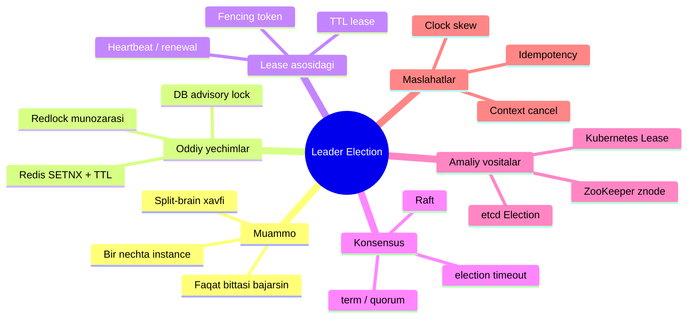
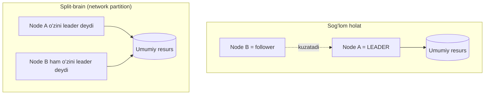
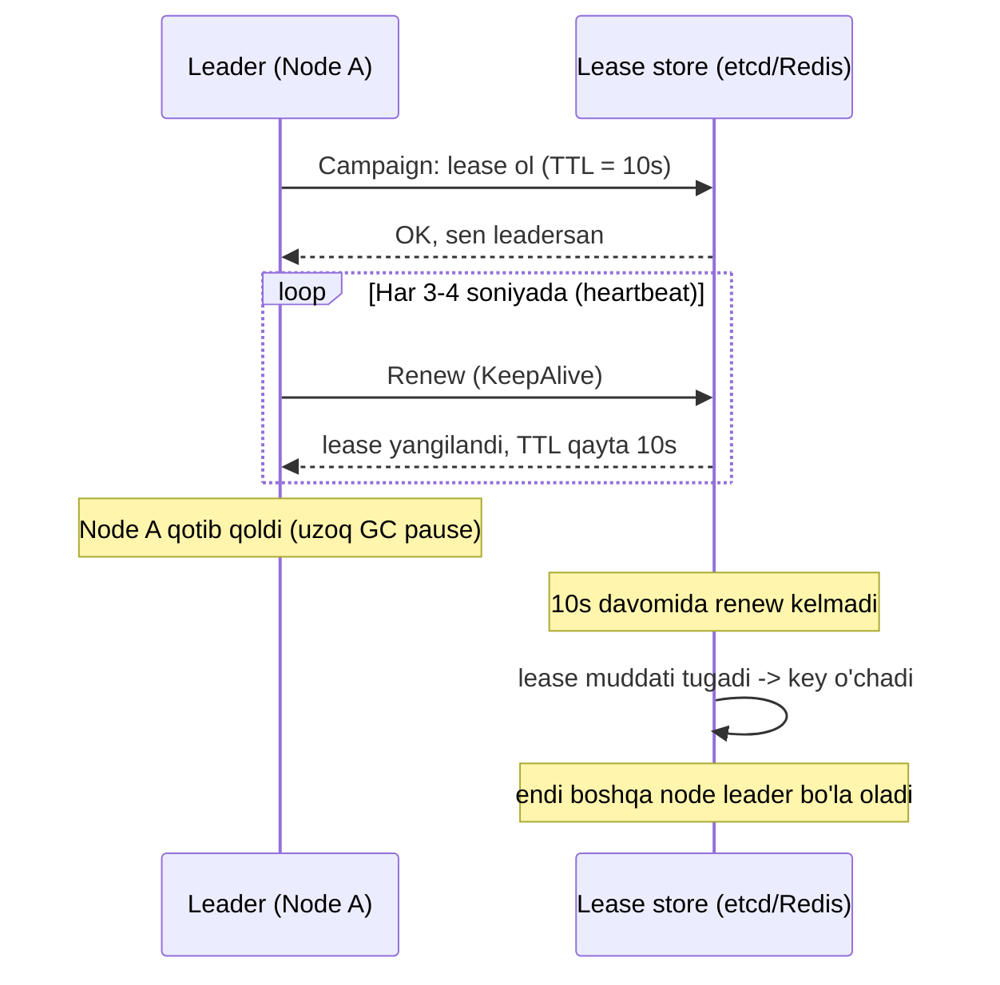
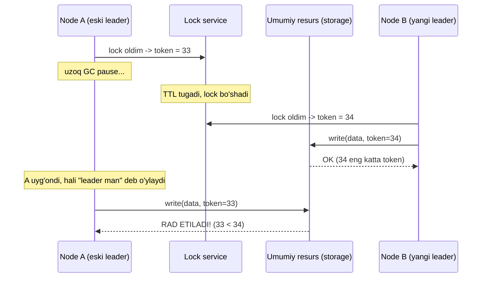
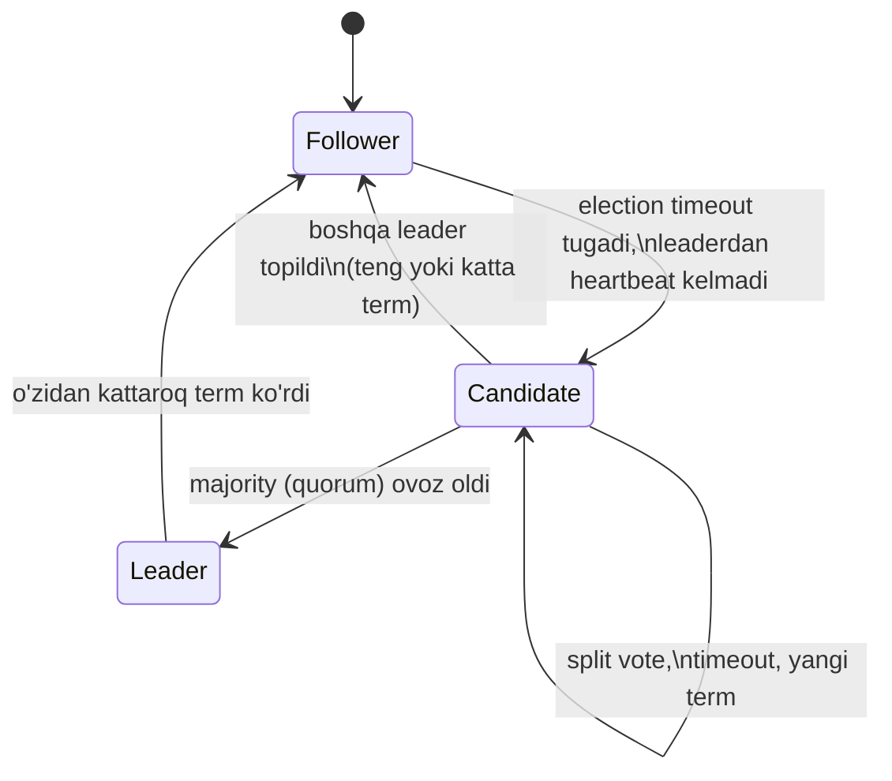
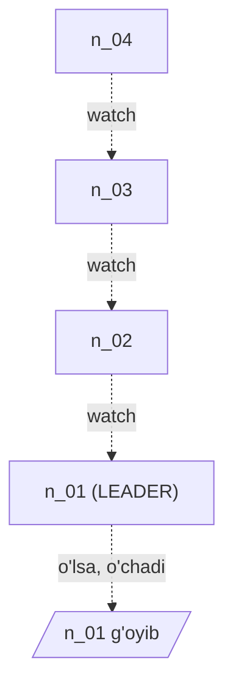

# Leader Election (Leader saylash)

> **TL;DR** — Bir nechta bir xil instance (nusxa) ishlab turganda, ba'zi ishlarni (masalan, scheduled job, singleton writer, koordinatsiya) faqat **bittasi** bajarishi kerak. Leader Election — bu shu "bitta"ni ishonchli tanlash va uni doim yagona saqlash mexanizmi. Eng katta xavf — **split-brain**: bir vaqtda ikki instance o'zini leader deb o'ylab, umumiy resursni buzishi. Yechim spektri: oddiy **distributed lock** (Redis TTL) → **lease + fencing token** → **Raft/etcd/ZooKeeper konsensusi** → **Kubernetes Lease**. Qanchalik yuqoriga chiqsang, kafolat kuchayadi, murakkablik ham oshadi.

---

## Mavzu xaritasi



---

## 1. Muammo: nega umuman leader kerak?

### Hook — real og'riq

Tasavvur qil: sen kunlik hisobot yuboradigan servis yozding. U har kuni soat 09:00 da mijozlarga email jo'natadi. Bitta instance'da hamma joyida.

Keyin trafik oshdi, sen servisni **3 ta instance**ga scale qilding (horizontal scaling). Ertasi kuni har bir mijoz **3 ta bir xil email** oldi. Chunki uch instance ham bir vaqtda cron job'ni ishga tushirdi.

Bu klassik muammo: **ba'zi ishlar butun klaster bo'ylab faqat bir marta bajarilishi kerak**, lekin instance'lar bir-biridan bexabar.

### Bunday ishlar qanaqa bo'ladi?

- **Scheduled / cron jobs** — kunlik hisobot, tozalash (cleanup), billing.
- **Singleton writer** — bir manbaga faqat bitta yozuvchi bo'lsa, konflikt (race) yo'qoladi.
- **Koordinatsiya** — kim ishni bo'laklarga bo'lib beradi (partition assignment), kim natijalarni yig'adi (aggregator).

Instance'lar hammasi **teng** (peer) — bir xil kodni ishlatadi. Tabiiy "boshliq" yo'q. Demak, birontasini **saylab** boshliq qilishimiz kerak.

### Analogiya: sinfda navbatchi

Sinfda 30 o'quvchi bor, hammasi teng. Lekin **doskani faqat bitta navbatchi** artishi kerak — aks holda hammasi bir vaqtda turib, bir-biriga xalaqit beradi. Shuning uchun sinf **bitta navbatchi saylaydi**. Navbatchi kasal bo'lib qolsa (instance o'ldi), sinf **darhol yangisini saylaydi**.

> **Leader Election** — bu bir guruh teng instance'dan bittasini **leader** (boshliq) qilib saylash va u ishlamay qolsa, avtomatik yangisini saylash mexanizmi.

### Eng katta xavf: split-brain

"Split-brain" (miya bo'linishi) — bir vaqtda **ikki instance o'zini leader deb o'ylashi**. Sabab odatda network partition (tarmoq bo'linishi): A instance B bilan aloqani yo'qotadi, lekin ikkalasi ham tirik. Har biri "leader men" deb qaror qiladi.



Ikki leader bir resursga yozsa — ma'lumot buziladi, ikki marta pul yechiladi, hisobotlar bir-birini bosib ketadi. Barcha yaxshi leader election yechimining asosiy vazifasi — **split-brain'ni oldini olish yoki uning zararini neytrallash**.

### 🤔 O'ylab ko'r

> Nega faqat "bitta alohida, doim ishlaydigan instance"ni leader qilib qo'ymaymiz? Nega saylov kerak?

<details>
<summary>💡 Javobni ko'rish</summary>

Chunki o'sha bitta instance **o'lishi** mumkin (crash, deploy, node qayta yuklandi). O'shanda butun tizim leaderisiz qoladi va ish to'xtaydi. Bizga **failover** kerak: leader o'lsa, boshqasi avtomatik uning o'rnini egallashi shart. Bu esa aynan saylov mexanizmi.
</details>

---

## 2. Oddiy yondashuvlar va ularning kamchiliklari

Eng sodda g'oya: **umumiy qulf (distributed lock)**. Kim qulfni birinchi ushlasa — o'sha leader. Sinf misolida: bitta bo'r bor, kim bo'rni ushlasa, o'sha doskaga yozadi.

### 2.1 Redis bilan: `SET NX` + TTL

Redis'da atomar buyruq bor: `SET key value NX PX 10000`. Bu "agar key hali yo'q bo'lsa (NX = Not eXists), uni o'rnat va 10 soniyadan keyin avtomatik o'chir (PX = TTL)" degani.

```
SET leader "node-1" NX PX 10000
```

- Agar buyruq muvaffaqiyatli bo'lsa — sen leadersan.
- TTL (Time To Live) bor, chunki leader o'lib qolsa, qulf **abadiy band bo'lib qolmasligi** kerak. TTL tugagach, qulf o'zi bo'shaydi.
- Leader tirik ekan, TTL tugashidan oldin qulfni **uzaytiradi** (renew).

Bu oddiy va ishlaydi, lekin ikkita jiddiy muammosi bor:

**Muammo 1 — single point of failure.** Redis o'lsa, hech kim leader bo'la olmaydi. (Azure blob lease misolida ham xuddi shu: blob service o'lsa, saylov to'xtaydi.)

**Muammo 2 — TTL va process pause = split-brain.** Bu eng nozik joyi, keyingi bo'limda batafsil.

### 2.2 Redlock munozarasi (qisqacha)

Redis mualliflari bitta Redis o'lishidan himoya uchun **Redlock** algoritmini taklif qilishgan: qulfni **bir nechta mustaqil Redis** node'ida bir vaqtda olishga urinasan, majority'da (masalan, 5 tadan 3 tada) muvaffaqiyat bo'lsa — qulf sizniki.

**Martin Kleppmann** buni tanqid qildi (mashhur maqola, quyida havola). Uning asosiy argumenti:

- Redlock **fencing token** ishlab chiqarmaydi.
- Redlock timing (soat) taxminlariga tayanadi — GC pause yoki clock skew bo'lsa, korrektlikni kafolatlay olmaydi.
- Xulosa: "Redlock na baliq, na go'sht" — oddiy efficiency-lock uchun juda murakkab, korrektlik uchun esa yetarlicha xavfsiz emas.

> **Oltin qoida:** Distributed lock ikki maqsadga xizmat qiladi — **efficiency** (bir ishni ikki marta qilmaslik, xato bo'lsa ham katta zarar yo'q) va **correctness** (ikki marta qilinsa ma'lumot buziladi). Correctness kerak bo'lsa, faqat lock yetmaydi — **fencing token** shart.

### 2.3 Database advisory lock

PostgreSQL'da `pg_advisory_lock(key)` degan mexanizm bor. Bu — DB darajasidagi qulf, jadvalga qator yozmasdan, sof mantiqiy qulf.

```sql
SELECT pg_try_advisory_lock(42);  -- true qaytsa, qulf seniki
```

- Session (ulanish) tugasa, qulf avtomatik bo'shaydi — bu leader o'lganda qulay.
- Redis'ga qo'shimcha bog'liqlik kerak emas, allaqachon bor DB'dan foydalanasan.

Kamchiligi: bu ham **fencing token bermaydi** va DB single point of failure bo'ladi. Katta yuklamada DB'ga qo'shimcha bosim tushadi.

### ⚠️ Ko'p uchraydigan xato

**Noto'g'ri tasavvur:** "TTL li lock qo'ydim, endi split-brain bo'lmaydi — chunki ikki kishi bir vaqtda `SET NX` qila olmaydi."

**Nega noto'g'ri:** `SET NX` faqat lock **olish** vaqtida atomar. Lekin lock **ushlab turgan** leader uzoq pauza (GC, network) tufayli o'z lock'i tugaganini bilmay qolishi mumkin. O'sha paytda TTL tugab, boshqa instance yangi lock oladi — endi ikki leader.

**To'g'risi:** Lock + TTL ni **fencing token** bilan birga ishlat (keyingi bo'lim). Yoki konsensus (Raft/etcd) ishlat.

---

## 3. Lease asosidagi saylov: TTL, heartbeat va fencing token

### 3.1 Lease nima?

**Lease** (ijara) — bu **vaqt bilan cheklangan qulf**. "Sen 10 soniyaga leadersan. Xohlasang, muddat tugashidan oldin uzaytir (renew). Uzaytirmasang — o'zi bekor bo'ladi."

Analogiya: kutubxonadan kitob 2 haftaga olasan. Uzaytirsang — yana ishlaydi. Uzaytirmasang — muddat tugaydi, kitob bo'shaydi. Sen kitobni qaytarishni "unutib" o'lib ketsang ham, kutubxona kitobni abadiy yo'qotmaydi.

### 3.2 Heartbeat / renewal

Leader **tirikligini** doimo bildirib turishi kerak. Buni **heartbeat** (yurak urishi) deydilar: leader lease TTL tugashidan oldin, muntazam ravishda leaseni **yangilaydi** (renew).

Muhim qoida: **renew intervali TTL'dan sezilarli kichik bo'lsin.** Masalan, TTL = 10s bo'lsa, har 3-4 soniyada renew qil. Aks holda tarmoq bir marta sekinlashsa, leaderlikni bekorga yo'qotasan.



### 3.3 Nega faqat lease yetmaydi? — stale leader muammosi

Bu Kleppmann argumentining yuragi. Diqqat bilan kuzat:

1. **Node A** lock/lease oldi (TTL = 10s). U ish boshladi.
2. Aynan shu payt A'da **uzun GC pause** boshlandi (yoki OS process'ni to'xtatdi, page fault, VM ko'chirildi). A **muzlab qoldi**, lekin buni bilmaydi.
3. 10 soniya o'tdi. A'ning lease'i **muddati tugadi**, lekin A hali muzlagan — renew qila olmadi.
4. **Node B** ko'radi: lease bo'sh. B yangi lease oladi, endi B — leader.
5. Shu payt **A uyg'onadi**. U hali ham "men leader" deb o'ylaydi (o'z ichida vaqt to'xtagan edi). A umumiy resursga **yozadi**.
6. Endi **B ham, A ham** bir resursga yozyapti — **split-brain!**

Bu yerda muammo lock'da emas. Muammo shuki, **A o'zining lease'i tugaganini bilmaydi** va eski bilim bilan yozadi. TTL ni cheksiz oshirish yordam bermaydi — pause undan ham uzoq bo'lishi mumkin.

### 3.4 Fencing token — yechim

**Fencing token** — bu monotonik (doim o'sib boradigan) butun son. Lease har marta qo'ldan qo'lga o'tganda, u **+1** bo'ladi.

Muhimi: umumiy resurs (storage, DB) **har bir yozuvda token'ni tekshiradi** va **eski (kichik) token'li so'rovni rad etadi**.



- A `token=33` bilan keldi. Ammo storage allaqachon `34` ni ko'rgan.
- Storage `33 < 34` deb, A'ning so'rovini **rad etadi**.
- Split-brain bo'lsa ham, **zarar bo'lmaydi** — chunki resurs o'zini himoya qiladi.

> **Oltin qoida:** Lock/lease "kim leader"ni aytadi. **Fencing token** esa "leaderlik haqiqatan hozir kimda"ni resurs darajasida **isbotlaydi**. Correctness kerak bo'lsa, resurs monotonik token'ni tekshirishi shart.

### ⚠️ Ko'p uchraydigan xato

**Noto'g'ri tasavvur:** "Fencing token'ni faqat lock service tekshirsa bo'ladi."

**Nega noto'g'ri:** Lock service token beradi, lekin yozuv **umumiy resursga** boradi. Agar resurs token'ni tekshirmasa, eski leader baribir yozib yuboradi. Tekshiruv **yozuv qabul qiladigan tomonda** (storage/DB) bo'lishi shart.

---

## 4. Raft konsensusi — ishonchli saylovning oltin standarti

Yuqoridagi lock/lease yechimlar bitta tashqi xizmatga (Redis, DB) tayanadi. **Konsensus algoritmi** esa boshqacha: node'lar **o'zaro kelishib**, hech qanday tashqi hakam'siz yagona leader tanlaydi va bir xil qarorlarga keladi. Eng mashhur, tushunarli algoritm — **Raft** (Diego Ongaro, John Ousterhout, "In Search of an Understandable Consensus Algorithm").

etcd, Consul, TiKV, CockroachDB — hammasi ichida Raft ishlaydi. Demak, "etcd bilan leader saylash" — aslida Raft ustida qurilgan.

### 4.1 Uch holat (state)

Raft'da har bir node uch holatdan birida bo'ladi:

| Holat | Vazifasi |
| --- | --- |
| **Follower** (izdosh) | Passiv. Faqat leaderdan xabar (heartbeat) kutadi va javob beradi. |
| **Candidate** (nomzod) | Saylovga kirgan. Boshqalardan ovoz so'rayapti. |
| **Leader** | Boshliq. Barcha o'zgarishlarni qabul qiladi va follower'larga tarqatadi. |

Analogiya: sinf. Odatda hamma **o'quvchi (follower)**. Navbatchi (leader) g'oyib bo'lsa, kimdir "men bo'lay!" deb **nomzod (candidate)** bo'ladi va ovoz so'raydi. Ko'pchilik ovoz bersa — u **navbatchi (leader)**.

### 4.2 Term — mantiqiy soat

**Term** (davr) — bu doim o'sib boradigan raqam, saylov "avlodi". Har yangi saylov = yangi term (masalan, term 5 → term 6). Term — Raft'ning **mantiqiy soati** (logical clock).

Qoida: har bir node kattaroq term'ni ko'rsa, darhol o'zini yangilaydi va **follower**ga tushadi. Eski term'li xabar **e'tiborsiz** qoldiriladi. Bu — "stale leader"ni tabiiy ravishda chetlab o'tish usuli (term aslida fencing token vazifasini bajaradi!).

### 4.3 Saylov qanday kechadi?



1. **Election timeout** — har follower ichida taymer bor (masalan, 150-300ms). Leaderdan heartbeat kelmasa, taymer tugaydi.
2. Taymer tugagan node **candidate** bo'ladi: term'ni +1 qiladi, o'ziga ovoz beradi va boshqalarga **RequestVote** RPC yuboradi.
3. Boshqa node'lar: "bu term'da hali ovoz bermaganman va uning log'i menikidan eski emas" bo'lsa — **ovoz beradi**.
4. Candidate **majority** (yarmidan ko'p) ovoz olsa — **leader** bo'ladi va darhol heartbeat yubora boshlaydi.
5. Leader esa **AppendEntries** RPC (bo'sh bo'lsa — heartbeat) yuborib, o'z hokimiyatini saqlaydi.

### 4.4 Split vote va randomized timeout

**Muammo:** agar ikki follower **bir vaqtda** candidate bo'lsa, ovozlar bo'linadi (split vote) — hech kim majority ololmaydi. Saylov muvaffaqiyatsiz.

**Yechim — randomized election timeout.** Har node timeout'ni **tasodifiy** oraliqdan tanlaydi (masalan, 150-300ms orasida random). Shuning uchun odatda **bittasi birinchi** tugaydi, u tez candidate bo'lib, boshqalar uyg'onguncha g'alabani qo'lga kiritadi. Agar baribir split bo'lsa — keyingi round'da yana tasodifiy kutish, ehtimol yana kamayadi.

> **Muhim g'oya:** Raft murakkab matematik yechim o'rniga oddiy **tasodif**dan foydalanadi — bu split vote'ni amalda deyarli yo'qqa chiqaradi.

### 4.5 Nega quorum (majority) va nega toq son node?

**Quorum** — qaror qabul qilish uchun kerakli minimal node soni = `N/2 + 1` (yarmidan ko'p).

Nima uchun majority? Chunki **ikki xil majority bir vaqtda mavjud bo'la olmaydi**. Agar A guruh majority olgan bo'lsa, B guruh hech qachon majority ololmaydi — kamida bitta node ikkalasida ham bo'lishi kerak, u esa bir term'da faqat bir marta ovoz beradi. Shu tariqa **bir term'da faqat bitta leader** kafolatlanadi — ana shu split-brain'ning oldini oladi.

**Nega toq son (3, 5, 7)?**

| Node soni | Quorum | Chidaydigan xatolik |
| --- | --- | --- |
| 3 | 2 | 1 node o'lsa ham ishlaydi |
| 4 | 3 | 1 node o'lsa ham ishlaydi (lekin 4-si bekorga) |
| 5 | 3 | 2 node o'lsa ham ishlaydi |

Ko'rinib turibdi: **4 node 3 node bilan bir xil chidamlilikni** beradi (ikkalasi ham faqat 1 ta o'lishga chidaydi), lekin 4 node ko'proq resurs va aloqa. Shuning uchun **toq son** samaraliroq. Odatda **3 yoki 5** node ishlatiladi.

### 4.6 Log replication (qisqacha) va safety

Raft faqat leader saylamaydi — u **replicated log** (takrorlangan jurnal) ni ham boshqaradi:

1. Klient o'zgarishni **leader**ga yuboradi.
2. Leader uni o'z log'iga yozadi va **AppendEntries** bilan follower'larga tarqatadi.
3. Yozuv **majority**da saqlangach, leader uni **commit** qiladi va state machine'ga qo'llaydi.

**Safety qoidasi:** faqat log'i **eng yangi** (up-to-date) bo'lgan node leader bo'la oladi. Shu tufayli allaqachon commit qilingan ma'lumot yangi leader tomonidan **hech qachon o'chirilmaydi**. Ovoz berishda node candidate'ning log'i o'zinikidan eski bo'lsa, ovoz bermaydi.

### 🤔 O'ylab ko'r

> 5 node'li Raft klasteri bor. Network partition bo'ldi: bir tomonda 2 node, ikkinchi tomonda 3 node. Qaysi tomon leader saylay oladi? Ikki leader paydo bo'ladimi?

<details>
<summary>💡 Javobni ko'rish</summary>

Faqat **3 node'li tomon** leader saylay oladi, chunki quorum = 3. 2 node'li tomon quorum (3) ni ololmaydi, shuning uchun **leader saylay olmaydi** va yozuvni qabul qilmaydi. Demak **ikki leader paydo bo'lmaydi** — split-brain yo'q. Bu Raft'ning asosiy kuchi: ozchilik tomon "ishlashni to'xtatib", butunlikni (consistency) saqlaydi. Bu CAP teoremasidagi "CP" tanlovi.
</details>

---

## 5. ZooKeeper retsepti: ephemeral sequential znode + watch

ZooKeeper — Raft'dan oldingi mashhur koordinatsiya xizmati (ichida ZAB protokoli, Raft'ga o'xshash). Uning leader election **retsepti** juda nafis va o'rganishga arziydi.

### Ikkita muhim tushuncha

- **Ephemeral znode** — ZooKeeper'dagi tugun (fayl-katalogga o'xshash), lekin uni yaratgan klient **session'i tugasa (o'lsa) avtomatik o'chadi**. Bu leader o'lganini bildirishning ideal usuli.
- **Sequential znode** — yaratilganda ZooKeeper unga **avtomatik o'suvchi raqam** qo'shadi: `n_0000000001`, `n_0000000002`, ... (bu ham fencing token'ga o'xshaydi!).

### Retsept

1. Har bir nomzod `/election/guid-n_` ostida **ephemeral + sequential** znode yaratadi. ZooKeeper unga raqam beradi.
2. Nomzod barcha bola tugunlarni o'qiydi. **Eng kichik raqamli** kim bo'lsa — **o'sha leader**.
3. Agar sen eng kichik bo'lmasang — **o'zingdan bittagina kichik** tugunni **watch** qilasan (kuzatasan), leaderni emas.
4. O'sha kuzatilayotgan tugun **o'chsa** (o'sha instance o'ldi), sen uyg'onasan va qayta tekshirasan: endi eng kichik menmi?



### Nega bu aqlli? — herd effect (thundering herd) oldini olish

**Herd effect** (poda effekti) — leader o'lganda **hamma nomzod bir vaqtda uyg'onib**, ZooKeeper'ga bir vaqtda so'rov yog'dirishi. Bu server'ni ko'mib tashlaydi (operatsiyalar spike'i).

ZooKeeper retseptida har bir tugunni **faqat bitta** klient kuzatadi (o'zidan bittagina kichigini). Shuning uchun bitta tugun o'chsa — **faqat bitta klient uyg'onadi**, hammasi emas. Bu — poda effektidan qutulishning klassik usuli.

> **Oltin qoida:** "Hamma leader'ni kuzatsin" — sodda, lekin herd effect keltiradi. "Har kim faqat oldingisini kuzatsin" — biroz murakkab, lekin miqyoslanadigan (scalable) yechim.

### ⚠️ Ko'p uchraydigan xato

**Noto'g'ri tasavvur:** "Barcha nomzod to'g'ridan-to'g'ri leader znode'ini watch qilsa yetadi."

**Nega noto'g'ri:** Leader o'lsa, bir vaqtda 1000 klient uyg'onadi va hammasi "endi men leadermanmi?" deb so'rov yuboradi → server gup etadi. Zanjir shaklida (har kim oldingisini) kuzatish bu muammoni yo'qotadi.

---

## 6. etcd bilan Go misoli — `clientv3/concurrency`

etcd — Go dunyosida leader election uchun eng ko'p ishlatiladigan vosita (Kubernetes ham etcd'da yashaydi). Ichida **Raft**, tashqarida esa juda oson API: `concurrency` package.

Uchta asosiy tushuncha:

| Element | Vazifasi |
| --- | --- |
| **Session** | TTL'li lease ushlab turadi — bu senning "yurak urishing" (heartbeat). Session tirik ekan, lease avtomatik uzayadi. |
| **Election** | Ma'lum bir key prefix'i bo'yicha saylov obyekti. |
| **Campaign / Resign** | Leader bo'lishga kurashish / leaderlikdan voz kechish. |

### 6.1 Asosiy oqim

```go
// --- 1-qadam: etcd klasteriga ulanamiz ---
cli, err := clientv3.New(clientv3.Config{
    Endpoints:   []string{"localhost:2379"},
    DialTimeout: 5 * time.Second,
})
if err != nil {
    log.Fatal(err)
}
defer cli.Close()

// --- 2-qadam: session yaratamiz (TTL=10s lease = heartbeat) ---
session, err := concurrency.NewSession(cli, concurrency.WithTTL(10))
if err != nil {
    log.Fatal(err)
}
defer session.Close()
```

**Notional machine — aslida nima bo'ladi?** `NewSession` etcd'da 10 soniyalik **lease** yaratadi va fon (background) goroutine ishga tushiradi. Bu goroutine muntazam **KeepAlive** yuborib, lease TTL'ni yangilab turadi. Process o'lsa — KeepAlive to'xtaydi — 10s ichida lease etcd tomonidan **o'chiriladi** — leaderlik boshqasiga o'tadi.

### 6.2 Campaign — leaderlik uchun kurash

```go
// --- 3-qadam: saylov obyekti (bir prefix bo'yicha) ---
election := concurrency.NewElection(session, "/my-service/leader")

// --- 4-qadam: leaderlik uchun kurashamiz (BLOKLAYDI) ---
ctx := context.Background()
if err := election.Campaign(ctx, "node-1"); err != nil {
    log.Fatal(err)
}
log.Println("Men leader bo'ldim!")
```

**Notional machine:** `Campaign` etcd'da o'z lease'iga bog'langan key yaratadi (sequential — xuddi ZooKeeper znode kabi). Agar sen eng kichik revision bo'lsang — darhol leader bo'lasan. Bo'lmasang — funksiya **bloklanadi** (kutadi), oldingi navbatdagilarni watch qilib turadi. Sen navbatning boshiga chiqqaningda — bloklash tugaydi.

### 6.3 To'liq ishlaydigan misol

```go
package main

import (
    "context"
    "log"
    "time"

    clientv3 "go.etcd.io/etcd/client/v3"
    "go.etcd.io/etcd/client/v3/concurrency"
)

func main() {
    cli, err := clientv3.New(clientv3.Config{
        Endpoints:   []string{"localhost:2379"},
        DialTimeout: 5 * time.Second,
    })
    if err != nil {
        log.Fatal(err)
    }
    defer cli.Close()

    session, err := concurrency.NewSession(cli, concurrency.WithTTL(10))
    if err != nil {
        log.Fatal(err)
    }
    defer session.Close()

    election := concurrency.NewElection(session, "/my-service/leader")

    // Leader bo'lguncha bloklanadi
    if err := election.Campaign(context.Background(), "node-1"); err != nil {
        log.Fatal(err)
    }
    log.Println("Men LEADER bo'ldim, ishni boshlayman")

    // Leaderlikni yo'qotsak, session.Done() yopiladi -> darhol to'xtaymiz
    doLeaderWork(session.Done())

    // Chiroyli chiqish: leaderlikdan voz kechamiz
    ctx, cancel := context.WithTimeout(context.Background(), 3*time.Second)
    defer cancel()
    election.Resign(ctx)
    log.Println("Leaderlikdan voz kechdim")
}

func doLeaderWork(lost <-chan struct{}) {
    ticker := time.NewTicker(2 * time.Second)
    defer ticker.Stop()
    for {
        select {
        case <-lost:
            // Lease muddati tugadi = leaderlikni yo'qotdik
            log.Println("Leaderlikni yo'qotdim! Ishni to'xtataman")
            return
        case <-ticker.C:
            log.Println("Leader sifatida ish bajaryapman...")
        }
    }
}
```

**Output (taxminan):**

```
2026/07/08 09:00:01 Men LEADER bo'ldim, ishni boshlayman
2026/07/08 09:00:03 Leader sifatida ish bajaryapman...
2026/07/08 09:00:05 Leader sifatida ish bajaryapman...
...
```

Agar bu process o'lsa, ikkinchi instance (`node-2`) `Campaign` bloklashidan chiqib, "Men LEADER bo'ldim" deb ishni davom ettiradi.

### 🤔 O'ylab ko'r

> Yuqoridagi kodda `doLeaderWork` ichida `case <-lost:` ni olib tashlasak nima bo'ladi?

<details>
<summary>💡 Javobni ko'rish</summary>

Katta xato bo'ladi! Agar tarmoq nosozligi tufayli lease muddati tugab, etcd boshqa node'ni leader qilsa — bu process buni **bilmay**, `ticker` bo'yicha ishni **davom ettiraveradi**. Endi ikki leader ish bajaradi = **split-brain**. `session.Done()` ni kuzatish — leaderlikni yo'qotganda **darhol to'xtash** uchun majburiy. Bu — 8-bo'limdagi "context cancellation" maslahatining amaliy ko'rinishi.
</details>

### ⚠️ Ko'p uchraydigan xato

**Noto'g'ri tasavvur:** "`Campaign` qaytdi, demak men doim leaderman, xotirjam ishlashim mumkin."

**Nega noto'g'ri:** `Campaign` faqat leader **bo'lgan payt**ni bildiradi. Keyin tarmoq uzilib, lease tugashi mumkin. Leaderlik — **doimiy tekshiriladigan holat**, bir martalik hodisa emas. Doim `session.Done()` ni kuzat.

---

## 7. Kubernetes'da leader election — `client-go` va Lease object

Kubernetes'ning o'zi ichida leader election'dan keng foydalanadi. Masalan, **kube-controller-manager** va **kube-scheduler** har birida bir nechta nusxa (HA uchun) ishlaydi, lekin bir vaqtda faqat **bitta**si aktiv ishlaydi. Buni ular **Lease object** orqali qiladi.

### 7.1 Lease object

Kubernetes'da `coordination.k8s.io/v1` API'sida maxsus **Lease** resursi bor. Bu — API server'da saqlanadigan, tabiiy TTL'li kichik obyekt:

| Maydon | Ma'nosi |
| --- | --- |
| `holderIdentity` | Hozirgi leader kimligi (masalan, pod nomi) |
| `leaseDurationSeconds` | Lease necha soniya amal qiladi |
| `renewTime` | Oxirgi marta qachon yangilangan |
| `acquireTime` | Birinchi marta qachon egallangan |
| `leaseTransitions` | Leaderlik necha marta qo'l almashgani |

**Saylov mantiqi:** nomzodlar Lease'ni kuzatadi. Agar `now > renewTime + leaseDurationSeconds` bo'lsa (lease "eskirgan"), nomzod uni o'z nomiga yangilashga urinadi. Kubernetes **optimistic concurrency** (resourceVersion) ishlatadi — bir vaqtda faqat **bitta** yangilash muvaffaqiyatli bo'ladi, qolganlari "version mismatch" bilan rad etiladi. Muvaffaqiyatli node — yangi leader.

### 7.2 Uch muhim vaqt sozlamasi

| Sozlama | Ma'nosi | Odatiy |
| --- | --- | --- |
| **LeaseDuration** | Non-leader lease "o'lgan" deb hisoblab, egallashga urinishdan oldin kutadigan vaqt | 15s |
| **RenewDeadline** | Leader renew'ni qancha vaqt urinib, bo'lmasa voz kechadi | 10s |
| **RetryPeriod** | Egallash/yangilashni qancha tez-tez qayta urinish | 2s |

Qoida: `LeaseDuration > RenewDeadline > RetryPeriod`. `LeaseDuration / RenewDeadline` nisbati **clock skew** (soatlar farqi)ga chidamlilikni belgilaydi.

### 7.3 Go misoli

```go
package main

import (
    "context"
    "time"

    "k8s.io/client-go/kubernetes"
    "k8s.io/client-go/rest"
    "k8s.io/client-go/tools/leaderelection"
    "k8s.io/client-go/tools/leaderelection/resourcelock"
)

func main() {
    // --- 1-qadam: klaster ichidan k8s klientini olamiz ---
    config, _ := rest.InClusterConfig()
    clientset, _ := kubernetes.NewForConfig(config)

    // --- 2-qadam: Lease asosidagi qulf (har node UNIKAL Identity bilan) ---
    lock := &resourcelock.LeaseLock{
        Namespace: "default",
        Name:      "my-controller-leader",
        Client:    clientset.CoordinationV1(),
        LockConfig: resourcelock.ResourceLockConfig{
            Identity: "pod-hostname-abc", // odatda os.Hostname() yoki POD_NAME
        },
    }

    // --- 3-qadam: saylovni ishga tushiramiz ---
    ctx, cancel := context.WithCancel(context.Background())
    defer cancel()

    leaderelection.RunOrDie(ctx, leaderelection.LeaderElectionConfig{
        Lock:            lock,
        ReleaseOnCancel: true, // chiqishda lease'ni bo'shatamiz -> tez failover
        LeaseDuration:   15 * time.Second,
        RenewDeadline:   10 * time.Second,
        RetryPeriod:     2 * time.Second,
        Callbacks: leaderelection.LeaderCallbacks{
            OnStartedLeading: func(ctx context.Context) {
                // Leader bo'ldik: ishni SHU YERDA boshlaymiz
                runController(ctx)
            },
            OnStoppedLeading: func() {
                // Leaderlikni yo'qotdik: ish AVTOMATIK to'xtashi kerak
                // (ctx bekor qilinadi, runController ichida tinglanadi)
            },
            OnNewLeader: func(identity string) {
                // Kimdir (biz yoki boshqa) leader bo'lganini bilamiz
            },
        },
    })
}

func runController(ctx context.Context) {
    for {
        select {
        case <-ctx.Done():
            return // leaderlik yo'qoldi -> darhol chiqamiz
        default:
            // ... controller mantiqi ...
        }
    }
}
```

**Notional machine:** `RunOrDie` fon'da loop ishga tushiradi. U har `RetryPeriod`da Lease obyektini API server'dan o'qiydi/yangilaydi. Leader bo'lganingda `OnStartedLeading` chaqiriladi va unga **context** beriladi. Leaderlikni yo'qotsang — o'sha **context bekor qilinadi** (`ctx.Done()` yopiladi), shuning uchun ishing avtomatik to'xtaydi.

### 7.4 Muhim ogohlantirish: k8s leader election fencing bermaydi

`client-go` hujjatlari ochiq yozadi: bu mexanizm **fencing'ni kafolatlamaydi**. Ya'ni network partition + GC pause sharoitida ikki leader **bir zumga bir vaqtda** ish bajarishi mumkin. K8s API server bu xavfni **qisman** kamaytiradi (eski obyektga yozuv rad etiladi — optimistic concurrency), lekin bu to'liq fencing emas.

> **Amaliy xulosa:** Kubernetes leader election "yaxshi kunlar" uchun yetarli, lekin leader bajaradigan ish **idempotent** bo'lishi va leaderlik yo'qolganda **darhol to'xtashi** shart. Chinakam fencing kerak bo'lsa, resurs darajasida token tekshiruvi qo'shishing kerak.

---

## 8. Amaliy maslahatlar (production uchun)

### 8.1 Leader ishini idempotent qil

**Idempotent** — bir ish ikki marta bajarilsa ham, natija bir marta bajargandek bo'lishi. Split-brain'ni 100% oldini olish qiyin, shuning uchun **zararini** kamaytir: agar ikki leader bir zumga bir ishni qilsa ham, idempotentlik tufayli buzilish bo'lmasin.

Masalan: "email yuborishdan oldin `sent` belgisini atomar qo'y", "billing'da unique transaction ID ishlat".

### 8.2 Leaderlik yo'qolganda DARHOL to'xta (context cancellation)

Bu eng muhim amaliy qoida. Leaderlikni yo'qotganingni bilishing bilan, joriy ishni **darhol to'xtat**. Go'da bu — `context`ni kuzatish:

```go
select {
case <-ctx.Done():
    return // leaderlik ketdi, ish to'xtaydi
case work := <-jobs:
    process(work)
}
```

Agar sekin to'xtasang — eski leader hali ishlayotgan paytda yangi leader ham boshlaydi = split-brain oynasi kengayadi.

### 8.3 Clock skew (soatlar farqi) xavfi

Ko'p yechim vaqtga tayanadi (TTL, renewTime). Lekin serverlarning soatlari bir xil emas — biri 2 soniya oldinda, biri orqada bo'lishi mumkin. Bu **clock skew**.

- **TTL/lease muddatini juda qisqa qilma** — clock skew tufayli leader bekorga leaderlikni yo'qotishi mumkin.
- Ishonchli tizimlar (Raft/etcd) sof vaqtga emas, **term/majority**ga tayanadi — shuning uchun clock skew'ga chidamliroq.
- Absolyut "wall clock" (soat vaqti) bilan taqqoslashdan qoch; iloji bo'lsa **monotonic clock** yoki nisbiy intervallar ishlat.

### 8.4 Failover tezligini sozlash

- **LeaseDuration/TTL kichik** → tez failover, lekin noto'g'ri saylov (flapping) va ko'p tarmoq trafigi xavfi.
- **LeaseDuration/TTL katta** → barqaror, lekin leader o'lsa uzoq vaqt hech kim ishlamaydi.
- Balansni use-case'ga qarab tanla. Odatda 10-15s lease, TTL yarmida renew — yaxshi boshlang'ich.

---

## 9. Taqqoslash jadvali

| Xususiyat | Redis lock (SETNX+TTL) | ZooKeeper | etcd / Raft | Kubernetes Lease |
| --- | --- | --- | --- | --- |
| **Asos** | TTL li key | ZAB konsensus + ephemeral znode | Raft konsensus | etcd (Raft) ustida Lease obyekti |
| **Split-brain kafolati** | Zaif (fencing yo'q) | Kuchli (linearizable) | Kuchli (quorum) | O'rta (optimistic lock, to'liq fencing yo'q) |
| **Fencing token** | Yo'q (o'zing qo'shasan) | Bor (znode sequence) | Bor (revision/term) | Yo'q (rasman) |
| **Failover** | TTL tugashiga bog'liq | Session tugashi bilan tez | Election timeout bilan tez | LeaseDuration bilan |
| **Murakkablik** | Juda oson | O'rta (operatsion og'ir) | O'rta | Oson (k8s ichida bo'lsa) |
| **Bog'liqlik** | Redis | ZooKeeper ansambli | etcd klasteri | Kubernetes API |
| **Qachon ishlat** | Oddiy efficiency-lock, katta zarar yo'q | Klassik enterprise, Kafka/Hadoop olami | Cloud-native, kuchli konsistentlik kerak | K8s ichidagi controller/operator |

> **Tanlov qoidasi:** Sen allaqachon Kubernetes'da bo'lsang — **Lease** ishlat (hech narsa qo'shmaysan). Kuchli konsistentlik kerak va cloud-native bo'lsang — **etcd**. Efficiency uchun, ozgina yo'qotish qo'rqinchli bo'lmasa — **Redis**. ZooKeeper — eski/JVM ekotizim uchun.

---

## 10. Interview savollari

**1. Split-brain nima va Leader Election uni qanday oldini oladi?**

<details>
<summary>Javob</summary>

Split-brain — bir vaqtda ikki (yoki undan ko'p) instance o'zini leader deb hisoblashi, odatda network partition tufayli. Ular umumiy resursga bir vaqtda yozib, ma'lumotni buzadi. Konsensus asosidagi yechimlar (Raft) buni **quorum (majority)** talab qilib oldini oladi: ikki xil majority bir vaqtda mavjud bo'la olmaydi, shuning uchun bir term'da faqat bitta leader bo'ladi. Zaifroq yechimlar (Redis lock) esa **fencing token** bilan zararni neytrallaydi.
</details>

**2. Nega faqat TTL li lock yetmaydi? Fencing token nima uchun kerak?**

<details>
<summary>Javob</summary>

Lock ushlagan leader uzun GC pause yoki tarmoq kechikishi tufayli o'z lease'i tugaganini bilmay qolishi mumkin (stale leader). O'sha payt boshqa instance yangi lock oladi. Eski leader uyg'onib, hali "men leaderman" deb resursga yozadi — split-brain. **Fencing token** (monotonik o'suvchi son) buni hal qiladi: resurs har yozuvda token'ni tekshiradi va eski (kichik) token'li so'rovni rad etadi. Kleppmann argumentining mohiyati shu.
</details>

**3. Raft'da nima uchun toq son (3, 5) node tavsiya etiladi?**

<details>
<summary>Javob</summary>

Quorum = N/2 + 1. 3 node 1 ta o'lishga chidaydi (quorum=2), 4 node ham faqat 1 ta o'lishga chidaydi (quorum=3) — ya'ni 4-node qo'shimcha chidamlilik bermaydi, faqat resurs va aloqa yuki oshadi. Shuning uchun **toq son** samaraliroq: 5 node 2 ta o'lishga chidaydi. Toq son, shuningdek, teng bo'linishda (split) hech qachon 50/50 bo'lmasligini ta'minlaydi.
</details>

**4. Randomized election timeout qanday muammoni hal qiladi?**

<details>
<summary>Javob</summary>

**Split vote** muammosini. Agar bir nechta follower bir vaqtda candidate bo'lsa, ovozlar bo'linadi va hech kim majority ololmaydi — saylov cho'ziladi. Har node timeout'ni tasodifiy oraliqdan (masalan 150-300ms) tanlasa, odatda bittasi birinchi tugab, boshqalar uyg'onguncha g'alaba qozonadi. Bu split vote ehtimolini keskin kamaytiradi.
</details>

**5. ZooKeeper'ning leader election retsepti herd effect'ni qanday oldini oladi?**

<details>
<summary>Javob</summary>

Har nomzod ephemeral + sequential znode yaratadi; eng kichik raqamli leader bo'ladi. Muhimi: har nomzod leader'ni emas, **o'zidan bittagina kichik** znode'ni watch qiladi. Shuning uchun bir znode o'chsa, faqat **bitta** klient uyg'onadi — hammasi emas. Agar hamma leader'ni kuzatsa, leader o'lganda barcha klient bir vaqtda so'rov yog'dirib, server'ni ko'mib tashlardi (herd effect / thundering herd).
</details>

**6. Kubernetes leader election split-brain'ga to'liq kafolat beradimi? Nima uchun ish idempotent bo'lishi kerak?**

<details>
<summary>Javob</summary>

Yo'q. `client-go` hujjatlari ochiq aytadi: bu mexanizm **fencing bermaydi**. Network partition + GC pause sharoitida ikki leader bir zumga bir vaqtda ish qilishi mumkin. K8s API server optimistic concurrency (resourceVersion) bilan xavfni qisman kamaytiradi, lekin to'liq emas. Shu sabab leader ishi **idempotent** bo'lishi va leaderlik yo'qolganda `context` orqali **darhol to'xtashi** shart — shunda qisqa split-brain oynasi zarar keltirmaydi.
</details>

---

## Xulosa

- **Leader Election** — bir guruh teng instance'dan bittasini boshliq qilib saylash va u o'lsa avtomatik yangisini saylash. Maqsad: ba'zi ishlar butun klaster bo'ylab faqat **bir marta** bajarilsin.
- Eng katta xavf — **split-brain**: bir vaqtda ikki leader umumiy resursni buzishi.
- **Distributed lock (Redis TTL, DB advisory)** — oddiy, lekin stale leader tufayli split-brain'dan himoya qilmaydi.
- **Lease + fencing token** — lock "kim leader"ni aytadi, fencing token resurs darajasida "hozir kim haqiqiy leader"ni isbotlaydi va eski leader'ni rad etadi.
- **Raft konsensusi** — quorum (majority) va term orqali bir term'da yagona leader kafolatlaydi; randomized timeout split vote'ni hal qiladi; toq son node samaraliroq.
- **ZooKeeper / etcd / k8s Lease** — amaliy vositalar; etcd Go'da eng qulay (`concurrency` package), k8s ichida bo'lsang Lease tayyor.
- Production'da: ishni **idempotent** qil, leaderlik yo'qolsa **darhol to'xta** (context), **clock skew**'dan ehtiyot bo'l.

## 🧠 Eslab qol

- Split-brain — ikki leader bir vaqtda; barcha yechimning bosh dushmani shu.
- Lock yolg'iz correctness bermaydi — **fencing token** kerak (monotonik son, resurs tekshiradi).
- Raft: **quorum = N/2 + 1**, shuning uchun bir term'da faqat bitta leader.
- Randomized election timeout — **split vote**ni yo'q qiladigan oddiy tasodif.
- Leaderlik — **bir martalik hodisa emas, doim tekshiriladigan holat**.

## ✅ O'z-o'zini tekshir (retrieval practice)

**1. Redis'da `SET key val NX PX 10000` bilan lock qo'ydik. Leader'da 12 soniyalik GC pause bo'ldi. Nima bo'ladi va nega?**

<details>
<summary>Javob</summary>

10 soniyadan keyin TTL tugab, lock bo'shaydi. Boshqa instance yangi lock oladi va leader bo'ladi. Pause tugagach, eski leader hali "men leader" deb resursga yozadi — **split-brain**. Fencing token bo'lmasa, resurs eski yozuvni qabul qiladi va ma'lumot buziladi.
</details>

**2. 5 node'li etcd (Raft) klasterida 3 node o'ldi. Klaster yozuvni qabul qila oladimi? Nega?**

<details>
<summary>Javob</summary>

Yo'q. Quorum = 5/2 + 1 = 3. Faqat 2 node tirik qoldi, quorum (3) yo'q. Leader saylanmaydi va yozuv qabul qilinmaydi. Klaster read-only holatga tushib, butunlikni (consistency) saqlaydi. 5 node maksimum **2** node o'lishiga chidaydi.
</details>

**3. `LeaseDuration`ni 15s dan 2s ga tushirsak, qanday afzallik va qanday xavf paydo bo'ladi?**

<details>
<summary>Javob</summary>

Afzallik: leader o'lsa, failover tezroq (2s ichida). Xavf: **clock skew** yoki tarmoq kechikishi tufayli sog'lom leader ham renew'ni ulgurmay leaderlikni bekorga yo'qotishi mumkin — tez-tez leader almashinishi (flapping) va ortiqcha tarmoq trafigi. Juda qisqa TTL barqarorlikni buzadi.
</details>

**4. ZooKeeper retseptida nega har nomzod leader znode'ini emas, o'zidan bir kichik znode'ni watch qiladi?**

<details>
<summary>Javob</summary>

Herd effect (thundering herd) oldini olish uchun. Zanjir tuzilsa, bir znode o'chganda faqat bitta klient uyg'onadi. Hamma leader'ni kuzatsa, leader o'lganda barcha klient bir vaqtda so'rov yuborib server'ni ortiqcha yuklaydi.
</details>

**5. Fencing token bilan lock'ning farqi nima? Nega ikkalasi ham kerak bo'lishi mumkin?**

<details>
<summary>Javob</summary>

Lock — "hozir kim leader" degan qaror (lock service beradi). Fencing token — o'sha qarorni **umumiy resurs** darajasida tasdiqlaydigan monotonik son. Lock stale bo'lib qolishi mumkin (eski leader bilmaydi), lekin fencing token bilan resurs eski leader'ning yozuvini rad etadi. Correctness kerak bo'lsa, faqat lock yetmaydi — token resurs tomonidan tekshirilishi shart.
</details>

## 🛠 Amaliyot

**1. Oson (Modify).** 6-bo'limdagi etcd misolida `WithTTL(10)`ni `WithTTL(30)`ga o'zgartir va `doLeaderWork` ticker'ini har 2s o'rniga har 10s qil. Failover'ga qanday ta'sir qilishini kuzatish uchun izoh yoz: TTL katta bo'lsa nima yutamiz, nimani boy beramiz.

<details>
<summary>Hint</summary>

Katta TTL → leader o'lsa, yangi node uni sezishi uchun 30s gacha kutishi mumkin (sekin failover). Lekin leader tarmoq tebranishidan leaderlikni bekorga yo'qotmaydi (barqaror). Bu 8.4-bo'limdagi balans.
</details>

**2. O'rta (Faded example).** Quyidagi etcd leader-with-observer skeletini to'ldir:

```go
func runWithLeadership(cli *clientv3.Client) error {
    session, err := concurrency.NewSession(cli, concurrency.WithTTL(10))
    if err != nil {
        return err
    }
    defer session.Close()

    election := concurrency.NewElection(session, "/svc/leader")

    // TODO: leader bo'lish uchun campaign qil (context bilan)

    // TODO: leaderlik yo'qolishini kuzatadigan goroutine yoz.
    //       session.Done() yopilsa -> log yozib chiqib ket.

    // TODO: asosiy ish loop'i — session.Done() ni tekshirib,
    //       yo'qolsa to'xtaydigan qilib yoz.
    return nil
}
```

<details>
<summary>Hint</summary>

1) `election.Campaign(context.Background(), "node-1")` — bloklaydi, xato qaytsa return.
2) `go func(){ <-session.Done(); log.Println("leaderlik yo'qoldi") }()`.
3) `for { select { case <-session.Done(): return nil; case <-ticker.C: /* ish */ } }`.
</details>

**3. Qiyin (Make).** Noldan **fencing token'li** oddiy leader'ni yoz (etcd'siz, xotirada simulatsiya): bir `LockService` struct yoz — u `Acquire()` chaqirilganda TTL bilan lock beradi va har safar `token++` qaytaradi. `Resource.Write(token, data)` esa ko'rgan eng katta token'dan kichik token'ni **rad etsin**. Ikki "leader" goroutine bilan stale leader stsenariyini sinab ko'r va eski token rad etilishini isbotla.

<details>
<summary>Hint</summary>

`LockService`: `mu sync.Mutex`, `currentToken int64`, `expireAt time.Time`. `Acquire()` — agar `time.Now() > expireAt` bo'lsa, `currentToken++`, `expireAt = now + ttl`, tokenni qaytar. `Resource`: `maxSeen int64`; `Write(token, data)` — `if token < maxSeen { return errStale }; maxSeen = token`. Eski leader `token=1` bilan, yangi leader `token=2` bilan yozsin — birinchisi rad etiladi.
</details>

## 🔁 Takrorlash

**Bog'liq oldingi mavzular:**

- [Idempotency](../../1.%20Design%20Patterns/Stability%20patterns()/3.%20Idempotency.md) — leader ishini xavfsiz qilishning asosi.
- [Circuit Breaker](../../1.%20Design%20Patterns/Stability%20patterns()/1.%20Circuit%20Breaker.md) — leader bog'liqliklardagi nosozlikni boshqarish.
- [Timeout](../../1.%20Design%20Patterns/Stability%20patterns()/5.%20Timeout.md) va [Health Check](../../1.%20Design%20Patterns/Stability%20patterns()/9.%20%20Health%20Check.md) — heartbeat va failover'ning yaqin qarindoshlari.
- [Singleton](../../1.%20Design%20Patterns/2.%20Creational%20(yaratuvchi)/5.%20Singleton.md) — leader aslida "klaster miqyosidagi singleton".

**Takrorlash jadvali:**

| Qachon | Nima qilish |
| --- | --- |
| Ertaga | "O'z-o'zini tekshir" 1-3 savollariga qaytib javob ber (qaramasdan) |
| 3 kundan keyin | Raft state diagram va fencing token stsenariyini xotiradan chiz |
| 1 haftadan keyin | Butun "O'z-o'zini tekshir" + interview savollariga qayta javob ber |

**Feynman testi:** Leader Election'ni kod so'zlaridan foydalanmasdan, do'stingga 3 jumlada tushuntirib ber. Masalan: "Bir necha bir xil server bor, lekin ba'zi ishni faqat bittasi qilishi kerak. Ular o'zaro bittasini boshliq saylaydi; boshliq o'lsa, darhol yangisi saylanadi. Eng qiyini — bir vaqtda ikki boshliq paydo bo'lmasligini (split-brain) ta'minlash."

---

## Manbalar

- [Azure Architecture Center — Leader Election pattern](https://learn.microsoft.com/en-us/azure/architecture/patterns/leader-election)
- [Raft — In Search of an Understandable Consensus Algorithm (raft.github.io)](https://raft.github.io/)
- [Martin Kleppmann — How to do distributed locking (fencing tokens)](https://martin.kleppmann.com/2016/02/08/how-to-do-distributed-locking.html)
- [Apache ZooKeeper — Recipes (Leader Election, Locks)](https://zookeeper.apache.org/doc/current/recipes.html)
- [etcd clientv3/concurrency package (Go)](https://pkg.go.dev/go.etcd.io/etcd/client/v3/concurrency)
- [Kubernetes client-go — leaderelection package](https://pkg.go.dev/k8s.io/client-go/tools/leaderelection)
- [Kubernetes docs — Leases](https://kubernetes.io/docs/concepts/architecture/leases/)