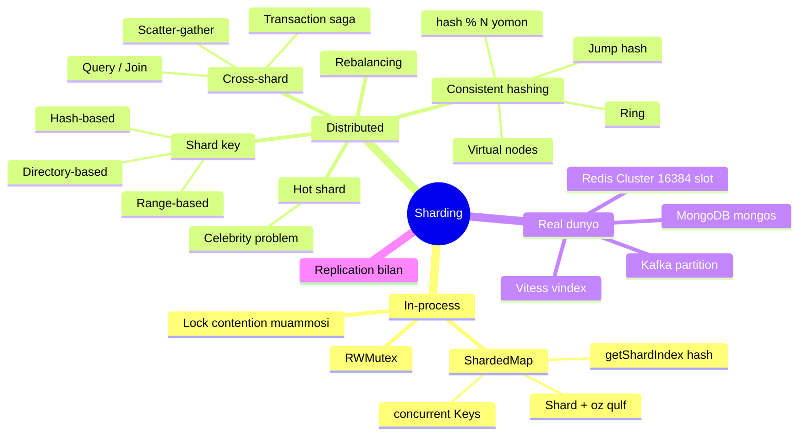
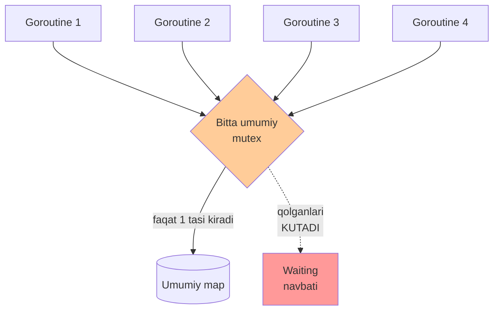
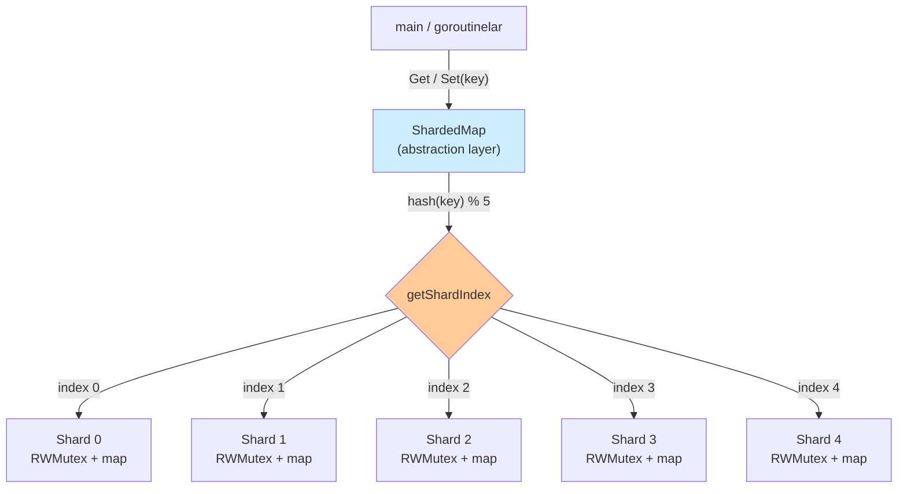
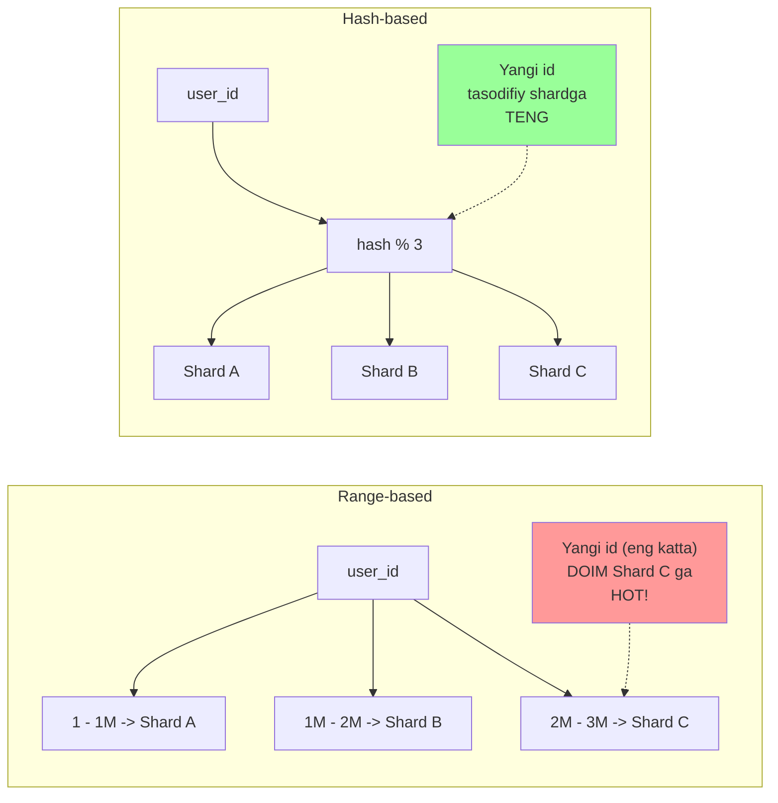
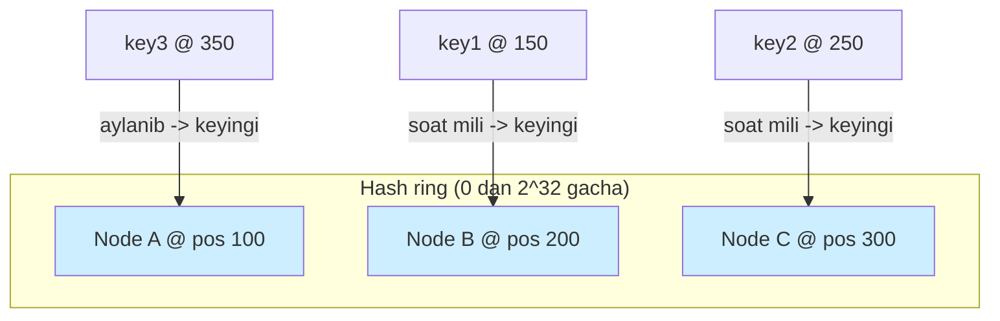
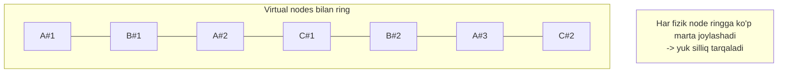
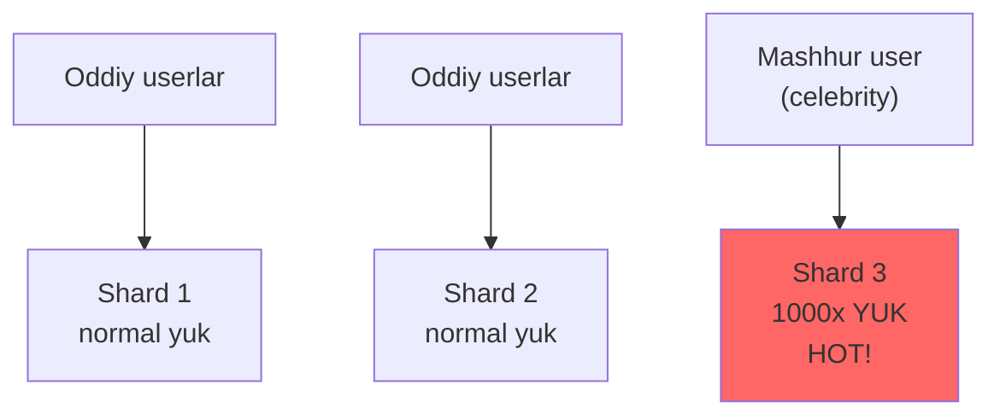
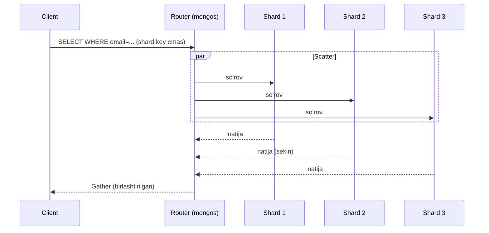
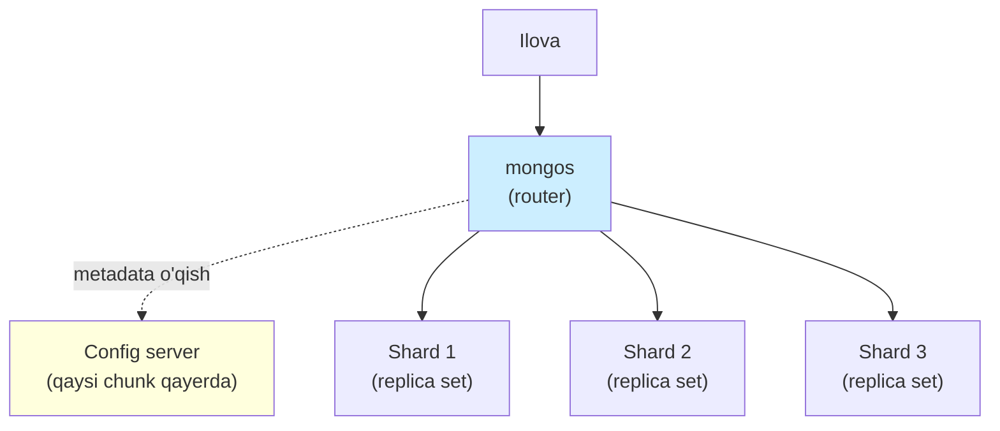
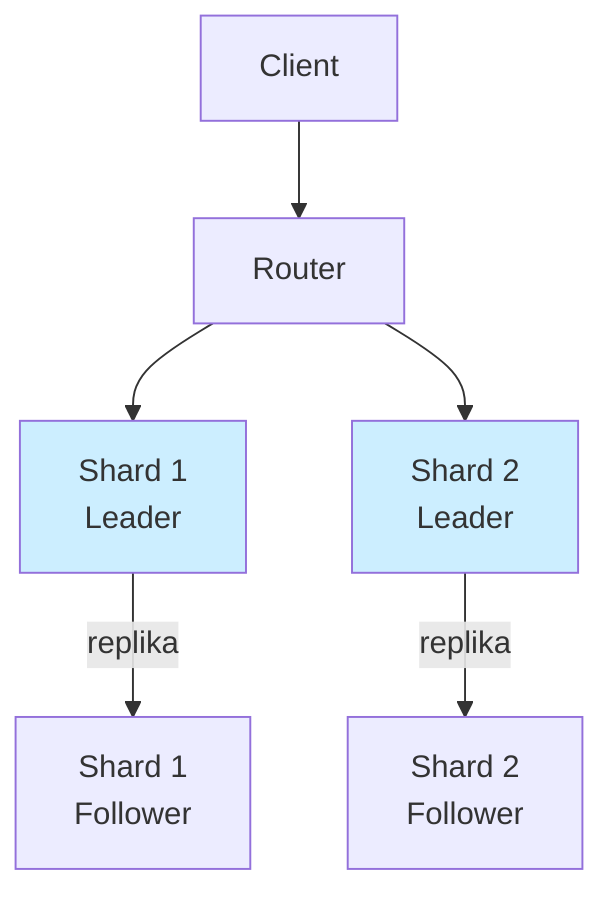

# 6. Sharding (Segmentlash)

> **Manba:** Matthew A. Titmus, *Cloud Native Go* (2022) — "Sharding" bo'limi (4-bob) va "Lock sharding" (7-bob). Qo'shimcha: MongoDB, Vitess, Redis Cluster hujjatlari, consistent hashing va jump hash bo'yicha maqolalar.

---

## TL;DR

**Sharding** — bitta katta narsani (data struktura yoki butun ma'lumotlar bazasi) mustaqil bo'laklarga (**shard**) bo'lish. Maqsad — **bir joyga tushadigan bosimni tarqatish**.

Ikki darajada uchraydi:

| Daraja | Nima bo'linadi | Muammo qaysi | Kitob nomi |
|--------|----------------|--------------|-------------|
| **In-process (bitta process ichida)** | Bitta `map` + bitta `mutex` | **Lock contention** (goroutinelar qulf kutib turadi) | *vertical sharding* |
| **Distributed (serverlar orasida)** | Butun DB / cache | Bitta server hajm va yukni ko'tara olmaydi | *horizontal sharding* |

Bu materialning **markaziy Go misoli** — kitobdagi `ShardedMap`: bitta `map`ni bir necha `Shard`ga bo'lib, har biriga alohida `RWMutex` beramiz. Natijada goroutinelar turli shardlarga **bir vaqtda** yozadi.

Distributed tomonda esa asosiy g'oya: kalitni qaysi shardga yuborishni **shard key** hal qiladi, va oddiy `hash % N` server qo'shilganda deyarli hamma kalitni ko'chirib yuboradi — buni **consistent hashing** hal qiladi.

---

## Mavzu xaritasi



---

## 1. Muammo — nega bitta mutex bottleneck bo'ladi?

### Hook

Tasavvur qil: sening serviceing katta **cache** ushlab turadi — oddiy `map[string]interface{}`. Yuzlab goroutine bir vaqtda o'qiydi va yozadi. Map concurrent yozishda **panic** beradi, shuning uchun uni `mutex` (qulf) bilan himoya qilasan.

Boshida hammasi zo'r. Lekin yuk oshgani sari serviceing **sekinlashadi** — CPU bo'sh, lekin so'rovlar navbatda. Nega? Chunki goroutinelar ishlashdan ko'ra **qulf ochilishini kutib** ko'proq vaqt sarflayapti.

Kitobning aynan so'zlari bilan: qulflar ma'lumot yaxlitligini ta'minlaydi, lekin ular **bo'g'iz** (bottleneck) ga aylanishi mumkin — jarayonlar o'z ishini bajarishdan ko'ra qulf ochilishini kutishga ko'proq vaqt ketkazganda. Bu noxush hodisa **lock contention** (qulflar uchun raqobat) deb ataladi.

### Analogiya — bitta kassali supermarket

Butun supermarketda **bitta kassa** bor deb tasavvur qil. Mahsulot javonlari qancha bo'lsa ham, hamma bitta navbatga tiqiladi. Kassir bir vaqtda faqat bitta mijozga xizmat qiladi — qolganlar kutadi.

**Yechim:** ko'proq kassa qo'yasan. Endi mijozlar bir necha navbatga taqsimlanadi va parallel xizmat oladi. Aynan shu — **sharding**: bitta umumiy qulfni bir necha alohida qulfga bo'lish.

> **Analogiya chegarasi:** kassalar bir-biridan mustaqil ishlaydi. `ShardedMap`da ham shard'lar mustaqil, lekin **bitta kalit doim bitta shardga** tegishli — mijoz "qaysi kassa" ekanini o'zi tanlolmaydi, uni hash hal qiladi.

### Notional machine — mutex ichida aslida nima bo'ladi?

`mutex.Lock()` chaqirilganda:

1. Agar qulf **bo'sh** bo'lsa — goroutine uni oladi va davom etadi.
2. Agar qulf **band** bo'lsa — goroutine **bloklanadi**: scheduler uni CPUdan olib, "waiting" holatiga qo'yadi.
3. Qulf ochilganda scheduler kutayotgan goroutinelardan birini uyg'otadi.

Ya'ni band qulf = goroutine **ishlamaydi, faqat kutadi**. Qancha goroutine bitta qulf uchun kurashsa, shuncha ko'p kutish. Bu — bosim bir nuqtaga to'planishi.



---

## 2. Yechim — data strukturani segmentlash

Kitob ikkita strategiyani solishtiradi:

1. **Instance sonini oshirish (horizontal, distributed)** — ko'proq server qo'yish. Lekin bu **murakkablik va latencyni oshiradi**, chunki yozuvlarni kelishtirish uchun **distributed lock** kerak bo'ladi.
2. **Vertical sharding (in-process)** — katta strukturani **bitta process ichida** bir necha kichik strukturaga bo'lish. Endi har operatsiya faqat **bir bo'lakni** qulflaydi, umumiy contention keskin tushadi.

> **Oltin qoida:** bitta katta qulf o'rniga ko'p kichik qulf qo'ysang, ikki goroutine **turli** shardlarga bir vaqtda tega oladi — ular endi bir-birini kutmaydi.

### Sodda ta'rif

**Vertical sharding** — bitta process ichidagi katta data strukturani (odatda `map`ni) bir necha kichik `map`ga bo'lish, har biriga o'z qulfini berish; ustidan **abstraction layer** (yashirish qatlami) qo'yish, u tashqaridan bitta yaxlit struktura ko'rinishida bo'ladi.

---

## 3. Vertical vs Horizontal sharding (kitobdan)

Kitob katta strukturani ikki xil segmentlash mumkinligini aytadi:

| | **Horizontal** | **Vertical** |
|--|----------------|--------------|
| **Nima bo'linadi** | Data **serverlar orasida** | Data **bitta instance ichida** |
| **Nima beradi** | Redundancy (zaxira), yuk balansi | Read/write contentionni kamaytiradi |
| **Nima bermaydi** | Latency va murakkablikni oshiradi | Redundancy va scaling bermaydi |
| **Qachon** | Katta hajm, ko'p server kerak | Bitta process ichida qulf bo'g'iz bo'lganda |
| **Bu materialda** | 5-bo'limdan boshlab | Keyingi bo'lim: `ShardedMap` |

Diqqat: sanoatda "sharding" so'zi odatda **horizontal** (serverlar orasida bo'lish) ma'nosida ishlatiladi. Kitobdagi `ShardedMap` esa **vertical** — bitta process ichida. Ikkalasi bir xil g'oya: **bosimni bo'lish**.

---

## 4. ShardedMap — to'liq implementatsiya (markaziy misol)

Endi kitobning asosiy Go misolini qadam-baqadam quramiz. Bu — vertical shardingning aniq amaliy ko'rinishi.

### 4.1. Avval oddiy yechim: bitta RWMutex

`RWMutex` (read-write mutex) — ikki xil qulf beradi:

- **RLock/RUnlock** (read qulf) — bir vaqtda **ko'p** goroutine o'qiy oladi (agar yozuv qulfi qo'yilmagan bo'lsa).
- **Lock/Unlock** (write qulf) — faqat **bitta** goroutine yozadi, u paytda hech kim o'qiy olmaydi.

```go
// --- Oddiy thread-safe map: bitta struct, bitta RWMutex ---
var items = struct {
    sync.RWMutex           // embedding: struct RWMutex metodlarini "meros" oladi
    m map[string]int
}{m: make(map[string]int)}

func ThreadSafeRead(key string) int {
    items.RLock()          // read qulfini qo'yamiz
    value := items.m[key]
    items.RUnlock()        // read qulfini olib tashlaymiz
    return value
}

func ThreadSafeWrite(key string, value int) {
    items.Lock()           // write qulfini qo'yamiz (hamma boshqalarni bloklaydi)
    items.m[key] = value
    items.Unlock()         // write qulfini olib tashlaymiz
}
```

**Muammo:** qulf bir vaqtda faqat bittaga (yoki bir necha o'quvchiga) ruxsat bergani uchun, read/write ko'p bo'lganda **o'rtacha kutish vaqti keskin oshadi**. Bu bizni aynan lock contentionga olib keladi. Yechim — bitta `m`ni bo'lish.

### 4.2. Shard va ShardedMap tiplari

`Shard` — bitta bo'lak: o'z `map`i va o'z qulfi bilan. `ShardedMap` — `*Shard` larning slice'i, lekin unga metod ulash uchun **alohida tip** sifatida e'lon qilamiz.

```go
// --- 1-qadam: bitta bo'lak (Shard) — o'z map'i va o'z qulfi bilan ---
type Shard struct {
    sync.RWMutex             // embedding: har shard alohida qulflanadi
    m map[string]interface{} // shu shardning ma'lumoti
}

// --- 2-qadam: ShardedMap — *Shard larning slice'i (metod ulash uchun alohida tip) ---
type ShardedMap []*Shard
```

**Notional machine:** `ShardedMap` — bu xotirada `*Shard` pointerlaridan iborat oddiy slice. Har pointer alohida `Shard` structga ko'rsatadi, har `Shard` ichida alohida `map` va alohida qulf. Ya'ni bu — "map'lardan iborat map".

### 4.3. Konstruktor — NewShardedMap

Go'da "constructor" tushunchasi yo'q, shuning uchun funksiya yozamiz:

```go
// --- ShardedMap yaratamiz: nshards ta bo'sh Shard bilan ---
func NewShardedMap(nshards int) ShardedMap {
    shards := make([]*Shard, nshards)        // *Shard slice'ini tayyorlaymiz

    for i := 0; i < nshards; i++ {
        shard := make(map[string]interface{}) // har bo'lak uchun bo'sh map
        shards[i] = &Shard{m: shard}          // Shard yaratib, pointerini qo'yamiz
    }

    return shards                             // ShardedMap ayni shu slice!
}
```

### 4.4. Kalit -> shard: getShardIndex va getShard

Bu yerda sehr sodir bo'ladi: kalitning **hash**ini olib, shard sonining qoldig'i bilan qaysi shardga tegishli ekanini aniqlaymiz.

```go
// --- Kalit hash'idan shard indexini hisoblaymiz ---
func (m ShardedMap) getShardIndex(key string) int {
    checksum := sha1.Sum([]byte(key)) // "crypto/sha1" dan: 20 baytli checksum
    hash := int(checksum[17])         // ixtiyoriy bir baytni hash sifatida olamiz
    return hash % len(m)              // shard soniga bo'lib qoldiqni olamiz -> index
}

// --- Index bo'yicha kerakli Shard pointerini qaytaramiz ---
func (m ShardedMap) getShard(key string) *Shard {
    index := m.getShardIndex(key)
    return m[index]
}
```

> **Kitobdagi ochiq kamchilik:** bu yerda hash sifatida bitta **byte** ishlatilgan, shuning uchun u ko'pi bilan **255 shard**ni qo'llay oladi. Ko'proq shard kerak bo'lsa, kitob ikkita baytni birlashtirishni tavsiya qiladi:
> ```go
> hash := int(sum[13])<<8 | int(sum[17])
> ```

**Nega hash?** Chunki hash kalitlarni shardlar bo'ylab **teng taqsimlaydi**. `"alpha"`, `"beta"`, `"gamma"` — hash tufayli turli shardlarga tushadi, bir joyga to'planib qolmaydi.

### 4.5. Get va Set — faqat bitta shardni qulflash

Mana asosiy foyda: `Get` faqat **o'z shardini** qulflaydi, boshqa shardlar erkin.

```go
// --- O'qish: faqat kerakli shardga read qulf ---
func (m ShardedMap) Get(key string) interface{} {
    shard := m.getShard(key)
    shard.RLock()
    defer shard.RUnlock()
    return shard.m[key]
}

// --- Yozish: faqat kerakli shardga write qulf ---
func (m ShardedMap) Set(key string, value interface{}) {
    shard := m.getShard(key)
    shard.Lock()
    defer shard.Unlock()
    shard.m[key] = value
}
```

**Notional machine:** goroutine A `"alpha"`ga (shard 2) yozayotganda, goroutine B `"beta"`ni (shard 4) bemalol o'qiy oladi — ular **turli qulflarni** ushlaydi, bir-birini kutmaydi. Bir umumiy qulfda B kutar edi.

### 4.6. Mustaqil qo'shimcha: Delete va Contains

Kitob bularni mashq sifatida qoldirgan. Xuddi shu andozaga amal qilamiz:

```go
// --- O'chirish: kerakli shardga write qulf ---
func (m ShardedMap) Delete(key string) {
    shard := m.getShard(key)
    shard.Lock()
    defer shard.Unlock()
    delete(shard.m, key)
}

// --- Mavjudligini tekshirish: kerakli shardga read qulf ---
func (m ShardedMap) Contains(key string) bool {
    shard := m.getShard(key)
    shard.RLock()
    defer shard.RUnlock()
    _, ok := shard.m[key]
    return ok
}
```

### 4.7. Keys — barcha shardni concurrent o'qish

Ba'zan hamma kalit kerak. Har shardni ketma-ket qulflash sekin — buning o'rniga har shard uchun **goroutine** ishga tushiramiz va `WaitGroup` bilan kutamiz.

```go
// --- Barcha shardlardan kalitlarni parallel yig'amiz ---
func (m ShardedMap) Keys() []string {
    keys := make([]string, 0) // yakuniy kalitlar slice'i
    mutex := sync.Mutex{}     // keys'ga xavfsiz yozish uchun qulf
    wg := sync.WaitGroup{}    // barcha goroutinelarni kutish uchun

    wg.Add(len(m))            // hisoblagichni shard soniga tenglaymiz

    for _, shard := range m { // har shard uchun alohida goroutine
        go func(s *Shard) {
            s.RLock()               // shu shardga read qulf
            for key := range s.m {  // shard kalitlarini aylanamiz
                mutex.Lock()
                keys = append(keys, key) // umumiy slice'ga xavfsiz qo'shamiz
                mutex.Unlock()
            }
            s.RUnlock()             // read qulfni olib tashlaymiz
            wg.Done()               // "men tugatdim" deb belgi beramiz
        }(shard)
    }

    wg.Wait()                 // barcha goroutine tugaguncha kutamiz
    return keys
}
```

**Nega `go func(s *Shard)` argument bilan?** Chunki `shard` loop o'zgaruvchisi; uni argument sifatida uzatib, har goroutine **o'z** shardini oladi. (Go 1.22+ da loop o'zgaruvchisi har iteratsiyada yangi, lekin argument bilan uzatish har versiyada xavfsiz va aniq.)

**Nega ichki `mutex`?** Chunki bir necha goroutine bir vaqtda umumiy `keys` slice'iga `append` qiladi — bu race. Kichik `mutex` uni himoya qiladi.

### 4.8. Ishlatish — main

```go
func main() {
    shardedMap := NewShardedMap(5)   // 5 ta shardli map
    shardedMap.Set("alpha", 1)
    shardedMap.Set("beta", 2)
    shardedMap.Set("gamma", 3)

    fmt.Println(shardedMap.Get("alpha"))
    fmt.Println(shardedMap.Get("beta"))
    fmt.Println(shardedMap.Get("gamma"))

    keys := shardedMap.Keys()
    for _, k := range keys {
        fmt.Println(k)
    }
}
```

**Output:**
```
1
2
3
gamma
alpha
beta
```

> Diqqat: `Keys()` tartibi **kafolatlanmaydi** — kalitlar turli shardlardan parallel yig'iladi, natijada tartib har safar boshqacha bo'lishi mumkin.

### 4.9. ShardedMap tuzilishi — vizual (dual coding)



Diqqat: tashqaridan `ShardedMap` bitta yaxlit map ko'rinadi (abstraction layer yashiradi), lekin ichida 5 ta mustaqil qulfli bo'lak bor.

### 4.10. Predict savoli (PRIMM)

> **O'ylab ko'r:** `Keys()` funksiyasidagi ichki `mutex.Lock()` / `mutex.Unlock()` ni olib tashlasak, kod baribir kompilyatsiya bo'ladi. Ishga tushirsak nima bo'ladi?

<details>
<summary>Javobni ko'rish</summary>

**Race condition** yuzaga keladi. Bir necha goroutine bir vaqtda umumiy `keys` slice'iga `append` qiladi. `append` slice'ning uzunligi va sig'imini o'zgartiradi — ikki goroutine buni bir vaqtda qilsa, biri ikkinchisining yozuvini "bosib" ketishi yoki xotira buzilishi mumkin.

`go run -race main.go` bilan ishga tushirsang, Go **data race**ni ko'rsatadi. Har shardning o'z qulfi bo'lsa ham, `keys` — **umumiy** resurs, uni alohida himoya qilish kerak.
</details>

### 4.11. Ko'p uchraydigan xatolar (ShardedMap)

**Xato 1: "har shard qulfi bor, endi hamma joyda thread-safe" deb o'ylash.**
Noto'g'ri: shard qulfi faqat **shard ichini** himoya qiladi. `Keys()` dagi umumiy `keys` slice'i alohida qulf talab qiladi. Shard-level qulf global holatni himoya qilmaydi.

**Xato 2: hashni butun struktura uchun bitta marta hisoblab, qayta ishlatish.**
Noto'g'ri: har kalit **o'z** hashiga ega. `getShardIndex` har kalit uchun alohida chaqiriladi — aks holda hamma kalit bitta shardga tushadi.

**Xato 3: 256 dan ko'p shard qo'yib, bitta bayt hashda qolish.**
Noto'g'ri: `int(checksum[17])` — bitta bayt, 0–255. 300 shard qo'ysang, 256–299 shardlarga **hech qachon** kalit tushmaydi (`hash % len(m)` da hash 255 dan oshmaydi). Ko'proq shardga ikki baytli hash kerak.

**Xato 4: `interface{}` qaytgan qiymatni tekshirmasdan ishlatish.**
Noto'g'ri: `Get` `interface{}` qaytaradi. To'g'ri tip assertion kerak: `v, ok := shardedMap.Get("alpha").(int)`. Kitob buni `ShardedMap`ning eng katta kamchiligi deb ataydi — **type safety yo'qoladi**.

> **Generics eslatma:** kitob yozilgan paytda Go'da generics endi kirib kelayotgandi. Bugun (Go 1.18+) `Shard[K comparable, V any]` va `ShardedMap[K, V]` deb yozib, `interface{}` va tip tekshiruvidan butunlay qutulish mumkin.

### 4.12. Kanal-lar bilan solishtirish (kitob eslatmasi)

Go'da idiomatik yondashuv — "Share Memory By Communicating" (qulf o'rniga **channel**). Lekin kitob ochiq aytadi: **har doim ham mumkin emas**. Katta markaziy struktura — masalan **cache** — ni mustaqil ish birliklariga bo'lish qiyin. Bunday holatda `sync.RWMutex` + sharding aynan to'g'ri tanlov.

---

## Distributed sharding

Endi bitta processdan chiqib, **serverlar orasida** bo'lish (horizontal sharding) tomoniga o'tamiz. G'oya bir xil — bosimni bo'lish — lekin muammolar boshqacha: qaysi shard qaysi serverda, server qo'shsak nima ko'chadi, cross-shard so'rov qanday.

### Analogiya — katta arxiv va javonlar

Katta arxivni tasavvur qil. Barcha hujjatlar **bitta javonda** bo'lsa — hamma kishi shu javonga tiqiladi, javon to'ladi. Yechim: hujjatlarni **ko'p javonga** taqsimlaysan (masalan familiya bosh harfi bo'yicha: A–D, E–K, L–R, S–Z). Bu — **shard key** bo'yicha bo'lish.

Endi savol: "Petrov"ning hujjati qaysi javonda? Buni **qoida** hal qiladi (familiya harfi). Aynan shu qoida — **shard key strategiyasi**.

---

## 5. Shard key tanlash

**Shard key** (bo'lish kaliti) — datani qaysi shardga yuborishni belgilaydigan maydon. Bu sharding'dagi **eng muhim qaror**. Uch asosiy strategiya:

### 5.1. Hash-based sharding

Kalitning hash'ini olib, shard soniga qoldiq: `shard = hash(key) % N`.

- **Afzalligi:** teng taqsimlash — hot shard ehtimoli kam. Monotonic kalitlar (masalan auto-increment id) uchun ayni muddao.
- **Kamchiligi:** oraliq so'rov (`WHERE id BETWEEN 100 AND 200`) barcha shardga tarqaladi — qo'shni kalitlar turli shardga tushadi.

### 5.2. Range-based sharding

Kalit oralig'i bo'yicha bo'lish: `1–1M -> S1`, `1M–2M -> S2`.

- **Afzalligi:** oraliq so'rov tez — qo'shni kalitlar bir shardda.
- **Kamchiligi:** **monotonic key muammosi** — yangi id'lar doim eng oxirgi shardga tushadi, u qiziydi (hot shard).

### 5.3. Directory-based (lookup) sharding

Alohida **lookup jadval** (directory) kalit -> shard mosligini saqlaydi.

- **Afzalligi:** eng moslashuvchan — istalgan kalitni istalgan shardga qo'lda joylashtirish, hot kalitni ko'chirish oson.
- **Kamchiligi:** lookup jadvalning o'zi **single point of failure** va qo'shimcha network hop bo'ladi; uni ham keshlash/replikatsiya kerak.

### Taqqoslash jadvali

| | **Hash-based** | **Range-based** | **Directory-based** |
|--|----------------|-----------------|---------------------|
| **Taqsimlash** | Teng | Notekis bo'lishi mumkin | To'liq nazorat ostida |
| **Oraliq so'rov** | Yomon (tarqaladi) | Zo'r (bir shardda) | O'rtacha |
| **Hot shard xavfi** | Past | Yuqori (monotonic key) | Boshqarish mumkin |
| **Rebalancing** | Qiyin (`% N` da hamma ko'chadi) | Chunk ko'chirish oson | Eng oson (jadvalni o'zgartirish) |
| **Qo'shimcha komponent** | Yo'q | Yo'q | Lookup jadval kerak |
| **Ishlatadi** | Redis Cluster, Cassandra | MongoDB (ranged), HBase | Ba'zi custom tizimlar |



### Monotonic key muammosi — batafsil

`created_at` timestamp yoki auto-increment `id` — bular **monotonic** (doim o'sib boradi). Range sharding bilan barcha **yangi** yozuvlar eng oxirgi shardga tushadi:

```
Shard A: eski id (o'lik yuk)
Shard B: eski id (o'lik yuk)
Shard C: YANGI id  <-- hamma yozuv shu yerda, HOT SHARD
```

MongoDB hujjati aynan buni tavsiya qiladi: **monotonic** kalitni shard qilayotgan bo'lsang, **hashed sharding** ishlat — hash monotonic ketma-ketlikni buzib, teng taqsimlaydi.

---

## 6. Consistent hashing (chuqur)

### 6.1. Muammo — nega oddiy `hash % N` yomon?

Hash-based sharding sodda: `shard = hash(key) % N`. Muammo — **N o'zgarganda** (server qo'shsang yoki o'chsang).

Misol: 3 shard, `hash(key) % 3`. Yangi server qo'shdik -> `hash(key) % 4`. Ko'p kalitlar uchun `% 3` va `% 4` **turli natija** beradi:

| key | hash | `% 3` | `% 4` | Ko'chdimi? |
|-----|------|-------|-------|-----------|
| a | 10 | 1 | 2 | Ha |
| b | 15 | 0 | 3 | Ha |
| c | 21 | 0 | 1 | Ha |
| d | 12 | 0 | 0 | Yo'q |

Deyarli **hamma kalit** joyini o'zgartiradi. Distributed tizimda bu — **ulkan ma'lumot ko'chishi** (rebalancing), tarmoq to'lib ketadi, cache to'liq bo'shaydi (cache miss bo'roni).

### 6.2. Yechim — ring (halqa)

**Consistent hashing** g'oyasi: kalitlarni ham, serverlarni ham **bitta doiraviy hash fazosiga** (masalan 0 dan 2^32 gacha) joylashtiramiz. Kalit — soat mili yo'nalishida undan **keyingi serverga** tegishli.



**Sehr:** Node B **o'chsa**, faqat B ga tegishli kalitlar (100–200 oralig'i) keyingi node C ga o'tadi. **Qolgan hamma kalit joyida qoladi.** `% N` da hamma ko'char edi — bu yerda faqat **1/N qism** ko'chadi.

Xuddi shunday, yangi node qo'shsang, u faqat bir yoyni "egallaydi" va faqat o'sha yoydagi kalitlar ko'chadi.

### 6.3. Muammo — notekislik va virtual nodes

Uch node ringda notekis joylashsa, biri ringning katta qismini egallaydi va ko'proq kalit oladi (skew). Yechim — **virtual node** (vnode): har fizik node ringga **ko'p marta** (masalan 100–200 vnode) joylashtiriladi.

Qancha ko'p vnode — shuncha silliq taqsimlash. Node o'chganda uning yuki **bir necha** qo'shniga tarqaladi (bitta qo'shni ko'tarib qolmaydi).



### 6.4. Go misoli — soddalashtirilgan consistent hash ring

```go
package main

import (
    "hash/fnv"
    "sort"
    "strconv"
)

// --- 1-qadam: ring strukturasi ---
type HashRing struct {
    replicas int            // har node uchun nechta virtual node
    keys     []int          // saralangan hash pozitsiyalari (ring)
    hashMap  map[int]string // hash pozitsiya -> node nomi
}

func NewHashRing(replicas int) *HashRing {
    return &HashRing{
        replicas: replicas,
        hashMap:  make(map[int]string),
    }
}

// --- 2-qadam: hash funksiyasi (fnv1a, tez va taqsimlovchi) ---
func (r *HashRing) hash(s string) int {
    h := fnv.New32a()
    h.Write([]byte(s))
    return int(h.Sum32())
}

// --- 3-qadam: node qo'shish (har biriga replicas ta virtual node) ---
func (r *HashRing) Add(nodes ...string) {
    for _, node := range nodes {
        for i := 0; i < r.replicas; i++ {
            // "node#0", "node#1" ... har birining alohida pozitsiyasi
            hash := r.hash(node + "#" + strconv.Itoa(i))
            r.keys = append(r.keys, hash)
            r.hashMap[hash] = node
        }
    }
    sort.Ints(r.keys) // ringni saralangan holatda tutamiz (binary search uchun)
}

// --- 4-qadam: kalit qaysi node'ga tegishli (soat mili -> keyingi) ---
func (r *HashRing) Get(key string) string {
    if len(r.keys) == 0 {
        return ""
    }
    hash := r.hash(key)

    // binary search: hash'dan katta yoki teng birinchi pozitsiya
    idx := sort.Search(len(r.keys), func(i int) bool {
        return r.keys[i] >= hash
    })

    // oxiridan oshsa -> ring boshiga qaytamiz (doiraviy)
    if idx == len(r.keys) {
        idx = 0
    }
    return r.hashMap[r.keys[idx]]
}
```

**Ishlatish:**
```go
func main() {
    ring := NewHashRing(100) // har node uchun 100 vnode
    ring.Add("node-A", "node-B", "node-C")

    fmt.Println(ring.Get("user123")) // masalan: node-B
    fmt.Println(ring.Get("user456")) // masalan: node-A
    fmt.Println(ring.Get("user789")) // masalan: node-C
}
```

**Notional machine:** `keys` — saralangan slice, ringning "aylanasi". `sort.Search` (binary search) kalit hashdan keyingi eng yaqin vnode pozitsiyasini O(log n) da topadi. `hashMap` esa pozitsiyani fizik node nomiga qaytaradi. Node qo'shsang, uning 100 vnodesi ringga qo'shiladi va faqat qo'shni yoylardagi kalitlar ko'chadi.

### 6.5. Alternativa — Jump consistent hash

Google (Lamping va Veach, 2014) yanada oddiy va tez usul taklif qildi: **jump hash**. Xotira **umuman** talab qilmaydi (ring saqlanmaydi), atigi bir necha qatordan iborat, va yukni undan ham tekisroq bo'ladi.

```go
// --- Jump consistent hash: xotirasiz, O(ln n) vaqt ---
func JumpHash(key uint64, numBuckets int) int32 {
    var b, j int64 = -1, 0
    for j < int64(numBuckets) {
        b = j
        key = key*2862933555777941757 + 1
        j = int64(float64(b+1) *
            (float64(int64(1)<<31) / float64((key>>33)+1)))
    }
    return int32(b)
}
```

**Cheklovi:** bucketlar **ketma-ket butun son** (0, 1, 2, ...) bilan raqamlanishi shart — node nomlari yoki IP bilan ishlamaydi. Shu sabab u nomli node bo'lgan web cache uchun emas, **ketma-ket raqamli** shardlar uchun (data storage) ideal.

### Consistent hashing usullari taqqoslash

| | **hash % N** | **Ring + vnodes** | **Jump hash** |
|--|--------------|-------------------|---------------|
| **Node qo'shishda ko'chish** | ~hamma kalit | ~1/N kalit | ~1/N kalit |
| **Xotira** | Yo'q | Ring saqlanadi (O(vnodes)) | Yo'q |
| **Node nomlari** | Ixtiyoriy | Ixtiyoriy | Faqat ketma-ket son |
| **Node o'chirish** | Og'riqli | Oson | Faqat oxirgini oson |
| **Ishlatadi** | Sodda holatlar | Cassandra, DynamoDB | Ketma-ket shardli storage |

---

## 7. Rebalancing va resharding

Vaqt o'tib data o'sadi yoki notekis taqsimlanadi — shard **qo'shish/olib tashlash** kerak bo'ladi. Bu **rebalancing** (yukni qayta taqsimlash).

- **Shard qo'shish:** consistent hashing bilan faqat oz qism ko'chadi. Range sharding bilan katta shardni **ikkiga bo'lish** (split) mumkin.
- **Shard olib tashlash:** node kalitlari qo'shniga ko'chiriladi, keyin node o'chiriladi.
- **Hot shard bo'linishi:** qizigan shardni ikkiga bo'lib, yarmini yangi serverga ko'chirish.

Amaliy nozikliklar:
1. Ko'chish paytida ma'lumot **ikki joyda** — eski va yangi shardda. Router ("qayerdan o'qish"ni bilishi kerak).
2. Ko'chish **fon rejimida**, xizmatni to'xtatmasdan bo'lishi kerak (online resharding).
3. MongoDB bu ishni **balancer** avtomatik qiladi — chunklarni shardlar orasida teng taqsimlaydi.

---

## 8. Hot shard va celebrity problem

**Hot shard** (hotspot) — boshqalardan nomutanosib ko'p yuk oladigan shard. Sabab — **skew**: kalitlarning kichik to'plami so'rovlarning ko'pini oladi.

Eng mashhur ko'rinishi — **celebrity problem** (mashhurlik muammosi): `user_id` bo'yicha shardlaganda, mashhur foydalanuvchi (masalan Taylor Swift) oddiydan **1000 marta** ko'p trafik oladi — har ko'rish, like, xabar **bitta shardga** uradi.



### Yumshatish usullari

| Usul | G'oya |
|------|-------|
| **Dedicated shard** | Mashhur akkountlarni alohida (kuchli) shardga ajratish |
| **Key salting** | `user:123` ni `user:123:0`, `user:123:1`, `user:123:2` ga bo'lib, turli shardga tarqatish; o'qishda tasodifiy replica tanlash |
| **Random suffix** | Kalitga tasodifiy qo'shimcha qo'shib, bir necha shardga yoyish |
| **Caching** | Hot kalitni aniqlab (masalan >1000 QPS), uni Redis kabi in-memory keshga qo'yish |
| **Dynamic split** | DB hot yoki katta shardni avtomatik ikkiga bo'ladi |

> **Diqqat:** key salting o'qishni murakkablashtiradi — bitta mantiqiy kalitni bir necha joydan yig'ish kerak. Trade-off: yuk tarqaladi, lekin read logikasi qiyinlashadi.

---

## 9. Cross-shard muammolar

Data bo'lingach, bir necha shardga tegadigan operatsiyalar qiyinlashadi.

### 9.1. Cross-shard query / join

Agar `users` bir shardda, `orders` boshqasida bo'lsa — DB darajasida `JOIN` **ishlamaydi**. Yechimlar:

- **Application-level join** — ilova har sharddan olib, o'zi birlashtiradi.
- **Denormalizatsiya** — kerakli maydonlarni bitta joyga nusxalash (document DB g'oyasi).
- **Shard key hamohangligi** — bog'liq data'ni **bir xil shard key** bilan bir shardga tushirish (masalan `user` va uning `order`lari ikkisi ham `user_id` bo'yicha).

### 9.2. Scatter-gather

Shard key'siz so'rov (masalan `WHERE email = ...` da email shard key emas) **barcha** shardga yuborilib, natijalar yig'iladi — **scatter-gather**. Sekin: eng sekin shard butun so'rovni tutib turadi (tail latency).



### 9.3. Cross-shard transaction (saga bilan bog'liqlik)

Bir shardda pul yechib, boshqasida qo'shish — **distributed transaction**. Klassik ACID bir DB'da ishlaydi, shardlar orasida qiyin. Ikki yo'l:

- **Two-phase commit (2PC)** — kuchli, lekin sekin va coordinator single point of failure.
- **Saga pattern** — har qadamni alohida local tranzaksiya, xatoda **compensating** amal (orqaga qaytarish). (Bu — alohida distributed pattern; saga darsiga qarang.)

> **Oltin qoida:** yaxshi shard key ko'p so'rovni **bitta shardga** tushiradi — cross-shard operatsiyalar qanchalik kam bo'lsa, tizim shuncha tez va sodda.

---

## 10. Real dunyoda

### 10.1. MongoDB

- **Komponentlar:** `mongos` (router, so'rovni to'g'ri shardga yuboradi va natijalarni yig'adi), **config server** replica set (metadata: qaysi chunk qaysi shardda), **shard** lar (har biri o'zi replica set).
- **Strategiya:** *ranged* (oralig'i bo'yicha, oraliq so'rovga yaxshi) yoki *hashed* (monotonic kalitga yaxshi, teng taqsimlaydi).
- **Chunk:** MongoDB data'ni **chunk** larga bo'ladi; **balancer** ularni shardlar orasida avtomatik teng taqsimlaydi.



### 10.2. Vitess (MySQL uchun sharding)

- **Keyspace** — mantiqiy DB; sharded yoki unsharded bo'ladi. Sharded keyspace **keyspace ID oralig'i** bo'yicha bo'linadi.
- **VSchema** — abstraction layer, ustki shardlarni bitta MySQL kabi ko'rsatadi.
- **Vindex** — kalitni to'g'ri shardga map qiladi. Har sharded jadvalda **Primary Vindex** bo'lishi shart (u qatorning keyspace ID sini, ya'ni shardini belgilaydi). So'rov `WHERE` da shard keyga tegsa — Vitess uni to'g'ri shardga yo'naltiradi.

### 10.3. Redis Cluster — 16384 hash slot

Redis Cluster consistent hashing **ishlatmaydi**. O'rniga: har kalit **hash slot**ga tegishli — jami **16384 slot**. Slot: `CRC16(key) % 16384`. Har slot aynan bitta masterga tegishli.

- Client slotni o'zi hisoblaydi, ulanishda olingan slot->node xaritasidan foydalanib **to'g'ridan-to'g'ri** kerakli masterga boradi.
- Topologiya o'zgarsa master `MOVED`/`ASK` redirect qaytaradi; client xaritani yangilab, qayta uradi.
- Nega 16384? 65535 emas: cluster xabarlarini ixcham tutish uchun (16384 slot ~2KB, node soni 1000 gacha yaxshi ishlaydi).

> **Nega slot, ring emas?** 16384 slot — data va node orasida **oraliq daraja**. Node qo'shsang, slotlarni (kalitlarni emas) ko'chirasan — boshqarish oson va deterministik.

### 10.4. Kafka partition ham sharding

Kafka topic'i **partition** larga bo'linadi — bu ham sharding. `partition = hash(key) % numPartitions`. Har partition alohida serverda (broker), parallel yoziladi/o'qiladi. Aynan bir kalit doim bir partitionga tushadi -> shu kalit uchun tartib saqlanadi. Ya'ni "sharding" nomi ishlatilmasa ham, mexanizm bir xil.

---

## 11. Replication bilan farqi va birga

Sharding'ni **replication** bilan chalkashtirmaslik kerak:

| | **Sharding** | **Replication** |
|--|--------------|-----------------|
| **Nima qiladi** | Data'ni **bo'ladi** | Data'ni **nusxalaydi** |
| **Har node'da** | Data'ning **bir qismi** | Data'ning **to'liq nusxasi** |
| **Nima beradi** | Hajm, yozuv sig'imi | Ishonchlilik, o'qish sig'imi |
| **Node tushsa** | O'sha bo'lak yo'qoladi | Boshqa nusxa ishlaydi |

Real tizimda **ikkalasi birga**: data shardlarga bo'linadi, so'ng **har shard o'zi replikatsiya** qilinadi (leader + follower). Natija — ham katta hajm, ham node tushsa yiqilmaydi.



MongoDB'da har shard — replica set; Redis Clusterda har master'ning replicalari bor. Ya'ni "har shard o'zi mini leader-follower tizim".

---

## Xulosa

- **Sharding** — bitta katta narsani mustaqil bo'laklarga bo'lib, bosimni bir nuqtadan tarqatish.
- **In-process (vertical):** bitta `map` + bitta `mutex` lock contention beradi; `ShardedMap` uni bir necha alohida qulfli shardga bo'ladi.
- **ShardedMap** ishlashi: `getShardIndex` kalit hashdan shard indexini topadi, faqat **o'sha shard** qulflanadi; `Keys()` barcha shardni goroutinelar bilan parallel o'qiydi.
- **Distributed (horizontal):** data serverlar orasida bo'linadi; **shard key** qarori eng muhim.
- **Shard key strategiyalari:** hash (teng, oraliq so'rovga yomon), range (oraliq so'rovga zo'r, monotonic key hot shard), directory (moslashuvchan, lekin lookup jadval kerak).
- **Consistent hashing:** oddiy `hash % N` node o'zgarganda deyarli hamma kalitni ko'chiradi; ring + virtual nodes faqat ~1/N ko'chiradi; jump hash xotirasiz alternativa.
- **Hot shard / celebrity problem:** skew tufayli bitta shard qiziydi; yumshatish — dedicated shard, salting, caching.
- **Cross-shard** operatsiyalar (join, transaction, scatter-gather) qiyin — yaxshi shard key ularni kamaytiradi.
- Real dunyo: MongoDB (mongos + config server), Vitess (vindex), Redis Cluster (16384 slot), Kafka (partition). Sharding odatda **replication bilan birga** ishlatiladi.

## Eslab qol

- Sharding = **bo'lish** (bosimni tarqatish); replication = **nusxalash** (ishonchlilik).
- Bitta katta qulf = lock contention; `ShardedMap` = ko'p kichik qulf.
- Har operatsiya faqat **bitta shard**ni qulflaydi — shart shu.
- `hash % N` yomon: N o'zgarsa hamma ko'chadi -> **consistent hashing**.
- Yomon shard key = **hot shard**; range + monotonic key = klassik hot shard.

## O'z-o'zini tekshir (retrieval practice)

**1.** Nega bitta `RWMutex` bilan himoyalangan map goroutinelar ko'payganda sekinlashadi, garchi CPU bo'sh bo'lsa ham?
<details>
<summary>Javob</summary>

Bu — **lock contention**. Write qulf bir vaqtda faqat bittaga ruxsat beradi; qolgan goroutinelar bloklanib **navbat kutadi** (CPUda emas, waiting holatida). Goroutine qancha ko'p bo'lsa, o'rtacha kutish shuncha oshadi — ish emas, kutish CPU vaqtini emas, **wall-clock** vaqtni yeydi. `ShardedMap` buni bir necha alohida qulfga bo'lib hal qiladi.
</details>

**2.** `ShardedMap.getShardIndex` da hash sifatida bitta byte (`checksum[17]`) olingan. 300 ta shard yaratsak nima bo'ladi?
<details>
<summary>Javob</summary>

Byte 0–255 oralig'ida bo'ladi, shuning uchun `hash % 300` hech qachon 256–299 chiqarmaydi. Ya'ni **256–299 shardlarga hech qachon kalit tushmaydi** — ular bo'sh turadi, teng taqsimlash buziladi. Yechim: ikki byteni birlashtirish — `int(sum[13])<<8 | int(sum[17])`.
</details>

**3.** 3 shardli hash-based tizimga 4-shard qo'shdik. Nega bu falokat, va consistent hashing nima uchun yaxshiroq?
<details>
<summary>Javob</summary>

`hash % 3` va `hash % 4` ko'p kalit uchun turli natija beradi — **deyarli hamma kalit ko'chadi** (ulkan rebalancing, cache miss bo'roni). Consistent hashingda node ring ustida; yangi node faqat bir yoyni egallaydi, shuning uchun **faqat ~1/N kalit** ko'chadi, qolgani joyida.
</details>

**4.** `user_id` bo'yicha shardlaganda Taylor Swift'ning akkaunti butun bir shardni qizdiryapti. Uch yumshatish usulini ayt.
<details>
<summary>Javob</summary>

(1) **Dedicated shard** — mashhur akkauntني alohida kuchli shardga ajratish; (2) **Key salting / random suffix** — kalitni `user:123:0..N` ga bo'lib bir necha shardga tarqatish (o'qish murakkablashadi); (3) **Caching** — hot kalitni Redis kabi in-memory keshga qo'yib, DBdan bosimni olib tashlash. Ba'zi DB **dynamic split** ham qiladi.
</details>

**5.** `users` bitta shardda, `orders` boshqasida. `JOIN users, orders` nega ishlamaydi va uch yechim qanday?
<details>
<summary>Javob</summary>

DB darajasidagi `JOIN` bitta node ichida bajariladi; data ikki shardda bo'lsa, DB o'zi birlashtira olmaydi. Yechimlar: (1) **application-level join** — ilova ikki sharddan olib o'zi birlashtiradi; (2) **denormalizatsiya** — kerakli maydonlarni bir joyga nusxalash; (3) **bir xil shard key** — `orders`ni ham `user_id` bo'yicha shardlab, bir foydalanuvchining user va orderini **bir shardga** tushirish.
</details>

**6.** Redis Cluster consistent hashing ishlatmaydi, 16384 hash slot ishlatadi. Bu qanday afzallik beradi?
<details>
<summary>Javob</summary>

Slot — data va node orasidagi **oraliq daraja**. Node qo'shganda/o'chganda kalitlarni emas, **slotlarni** ko'chirasan — boshqarish oson va deterministik. Client slotni o'zi hisoblab (`CRC16(key) % 16384`) to'g'ridan-to'g'ri kerakli masterga boradi; topologiya o'zgarsa `MOVED`/`ASK` redirect keladi. 16384 soni cluster xabarlarini ixcham (~2KB) tutish uchun tanlangan.
</details>

## Amaliyot

**1. Oson (Modify).** `ShardedMap`ga `Len() int` metodini qo'sh — barcha shardlardagi kalitlar umumiy sonini qaytarsin.
<details>
<summary>Hint</summary>

`Keys()` singari har shardni goroutine bilan aylanib, `len(s.m)` ni umumiy hisoblagichga qo'sh (yoki oddiyroq: `Keys()` ni chaqirib `len(m.Keys())` qaytar). Concurrent yozsang, hisoblagichni `sync.Mutex` yoki `atomic.AddInt64` bilan himoya qil.
</details>

**2. O'rta (faded example).** Consistent hash ringga node **o'chirish** metodini to'ldir:
```go
func (r *HashRing) Remove(node string) {
    for i := 0; i < r.replicas; i++ {
        hash := r.hash(node + "#" + strconv.Itoa(i))
        // TODO: hashMap dan shu hashni o'chir
        // TODO: keys slice'idan shu hashni topib olib tashla
    }
    // TODO: keys ni qayta sarala (yoki tartibni saqlab o'chir)
}
```
<details>
<summary>Hint</summary>

`delete(r.hashMap, hash)` — map dan o'chirish oson. `keys` slice'idan o'chirish uchun: `sort.SearchInts(r.keys, hash)` bilan indexni top, so'ng `r.keys = append(r.keys[:idx], r.keys[idx+1:]...)`. Slice saralangan bo'lsa qayta sort shart emas.
</details>

**3. Qiyin (Make).** `ShardedMap`ni **generics** bilan noldan yoz: `type ShardedMap[K comparable, V any]`. `interface{}` va tip tekshiruvidan butunlay qutul. `getShardIndex` uchun kalitni stringga aylantirib hashle (yoki `constraints` bilan chekla). `Get` `(V, bool)` qaytarsin.
<details>
<summary>Hint</summary>

`Shard[K comparable, V any]` struct: `sync.RWMutex` + `m map[K]V`. `getShardIndex` da `K`ni hashlash uchun `fmt.Sprintf("%v", key)` yoki kalitni `[]byte`ga o'girish kerak — eng sodda yo'l `fmt.Sprint(key)` bilan stringga aylantirib, fnv1a hash olish. `Get` `v, ok := shard.m[key]; return v, ok` qaytarsin — tip assertion endi kerak emas.
</details>

## Takrorlash

**Bog'liq oldingi mavzular:**
- [DB Replication va Sharding kirish](../../../System%20Design/03-malumotlar-ombori/04-replication-va-sharding.md) — bu materialning DB darajasidagi kirish versiyasi.
- **Saga pattern** — cross-shard transaction'ni compensating amallar bilan hal qilish.
- **Circuit Breaker / Bulkhead** (Stability patterns) — shard yoki node tushganda tizimni himoyalash.

**Takrorlash jadvali:**
| Qachon | Nima qilish |
|--------|-------------|
| Ertaga | `ShardedMap` nega bitta mutexdan tez ekanini bir jumlada ayt |
| 3 kundan keyin | `hash % N` nega yomonligini misol raqamlar bilan chiz (jadval) |
| 1 haftadan keyin | "O'z-o'zini tekshir" savollariga qayta javob ber; ring Go misolini xotira bo'yicha yoz |

**Feynman testi:** Kod so'zlarini ishlatmasdan, do'stingga 3 jumlada tushuntir: (1) nega bitta qulf ko'p goroutineda sekinlashtiradi, (2) sharding buni qanday hal qiladi, (3) nega yangi server qo'shganda oddiy hash yomon, consistent hashing yaxshi.
