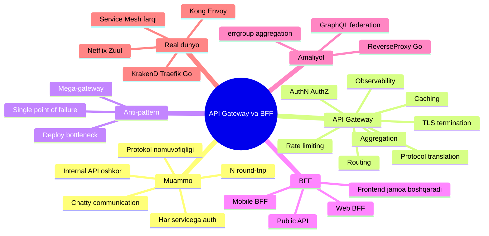
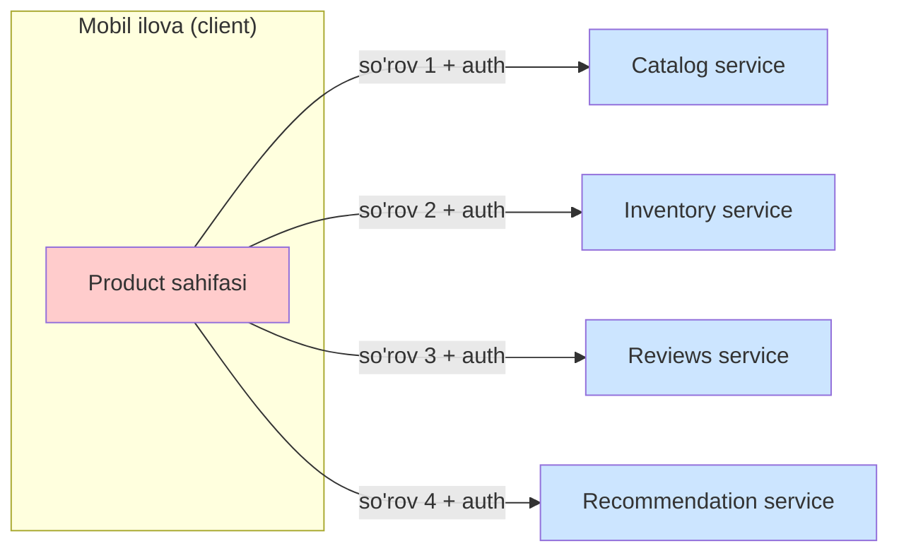
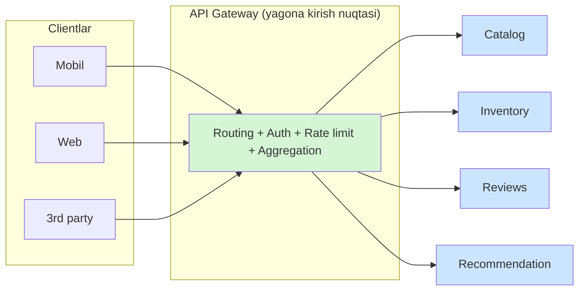
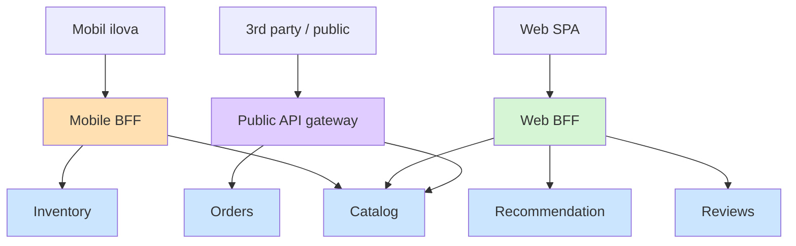
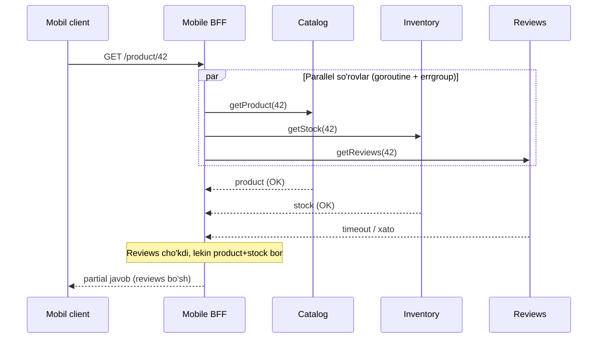
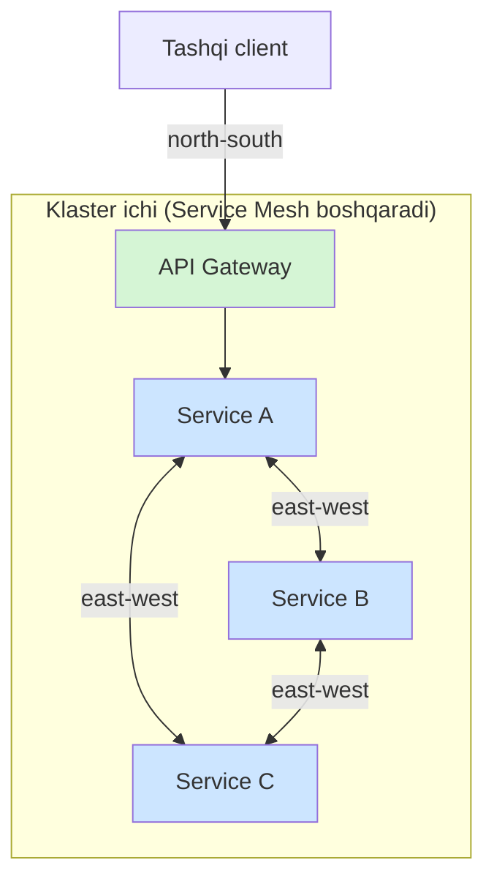

# API Gateway va Backend-for-Frontend (BFF)

> **TL;DR**
> Microservice arxitekturada client o'nlab mayda servicega to'g'ridan-to'g'ri murojaat qilsa — juda ko'p round-trip, har servicega alohida auth, CORS, protokol muammosi va internal API oshkor bo'lish xavfi paydo bo'ladi. **API Gateway** — bu yagona kirish nuqtasi (single entry point): u routing, request aggregation, protocol translation, authn/authz, rate limiting, TLS termination, caching va observability'ni bir joyda hal qiladi. Lekin bitta gateway barcha client turlariga (mobile, web, public API) baravar xizmat qilsa "mega-gateway" anti-pattern'iga aylanadi. **BFF (Backend-for-Frontend)** — har client turi uchun alohida, o'sha client tajribasiga moslashtirilgan gateway. Oltin qoida: **"Bir experience — bir BFF"**, va uni frontend jamoasining o'zi boshqaradi.

---

## Mavzu xaritasi



---

## 1. Muammo: client to'g'ridan-to'g'ri microservicega murojaat qilsa

### Hook — nega bu og'riqli?

Tasavvur qil: sen mobil ilovada bitta mahsulot sahifasini ochyapsan. Bu sahifada quyidagilar bor:
mahsulot nomi va narxi, ombordagi qoldig'i, foydalanuvchi sharhlari va tavsiya etilgan tovarlar.

Monolit dunyoda bu bitta `GET /product/42` so'rov edi. Microservice dunyoda esa bu ma'lumotlar
**4 ta alohida servicega** bo'lingan: `Catalog`, `Inventory`, `Reviews`, `Recommendation`.

Agar client (mobil ilova) shu 4 servisga **o'zi to'g'ridan-to'g'ri** murojaat qilsa, quyidagi
og'riqlar birdaniga paydo bo'ladi.

### Analogiya — resepshnsiz mehmonxona

> Tasavvur qil: mehmonxonaga keldingu, resepshn (reception) yo'q. Xona kaliti uchun bir xodimga,
> nonushta uchun boshqasiga, taksi uchun uchinchisiga, hisob-kitob uchun to'rtinchisiga
> **alohida-alohida** yugurishing kerak. Har birida o'zingni qaytadan tanishtirishing kerak.
>
> **API Gateway** — bu aynan o'sha resepshn: sen faqat bitta stolga borasan, u seni bir marta
> tanidi va qolgan hamma ishni ichkarida o'zi tashkil qiladi.

Analogiya chegarasi: resepshn odatda faqat yo'naltiradi, gateway esa bundan ko'proq — u bir nechta
xizmatning javobini **birlashtirib** (aggregation) bitta javob qilib qaytara oladi.

### Chatty client muammolarining ro'yxati

| Muammo | Nima bo'ladi |
| --- | --- |
| **Chatty communication** | Bitta ekran uchun 4-10 ta alohida so'rov. Har so'rov = alohida TCP/TLS handshake |
| **N round-trip latency** | Mobil tarmoqda har round-trip 100-300ms. 6 ta so'rov = ko'zga ko'rinadigan sekinlik |
| **Har servicega auth** | Client har bir servisga alohida token yuborishi, har biri alohida tekshirishi kerak |
| **CORS jahannami** | Browser'da har bir domenga alohida CORS sozlamasi kerak |
| **Client protokollari** | Ichkarida gRPC ishlatilsa, browser undan to'g'ridan-to'g'ri foydalana olmaydi |
| **Internal API oshkor** | Servicelarning ichki manzillari va tuzilishi tashqariga chiqib ketadi |
| **Qattiq bog'lanish (coupling)** | Servicelar bo'linishi o'zgarsa (masalan bitta service ikkiga bo'linsa), barcha clientlar sinadi |

### Diagramma — gateway'siz "chatty" client



Client 4 marta tashqi tarmoq orqali chiqadi, 4 marta auth qiladi, 4 ta servisning manzilini biladi.
Bu — **tarqalgan mas'uliyat va tarqalgan xavf**.

> 🤔 **O'ylab ko'r:** Agar `Recommendation` service javob bermay qolsa (down bo'lsa), gateway'siz
> arxitekturada mahsulot sahifasi umuman ochilmaydimi yoki ochiladimi?

<details>
<summary>💡 Javobni ko'rish</summary>

Bu client kodiga bog'liq. Gateway'siz holatda **har bir client** partial failure'ni o'zi hal qilishi
kerak: `Recommendation` cho'kkanda tavsiyalarsiz sahifani ko'rsatish mantig'ini har bir platformada
(iOS, Android, web) **alohida** yozish kerak bo'ladi. Bu kod takrorlanishi va xatolar manbai.
Gateway (yoki BFF) bu mantiqni **bir joyda** jamlaydi.
</details>

---

## 2. API Gateway: yagona kirish nuqtasi

### Sodda ta'rif

> **API Gateway** (API darvozasi) — bu barcha clientlar uchun **yagona kirish nuqtasi** bo'lgan
> server: u tashqi so'rovni qabul qiladi, kim ekanini tekshiradi va so'rovni to'g'ri internal
> servicega yo'naltiradi yoki bir nechtasidan javob yig'ib beradi.

Bu — [Facade pattern](../../1.%20Design%20Patterns/3.%20Structural%20(tuzulmaviy)/5.%20Facade.md)ning
tarqoq tizim (distributed system) miqyosidagi ko'rinishi. Facade bitta klass murakkabligini bitta
sodda interfeys ortiga yashirgani kabi, gateway ham o'nlab servicening murakkabligini bitta
API ortiga yashiradi.

### Diagramma — gateway bilan



Endi client faqat bitta manzilni biladi, bir marta auth qiladi, va internal tuzilma to'liq yashirin.

### Gateway vazifalari — chuqur

Gateway shunchaki "proxy" emas. U **edge** (chekka, tarmoq chegarasi) darajasidagi bir qator ishni
bajaradi. Har birini alohida ko'rib chiqamiz.

#### 2.1. Routing (yo'naltirish)

Eng oddiy vazifa: kelgan so'rovning yo'li (path), header yoki query parametriga qarab uni to'g'ri
servicega uzatish. Masalan `/products/*` → Catalog service, `/orders/*` → Order service.

#### 2.2. Request aggregation / composition (birlashtirish)

Gateway bitta client so'rovi uchun **bir nechta** service'ga so'rov yuborib, javoblarni bitta
javobga birlashtiradi. Bu [API Composition pattern](https://microservices.io/patterns/data/api-composition.html):
gateway "API composer" rolini o'ynaydi — servicelardan ma'lumotni olib, **in-memory join** qiladi.

> ⚠️ **Diqqat:** In-memory join katta datasetlar uchun sekin bo'ladi. Agar har service minglab qator
> qaytarsa va gateway ularni xotirada birlashtirsa, bu samarasiz. Bunday holatlarda CQRS yoki
> read-model kabi boshqa yondashuvlar kerak bo'ladi. Aggregation — kichik, cheklangan javoblar uchun.

#### 2.3. Protocol translation (protokol tarjimasi)

Ichkarida servicelar tez ishlashi uchun ko'pincha **gRPC** (Google'ning ikkilik RPC protokoli)
ishlatadi. Lekin browser gRPC bilan to'g'ridan-to'g'ri gaplasha olmaydi. Gateway tashqarida
REST/JSON, ichkarida gRPC bilan ishlaydi — REST ↔ gRPC tarjimasini bajaradi.

#### 2.4. Authentication va Authorization

- **Authentication (authn)** — "kim sen?": gateway JWT (JSON Web Token) ni tekshiradi, imzosi
  to'g'rimi, muddati o'tmaganmi.
- **Authorization (authz)** — "senga ruxsat bormi?": foydalanuvchi bu resursga kirish huquqiga
  egami.

Muhim g'oya: gateway tokenni **bir marta** tekshiradi, keyin ichki servicelarga ishonchli, tekshirilgan
foydalanuvchi ma'lumotini (masalan `X-User-Id` header) uzatadi. Ichki servicelar endi og'ir JWT
tekshiruvini takrorlamaydi.

#### 2.5. Rate limiting (so'rov cheklovi)

Bir client tizimni cho'ktirmasligi uchun gateway "sekundiga N so'rov" cheklovini qo'yadi. Batafsil:
[Throttle / Rate limit](../../1.%20Design%20Patterns/Stability%20patterns()/4.%20Throttle(Rate%20limit).md).

#### 2.6. TLS termination (shifrni yechish)

Client bilan gateway orasidagi HTTPS shifrini gateway yechadi (terminate qiladi). Ichkarida servicelar
o'zaro oddiy HTTP yoki mTLS bilan gaplashadi. Sertifikat boshqaruvi bir joyda — gateway'da.

#### 2.7. Caching (keshlash)

Tez-tez so'raladigan va kam o'zgaradigan javoblarni gateway o'zida keshlaydi — backend'ga yuk kamayadi.

#### 2.8. Observability (kuzatuvchanlik)

Barcha trafik bitta nuqtadan o'tgani uchun gateway markazlashgan logging, metrics (p50/p95/p99 latency,
error rate) va distributed tracing uchun ideal joy. Batafsil:
[Distributed Tracing](../../1.%20Design%20Patterns/Stability%20patterns()/12.%20Distributed%20Tracing.md).

#### 2.9. Canary / Blue-green routing

Gateway trafikning ma'lum foizini (masalan 5%) yangi versiyaga yo'naltira oladi (canary release) yoki
ikki muhit orasida bir zumda almashtira oladi (blue-green). Bu deploy xavfini kamaytiradi.

### Gateway vazifalari — bir qarashda

| Vazifa | Nima uchun edge'da (gateway'da) bo'ladi |
| --- | --- |
| Routing | Client internal manzillarni bilishi shart emas |
| Aggregation | N round-trip'ni 1 taga kamaytiradi |
| Protocol translation | Client REST/JSON, ichkari gRPC |
| AuthN / AuthZ | Bir marta tekshir, hamma joyda ishlat |
| Rate limiting | Bir client hammani cho'ktirmasin |
| TLS termination | Sertifikat boshqaruvi markazlashgan |
| Caching | Backend yukini kamaytir |
| Observability | Bitta nuqtada butun trafik ko'rinadi |
| Canary / Blue-green | Deploy xavfini kamaytir |

> 🤔 **O'ylab ko'r:** Nega authentication'ni har bir microservice'ning o'ziga qoldirmay, gateway'ga
> ko'chirish yaxshiroq?

<details>
<summary>💡 Javobni ko'rish</summary>

Agar har bir service o'zi JWT tekshirsa: (1) auth logikasi 20 ta servicega **takrorlanadi** (DRY buzildi),
(2) auth qoidasini o'zgartirish uchun 20 ta servisni deploy qilish kerak, (3) bittasi noto'g'ri
tekshirsa — teshik paydo bo'ladi. Gateway'da esa auth **bir marta**, izchil (consistent) va markazlashgan.
Ichki servicelar faqat gateway uzatgan ishonchli identity'ga tayanadi (bunda ichki tarmoq himoyalangan
deb faraz qilinadi yoki mTLS ishlatiladi).
</details>

---

## 3. Anti-pattern xavfi: "mega-gateway"

Gateway kuchli vosita, lekin uni noto'g'ri ishlatish oson. Eng katta xato — gateway'ni haddan tashqari
"aqlli" qilib yuborish.

### Muammo — biznes-logika gateway'ga oqib ketadi

Har safar "buni qayerga qo'yamiz?" degan savolda javob "gateway'ga qo'yaylik" bo'lsa, gateway asta-sekin
**biznes-logika ombori**ga aylanadi. Bu quyidagilarga olib keladi.

| Xavf | Oqibat |
| --- | --- |
| **Biznes-logika to'planishi** | Gateway "smart middleware"ga aylanadi, DDD bounded context buziladi |
| **Single point of failure** | Gateway cho'ksa — butun tizim cho'kadi |
| **Deploy bottleneck** | Har bir jamoa o'z o'zgarishi uchun bitta umumiy gateway'ni deploy qilishni kutadi |
| **Jamoalar to'qnashuvi** | Bitta gateway kodiga o'nlab jamoa tegadi — merge konflikt va sekinlik |

> **Oltin qoida:** Gateway'da faqat **cross-cutting** (barcha so'rovlarga umumiy) va **edge-level**
> mantiq bo'lsin: auth, routing, rate limit, TLS, aggregation. **Biznes qoidalari** har doim
> tegishli service ichida qolishi kerak.

### Yechim yo'nalishi

Single point of failure va deploy bottleneck'ni yumshatishning ikki asosiy yo'li bor:

1. Gateway'ni **stateless** va gorizontal scalable qilib, bir nechta nusxada (replica) ishga tushirish.
2. Bitta ulkan gateway o'rniga — **bir nechta kichik gateway**: har client turi uchun alohida. Bu bizni
   to'g'ridan-to'g'ri BFF pattern'iga olib keladi.

---

## 4. BFF pattern: har client turi uchun alohida gateway

### Hook — nega bitta gateway yetmaydi?

Bitta general-purpose gateway barcha clientlarga xizmat qilsa, u **eng katta umumiy maxraj**ga
majbur bo'ladi. Lekin clientlar tubdan farq qiladi.

| Xususiyat | Mobil client | Web (desktop) client |
| --- | --- | --- |
| Ekran | Kichik, kam ma'lumot | Katta, boy ma'lumot |
| Tarmoq | Sekin, beqaror | Tez, barqaror |
| Batareya / data | Cheklangan, tejash kerak | Muammo emas |
| Ideal javob | Kichik, siqilgan, faqat kerakligi | To'liq, boy |
| Round-trip | Kamaytirish juda muhim | Toqat qilsa bo'ladi |

Mobil ilovaga barcha maydonlar bilan to'la, og'ir JSON yuborsak — batareya va data behuda ketadi,
ilova sekinlashadi. Web'ga esa kichraytirilgan javob yetarli emas. **Bitta gateway ikkalasini ham
mukammal qondira olmaydi** — u yo mobilni, yo webni "chala" qondiradi.

### Sodda ta'rif

> **BFF (Backend-for-Frontend)** — bu har bir client turi (frontend) uchun **maxsus yaratilgan va
> o'sha frontend'ga qattiq moslashtirilgan** gateway/backend qatlami. Har bir BFF faqat bitta client
> tajribasiga xizmat qiladi va odatda **o'sha frontend'ni yozgan jamoaning o'zi** tomonidan boshqariladi.

### Analogiya — turli mehmonlar uchun turli ofitsiant

> Restoranda VIP zal, oilaviy zal va yetkazib berish (delivery) uchun **alohida ofitsiantlar** bor.
> Oshxona (backend servicelar) bitta va umumiy, lekin har bir ofitsiant o'z mehmonining ehtiyojini
> chuqur biladi: VIP'ga batafsil, delivery'ga tez va ixcham.
>
> **BFF** — aynan shu "ixtisoslashgan ofitsiant". Backend servicelar umumiy, lekin har client turi
> uchun alohida BFF uni "o'z tilida" xizmat qiladi.

Analogiya chegarasi: ofitsiantlar bir-birining ishini bajara oladi, BFF'lar esa ataylab **bir-biridan
mustaqil** — biri o'zgarsa, boshqasiga ta'sir qilmaydi.

### Diagramma — BFF arxitekturasi



Diqqat qil: barcha BFF'lar **bir xil** backend servicelardan foydalanadi, lekin har biri **o'z
client'i uchun** javobni boshqacha yig'adi va shakllaydi.

### Nechta BFF kerak? — "Bir experience, bir BFF"

Sam Newman ta'kidlagan asosiy printsip:

> **"One experience, one BFF"** — bitta foydalanuvchi tajribasi, bitta BFF.

Amaliyotda ikki model uchraydi:

| Model | Kim ishlatadi | Qanday |
| --- | --- | --- |
| **Har platformaga alohida** | REA | iOS, Android, web uchun uchta alohida BFF |
| **Har tajriba sinfiga bitta** | SoundCloud | iOS + Android tinglovchi ilovasi bitta BFF; Creator (Pulse) alohida BFF |

Qaror mezoni: agar iOS va Android **tajribasi** sezilarli farq qilsa — alohida BFF. Agar bir xil bo'lsa —
umumiy BFF. Bundan tashqari **jamoa tuzilmasi** ham hal qiladi: jamoalar qanday bo'lingan bo'lsa, BFF'lar
ham shunga mos bo'lgani qulay (Conway qonuni).

### BFF'ni kim boshqaradi?

> BFF **frontend jamoasi**ning o'ziga tegishli. Ular UI'ni yozayotgan paytda BFF API'sini ham
> bir vaqtda rivojlantiradi va ikkalasini birga (tez) chiqaradi.

Bu — BFF'ning eng katta afzalligi. Frontend jamoa backend jamoadan **so'rov navbatida turmasdan**,
kerak bo'lgan endpoint'ni o'zi qo'shadi. Mobil ilovada esa BFF'ga logikani ko'chirish app store
tekshiruvini ham chetlab o'tishga imkon beradi — yangilik tezroq chiqadi.

### Kod takrorlanishi muammosi (DRY vs coupling)

Bir nechta BFF bo'lsa, kod takrorlanishi tabiiy. Sam Newman bunga **xotirjam** qaraydi: umumiy kutubxona
(shared library) haddan ortiq ishlatilsa, u BFF'larni bir-biriga bog'lab (coupling) qo'yadi — bu esa
takrorlanishdan ham yomon.

Uchta strategiya:

1. **Shared library** — faqat chinakam umumiy, kamdan-kam o'zgaradigan mantiq uchun.
2. **Yangi domain service** — agar bir necha BFF bir xil murakkab ishni qilsa (masalan Wishlist +
   Catalog + Inventory birlashtirish), buni alohida servicega chiqar.
3. **Rule of three** — biror narsani **uchinchi marta** yozayotganingda abstraksiya yaratishni o'yla,
   undan oldin emas.

> 🤔 **O'ylab ko'r:** Kompaniyada faqat bitta web ilova bor, mobil ilova yo'q. Bu holatda alohida
> BFF qatlami kerakmi?

<details>
<summary>💡 Javobni ko'rish</summary>

Ko'p hollarda **yo'q**. Sam Newman aytadiki: agar faqat web bo'lsa va server tarafda jiddiy
aggregation talab qilinmasa, alohida BFF qatlami ortiqcha murakkablik. BFF chinakam foydali bo'ladigan
payt: (1) mobil UI yoki 3rd party uchun **maxsus** funksionallik kerak bo'lganda, yoki (2) UI'ni yozadigan
va downstream servicelarni yozadigan jamoalar **jiddiy ajralgan** bo'lganda. YAGNI printsipini eslab qol —
kerak bo'lmaguncha qatlam qo'shma.
</details>

---

## 5. Aggregation misoli Go'da (errgroup + timeout + partial failure)

Endi eng amaliy qismga o'tamiz: BFF'ning yuragi — bir nechta downstream servicega **parallel** so'rov
yuborib, javoblarni birlashtirish. Go bu ish uchun ideal, chunki goroutine'lar arzon.

### Notional machine — xotirada nima bo'ladi?

Ketma-ket (sequential) so'rovda: so'rov 1 tugaydi (150ms) → so'rov 2 (150ms) → so'rov 3 (150ms) =
jami 450ms. Parallel so'rovda: uchtasi **bir vaqtda** uchta goroutine'da ketadi, eng sekiningini kutamiz
= ~150ms. Scheduler uch goroutine'ni tarmoq kutayotgan paytda "park" qiladi va CPU'ni bekor ushlamaydi.

### Diagramma — aggregation sequence



Diqqat: `Reviews` cho'ksa ham, client mahsulot sahifasini ko'radi — faqat sharhlar bo'lmaydi. Bu —
**graceful degradation**.

### Worked example — 1-bo'lak: javob strukturasi va downstream

```go
// --- 1-qadam: birlashtirilgan (aggregated) javob strukturasi ---
type ProductPage struct {
    Product *Product `json:"product"`           // majburiy: bo'lmasa xatolik
    Stock   *Stock   `json:"stock,omitempty"`   // ixtiyoriy: bo'lmasa ham mayli
    Reviews []Review `json:"reviews,omitempty"` // ixtiyoriy: partial degradation
}

// --- downstream service'ga oddiy GET (har biri shunga o'xshash) ---
func fetchProduct(ctx context.Context, id string) (*Product, error) {
    req, _ := http.NewRequestWithContext(ctx, "GET", "http://catalog/products/"+id, nil)
    resp, err := http.DefaultClient.Do(req) // ctx bekor qilinsa, so'rov ham uziladi
    if err != nil {
        return nil, err
    }
    defer resp.Body.Close()
    var p Product
    return &p, json.NewDecoder(resp.Body).Decode(&p)
}
```

Muhim nuqta: `http.NewRequestWithContext` — bu so'rovni `ctx`ga bog'laydi. Timeout tugasa yoki
kontekst bekor qilinsa, TCP ulanish **avtomatik uziladi**. Bu resurs sizib ketmasligining kaliti.

### Worked example — 2-bo'lak: parallel aggregation errgroup bilan

```go
func (h *Handler) productPage(w http.ResponseWriter, r *http.Request) {
    id := r.PathValue("id")

    // --- 1-qadam: umumiy timeout (butun aggregation uchun 800ms) ---
    ctx, cancel := context.WithTimeout(r.Context(), 800*time.Millisecond)
    defer cancel()

    // --- 2-qadam: errgroup — parallel goroutine'lar guruhi ---
    g, ctx := errgroup.WithContext(ctx)
    var page ProductPage

    // --- 3-qadam: MAJBURIY downstream (product) — xatosi butun so'rovni yiqitadi ---
    g.Go(func() error {
        p, err := fetchProduct(ctx, id)
        page.Product = p
        return err // nil bo'lmasa, g.Wait() shu xatoni qaytaradi
    })

    // --- 4-qadam: IXTIYORIY downstream (stock) — xatosini yutamiz (degradation) ---
    g.Go(func() error {
        if s, err := fetchStock(ctx, id); err == nil {
            page.Stock = s
        }
        return nil // xato bo'lsa ham nil qaytaramiz: partial javob mayli
    })

    // --- 5-qadam: IXTIYORIY downstream (reviews) — xuddi shunday ---
    g.Go(func() error {
        if rv, err := fetchReviews(ctx, id); err == nil {
            page.Reviews = rv
        }
        return nil
    })

    // --- 6-qadam: hammasini kutamiz; majburiy xato bo'lsa 502 ---
    if err := g.Wait(); err != nil {
        http.Error(w, "product unavailable", http.StatusBadGateway)
        return
    }
    json.NewEncoder(w).Encode(page)
}
```

**Kutilgan output** (Reviews cho'kkan holatda, HTTP 200):

```json
{
  "product": { "id": "42", "name": "Kitob", "price": 120000 },
  "stock":   { "available": 7 }
}
```

`reviews` maydoni umuman yo'q (`omitempty`), lekin sahifa ochildi. Bu — **partial failure handling**.

### Notional machine — errgroup ichida nima bo'ladi?

- `errgroup.WithContext` yangi kontekst qaytaradi. **Birinchi** `g.Go` funksiyasi `nil` bo'lmagan xato
  qaytarsa, bu kontekst **avtomatik bekor** qilinadi (`cancel` chaqiriladi).
- Kontekst bekor bo'lishi bilan qolgan goroutine'lardagi HTTP so'rovlar (ular `ctx`ga bog'langan) darrov
  uziladi — behuda kutish yo'q.
- `g.Wait()` barcha goroutine tugaguncha bloklaydi va **birinchi** xatoni qaytaradi.
- Ixtiyoriy downstream'larda ataylab `return nil` qildik — shuning uchun ularning xatosi guruhni yiqitmaydi.

> 🤔 **O'ylab ko'r:** 4-qadamdagi ixtiyoriy `fetchStock` funksiyasida `return nil` o'rniga `return err`
> yozsak, nima o'zgaradi?

<details>
<summary>💡 Javobni ko'rish</summary>

Agar `return err` yozsak, Stock service cho'kishi bilan `errgroup` kontekstni bekor qiladi va `g.Wait()`
xato qaytaradi → client **502** oladi, sahifa umuman ochilmaydi. Ya'ni "ixtiyoriy" downstream
"majburiy"ga aylanib qoladi va graceful degradation yo'qoladi. Shuning uchun ixtiyoriy chaqiruvlarda
xatoni **yutish** (`return nil`) — ataylab qilingan dizayn qarori.
</details>

### Ko'p uchraydigan xatolar (aggregation)

⚠️ **Xato 1 — timeout qo'ymaslik.** Yangi o'rganuvchilar `context.Background()` bilan cheksiz kutadi.
Bitta downstream osilib qolsa — butun goroutine va ulanishlar to'planib, gateway cho'kadi. Har doim
`context.WithTimeout`.

⚠️ **Xato 2 — struct'ga bir vaqtda mutex'siz yozish.** Bu misolda har goroutine `page`ning **boshqa-boshqa**
maydoniga yozadi, shuning uchun xavfsiz. Agar bir xil maydonga (masalan `page.Items`ga `append`) bir necha
goroutine yozsa — data race. Bunday holatda `sync.Mutex` yoki alohida channel kerak.

⚠️ **Xato 3 — barcha downstream'ni "majburiy" qilish.** Bitta ikkinchi darajali service (masalan
Recommendation) tufayli butun sahifani yiqitish yomon UX. Muhim va ixtiyoriy downstream'ni ajrat.

---

## 6. Oddiy reverse proxy Go'da (net/http/httputil bilan mini-gateway)

Endi gateway'ning eng asosiy skeletini — **routing + middleware** ni qo'lda yozamiz. Go'ning standart
kutubxonasidagi `httputil.ReverseProxy` bizga "so'rovni boshqa serverga uzatish" ishini tekin beradi.

### Sodda ta'rif

> **Reverse proxy** (teskari proxy) — bu client so'rovini qabul qilib, uni **o'zi nomidan** orqadagi
> (backend) serverga uzatuvchi va javobni qaytaruvchi server. Client backend'ni ko'rmaydi — u faqat
> proxy bilan gaplashadi.

### Worked example — 1-bo'lak: proxy va routing

```go
// --- 1-qadam: target URL uchun tayyor ReverseProxy yaratamiz ---
func newProxy(target string) *httputil.ReverseProxy {
    u, _ := url.Parse(target)
    return httputil.NewSingleHostReverseProxy(u) // so'rovni u ga uzatadi
}

// --- 2-qadam: path prefix bo'yicha routing (eng sodda gateway yadrosi) ---
func main() {
    mux := http.NewServeMux()
    mux.Handle("/products/", newProxy("http://catalog:8081"))
    mux.Handle("/orders/", newProxy("http://orders:8082"))

    // --- 3-qadam: middleware zanjirini o'raymiz ---
    handler := logging(auth(rateLimit(mux)))
    http.ListenAndServe(":8080", handler)
}
```

`httputil.NewSingleHostReverseProxy` — bu tayyor proxy: kelgan so'rovni `catalog:8081`ga uzatadi,
javobni qaytaradi. Biz faqat routing va middleware qo'shamiz.

### Worked example — 2-bo'lak: middleware'lar

Middleware — bu `http.Handler`ni qabul qilib, uni "o'rab", yangi `http.Handler` qaytaradigan funksiya.
Bu — [Decorator pattern](../../1.%20Design%20Patterns/3.%20Structural%20(tuzulmaviy)/4.%20Decorator.md)ning
Go'dagi idiomatik ko'rinishi.

```go
// --- Auth middleware: JWT bor-yo'qligini tekshiradi ---
func auth(next http.Handler) http.Handler {
    return http.HandlerFunc(func(w http.ResponseWriter, r *http.Request) {
        token := r.Header.Get("Authorization")
        if !validToken(token) { // real hayotda: imzo + muddat tekshiruvi
            http.Error(w, "unauthorized", http.StatusUnauthorized)
            return // zanjir shu yerda uziladi, downstream'ga bormaydi
        }
        r.Header.Set("X-User-Id", userIDFrom(token)) // ichkariga ishonchli identity
        next.ServeHTTP(w, r)
    })
}

// --- Logging middleware: har so'rovni davomiyligi bilan yozadi ---
func logging(next http.Handler) http.Handler {
    return http.HandlerFunc(func(w http.ResponseWriter, r *http.Request) {
        start := time.Now()
        next.ServeHTTP(w, r)
        log.Printf("%s %s -> %v", r.Method, r.URL.Path, time.Since(start))
    })
}
```

**Kutilgan output** (token yo'q holatda):

```
POST /orders/ -> 41.2µs
# client 401 Unauthorized oladi, so'rov Orders service'ga umuman bormaydi
```

### Notional machine — middleware zanjiri qanday ishlaydi?

`logging(auth(rateLimit(mux)))` yozganda **matryoshka** (ichma-ich qutilar) hosil bo'ladi. So'rov
tashqi qatlamdan ichkariga kiradi: `logging` → `auth` → `rateLimit` → `mux` → proxy. Har middleware
`next.ServeHTTP` chaqirsa — ichkariga o'tadi; chaqirmasa (masalan auth `401` qaytarsa) — zanjir **uziladi**
va so'rov ichkariga umuman yetib bormaydi.

> 🤔 **O'ylab ko'r:** `logging(auth(mux))` va `auth(logging(mux))` — bu ikkisi bir xil ishlaydimi?

<details>
<summary>💡 Javobni ko'rish</summary>

Yo'q, tartib muhim. `logging(auth(mux))` da **hamma** so'rov (401 bo'lganlari ham) log'ga tushadi,
chunki logging tashqarida. `auth(logging(mux))` da esa faqat auth'dan **o'tgan** so'rovlar log'lanadi —
rad etilgan so'rovlar log'ga umuman tushmaydi. Odatda rad etilgan so'rovlarni ham ko'rish uchun logging'ni
tashqariga qo'yamiz.
</details>

### Ko'p uchraydigan xatolar (reverse proxy)

⚠️ **Xato 1 — Host header'ni tuzatmaslik.** Backend virtual-host bo'yicha ishlasa, `NewSingleHostReverseProxy`
Host'ni original client Host'ida qoldiradi, backend esa buni tanimasligi mumkin. Ba'zan `Director` yoki
`Rewrite`da `Host`ni to'g'rilash kerak.

⚠️ **Xato 2 — path prefix'ni yechmaslik.** `/products/` ni `catalog`ga uzatganda, backend `/products/42`
o'rniga `/42` kutayotgan bo'lishi mumkin. Bunda `Director`da path'ni qayta yozish kerak.

⚠️ **Xato 3 — proxy uchun timeout va error handler qo'ymaslik.** Backend cho'ksa, `ReverseProxy` default'da
xunuk `502` va stack trace berishi mumkin. `proxy.ErrorHandler` bilan toza javob va `Transport`da timeout qo'y.

---

## 7. GraphQL BFF sifatida (federation)

BFF'ni qo'lda REST bilan yozish o'rniga, ko'pincha **GraphQL** ishlatiladi. Nega? Chunki GraphQL'ning
tabiati BFF g'oyasiga juda mos.

- **Client kerakligini o'zi so'raydi.** REST'da server javob shaklini belgilaydi; GraphQL'da client
  aynan kerak maydonlarni so'raydi (over-fetching / under-fetching yo'qoladi). Bu — har client uchun
  moslashuvchan javob, ya'ni BFF'ning asosiy maqsadi.
- **Bitta endpoint, ko'p ma'lumot.** Bitta GraphQL so'rovi bir nechta downstream'dan ma'lumot yig'adi —
  aggregation "bepul" keladi.

**GraphQL Federation** — bu bir necha servisning GraphQL sxemasini **bitta** yagona graf'ga birlashtirish.
Har service o'z tipini (masalan `Product`, `Review`) e'lon qiladi, gateway (masalan Apollo Router yoki
`gqlgen` asosidagi yechim) ularni bitta sxemaga ulaydi. Natijada client bitta grafdan so'raydi, gateway
esa so'rovni tegishli servicelarga bo'lib yuboradi.

> **Diqqat:** GraphQL — kuchli, lekin bepul emas. U N+1 query, caching murakkabligi va xavfsizlik
> (query depth/complexity limiti) muammolarini olib keladi. Oddiy holatlar uchun REST BFF ko'pincha
> yetarli.

---

## 8. Real dunyoda: mahsulotlar va Service Mesh farqi

### Mashhur API Gateway yechimlari

| Mahsulot | Til / asos | Kuchli tomoni |
| --- | --- | --- |
| **Kong** | Lua + Nginx (OpenResty) | Boy plugin ekotizimi, keng korporativ qo'llash |
| **Envoy** | C++ | Yuqori unumdorlik, service mesh (Istio) data plane'i |
| **KrakenD** | **Go** | Stateless, deklarativ config, aggregation'ga kuchli e'tibor |
| **Traefik** | **Go** | Avtomatik service discovery, Kubernetes ingress'ga qulay |
| **AWS API Gateway** | Managed (SaaS) | Serverless, Lambda bilan chuqur integratsiya |

KrakenD ayniqsa qiziq: u Go'da yozilgan, **stateless**, va asosiy kuchi — **aggregation**: bir nechta
backend javobini bitta endpoint'ga birlashtirish, keraksiz maydonlarni filtrlash — barchasi kod yozmasdan,
deklarativ JSON config orqali.

### Netflix tajribasi — ikki qatlamli edge

Netflix 1000+ turdagi qurilmaga xizmat qiladi va cho'qqi paytda sekundiga 50 000+ so'rov qabul qiladi.
Ularning "bir o'lcham hammaga" REST yondashuvi yiqilgan. Yechim — **ikki qatlam**:

1. **Zuul** (L7 gateway) — umumiy edge: authentication, routing, insights, rate limiting, enrichment.
2. **BFF qatlami (NodeQuark platformasi)** — qurilmaga xos logika va data transform. Har qurilma jamoasi
   (website, Android, iOS, TV) o'z BFF kodini yozadi: kerakli downstream API'larni chaqiradi va javobni
   o'sha qurilma uchun tayyor holga keltiradi.

Bu — aynan "Zuul = umumiy gateway, NodeQuark = per-client BFF" bo'linishi. Diqqat: gateway va BFF
**bir-birini istisno qilmaydi** — ular ko'pincha **birga** ishlatiladi.

### API Gateway vs Service Mesh — north-south vs east-west

Bu — eng ko'p adashtiradigan farq. Kalit tushuncha: **trafik yo'nalishi**.



- **North-south trafik** — tashqi client bilan tizim orasidagi trafik (yuqoridan pastga). Buni
  **API Gateway** boshqaradi.
- **East-west trafik** — tizim ichidagi servicelar orasidagi trafik (yon tomonga). Buni
  **Service Mesh** (masalan Istio + Envoy sidecar) boshqaradi: mTLS, retry, circuit breaking, service
  discovery.

Ular raqib emas, **to'ldiruvchi**: gateway tashqarini, mesh ichkarini boshqaradi. Sidecar haqida:
[Sidecar](../../1.%20Design%20Patterns/Stability%20patterns()/7.%20Sidecar.md).

---

## 9. Taqqoslash jadvallari

### 9.1. API Gateway vs Load Balancer vs Reverse Proxy vs Service Mesh

| Xususiyat | Load Balancer | Reverse Proxy | API Gateway | Service Mesh |
| --- | --- | --- | --- | --- |
| OSI qatlami | L4 (TCP/UDP) | L7 (HTTP) | L7 (HTTP) | L7 (HTTP/gRPC) |
| Asosiy vazifa | Yuk taqsimlash | So'rovni uzatish | API boshqaruvi | Servicelararo aloqa |
| Auth / rate limit | Yo'q | Cheklangan | Ha (asosiy) | Ha (mTLS) |
| Aggregation | Yo'q | Yo'q | Ha | Yo'q |
| Trafik yo'nalishi | Ikkalasi | North-south | North-south | East-west |
| Odatiy misol | HAProxy, ELB | Nginx | Kong, KrakenD | Istio, Linkerd |

Muhim: bular bir chiziqda joylashgan darajalar. API Gateway odatda ichida reverse proxy va load balancer
funksiyasini **ham** o'z ichiga oladi, lekin ustiga API-darajadagi mantiq (auth, rate limit, aggregation)
qo'shadi.

### 9.2. Single (general-purpose) Gateway vs BFF

| Mezon | Bitta umumiy Gateway | BFF (har client uchun) |
| --- | --- | --- |
| Client'ga moslashish | Umumiy, "eng katta maxraj" | Har client uchun ideal |
| Kim boshqaradi | Markaziy platforma jamoasi | Har frontend jamoasi o'zi |
| Deploy tezligi | Bottleneck bo'lishi mumkin | Mustaqil, tez |
| Kod takrorlanishi | Kam | Ko'proq (lekin coupling kam) |
| Mega-gateway xavfi | Yuqori | Past (kichik, fokuslangan) |
| Qachon ideal | Kam client turi, kichik jamoa | Ko'p client turi, ajralgan jamoalar |

---

## 10. Interview savollari

**1-savol: API Gateway bilan Load Balancer o'rtasidagi farq nima?**

<details>
<summary>💡 Javob</summary>

Load Balancer odatda L4'da ishlaydi va faqat trafikni bir nechta bir xil instance orasida taqsimlaydi
(IP/port asosida). API Gateway L7'da ishlaydi va API-darajadagi mantiq qo'shadi: path-based routing,
authentication, rate limiting, request aggregation, protocol translation. Gateway ko'pincha ichida load
balancing'ni **ham** bajaradi, lekin bu uning yagona vazifasi emas.
</details>

**2-savol: Nega bitta umumiy gateway o'rniga BFF kerak bo'ladi?**

<details>
<summary>💡 Javob</summary>

Chunki har client turi tubdan farq qiladi: mobil kam data va batareya tejash uchun kichik javob xohlaydi,
web esa boy javob. Bitta gateway "eng katta umumiy maxraj"ga majbur bo'lib, ikkalasini ham chala qondiradi.
BFF har client uchun javobni alohida shakllaydi va — muhimi — uni **o'sha frontend jamoasi** boshqaradi,
shuning uchun ular backend jamoani kutmasdan tez rivojlanadi. Printsip: "bir experience, bir BFF".
</details>

**3-savol: "Mega-gateway" anti-pattern nima va undan qanday qochiladi?**

<details>
<summary>💡 Javob</summary>

Bu — gateway'ga asta-sekin biznes-logika to'planib, uni ulkan, mo'rt "smart middleware"ga aylantirish.
Oqibati: single point of failure, deploy bottleneck (hamma bitta gateway'ni kutadi), jamoalar to'qnashuvi.
Qochish: gateway'da faqat cross-cutting/edge mantiq (auth, routing, rate limit, TLS, aggregation) qolsin,
biznes qoidalari service ichida qolsin; gateway'ni stateless va scalable qil; bitta ulkan gateway o'rniga
bir necha kichik BFF ishlat.
</details>

**4-savol: Aggregation'da partial failure'ni qanday hal qilasan?**

<details>
<summary>💡 Javob</summary>

Downstream'larni "majburiy" va "ixtiyoriy"ga ajrataman. Majburiy (masalan product) xatosi butun javobni
yiqitadi (502). Ixtiyoriy (masalan reviews, recommendations) xatosini **yutaman** va javobda o'sha qismni
bo'sh qoldiraman — bu graceful degradation. Go'da buni `errgroup` bilan qilaman: majburiy funksiya `err`
qaytaradi, ixtiyoriy funksiya har doim `nil` qaytaradi. Butun aggregation'ga umumiy `context.WithTimeout`
qo'yaman, shunda bitta sekin service hammani osilib qoldirmaydi.
</details>

**5-savol: API Gateway va Service Mesh farqi nimada? Ularni birga ishlatsa bo'ladimi?**

<details>
<summary>💡 Javob</summary>

Traffic yo'nalishi bilan ajratamiz: API Gateway **north-south** traffic'ni (tashqi client → cluster ichiga kirish)
boshqaradi — auth, rate limiting, aggregation, protocol translation shu yerda. Service Mesh esa **east-west**
traffic'ni (service ↔ service, cluster ichida) boshqaradi — mTLS, retry, circuit breaking, observability'ni
har service yoniga sidecar proxy (masalan Envoy) qo'yib hal qiladi. Ha, birga ishlatiladi va bu odatiy holat:
tashqi so'rov avval gateway'dan kiradi, keyin ichkarida mesh orqali service'lar bir-biri bilan gaplashadi.
Istio'da hattoki ingress gateway ham mesh'ning o'zining Envoy'i bo'ladi.
</details>

**6-savol: Gateway'da aggregation qilish qachon yomon g'oya?**

<details>
<summary>💡 Javob</summary>

Uch holatda: (1) aggregation ichida **biznes qoidalari** paydo bo'lsa (masalan "premium user'ga boshqa narx") —
bu mantiq service'ga tegishli, gateway "mega-gateway" anti-pattern'ga aylanadi; (2) javoblar orasida **tranzaksion
bog'liqlik** kerak bo'lsa — gateway faqat o'qishni birlashtiradi, yozuvlarni emas (yozuv uchun Saga kerak);
(3) downstream'lar juda sekin va **chaqiriqlar zanjiri** (A kutadi B'ni, B kutadi C'ni) bo'lsa — bunda aggregation
emas, event-driven model yoki CQRS view yaxshiroq. Qoida: gateway'dagi aggregation faqat parallel, read-only,
timeout bilan chegaralangan bo'lsin.
</details>

---

## 11. Xulosa

- Client'lar o'nlab microservice bilan to'g'ridan-to'g'ri gaplashsa: N round-trip, har joyda auth/CORS, internal API oshkor bo'ladi — **API Gateway** bitta kirish nuqtasi sifatida shu muammolarni yechadi.
- Gateway'ning vazifalari **edge/cross-cutting** bilan cheklansin: routing, authn/authz, rate limiting, TLS termination, aggregation, observability. Biznes-logika kirsa — "mega-gateway" anti-pattern.
- **BFF** = har client tajribasi uchun alohida, o'sha frontend jamoasi boshqaradigan gateway. Mobile va web'ning ehtiyojlari har xil — bitta universal gateway ularni birdek yomon qondiradi.
- Go'da mini-gateway uchun `net/http/httputil.ReverseProxy` + middleware zanjiri, aggregation uchun `errgroup` + `context.WithTimeout` + partial failure handling yetarli.
- Gateway — north-south, Service Mesh — east-west. Ular raqobatchi emas, to'ldiruvchi.

## Eslab qol

> **Gateway — bu mehmonxona resepshni:** mehmon (client) xonalar (service'lar) bo'ylab o'zi yugurmaydi;
> resepshn tekshiradi (auth), yo'naltiradi (routing), ortiqcha talabni to'xtatadi (rate limit)
> va kerak bo'lsa bir nechta xizmatni bitta javobga jamlaydi (aggregation).
> **BFF — har mehmon turiga alohida resepshn:** biznes-mehmonga alohida, turistga alohida.

## Manbalar

- [microservices.io — API Gateway pattern](https://microservices.io/patterns/apigateway.html)
- [Sam Newman — Backends For Frontends](https://samnewman.io/patterns/architectural/bff/)
- [Kong Gateway docs](https://docs.konghq.com/)
- [Envoy Proxy docs](https://www.envoyproxy.io/docs)
- [KrakenD (Go'da yozilgan gateway)](https://www.krakend.io/docs/)
- [Go httputil.ReverseProxy](https://pkg.go.dev/net/http/httputil#ReverseProxy)
- [golang.org/x/sync/errgroup](https://pkg.go.dev/golang.org/x/sync/errgroup)

