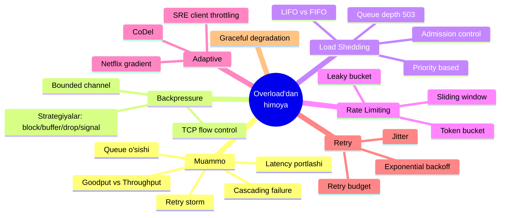
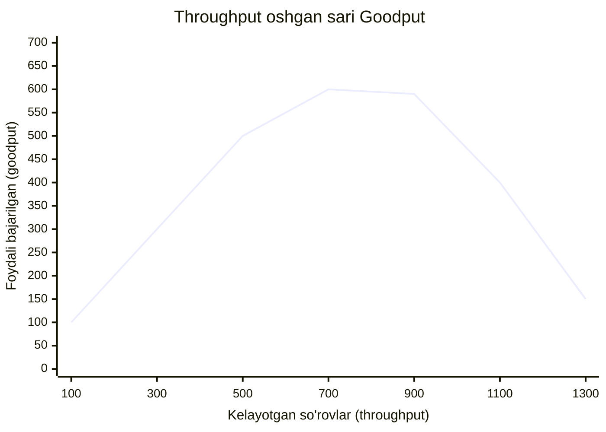
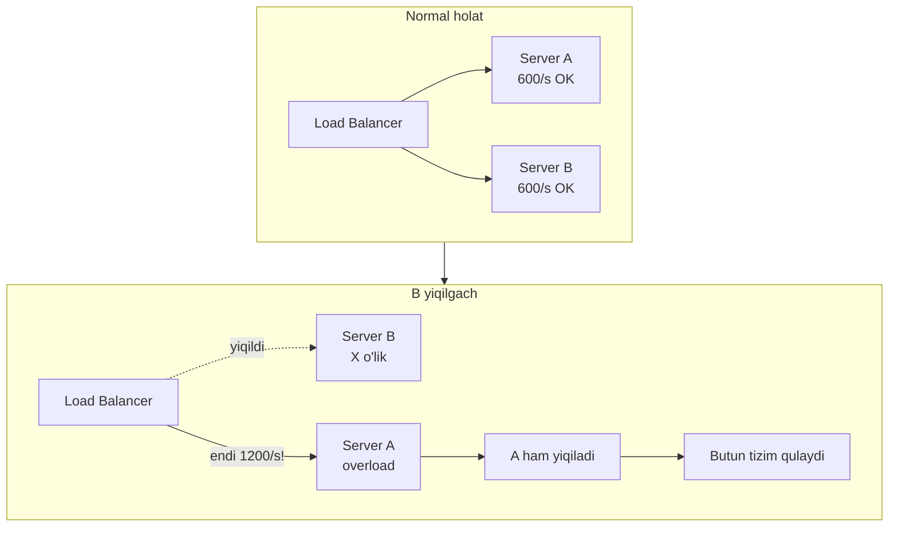
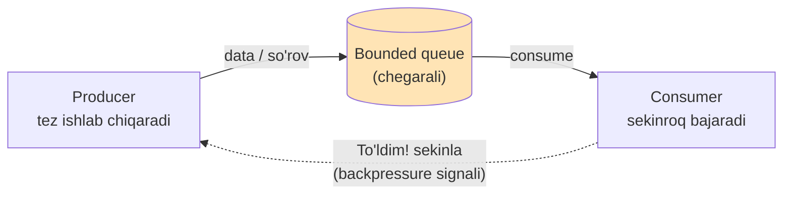
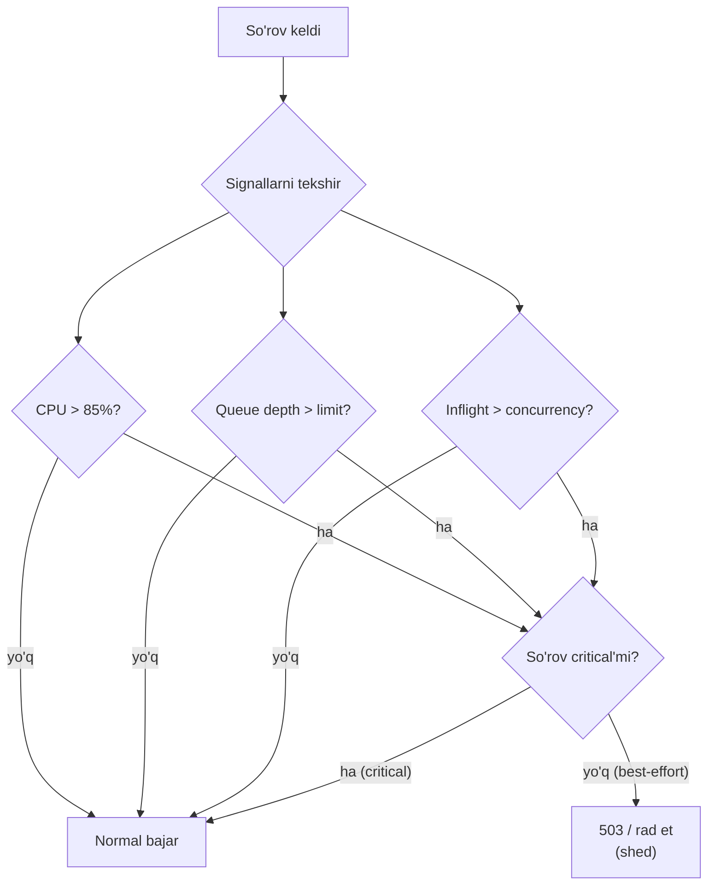
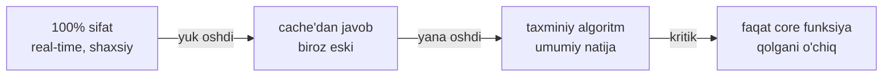
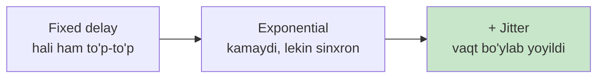

# Backpressure va Load Shedding — overload'dan omon qolish san'ati

> **Distributed Patterns — 8-dars**
> Manba: "Cloud Native Go" (M. Titmus, 2022, 9-bob) + AWS Builders' Library + Google SRE Book + Reactive Streams + Netflix concurrency-limits
> Fokus: Go implementatsiya, ishlaydigan kod, real production stsenariylari

---

## TL;DR (eng qisqa mag'iz)

Har qanday xizmatning **chegarasi** bor. Chegaradan oshgan yuk (**overload**) xizmatni sekinlatadi, keyin butunlay yiqitadi — va bu **cascading failure** (zanjirli qulash) bo'lib butun tizimga tarqaladi. Undan himoyaning uchta asosiy quroli bor:

- **Backpressure** — iste'molchi (consumer) ishlab chiqaruvchini (producer) "sekinla, ulgurmayapman" deb *sekinlatadi*. Go'da bu buffered channel to'lganda tabiiy tarzda sodir bo'ladi.
- **Load shedding** — server to'yinish nuqtasiga yaqinlashganda ortiqcha yukni **ongli ravishda tashlaydi** (masalan HTTP 503), toki qolgan so'rovlarni sog'lom bajarsin.
- **Rate limiting / throttling** — vaqt birligidagi so'rov sonini oldindan cheklaydi (token bucket).

Ularning ustiga: **graceful degradation** (funksiyani bosqichma-bosqich kamaytirish), **retry + exponential backoff + jitter** (retry storm'ning oldini olish) va **adaptive** usullar (Google SRE formulasi, Netflix gradient).

> **Oltin qoida:** Overload paytida hamma so'rovni qabul qilib *sekin* o'lgandan ko'ra, bir qismini *tez* rad etib, qolganini sog'lom bajargan afzal. Yarim non — nondan yaxshi.

---

## Mavzu xaritasi



---

# 1-QISM. Muammo — overload nega halokatli?

## 1.1. Hook: "shunchaki server qo'shamiz-da?"

Tasavvur qil: sening xizmating sekundiga 600 ta so'rovni bemalol bajaradi. Bir kuni trafik ko'tarildi va sekundiga 900 ta so'rov kela boshladi. Sen o'ylaysan: "yomon bo'lsa, biroz sekinlashadi-da, 900 tasini ham amallab bajarar".

Yo'q. Real tizim bunday ishlamaydi. Chegaradan oshganda xizmat *biroz* sekinlashmaydi — u **halokatli** darajada sekinlashadi va ko'pincha butunlay o'ladi. Nega? Buni tushunish uchun ikkita atamani ajratishimiz kerak.

## 1.2. Goodput vs Throughput — eng muhim farq

- **Throughput** (o'tkazuvchanlik) — serverga *kelayotgan* yoki *urinilayotgan* so'rovlar tezligi (sekundiga nechta).
- **Goodput** (foydali o'tkazuvchanlik) — server *muvaffaqiyatli, o'z vaqtida, xatosiz* bajargan so'rovlar tezligi.

Sen throughput'ni emas, **goodput'ni** ko'paytirmoqchisan. Chunki mijozga kelmagan yoki timeout bilan o'lgan javob — bu hech narsa.

Muammo shundaki: throughput bir chegaradan oshgach, goodput **oshmaydi**, balki **tushib ketadi**. Bu nuqta — "plateau" (yassi cho'qqi).



Ko'ryapsanmi? 600 gacha goodput throughput bilan birga o'sadi. 600–700 orasida **plateau** (to'yinish). Undan keyin throughput oshsa ham goodput **pastga tushadi**. Bu holat AWS Builders' Library'da **brownout** (yarim o'chish) deb ataladi — server tirik, lekin foydali ish deyarli bajarmaydi.

## 1.3. Nega goodput qulaydi? — Notional machine

Kod ortida aslida nima sodir bo'ladi? Server ichida har so'rov navbatga (queue) tushadi. Overload paytida:

1. **Queue cheksiz o'sadi.** So'rov kelish tezligi > bajarish tezligi bo'lsa, navbat uzun­lashadi. Har so'rov navbatda uzoq kutadi.
2. **Latency portlaydi.** Navbat uzun bo'lsa, javob vaqti (latency) oshadi — p99 sekundlarga chiqadi.
3. **Mijoz timeout bo'ladi.** Mijoz javobni kutmay ketadi — lekin server hali ham *o'sha allaqachon tashlab ketilgan* so'rov ustida ishlaydi. Bu — **bekorga sarflangan ish**.
4. **Resurs tugaydi.** Har kutayotgan so'rov RAM, goroutine, DB connection ushlab turadi. Bir payt memory yoki connection pool tugaydi — server crash bo'ladi.

> **Muhim tushuncha:** Overload paytida server o'z resurslarini *muvaffaqiyatli* so'rovlarga emas, *o'lik* so'rovlarga (timeout bo'lganlar, navbatda charchaganlar) sarflaydi. Shuning uchun goodput qulaydi.

## 1.4. Cascading failure — zanjirli qulash (kitobdan stsenariy)

Endi eng dahshatli qismi. Bitta serverning o'limi qo'shnisini o'ldiradi. "Cloud Native Go" kitobidagi klassik misol (9.1-rasm):

Uchta bir xil server LB (load balancer) ortida turibdi, har biri **600 so'rov/s** ni ko'taradi. Umumiy yuk 1200 so'rov/s, ya'ni har serverga 600 — aynan chegara.

Bir kuni **B serveri yiqiladi**. Endi LB uning yukini qolgan ikkiga (yoki bittaga) tashlaydi. A serveriga endi **1200 so'rov/s** tushadi — chegarasidan ikki barobar. A ham overload bo'lib yiqiladi. Uning yuki keyingisiga... va butun tizim bir necha daqiqada quladi.



> **Cascading failure ta'rifi:** bitta komponentning ishdan chiqishi qolganlarga yukni oshirib, ularni ham ishdan chiqaradi — va bu **positive feedback** (ijobiy teskari aloqa) tufayli tez tarqaladi.

Xavfli tomoni: bunday holatdan **shunchaki server qo'shib** chiqib bo'lmaydi. Yangi server ham darhol o'sha feedback'ga tushib yiqiladi. Ko'pincha yagona chora — trafikni butunlay bloklab, tizimni tiklab, keyin yukni *asta-sekin* oshirish.

## 1.5. Metastable failure va retry storm

Zamonaviy atama — **metastable failure**: tizim tashqi sabab (trafik cho'qqisi) yo'qolganidan keyin ham o'zini o'zi qulagan holatda ushlab turadi. Sabab odatda — **retry** (qayta urinish).

Kitobdagi haqiqiy production stsenariysi. Kimdir shu kodni yozgan:

```go
// XATO: cheksiz retry, kutishsiz
res, err := SendRequest()
for err != nil {
    res, err = SendRequest() // pastdagi servis o'lsa — cheksiz portlash
}
```

Pastdagi servis yiqilganda, bu kod ishlagan *har bir* server (yuzlab nusxa) cheksiz siklda sekundiga minglab so'rov yubordi. Tarmoq shu retry'lardan tiqilib, administratorlar butun tizimni qayta ishga tushirishga majbur bo'ldi.

Bu **retry storm** (retry bo'roni). Eng yomoni: pastdagi servis tiklanmoqchi bo'lganda ham, uni darhol retry to'lqini bosib, yana yiqitadi. Buni keyin 8-qismda batafsil davolaymiz.

> 🤔 **O'ylab ko'r:** Nega overload'dan chiqish uchun "server qo'shish" ko'pincha yordam bermaydi?

<details>
<summary>Javobni ko'rish</summary>

Chunki cascading/metastable failure'ni **positive feedback** ushlab turadi (retry, LB qayta taqsimlashi). Yangi server o'sha teskari aloqaga tushadi: unga ham darhol katta yuk kelib, u ham yiqiladi. Avval feedback'ni uzish kerak (trafikni bloklash, load shedding, retry'ni to'xtatish), keyingina quvvat qo'shish samara beradi.
</details>

---

# 2-QISM. Backpressure — "sekinla!" signali

## 2.1. Hook: konveyer to'lib ketganda

Backpressure'ni tushunish uchun oldingi bilimga bog'laymiz. `learning/system-design`'da sen **buffered channel** to'lganda goroutine bloklanishini ko'rgansan. Backpressure — aynan shu g'oyaning nom bilan atalgani.

## 2.2. Analogiya — restoran oshxonasi

Restoranda **ofitsiant** (producer) buyurtmalarni **oshxonaga** (consumer) uzatadi. Oshxona bir vaqtda 10 ta taomni ko'taradi.

- Agar ofitsiant sekundiga 100 ta buyurtma tashlab ketaversa, oshxona ostidagi qog'oz buyurtmalar tog'i o'sadi — hech qachon bajarib bo'lmaydi.
- Aqlli restoranda oshxona to'lganda ofitsiantga: **"To'xta, oldingilar tayyor bo'lmaguncha yangi buyurtma olma"** deydi. Bu — backpressure.

Natijada ofitsiant sekinlashadi — mijozga "biroz kuting" deydi yoki boshqa stolga o'tadi. Muhimi: buyurtmalar tog'i o'smaydi, tizim barqaror.

> **Analogiya chegarasi:** oshxona ofitsiantni *fizik* to'xtatadi. Tarmoqdagi servislar orasida bunday to'g'ridan-to'g'ri "qo'l" yo'q — signal aniq protokol orqali (channel bloklanishi, TCP window, HTTP 429) uzatilishi kerak. Backpressure "avtomatik" emas; uni ataylab qurish kerak.

## 2.3. Sodda ta'rif

> **Backpressure** — iste'molchi (consumer) o'zining bajarish quvvatidan oshib ketmasligi uchun ishlab chiqaruvchini (producer) sekinlatishi yoki to'xtatishi.

Ya'ni signal **orqaga**, oqimga *qarshi* yo'nalishda ("back") bosim ("pressure") o'tkazadi. Producer'dan consumer'ga so'rov oqadi; backpressure signali esa consumer'dan producer'ga qaytadi.

## 2.4. Diagramma — oqim yo'nalishi



Diqqat: queue **chegarali** (bounded) bo'lishi shart. Agar queue cheksiz (unbounded) bo'lsa, backpressure signali *hech qachon* yubormaydi — queue shunchaki o'sib RAM'ni yeydi va tizim yiqiladi. Backpressure'ning butun kuchi — chegarada.

## 2.5. Worked example — Go'da tabiiy backpressure (bounded channel)

Go'da backpressure'ni *maxsus* yozish shart emas — u **buffered channel** ichiga qurilgan. Channel to'lganda, unga yozmoqchi bo'lgan goroutine avtomatik bloklanadi (kutadi). Bu — "sekinla" signalining o'zi.

```go
// --- 1-qadam: chegarali (bounded) channel — "queue" o'rnida ---
// Sig'imi 5 — ko'pi bilan 5 ta ish kutib turadi
jobs := make(chan int, 5)

// --- 2-qadam: sekin consumer (har ishni 500ms da bajaradi) ---
go func() {
    for j := range jobs {
        time.Sleep(500 * time.Millisecond) // og'ir ish
        fmt.Println("bajarildi:", j)
    }
}()

// --- 3-qadam: tez producer ---
for i := 1; i <= 100; i++ {
    jobs <- i // channel TO'LSA — shu yerda BLOKLANADI (backpressure!)
    fmt.Println("yuborildi:", i)
}
close(jobs)
```

**Output (qisqartirilgan):**
```text
yuborildi: 1
yuborildi: 2
... (6 tagacha tez ketadi, buffer + consumer bandi)
bajarildi: 1        <- consumer bo'shatgach
yuborildi: 7        <- producer endi davom etadi
bajarildi: 2
yuborildi: 8
...
```

**Notional machine:** `jobs <- i` satri — bu shunchaki "yozish" emas. Go runtime channel buferini tekshiradi: joy bo'lsa — qo'yadi va davom etadi; **joy bo'lmasa** — goroutine'ni *parkovka* qiladi (uxlatadi) va scheduler'ga boshqa goroutine'ni ishlatishga topshiradi. Consumer bitta element o'qib bo'shatgach, runtime producer goroutine'ni uyg'otadi. Ana shu "uxlatish" — producer'ning sekinlashi, ya'ni backpressure.

## 2.6. TCP flow control ham backpressure

Bu tushuncha yangi emas — u tarmoq protokollarida o'nlab yillardan beri bor. **TCP flow control**: qabul qiluvchi tomon o'z buferida qancha joy borligini "receive window" (rwnd) orqali jo'natuvchiga aytadi. Bufer to'lsa, window 0 bo'ladi — jo'natuvchi to'xtaydi.

Ya'ni TCP allaqachon consumer'ni himoya qiladi. **Reactive Streams** spetsifikatsiyasi ham xuddi shu g'oyani ilova darajasiga ko'taradi: subscriber `request(n)` orqali "men hozir n ta elementni ko'taraman" deb *talab* signalini yuboradi (pull-based), publisher esa faqat shuncha yuboradi. Push emas, pull — sekin consumer hech qachon bosib ketilmaydi.

## 2.7. Backpressure strategiyalari — to'lganda nima qilamiz?

Consumer ulgurmay, queue to'lganda producer nima qiladi? To'rt xil siyosat bor:

| Strategiya | Nima qiladi | Xavfi / narxi | Qachon |
|-----------|-------------|---------------|--------|
| **Block** (kutish) | Producer joy bo'lguncha kutadi | Producer ham sekinlaydi; upstream'ga tarqaladi | Ma'lumot muhim, yo'qotib bo'lmaydi |
| **Buffer** | Vaqtincha saqlab qo'yadi | **Unbounded bo'lsa — halokat!** RAM yeydi | Qisqa cho'qqilarni yumshatishga |
| **Drop** | Ortiqchani tashlaydi | Ma'lumot yo'qoladi | Ma'lumot eskisa keraksiz (masalan metrikalar) |
| **Signal** | Producer'ga "rad" javobi qaytaradi | Client qayta urinishi kerak | Tashqi API (HTTP 429, gRPC RESOURCE_EXHAUSTED) |

> **Eng katta xato:** cheksiz buffer (unbounded queue) qo'yish. U muammoni "yashiradi" — backpressure signalini o'chiradi — va keyin OOM (out of memory) bilan portlaydi. Bounded buffer + aniq strategiya har doim afzal.

**Signal strategiyasi** tashqi dunyoga:
- **HTTP:** `429 Too Many Requests` + `Retry-After: 5` header (rate limit) yoki `503 Service Unavailable` (load shed).
- **gRPC:** `RESOURCE_EXHAUSTED` status kodi.

> 🤔 **O'ylab ko'r:** Yuqoridagi Go misolida `jobs := make(chan int, 5)` o'rniga `jobs := make(chan int)` (buffersiz) qilsak backpressure kuchayadimi yoki zaiflashadimi?

<details>
<summary>Javobni ko'rish</summary>

**Kuchayadi** — backpressure eng qattiq bo'ladi. Buffersiz (unbuffered) channelda producer *har* yozishda consumer tayyor bo'lguncha bloklanadi (0 sig'im). Ya'ni producer va consumer qadamma-qadam yuradi. Sig'im qancha katta bo'lsa, producer shuncha erkin "oldinga ketadi" — backpressure yumshoqroq. Buffer = cho'qqilarni yumshatuvchi "amortizator".
</details>

---

# 3-QISM. Rate limiting / Throttling — oldindan cheklash

## 3.1. Hook va analogiya

Backpressure — *ichki* signal (komponentlar orasida). **Throttling / rate limiting** esa ko'pincha *kiruvchi* trafikni oldindan cheklaydi: "bitta foydalanuvchi vaqt birligida N tadan ortiq so'ramasin".

Analogiya (kitobdan): mashinaning **drossel zaslonkasi** (throttle) — u dvigatelga borayotgan yoqilg'i miqdorini cheklaydi. Throttle pattern ham xuddi shunday, faqat yoqilg'i emas, so'rovlar oqimini cheklaydi.

> **Farq:** rate limiting **preventiv** (oldindan, kvota asosida — "sen kuniga 1000 ta"), load shedding esa **reaktiv** (resurs tugab qolayotganda — "hozir CPU to'la, keyinroq kel"). Ikkalasini birga ishlatish mumkin.

## 3.2. Token bucket — kitob implementatsiyasi

`../2. Stability Patterns/5. Throttle - Rate Limiting.md`'da global throttle ko'rilgan. Bu yerda kitobning **per-user** (har foydalanuvchi uchun alohida) va **timersiz** versiyasini ko'ramiz. Uch muhim xususiyati bor:

1. Bitta emas — **har UID (user id) uchun alohida** bucket.
2. Xatolik emas, **bool** qaytaradi: `true` = o'tdi, `false` = throttle qilindi (cheklash — xato emas).
3. `time.Ticker` **ishlatmaydi** — tokenlar fon jarayonida emas, **so'rov kelganda** o'tgan vaqtga qarab hisoblanadi. Bu yondashuv yaxshiroq masshtablanadi (fon goroutine yo'q).

```go
// Effector -- throttle qilinadigan asl funksiya
type Effector func(context.Context) (string, error)

// Throttled -- Effector'ning o'ramchisi: UID qabul qiladi,
// bool qaytaradi (true = throttle bo'lmadi)
type Throttled func(context.Context, string) (bool, string, error)

// bucket -- bitta UID uchun oxirgi so'rov holati
type bucket struct {
    tokens uint      // hozir nechta token
    time   time.Time // oxirgi hisoblash vaqti
}
```

Asosiy mantiq — `Allow` ishi so'rov paytida bajariladi:

```go
func Throttle(e Effector, max, refill uint, d time.Duration) Throttled {
    buckets := map[string]*bucket{} // UID -> bucket

    return func(ctx context.Context, uid string) (bool, string, error) {
        b := buckets[uid]

        // --- 1-qadam: yangi user — bucket to'la, 1 token yeymiz ---
        if b == nil {
            buckets[uid] = &bucket{tokens: max - 1, time: time.Now()}
            str, err := e(ctx)
            return true, str, err
        }

        // --- 2-qadam: o'tgan vaqtga qarab qancha token qo'shilishini hisobla ---
        refillInterval := uint(time.Since(b.time) / d)
        currentTokens := b.tokens + refill*refillInterval

        // --- 3-qadam: token yetmasa — throttle (false) ---
        if currentTokens < 1 {
            return false, "", nil
        }

        // --- 4-qadam: bucketni yangila, 1 token yeb, asl funksiyani chaqir ---
        if currentTokens > max {
            b.time = time.Now()
            b.tokens = max - 1
        } else {
            deltaTokens := currentTokens - b.tokens
            deltaRefills := deltaTokens / refill
            b.time = b.time.Add(time.Duration(deltaRefills) * d)
            b.tokens = currentTokens - 1
        }
        str, err := e(ctx)
        return true, str, err
    }
}
```

HTTP handler'da ishlatish (kitobdan):

```go
var throttled = Throttle(getHostname, 1, 1, time.Second)

func throttledHandler(w http.ResponseWriter, r *http.Request) {
    // r.RemoteAddr -- UID sifatida IP ishlatilyapti
    ok, hostname, err := throttled(r.Context(), r.RemoteAddr)
    if err != nil {
        http.Error(w, err.Error(), http.StatusInternalServerError) // 500
        return
    }
    if !ok {
        http.Error(w, "Too many requests", http.StatusTooManyRequests) // 429
        return
    }
    w.Write([]byte(hostname)) // 200 OK
}
```

**Notional machine:** `tokens` — RAM'dagi oddiy son. Fon goroutine tokenlarni "quymaydi"; har so'rovda kod `time.Since(b.time)` bilan "oxirgi so'rovdan beri qancha o'tdi?" deb hisoblab, o'tgan intervallar sonini `refill`ga ko'paytiradi. Timer yo'qligi — resurs tejaydi va million user bo'lsa ham fon goroutine portlashi yo'q.

## 3.3. Kitob kodining production kamchiliklari

Kitob rostini aytadi — bu kod production'ga tayyor emas:

⚠️ **Xato 1: concurrency himoyasi yo'q.** `buckets` map'iga bir vaqtda ko'p goroutine yozsa — panic (`concurrent map write`). To'g'risi: `sync.Mutex` yoki `sync.Map` bilan himoyala.

⚠️ **Xato 2: eski yozuvlar tozalanmaydi.** Har yangi UID map'da abadiy qoladi — memory leak. To'g'risi: LRU cache yoki TTL ishlat.

⚠️ **Xato 3: local (bir server ichida).** Bir nechta server bo'lsa, limit "sizib ketadi" (5 server → 5x limit). To'g'risi: tashqi umumiy holat (Redis).

## 3.4. Production yechim — `golang.org/x/time/rate`

O'zing token bucket yozish o'rniga standart kutubxonaga yaqin `x/time/rate` paketidan foydalan — u concurrency-safe va sinovdan o'tgan:

```go
import "golang.org/x/time/rate"

// sekundiga 10 token, burst (portlash) sig'imi 20
limiter := rate.NewLimiter(10, 20)

func handler(w http.ResponseWriter, r *http.Request) {
    if !limiter.Allow() { // token bormi?
        w.Header().Set("Retry-After", "1")
        http.Error(w, "Too Many Requests", http.StatusTooManyRequests)
        return
    }
    // ... asosiy ish
}
```

`Allow()` bloklanmaydi (token yo'q bo'lsa darhol `false`). Agar kutishni istasang — `limiter.Wait(ctx)` (bu backpressure'ga o'xshab bloklaydi).

## 3.5. Algoritmlar taqqoslovi

| Algoritm | G'oya | Burst | Silliqlik | Xotira |
|----------|-------|-------|-----------|--------|
| **Token bucket** | Token yeyish + doimiy to'ldirish | Ha (nazorat bilan) | O'rta | Kam |
| **Leaky bucket** | Doimiy tezlikda oqib chiqish | Yo'q (tekislaydi) | Yuqori | Kam |
| **Fixed window** | Har oynada sana | Chet sakrashi bor | Past | Kam |
| **Sliding window** | Suriladigan oyna | Cheklangan | Yuqori | Ko'proq |

**Leaky bucket** — token bucket'ning teskarisi: u *chiqish* tezligini tekislaydi (burst'ni yo'qotadi). Orqadagi tizim silliq, barqaror oqim talab qilsa (masalan sekin DB) — leaky bucket. Notekis, real trafik uchun — token bucket. (Batafsil algoritm taqqoslovi: `System Design/02-kengayish-usullari/05-rate-limiting-va-backpressure.md`.)

---

# 4-QISM. Load Shedding — ortiqcha yukni ongli tashlash

## 4.1. Hook va analogiya

Rate limiting kvotaga qaraydi. Lekin ba'zan **haqiqiy resurs** (CPU, RAM, queue) tugab qoladi — hech qanday kvotasiz ham. Shunda **load shedding** ("yukni tashlash") kerak.

Analogiya — **metro eskalatori va turniket**. Bayram kuni bekatga olomon quyildi. Eskalator (server) faqat ma'lum tezlikda ko'taradi. Agar hammani ichkariga qo'yaversak — perron olomondan tirband bo'lib, hech kim yura olmaydi (brownout). Aqlli bekat **turniketni** vaqtincha yopib qo'yadi: "Hozir to'la, tashqarida kuting". Ichkaridagilar bemalol chiqib ketadi, keyin turniket ochiladi. Turniket — bu load shedding.

> **Load shedding ta'rifi:** server to'yinish (saturation) nuqtasiga yaqinlashganini **sezib**, trafikning bir qismini nazorat bilan **tashlaydi** — toki qolganini sog'lom (past latency bilan) bajarsin.

## 4.2. Sodda variant — queue depth bo'yicha (kitobdan)

Eng oddiy load shedding: kirish navbati (queue) chuqurligi chegaradan oshsa, yangi so'rovga `503` qaytar. Kitob buni `gorilla/mux` middleware'da ko'rsatadi:

```go
const MaxQueueDepth = 1000

// Har so'rovda chaqiriladigan middleware
func loadSheddingMiddleware(next http.Handler) http.Handler {
    return http.HandlerFunc(func(w http.ResponseWriter, r *http.Request) {
        // CurrentQueueDepth() -- joriy navbat chuqurligi (misol uchun)
        if CurrentQueueDepth() > MaxQueueDepth {
            log.Println("load shedding engaged")
            http.Error(w, "overloaded", http.StatusServiceUnavailable) // 503
            return
        }
        next.ServeHTTP(w, r) // yuk normal — o'tkaz
    })
}

func main() {
    r := mux.NewRouter()
    r.Use(loadSheddingMiddleware) // hamma route'ga ulaymiz
    log.Fatal(http.ListenAndServe(":8080", r))
}
```

Muhim nozik farq: `503` qaytarish **arzon** bo'lishi kerak. Agar rad etishning o'zi qimmat bo'lsa, load shedding foyda bermaydi. AWS maslahati: xizmatni **plateau'dan ancha yuqorida** load-test qilib, "rad etish narxi"ni minimallashtir.

## 4.3. Load shedding qarori — flowchart



Diqqat: yaxshi load shedder **hamma narsani** bir xil tashlamaydi. U avval **eng kam muhim** (best-effort) so'rovlarni tashlab, **critical** so'rovlarni himoya qiladi. Bu — keyingi bo'lim.

## 4.4. FIFO vs LIFO — qaysi navbat tartibi?

Odatda navbat **FIFO** (First In First Out — birinchi kelgan birinchi ketadi). Lekin overload paytida bu yomon! Nega?

Tasavvur qil: navbatda 1000 ta so'rov, har biri 10 soniya kutgan. Mijozlar allaqachon 5 soniyada timeout bo'lib ketishgan. FIFO bilan server *eng eski* (allaqachon o'lik) so'rovni oldin oladi — javob hech kimga kerak emas. Bekorga ish.

**LIFO** (Last In First Out) esa *eng yangi* so'rovni oladi — u hali tirik, mijozi hali kutmoqda, muvaffaqiyat ehtimoli yuqori. AWS Builders' Library aynan shuni maslahat beradi (agar protokol qo'llasa — HTTP/2 qo'llaydi, HTTP/1.1 pipelining yo'q).

| | FIFO | LIFO (overload'da) |
|--|------|--------------------|
| Oladi | Eng eski so'rov | Eng yangi so'rov |
| Overload'da | Ko'p o'lik so'rovni bajaradi (isrof) | Tirik so'rovlarni bajaradi (goodput yuqori) |
| Odatiy holat | Adolatli, yaxshi | Ba'zan starvation |

> **Qo'shimcha qoida:** navbatdagi so'rovga **yosh chegarasi** qo'y — juda uzoq (masalan > timeout) kutgan so'rovni bajarish o'rniga darhol tashlab yubor. Bu server quvvatini tirik so'rovlarga bo'shatadi.

## 4.5. Priority-based shedding — muhimni himoya qil

Google SRE Book so'rovlarni **criticality** (muhimlik) darajalariga ajratadi:

| Daraja | Ma'nosi | Overload'da |
|--------|---------|-------------|
| **CRITICAL_PLUS** | Ishlamasa — jiddiy user zarari | Oxirigacha himoyala |
| **CRITICAL** | Production default, user ko'radi | Himoyala |
| **SHEDDABLE_PLUS** | Batch, qisman yo'qolish OK | Kerak bo'lsa tashla |
| **SHEDDABLE** | Tez-tez yo'qolish kutilgan | Birinchi tashla |

Overload paytida server **pastdagilarni birinchi** tashlaydi. Masalan e-commerce'da: "buyurtma berish" = CRITICAL, "tavsiya qilingan mahsulotlar" = SHEDDABLE. Yuk oshsa — tavsiyalar o'chadi, lekin xarid ishlaydi.

## 4.6. Admission control — concurrency limiter middleware (Go)

Load shedding'ning eng amaliy shakli — **concurrency limit**: "bir vaqtda ko'pi bilan N ta so'rovni bajaramiz, ortig'iga darhol 503". Go'da buni **buffered channel semaphore** bilan chiroyli yozamiz:

```go
// --- 1-qadam: semaphore -- "N ta joy" (buffered channel) ---
type Limiter struct {
    sem chan struct{}
}

func NewLimiter(maxInflight int) *Limiter {
    return &Limiter{sem: make(chan struct{}, maxInflight)}
}

// --- 2-qadam: middleware -- joy olishga URINADI, bloklanmaydi ---
func (l *Limiter) Middleware(next http.Handler) http.Handler {
    return http.HandlerFunc(func(w http.ResponseWriter, r *http.Request) {
        select {
        case l.sem <- struct{}{}: // joy bor -> band qildik
            defer func() { <-l.sem }() // ish tugagach joyni bo'shat
            next.ServeHTTP(w, r)
        default: // joy YO'Q -> darhol rad et (shed!)
            w.Header().Set("Retry-After", "1")
            http.Error(w, "overloaded", http.StatusServiceUnavailable) // 503
        }
    })
}
```

**Ishlatish:**
```go
lim := NewLimiter(100) // bir vaqtda 100 ta so'rov
http.Handle("/", lim.Middleware(myHandler))
```

**Notional machine:** `sem` — sig'imi 100 bo'lgan channel. `l.sem <- struct{}{}` — channelga "belgi" qo'yish, ya'ni bitta joyni band qilish. `select` + `default` sehri: agar channel to'la bo'lsa (100 ta so'rov ishlayotgan bo'lsa), `case` tayyor emas, shuning uchun `default` ishlaydi va darhol 503 qaytadi — **bloklanmaydi**. So'rov tugagach `defer <-l.sem` joyni bo'shatadi. Bu — eng arzon va ishonchli load shedding.

> **Nega bu backpressure'dan farq qiladi?** Backpressure'da producer *kutadi* (bloklanadi). Bu yerda `default` bo'lgani uchun **kutmaymiz, tashlaymiz** — bu load shedding. Agar `default`ni olib tashlasak, so'rov joy bo'shaguncha kutadi — o'shanda bu backpressure bo'lib qoladi.

## 4.7. Graceful degradation — sifatni bosqichma-bosqich pasaytirish

Kitobning nozik maslahati: so'rovni *butunlay tashlash* o'rniga, ba'zan uni **arzonroq** bajarish mumkin. Bu — **graceful degradation** (muloyim buzilish).

Misollar:
- To'liq hisoblash o'rniga **cache'dagi** (biroz eski) natijani qaytar.
- Aniq lekin qimmat algoritm o'rniga **taxminiy** (arzon) algoritm ishlat.
- Rasmlarni past sifatda ber; shaxsiy tavsiyalar o'rniga umumiy top-10 ni ko'rsat.

Ya'ni "hammasi yoki hech narsa" emas — **kamroq, lekin ishlaydi**. Bu load shedding'ning nafis shakli: yukni oldindan (preventiv) kamaytiradi.



---

# 5-QISM. Adaptive usullar — o'zini sozlaydigan himoya

Statik chegaralar (`MaxQueueDepth = 1000`) qo'pol: apparat yangilansa yoki so'rov turi o'zgarsa, eski raqam noto'g'ri bo'lib qoladi. **Adaptive** usullar chegarani real signal asosida avtomatik sozlaydi.

## 5.1. Google SRE — client-side adaptive throttling

Ajoyib g'oya: faqat server emas, **client ham** o'zini tiyadi. Client oxirgi 2 daqiqada ikki sonni yuritadi:

- `requests` — client urinib ko'rgan so'rovlar
- `accepts` — server qabul qilgan so'rovlar

Client so'rovni **mahalliy rad etish** ehtimoli:

```text
p(reject) = max(0, (requests - K*accepts) / (requests + 1))
```

Odatda `K = 2`. Ma'nosi: agar server so'rovlarning yarmidan ko'pini rad etayotgan bo'lsa (requests > 2*accepts), client o'zi *tarmoqqa chiqmasdan* so'rovlarni tasodifiy rad eta boshlaydi. Bu server'ni retry to'lqinidan himoya qiladi — client "yiqilgan eshikni" taqillatavermaydi.

## 5.2. Netflix — adaptive concurrency limits (gradient)

Netflix `concurrency-limits` kutubxonasi statik `maxInflight` o'rniga uni **avtomatik topadi**. Asosi — **Little's Law**: `L = λ × W` (o'rtacha concurrency = so'rov tezligi × o'rtacha xizmat vaqti).

G'oyasi TCP congestion control'dan olingan:

```text
gradient = RTT_noload / RTT_actual
```

- `RTT_noload` — eng past (navbatsiz) kuzatilgan latency (ideal).
- `RTT_actual` — hozirgi latency.
- `gradient ≈ 1` → navbat yo'q → limitni **oshir**.
- `gradient < 1` → latency o'sdi, navbat yig'ilyapti → limitni **kamaytir**.

Ya'ni tizim latency o'sishini "navbat paydo bo'ldi" signali sifatida o'qib, concurrency limitini real vaqtda sozlaydi. Sen qo'lda raqam qo'ymaysan.

## 5.3. CoDel — Controlled Delay (qisqacha)

Tarmoq dunyosidan kelgan **CoDel** algoritmi navbatdagi so'rovning **kutish vaqtini** o'lchaydi. Agar so'rovlar navbatda doimo belgilangan vaqtdan (masalan 5ms) uzoq turayotgan bo'lsa — navbat "yomon to'lgan" deb hisoblab, so'rovlarni tashlay boshlaydi. G'oya: navbat *uzunligini* emas, navbatda o'tkazilgan *vaqtni* nazorat qilish muhimroq (bufferbloat'ga qarshi).

> **Umumiy g'oya (uch usulda ham bir xil):** eng ishonchli overload signali — bu **latency / navbatda kutish vaqtining o'sishi**. Chunki latency oshdi degani — navbat yig'ilyapti degani, ya'ni server chegaraga yetdi.

---

# 6-QISM. Retry storm va exponential backoff + jitter

## 6.1. Muammo — retry yaxshimi yoki yomonmi?

1-qismda ko'rdik: sodda `for err != nil { retry }` — retry storm keltiradi. Lekin retry butunlay yomon degani emas — **to'g'ri** retry chidamlilikni oshiradi. Sir — **qancha kutish** va **qancha marta**da.

## 6.2. Bosqichma-bosqich: fixed → exponential → +jitter

**1-urinish: fixed delay** (kitob). Har retry oldidan 2 soniya kut:
```go
for err != nil {
    time.Sleep(2 * time.Second)
    res, err = SendRequest()
}
```
Kam client bo'lsa ishlaydi, lekin 1000 client bir vaqtda 2 soniyada urinsa — baribir tarmoqni bosadi.

**2-urinish: exponential backoff** (kitob). Kutish har safar ikki barobar oshadi (`base` dan `cap` gacha):
```go
base, cap := time.Second, time.Minute
for backoff := base; err != nil; backoff <<= 1 { // <<=1 -> *2
    if backoff > cap {
        backoff = cap
    }
    time.Sleep(backoff)
    res, err = SendRequest()
}
```
Yaxshiroq, lekin muammo bor: 1000 client **bir vaqtda** yiqilgan bo'lsa, ular **bir vaqtda** 1s, keyin 2s, keyin 4s kutadi — retry'lar **to'p-to'p** bo'lib keladi (sinxronlashgan). Portlash saqlanib qoladi.

**3-urinish: exponential backoff + jitter** (yechim). Kutishga **tasodifiylik** qo'shamiz — client'lar retry'ni vaqt bo'ylab yoyadi:

```go
base, cap := time.Second, time.Minute
for backoff := base; err != nil; backoff <<= 1 {
    if backoff > cap {
        backoff = cap
    }
    // jitter: 0 dan backoff gacha tasodifiy (full jitter)
    sleep := time.Duration(rand.Int63n(int64(backoff)))
    time.Sleep(sleep)
    res, err = SendRequest()
}
```



## 6.3. Jitter turlari (Marc Brooker / AWS)

AWS'ning mashhur tadqiqoti (Marc Brooker) uch xil jitter'ni taqqoslaydi:

| Tur | Formula | Xususiyat |
|-----|---------|-----------|
| **Full jitter** | `sleep = random(0, min(cap, base*2^n))` | Eng kam ish, eng yaxshi tarqalish |
| **Equal jitter** | `temp = min(cap, base*2^n); sleep = temp/2 + random(0, temp/2)` | Yarmi kafolatlangan kutish |
| **Decorrelated** | `sleep = min(cap, random(base, sleep*3))` | Oldingi sleep'ga bog'liq |

AWS xulosasi: **Full jitter** eng yaxshi — 100 ta raqobatlashayotgan client bilan **so'rovlar sonini yarmidan ko'proq kamaytiradi** va tugash vaqtini ham yaxshilaydi. Sinxron portlashlarni barqaror, tekis yukka aylantiradi.

> **Diqqat (kitob eslatmasi):** Go'da `math/rand` seed'siz har ishga tushishda *bir xil* "tasodifiy" ketma-ketlik beradi. Go 1.20+ da avtomatik seed bor; eski versiyada `rand.Seed(time.Now().UnixNano())` kerak. Aks holda "jitter" jitter bo'lmay qoladi.

## 6.4. Retry budget — qancha retry mumkin?

Faqat backoff yetarli emas. Google SRE qo'shimcha cheklovlar qo'yadi:

- **Per-request budget:** bitta so'rovga ko'pi bilan **3 urinish**.
- **Per-client budget:** retry'lar umumiy so'rovlarning **10%** dan oshmasin. Oshsa — retry to'xtaydi. Bu "retry budget" tizim sog'lom bo'lganda retry'ga ruxsat beradi, ommaviy nosozlikda esa tiyadi.
- **Faqat bitta qatlamda retry.** Agar A→B→C zanjirining har qatlami retry qilsa, urinishlar ko'payadi (3×3×3 = 27!). Retry faqat rad etuvchi qatlamning ustidagi qatlamda bo'lsin.
- **"Don't retry" signali.** Server juda ko'p retry sezsa, oddiy rad etish o'rniga "overloaded, retry qilma" deb aytadi.

> 🤔 **O'ylab ko'r:** 3 qatlamli zanjir (A→B→C), har biri xatoda 3 martagacha retry qiladi. C yiqilsa, C'ga jami nechta urinish keladi?

<details>
<summary>Javobni ko'rish</summary>

**27 ta** (3 × 3 × 3). A 3 marta B'ni chaqiradi; har chaqiruvda B 3 marta C'ni chaqiradi = 9; agar yuqorida yana bir qatlam bo'lsa — 27. Bu **retry amplification** (retry kuchayishi). Shuning uchun retry faqat **bitta** qatlamda (odatda eng yuqori/client) bo'lishi kerak; ichki qatlamlar retry qilmasin.
</details>

---

# 7-QISM. Signallar — qachon shed qilish kerak?

Load shedding uchun "server band" ni qaysi ko'rsatkichdan bilamiz? Bir nechta signal bor, har birining kuchli va zaif tomoni:

| Signal | Plyus | Minus |
|--------|-------|-------|
| **Queue depth** (navbat chuqurligi) | Oddiy, tez | Chegara qo'lda, apparatga bog'liq |
| **Latency p99** | Foydalanuvchi his qiladigan haqiqat | Kechikib signal beradi |
| **CPU utilization** | Resurs to'yinishini to'g'ridan-to'g'ri | I/O-bound ishda aldamchi |
| **Inflight requests** (concurrency) | Little's Law bilan bog'liq, ishonchli | To'g'ri limitni topish kerak |
| **Queue wait time** (kutish vaqti) | CoDel'ning asosi, eng aniq | O'lchash biroz murakkab |

> **Amaliy maslahat:** bitta signalga tayanma. Ko'pincha **inflight concurrency limit** (4.6-bo'limdagi semaphore) + **queue wait time chegarasi** birgalikda eng barqaror natija beradi. Latency (p99) ni esa alarm/monitoring uchun kuzat.

---

# 8-QISM. Katta taqqoslash — kim, qayerda, nima uchun?

Bu to'rt pattern chalkashtiriladi. Mana aniq farqlar:

| | **Backpressure** | **Load shedding** | **Rate limiting** | **Circuit breaker** |
|--|------------------|-------------------|-------------------|---------------------|
| **Maqsad** | Consumer'ni bosib ketmaslik | Overload'da omon qolish | Adolat/kvota, abuse | Yiqilgan bog'liqlikdan himoya |
| **Yo'nalish** | Consumer → producer (orqaga) | Kiruvchi trafik | Kiruvchi trafik | Chiquvchi so'rov |
| **Rejim** | Reaktiv (bufer to'lganda) | Reaktiv (resurs to'yinganda) | Preventiv (kvota) | Reaktiv (xatolar soniga) |
| **Nimaga qaraydi** | Bufer/channel to'ligi | CPU, queue, latency | So'rov tezligi (rate) | Ketma-ket xatolar soni |
| **Odatiy javob** | Producer'ni kutkazish/sekinlatish | 503 rad etish | 429 + Retry-After | Darhol fail (so'rov yubormaydi) |
| **Joyi (Go)** | Bounded channel | Middleware (semaphore) | Middleware (token bucket) | Client kutubxonasi |

**Bir jumlada eslab qol:**
- **Backpressure** ichkarida "sekinla" deydi.
- **Load shedding** "hozir joy yo'q, ket" deydi (resurs tugaganda).
- **Rate limiting** "sen kvotangdan oshding" deydi (oldindan).
- **Circuit breaker** "u yoq o'lik, urinib o'tirma" deydi (chiquvchi tomonga).

Bular **raqib emas, jamoa**. Real production'da to'rttasi ham birga ishlaydi: rate limiting eshikda, load shedding overload'da, backpressure ichki pipeline'da, circuit breaker esa pastdagi servislarga chiqishda. Circuit breaker haqida: `../2. Stability Patterns/3. Circuit Breaker.md`.

---

## Xulosa

- **Overload halokatli**, chunki throughput chegaradan oshgach **goodput qulaydi** (plateau/brownout), navbat va latency portlaydi.
- Bitta serverning o'limi qo'shnisiga yukni oshirib **cascading failure** (zanjirli qulash)ni positive feedback bilan tarqatadi.
- **Backpressure** — consumer producer'ni sekinlatishi; Go'da **bounded channel** to'lganda tabiiy sodir bo'ladi. Cheksiz bufer — o'lim.
- **Rate limiting / throttling** — kvota bo'yicha oldindan cheklash; **token bucket** (kitob kodi yoki `x/time/rate`) burst'ni nazorat bilan qo'llaydi.
- **Load shedding** — resurs to'yinganda ortiqchani ongli tashlash (503); **LIFO** + **priority** + **concurrency limiter** (semaphore) bilan kuchayadi.
- **Graceful degradation** — tashlash o'rniga arzonroq/eski javob berib, funksiyani bosqichma-bosqich kamaytirish.
- **Adaptive** usullar (SRE client throttling, Netflix gradient, CoDel) chegarani latency signali asosida avtomatik sozlaydi.
- **Retry** faqat **exponential backoff + full jitter + retry budget** bilan xavfsiz; aks holda **retry storm** butun tizimni yiqitadi.

## 🧠 Eslab qol

- Goodput muhim, throughput emas: yuk oshsa goodput plateau'dan **tushadi**.
- Backpressure = bounded channel bloklanishi; cheksiz bufer taqiqlangan.
- Load shedding = to'yinganda 503, LIFO va priority bilan.
- Retry'siz backoff yo'q, backoff'siz jitter yo'q, jitter'siz retry storm bor.
- To'rt pattern raqib emas, jamoa: 429 (rate), 503 (shed), kutish (backpressure), tez-fail (breaker).

## ✅ O'z-o'zini tekshir (retrieval practice)

**1.** Nega throughput oshgan sari goodput bir nuqtadan keyin *tushib* ketadi?

<details>
<summary>Javob</summary>

Chunki plateau'dan keyin server resurslarini muvaffaqiyatli ishga emas, **o'lik ishga** sarflaydi: navbatda charchab timeout bo'lgan so'rovlar, context switching, GC bosimi, connection ushlab turish. Har yangi so'rov mavjud so'rovlarni ham sekinlatadi (brownout). Natijada tirik javoblar tezligi (goodput) tushadi, garchi kiruvchi so'rov (throughput) oshsa ham.
</details>

**2.** Go'da `make(chan int, 5)` va `make(chan int)` — qaysi biri kuchliroq backpressure beradi va nega?

<details>
<summary>Javob</summary>

Buffersiz `make(chan int)` kuchliroq: producer *har* yozishda consumer tayyor bo'lguncha bloklanadi (0 zaxira, qadamma-qadam). Bufer sig'imi qancha katta bo'lsa, producer shuncha oldinga erkin ketadi — backpressure yumshoqroq. Bufer = cho'qqilarni yumshatuvchi amortizator, lekin u ham chegarali (bounded) bo'lishi shart.
</details>

**3.** Overload paytida nega FIFO o'rniga LIFO navbat afzal bo'lishi mumkin?

<details>
<summary>Javob</summary>

FIFO eng eski so'rovni oldin oladi — u ko'pincha allaqachon timeout bo'lgan (mijoz ketgan), javobi keraksiz — bekorga ish. LIFO eng yangi so'rovni oladi — u hali tirik, mijoz kutmoqda, muvaffaqiyat ehtimoli yuqori. Shuning uchun overload'da LIFO goodput'ni oshiradi. (Qo'shimcha: navbatga yosh chegarasi qo'yib, juda eski so'rovlarni tashlab yuborish kerak.)
</details>

**4.** Sodda exponential backoff (jitter'siz) 1000 client bir vaqtda yiqilganda nega yetarli emas?

<details>
<summary>Javob</summary>

Chunki 1000 client bir vaqtda yiqilsa, ular **sinxron** kutadi: hammasi 1s, keyin 2s, keyin 4s... — retry'lar **to'p-to'p** bo'lib bir vaqtda keladi va portlashni saqlab qoladi. Yechim — **jitter** (tasodifiy kechikish): kutishni tasodifiylashtirib, urinishlarni vaqt bo'ylab yoyadi. AWS bo'yicha **full jitter** eng yaxshi.
</details>

**5.** Rate limiting, load shedding va backpressure — uchtasining maqsadi bir xil (yiqilmaslik). Bitta jumlada har birining farqini ayt.

<details>
<summary>Javob</summary>

**Rate limiting** — kvota bo'yicha *oldindan* kiruvchi so'rovni cheklaydi (429). **Load shedding** — resurs *to'yinganda reaktiv* ortiqchani tashlaydi (503). **Backpressure** — *ichki* consumer producer'ni *sekinlatadi* (kutkazadi, tashlamaydi). Rate limit "kvotang tugadi", shed "hozir joy yo'q", backpressure "sekinroq yubor".
</details>

**6.** `503 Service Unavailable` qaytarish "arzon" bo'lishi nega muhim?

<details>
<summary>Javob</summary>

Chunki load shedding'ning maqsadi — resursni tejab, tirik so'rovlarga bo'shatish. Agar so'rovni **rad etishning o'zi** qimmat bo'lsa (og'ir auth, DB tekshiruvi, katta log), server rad etishga ham quvvat sarflaydi va shedding foyda bermaydi — brownout davom etadi. Shuning uchun 503 imkon qadar erta va arzon qaytarilishi kerak (masalan concurrency limiter middleware, hech qanday og'ir ishdan oldin).
</details>

## 🛠 Amaliyot

**1. Oson (Modify):** 2.5-bo'limdagi bounded channel misolini o'zgartir: consumer'ni ikkita qil (ikkita goroutine bitta `jobs` channel'dan o'qisin). Producer endi tezroq davom etadimi? Nega?

<details>
<summary>Hint</summary>

Ikki consumer channel'ni ikki barobar tez bo'shatadi, shuning uchun producer kamroq bloklanadi (backpressure yumshaydi). Bu — consumer'larni **scale** qilib backpressure'ni kamaytirish. Lekin bufer to'lsa producer baribir bloklanadi — chegara saqlanadi.
</details>

**2. O'rta (Faded example):** Quyidagi concurrency limiter middleware'ni to'ldir. `// TODO` joylarni yoz:

```go
type Limiter struct {
    sem chan struct{}
}

func NewLimiter(max int) *Limiter {
    return &Limiter{sem: /* TODO: sig'imi max bo'lgan channel */}
}

func (l *Limiter) Middleware(next http.Handler) http.Handler {
    return http.HandlerFunc(func(w http.ResponseWriter, r *http.Request) {
        select {
        case /* TODO: joy olishga urin */:
            defer func() { /* TODO: joyni bo'shat */ }()
            next.ServeHTTP(w, r)
        default:
            // TODO: 503 qaytar + Retry-After header
        }
    })
}
```

<details>
<summary>Hint / Javob</summary>

`make(chan struct{}, max)`; `case l.sem <- struct{}{}:`; `<-l.sem`; `w.Header().Set("Retry-After","1"); http.Error(w, "overloaded", http.StatusServiceUnavailable)`. To'liq versiya — 4.6-bo'limda.
</details>

**3. Qiyin (Make):** Noldan yoz — `RetryWithBackoff(ctx, fn, maxAttempts)` funksiyasi: (a) `fn` xato qaytarsa exponential backoff + **full jitter** bilan qayta urinsin; (b) `maxAttempts` (retry budget) dan oshmasin; (c) `cap` (masalan 30s) dan uzoq kutmasin; (d) `ctx` bekor qilinsa darhol to'xtasin. Signaturani o'zing qur.

<details>
<summary>Hint</summary>

Sikl `attempt := 0; attempt < maxAttempts`; `backoff := min(cap, base * (1<<attempt))`; `sleep := rand.Int63n(int64(backoff))`; kutishni `select { case <-time.After(sleep): case <-ctx.Done(): return ctx.Err() }` bilan qil (shunda ctx bekor qilinsa uyg'onadi). `fn` nil qaytarsa — muvaffaqiyat, chiq. Oxirida oxirgi xatoni qaytar.
</details>

## 🔁 Takrorlash

**Bog'liq oldingi mavzular:**
- [Stability: Throttle (Rate limit)](../../1.%20Design%20Patterns/Stability%20patterns()/4.%20Throttle(Rate%20limit).md) — token bucket'ning global versiyasi shu yerda.
- [Stability: Retry](../../1.%20Design%20Patterns/Stability%20patterns()/2.%20Retry.md) — backoff va jitter shu yerda ham bor.
- [Stability: Circuit Breaker](../../1.%20Design%20Patterns/Stability%20patterns()/1.%20Circuit%20Breaker.md) — retry va shedding bilan birga ishlaydigan chiquvchi himoya.
- [Stability: Timeout](../../1.%20Design%20Patterns/Stability%20patterns()/5.%20Timeout.md) — "muvaffaqiyatsizlikni tezlashtir"; context bilan.
- [Stability: Bulkhead](../../1.%20Design%20Patterns/Stability%20patterns()/6.%20Bulkhead.md) — resursni bo'lib, cascading failure'ni izolatsiya qilish.
- [System Design: Rate limiting va Backpressure (kirish)](../../../System%20Design/02-kengayish-usullari/05-rate-limiting-va-backpressure.md) — algoritmlarning kirish darajasi.

**Takrorlash jadvali:**
- **Ertaga:** goodput vs throughput plateau'ni chizib, cascading failure stsenariysini (600→1200) o'z so'zlaring bilan tushuntir.
- **3 kundan keyin:** concurrency limiter middleware'ni (semaphore + select/default) xotiradan yoz; backpressure vs load shedding farqini ayt.
- **1 haftadan keyin:** "O'z-o'zini tekshir"ning 4 va 5-savoliga qaytib javob ber; retry amplification (3×3×3) misolini qayta yech.

**Feynman testi:** Do'stingga kod so'zlarisiz, 3 jumlada tushuntir: (1) nega server "juda ko'p yuk" bo'lsa shunchaki sekinlashmay, butunlay yiqiladi; (2) backpressure va load shedding qanday farq qiladi (restoran/metro analogiyasi); (3) nega retry ba'zan yordam berish o'rniga tizimni o'ldiradi.

---

## Interview savollari

**S1: Overload paytida "shunchaki server qo'shsak bo'lmaydimi?" — nega ko'pincha yetarli emas?**
> Cascading/metastable failure'ni positive feedback (retry, LB qayta taqsimlashi) ushlab turadi. Yangi server o'sha feedback'ga tushib darhol yiqiladi. Avval feedback'ni uzish kerak: trafikni bloklash yoki load shedding, retry'ni tiyish, keyin quvvatni asta oshirish. Bundan tashqari cascading failure daqiqalarda tarqaladi — yangi server ko'tarilguncha kech bo'ladi.

**S2: Backpressure va load shedding orasidagi asosiy farq nima?**
> Backpressure — consumer producer'ni **sekinlatadi** (kutkazadi, ma'lumot saqlanadi), yo'nalish orqaga. Load shedding — server ortiqchani **tashlaydi** (503, ma'lumot yo'qoladi), yo'nalish kiruvchi. Backpressure "sekinroq yubor", load shedding "hozir umuman yuborma". Go'da: bounded channel bloklanishi = backpressure; semaphore `default` bilan = load shedding.

**S3: Nega cheksiz (unbounded) queue/buffer xavfli?**
> U backpressure signalini **o'chiradi**: producer hech qachon "to'ldi" degan javob olmaydi, shuning uchun sekinlashmaydi. Queue cheklovsiz o'sib RAM'ni yeydi va OOM bilan portlaydi. Bundan tashqari queue uzun bo'lsa latency portlaydi va navbatdagi so'rovlar timeout bo'lib, bajarilsa ham bekorga. Har doim **bounded** + aniq strategiya (block/drop/signal).

**S4: To'g'ri retry qanday bo'lishi kerak?**
> **Exponential backoff** (kutish har safar ikkilanadi, `cap`gacha) + **full jitter** (tasodifiy kechikish, sinxron portlashni yoyadi) + **retry budget** (per-request ~3 urinish, per-client retry ~10% dan oshmasin) + **faqat bitta qatlamda** retry (amplification'ni oldini oladi) + transient xatolarda (429/503/504/timeout) retry, doimiy xatoda (400/401/404) qilmaslik.

**S5: Load shedding qilishni qaysi signal(lar)dan bilasan?**
> Eng ishonchli — **latency/queue wait time o'sishi** (navbat yig'ilganini bildiradi, CoDel/Netflix gradient shunga tayanadi) va **inflight concurrency limit** (Little's Law). Qo'shimcha: CPU utilization (I/O-bound ishda aldamchi), queue depth (oddiy, lekin statik chegara). Bitta signalga tayanmaslik kerak; concurrency limiter + queue-age chegarasi amaliyotda barqaror.

**S6: Google SRE client-side adaptive throttling qanday ishlaydi va nega kerak?**
> Client oxirgi 2 daqiqadagi `requests` va `accepts` ni yuritadi va so'rovni mahalliy rad etish ehtimolini `max(0, (requests - K*accepts)/(requests+1))` (K=2) bilan hisoblaydi. Server ko'p rad eta boshlasa, client o'zi tarmoqqa chiqmasdan so'rovlarni tiyadi. Kerak: yiqilgan server'ni retry to'lqinidan himoya qilib, tiklanishiga imkon berish — faqat server tomonli himoya yetarli emas, chunki rad etishning o'zi ham resurs yeydi.

**S7: `graceful degradation` va `load shedding` farqi?**
> Load shedding so'rovni **butunlay** rad etadi (503). Graceful degradation esa so'rovni **arzonroq** bajaradi: cache'dagi eski javob, taxminiy algoritm, past sifatli natija, ikkilamchi funksiyalarni o'chirish. Ya'ni "hech narsa" o'rniga "kamroq, lekin ishlaydi". Degradation preventiv va foydalanuvchiga yumshoqroq, lekin har xizmatda ham amalga oshirib bo'lmaydi.
