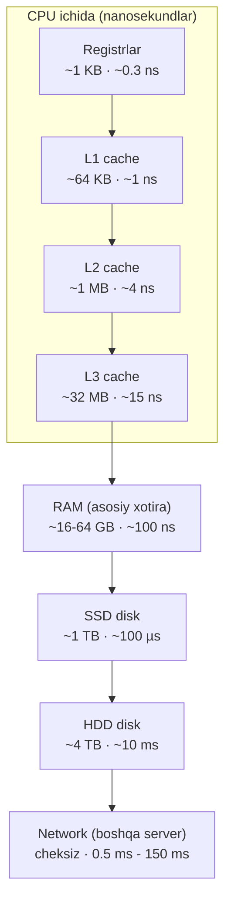
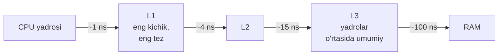
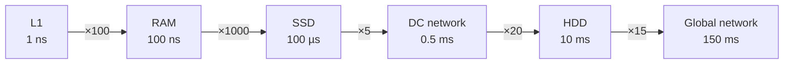
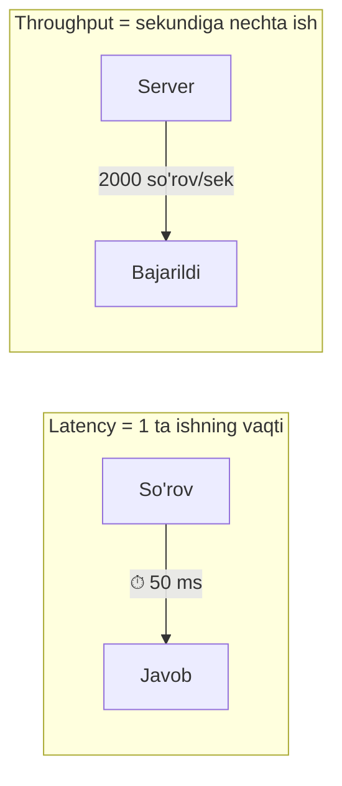

# 1-dars: Kompyuter anatomiyasi

> **Modul:** Tizimlar negizi · **Dars:** 1/5
> **Maqsad:** Kod yozganingda kompyuter ichida ASLIDA nima sodir bo'lishini ko'rish va "nega sekin/tez ishlaydi?" degan savolga javob bera olish.

---

## 1. Muammo: nega bir xil kod ba'zan tez, ba'zan sekin?

Tasavvur qil, sen ikkita funksiya yozding. Ikkalasi ham "10 million marta biror ish qiladi". Biri 10 millisekundda tugaydi, ikkinchisi 3 sekund davom etadi. Kod deyarli bir xil ko'rinadi. **Nega bunday?**

Chunki kompyuter — bu bitta "sehrli quti" emas. Uning ichida bir-biridan **million marta** tezlik farqi bo'lgan qismlar bor. Kodingning tezligi ko'pincha "qancha amal bajarding" emas, balki **"qaysi qismga qancha bordi-keldi qilding"** bilan belgilanadi.

System design'ni tushunish uchun avval bu qismlarni va ular orasidagi masofani (aslida — vaqtni) his qilishing kerak. Aks holda "cache qo'yaylik", "DB'ni replica qilaylik" degan qarorlar sen uchun sehr bo'lib qoladi.

---

## 2. Analogiya: kompyuter — bu oshxona

Kompyuterni **restoran oshxonasi** deb tasavvur qil:

| Oshxona | Kompyuter | Nima uchun |
| --- | --- | --- |
| **Oshpaz** | CPU | Amallarni bajaruvchi |
| **Oshpaz qo'lidagi ingredientlar** | Registrlar / L1 cache | Eng tez, lekin juda oz |
| **Ish stoli** | L2/L3 cache | Yaqin, tez yetib boradi |
| **Sovutgich (oshxonada)** | RAM | Kattaroq, biroz uzoqroq |
| **Yerto'ladagi ombor** | Disk (SSD/HDD) | Juda katta, lekin borib-kelish uzoq |
| **Boshqa shahardan yetkazib berish** | Network | Eng uzoq, boshqa mashinaga bog'liq |

> **Cheklov:** Oshpaz ombordan bitta ingredient olib kelguncha, qo'lidagi narsa bilan minglab amal bajarib ulguradi. Kompyuterda ham xuddi shunday — CPU disk'dan bitta narsa kutguncha, RAM'dagi ma'lumot bilan minglab amal qilib bo'ladi. **Farqi:** oshxonada masofa metrda, kompyuterda esa nanosekundlarda o'lchanadi.

---

## 3. Sodda ta'rif

**Kompyuter** — bu ma'lumotni saqlaydigan (xotira) va ma'lumot ustida amal bajaradigan (CPU) qurilmalar to'plami bo'lib, ular orasida ma'lumot ko'chganda **vaqt sarflanadi** — bu vaqt qismdan-qismga million marta farq qiladi.

Yangi atamalar:
- **CPU** (Central Processing Unit — markaziy protsessor) — amallarni bajaruvchi "miya".
- **Latency** (kechikish) — bitta ish boshlanib, javob kelguncha o'tgan vaqt.

---

## 4. Diagramma: xotira ierarxiyasi (piramida)

Yuqoriga chiqqan sari — **tezroq, lekin kichikroq va qimmatroq**. Pastga tushgan sari — **kattaroq, lekin sekinroq va arzonroq**.



E'tibor ber: **yuqoridan pastga** tushganda tezlik nafaqat pasayadi, balki **million baravar** pasayadi. Bu — system design'ning eng muhim intuitsiyasi.

---

## 5. CPU'ni yaqindan ko'ramiz

### Yadro (core) va clock

**Yadro (core)** — CPU ichidagi mustaqil "oshpaz". Zamonaviy protsessorda 4, 8, 16 yoki undan ko'p yadro bo'ladi. Har bir yadro bir vaqtda o'z ishini qiladi — shuning uchun **parallellik** (bir vaqtda bir necha ish) mumkin bo'ladi.

**Clock (soat chastotasi)** — yadro sekundiga necha marta "taktga" tushishini bildiradi. 3 GHz degani — sekundiga 3 **milliard** takt. Har taktda oddiy amal bajarilishi mumkin.

```
1 yadro, 3 GHz  →  sekundiga ~3 milliard oddiy amal
8 yadro, 3 GHz  →  nazariy jihatdan ~24 milliard amal (agar ish parallel bo'lsa)
```

> **Muhim:** Ko'proq yadro avtomatik tezlik bermaydi. Agar sening kodging ketma-ket (bir amal boshqasini kutadi) bo'lsa, 100 yadro ham yordam bermaydi. Shuning uchun Go'dagi **goroutine**'lar (yengil oqimlar) — ishni yadrolarga taqsimlash usuli sifatida shu qadar muhim.

### L1 / L2 / L3 cache — nega kerak?

CPU shunchalik tezki, RAM'ni kutib turishga majbur bo'lsa, vaqtining ko'pini **bekor** o'tkazadi. Shuning uchun CPU ichida kichik, juda tez xotiralar bor — **cache**.



**Ishlash prinsipi:** CPU biror ma'lumot so'raganda avval L1'ga qaraydi. Yo'q bo'lsa — L2, keyin L3, oxirida RAM. Har pastki qatlamga tushish **10 baravar** sekinroq. Agar ma'lumot cache'da topilsa — bu **cache hit** (topildi), topilmasa — **cache miss** (o'tkazib yuborildi).

**Notional machine (ichkarida nima bo'ladi):** ketma-ket joylashgan massiv (`[]int`) elementlarini aylanib chiqsang, CPU keyingi elementlarni oldindan cache'ga tortadi ("prefetch"). Shuning uchun massiv bo'ylab yurish — xotiraning tasodifiy joylariga sakrash (masalan, pointer'lar bilan bog'langan linked list)dan **ancha tezroq**. Bir xil miqdordagi amal, lekin cache'ni hurmat qilgani uchun tezroq.

---

## 6. RAM vs disk

| Xususiyat | RAM | SSD | HDD |
| --- | --- | --- | --- |
| To'liq nomi | Random Access Memory | Solid State Drive | Hard Disk Drive |
| Tezlik (latency) | ~100 ns | ~100 µs | ~10 ms |
| Elektr o'chsa | **Yo'qoladi** | Saqlanadi | Saqlanadi |
| Hajmi (odatda) | 16-64 GB | 0.5-2 TB | 2-16 TB |
| Narxi (GB uchun) | Qimmat | O'rta | Arzon |

Ikki muhim xulosa:
1. **RAM tez, lekin o'tkinchi (volatile).** Server o'chsa — RAM'dagi hamma narsa yo'qoladi. Shuning uchun muhim ma'lumot **diskka** yoziladi (persistence).
2. **Disk arzon, lekin sekin.** SSD RAM'dan ~1000 marta, HDD esa ~100000 marta sekinroq. Shu sabab **cache** (tez-tez kerak bo'ladigan ma'lumotni RAM'da saqlash) system design'da doim uchraydi.

**HDD nega bunchalik sekin?** HDD ichida aylanadigan disk va mexanik o'qish boshchasi bor — u fizik jihatdan kerakli joyga borishi kerak. SSD'da mexanik qism yo'q, shuning uchun ~100 baravar tez.

---

## 7. Network interfeysi

**Network interfeysi** (tarmoq kartasi) — kompyuterni boshqa kompyuterlarga (yoki internetga) bog'laydigan qism. Bu — kompyuterning "tashqi dunyoga eshigi".

Muhim tushuncha: **boshqa serverdan ma'lumot olish — diskdan ham sekin bo'lishi mumkin.** Chunki ma'lumot fizik simlar, routerlar orqali yuradi va yorug'lik tezligi ham chekli.

```
Bir data-center (DC) ichida server↔server:  ~0.5 ms
Bir shahar ichida:                          ~5 ms
Kontinentlararo (masalan, Toshkent↔AQSH):   ~150 ms
```

> **Intuitsiya:** Kontinentlararo bitta so'rov = RAM'dan ~1.5 million marta o'qish vaqti. Shuning uchun "foydalanuvchiga yaqin server qo'yamiz" (CDN, geo-replikatsiya) g'oyasi tug'iladi.

---

## 8. Latency numbers — har bir dasturchi bilishi kerak bo'lgan raqamlar

Bu jadval — system design intuitsiyasining **poydevori**. Aniq raqamlarni yodlash shart emas, **tartiblarni** (nechta nol) his qilish muhim.

| Amal | Vaqt | "Inson miqyosida" (agar 1 ns = 1 sekund bo'lsa) |
| --- | --- | --- |
| L1 cache'dan o'qish | ~1 ns | 1 sekund |
| L2 cache'dan o'qish | ~4 ns | 4 sekund |
| RAM'dan o'qish | ~100 ns | ~1.5 daqiqa |
| SSD'dan tasodifiy o'qish | ~100 µs | ~1 kun |
| Bir DC ichida network so'rov | ~0.5 ms | ~6 kun |
| HDD'dan tasodifiy o'qish | ~10 ms | ~4 oy |
| Kontinentlararo network so'rov | ~150 ms | ~5 yil |

> **1 ns = 1 sekund** deb tasavvur qilsang: RAM — bir daqiqa, disk — bir kun, boshqa kontinent — **besh yil**. Mana shu his sizni yaxshi arxitektor qiladi.

Diagramma bilan bir xil fikr (log shkala, har qadam ~10x):



### 🤔 O'ylab ko'r

Sening web-serveringda har so'rovda bitta ma'lumot kerak. Uni ikki joyda saqlashing mumkin: (a) o'sha serverning RAM'ida, (b) boshqa kontinentdagi DB'da. Foydalanuvchi 100 ta so'rov yuborsa, ikki holatda umumiy kechikish qancha farq qiladi?

<details>
<summary>💡 Javobni ko'rish</summary>

- (a) RAM: 100 × 100 ns = **10 000 ns = 0.01 ms**
- (b) Global network: 100 × 150 ms = **15 000 ms = 15 sekund**

Farq ~1.5 million baravar. Aynan shuning uchun tez-tez kerak bo'ladigan ma'lumot **foydalanuvchiga yaqin** va **tez xotirada** (cache) saqlanadi. Bu — keyingi modullardagi caching mavzusining ildizi.
</details>

---

## 9. Latency vs Throughput — chalkashtirmang

Bu ikkisi ko'pincha aralashtiriladi, lekin **butunlay boshqa narsa**.

- **Latency (kechikish)** — bitta ish qancha vaqtda tugaydi. O'lchov: sekund, ms, ns.
- **Throughput (o'tkazuvchanlik)** — vaqt birligida qancha ish tugaydi. O'lchov: so'rov/sekund (RPS), MB/sekund.

**Analogiya — magistral yo'l:**
- Latency = bitta mashina A nuqtadan B nuqtaga qancha vaqtda yetadi.
- Throughput = soatiga necha mashina B nuqtaga yetib boradi.

Yo'lni kengaytirsang (ko'proq qator qo'shsang), **throughput oshadi**, lekin bitta mashinaning yo'l vaqti (**latency**) o'zgarmaydi.



| | Latency | Throughput |
| --- | --- | --- |
| Nimani o'lchaydi | Bir ishning tezligi | Umumiy hajm/tezlik |
| O'lchov birligi | ms, ns | RPS, MB/s |
| Yaxshilash | Tezroq CPU, cache, yaqinroq server | Ko'proq server, parallellik |
| Foydalanuvchi hisi | "Sayt tez ochildi" | "Sayt ko'pchilikni ko'tara oldi" |

> **Oltin qoida:** Past latency = tez javob. Yuqori throughput = ko'p ishni ko'tarish. Ikkalasi doim birga oshmaydi — ba'zan biri uchun ikkinchisini qurbon qilasan (masalan, so'rovlarni to'plab ("batch") yuborish throughput'ni oshiradi, lekin har bir so'rovning latency'sini oshiradi).

---

## 10. CPU-bound vs IO-bound ish yuklari

Har qanday ish yuki (workload) ikki turdan biriga moyil bo'ladi. Bu — server resurslarini to'g'ri tanlashning kaliti.

### CPU-bound (protsessorga bog'liq)
Vaqtning ko'pi **hisob-kitobga** ketadi. CPU band, kutish yo'q.
- Misollar: video kodlash, rasmga filtr, shifrlash, katta sonlarni saralash, machine learning.
- Bottleneck (tor joy): **CPU quvvati**.
- Yechim: tezroq/ko'proq CPU yadrosi, ishni yadrolarga parallel taqsimlash.

### IO-bound (kirish-chiqishga bog'liq)
Vaqtning ko'pi **kutishga** ketadi — diskdan, tarmoqdan yoki DB'dan javob kelishini. CPU ko'p vaqt bo'sh turadi.
- Misollar: web-server (DB'dan javob kutadi), fayl yuklash, ko'p API chaqiruvi.
- Bottleneck: **kutish vaqti**, ulanishlar soni.
- Yechim: **concurrency** (bir vaqtda ko'p kutish), ya'ni bir kutayotgan paytda boshqasini boshlash.


### Nega bu system design uchun muhim?

Chunki **noto'g'ri diagnoz = noto'g'ri yechim**. IO-bound serverga ko'proq CPU qo'shsang — pul ketadi, foyda yo'q, chunki CPU baribir kutadi. Aksincha, CPU-bound ishga ko'proq concurrency qo'shsang — foyda yo'q, chunki CPU allaqachon 100% band.

**Go bu yerda porlaydi:** goroutine'lar IO-bound ishlar uchun ideal. Bitta goroutine tarmoqdan javob kutayotganda, Go scheduler o'sha yadroga boshqa goroutine'ni qo'yadi. Natijada bitta server minglab ulanishni bir vaqtda "kutib" tura oladi — CPU bekor turmaydi.

```go
// --- IO-bound ishni concurrency bilan tezlashtirish ---
// 3 ta URL'ni ketma-ket emas, bir vaqtda so'raymiz.
func fetchAll(urls []string) {
    var wg sync.WaitGroup
    for _, url := range urls {
        wg.Add(1)
        // Har bir so'rovni alohida goroutine'da yuboramiz.
        // Biri javob kutayotganda, boshqasi ish boshlaydi.
        go func(u string) {
            defer wg.Done()
            resp, _ := http.Get(u) // bu yerda goroutine "kutadi"
            resp.Body.Close()
        }(url)
    }
    wg.Wait() // hammasi tugashini kutamiz
}
// Natija: 3 ta so'rov ketma-ket 3×150ms=450ms o'rniga,
// parallel ~150ms da tugaydi — chunki kutishlar bir-birini bosadi.
```

### ⚠️ Ko'p uchraydigan xatolar

- **"Serverim sekin — CPU'ni oshiraman"** → Avval **profil qil**. Agar ish IO-bound bo'lsa (DB kutmoqda), CPU qo'shish behuda. To'g'risi: tor joyni o'lchab, keyin qaror qil.
- **"Ko'proq goroutine = tezroq"** → CPU-bound ishda yadrolar sonidan ko'p goroutine foyda bermaydi, faqat context switch (keyingi darsda) xarajatini oshiradi.
- **"Latency past bo'lsa throughput ham yuqori"** → Shart emas. Bitta so'rov tez bo'lsa ham, server bir vaqtda kam so'rovni ko'tarsa, throughput past bo'ladi.

---

## Xulosa

- Kompyuter — bir-biridan **million marta** tezlik farqi bo'lgan qismlar to'plami (CPU cache → RAM → disk → network).
- **CPU** yadrolari amal bajaradi; **cache** (L1/L2/L3) CPU'ni RAM'ni kutishdan qutqaradi.
- **RAM** tez, lekin o'tkinchi; **disk** (SSD/HDD) sekin, lekin doimiy; **network** eng uzoq va boshqa mashinaga bog'liq.
- **Latency numbers** — nol sonlarini his qilish system design intuitsiyasining poydevori.
- **Latency** = bir ishning tezligi; **Throughput** = vaqt birligidagi ish hajmi — bular boshqa narsa.
- **CPU-bound** ishga CPU quvvati, **IO-bound** ishga concurrency kerak — noto'g'ri diagnoz behuda xarajat.

## 🧠 Eslab qol

- Xotira ierarxiyasida har pastki qatlam ~10x sekinroq — cache'ni hurmat qilgan kod tez ishlaydi.
- 1 ns = 1 sekund desak: RAM — 1.5 daqiqa, disk — 1 kun, boshqa kontinent — 5 yil.
- Latency past ≠ throughput yuqori; ular ko'pincha bir-biriga qarama-qarshi.
- IO-bound ish CPU emas, concurrency talab qiladi — Go goroutine'lari aynan shu uchun.
- Optimallashdan oldin **o'lcha**: ish CPU-bound'mi yoki IO-bound'mi?

## ✅ O'z-o'zini tekshir (retrieval practice)

**1.** Nega ketma-ket joylashgan massiv bo'ylab yurish, xotira bo'ylab tasodifiy sakrashdan tezroq?

<details>
<summary>💡 Javob</summary>
Chunki CPU keyingi qo'shni elementlarni oldindan cache'ga tortadi (prefetch), shuning uchun ko'p "cache hit" bo'ladi. Tasodifiy sakrashda esa har safar "cache miss" bo'lib, sekin RAM'ga borishga to'g'ri keladi.
</details>

**2.** Serveringda CPU 20% band, lekin so'rovlar sekin javob beryapti. Muammo qayerda bo'lishi ehtimoli katta?

<details>
<summary>💡 Javob</summary>
Ish yuki IO-bound — server DB, disk yoki tashqi API'dan javob kutmoqda. CPU bo'sh, demak CPU qo'shish yordam bermaydi. Concurrency'ni oshirish yoki kutish manbasini (DB so'rovi, tarmoq) tezlashtirish kerak.
</details>

**3.** Yo'lni kengaytirish (ko'proq qator) throughput yoki latency'ning qaysi birini oshiradi?

<details>
<summary>💡 Javob</summary>
Throughput'ni (vaqt birligida ko'proq mashina o'tadi). Bitta mashinaning yo'l vaqti — latency — o'zgarmaydi.
</details>

**4.** RAM tez bo'lsa, nega hamma ma'lumotni faqat RAM'da saqlamaymiz?

<details>
<summary>💡 Javob</summary>
Chunki RAM o'tkinchi (volatile) — elektr o'chsa yo'qoladi — va qimmat hamda hajmi kichik. Doimiy saqlash uchun diskka yoziladi. Amalda tez-tez kerak bo'lgan qism RAM'da (cache), qolgani diskda saqlanadi.
</details>

## 🛠 Amaliyot

**1. Oson (javob berish/chizish).** Xotira ierarxiyasini (registr → L1 → L2 → L3 → RAM → SSD → HDD → network) yoddan chiz va har biriga taxminiy latency yoz. Keyin jadval bilan solishtir.

**2. O'rta (kamchilikni topish).** Bir jamoa shunday qaror qildi: "API'miz sekin ishlayapti, shuning uchun serverimizni 4 yadrolidan 32 yadroligiga o'zgartiramiz." Monitoring ko'rsatadi: CPU 15% band, har so'rov vaqtining 90%'i PostgreSQL javobini kutishga ketmoqda. Qarordagi xatoni ayt va to'g'ri yechim taklif qil.

<details>
<summary>💡 Hint</summary>
Ish CPU-bound'mi yoki IO-bound'mi? CPU 15% band — bu nimani anglatadi? 32 yadro qo'shsang, kutish vaqti o'zgaradimi? Yechim: DB'ni tezlashtirish (indeks, query optimizatsiya), connection pooling, cache qo'shish, yoki concurrency.
</details>

**3. Qiyin (kichik hisob).** Sening servering har foydalanuvchi so'rovida quyidagini qiladi: 5 ta ketma-ket DB so'rovi (har biri boshqa DC'da, 1 ms) va 1 million elementni RAM'da saralash (~5 ms). (a) Bitta so'rovning umumiy latency'sini hisobla. (b) Agar 5 ta DB so'rovini parallel qilsang, latency qanday o'zgaradi? (c) Qaysi qism bottleneck — CPU'mi, network'mi?

<details>
<summary>💡 Hint</summary>
(a) Ketma-ket: 5×1ms + 5ms = 10 ms. (b) Parallel DB so'rovlari: max(1ms) + 5ms ≈ 6 ms. (c) Endi vaqtning ko'pi (5 ms) saralashga — CPU'ga ketmoqda, demak CPU-bound qismga aylandi. Xulosa: bottleneck optimizatsiyadan keyin siljiydi.
</details>

## 🔁 Takrorlash

- Bu — **System Design kursining birinchi darsi**. Oldingi bog'liq dars yo'q; bu barcha keyingi darslarning poydevori.
- **Takrorlash jadvali** ("O'z-o'zini tekshir" savollariga qaytish):
  - Ertaga → latency numbers jadvalini yoddan tikla.
  - 3 kundan keyin → CPU-bound vs IO-bound farqini misol bilan tushuntir.
  - 1 haftadan keyin → butun xotira ierarxiyasini va latency raqamlarini qaytadan chiz.
- **Feynman testi:** Bir do'stingga kod so'zlarini ishlatmasdan, 3 jumlada tushuntir: "Nega bir DB boshqa kontinentda bo'lsa, sayt sekin ishlaydi?" Agar tushuntira olsang — mavzuni o'zlashtirding.
- **Keyingi dars:** `02-operatsion-tizim-va-abstraksiya.md` — bu qismlarni (CPU, RAM, disk, network) dasturlarga kim va qanday taqsimlab beradi? Javob: operatsion tizim.
