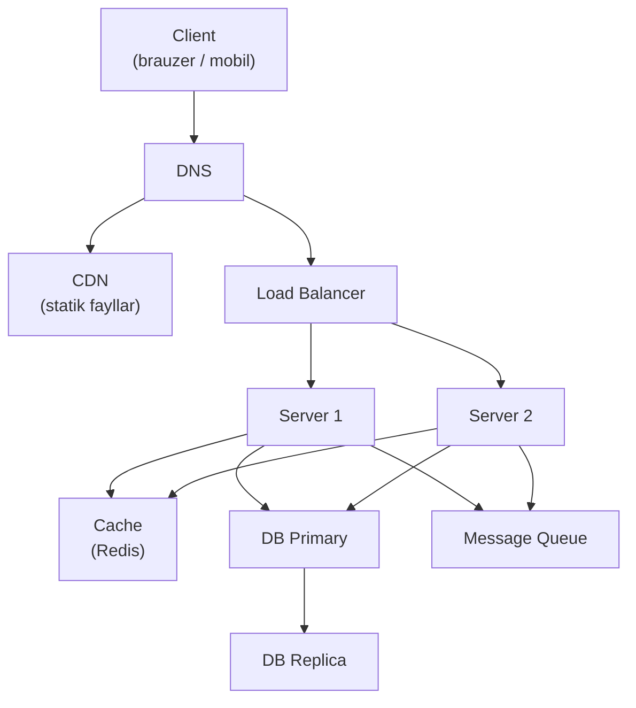
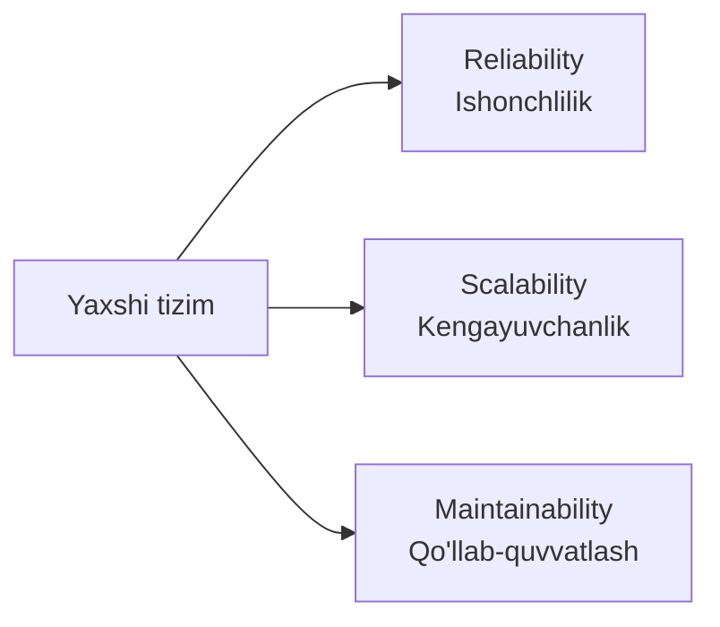
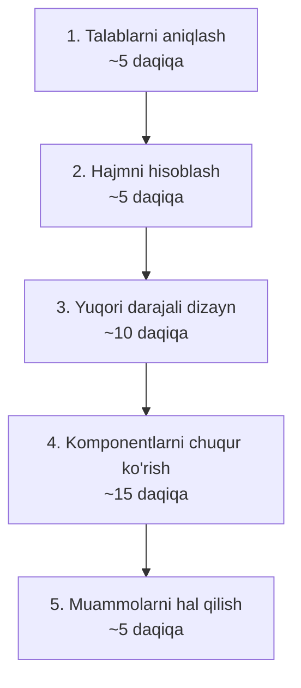

# Tizim dizayn nima?

> **Modul:** Kirish · **Dars:** 1 (kursning birinchi darsi)
> **Maqsad:** "Tizim dizayn" nima ekanini, uni yaxshi qiladigan 3 ustun (Reliability, Scalability, Maintainability), asosiy metrikalar (availability, latency, throughput, SLA/SLO) va suhbatda (interview) tizimni bosqichma-bosqich loyihalash tartibini tushunish.

---

## 1. Muammo — nega bu kerak?

Tasavvur qil: sen bitta serverda ishlaydigan onlayn xizmat yozding. Boshida kuniga 100 kishi kiradi — kod ishlaydi, hammasi joyida.

Keyin xizmat mashhur bo'ldi. Endi bir vaqtda **millionlab kishi** kiradi. Server nafas ololmay qoladi, ma'lumotlar bazasi tiqilib qoladi, sahifa ochilmaydi. Bitta server yiqilsa — butun xizmat o'ladi.

Bu yerda savol kodni qanday yozishda emas — **arxitekturada**: qanday qilib tizim millionlab foydalanuvchi kelganda ham tik turadi, tez ishlaydi va buzilmaydi? Mana shu savolga javob beradigan fan — **tizim dizayn (system design)**.

> **Diqqat:** Kod yozish "bitta uy qurish"ga o'xshaydi. Tizim dizayn esa — "million kishilik shaharning suv, yo'l va elektr tarmog'ini loyihalash". Boshqa ko'lam, boshqa qonunlar.

---

## 2. Analogiya — kichik oshxona va shahar restoran tarmog'i

Bitta uy oshxonasi 4 kishiga ovqat qiladi — oddiy. Endi shaharning yarmiga ovqat yetkazadigan tarmoq qurishing kerak.

| Uy oshxonasi | Shahar tarmog'i |
|--------------|-----------------|
| Bitta pech buzilsa — kutasan | Bitta filial yopilsa, boshqasi ishlaydi (**Reliability**) |
| 4 kishi | Talab oshsa filial qo'shasan (**Scalability**) |
| Retseptni o'zing bilasan | Har kim tushunadigan tartib kerak (**Maintainability**) |

Tizim dizayn — aynan shu "uydan shaharga o'tish" san'ati: bir server bilan boshlangan narsani minglab server ishlaydigan barqaror tarmoqqa aylantirish.

> **Analogiya chegarasi:** Restoran filiallari mustaqil ishlaydi. Serverlar esa ko'pincha bitta umumiy ma'lumotlar bazasiga bog'lanadi — shuning uchun "cheksiz o'sish" hamma qismni birga o'ylaganda ishlaydi. Buni keyingi modullarda ko'ramiz.

---

## 3. Sodda ta'rif

**Tizim dizayn (System Design)** — katta ko'lamdagi dasturiy tizimni arxitektura darajasida loyihalash: qaysi komponentlar bo'ladi, ular qanday bog'lanadi va yuklama oshganda tizim qanday tik turadi.

Bir jumlada: "Millionlab foydalanuvchiga ishonchli va tez xizmat qiladigan tizimni qanday quramiz?"

---

## 4. Diagramma — tipik tizimning asosiy komponentlari

Deyarli har bir katta tizim shu "skelet" ustiga quriladi. Hozircha nomlarni eslab qol — har birini alohida darsda ochamiz.



Client so'rov yuboradi, Load Balancer uni serverlarga bo'ladi, serverlar Cache va Database bilan ishlaydi, og'ir ishlar Message Queue orqali fon rejimida bajariladi. Butun kurs shu rasmni bosqichma-bosqich "jonlantirish".

---

## 5. Tizim dizaynning 3 ustuni

Har qanday yaxshi tizim uch narsaga tayanadi. Bularni doim yodda tut — deyarli har bir qaror shu uchtasining birortasini yaxshilash uchun qilinadi.



### 1. Reliability (ishonchlilik)
Tizim va'da qilgan ishini **to'g'ri** va **uzluksiz** bajaradi.
- Xatolik bo'lsa ham ishlashda davom etadi (fault tolerance).
- Ma'lumot yo'qolmaydi.
- Bitta qism yiqilsa, butun tizim to'xtamaydi.

### 2. Scalability (kengayuvchanlik)
Yuklama oshganda tizim ham **o'sa oladi** — sekinlashmaydi va yiqilmaydi.
- 10 barobar ko'p foydalanuvchi kelganda nima bo'ladi?
- Yukni bir necha server orasida bo'lish mumkinmi?

### 3. Maintainability (qo'llab-quvvatlash)
Tizimni **tushunish, o'zgartirish va tuzatish oson** bo'ladi.
- Yangi dasturchi kodni tez tushunadimi?
- Xatoni topish va tuzatish qulaymi (monitoring, logging)?

> **Oltin qoida:** Har bir dizayn qarori — bu shu 3 ustun orasidagi murosaga kelishuv (trade-off). "Eng yaxshi" dizayn yo'q; bor faqat "shu talablarga eng mos" dizayn.

---

## 6. Asosiy metrikalar — tizimni nima bilan o'lchaymiz?

"Yaxshi tizim" — mavhum gap. Muhandis uni **raqam** bilan o'lchaydi. To'rtta asosiy metrikani bilish shart.

| Metrika | Ma'nosi | Yaxshi qiymat |
|---------|---------|---------------|
| **Latency** | Bitta so'rovga javob vaqti | < 100 ms |
| **Throughput** | Vaqt birligidagi so'rovlar soni (RPS/QPS) | Yuqori |
| **Availability** | Tizim ishlab turgan vaqt foizi | 99.9% va undan yuqori |
| **Durability** | Yozilgan ma'lumot yo'qolmasligi | 99.999999% |

- **Latency (kechikish)** — "so'rov yuboribdan javob kelguncha necha millisekund?". Foydalanuvchi buni "tez/sekin" deb his qiladi.
- **Throughput (o'tkazuvchanlik)** — "tizim soniyasiga nechta so'rovni ko'tara oladi?" (RPS — requests per second, yoki QPS — queries per second).

> **Latency va throughput chalkashtirma:** Latency — *bitta* so'rov qancha kutadi. Throughput — *sekundiga nechta* so'rov o'tadi. Yo'l misolida: latency — bir mashina yo'lni necha daqiqada bosib o'tadi; throughput — soatiga nechta mashina o'tadi.

### Availability hisoblash — "to'qqizlar" (nines)

Availability foizini "necha to'qqiz" (how many nines) deb aytishadi. Har qo'shimcha to'qqiz — yiliga ancha kam to'xtash demak.

```text
Availability = Uptime / (Uptime + Downtime) x 100%

99%      (2 nine)  -> yiliga ~3.65 kun to'xtaydi
99.9%    (3 nine)  -> yiliga ~8.7 soat to'xtaydi
99.99%   (4 nine)  -> yiliga ~52 daqiqa to'xtaydi
99.999%  (5 nine)  -> yiliga ~5 daqiqa to'xtaydi
```

Diqqat: har qo'shimcha to'qqiz qo'shish **eksponensial qimmatlashadi** — 99.9% dan 99.99% ga o'tish uchun zaxira serverlar, avtomatik failover, ko'p region kerak bo'ladi.

### SLA, SLO, SLI — va'da, maqsad va o'lchov

Bu uch atama chalkashtiriladi. Farqini bir marta yodlab qo'y:

| Atama | To'liq nomi | Ma'nosi |
|-------|-------------|---------|
| **SLI** | Service Level **Indicator** | O'lchangan haqiqiy raqam ("bu oy availability 99.95% bo'ldi") |
| **SLO** | Service Level **Objective** | Ichki maqsad ("availability >= 99.9% bo'lsin") |
| **SLA** | Service Level **Agreement** | Mijoz bilan yuridik va'da + jarima ("99.9% dan pastga tushsa pul qaytaramiz") |

Eslab qol: **SLI** o'lchaydi, **SLO** maqsad qo'yadi, **SLA** shartnoma tuzadi. SLA odatda SLO'dan biroz pastroq qo'yiladi — jarima to'lamaslik uchun "havfsizlik yostig'i".

> 🤔 **O'ylab ko'r:** Mijozing bilan "99.99% availability" SLA imzolading. Ammo tiziming bitta serverga (bitta nusxa, zaxirasiz) tayanadi. Bu SLA'ni bajara olasanmi?

<details>
<summary>💡 Javobni ko'rish</summary>

Deyarli mumkin emas. 99.99% — yiliga atigi ~52 daqiqa to'xtash. Bitta serverli tizim yiliga bir marta qayta ishga tushirilsa yoki apparat buzilsa ham, bu 52 daqiqadan oson oshib ketadi — SLA buziladi, jarima to'laysan.

Bunday SLA uchun kamida ikkita server (zaxira), avtomatik failover va monitoring kerak. Ya'ni yuqori availability — bu bitta serverning sifati emas, balki **taqsimlangan zaxira** natijasi. Bu — nega SPOF (bitta yiqiladigan nuqta) xavfli ekanini ko'rsatadi.

</details>

---

## 7. Interview bosqichlari — tizimni qanday loyihalaymiz?

System design suhbatda (va real hayotda) tizim **tasodifan** emas, aniq tartibda quriladi. Beshta bosqichni yodda tut — bu sening "yo'l xaritang".



### 1-bosqich: Talablarni aniqlash
Hech narsa chizishdan oldin savol ber. Ikki turdagi talab bor:
- **Funksional** — tizim *nima qiladi*? (masalan: "link qisqartiradi va qayta yo'naltiradi").
- **Non-funksional** — *qanchalik* katta/tez/ishonchli? (foydalanuvchilar soni, latency, availability).

### 2-bosqich: Hajmni hisoblash (back-of-the-envelope)
Taxminiy raqamlar bilan "shkalani" his qil — bu keyingi qarorlarni belgilaydi.

```text
DAU (kunlik faol foydalanuvchi) = 10M
Har biri kuniga 10 so'rov
= 100M so'rov / kun
= 100M / 86400 soniya ≈ 1160 RPS (o'rtacha)
= 1160 x 2 ≈ 2320 RPS (peak, cho'qqi)
```

Bu raqam kelajakdagi hamma qarorni belgilaydi: nechta server, qancha cache, qanday DB.

### 3-bosqich: Yuqori darajali dizayn
Asosiy komponentlarni chiz: **Client -> Load Balancer -> Server -> Cache/DB**. Hozircha tafsilotsiz — umumiy oqim.

### 4-bosqich: Komponentlarni chuqur ko'rish
Endi tafsilotga tush: qaysi DB (SQL/NoSQL)? Cache strategiyasi qanday? API dizayni? Sharding kerakmi?

### 5-bosqich: Muammolarni hal qilish
Zaif joylarni top va yop:
- **Single Point of Failure (SPOF)** — bitta yiqilsa hammasi to'xtaydigan nuqta bormi?
- **Bottleneck (bo'g'iz)** — eng sekin bo'g'in qayerda?
- **Xavfsizlik** — auth, rate limiting, ma'lumot himoyasi.

> **Maslahat:** Suhbatda darrov chizma chizishga oshiqma. Avval **talab so'ra** — bu eng ko'p baholanadigan bosqich. Noto'g'ri masalani mukammal yechishdan ko'ra, to'g'ri masalani aniqlash muhimroq.

---

## Ko'p uchraydigan xatolar

⚠️ **Xato 1: "Availability foizini oshirish shunchaki yaxshi server olishdan iborat."**
Noto'g'ri — 99.99% availability bitta serverning sifati emas, **zaxira va failover** natijasi. To'g'risi: yuqori availability uchun bitta ham SPOF qolmasin.

⚠️ **Xato 2: "SLA, SLO, SLI — bir xil narsa."**
Noto'g'ri — SLI o'lchaydi, SLO ichki maqsad, SLA esa jarima bilan yuridik va'da. To'g'risi: SLA odatda SLO'dan pastroq qo'yiladi (havfsizlik yostig'i).

⚠️ **Xato 3: "Latency past bo'lsa, throughput ham avtomatik yuqori."**
Noto'g'ri — bular bog'liq, lekin bir xil emas. Bitta so'rov tez javob bersa ham (past latency), tizim soniyasiga oz so'rov ko'tarsa (past throughput) bo'ladi. To'g'risi: ikkalasini alohida o'lchash va optimallashtirish kerak.

---

## Xulosa

- **Tizim dizayn** — katta tizimni arxitektura darajasida loyihalash: "millionlab foydalanuvchini qanday ko'taramiz?".
- Yaxshi tizim 3 ustunga tayanadi: **Reliability** (ishonchlilik), **Scalability** (kengayuvchanlik), **Maintainability** (qo'llab-quvvatlash).
- Har bir qaror — shu 3 ustun orasidagi murosaga kelishuv (trade-off); "eng yaxshi" emas, "talabga mos" dizayn.
- Asosiy metrikalar: **Latency** (bitta so'rov vaqti), **Throughput** (RPS), **Availability** (ishlash foizi), **Durability**.
- **Availability** "to'qqizlar" bilan o'lchanadi; har qo'shimcha to'qqiz eksponensial qimmat.
- **SLI** o'lchaydi, **SLO** maqsad, **SLA** shartnoma.
- Interview 5 bosqich: talab -> hajm hisobi -> yuqori dizayn -> chuqur ko'rish -> muammolar.

## 🧠 Eslab qol

- Tizim dizayn = "uydan shaharga" o'tish san'ati.
- 3 ustun: Reliability, Scalability, Maintainability.
- Latency = bitta so'rov vaqti; Throughput = sekundiga so'rovlar soni.
- Har qo'shimcha "to'qqiz" eksponensial qimmatlashadi.
- Interview: avval TALAB so'ra, keyin chiz.

## ✅ O'z-o'zini tekshir (retrieval practice)

**1.** 99.9% va 99.99% availability orasidagi farq kichik ko'rinadi. Amalda bu farq nimani anglatadi va nega ikkinchisi ancha qimmat?

<details>
<summary>Javob</summary>

99.9% — yiliga ~8.7 soat to'xtash; 99.99% — atigi ~52 daqiqa. Ya'ni to'xtash vaqti ~10 barobar kamayadi. Bu qo'shimcha "to'qqiz" uchun zaxira serverlar, avtomatik failover, bir necha region va doimiy monitoring kerak — shuning uchun narx eksponensial oshadi.

</details>

**2.** Bir jamoa "bizning API juda tez, latency atigi 20 ms" deb maqtanadi, lekin tizim peak paytida yiqiladi. Qanday metrika e'tibordan chetda qolgan?

<details>
<summary>Javob</summary>

**Throughput.** Past latency — bitta so'rov tez javob berishini bildiradi, lekin tizim soniyasiga nechta so'rovni birga ko'tara olishini emas. Peak'da so'rovlar soni tizim throughput'idan oshib ketsa, navbat to'planadi va tizim yiqiladi. Latency va throughput alohida o'lchanishi kerak.

</details>

**3.** SLA'da "99.95%" yozilgan, ammo ichki SLO "99.99%" qilib qo'yilgan. Nega SLA SLO'dan pastroq?

<details>
<summary>Javob</summary>

Bu ataylab qilingan "havfsizlik yostig'i". Jamoa o'ziga 99.99% maqsad (SLO) qo'yadi, lekin mijozga bir oz pastroq (99.95%) va'da beradi (SLA). Shunda kichik nosozlikda ham SLA buzilmaydi va jarima to'lanmaydi. SLA — yuridik va'da, uni tavakkalsiz qo'yish kerak.

</details>

**4.** System design suhbatda nega darrov arxitektura chizmasliging kerak?

<details>
<summary>Javob</summary>

Chunki talab aniqlanmasdan chizilgan dizayn ko'pincha noto'g'ri masalani yechadi. Avval funksional (nima qiladi?) va non-funksional (qancha katta, qancha tez?) talablarni so'rash kerak — bu raqamlar (masalan RPS) keyingi barcha qarorni belgilaydi. Noto'g'ri masalani mukammal yechishdan ko'ra, to'g'ri masalani aniqlash qimmatliroq.

</details>

## 🛠 Amaliyot

**1. Oson (hisoblash):**
Bir ijtimoiy tarmoq DAU = 5M, har foydalanuvchi kuniga 20 so'rov yuboradi. O'rtacha RPS'ni va peak RPS'ni (x2) hisobla.

<details>
<summary>Hint</summary>

5M x 20 = 100M so'rov/kun. 100M / 86400 ≈ 1157 RPS o'rtacha. Peak ≈ 2314 RPS.

</details>

**2. O'rta (kamchilikni top):**
Jamoa shunday dizayn taqdim qildi: "1 ta kuchli server, unda ham API, ham DB, ham cache. Availability SLA — 99.99%. Monitoring yo'q." Bu dizaynda kamida 3 ta jiddiy muammo bor — top.

<details>
<summary>Hint</summary>

(1) Bitta server — SPOF, 99.99% SLA'ni ko'tara olmaydi. (2) API, DB, cache bir joyda — biri boshqasini bo'g'adi (bottleneck), alohida bo'lishi kerak. (3) Monitoring yo'q — SLI o'lchanmaydi, SLA buzilganini ham bilmaysan.

</details>

**3. Qiyin (kichik dizayn):**
"Link qisqartirgich" (URL shortener) uchun 5 bosqichli interview jarayonini o'zing bosib chiq: (a) 2 ta funksional va 2 ta non-funksional talab yoz; (b) DAU = 10M bo'lsa peak RPS'ni hisobla; (c) yuqori darajali komponentlarni chiz; (d) qaysi SPOF va bottleneck bo'lishi mumkinligini ayt.

<details>
<summary>Hint</summary>

(a) Funksional: link qisqartir, qisqa link'ni asl link'ga yo'naltir. Non-funksional: past latency (< 50 ms yo'naltirish), yuqori availability. (b) 10M x 10 / 86400 ≈ 1160 RPS, peak ≈ 2320. (c) Client -> LB -> Server -> Cache -> DB. (d) SPOF: bitta DB; bottleneck: har yo'naltirishda DB'ga borish (cache bilan yeng).

</details>

## 🔁 Takrorlash

**Bog'liq keyingi mavzular:**
- [Modul 1: Kompyuter anatomiyasi](../01-tizimlar-negizi/01-kompyuter-anatomiyasi.md) — latency/throughput aynan apparatdan kelib chiqadi.
- [Modul 2: Vertikal va gorizontal kengayish](../02-kengayish-usullari/01-vertikal-va-gorizontal-kengayish.md) — Scalability ustunini amalda ko'ramiz.
- [Modul 2: Load balancing](../02-kengayish-usullari/02-load-balancing.md) — SPOF'ni yo'qotish va availability oshirish.

**Takrorlash jadvali:**
- **Ertaga:** availability "to'qqizlar" jadvalini (99% ... 99.999%) yoddan yoz.
- **3 kundan keyin:** SLI/SLO/SLA farqini va 3 ustunni xotiradan tikla.
- **1 haftadan keyin:** interview 5 bosqichini va back-of-envelope hisobini qaytadan bajar.

**Feynman testi:** Do'stingga "tizim dizayn nima va nega bitta server yetmaydi?" ni kod va texnik atamalarsiz, faqat shahar restoran tarmog'i misolida 3 jumlada tushuntir.

**Keyingi dars:** [Kompyuter anatomiyasi](../01-tizimlar-negizi/01-kompyuter-anatomiyasi.md) — tizimni qurishdan oldin kompyuter ichida ASLIDA nima sodir bo'lishini ko'ramiz.
</content>
</invoke>
