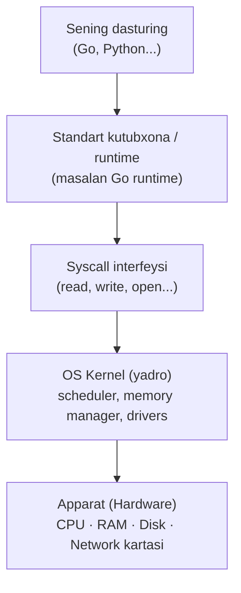
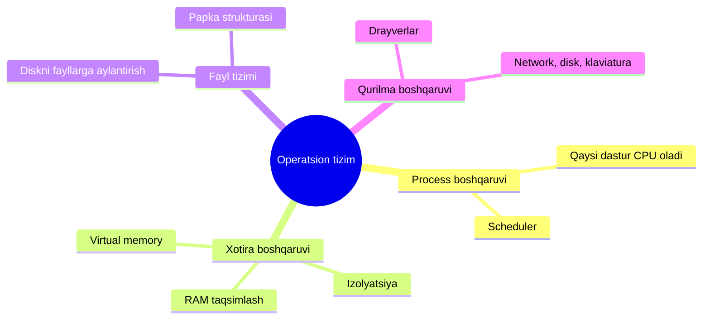
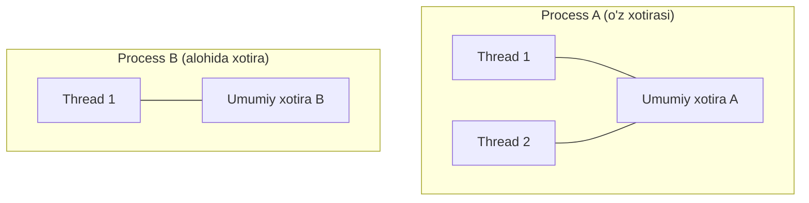
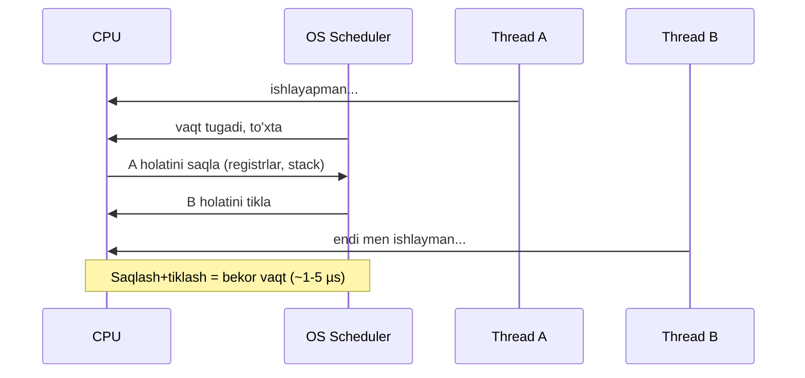
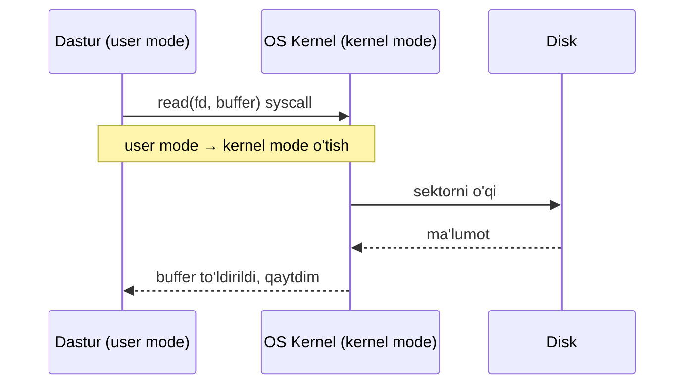
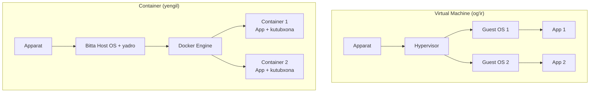

# 2-dars: Operatsion tizim va abstraksiya

> **Modul:** Tizimlar negizi · **Dars:** 2/5
> **Maqsad:** Kod yozganingda CPU, RAM, disk va tarmoqni kim boshqaradi? Bu qatlamlarni operatsion tizim qanday "yashiradi" va nega bulut texnologiyasi shu ustida qurilganini tushunish.

---

## 1. Muammo: sening dasturing yolg'iz emas

Oldingi darsda kompyuter qismlarini (CPU, RAM, disk, network) ko'rdik. Endi savol: **serverda o'nlab dastur bir vaqtda ishlaydi** — web-server, DB, log yig'uvchi, monitoring. Ular:

- Bitta CPU'ni qanday bo'lishadi?
- Bir-birining RAM'iga tegib buzib qo'ymaydimi?
- Har biri "menda butun kompyuter bor" deb o'ylab, qanday adashmaydi?

Agar har bir dastur CPU registrlari, disk sektorlari, tarmoq kartasi bilan **to'g'ridan-to'g'ri** gaplashishga majbur bo'lsa, hech kim dastur yoza olmasdi. Kod har xil apparatga (hardware) moslashib, mingta detalni o'ylashi kerak bo'lardi.

**Bu muammoni operatsion tizim (OS) hal qiladi.** U — apparat bilan dasturlaring o'rtasidagi vositachi.

---

## 2. Analogiya: OS — bu mehmonxona ma'muriyati

OS'ni **mehmonxona ma'muriyati** deb tasavvur qil:

| Mehmonxona | Operatsion tizim |
| --- | --- |
| Mehmonlar | Dasturlar (process'lar) |
| Xonalar | RAM bo'laklari |
| Ma'muriyat mehmonga xona ajratadi | OS dasturga xotira ajratadi |
| Mehmon boshqa xonaga kira olmaydi | Dastur boshqa dastur xotirasini ko'rmaydi (izolyatsiya) |
| Mehmon "restoranga buyurtma" beradi, o'zi oshxonaga kirmaydi | Dastur "faylni o'qi" deb **so'raydi**, o'zi diskka tegmaydi |

> **Cheklov:** Mehmonxonada mehmon o'zi ovqat pishirmoqchi bo'lsa, cheklangan — bu ma'lumot izolyatsiyasini beradi. Lekin farqi: OS'da dastur ba'zan "o'z xonasidan chiqmasdan" boshqa dastur bilan gaplashishi kerak (masalan, DB'ga so'rov) — buni ham OS boshqaradi (socket, pipe orqali).

Asosiy g'oya: **dastur apparatga to'g'ridan-to'g'ri tegmaydi, hamma narsani OS'dan so'raydi.**

---

## 3. Sodda ta'rif

**Operatsion tizim (OS)** — apparat resurslarini (CPU, RAM, disk, network) dasturlar o'rtasida taqsimlaydigan va apparatning murakkabligini oddiy **abstraksiyalar** (fayl, process, socket) ortiga yashiradigan asosiy dastur.

Yangi atamalar:
- **Abstraksiya (abstraction)** — murakkab narsani soddalashtirilgan interfeys ortiga yashirish (mashina rulini o'ylab ko'r: dvigatelni bilmasang ham hayday olasan).
- **Kernel (yadro)** — OS'ning eng markaziy, apparatni to'g'ridan boshqaradigan qismi.

---

## 4. Diagramma: abstraksiya qatlamlari

Kod yuqorida, apparat pastda. Har qatlam pastkisining murakkabligini yashiradi.



Har bir qatlam pastkisiga **"so'rov"** yuboradi, tafsilotlarni bilishi shart emas. Sen `os.Open("fayl.txt")` deysan — disk boshi qayerga borishini o'ylamaysan. Bu — abstraksiyaning kuchi.

---

## 5. OS aslida qanday vazifalarni bajaradi?

OS'ning to'rtta asosiy vazifasi bor. Har biri — bitta resursning "menejeri".



1. **Process boshqaruvi** — qaysi dastur qachon va qancha CPU oladi (scheduling — navbat tuzish).
2. **Xotira boshqaruvi** — har dasturga RAM ajratadi, biriniki boshqasiga tegmasligini kafolatlaydi.
3. **Fayl tizimi** — xom diskni "fayl va papka" abstraksiyasiga aylantiradi.
4. **Qurilma boshqaruvi** — drayverlar orqali apparat bilan gaplashadi.

---

## 6. Process vs Thread — dastur ichidagi ish

Bu — system design'ning eng muhim juftliklaridan biri.

### Process (jarayon)
**Process** — ishga tushirilgan dasturning bitta nusxasi, o'ziga tegishli **alohida xotira** (address space) bilan. Har bir process boshqasidan **izolyatsiya** qilingan — biriniki boshqasining xotirasini ko'rmaydi.

### Thread (oqim)
**Thread** — bitta process ichidagi mustaqil ish oqimi. Bir process'da bir necha thread bo'lishi mumkin va ular **xuddi shu xotirani baham ko'radi** (shared memory).



| Xususiyat | Process | Thread |
| --- | --- | --- |
| Xotira | Alohida (izolyatsiya) | Baham ko'riladi (process ichida) |
| Yaratish narxi | Qimmat (og'ir) | Arzon (yengil) |
| Xatolik ta'siri | Biri qulasa, boshqasi omon | Biri xotirani buzsa, hammasi qulaydi |
| Aloqa (communication) | Murakkab (IPC, socket) | Oson (umumiy xotira) |

**Notional machine:** Yangi process yaratganda OS unga butunlay yangi virtual address space beradi — bu qimmat amal. Thread esa mavjud address space ichida faqat yangi "ijro nuqtasi" (stack va registrlar) qo'shadi — arzon. Shuning uchun bir vaqtda ko'p ish qilmoqchi bo'lsang, ko'p process emas, ko'p thread (yoki Go'da — goroutine) ishlatish tejamli.

> **Go bog'lanishi:** Goroutine — thread emas! U OS thread'idan ham yengil (~2 KB stack). Go runtime ko'p goroutine'ni oz sondagi OS thread ustiga "joylashtiradi" (M:N scheduling). Shuning uchun Go'da millionlab goroutine ishlatish mumkin, lekin millionlab OS thread hech qachon.

---

## 7. Context switch — va uning narxi

**Context switch (kontekst almashinuvi)** — CPU bitta thread/process'dan boshqasiga o'tishi. OS avvalgisining holatini (registrlar, stack pointer) saqlaydi, keyingisiniki tiklaydi.

**Analogiya:** Sen kitob o'qiyapsan, telefon jiringladi. Kitobga xatcho'p qo'yasan (holatni saqlash), telefonga javob berasan, keyin xatcho'pdan davom etasan (holatni tiklash). Bu "xatcho'p qo'yish-topish" — bekor sarflangan vaqt.



**Narxi:** Bitta context switch ~1-5 µs. Kichik ko'rinadi, lekin agar sekundiga **minglab** marta almashsang (masalan, juda ko'p thread bir-birini bosib), CPU vaqtining katta qismi foydali ish emas, **almashishga** ketadi. Bu — "thread'lar juda ko'p bo'lsa sekinlashadi" muammosining ildizi.

### ⚠️ Ko'p uchraydigan xato
- **"Ko'proq thread yaratsam, tezroq bo'ladi"** → Yadrolardan ko'p thread yaratsang, ular navbatga tushib, context switch xarajati oshadi. Foyda o'rniga sekinlashish bo'lishi mumkin. To'g'risi: yadro soniga mos concurrency yoki Go'dagi kabi yengil goroutine'lar.

---

## 8. Syscall, file descriptor, socket — "hamma narsa fayl"

### Syscall (system call — tizim chaqiruvi)
Dastur apparatga tegolmaydi, demak diskdan o'qish, tarmoqqa yozish uchun **OS'dan so'raydi**. Bu so'rov — **syscall**.

**Analogiya:** Restoranda mehmon oshxonaga kirolmaydi — ofitsiantga aytadi. Ofitsiant = syscall. Sen `read()` deysan, OS diskka boradi va natijani qaytaradi.



**Muhim narx:** Har syscall'da CPU **user mode**'dan **kernel mode**'ga o'tadi (himoya darajasi o'zgaradi). Bu ham biroz vaqt oladi. Shuning uchun ko'p kichik syscall o'rniga, kamroq katta syscall qilish (buffering) tezroq.

### File descriptor (fayl deskriptori)
OS ochilgan har bir resursga (fayl, socket, pipe) bitta **butun son** — file descriptor (fd) beradi. Dasturing shu raqam orqali resurs bilan ishlaydi.

```
fd 0 → standart kirish  (stdin)
fd 1 → standart chiqish (stdout)
fd 2 → xatolik chiqishi (stderr)
fd 3, 4, 5... → sen ochgan fayllar, socketlar
```

### "Hamma narsa fayl" (Unix falsafasi)
Unix/Linux'da **hamma narsa fayl kabi ko'riladi** — oddiy fayl ham, tarmoq ulanishi (socket) ham, hattoki qurilmalar ham. Hammasiga bir xil `read()`, `write()`, `close()` amallari qo'llanadi.

**Nega bu kuchli?** Chunki bitta oddiy interfeys (`read/write`) bilan diskdan ham, tarmoqdan ham, klaviaturadan ham ma'lumot olasan. Kod soddalashadi.

**Socket** — ikki dastur (ko'pincha turli mashinada) o'rtasidagi tarmoq ulanishining fayl ko'rinishi. Sen socket'dan `read()` qilsang — tarmoqdan ma'lumot olasan.

```go
// --- "Hamma narsa fayl": tarmoq ulanishi ham read/write bilan ishlaydi ---
// 1-qadam: TCP portda tinglaymiz (bu ham fd oladi)
ln, _ := net.Listen("tcp", ":8080")
// 2-qadam: ulanishni qabul qilamiz — conn aslida socket (fayl kabi)
conn, _ := ln.Accept()
// 3-qadam: socketga xuddi faylga yozgandek yozamiz
conn.Write([]byte("Salom!\n"))
// 4-qadam: xuddi fayldan o'qigandek o'qiymiz
buf := make([]byte, 1024)
n, _ := conn.Read(buf)
conn.Close() // fayl kabi yopamiz
// Notional machine: conn ortida OS'da fd (masalan 4) turadi;
// Read/Write aslida shu fd ustidan syscall qiladi.
```

### 🤔 O'ylab ko'r
Serveringda "too many open files" xatosi chiqdi. File descriptor tushunchasi asosida bu nima degani va nega sodir bo'lishi mumkin?

<details>
<summary>💡 Javobni ko'rish</summary>

Har OS process'i ochishi mumkin bo'lgan fd soni cheklangan (masalan, 1024 yoki 65536). Har ochilgan fayl/socket bitta fd oladi. Agar sen ulanishlarni yoki fayllarni ochib, `Close()` qilmasang, fd'lar "sizib" ketadi (leak) va limit tugaydi. Yechim: har doim `defer conn.Close()`, limitni oshirish, connection pool ishlatish.
</details>

---

## 9. Virtualizatsiya va container — bulutning poydevori

Endi eng katta abstraksiyaga o'tamiz: **butun kompyuterni ham abstraksiya qilish mumkin.**

### Muammo
Bitta kuchli fizik server bor. Unda 10 xil mijozning dasturi ishlashi kerak, lekin ular bir-birini ko'rmasligi, ta'sir qilmasligi kerak. Har biriga alohida fizik server olish — qimmat va isrof.

### Yechim 1: Virtual Machine (VM)
**Virtualizatsiya** — bitta fizik mashina ustida bir necha "virtual kompyuter" (VM) yaratish. Har VM'ning o'z OS'i bor. Ularni **hypervisor** boshqaradi.

### Yechim 2: Container (Docker)
**Container** — VM'dan yengilroq izolyatsiya: dastur va uning barcha kutubxonalari bir "quti"ga solinadi, lekin ular **host OS'ning yadrosini baham ko'radi** (har biriga alohida OS shart emas).



| | Virtual Machine | Container |
| --- | --- | --- |
| Izolyatsiya | To'liq (alohida OS) | Process darajasida (yadro umumiy) |
| Og'irligi | GB'lar, sekundlar-daqiqalarda ishga tushadi | MB'lar, sekundlarda ishga tushadi |
| Ishga tushish tezligi | Sekin | Juda tez |
| Zichlik (bitta serverda soni) | O'nlab | Yuzlab-minglab |

### Nega bulut shu ustida qurilgan?
Bulut provayderi (AWS, GCP) — juda ko'p fizik server. Ular **virtualizatsiya + container** orqali:
- Bitta serverda ko'p mijozni izolyatsiya bilan joylashtiradi (zichlik = tejamkorlik).
- Container tez ishga tushgani uchun **avtomatik masshtablash** (traffic oshsa, sekundlarda yangi container ochish) mumkin bo'ladi.
- "Menda ishladi, serverda ishlamadi" muammosi yo'qoladi — container hamma joyda bir xil.

**Go bog'lanishi:** Go dasturi bitta statik faylga kompilyatsiya bo'ladi (keyingi darsda). Shuning uchun Go container'lari juda kichik va tez — backend uchun ideal.

### ⚠️ Ko'p uchraydigan xato
- **"Container = VM"** → Yo'q. Container'da alohida OS yo'q, u host yadrosini baham ko'radi. Shuning uchun yengil, lekin izolyatsiyasi VM'chalik kuchli emas.

---

## Xulosa

- **OS** apparat murakkabligini yashiradi va resurslarni dasturlar orasida taqsimlaydi — u dasturing bilan hardware o'rtasidagi vositachi.
- **Abstraksiya qatlamlari:** dastur → runtime → syscall → kernel → apparat. Har qatlam pastkisini yashiradi.
- **Process** — alohida xotirali, izolyatsiyalangan; **Thread** — process ichida xotirani baham ko'radigan yengil oqim.
- **Context switch** bekor vaqt sarflaydi — juda ko'p thread aksincha sekinlashtiradi.
- **Syscall** orqali dastur OS'dan xizmat so'raydi; **fd** ochilgan resurs raqami; **socket** — tarmoq ulanishining fayl ko'rinishi ("hamma narsa fayl").
- **VM** to'liq izolyatsiya (alohida OS), **container** yengil izolyatsiya (umumiy yadro) — bulut aynan shu texnologiyalar ustiga qurilgan.

## 🧠 Eslab qol

- OS'ning ishi: resurslarni taqsimlash + apparatni abstraksiya ortiga yashirish.
- Process xotirasi alohida, thread'lar xotirani baham ko'radi — shuning uchun thread arzon, lekin xavfliroq.
- Context switch bekor vaqt — juda ko'p thread foyda emas, zarar.
- "Hamma narsa fayl": fayl, socket, qurilma — bari read/write/close bilan.
- Container = umumiy yadro + izolyatsiya = yengil, tez, bulutning asosi.

## ✅ O'z-o'zini tekshir (retrieval practice)

**1.** Nega ikkita thread ma'lumot almashishi ikkita process'ga qaraganda osonroq, lekin xavfliroq?

<details>
<summary>💡 Javob</summary>
Thread'lar bir process ichida umumiy xotirani baham ko'radi — shuning uchun ma'lumot almashish uchun shunchaki o'sha xotiraga yozadi (oson). Lekin ayni sabab xavfli: ikki thread bir vaqtda o'sha joyga yozsa, ma'lumot buziladi (race condition). Process'lar izolyatsiyalangan — almashish murakkab, lekin xavfsizroq.
</details>

**2.** Nima uchun 8 yadroli serverda 5000 ta thread yaratish dasturni tezlashtirmasligi, hattoki sekinlashtirishi mumkin?

<details>
<summary>💡 Javob</summary>
8 yadro bir vaqtda faqat 8 thread'ni haqiqatan bajaradi. 5000 thread navbatga tushadi va OS ular orasida doim context switch qiladi. Bu almashishlar CPU vaqtini foydali ish o'rniga "holat saqlash/tiklash"ga sarflaydi — natijada sekinlashadi.
</details>

**3.** "too many open files" xatosini file descriptor tushunchasi bilan tushuntir.

<details>
<summary>💡 Javob</summary>
Har process cheklangan sonda fd ocha oladi. Har ochilgan fayl/socket fd oladi. Agar resurslar Close() qilinmasa, fd'lar sizib limitga yetadi. Yechim: doim yopish (defer Close), pool ishlatish, limitni oshirish.
</details>

**4.** Container VM'dan nimasi bilan farq qiladi va nega bulut container'ni afzal ko'radi?

<details>
<summary>💡 Javob</summary>
VM'da har birida alohida OS bor (og'ir, sekin ishga tushadi). Container esa host OS yadrosini baham ko'radi (yengil, sekundlarda ishga tushadi). Bulut container'ni afzal ko'radi: zichlik yuqori (bir serverda ko'p), tez masshtablash mumkin, "hamma joyda bir xil ishlaydi".
</details>

## 🛠 Amaliyot

**1. Oson (chizish/javob).** Abstraksiya qatlamlarini (dastur → runtime → syscall → kernel → apparat) yoddan chiz. Keyin `os.Open("a.txt")` chaqiruvi shu qatlamlardan qanday o'tishini bitta jumla bilan tasvirla.

**2. O'rta (kamchilikni topish).** Bir jamoa har HTTP so'rovda yangi OS process ochib, ish tugagach yopadi (traffic ~2000 RPS). Server juda sekin va CPU'ning 60%'i "system" vaqtiga ketmoqda. Muammoni process/thread/context switch tushunchalari bilan tushuntir va yaxshiroq yondashuv taklif qil.

<details>
<summary>💡 Hint</summary>
Process yaratish qimmat (alohida address space). 2000 RPS'da sekundiga 2000 process ochilib yopilyapti — bu juda ko'p yaratish + context switch. "system" vaqti — OS ishiga ketgan vaqt. Yechim: process pool / thread pool yoki Go'da goroutine — resursni qayta ishlatish, har so'rovga yangi process emas.
</details>

**3. Qiyin (kichik dizayn/kod).** Go'da shunday TCP echo-server yoz: portni tingla, har ulangan mijozga alohida goroutine ajrat, mijoz yuborgan matnni qaytar. Har ulanishni `defer conn.Close()` bilan yop. Keyin tushuntir: nega bu yerda goroutine, thread emas — va bu darsning qaysi tushunchasiga bog'lanadi.

<details>
<summary>💡 Hint</summary>
`net.Listen` → tsiklda `Accept` → `go handle(conn)`. handle ichida `defer conn.Close()`, `bufio` yoki `io.Copy(conn, conn)` bilan echo. Goroutine ishlatish sababi: har ulanish IO-bound (mijozdan ma'lumot kutadi), goroutine yengil — minglab ulanishni oz thread ustida ko'taradi, context switch xarajati minimal. Bu 1-darsdagi IO-bound + shu darsdagi thread/goroutine farqiga bog'lanadi.
</details>

## 🔁 Takrorlash

- **Bog'liq oldingi dars:** `01-kompyuter-anatomiyasi.md` — u yerdagi CPU/RAM/disk/network resurslarini aynan shu darsdagi OS taqsimlaydi. IO-bound tushunchasi bu yerda thread/goroutine bilan bog'landi.
- **Takrorlash jadvali:**
  - Ertaga → process vs thread jadvalini yoddan tikla.
  - 3 kundan keyin → context switch nima va nega qimmat — misol bilan ayt.
  - 1 haftadan keyin → VM vs container farqini va "nega bulut container'da" savolini javob ber.
- **Feynman testi:** Do'stingga 3 jumlada tushuntir: "Nima uchun bitta serverda 20 ta dastur bir-birini buzmasdan ishlay oladi?" (Javobda: OS izolyatsiyasi, alohida xotira, syscall vositachiligi).
- **Keyingi dars:** `03-dastur-dasturlash-tili-va-dasturchi.md` — sen yozgan kod (matn) qanday qilib CPU tushunadigan mashina kodiga aylanadi? Compiler, interpreter, runtime va Go'ning o'rni.
