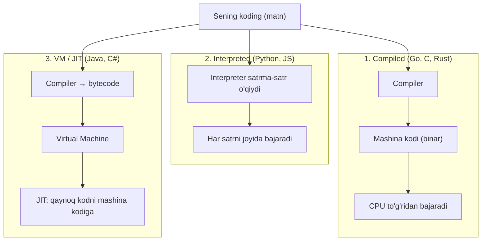
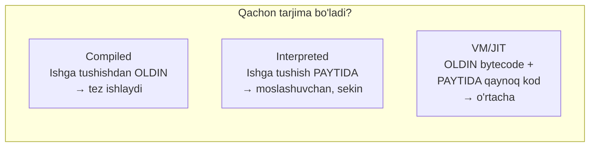
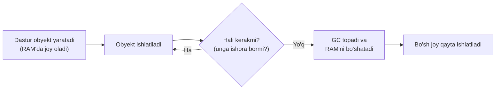
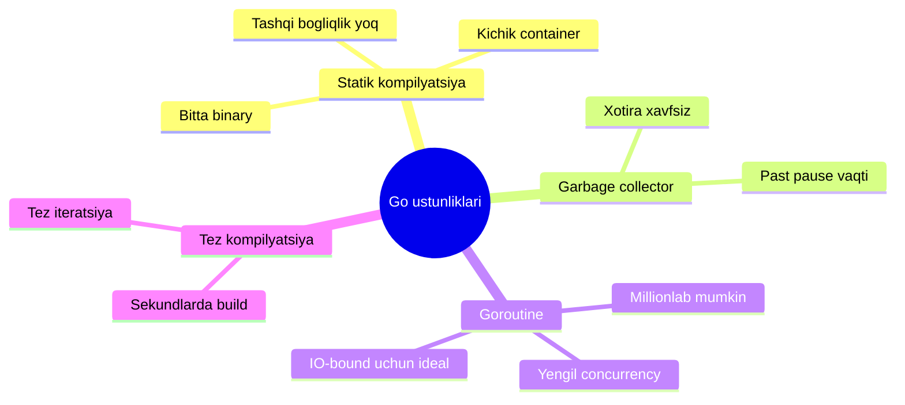
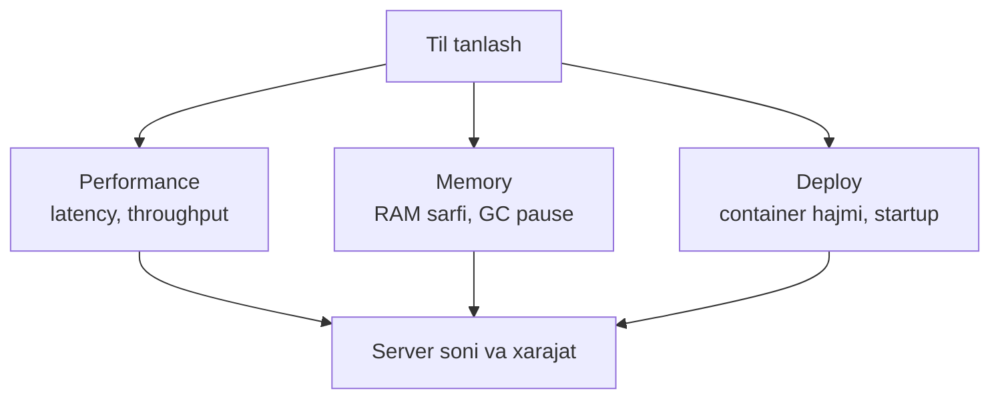

# 3-dars: Dastur, dasturlash tili va dasturchi

> **Modul:** Tizimlar negizi · **Dars:** 3/5
> **Maqsad:** Sen yozgan matn (kod) qanday qilib CPU bajaradigan mashina kodiga aylanadi? Compiler, interpreter, runtime va garbage collector nima — va nega Go backend uchun shunchalik qulay.

---

## 1. Muammo: CPU sening kodingni tushunmaydi

Sen shunday yozasan:

```go
fmt.Println("Salom")
```

Lekin CPU bu matnni **umuman tushunmaydi**. CPU faqat bitta narsani biladi — **mashina kodi** (0 va 1 lardan iborat, aniq protsessor arxitekturasiga bog'liq buyruqlar). Sening "Salom" so'zing va CPU tushunadigan narsa orasida katta **jarlik** bor.

Savol: bu jarlikni kim ko'prik qiladi? Va **qachon** — dasturni ishga tushirishdan oldinmi yoki paytidami?

Bu savolga javob — dasturlash tillari orasidagi eng katta arxitektura farqini tushuntiradi. Va bu farq to'g'ridan-to'g'ri **system design** qarorlariga (tezlik, xotira, deploy) ta'sir qiladi.

---

## 2. Analogiya: tarjima usullari

Sen o'zbekcha kitob yozding, uni yaponiyalik o'quvchiga yetkazmoqchisan. Uch xil usul bor:

| Usul | Dasturlashda |
| --- | --- |
| **Butun kitobni oldindan tarjima qilib, yaponcha nusxa chop etish** | Compiler (kompilyator) |
| **Yoningda tarjimon: har jumlani o'qib, joyida tarjima qilish** | Interpreter (interpretator) |
| **Kitobni "universal tilga" tarjima qilib, har mamlakatda mahalliy tarjimon ishlatish** | VM / bytecode (Java, .NET) |

> **Cheklov:** Analogiya kitob uchun yaxshi, lekin farqi shundaki — kod bir marta emas, million marta "o'qiladi" (bajariladi). Shuning uchun oldindan tarjima (compile) qilingan kod har safar tarjima kutmaydi — tez ishlaydi. Interpreter har safar tarjima qiladi — moslashuvchan, lekin sekinroq.

---

## 3. Sodda ta'rif

**Compiler** — butun kodni ishga tushirishdan **oldin** mashina kodiga aylantiruvchi dastur. **Interpreter** — kodni ishga tushirish **paytida**, satrma-satr o'qib bajaruvchi dastur.

Yangi atamalar:
- **Mashina kodi (machine code)** — CPU to'g'ridan bajaradigan binar buyruqlar.
- **Bytecode** — CPU emas, "virtual mashina" tushunadigan oraliq kod.

---

## 4. Diagramma: kod → bajarilish uch yo'li



---

## 5. Compiler vs Interpreter vs VM/JIT — chuqurroq

### Compiler (Go, C, Rust)
Butun kod **oldindan** mashina kodiga aylantiriladi. Natija — bitta ishga tushadigan fayl (binary).

- **Plus:** juda tez ishlaydi (tarjima allaqachon bo'lgan), oldindan xatolar (type xatosi) topiladi.
- **Minus:** har platforma uchun alohida kompilyatsiya kerak, o'zgartirsang qayta kompilyatsiya.

### Interpreter (Python, JavaScript, Ruby)
Kod **ishga tushirish paytida** satrma-satr o'qiladi va bajariladi. Alohida binary yo'q — manba kod + interpreter kerak.

- **Plus:** tez yozib-sinash (o'zgartirdim → darrov ishlatdim), platformaga bog'liq emas.
- **Minus:** sekinroq (har safar tarjima), xatolar faqat ishga tushganda chiqadi.

### VM / JIT (Java, C#)
Ikkalasining o'rtasi. Kod avval **bytecode**'ga kompilyatsiya qilinadi, keyin **virtual mashina** (VM) uni bajaradi. **JIT** (Just-In-Time) — VM tez-tez ishlaydigan "qaynoq" kodni ishlash paytida mashina kodiga aylantirib, tezlashtiradi.

- **Plus:** "bir marta yoz, hamma joyda ishlat" (bytecode universal), JIT bilan tez.
- **Minus:** VM ishga tushishi sekin (startup), ko'proq xotira.



| | Compiled (Go) | Interpreted (Python) | VM/JIT (Java) |
| --- | --- | --- | --- |
| Tarjima qachon | Ishdan oldin | Ish paytida | Bytecode oldin + JIT paytida |
| Tezlik | Yuqori | Past | O'rta-yuqori |
| Startup vaqti | Juda tez | Tez | Sekin (VM yuklanadi) |
| Deploy | Bitta binary | Kod + interpreter | Bytecode + VM |
| Xatolar qachon | Kompilyatsiyada | Ish paytida | Kompilyatsiyada + qisman ish paytida |

---

## 6. Runtime va Garbage Collector

### Runtime nima?
**Runtime** — dasturing ishlayotgan paytda unga yordam beradigan "yordamchi kod" to'plami. U dasturchi ko'rmaydigan ishlarni qiladi: xotira ajratish, goroutine'larni boshqarish, xatolarni ushlash.

**Analogiya:** Sen spektakl o'ynayapsan (dasturing) — sahna ortida yorug'lik, ovoz, dekoratsiyani boshqaradigan jamoa bor (runtime). Tomoshabin ularni ko'rmaydi, lekin ularsiz spektakl bo'lmaydi.

### Garbage Collector (GC)
**Garbage collector (axlat yig'uvchi)** — endi ishlatilmayotgan xotirani avtomatik topib, bo'shatib turadigan runtime qismi.

**Muammo:** Dastur RAM'da xotira ajratadi (masalan, yangi obyekt). Ishlatib bo'lgach, uni bo'shatish kerak — aks holda RAM to'lib qoladi (**memory leak**).

- **Qo'lda boshqarish (C, C++):** dasturchi o'zi bo'shatadi (`free`). Tez, lekin xato qilsa — leak yoki crash.
- **Avtomatik (Go, Java, Python):** GC o'zi topib bo'shatadi. Xavfsiz, lekin GC ishlash uchun biroz CPU va vaqt oladi.



**Notional machine:** GC vaqti-vaqti bilan ishga tushib, qaysi obyektlarga hali "ishora" (reference) borligini kuzatadi. Hech kim ishlatmayotgan obyektlarni "axlat" deb belgilab, RAM'ni qaytaradi. Bu paytda dastur biroz to'xtashi mumkin — buni **GC pause** deyiladi. System design'da past latency kerak bo'lsa, GC pause muhim omil.

### ⚠️ Ko'p uchraydigan xato
- **"GC bor, demak memory leak bo'lmaydi"** → Bo'ladi! Agar obyektga hali ishora tursa (masalan, uni global map'ga qo'yib, o'chirmasang), GC uni "kerak" deb hisoblaydi va bo'shatmaydi. Xotira asta-sekin to'ladi.

---

## 7. Go'ning o'rni — nega backend uchun qulay

Go bir necha yechimni birlashtirgani uchun backend'da mashhur. Uni boshqa tillar bilan solishtiraylik.

### Go = compiled + GC + yengil concurrency



### 1. Statik kompilyatsiya → bitta binary
Go dasturi **hamma narsani o'z ichiga olgan bitta faylga** kompilyatsiya bo'ladi (statik). Tashqi kutubxona, VM, interpreter kerak emas.

**System design ta'siri:** Docker container'ga faqat shu bitta faylni qo'yasan — natija ~10-20 MB. Python'da esa interpreter + kutubxonalar (~yuzlab MB). Kichik container → tez deploy, tez masshtablash, arzon.

### 2. GC bor, lekin past pause
Go GC'si past latency uchun optimallashtirilgan — pause odatda millisekunddan kam. Bu — real-time'ga yaqin backend'lar uchun muhim.

### 3. Goroutine → IO-bound ish uchun ideal
Oldingi darslarni eslaysanmi? Backend ko'pincha **IO-bound** (DB, tarmoq kutadi). Goroutine yengil (~2 KB), millionlab ishlashi mumkin. Go runtime ularni oz OS thread ustiga joylashtiradi — context switch xarajati minimal.

```go
// --- Go: statik binary + goroutine bilan minglab ulanishni ko'tarish ---
// 1-qadam: har HTTP so'rovi o'z goroutine'ida ishlaydi (Go o'zi qiladi)
http.HandleFunc("/", func(w http.ResponseWriter, r *http.Request) {
    // 2-qadam: bu yerda DB kutish bo'lsa ham (IO-bound),
    // goroutine yengil — boshqa so'rovlar bloklanmaydi
    data := queryDatabase(r.URL.Query().Get("id")) // kutish...
    w.Write(data)
})
// 3-qadam: bitta binary sifatida ishga tushadi, VM kerak emas
http.ListenAndServe(":8080", nil)
// Notional machine: minglab so'rov = minglab goroutine,
// lekin ular ~8 OS thread ustida — CPU bekor turmaydi, xotira kam.
```

### 🤔 O'ylab ko'r
Bir xil "hello world" web-serverni Go va Python'da yozib, Docker container'ga solsak: qaysi container kichikroq va nega? Startup vaqti-chi?

<details>
<summary>💡 Javobni ko'rish</summary>

Go container kichikroq (~10-20 MB), chunki faqat bitta statik binary bor — interpreter va kutubxonalar kerak emas (hattoki `scratch` yoki `distroless` bazadan foydalanish mumkin). Python'da interpreter + barcha paketlar kerak (~100+ MB). Startup: Go binary darrov ishga tushadi; Python interpreter yuklanishi kerak (sekinroq). Kichik + tez startup = tez masshtablash va arzon bulut xarajati.
</details>

---

## 8. Til tanlash system design'ga qanday ta'sir qiladi

Til tanlash "did-mazasi" emas — u arxitekturaning uch omiliga to'g'ridan ta'sir qiladi.



| Omil | Tez til (Go, Rust) | Sekin til (Python, Ruby) |
| --- | --- | --- |
| CPU-bound ish | Yaxshi ko'taradi | Sekin, ko'p server kerak |
| RAM sarfi | Kam | Ko'p |
| Deploy hajmi | Kichik binary | Katta (interpreter + paket) |
| Startup | Millisekundlar | Sekundlar |
| Yozish tezligi | O'rta | Juda tez |

**Amaliy qoida:**
- **CPU-bog'liq, yuqori yuk, past latency** kerak bo'lsa → Go, Rust, C++ (masalan, payment tizimi, real-time servis).
- **Tez prototip, ML, skript, murakkab biznes logika** → Python (masalan, data pipeline, admin panel).
- Ko'p kompaniya **aralash** ishlatadi: og'ir yuk qismini Go/Rust'da, boshqasini Python'da (polyglot arxitektura).

> **Oltin qoida:** "Eng yaxshi til" yo'q — vazifaga mos til bor. System design'da til tanlash performance, memory va deploy bilan bevosita bog'lanadi, bu esa oxir-oqibat **server soni va xarajatga** aylanadi.

### ⚠️ Ko'p uchraydigan xato
- **"Go tez, demak hamma narsani Go'da yozamiz"** → Har doim emas. Agar ish CPU-bound bo'lmasa va tez yozish muhim bo'lsa, Python samaraliroq bo'lishi mumkin. Til — vosita, muammoga qarab tanlanadi.

---

## Xulosa

- CPU faqat **mashina kodini** tushunadi; sening matning uni tushunadigan holatga keltirilishi kerak.
- **Compiler** oldindan (tez ishlaydi), **interpreter** ish paytida (moslashuvchan), **VM/JIT** ikkalasining o'rtasi.
- **Runtime** — dasturga ish paytida yordam beruvchi yashirin kod; **GC** ishlatilmagan xotirani avtomatik bo'shatadi.
- **GC pause** past latency uchun muhim omil; GC bor bo'lsa ham ishora qolgan obyekt leak bo'lishi mumkin.
- **Go** = compiled + past-pause GC + yengil goroutine → kichik binary, tez startup, IO-bound uchun ideal.
- **Til tanlash** performance, memory va deploy'ga, ular esa server soni va xarajatga bevosita ta'sir qiladi.

## 🧠 Eslab qol

- Compiler ishdan oldin, interpreter ish paytida tarjima qiladi.
- Runtime — sahna ortidagi jamoa; GC — avtomatik axlat yig'uvchi.
- GC bo'lsa ham, ishora qolgan obyekt bo'shatilmaydi (leak mumkin).
- Go = bitta statik binary + yengil goroutine → kichik container, tez masshtab.
- Eng yaxshi til yo'q, vazifaga mos til bor.

## ✅ O'z-o'zini tekshir (retrieval practice)

**1.** Nega compiled til (Go) odatda interpreted tildan (Python) tez ishlaydi?

<details>
<summary>💡 Javob</summary>
Chunki Go kodi ishga tushishdan OLDIN to'liq mashina kodiga aylantirilgan — CPU uni to'g'ridan bajaradi. Python esa har satrni ish paytida interpreter orqali tarjima qiladi, bu har safar qo'shimcha ish. Shuning uchun compiled kod tezroq.
</details>

**2.** GC bor tilda ham memory leak bo'lishi mumkinmi? Qanday?

<details>
<summary>💡 Javob</summary>
Ha. GC faqat hech kim ishlatmayotgan (ishorasiz) obyektlarni bo'shatadi. Agar sen obyektni global map yoki slice'ga qo'yib, uni o'chirmasang, unga ishora qoladi — GC uni "kerak" deb hisoblaydi va bo'shatmaydi. Xotira asta to'ladi.
</details>

**3.** Nima uchun Go container'lari Python container'laridan ancha kichik bo'ladi?

<details>
<summary>💡 Javob</summary>
Go bitta statik binary'ga kompilyatsiya bo'ladi — hamma narsa shu faylda, tashqi interpreter/kutubxona shart emas (hattoki bo'sh scratch bazadan). Python'da esa interpreter + barcha paketlarni container'ga qo'yish kerak — natija ancha katta.
</details>

**4.** GC pause nima va nega u system design'da muhim?

<details>
<summary>💡 Javob</summary>
GC pause — GC axlatni yig'ish uchun dasturni qisqa muddat to'xtatishi. Agar tizim past latency talab qilsa (masalan, real-time savdo), uzoq GC pause so'rovlarni kechiktiradi. Shuning uchun GC pause qisqa bo'lgan tillar (Go) bunday tizimlar uchun afzal.
</details>

## 🛠 Amaliyot

**1. Oson (javob).** "Compiler, interpreter, VM/JIT" uchtasini "qachon tarjima bo'ladi" mezoni bo'yicha bitta jumladan farqlab yoz. Har biriga bitta til misoli qo'sh.

**2. O'rta (kamchilikni topish).** Bir startap real-time o'yin serverini (juda past latency, sekundiga o'n minglab xabar, CPU-bog'liq fizika hisob-kitobi) Python'da yozdi va endi "server juda sekin, RAM to'lib ketyapti" deb shikoyat qilmoqda. Til tanlash nuqtai nazaridan muammoni tahlil qil va tavsiya ber.

<details>
<summary>💡 Hint</summary>
Ish CPU-bound + past latency talab qiladi — bu interpreted til (Python) ning zaif tomoni. GIL, sekin bajarilish, ko'p RAM. Tavsiya: og'ir/latency-sezgir qismni Go yoki C++/Rust'ga ko'chirish (polyglot). To'liq qayta yozish shart emas — faqat bottleneck qism. Bu 1-darsdagi CPU-bound tushunchasiga bog'lanadi.
</details>

**3. Qiyin (kichik dizayn).** Sen yangi mikroservis dizayn qilyapsan: u sekundiga 50 000 ta kichik HTTP so'rovni qabul qiladi, har birida DB'dan o'qish bor (IO-bound), latency < 20 ms bo'lishi shart, va u avtomatik masshtablanadigan bulutda ishlaydi. Qaysi tilni tanlaysan va nega? Kamida 3 ta sababni bu darsdagi tushunchalar bilan asosla.

<details>
<summary>💡 Hint</summary>
Go mos: (1) IO-bound + yuqori concurrency → goroutine yengil, minglab ulanishni ko'taradi; (2) past latency → past GC pause; (3) avtomatik masshtab → kichik statik binary tez ishga tushadi, arzon container. Python zaif bo'lardi (sekin startup, katta container, sekinroq). Bu 1-2-darslardagi IO-bound, container, startup tushunchalarini birlashtiradi.
</details>

## 🔁 Takrorlash

- **Bog'liq oldingi darslar:**
  - `01-kompyuter-anatomiyasi.md` — CPU-bound vs IO-bound; bu til tanlashga bevosita bog'landi.
  - `02-operatsion-tizim-va-abstraksiya.md` — container hajmi, thread vs goroutine; statik binary shu yerda foyda beradi.
- **Takrorlash jadvali:**
  - Ertaga → compiler vs interpreter vs VM/JIT jadvalini yoddan tikla.
  - 3 kundan keyin → GC nima va "GC bor lekin leak" holatini tushuntir.
  - 1 haftadan keyin → "til tanlash system design'ga qanday ta'sir qiladi" savolini 3 omilda javob ber.
- **Feynman testi:** Do'stingga 3 jumlada tushuntir: "Nima uchun ba'zi tillar tez, ba'zilari sekin ishlaydi?" (Javobda: qachon tarjima bo'lishi — oldindan compile yoki ish paytida interpret).
- **Keyingi dars:** `04-internet-tarmogi-va-protokollari.md` — dasturing tayyor, ishlayapti. Endi u boshqa mashinalar bilan qanday gaplashadi? IP, port, TCP/UDP, DNS, HTTP va to'liq request lifecycle.
