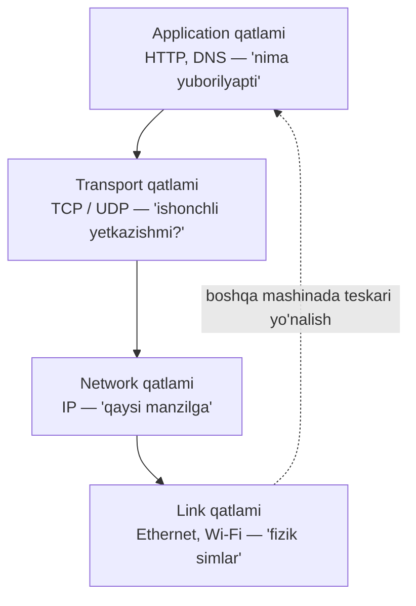
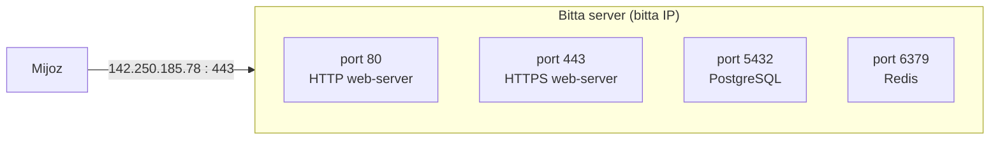
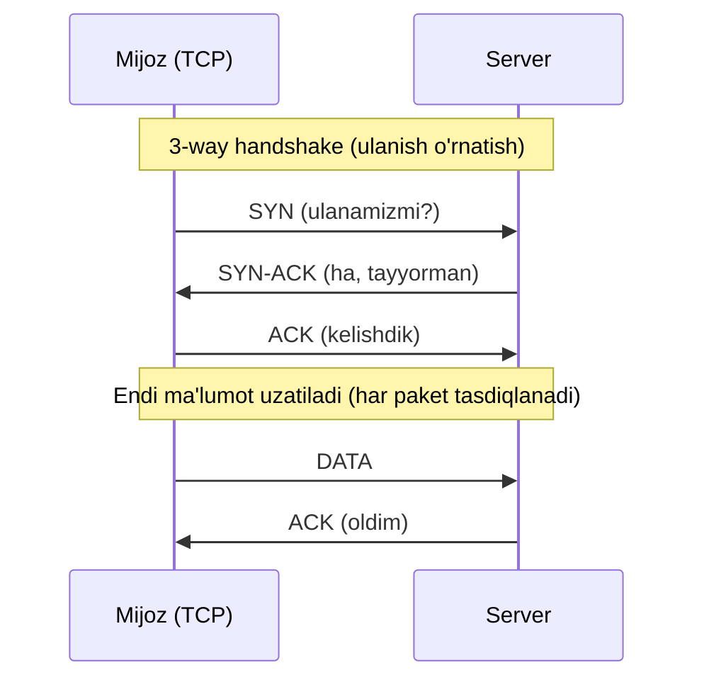
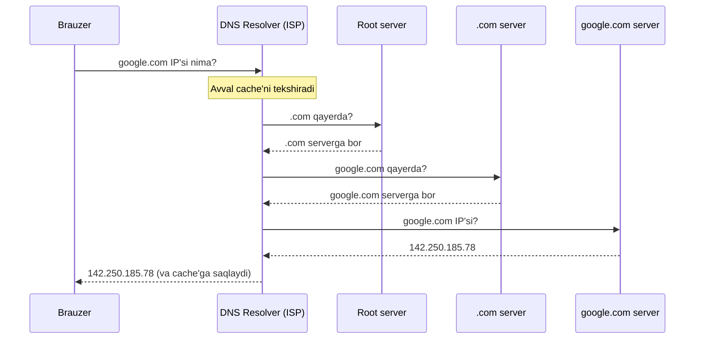
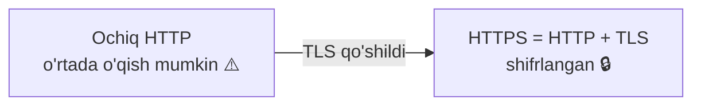
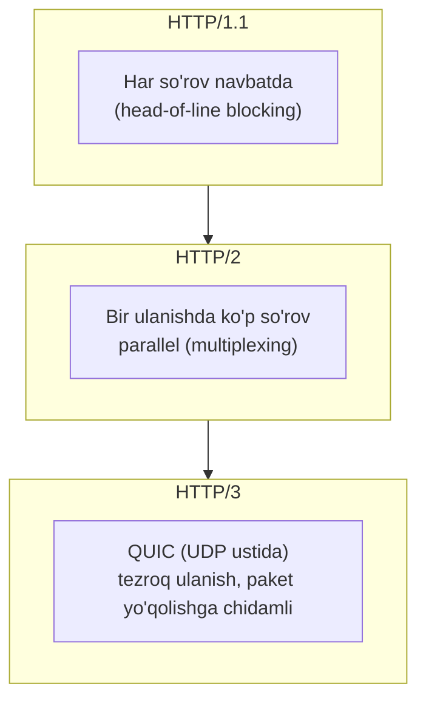
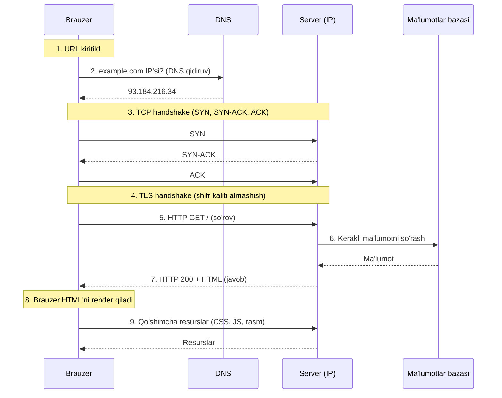

# 4-dars: Internet tarmog'i va protokollari

> **Modul:** Tizimlar negizi · **Dars:** 4/5
> **Maqsad:** Dasturing bir mashinada ishlayapti. Endi u boshqa mashinalar bilan qanday gaplashadi? IP, port, TCP/UDP, DNS, HTTP va "URL yozdim → sayt ochildi" jarayonining to'liq ichki mexanizmini tushunish.

---

## 1. Muammo: ikkita mashina bir-birini qanday topadi?

Sening telefoning Toshkentda, YouTube serveri AQSHda. Sen video ko'ryapsan. Savol tug'iladi:

- YouTube serveri **qayerda**? Uni qanday **topamiz**?
- Millionlab mashina bir simda — ma'lumot aynan **senga** qanday keladi?
- Video bo'lak-bo'lak yuborilsa, ular **to'g'ri tartibda** va **yo'qolmasdan** qanday yetib keladi?

Bu savollarga javob — **internet protokollari**. Ular — mashinalar kelishib olgan "til va qoidalar". Agar bu qoidalar bo'lmasa, har mashina o'zicha gaplashib, hech kim bir-birini tushunmasdi.

System design'ning yarmi — bu tarmoq ustida qurilgan. Shuning uchun bu qatlamni tushunmasang, "load balancer", "CDN", "latency" haqidagi qarorlar sen uchun sehr bo'lib qoladi.

---

## 2. Analogiya: pochta tizimi

Internetni **jahon pochta tizimi** deb tasavvur qil:

| Pochta | Internet |
| --- | --- |
| Uy manzili (shahar, ko'cha, uy) | IP manzil |
| Uydagi konkret xona/odam | Port |
| Odam nomi → manzilni topish (ma'lumotnoma) | DNS |
| Xat kafolatli yetkazish, tasdiq bilan | TCP |
| Otkritka: tashladim, yetdi-yetmadi bilmayman | UDP |
| Xat ichidagi til (o'zbekcha, inglizcha) | HTTP protokoli |
| Muhrlangan, o'qib bo'lmaydigan konvert | TLS/HTTPS |

> **Cheklov:** Pochtada xat bitta yo'lak bilan boradi. Internetda esa bitta xabar bo'laklarga (packet) bo'linib, turli yo'llardan ketib, manzilda qayta yig'iladi. Bu farqni yodda tut.

---

## 3. Sodda ta'rif

**Protokol** — ikki mashina ma'lumot almashish uchun oldindan kelishgan qoidalar to'plami (kim qachon nima yuboradi, format qanday, xatoni qanday tekshiradi).

Yangi atamalar:
- **IP (Internet Protocol)** — har mashinaga manzil berish va ma'lumotni shu manzilga yo'naltirish qoidalari.
- **Packet (paket)** — tarmoqda yuboriladigan ma'lumotning kichik bo'lagi.

---

## 4. Diagramma: tarmoq qatlamlari (soddalashtirilgan)

Har qatlam o'z ishini qiladi va pastkisiga tayanadi — bu 2-darsdagi abstraksiya g'oyasining aynan o'zi, faqat tarmoqda.



Sen HTTP so'rov yuborasan → u TCP paketlariga bo'linadi → har paketga IP manzil qo'yiladi → fizik sim orqali ketadi. Manzilda teskari: sim → IP → TCP qayta yig'adi → HTTP.

---

## 5. IP manzil va port

### IP manzil — mashinaning manzili
**IP manzil** — tarmoqdagi har bir mashinaning yagona raqamli manzili. Ikki versiyasi bor:
- **IPv4:** `142.250.185.78` (4 ta son, 0-255). Ular tugab qolgan (~4 milliard).
- **IPv6:** `2607:f8b0:4005:80a::200e` (ancha ko'p, cheksizga yaqin).

### Port — mashinadagi konkret dastur
Bitta mashinada ko'p dastur ishlaydi (web-server, DB, mail). Paket qaysi dasturga borishini **port** aniqlaydi — 0 dan 65535 gacha son.

**Analogiya:** IP = binoning manzili, port = shu binodagi kvartira raqami.



Standart portlar: 80 (HTTP), 443 (HTTPS), 22 (SSH), 5432 (PostgreSQL), 6379 (Redis).

---

## 6. TCP vs UDP — transport qatlami

Ikki mashina orasida ma'lumotni yetkazishning ikki asosiy usuli. Bu — system design'da tez-tez uchraydigan tanlov.

### TCP (Transmission Control Protocol) — ishonchli
**TCP** — ma'lumotni **kafolatli, to'g'ri tartibda** yetkazadigan protokol. Har paket yetganini tasdiqlaydi (ACK), yo'qolgani qayta yuboriladi.

### UDP (User Datagram Protocol) — tez, kafolatsiz
**UDP** — paketni shunchaki yuboradi, yetdi-yetmaganini tekshirmaydi. Tez, lekin ishonchsiz.



**3-way handshake (uch bosqichli qo'l berish):** TCP ma'lumot yuborishdan oldin ulanishni **o'rnatadi** — SYN → SYN-ACK → ACK. Bu ishonchlilikning narxi: qo'shimcha bordi-keldi (latency).

| Xususiyat | TCP | UDP |
| --- | --- | --- |
| Kafolat | Yetkazishni kafolatlaydi | Kafolatlamaydi |
| Tartib | Tartibni saqlaydi | Saqlamaydi |
| Tezlik | Sekinroq (handshake, ACK) | Tez (ortiqcha ish yo'q) |
| Ulanish | O'rnatiladi (handshake) | Yo'q (shunchaki yuboradi) |
| Ishlatilishi | Web, email, fayl, DB | Video/audio oqim, o'yin, DNS |

**Qachon qaysi?**
- **TCP:** ma'lumot **to'liq va to'g'ri** kelishi shart (web sahifa, bank tranzaksiyasi, fayl yuklash).
- **UDP:** **tezlik** muhim, bir-ikki bo'lak yo'qolsa mayli (jonli video, onlayn o'yin, ovozli qo'ng'iroq).

### ⚠️ Ko'p uchraydigan xato
- **"UDP yomon, TCP har doim yaxshi"** → Yo'q. Jonli video uchun kechikkan paketni qayta kutish yomon — o'sha kadr allaqachon o'tib ketgan. UDP'ning "yo'qolsa yo'qolsin" xususiyati bu yerda afzallik.

---

## 7. DNS — nom → manzil tarjimoni

### Muammo
Sen `google.com` yozasan, lekin tarmoq faqat IP manzil bilan ishlaydi (`142.250.185.78`). Kim `google.com`ni IP'ga aylantiradi? Odam raqamni emas, nomni eslaydi.

### Yechim: DNS
**DNS (Domain Name System)** — domen nomlarini (`google.com`) IP manzilga aylantiruvchi "internet telefon kitobi".



**Rekursiv qidiruv:** Resolver nomni bo'lak-bo'lak yechadi — avval root server (`.` — eng yuqori), keyin TLD server (`.com`), oxirida domen serveri (`google.com`). Har biri "keyingisi qayerda" deb yo'naltiradi.

**Caching (keshlash):** Bu jarayon uzun. Shuning uchun natija bir necha joyda **saqlanadi** (brauzer, OS, resolver). Keyingi safar `google.com` yozsang, cache'dan darrov olinadi — DNS qidiruvi takrorlanmaydi. Har yozuvda **TTL** (Time To Live — qancha vaqt saqlash) bor.

> **System design ta'siri:** DNS o'zi bir necha marta bordi-keldi qiladi (latency). Shuning uchun birinchi ulanish sekinroq. Cache buni tez qiladi. DNS shuningdek load balancing va failover uchun ishlatiladi (bir nomga bir necha IP).

### 🤔 O'ylab ko'r
Nima uchun bir web-saytga birinchi kirish keyingi kirishlardan sekinroq bo'lishi mumkin?

<details>
<summary>💡 Javobni ko'rish</summary>

Birinchi kirishda: DNS qidiruvi to'liq bajariladi (root → TLD → domen), TCP handshake o'rnatiladi, TLS handshake bo'ladi — hech narsa cache'da yo'q. Keyingi kirishda: DNS natijasi cache'da, ba'zan ulanish qayta ishlatiladi (keep-alive) — shuning uchun tezroq. Bu cache va handshake xarajatining natijasi.
</details>

---

## 8. HTTP, HTTPS, TLS va versiyalar

### HTTP — application qatlami tili
**HTTP (HyperText Transfer Protocol)** — brauzer va web-server ma'lumot almashadigan qoidalar. So'rov (request) va javob (response) matnli formatda.

```
So'rov:               Javob:
GET /users HTTP/1.1   HTTP/1.1 200 OK
Host: example.com     Content-Type: application/json
                      { "users": [...] }
```

### HTTPS va TLS — xavfsiz HTTP
**HTTPS** = HTTP + **TLS** (Transport Layer Security). TLS ma'lumotni **shifrlaydi** — o'rtada ushlab olsa ham, o'qib bo'lmaydi.

**TLS handshake:** Ulanish boshida mijoz va server "kalit" almashadi (shifrlash uchun). Bu qo'shimcha bordi-keldi — yana latency. Lekin xavfsizlik shart.



### HTTP/1.1 vs HTTP/2 vs HTTP/3



| | HTTP/1.1 | HTTP/2 | HTTP/3 |
| --- | --- | --- | --- |
| Asos | TCP | TCP | QUIC (UDP) |
| So'rovlar | Navbatda (bittalab) | Parallel (multiplexing) | Parallel + tezroq |
| Head-of-line blocking | Bor | TCP darajasida qoladi | Yo'q (UDP) |
| Ulanish tezligi | Sekinroq | O'rta | Eng tez (0-RTT) |

- **HTTP/1.1:** har so'rov navbatda — biri sekin bo'lsa, orqadagilar kutadi (head-of-line blocking).
- **HTTP/2:** bitta ulanishda ko'p so'rov parallel (multiplexing) — tezroq.
- **HTTP/3:** TCP o'rniga QUIC (UDP ustida) — ulanish tezroq o'rnatiladi, paket yo'qolishi bitta oqimni to'xtatmaydi.

---

## 9. To'liq request lifecycle — URL yozdim → sayt ochildi

Endi hamma narsani birlashtiramiz. Sen brauzerga `https://example.com` yozib Enter bosganingda **aynan nima** bo'ladi? Bu — bu darsning cho'qqisi.



Qadamma-qadam:
1. **URL kiritildi** — brauzer `https://example.com`ni tahlil qiladi.
2. **DNS qidiruv** — nom IP'ga aylantiriladi (cache bo'lmasa, to'liq rekursiv qidiruv).
3. **TCP handshake** — server bilan ishonchli ulanish o'rnatiladi (SYN/SYN-ACK/ACK).
4. **TLS handshake** — HTTPS bo'lgani uchun shifrlash kaliti almashiladi.
5. **HTTP so'rov** — brauzer `GET /` yuboradi.
6. **Server ishlaydi** — kerak bo'lsa DB'dan, cache'dan ma'lumot oladi (bu yerda sening backend koding ishlaydi!).
7. **HTTP javob** — server HTML/JSON qaytaradi (status kodi bilan: 200 OK, 404, 500...).
8. **Render** — brauzer HTML'ni ekranga chizadi.
9. **Qo'shimcha resurslar** — CSS, JS, rasm uchun yana so'rovlar (HTTP/2 bo'lsa parallel).

**Notional machine:** Har bir qadam vaqt oladi (1-darsdagi latency numbers!). DNS ~20-100 ms, TCP handshake bir bordi-keldi (RTT), TLS yana bir-ikki RTT, keyin server ishi. Shuning uchun "sahifa tez ochilishi" uchun har qadamni optimallash mavzusi tug'iladi (cache, CDN, keep-alive, HTTP/3).

```go
// --- Server tomonida 6-7 qadam: so'rovni qabul qilib javob berish ---
// 1-qadam: portni tinglaymiz (2-darsdagi socket)
http.HandleFunc("/", func(w http.ResponseWriter, r *http.Request) {
    // 2-qadam: so'rovni o'qiymiz (bu request lifecycle'ning 5-qadami)
    name := r.URL.Query().Get("name")
    // 3-qadam: javob tayyorlaymiz (7-qadam)
    w.Header().Set("Content-Type", "text/plain")
    w.WriteHeader(http.StatusOK) // 200 OK
    fmt.Fprintf(w, "Salom, %s!", name)
})
// 4-qadam: TCP portda ulanishlarni kutamiz
http.ListenAndServe(":8080", nil)
// Notional machine: har kelgan ulanish uchun Go alohida goroutine ochadi
// (3-darsdagi goroutine + IO-bound). Sen faqat handler yozasan.
```

### ⚠️ Ko'p uchraydigan xato
- **"HTTP status 200 = hammasi to'g'ri"** → 200 faqat HTTP darajasida so'rov yetdi degani. Ichida biznes xatosi bo'lishi mumkin. To'g'ri status kodlaridan foydalan: 4xx (mijoz xatosi), 5xx (server xatosi).
- **"HTTPS sekin, ishlatmasa ham bo'ladi"** → Xavfsizlik shart; zamonaviy TLS 1.3 + HTTP/2 bilan tezlik farqi juda kichik, xavf esa katta.

---

## Xulosa

- **Protokol** — mashinalar kelishgan qoidalar; internet qatlamlarga bo'lingan (HTTP → TCP/UDP → IP → fizik).
- **IP** — mashina manzili, **port** — mashinadagi konkret dastur; ikkalasi birga aniq maqsadni ko'rsatadi.
- **TCP** ishonchli (handshake + ACK, tartib), **UDP** tez lekin kafolatsiz — vazifaga qarab tanlanadi.
- **DNS** nomni IP'ga aylantiradi (rekursiv qidiruv + caching); birinchi ulanishni sekinlashtiradi.
- **HTTP** — application tili; **HTTPS = HTTP + TLS** (shifrlash); versiyalar (1.1 → 2 → 3) tezlik uchun rivojlangan.
- **Request lifecycle:** URL → DNS → TCP → TLS → HTTP so'rov → server/DB → javob → render — har qadam latency qo'shadi.

## 🧠 Eslab qol

- IP = bino manzili, port = kvartira raqami.
- TCP ishonchli lekin handshake bilan sekinroq; UDP tez lekin kafolatsiz.
- DNS = internet telefon kitobi; caching birinchi qidiruvdan keyingilarni tezlashtiradi.
- HTTPS = HTTP + TLS shifrlash; HTTP/2 multiplexing bilan parallel.
- Har web so'rov kamida DNS + TCP + TLS + server bosqichidan o'tadi — hammasi latency.

## ✅ O'z-o'zini tekshir (retrieval practice)

**1.** Jonli video oqimida nega TCP emas, UDP afzalroq bo'lishi mumkin?

<details>
<summary>💡 Javob</summary>
Jonli oqimda kechikkan kadr qiymatsiz — u allaqachon o'tib ketgan. TCP yo'qolgan paketni qayta yuborishni kutadi, bu esa oqimni to'xtatadi (buffering). UDP kechikkanni tashlab, keyingisiga o'tadi — jonli oqim silliq davom etadi. Shuning uchun UDP afzal.
</details>

**2.** Nega `google.com` yozganingda tarmoq to'g'ridan-to'g'ri serverga bora olmaydi, DNS kerak bo'ladi?

<details>
<summary>💡 Javob</summary>
Tarmoq faqat IP manzil bilan ishlaydi, nom bilan emas. `google.com` — odam eslashi uchun qulay nom, lekin marshrutlash IP asosida. DNS nomni IP'ga (`142.250.185.78`) aylantiradi. Usiz tarmoq qaysi mashinaga borishni bilmaydi.
</details>

**3.** TCP 3-way handshake nega kerak va u nima "narx" qo'shadi?

<details>
<summary>💡 Javob</summary>
Handshake (SYN/SYN-ACK/ACK) ikkala tomon ham tayyor va bir-birini "eshityapti"ni tasdiqlash uchun — ishonchli ulanish o'rnatiladi. Narxi: ma'lumot yuborilishidan oldin bitta to'liq bordi-keldi (RTT) latency qo'shiladi. Shuning uchun ulanishlarni qayta ishlatish (keep-alive) foydali.
</details>

**4.** HTTP/1.1 va HTTP/2 orasidagi asosiy farq nima va u nega tezlikka ta'sir qiladi?

<details>
<summary>💡 Javob</summary>
HTTP/1.1'da so'rovlar navbatda — biri sekin bo'lsa orqadagilar kutadi (head-of-line blocking). HTTP/2 bitta ulanishda ko'p so'rovni parallel yuboradi (multiplexing). Shuning uchun ko'p resurs (CSS, JS, rasm) bir vaqtda kelib, sahifa tezroq yuklanadi.
</details>

## 🛠 Amaliyot

**1. Oson (chizish).** "URL yozdim → sayt ochildi" jarayonini 8 qadamda yoddan chiz (DNS → TCP → TLS → HTTP → server → javob → render). Har qadamga taxminan qancha latency qo'shilishini 1-darsdagi raqamlar bilan belgila.

**2. O'rta (kamchilikni topish).** Bir jamoa fayl yuklash servisini UDP ustiga qurdi, "UDP tez, shuning uchun fayllar tez yuklanadi" deb. Foydalanuvchilar "yuklangan fayllar buzilib chiqyapti" deb shikoyat qilmoqda. Muammoni TCP/UDP kafolatlari bilan tushuntir va to'g'rila.

<details>
<summary>💡 Hint</summary>
UDP yetkazishni va tartibni kafolatlamaydi — paketlar yo'qoladi yoki tartibsiz keladi, natijada fayl buziladi. Fayl uchun to'liqlik shart → TCP kerak. UDP faqat yo'qotishga chidamli (video/o'yin) uchun. Yechim: TCP (yoki QUIC/HTTP/3 ustida ishonchli protokol).
</details>

**3. Qiyin (kichik dizayn).** Foydalanuvchilaring dunyo bo'ylab (AQSH, Yevropa, Osiyo) va sening serveringning hammasi bitta DC'da (Toshkent). Ular sahifa "sekin ochilyapti" deydi. Bu darsdagi tushunchalar (DNS, RTT, TLS, geografik latency) asosida: (a) sekinlikning asosiy sabablarini sanab ber, (b) kamida 2 ta yechim taklif qil.

<details>
<summary>💡 Hint</summary>
(a) Sabab: kontinentlararo RTT ~150 ms (1-dars) × har handshake (TCP + TLS bir necha RTT) + DNS. Uzoqlik = ko'p bordi-keldi. (b) Yechimlar: (1) CDN / edge serverlar — foydalanuvchiga yaqin joyda statik kontent; (2) geo-replikatsiya — bir necha mintaqada server; (3) HTTP/2 yoki HTTP/3 (kamroq RTT); (4) keep-alive bilan ulanishni qayta ishlatish. Bu 1-darsdagi geografik latency tushunchasiga bog'lanadi.
</details>

## 🔁 Takrorlash

- **Bog'liq oldingi darslar:**
  - `01-kompyuter-anatomiyasi.md` — geografik latency (DC ~0.5 ms, kontinentlararo ~150 ms) bu yerda RTT sifatida qaytdi.
  - `02-operatsion-tizim-va-abstraksiya.md` — socket, "hamma narsa fayl"; tarmoq ulanishi shu socket ustida.
  - `03-dastur-dasturlash-tili-va-dasturchi.md` — server har ulanishga goroutine ochadi (IO-bound).
- **Takrorlash jadvali:**
  - Ertaga → TCP vs UDP jadvalini yoddan tikla.
  - 3 kundan keyin → DNS rekursiv qidiruvni va caching'ni tushuntir.
  - 1 haftadan keyin → to'liq request lifecycle'ni 8 qadamda qayta chiz.
- **Feynman testi:** Do'stingga 3 jumlada tushuntir: "Men `youtube.com` yozganimda, video qanday qilib ekranimga keladi?" (Javobda: DNS → IP topish, TCP/TLS ulanish, HTTP so'rov/javob).
- **Keyingi dars:** `05-api-uslublari-rest-graphql-grpc.md` — HTTP ustida servislar bir-biri bilan qanday "gaplashadi"? REST, GraphQL va gRPC uslublari va qachon qaysini tanlash.
