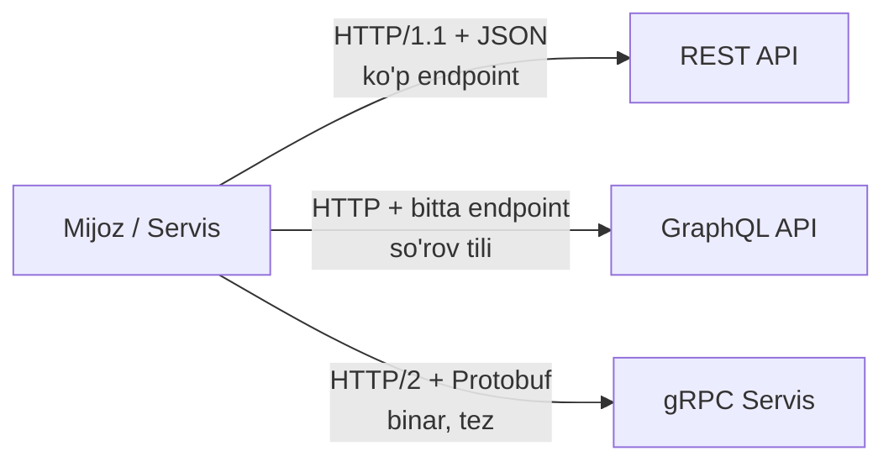
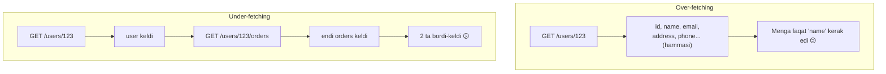
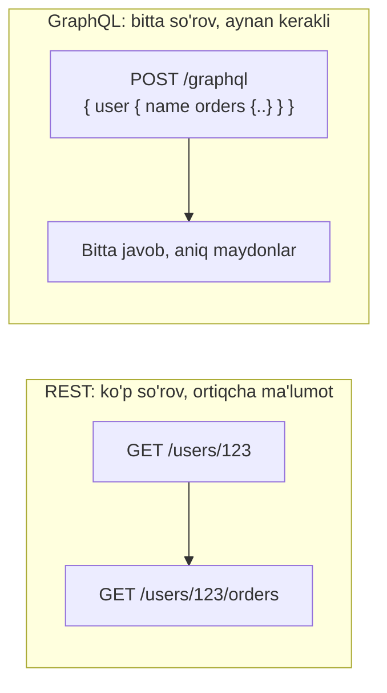
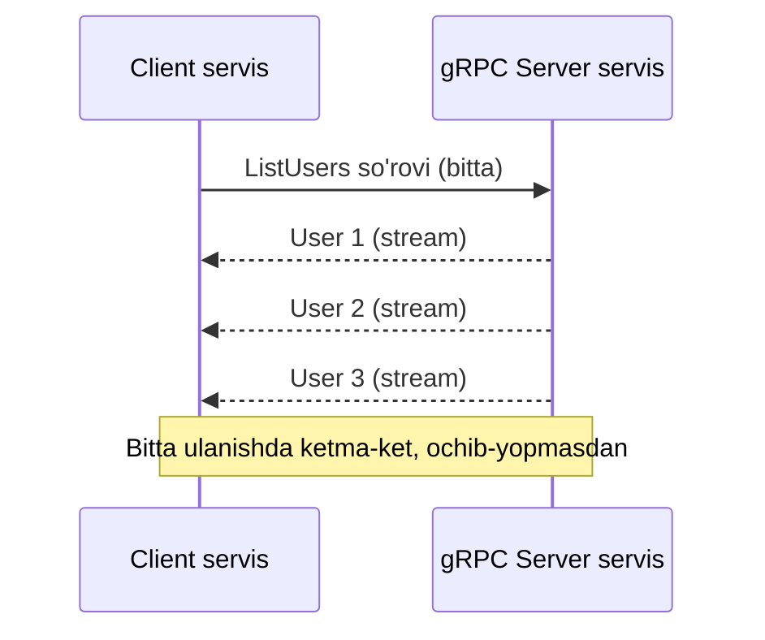
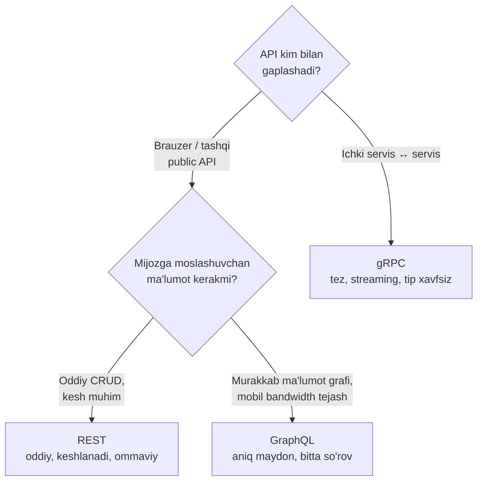
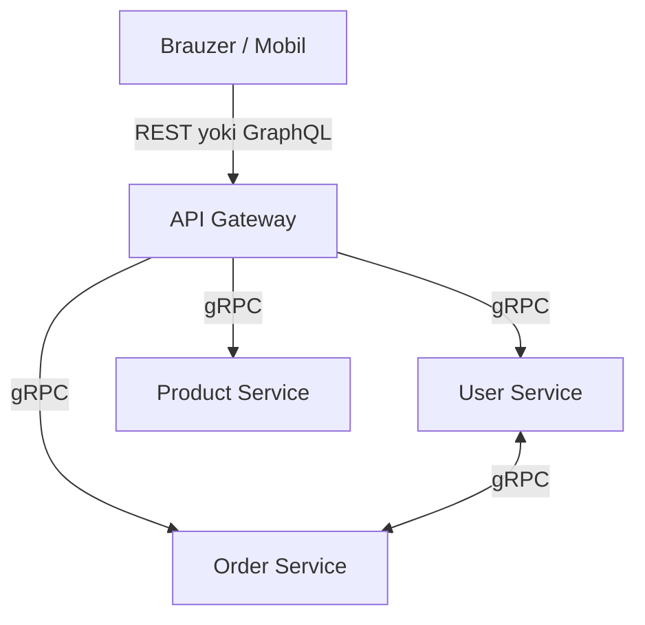

# 5-dars: API uslublari — REST, GraphQL, gRPC

> **Modul:** Tizimlar negizi · **Dars:** 5/5 (qo'shimcha mavzu)
> **Maqsad:** HTTP ustida servislar bir-biri bilan qanday "gaplashadi"? REST, GraphQL va gRPC uslublarining muammosi va yechimini tushunish hamda "qachon qaysini tanlash" qaroriga ega bo'lish.

---

## 1. Muammo: servislar bir-birini qanday tushunadi?

Oldingi darsda HTTP orqali brauzer va server gaplashishini ko'rdik. Endi real tizim: sening backend'ing DB'dan foydalanuvchi ma'lumotini oladi, brauzerga yuboradi; ikkita mikroservis o'zaro ma'lumot almashadi.

Savol: bu almashinuvni **qanday tashkil qilamiz**?

- Manzillar qanday bo'ladi? (`/getUser`? `/user/123`? `/api/v2/fetchUserData`?)
- Mijozga aynan kerakli ma'lumotni qanday beramiz — ortiqchasini emas?
- Ikki mikroservis o'rtasida **eng tez** va **eng ishonchli** aloqa qaysi?

Agar har jamoa o'zicha qilsa — tartibsizlik. Shuning uchun **API uslublari** (API styles) paydo bo'ldi — servislar aloqasini tashkil qilishning tanilgan andozalari. Uchtasi hukmron: **REST, GraphQL, gRPC.**

**API (Application Programming Interface)** — bir dastur ikkinchisiga xizmat ko'rsatadigan "shartnoma": qanday so'rov yuborsang, qanday javob olasan.

---

## 2. Analogiya: restoranda buyurtma berish uslublari

Uch xil restoran tasavvur qil:

| Restoran | API uslubi |
| --- | --- |
| **Menyu bo'yicha:** har taom uchun alohida nom (`1-taom`, `2-taom`), aniq belgilangan | REST — har resurs alohida URL |
| **"Menga aynan shunday tayyorlang":** buyurtmada aniq nima kerakligini yozasan | GraphQL — mijoz kerak maydonini so'raydi |
| **Oshxonalar orasidagi ichki tez aloqa:** qisqa kodlar, tez, faqat xodimlar tushunadi | gRPC — servislar orasida binar, tez |

> **Cheklov:** Bu analogiya "kim bilan gaplashish" nuqtai nazaridan yaxshi — REST/GraphQL ko'proq mijoz (brauzer) uchun, gRPC ichki servislar uchun. Lekin chegaralar qat'iy emas: REST'ni ichki aloqada, gRPC'ni ba'zan tashqarida ham ishlatish mumkin.

---

## 3. Sodda ta'rif

- **REST** — resurslarni URL bilan ifodalab, HTTP metodlari (GET, POST...) orqali boshqarish uslubi.
- **GraphQL** — bitta endpoint orqali mijoz aynan kerakli ma'lumotni so'raydigan so'rov tili.
- **gRPC** — HTTP/2 va binar format (protobuf) ustida ishlaydigan, servislararo tez chaqiruv tizimi.

---

## 4. Diagramma: uchtasining umumiy ko'rinishi



Uchalasi ham bir muammoni — servislar aloqasini — hal qiladi, lekin uch xil yo'l bilan. Endi har birini alohida ko'ramiz.

---

## 5. REST — resurslar va HTTP metodlari

### G'oya
**REST (Representational State Transfer)** hamma narsani **resurs** (foydalanuvchi, buyurtma, mahsulot) deb ko'radi. Har resursning URL'i bor, u ustida amallar **HTTP metodlari** orqali bajariladi.

```
GET    /users        → barcha foydalanuvchilar (o'qish)
GET    /users/123    → 123-foydalanuvchi (o'qish)
POST   /users        → yangi foydalanuvchi (yaratish)
PUT    /users/123    → 123ni to'liq yangilash
PATCH  /users/123    → 123ni qisman yangilash
DELETE /users/123    → 123ni o'chirish
```

**Stateless (holatsiz):** har so'rov mustaqil — server oldingi so'rovni eslamaydi. Bu masshtablashni osonlashtiradi (har server har so'rovni ko'tara oladi).

```go
// --- REST endpoint: bitta foydalanuvchini qaytarish ---
// 1-qadam: URL'dan id olamiz (resurs identifikatori)
r.Get("/users/{id}", func(w http.ResponseWriter, r *http.Request) {
    id := chi.URLParam(r, "id")
    // 2-qadam: ma'lumotni topamiz (bu yerda DB'dan)
    user := User{ID: 1, Name: "Ali", Email: "ali@example.com"}
    _ = id
    // 3-qadam: JSON qilib qaytaramiz
    w.Header().Set("Content-Type", "application/json")
    json.NewEncoder(w).Encode(user)
})
// Javob: {"id":1,"name":"Ali","email":"ali@example.com"}
```

### REST muammosi: over-fetching va under-fetching
```
Over-fetching (ortiqcha):  Faqat "name" kerak, lekin butun user obyekti keladi.
Under-fetching (kam):      User + uning buyurtmalari kerak → 2 ta alohida so'rov.
```



### ⚠️ Ko'p uchraydigan xato
- **"Har amal uchun POST /doSomething ishlataman"** → Bu REST emas. REST resursga (`/users`) va metodga (GET/POST/DELETE) tayanadi. Fe'l (`/getUser`, `/deleteUser`) URL'da bo'lmasin — metod fe'lni bildiradi.

---

## 6. GraphQL — mijoz aynan kerakligini so'raydi

### G'oya
REST'ning over/under-fetching muammosini **GraphQL** hal qiladi. Mijoz **bitta endpoint**'ga so'rov yuboradi va **aynan qaysi maydonlar** kerakligini o'zi yozadi.

```graphql
query {
  user(id: "123") {
    name          # faqat kerakli maydon
    orders {      # bog'liq ma'lumotni ham bir so'rovda
      id
      amount
    }
  }
}
```

Javob — aynan so'ralgan struktura:
```json
{ "data": { "user": { "name": "Ali", "orders": [{ "id": 1, "amount": 50000 }] } } }
```



### Afzalliklari
- Over/under-fetching yo'q — mijoz aynan kerakni oladi.
- Bitta endpoint (`/graphql`).
- Kuchli tiplar (schema) — nima so'rash mumkinligi oldindan aniq.
- Real-time (subscriptions).

### Kamchiliklari
- **Kesh murakkab** — REST'da URL bo'yicha oson keshlanadi, GraphQL'da bitta URL, shuning uchun qiyin.
- **N+1 muammo** — bog'liq ma'lumot uchun ko'p DB so'rovi bo'lishi mumkin (DataLoader kerak).
- Server tomoni murakkabroq.

### ⚠️ Ko'p uchraydigan xato
- **"GraphQL har doim REST'dan tez"** → Tarmoqda kamroq bordi-keldi bo'lishi mumkin, lekin server tomonida N+1 muammo yoki og'ir so'rov (juda chuqur query) tezlikni buzishi mumkin. GraphQL — moslashuvchanlik uchun, avtomatik tezlik uchun emas.

---

## 7. gRPC — servislar orasida tez aloqa

### G'oya
**gRPC** — bir servis ikkinchisining funksiyasini xuddi **mahalliy funksiya**dek chaqiradi (RPC — Remote Procedure Call). U **HTTP/2** va **protobuf** (binar format) ustida ishlaydi — shuning uchun juda tez.

**Protobuf (Protocol Buffers)** — ma'lumotni matn (JSON) emas, ixcham **binar** formatda kodlaydi. Kichikroq va tezroq o'qiladi.

```protobuf
// user.proto — "shartnoma" (kontrakt) shu yerda aniqlanadi
service UserService {
    rpc GetUser (GetUserRequest) returns (User);
    rpc ListUsers (ListUsersRequest) returns (stream User); // streaming!
}
message GetUserRequest { string id = 1; }
message User { string id = 1; string name = 2; string email = 3; }
```

```go
// --- gRPC server metodi: xuddi oddiy funksiya kabi ---
// 1-qadam: protobuf'dan generatsiya qilingan interfeysni implement qilamiz
func (s *server) GetUser(ctx context.Context, req *pb.GetUserRequest) (*pb.User, error) {
    // 2-qadam: ma'lumotni qaytaramiz (tip xavfsiz, generatsiya qilingan)
    return &pb.User{Id: req.Id, Name: "Ali", Email: "ali@example.com"}, nil
}
// Mijoz tomonida: client.GetUser(ctx, &pb.GetUserRequest{Id: "123"})
// — xuddi mahalliy funksiya chaqirgandek ko'rinadi.
```

### Streaming — gRPC'ning kuchli tomoni
gRPC HTTP/2 ustida bo'lgani uchun **stream** (uzluksiz oqim) qo'llab-quvvatlaydi: server bir so'rovga ko'p javob (yoki aksincha) yuborishi mumkin — ulanishni qayta ochmasdan.



### Afzalliklari
- Juda tez (binar + HTTP/2, JSON'dan 3-10x kichik/tez).
- Kuchli tiplar (protobuf schema kontrakt).
- Streaming (ikki tomonlama ham).
- Polyglot — turli tillar bitta `.proto`'dan kod generatsiya qiladi.

### Kamchiliklari
- Brauzer to'g'ridan qo'llab-quvvatlamaydi (grpc-web kerak).
- Binar — inson o'qiy olmaydi (debug qiyinroq).
- Kesh murakkab.

### ⚠️ Ko'p uchraydigan xato
- **"gRPC tez, demak public API'ni ham gRPC qilaman"** → Brauzer va tashqi mijozlar uchun noqulay (grpc-web, tooling murakkab). gRPC ichki servislararo aloqa uchun eng kuchli; tashqi/public uchun REST yoki GraphQL qulayroq.

---

## 8. Taqqoslash va "qachon qaysini tanlash"

### Umumiy jadval

| | REST | GraphQL | gRPC |
| --- | --- | --- | --- |
| Format | JSON (matn) | JSON (matn) | Protobuf (binar) |
| Protokol | HTTP/1.1 | HTTP/1.1 | HTTP/2 |
| Performance | O'rtacha | O'rtacha | Yuqori (3-10x) |
| Kesh | Oson (URL) | Qiyin | Qiyin |
| Brauzer qo'llab-quvvatlashi | Ha | Ha | Yo'q (grpc-web) |
| Streaming | Yo'q (WebSocket kerak) | Qisman (subscriptions) | Ha (to'liq) |
| Tip xavfsizligi | Yo'q | Ha (schema) | Ha (protobuf) |
| O'rganish qiyinligi | Past | O'rta | Yuqori |
| Over/under-fetching | Bor | Yo'q | Yo'q (aniq kontrakt) |

### Qaror daraxti



**Amaliy qoidalar:**
- **REST** → ommaviy (public) API, oddiy CRUD, keshlash muhim, keng qo'llab-quvvatlash kerak.
- **GraphQL** → murakkab, o'zaro bog'liq ma'lumot; mobil ilova (trafik tejash); frontend tez-tez o'zgaruvchi maydonlarni so'raydi.
- **gRPC** → mikroservislar orasida, yuqori performance, streaming, ko'p tilli (polyglot) tizim.

### Real arxitektura: ko'pincha hammasi birga



Tashqarida (brauzer bilan) REST/GraphQL, ichkarida (servislar orasida) gRPC — bu keng tarqalgan naqsh.

### 🤔 O'ylab ko'r
Mobil ilovang bor. Bir ekranda foydalanuvchi ismi, avatari va oxirgi 3 buyurtmasi ko'rsatiladi. REST bilan bu necha so'rov, GraphQL bilan-chi? Mobil trafik uchun qaysi biri afzal?

<details>
<summary>💡 Javobni ko'rish</summary>

REST bilan odatda 2 so'rov: `GET /users/123` (ism, avatar — lekin ortiqcha maydonlar ham keladi, over-fetching) va `GET /users/123/orders` (buyurtmalar). GraphQL bilan **bitta** so'rov: aynan ism, avatar va 3 buyurtmani so'raysan — ortiqcha maydon ham, qo'shimcha bordi-keldi ham yo'q. Mobil (cheklangan trafik + yuqori latency tarmoq) uchun GraphQL afzal: kamroq so'rov, kamroq bayt.
</details>

---

## Go amaliyoti — uch uslubni kodda ko'rish

Yuqorida har uslubning g'oyasini ko'rdik. Endi uchtasini ham **ishlaydigan** Go kodida ko'ramiz — shunda "shartnoma" qanday kod bo'lishini his qilasan.

### a) REST — to'liq ishlaydigan server

Yuqorida faqat handlerni ko'rgan edik; mana uni to'liq, ishga tushadigan dastur ichida:

```go
package main

import (
    "encoding/json"
    "net/http"

    "github.com/go-chi/chi/v5"
)

// 1-qadam: resurs strukturasi (JSON teglari bilan)
type User struct {
    ID    int    `json:"id"`
    Name  string `json:"name"`
    Email string `json:"email"`
}

func main() {
    // 2-qadam: router va endpoint (resurs + HTTP metod)
    r := chi.NewRouter()
    r.Get("/users/{id}", func(w http.ResponseWriter, req *http.Request) {
        user := User{ID: 1, Name: "Ali", Email: "ali@example.com"}
        w.Header().Set("Content-Type", "application/json")
        json.NewEncoder(w).Encode(user) // 3-qadam: JSON qilib qaytar
    })
    http.ListenAndServe(":8080", r)
}
// GET /users/1 -> {"id":1,"name":"Ali","email":"ali@example.com"}
```

### b) GraphQL — sxema va resolver (gqlgen)

GraphQL'da avval **sxema** (nima so'rash mumkinligining kontrakti) yoziladi, keyin har maydon uchun **resolver** (uni qanday to'ldirishni bildiradigan funksiya).

```graphql
# schema.graphqls — kontrakt
type Query {
    user(id: ID!): User
}
type User {
    id: ID!
    name: String!
    email: String!
    orders: [Order!]!
}
type Order {
    id: ID!
    amount: Float!
}
```

```go
// resolver.go — sxemadagi "user" so'rovini qanday to'ldiramiz
func (r *queryResolver) User(ctx context.Context, id string) (*model.User, error) {
    // bu yerda DB'dan olinadi; hozir soddalik uchun to'g'ridan qaytaramiz
    return &model.User{ID: id, Name: "Ali", Email: "ali@example.com"}, nil
}
```

Client so'rovda qaysi maydonni yozsa (`name`, `orders`...), gqlgen aynan o'sha resolverlarni chaqiradi — ortiqchasini emas. Over-fetching shu tariqa yo'qoladi.

### c) gRPC — protobuf, server va streaming

Avval to'liq **protobuf** kontrakti (bu fayldan turli tillar uchun kod generatsiya qilinadi):

```protobuf
// user.proto
syntax = "proto3";
package user;
option go_package = "./proto";

service UserService {
    rpc GetUser (GetUserRequest) returns (User);
    rpc ListUsers (ListUsersRequest) returns (stream User); // streaming
}
message GetUserRequest { string id = 1; }
message ListUsersRequest {}
message User { string id = 1; string name = 2; string email = 3; }
```

Yuqorida `GetUser` metodini ko'rgandik; endi uni ishlaydigan **serverga** ulaymiz:

```go
// 1-qadam: TCP portni ochamiz va gRPC serverni yaratamiz
func main() {
    lis, _ := net.Listen("tcp", ":50051")
    s := grpc.NewServer()
    // 2-qadam: servis implementatsiyasini ro'yxatga olamiz
    pb.RegisterUserServiceServer(s, &server{})
    s.Serve(lis) // 3-qadam: so'rovlarni tinglaymiz
}
```

**Streaming** — gRPC'ning kuchli tomoni. Server bitta so'rovga ko'p javob yuboradi, ulanishni qayta ochmasdan:

```go
// Server-side streaming: har User'ni alohida "oqim" qilib yuboramiz
func (s *server) ListUsers(req *pb.ListUsersRequest,
    stream pb.UserService_ListUsersServer) error {
    users := []*pb.User{{Id: "1", Name: "Ali"}, {Id: "2", Name: "Vali"}}
    for _, u := range users {
        stream.Send(u) // har birini oqimga jo'natamiz
    }
    return nil
}
```

**Notional machine:** REST/GraphQL'da javob — matn (JSON), inson o'qiy oladi. gRPC'da esa `stream.Send` User'ni **binar** protobuf baytlariga aylantirib, HTTP/2 ulanishi orqali oqizadi — kichikroq va tezroq, lekin ko'z bilan o'qib bo'lmaydi.

---

## Xulosa

- **API** — servislar orasidagi "shartnoma"; REST, GraphQL, gRPC — uni tashkil qilishning uch andozasi.
- **REST** resurs + HTTP metod (oddiy, keshlanadi), lekin over/under-fetching muammosi bor.
- **GraphQL** mijozga aynan kerakli maydonni bitta so'rovda beradi; kesh va N+1 esa murakkab.
- **gRPC** HTTP/2 + protobuf (binar) → juda tez, streaming; lekin brauzerga noqulay.
- Tanlov "kim bilan gaplashadi"ga bog'liq: tashqarida REST/GraphQL, ichkarida gRPC.
- Real tizimlar ko'pincha **uchalasini birga** ishlatadi (API Gateway + mikroservislar).

## 🧠 Eslab qol

- REST = resurs + HTTP metod; over/under-fetching zaifligi bor.
- GraphQL = bitta endpoint, mijoz aynan kerak maydonni so'raydi.
- gRPC = HTTP/2 + protobuf binar, servislararo eng tez + streaming.
- Kesh: REST oson (URL), GraphQL/gRPC qiyin.
- Public → REST/GraphQL, ichki servis → gRPC.

## ✅ O'z-o'zini tekshir (retrieval practice)

**1.** Over-fetching va under-fetching nima va REST'da nega yuzaga keladi?

<details>
<summary>💡 Javob</summary>
Over-fetching — server kerakdan ortiq maydon qaytaradi (butun user obyekti, faqat name kerak edi). Under-fetching — bitta so'rov yetmaydi, bog'liq ma'lumot uchun qo'shimcha so'rov kerak (user + orders = 2 so'rov). REST'da har endpoint qat'iy struktura qaytargani uchun mijoz maydonni tanlay olmaydi — shundan kelib chiqadi. GraphQL buni hal qiladi.
</details>

**2.** Nega gRPC brauzer bilan to'g'ridan-to'g'ri ishlash uchun noqulay?

<details>
<summary>💡 Javob</summary>
gRPC HTTP/2'ning past darajali imkoniyatlariga va binar protobuf'ga tayanadi; brauzerlar bu chaqiruvlarni to'g'ridan qo'llab-quvvatlamaydi. Shuning uchun grpc-web va proxy qatlami kerak bo'ladi. Binar format inson uchun o'qilmas — debug ham qiyinroq. Public/brauzer uchun REST yoki GraphQL qulayroq.
</details>

**3.** Nega gRPC odatda REST'dan tez ishlaydi?

<details>
<summary>💡 Javob</summary>
Ikki sabab: (1) protobuf binar format — JSON matnidan ixchamroq va tez kodlanadi/o'qiladi; (2) HTTP/2 — multiplexing (bir ulanishda ko'p so'rov parallel) va streaming. JSON + HTTP/1.1 ga qaraganda 3-10x tezlik farqi bo'lishi mumkin.
</details>

**4.** Ichki mikroservislar orasida REST emas, gRPC tanlashning uchta sababini ayt.

<details>
<summary>💡 Javob</summary>
(1) Yuqori performance — binar + HTTP/2, servislararo ko'p chaqiruvda muhim; (2) kuchli tip xavfsizligi — protobuf schema kontrakt sifatida, xatolar oldindan topiladi; (3) streaming — uzluksiz ma'lumot oqimi bir ulanishda. Bonus: polyglot — turli tildagi servislar bitta .proto'dan ishlaydi.
</details>

## 🛠 Amaliyot

**1. Oson (javob).** REST, GraphQL, gRPC uchtasini "format / protokol / qachon ishlatiladi" bo'yicha bitta jumladan ta'rifla. Keyin qaror daraxtini yoddan chiz.

**2. O'rta (kamchilikni topish).** Bir jamoa ichki 20 ta mikroservisi orasidagi barcha aloqani REST + JSON ustiga qurdi. Endi "servislararo chaqiruvlar sekin, JSON parse CPU'ni yeyapti, va bitta servis maydon nomini o'zgartirsa boshqasi jimgina buziladi" deb shikoyat qilmoqda. Muammoni tahlil qil va yaxshiroq uslub tavsiya et.

<details>
<summary>💡 Hint</summary>
Ichki servislararo aloqa uchun REST/JSON zaif: JSON matn sekin parse bo'ladi (CPU), tip xavfsizlik yo'q (maydon o'zgarsa jimgina buziladi), HTTP/1.1 sekinroq. gRPC mos: binar protobuf (tez, kichik), qat'iy schema kontrakt (buzilish kompilyatsiyada topiladi), HTTP/2 multiplexing. Public API'ni REST'da qoldirib, ichki aloqani gRPC'ga o'tkazish. Bu 4-darsdagi HTTP/2 va 1-darsdagi CPU-bound tushunchalariga bog'lanadi.
</details>

**3. Qiyin (kichik dizayn).** Sen yangi e-commerce platformasi dizayn qilyapsan: (a) brauzer va mobil ilova frontend, (b) 5 ta ichki mikroservis (user, product, order, payment, notification), (c) product ro'yxati mobil'da tez-tez o'zgaruvchi maydonlar bilan ko'rsatiladi. Har qatlam uchun qaysi API uslubini tanlaysan va nega? Diagramma bilan asosla.

<details>
<summary>💡 Hint</summary>
(a) Mobil frontend → GraphQL (moslashuvchan maydonlar, trafik tejash) yoki REST (oddiylik uchun); (b) ichki servislar orasida → gRPC (tez, tip xavfsiz, streaming); (c) product ro'yxati o'zgaruvchan maydonlar bilan → GraphQL kuchli tomoni. Arxitektura: Browser/Mobil → API Gateway (REST/GraphQL) → mikroservislar (gRPC). Bu darsdagi qaror daraxti + real arxitektura naqshiga tayanadi.
</details>

## 🔁 Takrorlash

- **Bog'liq oldingi darslar:**
  - `04-internet-tarmogi-va-protokollari.md` — HTTP/1.1 vs HTTP/2, TCP; gRPC aynan HTTP/2 ustida ishlaydi.
  - `03-dastur-dasturlash-tili-va-dasturchi.md` — polyglot arxitektura; gRPC turli tillarni bitta kontraktda birlashtiradi.
  - `01-kompyuter-anatomiyasi.md` — latency/throughput; API uslubi tanlash bularga bevosita ta'sir qiladi.
- **Takrorlash jadvali:**
  - Ertaga → REST/GraphQL/gRPC taqqoslash jadvalini yoddan tikla.
  - 3 kundan keyin → over/under-fetching va GraphQL yechimini tushuntir.
  - 1 haftadan keyin → "qachon qaysini tanlash" qaror daraxtini qayta chiz.
- **Feynman testi:** Do'stingga 3 jumlada tushuntir: "Nima uchun ba'zi API'lar REST, ba'zilari gRPC ishlatadi?" (Javobda: kim bilan gaplashish — public/brauzer yoki ichki servis; tezlik va moslashuvchanlik talabi).
- **Modul yakuni:** Bu — "Tizimlar negizi" modulining oxirgi darsi. Endi sen kompyuter, OS, dasturlash tili, tarmoq va API'lar qanday ishlashini tushunasan. Keyingi modullarda (masalan, scalability, caching, DB) shu poydevor ustiga real arxitektura quramiz.
