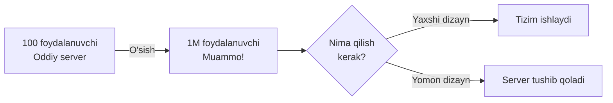
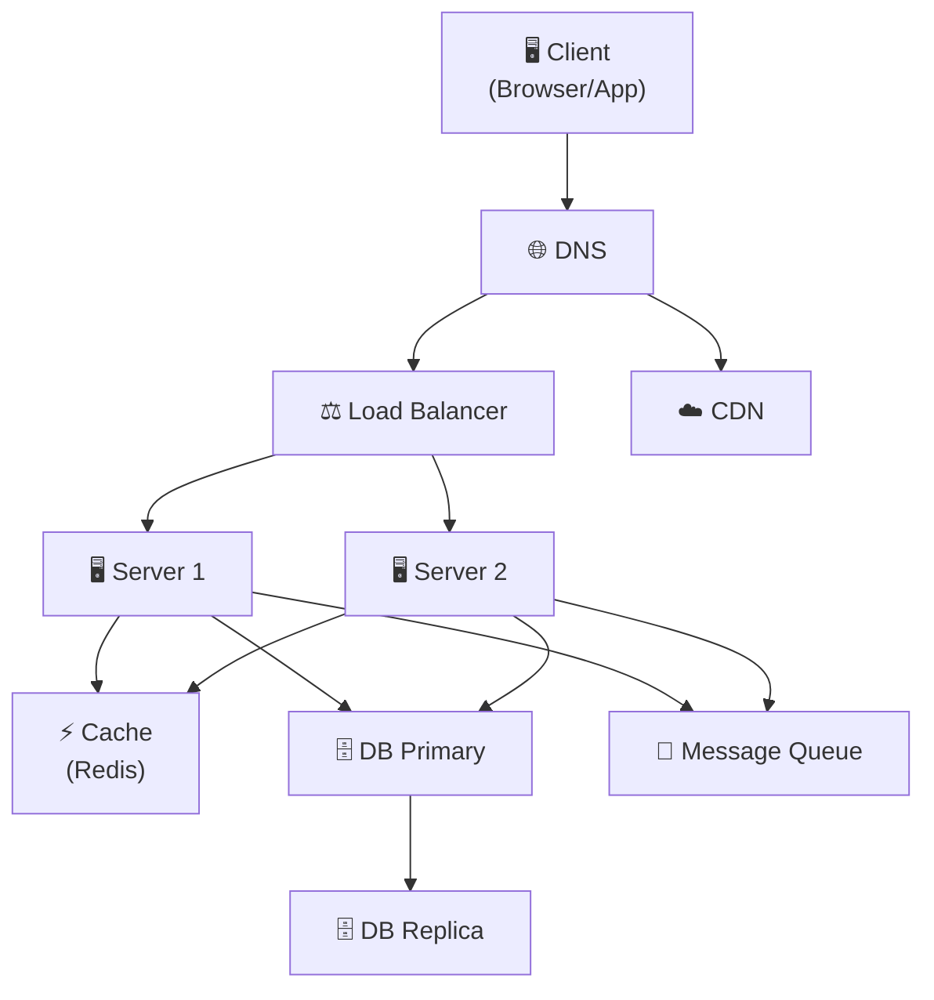
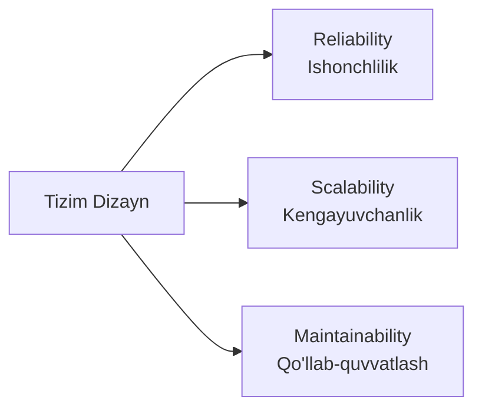
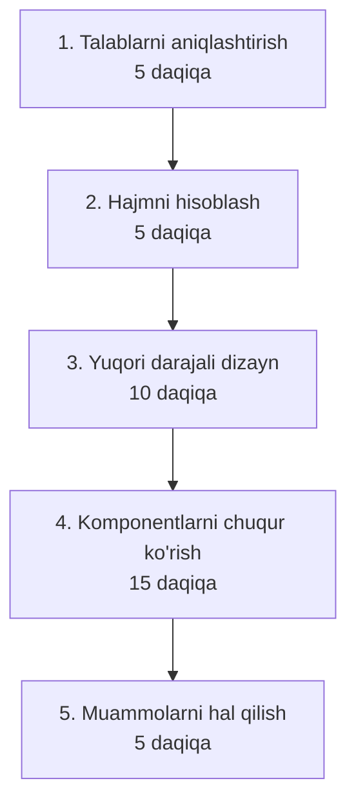

# Tizim Dizayn Nima?

## Ta'rif

**Tizim dizayn (System Design)** — katta ko'lamdagi dasturiy tizimlarni arxitektura darajasida loyihalash jarayoni.

Oddiy qilib aytganda: "Millionlab foydalanuvchiga xizmat qiladigan tizimni qanday quramiz?"

---

## Nima uchun muhim?



---

## Tizim Dizaynning Asosiy Komponentlari



---

## Tizim Dizayndagi Asosiy Savol Turlari

| Savol turi | Misol |
|-----------|-------|
| **Funksional** | Tizim nima qilishi kerak? |
| **Non-funksional** | Qanchalik tez? Qanchalik ishonchli? |
| **Kengayuvchanlik** | 10x traffic kelsa nima bo'ladi? |
| **Xatoliklarga chidamlilik** | Bitta server yiqilsa davom etadimi? |

---

## Tizim Dizaynning 3 Ustuni



### 1. Reliability (Ishonchlilik)
- Tizim doim ishlashi kerak
- Xatolik bo'lsa o'zi tiklana olishi kerak
- Ma'lumotlar yo'qolmasligi kerak

### 2. Scalability (Kengayuvchanlik)
- Foydalanuvchilar ko'paysa tizim ham o'sishi kerak
- Yukni bir necha serverga taqsimlash

### 3. Maintainability (Qo'llab-quvvatlash)
- Kodni tushunish va o'zgartirish oson bo'lishi
- Monitoring va debugging qulay bo'lishi

---

## Asosiy Ko'rsatkichlar (Metrics)

| Ko'rsatkich | Ta'rif | Yaxshi qiymat |
|-------------|--------|---------------|
| **Latency** | So'rovga javob vaqti | < 100ms |
| **Throughput** | Sekundiga so'rovlar soni | RPS/QPS |
| **Availability** | Ishlash foizi | 99.9% (3 nine) |
| **Durability** | Ma'lumotlar saqlanishi | 99.999% |

### Availability Hisoblash
```
Availability = Uptime / (Uptime + Downtime) × 100%

99%    → yiliga ~3.65 kun to'xtaydi
99.9%  → yiliga ~8.7 soat to'xtaydi
99.99% → yiliga ~52 daqiqa to'xtaydi
```

---

## Tizim Dizayn Bosqichlari (Interview uchun)



### 1. Talablarni aniqlashtirish
```
- Funksional: nima qiladi?
- Non-funksional: qanchalik katta?
- Foydalanuvchilar soni?
- Ma'lumotlar hajmi?
```

### 2. Hajmni hisoblash (Back-of-envelope)
```
DAU = 10M foydalanuvchi
Har biri kuniga 10 so'rov
= 100M so'rov/kun
= 100M / 86400 ≈ 1160 RPS o'rtacha
= 1160 × 2 ≈ 2320 RPS peak
```

### 3. Yuqori darajali arxitektura
- Asosiy komponentlarni chizing
- Client → LB → Server → DB

### 4. Chuqur ko'rish
- DB tanlash
- Kesh strategiyasi
- API dizayn

### 5. Muammolar
- Single point of failure
- Bottleneck
- Xavfsizlik

---

## Keyingi Qadam

→ [2. Scalability.md](2.%20Scalability.md) — Tizimni qanday kengaytirish mumkin?
