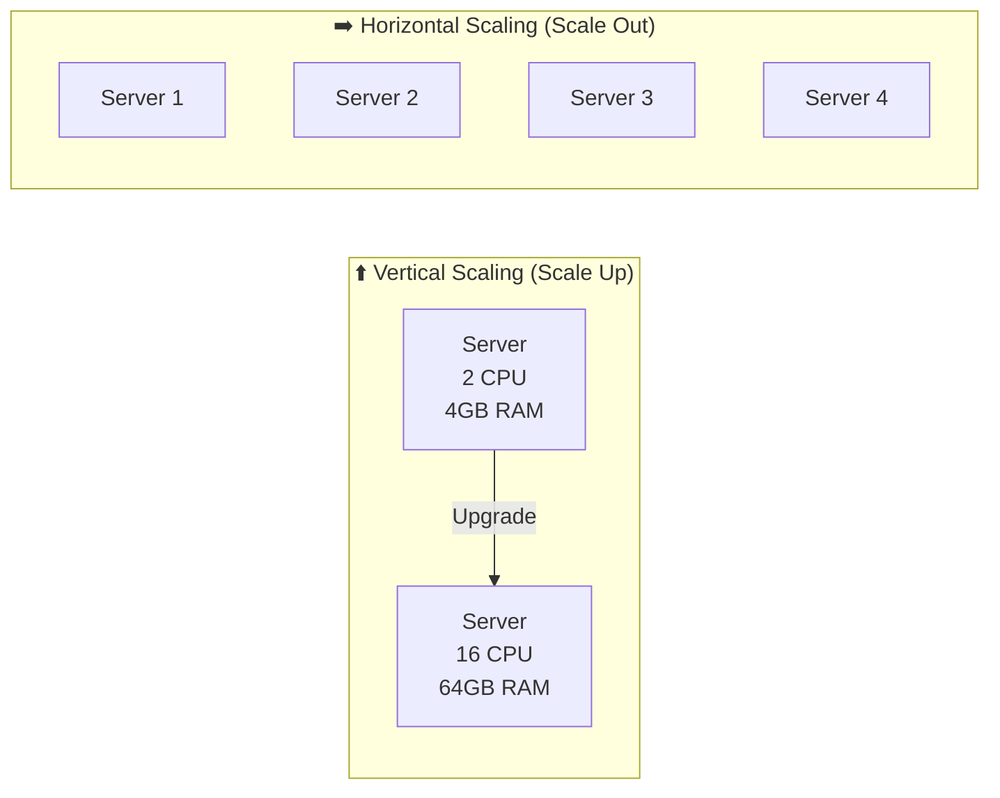
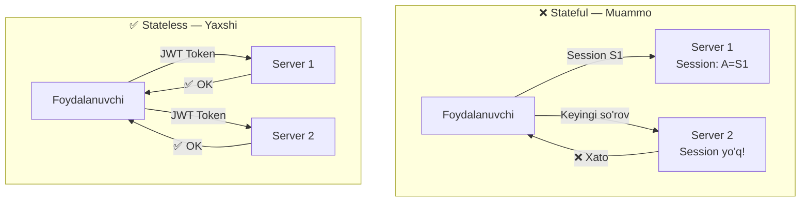
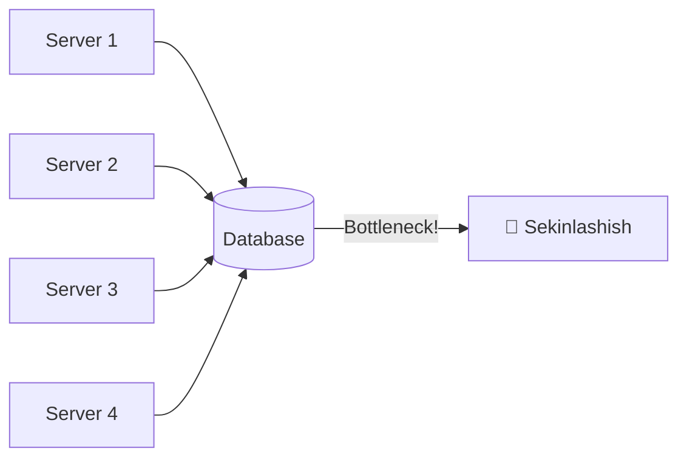
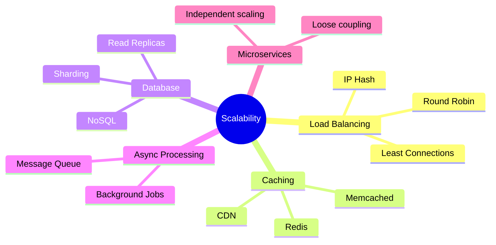
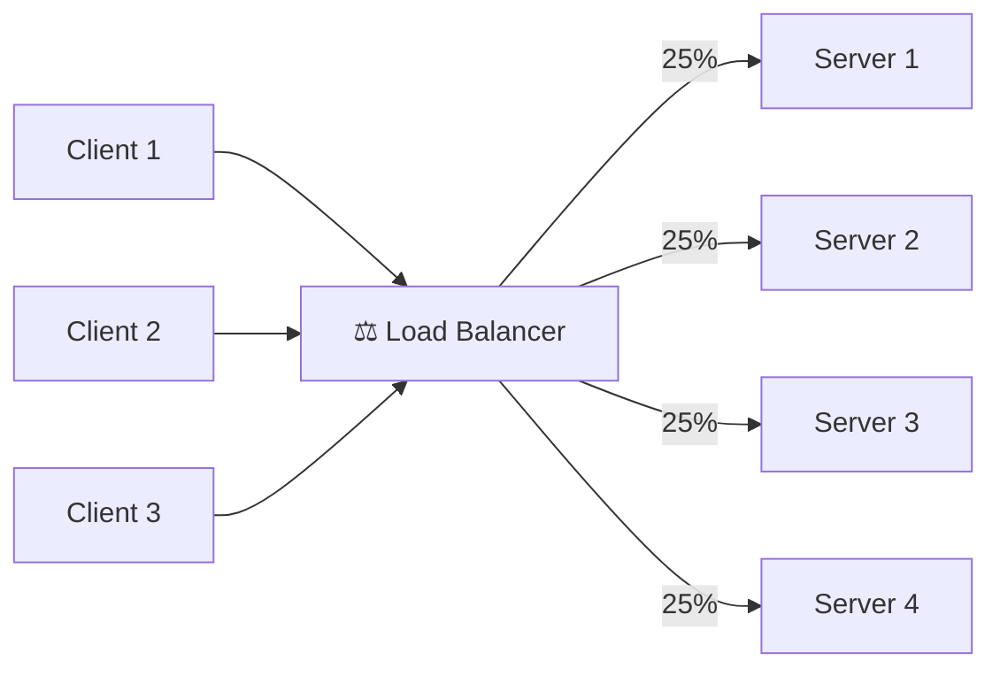
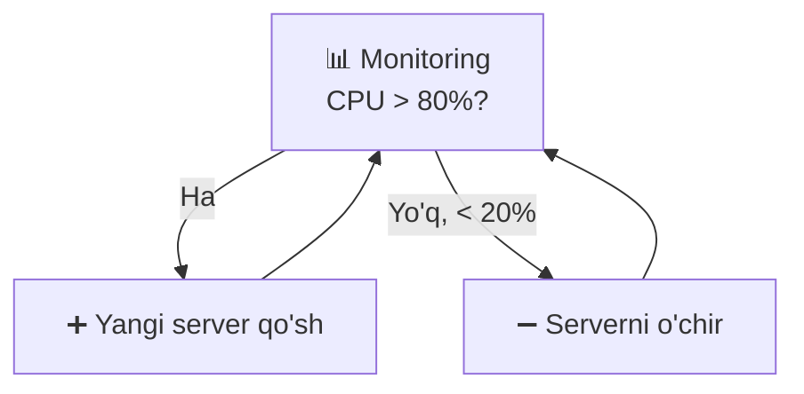

# Scalability — Kengayuvchanlik

## Ta'rif

**Scalability** — tizimning yuklama oshganda ham yaxshi ishlash qobiliyati.

---

## Ikki xil kengayish



### Vertical Scaling (Scale Up)
- **Nima:** Mavjud serverni kuchliroq qilish
- **Afzalligi:** Oson, kod o'zgarmaydi
- **Kamchiligi:** Chegara bor (eng kuchli server ham cheklangan), Single Point of Failure

### Horizontal Scaling (Scale Out)
- **Nima:** Ko'proq server qo'shish
- **Afzalligi:** Cheksiz kengayish, xatolikka chidamli
- **Kamchiligi:** Murakkablik oshadi (distribusiya, konsistentlik)

---

## Taqqoslash

| | Vertical | Horizontal |
|--|----------|------------|
| **Narx** | Qimmat (limit bor) | Arzonroq (oddiy serverlar) |
| **Murakkablik** | Past | Yuqori |
| **Chegara** | Bor (max hardware) | Yo'q (cheksiz) |
| **Downtime** | Upgrade paytida | Yo'q |
| **Foydalanish** | Kichik tizimlar | Katta tizimlar |

---

## Scalability Muammolari

### 1. Stateful vs Stateless



**Stateless** arxitektura yarating:
- Session ma'lumotlarini Redis'da saqlang
- JWT token ishlating
- Har bir so'rov o'zida barcha kerakli ma'lumotni olib kelsin

### 2. Database Bottleneck



**Yechim:** Read Replica, Sharding, Caching

---

## Kengayuvchanlik Strategiyalari



---

## Load Balancing



### Algoritmlar

| Algoritm | Qanday ishlaydi | Qachon |
|----------|-----------------|--------|
| **Round Robin** | Navbat bilan | Bir xil serverlar |
| **Weighted Round Robin** | Og'irlik bo'yicha | Har xil kuchli serverlar |
| **Least Connections** | Kam ulanish bor serverga | Uzoq so'rovlar |
| **IP Hash** | IP bo'yicha aniq server | Session kerak bo'lganda |

---

## Go'da Oddiy Load Balancer

```go
package main

import (
    "fmt"
    "sync/atomic"
)

type LoadBalancer struct {
    servers []string
    counter uint64
}

func NewLoadBalancer(servers []string) *LoadBalancer {
    return &LoadBalancer{servers: servers}
}

// Round Robin
func (lb *LoadBalancer) NextServer() string {
    idx := atomic.AddUint64(&lb.counter, 1) % uint64(len(lb.servers))
    return lb.servers[idx]
}

func main() {
    lb := NewLoadBalancer([]string{
        "server1:8080",
        "server2:8080",
        "server3:8080",
    })

    for i := 0; i < 6; i++ {
        fmt.Printf("So'rov %d → %s\n", i+1, lb.NextServer())
    }
}

// Natija:
// So'rov 1 → server2:8080
// So'rov 2 → server3:8080
// So'rov 3 → server1:8080
// So'rov 4 → server2:8080
// ...
```

---

## Auto-scaling



**Qoidalar:**
- CPU > 80% → server qo'sh
- CPU < 20% → server o'chir
- Min: 2 server (HA uchun)
- Max: 10 server (narx cheklov)

---

## Amaliy Masala

> Sizda 1000 RPS keltiruvchi tizim bor. Har bir server 200 RPS ko'tara oladi.
> Nechta server kerak?

```
Kerakli serverlar = 1000 / 200 = 5 server
+ 20% buffer = 6 server
+ 1 ta zaxira = 7 server
```

---

## Keyingi Qadam

→ [3. Load Balancing.md](3.%20Load%20Balancing.md) — Load Balancer chuqurroq
