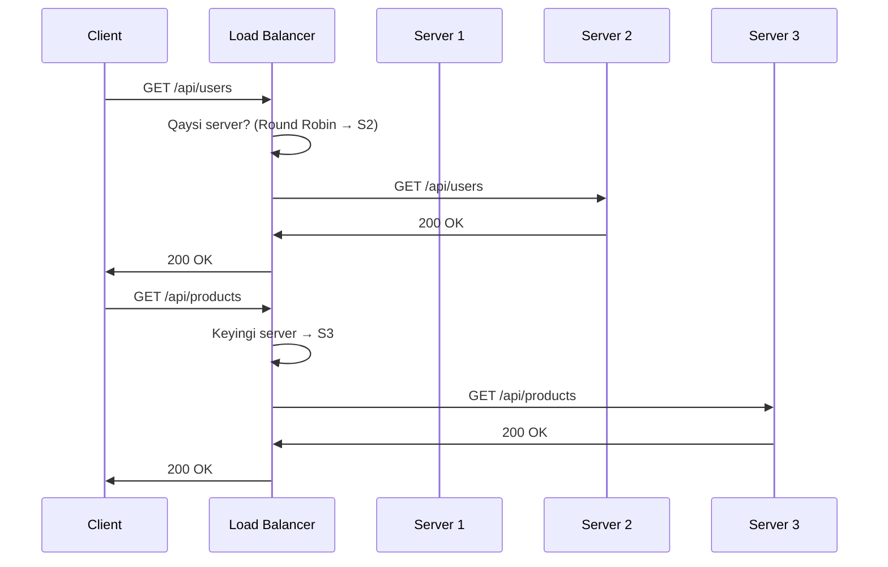
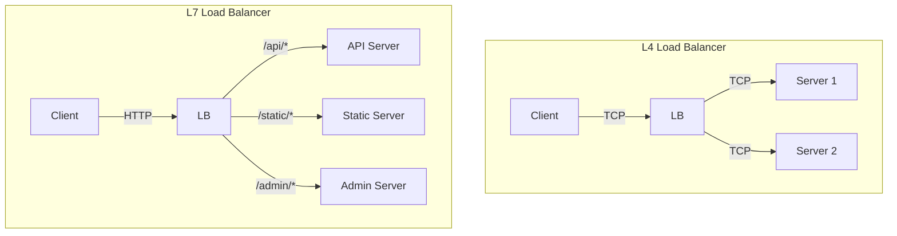
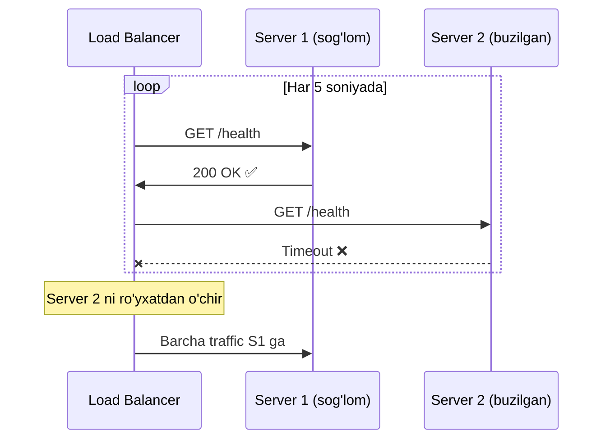
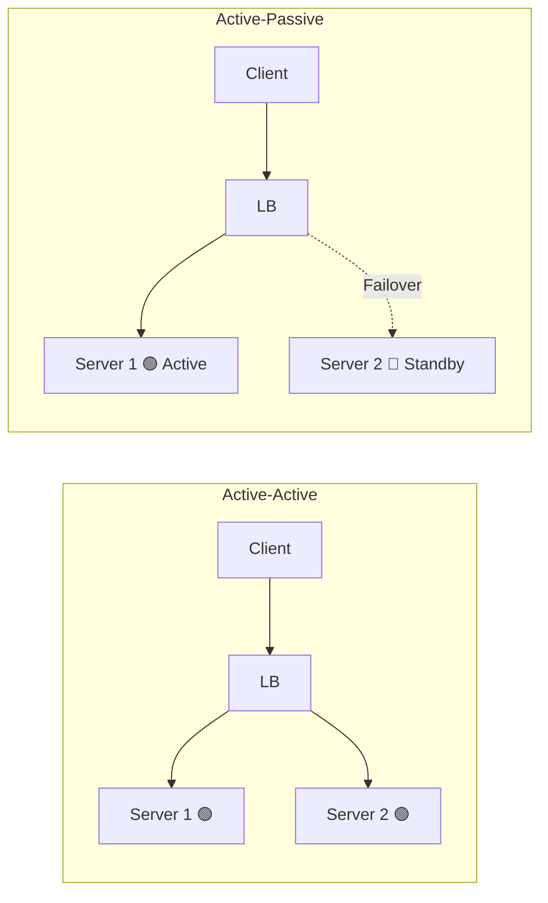

# Load Balancing

## Ta'rif

**Load Balancer** — kiruvchi trafikni bir necha server o'rtasida taqsimlovchi komponent.

---

## Qanday Ishlaydi



---

## Load Balancer Turlari

### L4 (Transport Layer)
- TCP/UDP darajasida ishlaydi
- Tezroq, ammo aqlli emas
- IP va port bo'yicha yo'naltiradi

### L7 (Application Layer)
- HTTP darajasida ishlaydi
- URL, header, cookie bo'yicha yo'naltirishi mumkin
- SSL termination qila oladi



---

## Algoritmlar

### Round Robin
```
So'rovlar: 1, 2, 3, 4, 5, 6
Serverlar: A, B, C

1 → A
2 → B
3 → C
4 → A
5 → B
6 → C
```

### Weighted Round Robin
```
Server A: og'irlik 3 (kuchli)
Server B: og'irlik 2
Server C: og'irlik 1 (kuchsiz)

A, A, A, B, B, C, A, A, A, B, B, C, ...
```

### Least Connections
```
Server A: 100 faol ulanish
Server B: 50 faol ulanish  ← yangi so'rov shu yerga
Server C: 80 faol ulanish
```

### IP Hash
```
Client IP: 192.168.1.100
Hash(192.168.1.100) % 3 = 1 → Server B (har doim!)

Xuddi shu foydalanuvchi → xuddi shu server
(sticky session muammosini hal qiladi)
```

---

## Health Check



---

## Go'da Health Check bilan Load Balancer

```go
package main

import (
    "fmt"
    "net/http"
    "sync"
    "sync/atomic"
    "time"
)

type Server struct {
    URL     string
    Healthy bool
    mu      sync.RWMutex
}

func (s *Server) IsHealthy() bool {
    s.mu.RLock()
    defer s.mu.RUnlock()
    return s.Healthy
}

func (s *Server) SetHealthy(v bool) {
    s.mu.Lock()
    defer s.mu.Unlock()
    s.Healthy = v
}

type LoadBalancer struct {
    servers []*Server
    counter uint64
}

func (lb *LoadBalancer) healthCheck(server *Server) {
    resp, err := http.Get(server.URL + "/health")
    if err != nil || resp.StatusCode != 200 {
        server.SetHealthy(false)
        fmt.Printf("❌ %s - sog'lom emas\n", server.URL)
        return
    }
    server.SetHealthy(true)
}

func (lb *LoadBalancer) StartHealthChecks(interval time.Duration) {
    go func() {
        for {
            for _, s := range lb.servers {
                go lb.healthCheck(s)
            }
            time.Sleep(interval)
        }
    }()
}

func (lb *LoadBalancer) NextServer() *Server {
    for range lb.servers {
        idx := atomic.AddUint64(&lb.counter, 1) % uint64(len(lb.servers))
        if lb.servers[idx].IsHealthy() {
            return lb.servers[idx]
        }
    }
    return nil // barcha serverlar ishlamayapti
}
```

---

## Active-Active vs Active-Passive



| | Active-Active | Active-Passive |
|--|--------------|----------------|
| **Resurslar** | Hammasi ishlaydi | Biri standby |
| **Narx** | Samarali | Isrof |
| **Failover** | Tez | Kechroq |
| **Capacity** | 2x | 1x |

---

## Nginx Load Balancer Konfiguratsiyasi

```nginx
upstream backend {
    least_conn;  # algoritm

    server server1.example.com weight=3;
    server server2.example.com weight=2;
    server server3.example.com weight=1;

    keepalive 32;
}

server {
    listen 80;

    location / {
        proxy_pass http://backend;
        proxy_set_header Host $host;
        proxy_set_header X-Real-IP $remote_addr;
    }

    location /health {
        return 200 "OK";
    }
}
```

---

## Keyingi Qadam

→ [../2. Ma'lumotlar Saqlash/1. SQL vs NoSQL.md](../2.%20Ma'lumotlar%20Saqlash/1.%20SQL%20vs%20NoSQL.md)
