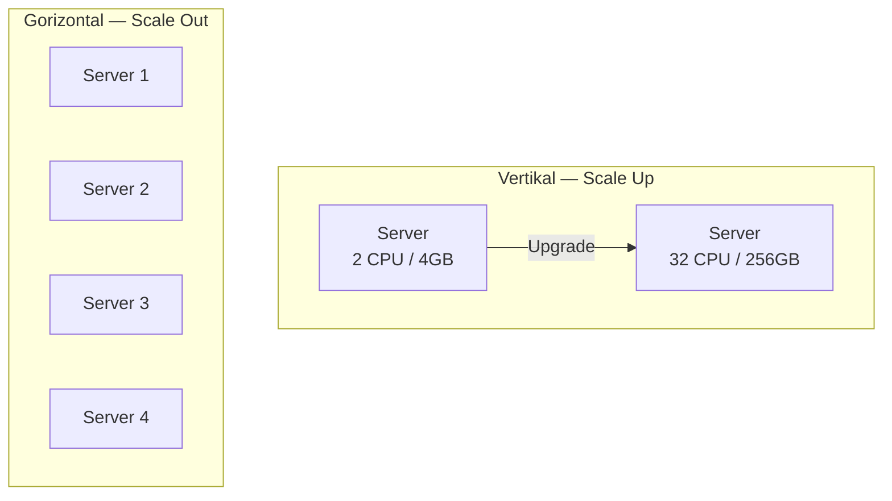
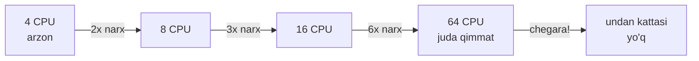
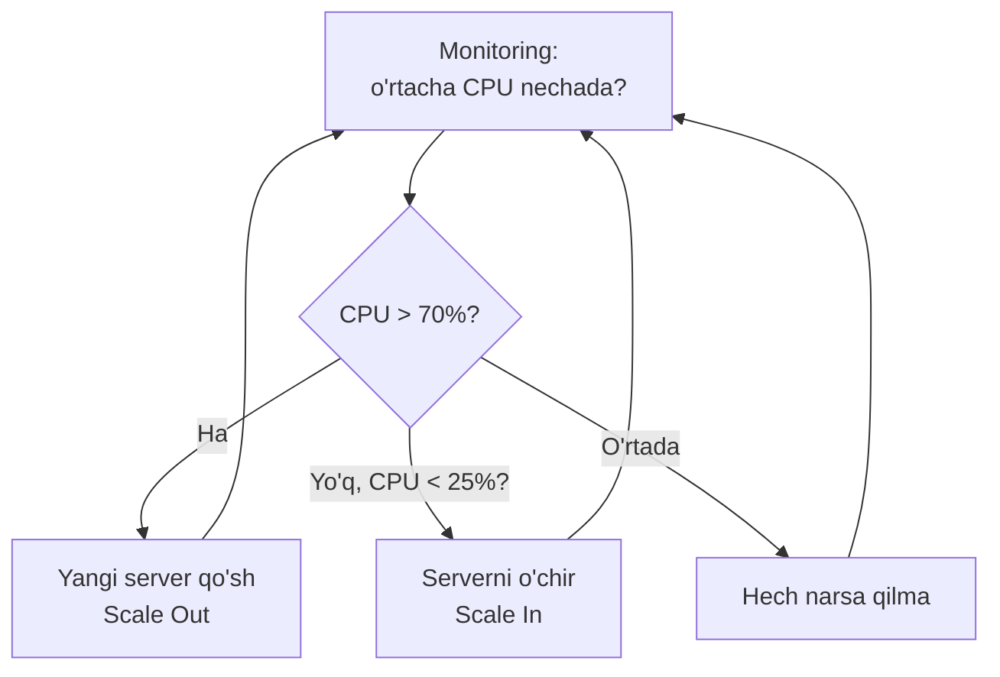
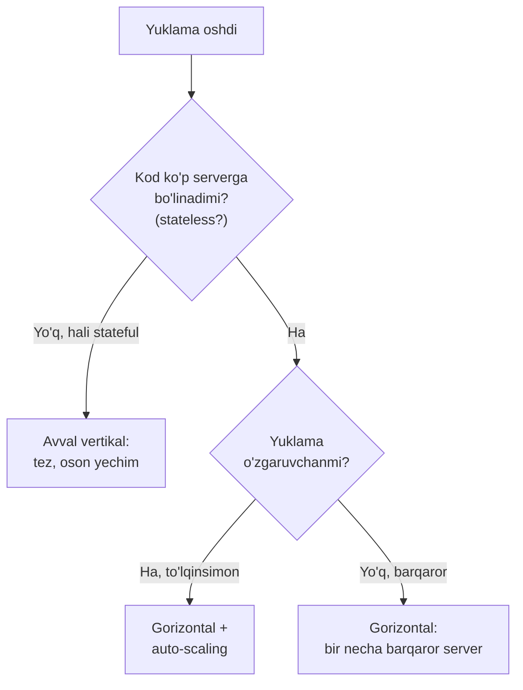

# Vertikal va Gorizontal Kengayish

> **Modul 2 — Kengayish usullari, 1-dars**
> Maqsad: bitta serverga sig'may qolgan yuklamani qanday "kengaytirish" mumkinligini tushunish.

---

## 1. Muammo — nega bu kerak?

Tasavvur qil: sen bitta serverda ishlaydigan onlayn do'kon yozding. Boshida kuniga 100 kishi kiradi — hammasi zo'r.

Keyin reklama chiqdi, do'koning mashhur bo'ldi. Endi bir vaqtning o'zida **50 000 kishi** sahifani ochyapti. Server CPU'si 100% ga chiqadi, RAM to'ladi, so'rovlar navbatda qotib qoladi. Sahifa 30 soniyada ochiladi yoki umuman ochilmaydi.

Bitta server bor kuchini sarflab bo'ldi. Endi ikki yo'l bor: yo **shu serverni kuchaytirish**, yo **ko'proq server qo'shish**. Mana shu ikki yo'l — vertikal va gorizontal kengayish.

> **Diqqat:** Bu modul boshidan oxirigacha bitta savolga javob beradi — "millionlab odam kirganda tizim qanday tik turadi?"

---

## 2. Analogiya — restoran

Restoraningga mijozlar sig'may ketyapti. Ikki yechim bor:

| Yo'l | Restoran misolida | Serverda |
|------|-------------------|----------|
| **Vertikal** | Bitta oshxonani kattalashtirish: kuchliroq pech, ko'proq stol | Serverga ko'proq CPU, RAM qo'shish |
| **Gorizontal** | Yangi filiallar ochish: shaharning har yerida bittadan restoran | Ko'proq server qo'shish |

Kuchliroq pech olish oson — retsept o'zgarmaydi. Lekin bir kun kelib bozordagi eng katta pechni ham sotib olasan, undan kattasi yo'q. Filial ochish esa murakkabroq (menejer, yetkazib berish, umumiy ombor kerak), lekin cheksiz o'sish imkonini beradi.

> **Analogiya chegarasi:** Restoran filiallari bir-biridan mustaqil ishlaydi. Serverlar esa ko'pincha bitta umumiy ma'lumotlar bazasiga ulanadi — shuning uchun "cheksiz o'sish" faqat serverlar *mustaqil* (stateless) bo'lgandagina to'g'ri. Buni 3-darsda ko'ramiz.

---

## 3. Sodda ta'rif

- **Vertikal kengayish (Scale Up)** — mavjud bitta serverning resurslarini (CPU, RAM, disk) oshirish.
- **Gorizontal kengayish (Scale Out)** — tizimga yangi serverlar qo'shib, yukni ular orasida bo'lish.

Bitta so'z bilan: vertikal = *balandroq*, gorizontal = *kengroq*.

---

## 4. Diagramma



Vertikal — bitta quti kattalashadi. Gorizontal — qutilar soni ko'payadi.

---

## 5. Worked example — 12 000 RPS ni qanday ushlaymiz?

Vaziyat: tizimingga **12 000 RPS** (requests per second — soniyasiga so'rovlar soni) kelyapti. Bitta oddiy server 2 000 RPS ni bemalol ko'taradi.

```text
--- 1-qadam: gorizontal yechim — nechta server kerak? ---
Kerakli server = 12 000 / 2 000 = 6 ta

--- 2-qadam: zaxira qo'shamiz (bittasi buzilsa qolganlari ko'tarsin) ---
6 + 20% buffer = 8 ta server

--- 3-qadam: vertikal yechim bilan solishtiramiz ---
Bitta ulkan serverga 12 000 RPS yuklaymiz.
Ishlaydi... lekin u buzilsa — BUTUN tizim o'ladi (Single Point of Failure).
```

**Xulosa:** 8 ta o'rtacha server 1 ta ulkan serverdan xavfsizroq — bittasi yiqilsa, qolgan 7 tasi ishlashda davom etadi.

> **Single Point of Failure (SPOF)** — tizimning shunday bir qismiki, u ishdan chiqsa butun tizim to'xtaydi. Vertikal kengayishning eng katta zaifligi shu.

### Vertikalning fizik chegarasi

Vertikal kengayish istagancha davom etmaydi. Dunyodagi eng kuchli serverda ham CPU yadrolari, RAM slotlari cheklangan. Bir nuqtaga yetganda:



Diqqat qil: har ikki barobar kuchga narx ikki barobardan ko'proq oshadi. Oxirida esa umuman devorga urilasan — bozorda undan kuchli server yo'q.

---

## 6. Predict savoli (PRIMM)

Vaziyat: sen "Black Friday" chegirmalariga tayyorgarlik ko'ryapsan. Trafik bir kunga 10 barobar oshadi, keyin normaga qaytadi.

> 🤔 **O'ylab ko'r:** Bu holatda vertikal kengayish (ulkan server sotib olish) yaxshi tanlovmi? Nega?

<details>
<summary>💡 Javobni ko'rish</summary>

Yo'q, yomon tanlov. Sabablari:

1. **Isrof** — ulkan serverni sotib olsang, u yiliga 364 kun bo'sh turadi, faqat 1 kun kerak bo'ladi. Puling havoga uchadi.
2. **Vaqt** — server upgrade qilish (yoki yangisini olib, ko'chirish) soatlab yoki kunlab vaqt oladi. Black Friday'da bunga vaqt yo'q.

To'g'ri yechim — **gorizontal + auto-scaling**: bayram kuni bulutda (cloud) avtomatik 10 barobar server ochib, ertasiga o'chirib qo'yish. Faqat ishlatgan soatingga to'laysan.

</details>

---

## 7. Ko'p uchraydigan xatolar

⚠️ **Xato 1: "Gorizontal har doim yaxshiroq."**
Noto'g'ri tasavvur — ko'p server = doim yaxshi. Aslida kichik tizim uchun gorizontal ortiqcha murakkablik keltiradi (load balancer, sinxronizatsiya, network xarajatlari). To'g'risi: kichik loyihada avval vertikal — arzon va oddiy; chegaraga yaqinlashganda gorizontalga o't.

⚠️ **Xato 2: "Server qo'shsam, tizim avtomatik 2x tez bo'ladi."**
Noto'g'ri — 2 server = 2x tezlik degani emas. Agar serverlar bitta sekin ma'lumotlar bazasiga ulansa, DB "bo'g'iz" (bottleneck) bo'lib qoladi va yangi serverlar behuda kutadi. To'g'risi: kengayishni butun zanjir bo'ylab o'ylash kerak (DB, cache, tarmoq).

⚠️ **Xato 3: "Bitta ulkan server hamma muammoni yechadi."**
Noto'g'ri — u SPOF bo'lib qoladi. To'g'risi: ishonchlilik (reliability) uchun kamida 2 ta server kerak, hatto yuklama kichik bo'lsa ham.

---

## Auto-scaling — o'z-o'zidan kengayish

Gorizontal kengayishning eng kuchli tarafi — uni **avtomatlashtirish** mumkin. Auto-scaling tizimni kuzatib turadi va kerak bo'lganda o'zi server qo'shadi yoki o'chiradi.



Odatiy qoidalar:
- **CPU > 70%** bir necha daqiqa davom etsa → server qo'sh
- **CPU < 25%** bo'lsa → ortiqcha serverni o'chir (pulni tejash)
- **Min = 2** server (SPOF bo'lmasligi uchun har doim ikkita)
- **Max = 20** server (byudjet cheklovi — cheksiz pul yo'q)

Bu faqat gorizontalda ishlaydi: serverni "qo'shib-o'chirib" bo'ladi, lekin serverga RAM ni avtomatik "qo'shib-olib" bo'lmaydi.

---

## Qachon qaysi biri?



| Mezon | Vertikal | Gorizontal |
|-------|----------|------------|
| **Narx** | Boshida arzon, oxirida qimmat | O'rtacha, bashoratli |
| **Chegara** | Bor (eng kuchli server) | Amalda cheksiz |
| **Murakkablik** | Past (kod o'zgarmaydi) | Yuqori (LB, sinxronizatsiya) |
| **Downtime** | Upgrade paytida bor | Yo'q (bittalab qo'shasan) |
| **SPOF** | Ha (bitta server) | Yo'q (ko'p server) |
| **Auto-scaling** | Deyarli mumkin emas | Oson |
| **Mos** | Kichik tizim, tez start | Katta, o'sadigan tizim |

**Amaliy qoida:** loyihani vertikal bilan boshla (oddiy), lekin kodni gorizontalga *tayyor* qilib yoz (stateless). Yuklama chegaraga yaqinlashganda gorizontalga bir zarbda o'tasan.

---

## Xulosa

- **Vertikal kengayish** — bitta serverni kuchaytirish; oson, lekin fizik chegarasi va SPOF muammosi bor.
- **Gorizontal kengayish** — server qo'shish; murakkabroq, lekin amalda cheksiz va xatolarga chidamli.
- Vertikal narxi kuch oshgani sari keskin qimmatlashadi; gorizontal narxi chiziqli va bashoratli.
- **SPOF** — vertikalning eng katta zaifligi; bitta server yiqilsa hammasi to'xtaydi.
- Gorizontalni **auto-scaling** bilan avtomatlashtirish mumkin — yuklamaga qarab server o'zi qo'shiladi/o'chadi.
- Server qo'shish o'z-o'zidan tezlik bermaydi — butun zanjir (DB, cache) bo'g'iz bo'lmasligi kerak.

## 🧠 Eslab qol

- Vertikal = *balandroq*, gorizontal = *kengroq*.
- Bitta serverning fizik chegarasi bor; server soni chegarasi amalda yo'q.
- Bitta ulkan server = bitta katta xavf (SPOF).
- Auto-scaling faqat gorizontalda ishlaydi.
- Kichikda vertikaldan boshla, kattada gorizontalga o't.

## ✅ O'z-o'zini tekshir (retrieval practice)

**1.** Nega bitta juda kuchli server o'rniga bir necha o'rtacha server ishonchliroq?

<details>
<summary>Javob</summary>

Chunki bitta kuchli server **SPOF** — u yiqilsa butun tizim o'ladi. Bir necha server bo'lsa, bittasi buzilganda qolganlari xizmatni davom ettiradi. Ishonchlilik (reliability) resurs miqdoridan emas, ularning *taqsimlanganidan* keladi.

</details>

**2.** Yuklama bir kunga 10x oshib, keyin normaga qaytadigan bo'lsa, nega vertikal yomon tanlov?

<details>
<summary>Javob</summary>

Ulkan serverni sotib olsang u qolgan kunlar bo'sh turadi (isrof), qolaversa upgrade sekin bo'lib, cho'qqi (peak) vaqtida ulgurmaysan. Gorizontal + auto-scaling esa faqat kerak bo'lganda server ochib, keyin o'chiradi — pul tejaladi.

</details>

**3.** "2 ta server qo'shdim, endi tizim 2 barobar tez" — bu gap nega har doim to'g'ri emas?

<details>
<summary>Javob</summary>

Agar serverlar bitta sekin ma'lumotlar bazasiga ulansa, DB bo'g'iz (bottleneck) bo'lib qoladi. Yangi serverlar DB javobini kutib behuda turadi. Tezlik butun zanjirdagi eng sekin bo'g'inga bog'liq, faqat server soniga emas.

</details>

**4.** Auto-scaling'da nega "min = 2 server" qilib qo'yiladi, hatto trafik juda kam bo'lsa ham?

<details>
<summary>Javob</summary>

SPOF bo'lmasligi uchun. Agar min = 1 bo'lsa va o'sha yagona server buzilsa, auto-scaling yangisini ochguncha tizim to'liq ishlamay turadi. 2 server har doim zaxira bo'lib turadi.

</details>

## 🛠 Amaliyot

**1. Oson (savol/diagramma):**
Yuqoridagi auto-scaling flowchart'ini qog'ozga o'zing chizib chiq. Uchta holatni (qo'sh / o'chir / kutib tur) va ularning shartlarini yoddan yoz.

<details>
<summary>Hint</summary>

Markazda "Monitoring" bo'ladi, undan bitta shart (CPU nechada?) chiqadi, u uch tomonga bo'linadi va har uchalasi qayta Monitoring'ga qaytadi (halqa).

</details>

**2. O'rta (kamchilikni top):**
Bir jamoa shunday dizayn qildi: "1 ta 128 CPU'li ulkan server, u to'g'ridan-to'g'ri 1 ta ma'lumotlar bazasiga ulanadi. Yuklama oshsa serverni yana kuchaytiraveramiz." Bu dizaynda kamida 2 ta jiddiy kamchilik bor — top.

<details>
<summary>Hint</summary>

(1) Ulkan server ham, DB ham — ikkalasi ham SPOF. (2) Vertikalning fizik chegarasi bor — bir kun kuchaytirishning imkoni qolmaydi. (3) Bunda downtime bor (har upgrade'da to'xtatish kerak).

</details>

**3. Qiyin (kichik dizayn masalasi):**
Video streaming servisi dizayn qil. Kunduzi 500 000 foydalanuvchi, kechasi 20 000. Har server 5 000 foydalanuvchi ko'taradi. Kunduz va kecha uchun nechta server kerak? Qanday mexanizm serverlarni avtomatik boshqaradi? Byudjetni qanday tejaysan?

<details>
<summary>Hint</summary>

Kunduzi 500000/5000 = 100 server (+ buffer). Kechasi 20000/5000 = 4 server. Farq juda katta — demak **auto-scaling** shart. Min = 4-6, Max = 120 qo'y; CPU/foydalanuvchi soniga qarab kunduzi ko'tarilib, kechasi tushsin. Tejash: kechasi 100 emas 4 server ishlaydi.

</details>

## 🔁 Takrorlash

**Bog'liq oldingi mavzular:**
- [1-modul: Kompyuter anatomiyasi](../1-tizimlar-negizi/01-kompyuter-anatomiyasi.md) — CPU, RAM nima ekanini eslab ol; vertikal kengayish aynan shularni oshiradi.

**Takrorlash jadvali:**
- **Ertaga:** "O'z-o'zini tekshir" 1 va 3-savollarga qaytib javob ber.
- **3 kundan keyin:** vertikal/gorizontal taqqoslash jadvalini yoddan tikla.
- **1 haftadan keyin:** amaliyotning "qiyin" masalasini qaytadan yech.

**Feynman testi:** Do'stingga "vertikal va gorizontal kengayish farqini" kod va texnik atamalarsiz, faqat restoran misolida 3 jumlada tushuntirib ber. Uddasidan chiqsang — tushund ing.

**Keyingi dars:** [02-load-balancing.md](./02-load-balancing.md) — gorizontal kengaydik, endi trafikni serverlar orasida kim taqsimlaydi?
