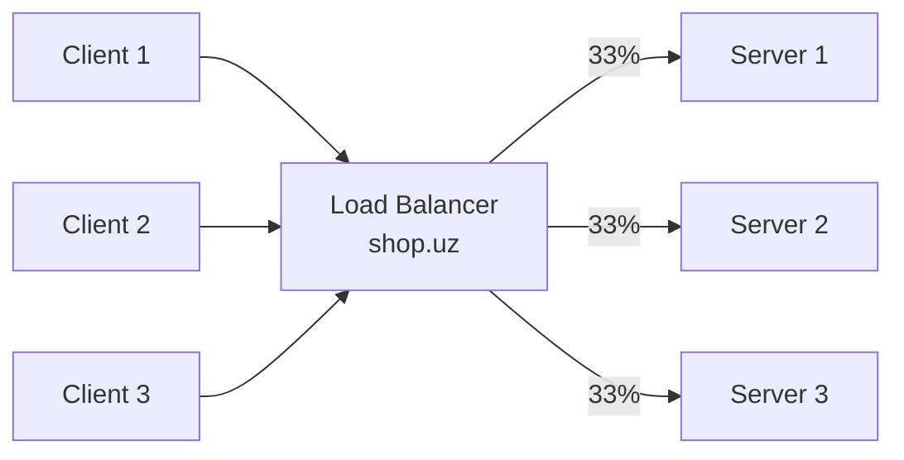
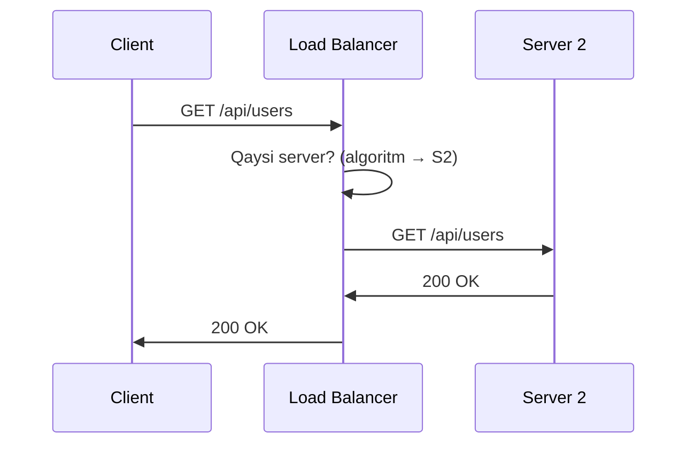
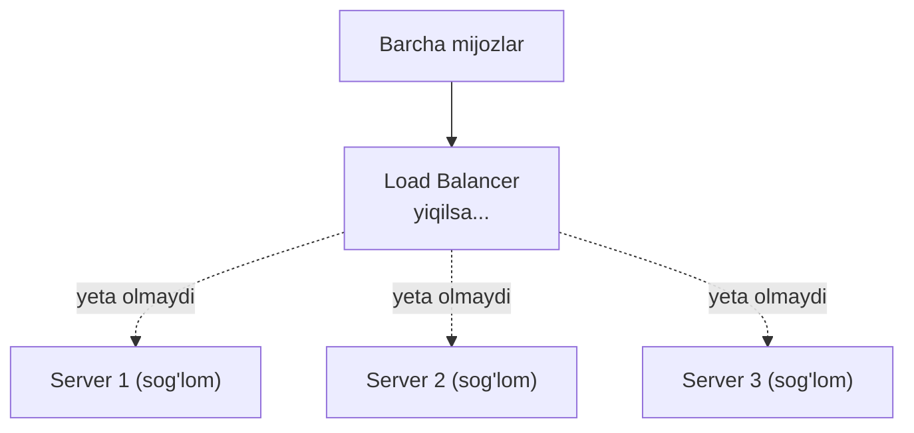
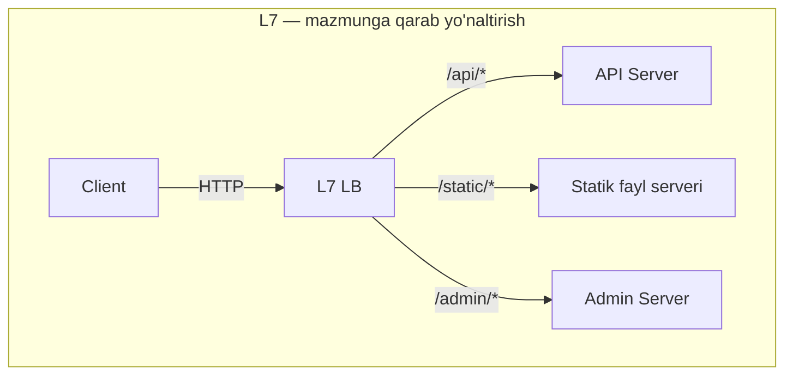
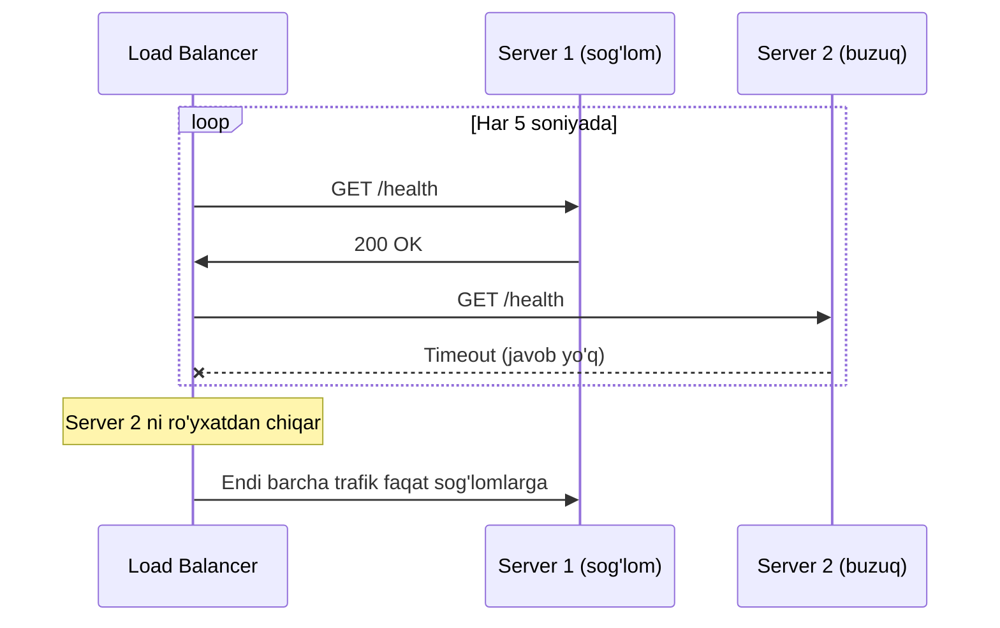
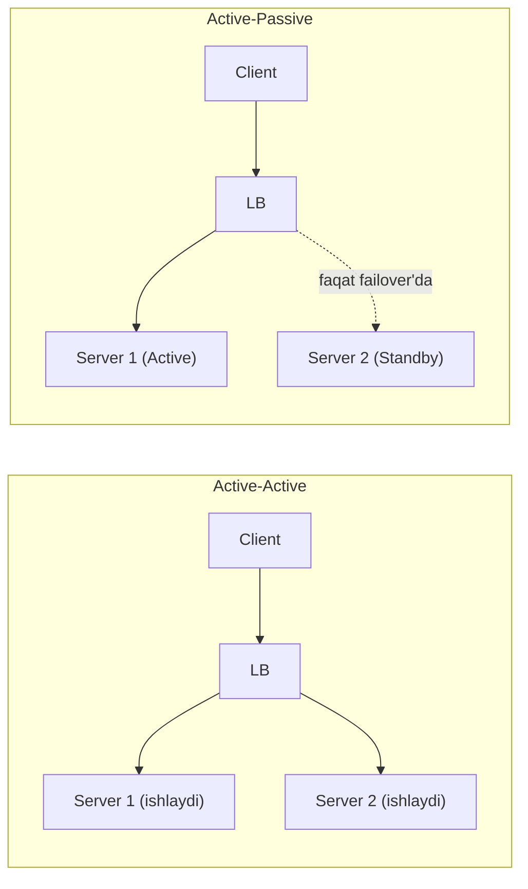

# Load Balancing — yukni taqsimlash

> **Modul 2 — Kengayish usullari, 2-dars**
> Maqsad: gorizontal kengayganingdan keyin trafikni serverlar orasida qanday adolatli va ishonchli bo'lish mumkinligini tushunish.

---

## 1. Muammo — nega bu kerak?

O'tgan darsda gorizontal kengaydik: bitta emas, endi 6 ta serverimiz bor. Ajoyib. Lekin bitta savol tug'iladi — **foydalanuvchi qaysi serverga ulanadi?**

Agar foydalanuvchilarga "sen server-1'ga bor, sen server-2'ga bor" deb qo'lda aytadigan bo'lsak, bu bema'nilik. Va yana yomoni: agar hamma `server1.example.com` manzilini yodlab olsa, hamma bitta serverga yopishadi — qolgan 5 tasi bo'sh turadi, birinchisi esa yonib ketadi.

Kerak: bitta **umumiy manzil**, uning orqasida yashiringan serverlar, va kimdir yukni ular orasida oqilona bo'lib bersin. Mana shu "kimdir" — **Load Balancer**.

---

## 2. Analogiya — supermarketdagi navbat boshqaruvchi

Supermarketda 6 ta kassa ochiq. Agar har kim o'zi kassa tanlasa, hamma bitta kassaga yig'iladi, qolganlari bo'sh turadi.

Shuning uchun kirishda bitta **navbat boshqaruvchi** turadi: "Siz — 3-kassaga, siz — 1-kassaga". U kassalarni kuzatib turadi: qaysi biri bo'sh, qaysi biri band, qaysi biri umuman yopilib qolgan.

**Load Balancer** — aynan shu navbat boshqaruvchi. Mijoz (client) uni ko'radi, orqadagi kassalarni (serverlarni) ko'rmaydi.

> **Analogiya chegarasi:** Navbat boshqaruvchi bitta odam — u charchashi, kasal bo'lishi mumkin (ya'ni LB'ning o'zi ham SPOF bo'lishi mumkin). Buni pastda ko'ramiz.

---

## 3. Sodda ta'rif

**Load Balancer (LB)** — kiruvchi trafikni bir necha server o'rtasida taqsimlab, hech biri ortiqcha yuklanmasligini ta'minlaydigan komponent.

Mijoz uchun LB — bitta manzil (masalan `shop.uz`). Orqada nechta server borligi mijozga ko'rinmaydi.

---

## 4. Diagramma — LB qanday joylashadi



Mijozlar faqat LB'ni ko'radi. LB esa yukni teng bo'ladi.

### So'rovning to'liq yo'li



---

## Single Point of Failure — LB'ning o'zi-chi?

Bir daqiqa to'xta. Biz serverlarni ko'paytirdik, lekin endi **hamma trafik bitta LB'dan o'tyapti**. LB yiqilsa — hamma serverlar sog'lom bo'lsa ham, hech kim ularga yeta olmaydi. Ya'ni LB yangi SPOF bo'lib qoldi.



**Yechim:** LB'ni ham ikkita qilish — bittasi asosiy (active), ikkinchisi zaxira (standby). Asosiysi yiqilsa, zaxirasi bir soniyada uning o'rnini egallaydi (failover). Bu qoidaning umumiy shakli: *tizimda bitta ham SPOF qolmasin*.

---

## 5. L4 va L7 — LB qaysi darajada ishlaydi?

LB trafikni qanday "o'qishiga" qarab ikki turga bo'linadi. Buni tushunish uchun 1-moduldagi **OSI qatlamlarini** eslash kerak: L4 — transport (TCP/UDP), L7 — ilova (HTTP).

| | **L4 (Transport)** | **L7 (Application)** |
|--|--------------------|----------------------|
| **Qaysi darajada** | TCP/UDP — IP va port | HTTP — URL, header, cookie |
| **Nimani ko'radi** | "Bu paket 443-portga ketyapti" | "Bu `GET /video` so'rovi" |
| **Tezlik** | Juda tez (mazmunni ochmaydi) | Sekinroq (so'rovni o'qiydi) |
| **Aqli** | Kam — faqat yo'naltiradi | Ko'p — mazmunga qarab qaror qiladi |
| **Misol** | O'yin serveri, bazaviy TCP | Web sayt, mikroservislar |

**L4** — konvert ustidagi manzilga qarab xat tashlaydigan pochtachi. Ichini ochib o'qimaydi, tez ishlaydi.

**L7** — xatni ochib o'qiydigan kotib: "Bu shikoyat — yuridik bo'limga, bu buyurtma — sotuv bo'limiga". Sekinroq, lekin ancha aqlli.



L7 ana shunday "aqlli marshrutlash" (routing) qila oladi — chunki u so'rov *mazmunini* ko'radi. L4 buni qila olmaydi.

---

## 6. Taqsimlash algoritmlari — LB qaysi serverni tanlaydi?

Bu darsning yuragi. LB har so'rovda "qaysi serverga?" degan qarorni qanday qabul qiladi? Bir necha strategiya bor, har biri o'z o'rnida yaxshi.

### a) Round Robin — navbat bilan

Serverlarni doira bo'ylab navbatma-navbat tanlaydi: 1, 2, 3, 1, 2, 3...

```text
So'rov 1 → Server A
So'rov 2 → Server B
So'rov 3 → Server C
So'rov 4 → Server A   (yana boshdan)
```

**Qachon:** hamma serverlar **bir xil kuchli** va so'rovlar **bir xil og'ir** bo'lganda. Eng oddiy va eng ko'p ishlatiladigan.

### b) Weighted Round Robin — og'irlik bilan

Serverlar har xil kuchli bo'lsa, kuchligiga ko'proq so'rov beramiz. Har serverga "og'irlik" (weight) beriladi.

```text
Server A: og'irlik 3 (kuchli)
Server B: og'irlik 1 (kuchsiz)

Taqsimlash: A, A, A, B, A, A, A, B, ...
```

**Qachon:** serverlar **turli quvvatda** bo'lganda (masalan, eskisi bilan yangi kuchli server aralash ishlaganda).

### c) Least Connections — eng kam bandiga

Ayni damda eng kam faol ulanishi bor serverga yuboradi.

```text
Server A: 100 faol ulanish
Server B: 50 faol ulanish   ← yangi so'rov shu yerga
Server C: 80 faol ulanish
```

**Qachon:** so'rovlar **turli davomiylikda** bo'lganda. Masalan, ba'zi so'rovlar 1 soniya, ba'zilari 5 daqiqa (fayl yuklash) ishlaydi. Round Robin bunda uzun so'rovlarni bir serverga to'plab qo'yishi mumkin, Least Connections esa buni tekislaydi.

### d) IP Hash — bir mijoz doim bir serverga

Mijoz IP'sidan hash olib, uni har doim aynan bitta serverga bog'laydi.

```text
Hash(192.168.1.100) % 3 = 1  →  har doim Server B
```

**Qachon:** mijoz uchun **davomiylik (session)** muhim bo'lganda — masalan, foydalanuvchi ma'lumoti aynan o'sha serverning xotirasida saqlansa. Bu "sticky session" muammosining bir yechimi — lekin uning kamchiliklarini keyingi darsda batafsil ko'ramiz.

### Taqqoslash jadvali

| Algoritm | Qanday ishlaydi | Eng mos vaziyat |
|----------|-----------------|-----------------|
| **Round Robin** | Navbat bilan | Bir xil server, bir xil so'rov |
| **Weighted RR** | Og'irlik bo'yicha | Turli kuchli serverlar |
| **Least Connections** | Kam bandiga | Turli davomiylikdagi so'rovlar |
| **IP Hash** | IP → aniq server | Session yopishishi kerak bo'lganda |

---

## 7. Health check va failover — buzilgan serverni chetlash

LB'ning eng muhim vazifalaridan biri: **buzilgan serverga so'rov yubormaslik**. Buni qanday biladi? Muntazam "sog'ligini tekshirib" turadi (health check).



**Failover** — buzilgan serverni ro'yxatdan chiqarib, uning ulushini sog'lom serverlarga qayta taqsimlash. Foydalanuvchi bu jarayonni sezmaydi ham — u uchun sayt shunchaki ishlab turaveradi.

### Worked example — Go'da health check bilan LB

Endi shu g'oyani kodda ko'ramiz. E'tibor ber: kod har bir subgoal (kichik maqsad) bo'yicha izohlangan.

```go
// --- 1-qadam: har bir server sog'lig'ini o'zida saqlaydi ---
type Server struct {
    URL     string
    Healthy bool
    mu      sync.RWMutex // bir vaqtda o'qish/yozish uchun himoya
}

func (s *Server) IsHealthy() bool {
    s.mu.RLock()
    defer s.mu.RUnlock()
    return s.Healthy
}
```

```go
// --- 2-qadam: LB har serverni tekshiradi, natijaga qarab belgilaydi ---
func (lb *LoadBalancer) healthCheck(s *Server) {
    resp, err := http.Get(s.URL + "/health")
    ok := err == nil && resp.StatusCode == 200
    s.mu.Lock()
    s.Healthy = ok // sog'lom bo'lsa true, aks holda false
    s.mu.Unlock()
}
```

```go
// --- 3-qadam: Round Robin, LEKIN faqat sog'lom serverlar orasida ---
func (lb *LoadBalancer) NextServer() *Server {
    for range lb.servers { // eng ko'pi bir aylanish
        idx := atomic.AddUint64(&lb.counter, 1) % uint64(len(lb.servers))
        if lb.servers[idx].IsHealthy() {
            return lb.servers[idx] // sog'lomini topdik
        }
    }
    return nil // hammasi buzuq
}
```

**Output (tasavvurda):**
```text
So'rov 1 → server1 (sog'lom)
So'rov 2 → server2 BUZUQ, o'tkazamiz → server3 (sog'lom)
So'rov 3 → server1 (sog'lom)
```

E'tibor ber: `NextServer` buzuq serverni topsa, halqada keyingisiga o'tadi — bu **failover**ning kodda ko'rinishi.

---

## 8. Go amaliyoti — health check'ni fonda aylantirish

Yuqoridagi `healthCheck` bitta serverni bir marta tekshiradi. Lekin sog'liq **doim o'zgaradi** — server istalgan payt yiqilishi mumkin. Demak tekshiruvni **muntazam** (masalan har 5 soniyada) fon rejimida aylantirish kerak. Buni alohida goroutine bajaradi.

```go
// --- 1-qadam: sog'liqni fonda uzluksiz tekshiruvchi goroutine ---
func (lb *LoadBalancer) StartHealthChecks(interval time.Duration) {
    go func() {
        for {
            for _, s := range lb.servers {
                go lb.healthCheck(s) // har serverni parallel tekshir
            }
            time.Sleep(interval) // keyingi aylanishgacha kut
        }
    }()
}
```

```go
// --- 2-qadam: hammasini ulaymiz — LB, fon tekshiruvi va so'rovlar ---
func main() {
    lb := &LoadBalancer{servers: []*Server{
        {URL: "http://server1:8080", Healthy: true},
        {URL: "http://server2:8080", Healthy: true},
        {URL: "http://server3:8080", Healthy: true},
    }}
    lb.StartHealthChecks(5 * time.Second) // fonda ishga tushdi

    for i := 1; i <= 4; i++ {
        if s := lb.NextServer(); s != nil {
            fmt.Printf("So'rov %d -> %s\n", i, s.URL)
        } else {
            fmt.Printf("So'rov %d -> barcha server buzuq!\n", i)
        }
    }
}
```

**Output (tasavvurda, server2 buzuq):**
```text
So'rov 1 -> http://server1:8080
So'rov 2 -> http://server3:8080   (server2 o'tkazib yuborildi)
So'rov 3 -> http://server1:8080
So'rov 4 -> http://server3:8080
```

**Notional machine:** `StartHealthChecks` bitta "abadiy" goroutine ochadi. U har 5 soniyada har server uchun yana **alohida** goroutine yaratib, ularni parallel tekshiradi va natijani `Healthy` maydoniga yozadi. `NextServer` esa shu maydonni o'qiydi. Ikkalasi bir vaqtda bir xotiraga tegadi — shuning uchun `sync.RWMutex` shart (aks holda "data race").

---

## 9. Active-Active va Active-Passive — zaxira sxemasi

Yuqorida LB'ning o'zini juftlash kerakligini aytgan edik. Endi savol: ikkinchi nusxa **doim ishlasinmi**, yoki faqat **zaxirada kutsinmi**? Ikki sxema bor.



- **Active-Active** — ikkala nusxa ham bir vaqtda ishlaydi va trafikni bo'lishadi. Resurs isrof bo'lmaydi, failover tez. Lekin ikkalasi ham yuk ko'targani uchun sig'imni to'g'ri hisoblash kerak (bittasi yiqilsa, ikkinchisi butun yukni ko'tara olsinmi?).
- **Active-Passive** — biri ishlaydi, ikkinchisi jim turadi va faqat asosiysi yiqilsa "uyg'onadi". Oddiyroq, lekin zaxira nusxa ko'p vaqt bo'sh turadi (isrof) va failover biroz sekinroq.

| | **Active-Active** | **Active-Passive** |
|--|-------------------|--------------------|
| **Resurslar** | Hammasi ishlaydi | Biri standby (bo'sh) |
| **Narx** | Samarali | Isrof (zaxira bo'sh turadi) |
| **Failover** | Tez | Sekinroq |
| **Sig'im** | 2x (lekin ehtiyot bilan) | 1x |

---

## 10. Nginx bilan amalda — konfiguratsiya

Amalda LB'ni ko'pincha noldan yozmaysan — **Nginx** kabi tayyor vositani sozlaysan. Quyida Weighted + Least Connections algoritmi bilan oddiy misol:

```nginx
upstream backend {
    least_conn;                              # algoritm: eng kam bandiga

    server server1.example.com weight=3;     # kuchli server, ko'proq ulush
    server server2.example.com weight=2;
    server server3.example.com weight=1;     # kuchsiz server, kam ulush

    keepalive 32;                            # ochiq ulanishlarni qayta ishlat
}

server {
    listen 80;

    location / {
        proxy_pass http://backend;           # so'rovni backend guruhiga uzat
        proxy_set_header Host $host;
        proxy_set_header X-Real-IP $remote_addr;  # asl client IP'sini uzat
    }

    location /health {
        return 200 "OK";                     # LB tekshiradigan endpoint
    }
}
```

Diqqat: `X-Real-IP` header'i muhim — LB orqasidagi server "so'rov aslida kimdan kelgan"ini bilishi uchun. Aks holda barcha so'rov "LB'dan kelgan"dek ko'rinadi (masalan rate limiting IP bo'yicha ishlamay qoladi).

---

## Predict savoli (PRIMM)

> 🤔 **O'ylab ko'r:** Faraz qil, health check'ni umuman o'chirib qo'yding. Round Robin esa 3 serverga navbat bilan yuboraveradi. Server-2 buzildi. Foydalanuvchilar nimani sezadi?

<details>
<summary>💡 Javobni ko'rish</summary>

Har **uchinchi** so'rov (Server-2 navbati kelganda) xatolik yoki timeout bilan qaytadi. Ya'ni foydalanuvchilarning taxminan 33% i "sayt ishlamayapti" deb shikoyat qiladi, qolgan 67% i esa bemalol ishlaydi.

Eng yomoni — bu **beqaror** (intermittent) xato: sahifani qayta yuklasang ba'zan ishlaydi, ba'zan yo'q. Bunday xatoni topish juda qiyin. Health check aynan shuni oldini oladi — buzuq serverni darhol chetga chiqaradi.

</details>

---

## Ko'p uchraydigan xatolar

⚠️ **Xato 1: "LB qo'ysam, SPOF muammosi hal bo'ldi."**
Noto'g'ri — endi LB'ning o'zi SPOF. To'g'risi: LB'ni ham juftlab (active-standby) qo'yish kerak, aks holda muammoni serverdan LB'ga ko'chirgan bo'lasan, xolos.

⚠️ **Xato 2: "Round Robin har doim eng adolatli."**
Noto'g'ri — agar so'rovlar turli og'irlikda bo'lsa (biri 1ms, biri 10s), Round Robin uzun so'rovlarni tasodifan bir serverga to'plab, uni bo'g'ib qo'yishi mumkin. To'g'risi: bunday holatda Least Connections adolatliroq.

⚠️ **Xato 3: "Health check /health javob berdi — demak server 100% sog'lom."**
Noto'g'ri — `/health` faqat "server tirikmi?" ni bildiradi. Server tirik bo'lib, lekin ma'lumotlar bazasiga ulana olmayotgan bo'lishi mumkin. To'g'risi: chuqurroq health check DB, cache va boshqa bog'liqliklarni ham tekshirsin (buni "deep health check" deyiladi).

---

## Xulosa

- **Load Balancer** — trafikni serverlar orasida taqsimlab, hech birini ortiqcha yuklamaydigan komponent.
- Mijoz faqat LB'ni ko'radi; orqadagi serverlar soni unga ko'rinmaydi.
- **L4** — tez, IP/port bo'yicha yo'naltiradi; **L7** — aqlli, HTTP mazmuni (URL, header) bo'yicha yo'naltiradi.
- Algoritmlar: **Round Robin** (bir xil), **Weighted** (turli kuchli), **Least Connections** (turli davomiylik), **IP Hash** (session).
- **Health check** buzuq serverni topadi, **failover** uning yukini sog'lomlarga qayta bo'ladi.
- LB'ning o'zi ham SPOF — uni juftlab (active-standby) qo'yish shart.

## 🧠 Eslab qol

- LB = supermarketdagi navbat boshqaruvchi.
- L4 tez lekin ko'r; L7 sekin lekin aqlli.
- So'rovlar bir xil bo'lsa Round Robin, turli davomiylikda bo'lsa Least Connections.
- Health check bo'lmasa, buzuq server jimgina foydalanuvchilarning bir qismini "yeb" turadi.
- Har bir LB — potensial SPOF; uni ikkilantir.

## ✅ O'z-o'zini tekshir (retrieval practice)

**1.** Load Balancer qo'yganingdan keyin ham tizimda SPOF qolishi mumkinmi? Qanday?

<details>
<summary>Javob</summary>

Ha — LB'ning o'zi SPOF bo'lib qoladi, chunki endi hamma trafik undan o'tadi. U yiqilsa, sog'lom serverlar bo'lsa ham hech kim ularga yeta olmaydi. Yechim: LB'ni active-standby juftlik qilib qo'yish (failover).

</details>

**2.** Fayl yuklash servisi bor: ba'zi so'rovlar 1 soniya, ba'zilari 10 daqiqa ishlaydi. Round Robin nega bu yerda yomon, qaysi algoritm yaxshi?

<details>
<summary>Javob</summary>

Round Robin so'rov davomiyligini bilmaydi — tasodifan bir necha uzun (10 daqiqalik) so'rovni bitta serverga tushirib, uni bo'g'ib qo'yishi mumkin, holbuki qo'shni server bo'sh turadi. **Least Connections** yaxshiroq: u ayni damda eng kam band serverni tanlaydi, shu tariqa uzun so'rovlar tabiiy tarzda tekis tarqaladi.

</details>

**3.** L4 va L7 orasidagi asosiy farq nima, va nega L7 "URL bo'yicha yo'naltira oladi", L4 esa yo'q?

<details>
<summary>Javob</summary>

L4 transport qatlamida ishlaydi — u faqat IP va portni ko'radi, so'rov *mazmunini* ochmaydi. L7 esa ilova qatlamida — HTTP so'rovni to'liq o'qiydi, shuning uchun URL, header, cookie bo'yicha qaror qila oladi (masalan `/api/*` ni bir serverga, `/static/*` ni boshqasiga). L4 mazmunni ko'rmagani uchun buni qila olmaydi, ammo shu sababli tezroq.

</details>

**4.** `/health` endpoint 200 OK qaytardi, lekin foydalanuvchilar baribir xatolik olyapti. Sabab nimada bo'lishi mumkin?

<details>
<summary>Javob</summary>

`/health` faqat "web-server jarayoni tirikmi?" ni tekshiradi. Server tirik bo'lib, lekin ma'lumotlar bazasi yoki cache bilan aloqasi uzilgan bo'lishi mumkin. Bunda LB serverni "sog'lom" deb so'rov yuboraveradi, so'rov esa DB'ga yetganda yiqiladi. Yechim: health check bog'liqliklarni ham tekshirsin (deep health check).

</details>

## 🛠 Amaliyot

**1. Oson (savol/diagramma):**
So'rovning to'liq yo'lini (Client → LB → Server → LB → Client) sequence diagram ko'rinishida o'zing chizib chiq. LB'ning "qaysi server?" degan ichki qarorini ham qo'shib qo'y.

<details>
<summary>Hint</summary>

3 ishtirokchi: Client, LB, Server. LB o'ziga o'zi ("self-message") "algoritm → S2" deb belgi qo'yadi, keyin so'rovni uzatadi.

</details>

**2. O'rta (kamchilikni top):**
Jamoa shunday dizayn qildi: "1 ta L4 Load Balancer, orqasida 4 ta server, algoritm Round Robin. Health check yo'q — 'serverlar ishonchli, buzilmaydi' deb o'ylashdi." Bu dizaynda kamida 2 ta jiddiy kamchilik bor. Top.

<details>
<summary>Hint</summary>

(1) LB bitta — SPOF (juftlash kerak). (2) Health check yo'q — bitta server buzilsa, foydalanuvchilarning 25% i jim xatolik oladi. (3) L4 tanlangan — agar `/api` va `/static` ni ajratish kerak bo'lsa, L4 buni qila olmaydi (L7 kerak bo'lishi mumkin).

</details>

**3. Qiyin (kichik dizayn masalasi):**
E-commerce sayt dizayn qil. Talablar: (a) `/api/*` so'rovlar backend serverlarga, `/static/*` (rasm, CSS) alohida serverlarga borsin; (b) bitta server yoki hatto LB buzilsa ham sayt ishlashda davom etsin; (c) yuklama kunbo'yi o'zgaradi. Qanday LB (L4/L7), qanday algoritm, qanday zaxira sxemasi tanlaysan? Diagramma chiz.

<details>
<summary>Hint</summary>

(a) uchun **L7** kerak (URL bo'yicha ajratish). (b) uchun LB'ni active-standby juftlash + health check + kamida 2 serverdan har guruhda. (c) uchun avvalgi darsdagi auto-scaling'ni ulash. Diagrammada: 2 ta LB → L7 marshrutlash → 2 guruh server (api / static).

</details>

## 🔁 Takrorlash

**Bog'liq oldingi mavzular:**
- [Modul 2: Vertikal va gorizontal kengayish](./01-vertikal-va-gorizontal-kengayish.md) — LB gorizontal kengayishni "ishlaydigan" qiladi; SPOF g'oyasi shu yerdan.
- [1-modul: Internet tarmog'i va protokollari](../1-tizimlar-negizi/04-internet-tarmogi-va-protokollari.md) — OSI qatlamlari (L4 = TCP/UDP, L7 = HTTP) shu yerda o'rganilgan.
- [1-modul: API uslublari (REST, GraphQL, gRPC)](../1-tizimlar-negizi/05-api-uslublari-rest-graphql-grpc.md) — L7 aynan HTTP/API so'rovlarini o'qib yo'naltiradi.

**Takrorlash jadvali:**
- **Ertaga:** 4 ta algoritmni (RR, Weighted, Least Conn, IP Hash) yoddan va har biriga bittadan vaziyat misolini yoz.
- **3 kundan keyin:** L4 vs L7 jadvalini xotiradan tikla.
- **1 haftadan keyin:** health check + failover sequence diagram'ini qaytadan chiz.

**Feynman testi:** Do'stingga "Load Balancer nima va nega u ba'zan serverga so'rov yubormaydi?" ni supermarket navbat boshqaruvchisi misolida 3 jumlada tushuntir.

**Keyingi dars:** [03-stateful-va-stateless.md](./03-stateful-va-stateless.md) — LB serverni erkin almashtira olishi uchun serverlar "xotirasiz" bo'lishi kerak. Nega?
