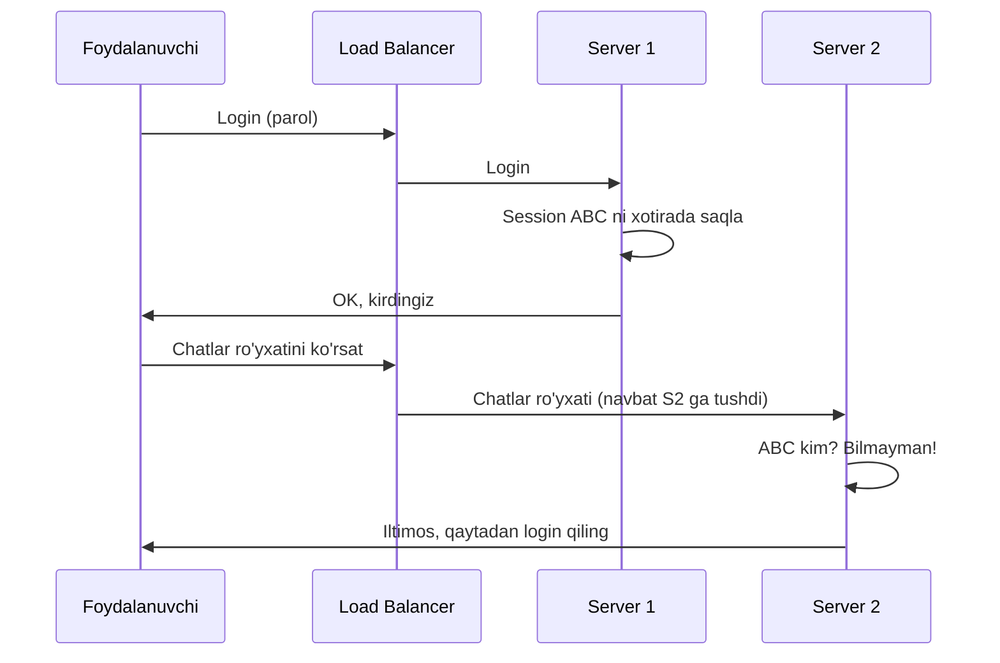
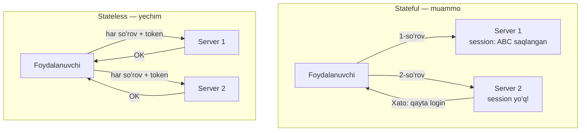
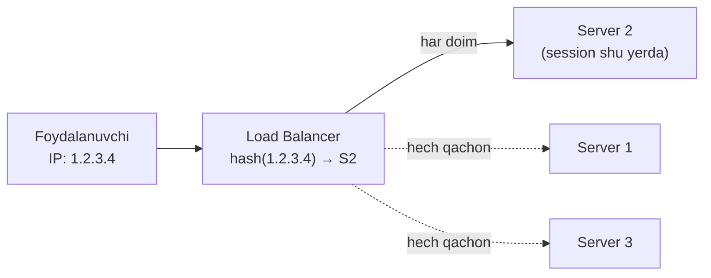
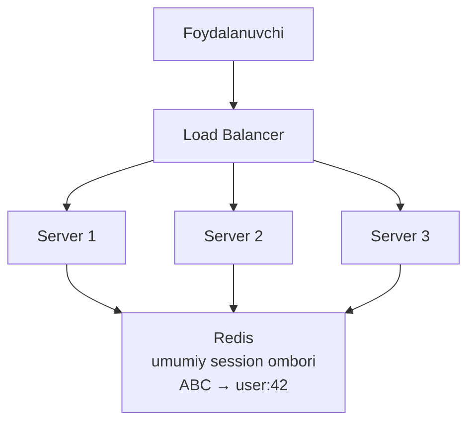
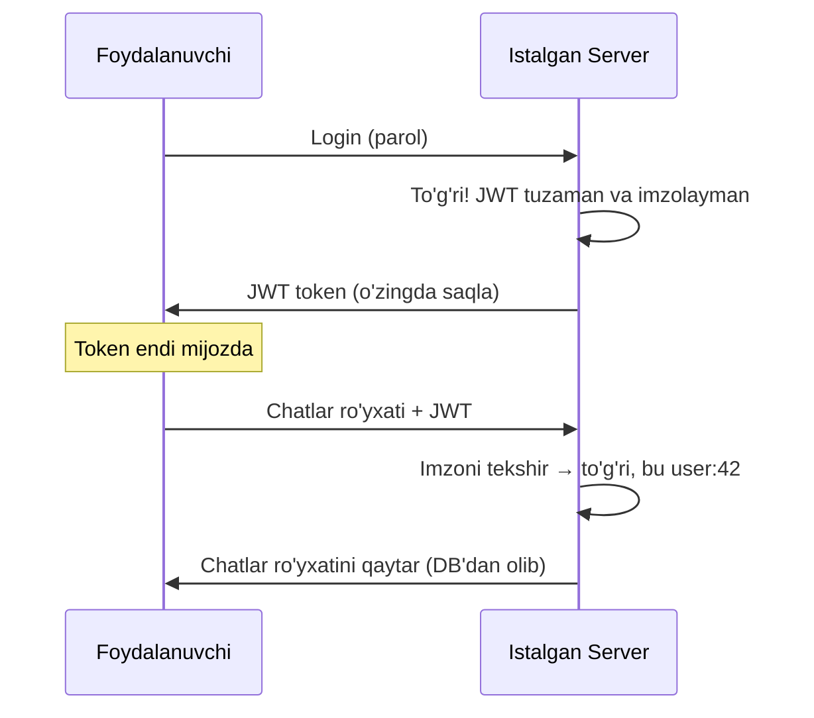

# Stateful va Stateless — xotirali va xotirasiz serverlar

> **Modul 1 — Scalability, 3-dars**
> Maqsad: nega gorizontal kengayish faqat "xotirasiz" serverlarda haqiqatan erkin ishlashini tushunish.

---

## 1. Muammo — nega bu kerak?

Biz **chat xizmati (messenger)** quryapmiz. O'tgan darsda Load Balancer qo'ydik: foydalanuvchilar 3 ta serverga navbat bilan tarqaladi. Endi bitta kichik funksiya qo'shamiz — **tizimga kirish (login)**.

Foydalanuvchi login qildi. LB uni **Server-1** ga yubordi. Server-1 o'z xotirasida "bu odam kirdi, session ID = ABC" deb yozib qo'ydi. Ajoyib.

Keyingi so'rov (masalan "chatlarim ro'yxatini ko'rsat") kelganda LB uni Round Robin bo'yicha **Server-2** ga yuboradi. Lekin Server-2 bu odamni umuman tanimaydi — uning xotirasida hech qanday session yo'q! Natija: foydalanuvchi xabarlarini o'qiy olmaydi, yana login sahifasiga otiladi.



Mana shu — **session muammosi**. Server o'z xotirasida narsa saqlagani uchun, foydalanuvchi endi *aynan o'sha* serverga qaytib borishga majbur. Gorizontal kengayishning butun erkinligi buziladi.

---

## 2. Analogiya — ikkita support operatori

Internet provayderning support chat'iga yozding. Operator-1 (Server-1) bilan muammoyingni batafsil tushuntirding: "routerim har kech uziladi". U buni faqat *o'z boshida* eslab qoldi, hech qaerga yozmadi.

Ertaga yana yozsang, senga operator-2 (Server-2) tushadi — u hech narsadan bexabar, hammasini boshidan tushuntirasan. Sen har safar aynan o'sha bitta operatorni topishga majbursan. U ta'tilga chiqsa yoki ishdan ketsa — suhbating tarixi umuman yo'qoladi.

**To'g'ri support markazi** shunday ishlaydi: har bir operator suhbatni *umumiy tizimga* (CRM — markaziy ma'lumotlar bazasi) yozadi. Endi qaysi operatorga tushsang ham, u tizimni ochib suhbatingni davom ettiradi. Operatorlar bir-birining o'rnini bemalol bosadi.

> **Analogiya chegarasi:** Operator "boshida" eslashi tez, lekin ishonchsiz. Umumiy tizim sekinroq, lekin har kim undan o'qiy oladi. Xuddi shu tanlov — server xotirasi vs tashqi saqlash — bu darsning yuragi.

---

## 3. Sodda ta'rif

- **State (holat)** — server so'rovlar orasida eslab turadigan ma'lumot: kim login qilgan, qaysi chatlari ochiq, oxirgi o'qigan xabari qaysi.
- **Stateful server** — state'ni *o'z ichida* (xotirasida) saqlaydigan server.
- **Stateless server** — state'ni ichida saqlamaydigan, har so'rovni "tap-toza" qabul qiladigan server.

Bitta jumlada: stateful server "kim ekaningni eslaydi", stateless server "har safar tanishtir" deydi.

---

## 4. Diagramma — muammo va yechim



Stateful'da server xotirasi mijozni bir serverga "bog'lab" qo'yadi. Stateless'da esa mijoz o'z "guvohnomasini" (token) har so'rovda o'zi olib keladi — shuning uchun istagan serverga tushishi mumkin.

---

## 5. Birinchi yechim: Sticky Session (va nega u yetarli emas)

Muammoning eng oson yechimi — LB'ga aytamiz: "bu foydalanuvchini *doim* o'sha bitta serverga yubor". Buni **sticky session** (yopishqoq sessiya) deyiladi. O'tgan darsdagi **IP Hash** algoritmi aynan shuni qiladi.



Vaqtincha ishlaydi. Lekin uchta jiddiy kamchiligi bor:

| Muammo | Nima bo'ladi |
|--------|--------------|
| **Server yiqilsa** | O'sha serverga bog'langan hamma foydalanuvchi session'ini yo'qotadi — birdan hammasi tizimdan chiqib ketadi. |
| **Notekis yuklama** | Ba'zi serverga ko'p "yopishgan" foydalanuvchi tushib, u bo'g'iladi; qo'shni bo'sh turadi. LB endi erkin balanslay olmaydi. |
| **Yangi server foydasiz** | Auto-scaling yangi server qo'shsa ham, eski foydalanuvchilar unga ko'chmaydi (ular eski serverga "yopishgan"). |

> **Xulosa:** Sticky session muammoni yashiradi, yechmaydi. U server xotirasiga bog'liqlikni saqlab qoladi — ya'ni gorizontal kengayish hali ham cheklangan.

---

## 6. Asl yechim: state'ni tashqariga chiqarish

Muammoning ildizi — state serverning *ichida*. Demak yechim ham oddiy: state'ni serverdan **tashqariga** chiqaramiz. Ikkita mashhur usul bor.

### Usul A: Redis session store — session'ni umumiy joyga qo'yish

Session'ni serverning xotirasida emas, hamma serverlar ko'ra oladigan **umumiy tez ombor**da (Redis) saqlaymiz. Bu — support markazidagi "umumiy CRM tizimi".



Endi istalgan server so'rov kelganda Redis'dan "ABC kim?" deb so'raydi va javobni oladi. Serverlar bir xil — istalgani mijozga xizmat qila oladi. Server yiqilsa ham session Redis'da omon qoladi.

### Usul B: JWT — state'ni mijozning o'ziga berish

Yanada radikal g'oya: umuman hech qaerda session saqlamaymiz. Login vaqtida serverga foydalanuvchiga **imzolangan guvohnoma** (JWT — JSON Web Token) beradi. Foydalanuvchi bu tokenni har so'rovda o'zi olib keladi, server esa uni tekshiribgina qo'yadi.

**JWT (JSON Web Token)** — ichida foydalanuvchi ma'lumoti (kim, qachongacha amal qiladi) yozilgan va server maxfiy kalit bilan imzolangan matn. Uni o'zgartirib bo'lmaydi — imzo buziladi.



E'tibor ber: server *hech narsa eslab qolmadi*. Butun "kim ekanligim" ma'lumoti tokenning ichida, mijozda. Har server tokenni mustaqil tekshiradi — Redis'ga ham borish shart emas.

### Ikki usulni solishtirish

| | **Redis session** | **JWT (stateless)** |
|--|--------------------|---------------------|
| **State qayerda** | Umumiy omborda (Redis) | Mijozda (token ichida) |
| **Server so'rovda** | Redis'ga boradi | Faqat imzoni tekshiradi |
| **Sessiyani bekor qilish** | Oson (Redis'dan o'chir) | Qiyin (token amal qilib turaveradi) |
| **Redis'ga bog'liqlik** | Bor (Redis SPOF bo'lmasin) | Yo'q |
| **Mos** | Tez bekor qilish kerak bo'lganda | Sof kengayuvchan tizim |

> **Chat'ga xos eslatma:** Bu darsda chat'ning REST qismi (login, chatlar ro'yxati, xabar tarixi) haqida gapiryapmiz. Real messenger'da xabarlar real vaqtda **WebSocket** orqali keladi — bu ulanish tabiatan stateful (server kim qaysi ulanishda ekanini eslab turadi). Uni kengaytirish alohida mavzu — keyinroq WhatsApp arxitekturasi darsida ko'ramiz.

---

## 7. Worked example — JWT'siz va JWT bilan (Go)

Farqni kodda ko'ramiz. Avval **stateful** (yomon, kengaymaydi):

```go
// --- STATEFUL: session server xotirasida (map) ---
var sessions = map[string]int{} // sessionID → userID (faqat SHU serverda!)

func handleLogin(w http.ResponseWriter, r *http.Request) {
    userID := 42
    sid := "ABC"          // odatda tasodifiy generatsiya qilinadi
    sessions[sid] = userID // faqat shu serverning xotirasida qoldi
    // Muammo: boshqa server bu map'ni ko'rmaydi!
}
```

Endi **stateless** (JWT bilan, erkin kengayadi):

```go
// --- STATELESS: state token ichida, serverda hech narsa qolmaydi ---
func handleLogin(w http.ResponseWriter, r *http.Request) {
    // 1-qadam: token ichiga foydalanuvchi ma'lumotini yozamiz
    claims := jwt.MapClaims{"user_id": 42, "exp": time.Now().Add(time.Hour).Unix()}
    // 2-qadam: maxfiy kalit bilan imzolaymiz (o'zgartirib bo'lmaydi)
    token := jwt.NewWithClaims(jwt.SigningMethodHS256, claims)
    signed, _ := token.SignedString(secretKey)
    // 3-qadam: mijozga beramiz — endi u o'zi saqlaydi
    w.Write([]byte(signed))
}
```

```go
// --- Har qanday server tokenni MUSTAQIL tekshiradi ---
func handleChats(w http.ResponseWriter, r *http.Request) {
    tokenStr := r.Header.Get("Authorization")
    token, err := jwt.Parse(tokenStr, func(t *jwt.Token) (any, error) {
        return secretKey, nil // imzoni shu kalit bilan tekshir
    })
    if err != nil || !token.Valid {
        http.Error(w, "Unauthorized", 401) // imzo buzilgan
        return
    }
    // Imzo to'g'ri → kim ekanini token ichidan olamiz. Redis'ga bormadik!
    // Endi user:42 ning chat ro'yxatini DB'dan olib qaytaramiz.
}
```

**Output (tasavvurda):**
```text
Login    → server-1 → token: eyJhbGciOi...  (mijozga berildi)
Chatlar  → server-3 → imzo to'g'ri, user:42 → chat ro'yxati qaytdi (server-3 bu odamni birinchi ko'ryapti, lekin muammo yo'q!)
```

Diqqat qil: ikkinchi so'rov *boshqa* serverga (server-3) tushdi, lekin hech qanday "qayta login" bo'lmadi. Mana bu — stateless serverning erkinligi.

---

## Notional machine — aslida nima bo'lyapti?

Stateful holatda server jarayoni RAM'ida `map[string]int` turadi. Bu map faqat *o'sha* jarayonning xotira maydonida. Boshqa serverda — bu boshqa jarayon, boshqa RAM, boshqa map. Ular bir-birini ko'rmaydi. Shuning uchun session "yopishib" qoladi.

JWT holatda server RAM'ida hech narsa saqlanmaydi. Token — bu shunchaki matn, mijozning brauzerida yoki telefonida yotadi. Server uni olganda faqat matematik amal (imzoni tekshirish) bajaradi va darhol unutadi. Shuning uchun 1000 ta bir xil serverni ochsang ham, hammasi bir xil ishlaydi.

---

## Predict savoli (PRIMM)

> 🤔 **O'ylab ko'r:** JWT ishlatyapmiz. Foydalanuvchi chatlarda ommaviy spam tarqatayotgani aniqlandi, uning tokenini *hoziroq* bekor qilib, tizimdan chiqarmoqchimiz. JWT'da bu oson bo'ladimi? Nega?

<details>
<summary>💡 Javobni ko'rish</summary>

Yo'q, bu **JWT'ning eng katta zaifligi**. Token o'zini o'zi tasdiqlaydi — server uni tekshirish uchun hech qaerga bormaydi. Demak tokenni "o'chiradigan" markaziy joy yo'q. Token o'z muddati (`exp`) tugaguncha amal qilaveradi.

Yechimlar: (1) token muddatini qisqa qilish (masalan 15 daqiqa) + refresh token; (2) "qora ro'yxat" (blacklist) tutish — lekin bu allaqachon stateless'likni biroz buzadi (Redis kerak bo'ladi). Aynan shu sabab ba'zi tizimlar Redis session'ni afzal ko'radi.

</details>

---

## Ko'p uchraydigan xatolar

⚠️ **Xato 1: "Sticky session — session muammosining to'liq yechimi."**
Noto'g'ri — u muammoni yashiradi, yechmaydi. Server yiqilsa session yo'qoladi, LB erkin balanslay olmaydi. To'g'risi: state'ni serverdan tashqariga chiqar (Redis yoki JWT).

⚠️ **Xato 2: "Stateless server hech narsa saqlamaydi, demak DB ham kerak emas."**
Noto'g'ri — stateless "so'rovlar orasida *serverda* eslamaslik" degani, "hech qaerda ma'lumot yo'q" emas. Doimiy ma'lumot (foydalanuvchilar, xabarlar, chat tarixi) baribir DB'da saqlanadi. Faqat *sessiya holati* serverda saqlanmaydi.

⚠️ **Xato 3: "JWT ichiga parol yoki maxfiy narsa yozsam bo'ladi — u imzolangan-ku."**
Noto'g'ri — JWT *imzolangan* (o'zgartirib bo'lmaydi), lekin *shifrlanmagan* (o'qib bo'ladi). Har kim token ichidagini oddiy o'qiy oladi. To'g'risi: JWT ichiga faqat maxfiy bo'lmagan ma'lumot (user_id, muddat) yoz, parol yoki karta raqami — hech qachon.

---

## Xulosa

- **State** — server so'rovlar orasida eslab turadigan ma'lumot (login, ochiq chatlar).
- **Stateful** server state'ni o'z xotirasida saqlaydi → foydalanuvchi bitta serverga "yopishadi" → gorizontal kengayish buziladi.
- **Sticky session** muammoni vaqtincha yashiradi, lekin server yiqilsa session yo'qoladi va balanslash cheklanadi.
- Asl yechim — state'ni tashqariga chiqarish: **Redis session store** (umumiy ombor) yoki **JWT** (state mijozda).
- **Stateless server** har so'rovni mustaqil qabul qiladi → istalgan serverga tushishi mumkin → erkin kengayadi.
- JWT imzolangan lekin shifrlanmagan; darhol bekor qilish qiyin.

## 🧠 Eslab qol

- Stateful = "seni eslayman"; stateless = "har safar tanishtir".
- Server xotirasida saqlangan session mijozni bir serverga bog'lab qo'yadi.
- Sticky session — plaster, davo emas.
- Stateless server = erkin gorizontal kengayish.
- JWT ichidagini har kim o'qiy oladi — maxfiy narsa yozma.

## ✅ O'z-o'zini tekshir (retrieval practice)

**1.** Nega stateful server gorizontal kengayishga xalaqit beradi?

<details>
<summary>Javob</summary>

Chunki state (session) serverning o'z xotirasida. Foydalanuvchi keyingi so'rovda boshqa serverga tushsa, u serverda session yo'q — foydalanuvchi "tanilmaydi". Shuning uchun uni doim o'sha bitta serverga qaytarishga majbur bo'lasan, bu esa LB'ning erkin taqsimlashini va yangi server qo'shishni behuda qiladi.

</details>

**2.** Sticky session ishlatyapsan. Server-2 yiqildi. Nima bo'ladi va nega bu stateless yechimda bunday bo'lmaydi?

<details>
<summary>Javob</summary>

Server-2'ga "yopishgan" barcha foydalanuvchilar session'ini yo'qotadi — ular birdan tizimdan chiqib ketadi (chunki session faqat o'sha serverning xotirasida edi). Stateless yechimda (Redis yoki JWT) session serverda emas, tashqarida saqlangani uchun server yiqilsa ham session omon qoladi; foydalanuvchi shunchaki boshqa serverga o'tadi va ishlashda davom etadi.

</details>

**3.** Redis session va JWT — ikkalasi ham stateless serverni ta'minlaydi. Sessiyani darhol bekor qilish kerak bo'lganda qaysi biri qulay va nega?

<details>
<summary>Javob</summary>

**Redis session** qulay: sessiyani bekor qilish uchun Redis'dan o'sha yozuvni o'chirasan — server keyingi so'rovda uni topmaydi va foydalanuvchini chiqaradi. JWT'da esa token o'zini o'zi tasdiqlaydi, tekshirish uchun markaziy joyga borilmaydi, shuning uchun uni muddati tugaguncha "o'chirib" bo'lmaydi (blacklist qo'shmasang).

</details>

**4.** "Stateless server hech qanday ma'lumot saqlamaydi" — bu gap qayerda noto'g'ri?

<details>
<summary>Javob</summary>

Stateless faqat *sessiya holati* serverning xotirasida saqlanmasligini bildiradi. Doimiy ma'lumot (foydalanuvchilar, xabarlar, chat tarixi) baribir ma'lumotlar bazasida saqlanadi. "Stateless" so'zi butun tizim xotirasiz degani emas — faqat *ilova serveri* so'rovlar orasida holatni tutmaydi.

</details>

## 🛠 Amaliyot

**1. Oson (savol/diagramma):**
Session muammosini (login → S1, chatlar ro'yxati → S2 → "tanilmadi") sequence diagram ko'rinishida o'zing chizib chiq. Keyin uni JWT bilan "tuzatilgan" versiyasini chiz.

<details>
<summary>Hint</summary>

Yomon versiyada S1 xotiraga yozadi, S2 topolmaydi. Yaxshi versiyada login tokenni *mijozga* qaytaradi, keyingi so'rov tokenni o'zi bilan olib keladi va istalgan server tekshiradi.

</details>

**2. O'rta (kamchilikni top):**
Chat startup jamoasi shunday dizayn qildi: "3 ta stateless server, Redis session store. Redis bitta instance, zaxirasiz. Foydalanuvchi session'lari faqat Redis'da." Bu dizaynda jiddiy kamchilik bor. Top va yechimini ayt.

<details>
<summary>Hint</summary>

Serverlar stateless bo'ldi, lekin endi **Redis SPOF** — u yiqilsa hamma session bir zumda yo'qoladi va butun tizimda hamma tizimdan chiqadi. Yechim: Redis'ni replikatsiya/klaster qilib zaxiralash (avvalgi darslardagi "SPOF bo'lmasin" qoidasi bu yerda ham amal qiladi).

</details>

**3. Qiyin (kichik dizayn masalasi):**
Messenger ilovasi uchun auth tizimi dizayn qil. Talablar: (a) 10 ta serverga erkin kengaysin; (b) spam tarqatayotgan foydalanuvchini *darhol* tizimdan chiqara olaylik; (c) token o'g'irlansa zarar minimal bo'lsin. Qanday yechim (JWT? Redis? aralash?) tanlaysan? Diagramma chiz.

<details>
<summary>Hint</summary>

Sof JWT (b) talabini bajara olmaydi (darhol bekor qilib bo'lmaydi). Amaliy yechim — **aralash**: qisqa muddatli JWT (masalan 10 daqiqa) + Redis'da refresh token. Spam aniqlanganda refresh tokenni Redis'dan o'chirasan — 10 daqiqa ichida foydalanuvchi butunlay chiqadi. (c) uchun token muddati qisqa bo'lgani zararni kamaytiradi.

</details>

## 🔁 Takrorlash

**Bog'liq oldingi mavzular:**
- [Load balancing](<./2. Load balancing.md>) — IP Hash algoritmi aynan sticky session'ni yaratadi; shu darsni eslab ko'r.
- [Vertikal va gorizontal kengayish](<./1. Vertikal va gorizontal kengayish.md>) — stateless server "erkin kengayish"ning sharti.
- [1-modul: Operatsion tizim va abstraksiya](../1-tizimlar-negizi/02-operatsion-tizim-va-abstraksiya.md) — jarayon (process) va uning alohida RAM maydoni; nega bir serverning map'i boshqasiga ko'rinmaydi.
- [1-modul: API uslublari (REST, GraphQL, gRPC)](../1-tizimlar-negizi/05-api-uslublari-rest-graphql-grpc.md) — REST'ning "statelessness" tamoyili bevosita shu darsga bog'liq.

**Takrorlash jadvali:**
- **Ertaga:** sticky session'ning 3 ta kamchiligini yoddan yoz.
- **3 kundan keyin:** Redis session vs JWT jadvalini xotiradan tikla.
- **1 haftadan keyin:** amaliyotning "qiyin" masalasini (messenger auth) qaytadan yech.

**Feynman testi:** Do'stingga "nega ba'zi serverlar 'seni eslamaydi' va bu nega yaxshi?" ni ikkita support operatori misolida 3 jumlada tushuntir.

**Keyingi dars:** [CDN](<./4. CDN.md>) — serverni kengaytirdik, lekin foydalanuvchi Toshkentda, server AQSHda bo'lsa-chi? Masofa muammosi.
