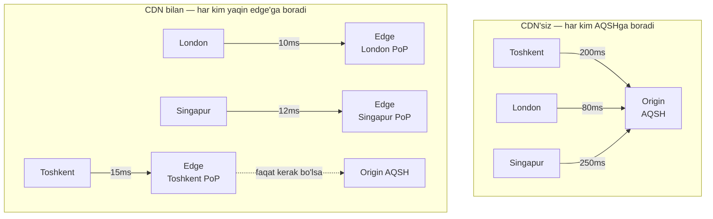
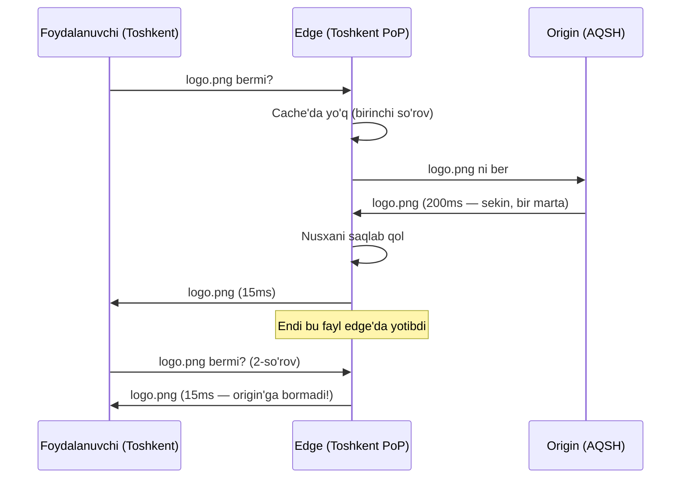
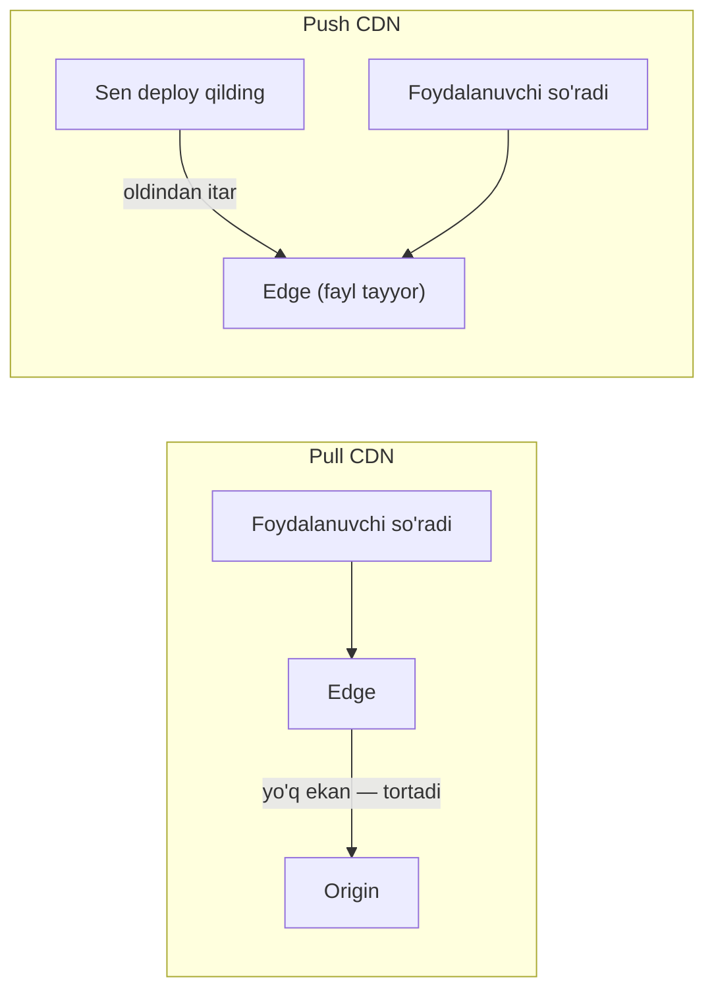
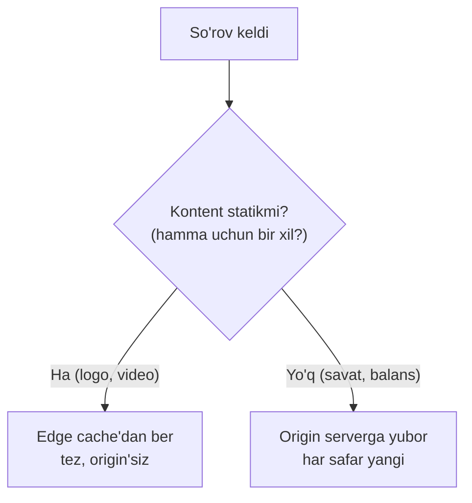

# CDN — kontentni foydalanuvchiga yaqinlashtirish

> **Modul 2 — Kengayish usullari, 4-dars**
> Maqsad: geografik masofa tufayli kelib chiqadigan sekinlikni CDN qanday hal qilishini tushunish.

---

## 1. Muammo — nega bu kerak?

Shu paytgacha serverni kuchaytirdik, ko'paytirdik, yukni taqsimladik. Lekin bitta narsani unutdik — **masofa**.

Serverlaring AQSH'da (masalan Virginia'da) turibdi. Toshkentdagi foydalanuvchi saytingni ochmoqchi. So'rov qanday yo'l bosadi?

```text
Toshkent → Frankfurt → Amsterdam → Nyu-York → Virginia server
va yana orqaga qaytish...
```

Yorug'lik tezligi ham cheklangan. Toshkent–Virginia orasida so'rov borib-kelishi (round-trip) **~200 millisekund** vaqt oladi — bu faqat *bo'sh* paket uchun. Bir sahifada 50 ta rasm, CSS, JS fayli bo'lsa, ularning har biri shu yo'lni bosadi. Sahifa 5–10 soniyada ochiladi. Serverlaring qanchalik kuchli bo'lmasin, **masofani kuchaytirish bilan yenga olmaysan**.

> Vertikal va gorizontal kengayish serverning *hisoblash* muammosini yechadi. CDN esa *masofa* muammosini yechadi — bular butunlay boshqa muammolar.

---

## 2. Analogiya — kitob do'koni tarmog'i

Tasavvur qil, dunyoda bitta ulkan kitob ombori bor — AQSH'da. Har kim kitob buyurtma qilsa, u AQSH'dan kemada 3 haftada keladi. Sekin va qimmat.

Aqlli yechim: mashhur kitoblardan **har shaharda kichik do'kon** ochish. Toshkentlik kitobni o'z shahridagi do'kondan bir kunda oladi. Faqat juda kam so'raladigan, noyob kitob uchungina markaziy omborga murojaat qilinadi.

**CDN** — aynan shu do'konlar tarmog'i. Rasm, video, CSS kabi "kitoblar"ni (statik fayllar) foydalanuvchiga eng yaqin do'kondan (edge server) yetkazadi.

> **Analogiya chegarasi:** Do'konda kitob nusxasi turadi. CDN'da ham fayl *nusxasi* (cache) turadi — asl fayl baribir markaziy serverda (origin). Do'kon narxni yoki muqovani o'zgartira olmaydi — CDN ham faqat *tayyor, o'zgarmas* kontentni tarqata oladi. Doim yangilanadigan, shaxsiy kontentga bu mos kelmaydi.

---

## 3. Sodda ta'rif

**CDN (Content Delivery Network)** — dunyo bo'ylab tarqalgan serverlar tarmog'i bo'lib, kontent nusxasini foydalanuvchiga eng yaqin joyda saqlab, tez yetkazadi.

Ikki yangi atama:
- **Edge server** — foydalanuvchiga yaqin joylashgan CDN serveri ("mahalliy do'kon").
- **PoP (Point of Presence)** — bir necha edge server joylashgan geografik nuqta (masalan "Frankfurt PoP", "Singapur PoP").

---

## 4. Diagramma — CDN'siz va CDN bilan



CDN'siz — hamma bitta uzoq serverga tiqiladi. CDN bilan — har kim o'z shahridagi edge'dan oladi, origin'ga kamdan-kam murojaat qilinadi.

---

## 5. CDN qanday ishlaydi — birinchi so'rov va keyingilari

CDN'ning siri **cache**da (o'tgan moduldagi keshlash mavzusini esla). Edge server faylni birinchi so'ralganda origin'dan oladi va **o'zida saqlab qoladi**. Keyingi hamma so'rovlar origin'ga umuman bormaydi.



- **Cache miss** (birinchi so'rov) — edge'da yo'q, origin'dan olib keladi, sekin.
- **Cache hit** (keyingilari) — edge'da bor, darhol beradi, tez.

Butun sir shunda: bir marta sekin, keyin ming marta tez.

---

## 6. Push vs Pull CDN — fayl edge'ga qanday tushadi?

Edge server faylni ikki yo'l bilan olishi mumkin.

| | **Pull CDN** | **Push CDN** |
|--|--------------|--------------|
| **Fayl qachon tushadi** | Birinchi so'ralganda (kerak bo'lganda tortadi) | Sen oldindan yuklaysan (itarasan) |
| **Kim boshqaradi** | CDN o'zi (avtomatik) | Sen (qo'lda yoki deploy'da) |
| **Birinchi foydalanuvchi** | Sekin (cache miss) | Tez (fayl allaqachon turibdi) |
| **Mos** | Ko'p, tez-tez o'zgaradigan fayllar | Kam, katta fayllar (video, reliz) |

**Pull** — "so'ralganda tort". Ko'pchilik sayt uchun eng qulay: CDN'ga origin manzilini berasan, qolganini u o'zi qiladi. Kamchiligi — har fayl uchun *birinchi* foydalanuvchi sekin oladi.

**Push** — "oldindan itar". Katta video yoki yangi relizni oldindan barcha edge'larga tarqatasan, birinchi foydalanuvchi ham tez oladi. Kamchiligi — o'zing boshqarishga majbursan.



---

## 7. Statik vs dinamik kontent — CDN'ning chegarasi

Bu darsning eng muhim tushunchasi. CDN **hamma narsani** keshlay olmaydi.

- **Statik kontent** — har kim uchun *bir xil* va *kam o'zgaradigan*: rasm, video, CSS, JS, PDF. Buni CDN bemalol keshlaydi.
- **Dinamik kontent** — har foydalanuvchi uchun *har xil* yoki *doim yangilanadigan*: shaxsiy savat, bank balansi, real-time narx. Buni oddiy keshlab bo'lmaydi.



**Nega farqi muhim?** Agar dinamik kontentni (masalan foydalanuvchi savatini) xato keshlab qo'ysang, ikki foydalanuvchi *bir-birining* savatini ko'rishi mumkin — jiddiy xato. Shuning uchun:

> **Oltin qoida:** Statik, hamma uchun bir xil kontentni keshla. Shaxsiy yoki tez o'zgaradigan kontentni origin'ga qoldir.

Zamonaviy CDN'lar oraliq yechimlar ham beradi: `Cache-Control` header orqali "bu faylni 1 soat keshla", "bu faylni umuman keshlama" deb aytish mumkin (o'tgan moduldagi cache TTL bilan bir xil g'oya). Ba'zilari dinamik kontentni ham qisqa muddatli yoki foydalanuvchiga qarab keshlay oladi (edge computing), lekin bu allaqachon murakkabroq mavzu.

### CDN va cache — bir oiladan

E'tibor ber: CDN aslida **geografik tarqalgan cache**. O'tgan moduldagi keshlash tamoyillari (cache hit/miss, TTL, invalidation) bu yerda ham to'liq amal qiladi — faqat cache endi bitta serverda emas, dunyo bo'ylab tarqalgan.

| | Oddiy cache (Redis) | CDN |
|--|---------------------|-----|
| **Qayerda** | Serverga yaqin | Foydalanuvchiga yaqin |
| **Nimani tezlashtiradi** | DB so'rovini | Fayl yetkazishni (masofani) |
| **Asosiy muammo** | DB bo'g'izi | Geografik latency |

---

## Notional machine — latency aslida qayerdan keladi?

So'rov "sekin" deganda odamlar serverni ayblaydi. Aslida ko'pincha vaqt **yo'lda** ketadi. Toshkent–Virginia orasida paket bir necha router va okean tagidagi kabellar orqali o'tadi. Yorug'lik shisha tolada ~200000 km/s tezlikda yuradi — bu cheklangan.

Masofa 12000 km bo'lsa, bir tomonga ~60ms, borib-kelish ~120–200ms (routerlar qo'shimcha qo'shadi). Server javobni 1ms da tayyorlasa ham, foydalanuvchi 200ms kutadi. CDN edge'ni 15ms masofaga qo'yib, aynan shu "yo'l vaqtini" qisqartiradi — server tezligini emas.

---

## Predict savoli (PRIMM)

> 🤔 **O'ylab ko'r:** Sayting logotipini yangilading (yangi `logo.png` yuklading), lekin CDN ishlatyapsan. Foydalanuvchilar baribir *eski* logotipni ko'ryapti. Nega?

<details>
<summary>💡 Javobni ko'rish</summary>

Chunki edge serverlarda **eski nusxa** hali cache'da yotibdi. CDN origin'ni tekshirmaydi — o'zidagi nusxani beraveradi, uning TTL (yaroqlilik muddati) tugaguncha.

Yechimlar: (1) **cache invalidation / purge** — CDN'ga "bu faylni o'chir" deb buyruq berish; (2) **fayl nomini o'zgartirish** — `logo.png` o'rniga `logo.v2.png` yoki `logo.a1b2c3.png` (versiyali nom). Yangi nom = yangi fayl = cache'da yo'q = origin'dan yangisini oladi. Bu texnikani "cache busting" deyiladi. Ko'pincha aynan ikkinchisi ishlatiladi.

</details>

---

## Ko'p uchraydigan xatolar

⚠️ **Xato 1: "CDN serverni tezlashtiradi."**
Noto'g'ri — CDN serverni emas, *fayl yetkazishni* (masofani) tezlashtiradi. Server hisoblashi sekin bo'lsa, CDN unga yordam bermaydi. To'g'risi: CDN latency muammosini yechadi, hisoblash muammosini emas.

⚠️ **Xato 2: "Hamma narsani CDN'ga qo'yaman — sayt uchyapti."**
Noto'g'ri — dinamik, shaxsiy kontentni (savat, balans) keshlasang, foydalanuvchilar bir-birining ma'lumotini ko'radi. To'g'risi: faqat statik, hamma uchun bir xil kontentni keshla; dinamikni origin'ga qoldir.

⚠️ **Xato 3: "Fayl yangiladim — CDN darhol yangisini beradi."**
Noto'g'ri — edge cache'da eski nusxa TTL tugaguncha turadi. To'g'risi: purge qil yoki versiyali fayl nomi (cache busting) ishlat.

---

## Xulosa

- CDN **masofa (latency)** muammosini yechadi — vertikal/gorizontal kengayish yecha olmaydigan muammo.
- **Edge server** — foydalanuvchiga yaqin CDN serveri; **PoP** — edge'lar joylashgan nuqta.
- CDN aslida **geografik tarqalgan cache**: birinchi so'rov sekin (miss), keyingilar tez (hit).
- **Pull CDN** — so'ralganda tortadi (oddiy sayt); **Push CDN** — oldindan itaradi (katta fayl, video).
- Faqat **statik** kontentni keshla; **dinamik** (shaxsiy, tez o'zgaradigan) kontentni origin'ga qoldir.
- Fayl yangilanganda — purge yoki versiyali nom (cache busting).

## 🧠 Eslab qol

- CDN masofani qisqartiradi, serverni tezlashtirmaydi.
- Edge = mahalliy do'kon; origin = markaziy ombor.
- Birinchi so'rov sekin, qolgani tez.
- Statikni keshla, dinamikni keshlama.
- Fayl o'zgarsa — nomini o'zgartir (cache busting).

## ✅ O'z-o'zini tekshir (retrieval practice)

**1.** Serveringni 2 barobar kuchaytirding, lekin Toshkentlik foydalanuvchilar uchun sayt hali ham sekin. Nega, va nima yordam beradi?

<details>
<summary>Javob</summary>

Chunki sekinlik serverdan emas, **masofadan** — so'rov AQSH'gacha borib-keladi (~200ms), bu vaqt yo'lda ketadi. Serverni kuchaytirish hisoblashni tezlashtiradi, lekin yo'l vaqtini o'zgartirmaydi. **CDN** yordam beradi: statik fayllarni Toshkentga yaqin edge serverga qo'yib, masofani 15ms ga tushiradi.

</details>

**2.** Pull va Push CDN farqi nima, va katta video servisi uchun qaysi biri ko'pincha afzal?

<details>
<summary>Javob</summary>

Pull — edge faylni *birinchi so'ralganda* origin'dan tortadi (birinchi foydalanuvchi sekin oladi). Push — sen faylni *oldindan* barcha edge'larga itarasan (birinchi foydalanuvchi ham tez oladi). Katta video uchun ko'pincha **Push** afzal: fayllar katta va oldindan ma'lum, shuning uchun ularni relizdan oldin edge'larga tarqatib qo'yish ma'qul — hech kim "birinchi miss"ni kutmaydi.

</details>

**3.** Nega foydalanuvchining shaxsiy savatini CDN'da keshlash xavfli?

<details>
<summary>Javob</summary>

Savat har foydalanuvchi uchun *har xil* (dinamik). Agar edge uni keshlab qo'ysa, u nusxani *boshqa* foydalanuvchiga ham berishi mumkin — ya'ni A odam B odamning savatini ko'radi. Bu maxfiylik buzilishi va jiddiy xato. Shuning uchun dinamik/shaxsiy kontent keshlanmaydi, origin'ga yuboriladi.

</details>

**4.** CDN va oddiy Redis cache — ikkalasi ham cache, farqi nimada?

<details>
<summary>Javob</summary>

Redis cache serverga yaqin joylashib, asosan **DB so'rovlarini** tezlashtiradi (ma'lumotni qayta-qayta DB'dan olmaslik uchun). CDN esa foydalanuvchiga yaqin joylashib, **fayl yetkazish masofasini** qisqartiradi. Biri hisoblash/DB bo'g'izini, ikkinchisi geografik latency'ni yechadi — lekin ikkalasi ham bir xil cache tamoyiliga (hit/miss, TTL) asoslanadi.

</details>

## 🛠 Amaliyot

**1. Oson (savol/diagramma):**
CDN'da cache miss va cache hit'ni ko'rsatuvchi sequence diagram chiz: birinchi so'rov origin'ga boradi, ikkinchisi faqat edge'dan qaytadi.

<details>
<summary>Hint</summary>

3 ishtirokchi: Foydalanuvchi, Edge, Origin. Birinchi so'rovda Edge → Origin strelkasi bor. Ikkinchida Edge to'g'ridan-to'g'ri javob beradi, Origin'ga strelka yo'q.

</details>

**2. O'rta (kamchilikni top):**
Jamoa shunday dizayn qildi: "Butun saytni (statik rasmlar VA foydalanuvchi profili sahifasini) Pull CDN orqali 24 soatga keshladik. Sayt tez ishlayapti." Bu dizaynda kamida 2 ta muammo bor. Top.

<details>
<summary>Hint</summary>

(1) Foydalanuvchi profili — **dinamik/shaxsiy** kontent, uni keshlash foydalanuvchilar ma'lumotini aralashtirib yuboradi. (2) 24 soat TTL — profil yoki narx o'zgarsa, foydalanuvchi bir kun eski ma'lumotni ko'radi. To'g'risi: statik rasmni keshla (uzoq TTL), dinamik sahifani origin'ga qoldir yoki juda qisqa/nol TTL ber.

</details>

**3. Qiyin (kichik dizayn masalasi):**
Global video streaming platforma dizayn qil (YouTube kabi). Foydalanuvchilar dunyoning har yerida. Talablar: (a) video tez ochilsin, joydan qat'iy nazar; (b) video sahifasidagi "tavsiyalar" har foydalanuvchiga har xil; (c) yangi video yuklanganda tez tarqalsin. Qaysi kontentni CDN'ga, qaysini origin'ga qo'yasan? Push/Pull? Diagramma chiz.

<details>
<summary>Hint</summary>

(a) Video fayllari — statik, katta → CDN'ga (mashhur videolar uchun **Push**, mashhur bo'lmagani uchun **Pull**). (b) Tavsiyalar — dinamik, shaxsiy → origin/backend, keshlanmaydi. (c) Yangi video — Push bilan mashhur PoP'larga oldindan tarqat. Diagrammada: foydalanuvchi → edge (video) + foydalanuvchi → origin (tavsiya) ikki alohida oqim bo'lsin.

</details>

## 🔁 Takrorlash

**Bog'liq oldingi mavzular:**
- [Modul 2: Vertikal va gorizontal kengayish](./01-vertikal-va-gorizontal-kengayish.md) — u hisoblash muammosini, CDN esa masofa muammosini yechadi; farqini solishtir.
- [Modul 2: Load balancing](./02-load-balancing.md) — origin serverlar ham LB orqasida turadi; CDN esa ular oldiga joylashadi.
- [1-modul: Internet tarmog'i va protokollari](../1-tizimlar-negizi/04-internet-tarmogi-va-protokollari.md) — latency, RTT, yorug'lik tezligi va router hop'lari shu yerda o'rganilgan.
- [1-modul: Kompyuter anatomiyasi](../1-tizimlar-negizi/01-kompyuter-anatomiyasi.md) — xotira ierarxiyasi; cache tamoyili shundan keladi.

**Takrorlash jadvali:**
- **Ertaga:** statik va dinamik kontentga 3 tadan misol yoz; qaysi biri keshlanadi?
- **3 kundan keyin:** Push vs Pull jadvalini xotiradan tikla.
- **1 haftadan keyin:** "logo yangiladim, eski ko'rinyapti" muammosining 2 yechimini esla.

**Feynman testi:** Do'stingga "nega sayt uzoqdagi serverda bo'lsa sekin, CDN buni qanday tuzatadi?" ni kitob do'koni tarmog'i misolida 3 jumlada tushuntir.

**Keyingi dars:** [05-rate-limiting-va-backpressure.md](./05-rate-limiting-va-backpressure.md) — tizimni kengaytirdik, endi uni suiiste'moldan (abuse, DDoS) qanday himoyalaymiz?
