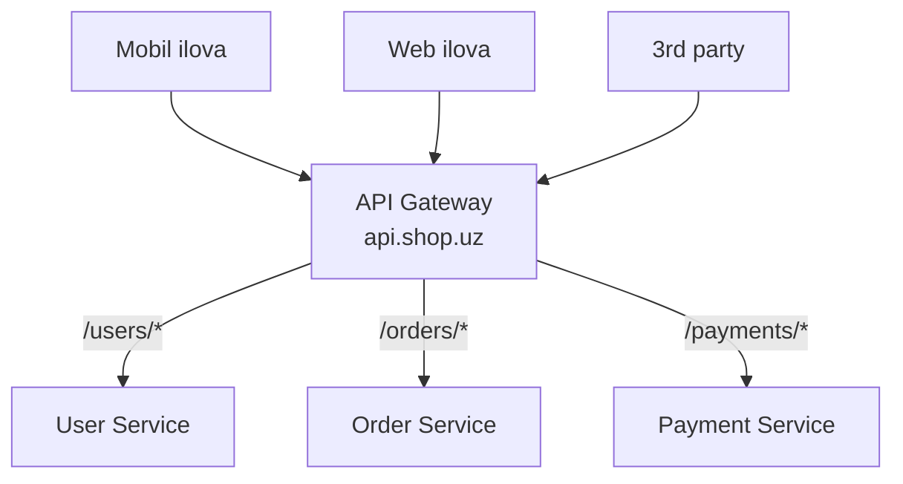
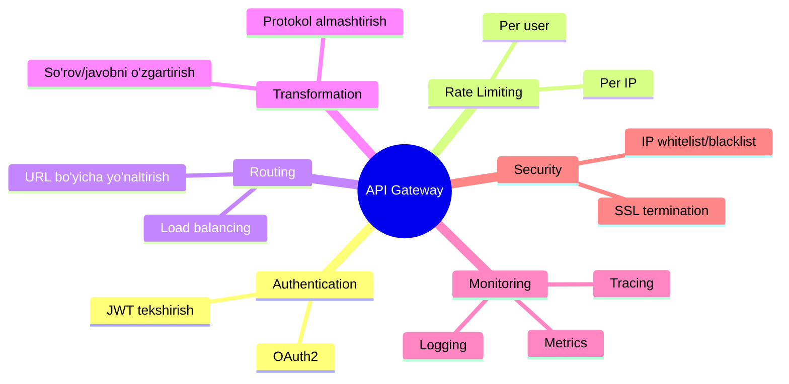

# API Gateway — yagona kirish darvozasi

> **Modul 2 — Kengayish usullari, 6-dars (qo'shimcha)**
> Maqsad: mikroservislar oldiga qo'yiladigan yagona kirish nuqtasi — API Gateway nima, qaysi vazifalarni bajaradi va uni Go'da qanday yozish mumkinligini tushunish.

---

## 1. Muammo — nega bu kerak?

Tizimni kengaytirdik, monolitni bir necha mikroservisga bo'ldik: User Service, Order Service, Payment Service. Har biri alohida manzilda ishlaydi. Ajoyib — lekin endi client tomonida chalkashlik boshlanadi.

- Mobil ilova qaysi servis qayerda turishini (`user-service:8081`, `order-service:8082`...) **bilishi** kerak.
- Har bir servis **o'zicha** auth, rate limiting, logging'ni takrorlab yozadi — bir xil kod 10 joyda.
- Bitta servis manzili o'zgarsa — hamma client'ni yangilash kerak.

Kerak: bitta **umumiy darvoza**, uning orqasida yashiringan servislar, va u har so'rovni tekshirib to'g'ri servisga yo'naltirsin. Mana shu darvoza — **API Gateway**.

> **Eslatma:** Bu 5-darsdagi rate limiting bilan chambarchas bog'liq. O'sha yerda rate limiter'ni aynan API Gateway'ga qo'yish qulay ekanini ko'rgan edik. Endi darvozaning o'zini to'liq ochamiz.

---

## 2. Analogiya — biznes markazidagi qabulxona (reception)

Katta biznes markazida o'nlab kompaniya bor. Har biri eshigida alohida qorovul qo'yish — isrof. Shuning uchun **kirishda bitta qabulxona** turadi.

Qabulxona: hujjatingni tekshiradi (auth), kimga kelganingni so'raydi va to'g'ri qavatga yo'naltiradi (routing). Tashrifchi ichki xonalar qayerdaligini bilishi shart emas — faqat qabulxonani ko'radi.

**API Gateway** — aynan shu qabulxona: barcha tashqi so'rov undan o'tadi, u tekshiradi va ichki servisga uzatadi.

> **Analogiya chegarasi:** Qabulxona faqat yo'naltiradi. API Gateway esa bundan ko'proq qiladi: so'rovni o'zgartirishi (transformation), keshlashi, bir necha servis javobini birlashtirishi mumkin. Lekin u **biznes mantiqni bajarmasligi** kerak — bu servislarning ishi (buni pastda ko'ramiz).

---

## 3. Sodda ta'rif

**API Gateway** — barcha tashqi API so'rovlari o'tadigan yagona kirish nuqtasi; u so'rovni tekshiradi (auth, rate limit), kerakli ichki servisga yo'naltiradi (routing) va javobni client'ga qaytaradi.

Client uchun Gateway — bitta manzil (masalan `api.shop.uz`). Orqada nechta mikroservis borligi client'ga ko'rinmaydi.

---

## 4. Diagramma — Gateway qanday joylashadi



Client'lar faqat Gateway'ni ko'radi. Gateway URL yo'liga qarab (path'ga) so'rovni to'g'ri servisga uzatadi.

---

## 5. Gateway vazifalari — u nima qiladi?

Gateway "cross-cutting" (ko'ndalang, hamma servisga umumiy) vazifalarni bir joyga yig'adi. Shunda har servis faqat o'z biznes ishiga e'tibor beradi.



Muhim nuqta: bu vazifalarning barchasi **har servisda** takrorlanishi mumkin edi. Gateway ularni **bir marta** hal qiladi — kod takrorlanmaydi, xavfsizlik yagona joyda boshqariladi.

---

## 6. Go amaliyoti — sodda API Gateway

Endi shu g'oyani kodda ko'ramiz. Gateway aslida bir **reverse proxy** (so'rovni qabul qilib, orqadagi serverga uzatib, javobini qaytaradigan vositachi). Kodni subgoal (kichik maqsad) bo'yicha bo'lamiz.

```go
// --- 1-qadam: Gateway va marshrutlar jadvali (path -> servis manzili) ---
type Gateway struct {
    routes map[string]string
}

func NewGateway() *Gateway {
    return &Gateway{routes: map[string]string{
        "/users":    "http://user-service:8081",
        "/orders":   "http://order-service:8082",
        "/products": "http://product-service:8083",
    }}
}
```

```go
// --- 2-qadam: har so'rovda ketma-ketlik: auth -> rate limit -> route -> proxy ---
func (g *Gateway) ServeHTTP(w http.ResponseWriter, r *http.Request) {
    // 2a: auth tekshir
    token := r.Header.Get("Authorization")
    if !validateToken(token) {
        http.Error(w, "Unauthorized", http.StatusUnauthorized) // 401
        return
    }
    // 2b: rate limit tekshir (5-darsdagi token bucket)
    if !checkRateLimit(getUserFromToken(token)) {
        w.Header().Set("Retry-After", "60")
        http.Error(w, "Too Many Requests", http.StatusTooManyRequests) // 429
        return
    }
    // 2c: to'g'ri servisni topib, so'rovni uzat (proxy)
    target := g.findTarget(r.URL.Path)
    if target == "" {
        http.Error(w, "Not Found", http.StatusNotFound) // 404
        return
    }
    targetURL, _ := url.Parse(target)
    httputil.NewSingleHostReverseProxy(targetURL).ServeHTTP(w, r)
}
```

```go
// --- 3-qadam: path prefiksiga qarab servisni tanlash + ishga tushirish ---
func (g *Gateway) findTarget(path string) string {
    for prefix, target := range g.routes {
        if strings.HasPrefix(path, prefix) {
            return target // masalan /users/123 -> user-service
        }
    }
    return ""
}

func main() {
    fmt.Println("API Gateway :8080 da ishlayapti")
    http.ListenAndServe(":8080", NewGateway())
}
```

**Output (tasavvurda):**
```text
GET /users/123     (token bor)   -> user-service:8081 -> 200 OK
GET /orders/55     (token bor)   -> order-service:8082 -> 200 OK
GET /users/123     (tokensiz)    -> 401 Unauthorized
GET /unknown/1     (token bor)   -> 404 Not Found
```

**Notional machine:** `ReverseProxy` so'rovni "o'zi ochib o'qimasdan" orqadagi servisga qayta uzatadi va javobni to'g'ridan-to'g'ri client'ga oqizadi. Ya'ni Gateway ma'lumotni saqlamaydi — u faqat **vositachi**, shuning uchun o'zi ham stateless bo'lishi mumkin (bu uni oson kengaytiradi).

---

## 7. Mashhur API Gateway'lar

Amalda Gateway'ni odatda noldan yozmaysan — tayyor yechim olasan. Eng ko'p uchraydiganlari:

| Gateway | Xususiyati |
|---------|------------|
| **Kong** | Ochiq kodli, boy plugin ekotizimi |
| **AWS API Gateway** | Serverless, AWS xizmatlari bilan integratsiya |
| **Nginx** | Juda tez, oddiy, keng tarqalgan |
| **Traefik** | Kubernetes uchun qulay, avtomatik konfiguratsiya |
| **Envoy** | Service mesh (Istio) uchun, yuqori quvvatli proxy |

Tanlov kontekstga bog'liq: AWS'da bo'lsang — AWS API Gateway; Kubernetes'da — Traefik yoki Envoy; oddiy va tez kerak bo'lsa — Nginx; plugin va moslashuvchanlik kerak bo'lsa — Kong.

---

## Predict savoli (PRIMM)

> 🤔 **O'ylab ko'r:** Kimdir Gateway ichiga "buyurtma narxini hisoblash" biznes mantig'ini joylashtirdi, chunki "hamma so'rov shu yerdan o'tadi, qulay". Bu qanday muammoga olib keladi?

<details>
<summary>💡 Javobni ko'rish</summary>

Gateway "semiz" (fat gateway) bo'lib qoladi va bir necha muammo tug'iladi:

1. **Bog'liqlik tuguni** — narx mantig'i o'zgarsa, Gateway'ni qayta joylashtirasan; bu esa BUTUN trafikka ta'sir qiladi (hamma so'rov undan o'tadi).
2. **Mas'uliyat chalkashadi** — endi biznes mantiq ikki joyda (Gateway va Order Service), qay biri to'g'ri ekani noaniq.
3. **Kengaytirish qiyinlashadi** — Gateway'ni har biznes o'zgarishida qayta chiqarasan.

To'g'risi: Gateway faqat **ko'ndalang vazifalarni** (auth, routing, rate limit, logging) bajarsin; biznes mantiq esa tegishli servisda (Order Service) qolsin.

</details>

---

## Ko'p uchraydigan xatolar

⚠️ **Xato 1: "Gateway = Load Balancer."**
Noto'g'ri — LB faqat trafikni bir xil serverlar orasida taqsimlaydi. Gateway bundan ko'proq: auth, rate limit, routing, transformation qiladi va turli servislarga yo'naltiradi. To'g'risi: ko'pincha ikkalasi birga ishlaydi (Gateway ichida LB ham bo'ladi), lekin bu ikki xil rol.

⚠️ **Xato 2: "Bitta Gateway qo'ydim, ish tamom."**
Noto'g'ri — endi hamma trafik bitta Gateway'dan o'tadi, ya'ni u SPOF (bitta yiqiladigan nuqta) bo'lib qoladi. To'g'risi: Gateway'ni ham bir necha nusxada (klaster) va oldiga LB qo'yib ishga tushirish kerak.

⚠️ **Xato 3: "Gateway'ga biznes mantiq joylashtirsam qulay."**
Noto'g'ri — bu "fat gateway" anti-pattern; mas'uliyat chalkashadi, kengaytirish qiyinlashadi. To'g'risi: Gateway faqat ko'ndalang vazifalarni bajaradi, biznes mantiq servisda qoladi.

---

## Xulosa

- **API Gateway** — barcha tashqi so'rov o'tadigan yagona kirish darvozasi; client orqadagi servislarni ko'rmaydi.
- U ko'ndalang vazifalarni bir joyga yig'adi: **auth, rate limiting, routing, transformation, monitoring, security**.
- Shu tufayli kod takrorlanmaydi, xavfsizlik yagona joyda boshqariladi.
- Go'da Gateway aslida **reverse proxy**: auth -> rate limit -> route -> proxy ketma-ketligi.
- Gateway biznes mantiqni bajarmasligi kerak (aks holda "fat gateway" muammosi).
- Gateway'ning o'zi SPOF bo'lishi mumkin — uni ham klasterlash zarur.
- Amalda tayyor yechim ishlatiladi: Kong, Nginx, AWS API Gateway, Traefik, Envoy.

## 🧠 Eslab qol

- API Gateway = biznes markazidagi qabulxona.
- Ko'ndalang vazifalar Gateway'da, biznes mantiq servisda.
- Gateway aslida reverse proxy (auth -> rate limit -> route -> proxy).
- Bitta Gateway = potensial SPOF; klasterlash kerak.
- Gateway va Load Balancer — bir xil narsa emas.

## ✅ O'z-o'zini tekshir (retrieval practice)

**1.** API Gateway va Load Balancer orasidagi asosiy farq nima?

<details>
<summary>Javob</summary>

Load Balancer faqat bir xil (bir vazifadagi) serverlar orasida trafikni taqsimlaydi — maqsadi yukni tekislash. API Gateway esa L7 darajada ishlaydi va ko'p vazifa bajaradi: auth, rate limit, URL bo'yicha turli servislarga routing, so'rov/javobni o'zgartirish, monitoring. Amalda ko'pincha birga ishlatiladi, lekin bu ikki xil rol.

</details>

**2.** Nega auth va rate limiting'ni har servisga alohida yozmasdan Gateway'ga qo'yish afzal?

<details>
<summary>Javob</summary>

Chunki bular ko'ndalang (cross-cutting) vazifalar — har servisga umumiy. Gateway'ga bir marta qo'ysang, kod takrorlanmaydi, xavfsizlik siyosati yagona joyda boshqariladi va o'zgartirish oson bo'ladi. Har servisda alohida bo'lsa, bittasida xato/eskirgan qoida qolib ketishi va xavfsizlik teshigiga aylanishi mumkin.

</details>

**3.** Gateway ichiga biznes mantiq joylashtirilsa qanday muammo chiqadi?

<details>
<summary>Javob</summary>

"Fat gateway" muammosi: biznes mantiq o'zgarganda Gateway'ni qayta joylashtirasan, bu esa hamma trafikka ta'sir qiladi; mas'uliyat Gateway va servis orasida chalkashadi; kengaytirish qiyinlashadi. Gateway faqat ko'ndalang vazifalarni bajarsin, biznes mantiq tegishli servisda qolsin.

</details>

**4.** Bitta API Gateway qo'yganingdan keyin tizimda qanday yangi zaiflik paydo bo'ladi va uni qanday yopasan?

<details>
<summary>Javob</summary>

Gateway yangi SPOF bo'ladi — hamma trafik undan o'tgani uchun u yiqilsa, sog'lom servislar bo'lsa ham hech kim ularga yeta olmaydi. Yechim: Gateway'ni bir necha nusxada (klaster) ishga tushirish va oldiga Load Balancer qo'yish, health check bilan.

</details>

## 🛠 Amaliyot

**1. Oson (modify):**
6-bo'limdagi `routes` jadvaliga yangi servis qo'sh: `/payments` -> `http://payment-service:8084`. Keyin `GET /payments/99` so'rovi qaysi servisga borishini `findTarget` mantig'i bo'yicha yozib chiq.

<details>
<summary>Hint</summary>

`findTarget` path prefiksini tekshiradi: `/payments/99` `/payments` bilan boshlanadi, demak `payment-service:8084` ga boradi.

</details>

**2. O'rta (faded example — to'ldir):**
Quyidagi Gateway skeletidagi TODO joylarini to'ldir:

```go
func (g *Gateway) ServeHTTP(w http.ResponseWriter, r *http.Request) {
    // TODO: Authorization header'ni ol va tekshir; yaroqsiz bo'lsa 401 qaytar
    // TODO: rate limit tekshir; oshib ketgan bo'lsa Retry-After qo'yib 429 qaytar
    target := g.findTarget(r.URL.Path)
    // TODO: target bo'sh bo'lsa 404 qaytar
    // TODO: targetURL'ni parse qilib, ReverseProxy orqali so'rovni uzat
}
```

<details>
<summary>Hint</summary>

Tartib muhim: avval auth (401), keyin rate limit (429), keyin route (404), oxirida proxy. 6-bo'limdagi 2-qadam ayni shu ketma-ketlikni ko'rsatadi.

</details>

**3. Qiyin (make):**
Kichik e-commerce uchun API Gateway dizayn qil. Talablar: (a) 3 servis (user, order, payment) URL bo'yicha yo'naltirilsin; (b) `/payments/*` uchun qattiqroq rate limit; (c) Gateway SPOF bo'lmasin; (d) barcha so'rov loglansin. Diagramma chiz va har vazifani qayerda hal qilishing kerakligini ayt.

<details>
<summary>Hint</summary>

(a) path prefiksi bo'yicha routing jadvali. (b) endpoint darajasidagi alohida token bucket (5-dars). (c) 2+ Gateway nusxasi + oldida LB (2-dars) + health check. (d) Gateway'da markaziy logging middleware. Diagrammada: Client -> LB -> [Gateway-1, Gateway-2] -> 3 servis.

</details>

## 🔁 Takrorlash

**Bog'liq oldingi mavzular:**
- [Modul 2: Rate limiting va backpressure](./05-rate-limiting-va-backpressure.md) — rate limiter'ni aynan Gateway'da qo'yish qulay; bu yerda darvozaning o'zini ko'rdik.
- [Modul 2: Load balancing](./02-load-balancing.md) — Gateway ham L7 darajada ishlaydi va SPOF bo'lmasligi uchun juftlanadi.
- [Modul 1: API uslublari (REST, GraphQL, gRPC)](../1-tizimlar-negizi/05-api-uslublari-rest-graphql-grpc.md) — Gateway tashqarida REST/GraphQL qabul qilib, ichkarida gRPC'ga o'tishi mumkin.

**Takrorlash jadvali:**
- **Ertaga:** Gateway 6 vazifasini (auth, rate limit, routing, transformation, monitoring, security) yoddan yoz.
- **3 kundan keyin:** `ServeHTTP` ketma-ketligini (auth -> rate limit -> route -> proxy) xotiradan tikla.
- **1 haftadan keyin:** Gateway va Load Balancer farqini va "fat gateway" muammosini qaytadan tushuntir.

**Feynman testi:** Do'stingga "API Gateway nima va nega har servisga alohida qorovul qo'ymaymiz?" ni biznes markazidagi qabulxona misolida 3 jumlada tushuntir.

**Keyingi qadam:** Modul 2 tugadi — kengayish, load balancing, stateless, CDN, rate limiting va API Gateway'ni bilasan. Keyingi modulda ma'lumotlar bazasini kengaytirishga (replication, sharding) o'tamiz: [Modul 3: Replication va sharding](../3-malumotlar-ombori/04-replication-va-sharding.md).
