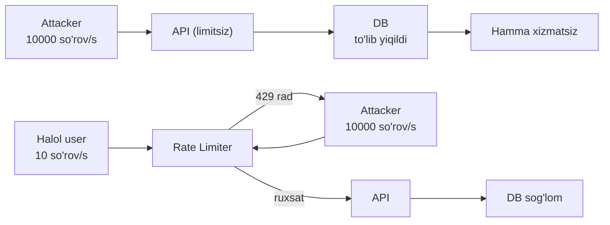
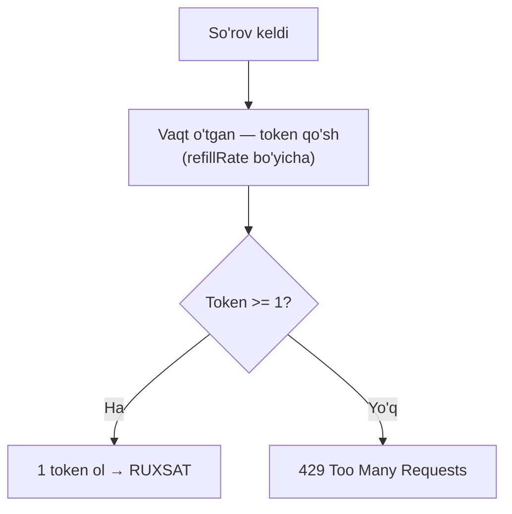
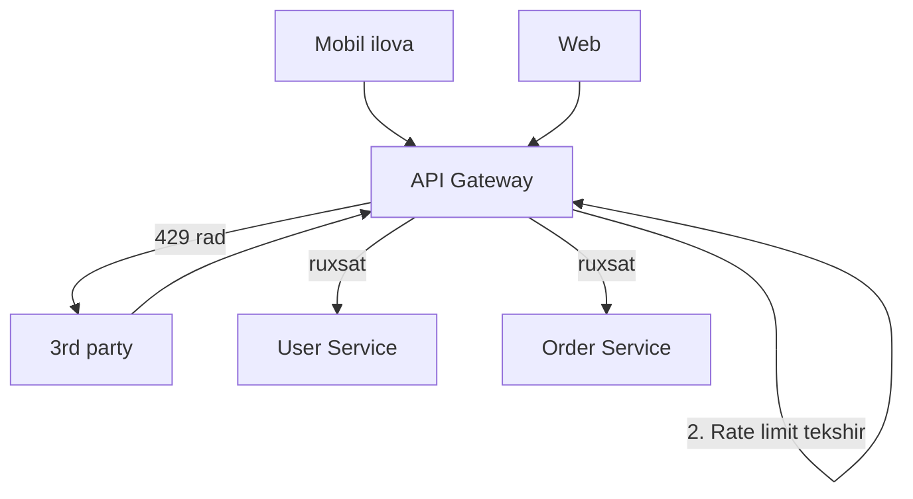
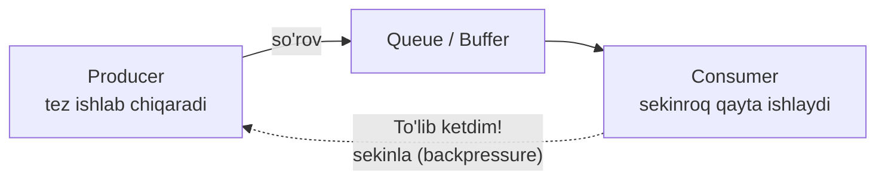

# Rate Limiting va Backpressure — oqimni cheklash

> **Modul 2 — Kengayish usullari, 5-dars (qo'shimcha)**
> Maqsad: kengaytirilgan tizimni haddan tashqari yuklamadan va suiiste'moldan himoya qilishni o'rganish.

---

## 1. Muammo — nega bu kerak?

Butun modul bo'ylab tizimni *kengaytirdik*: server qo'shdik, LB qo'ydik, CDN uladik. Lekin bir haqiqat bor — **hech qanday tizim cheksiz emas**. Har qancha kengaysang ham, chegara bor.

Va har doim kimdir shu chegarani sinaydi:

- **Abuse (suiiste'mol)** — bitta foydalanuvchi skript yozib, sekundiga 10 000 so'rov yuboradi va hammaga yetadigan resursni o'ziga tortib oladi.
- **DDoS hujumi** — minglab kompyuterdan ataylab tizimni bo'g'ish uchun so'rov yog'diriladi.
- **Adolatsizlik** — bitta "ochko'z" mijoz butun quvvatni egallab, halol foydalanuvchilar xizmatsiz qoladi.
- **Tasodifiy avj** — kod xatosidan bir client cheksiz siklda so'rov yuboradi.

Agar tizim *har* so'rovni qabul qilaversa, oxiri bitta: ma'lumotlar bazasi to'lib, butun tizim yiqiladi — halol foydalanuvchilar ham qatorida.

> **Asosiy g'oya:** Kengayish "ko'proq ko'tara olish"ni anglatadi. Rate limiting esa "chegarani bilib, undan ortiqni muloyimlik bilan rad etish"ni anglatadi. Ikkalasi birga ishlaydi.

---

## 2. Analogiya — klub eshigidagi qorovul

Tungi klubning ichida 200 kishiga joy bor. Eshik oldida qorovul turadi. U hisoblab turadi: ichkariga har kirgan uchun bittadan "joy" beriladi, chiqqan odam "joy"ni qaytaradi.

- Joy bor bo'lsa — kiritadi.
- Joy tugasa — "kutib turing" deb eshik oldida ushlab turadi (429 — "hozir band").

Qorovul klubni himoya qiladi: ichkari to'lib, tirbandlik bo'lib, hamma uchun yomon bo'lib qolmasligi uchun. **Rate limiter** — aynan shu qorovul: tizimga kiradigan so'rov *oqimini* nazorat qiladi.

> **Analogiya chegarasi:** Qorovul odamlarni sanaydi; rate limiter esa *vaqt birligidagi so'rovlarni* sanaydi ("sekundiga nechta"). Klubda joy fizik, tizimda esa "joy" — bu quvvat (CPU, DB imkoniyati).

---

## 3. Sodda ta'rif

- **Rate limiting** — foydalanuvchi (yoki IP, yoki API kaliti) ma'lum vaqt ichida qilishi mumkin bo'lgan so'rovlar sonini cheklash.
- Limitdan oshgan so'rovga tizim **429 Too Many Requests** (HTTP status) kodini qaytaradi — "haddan oshding, biroz kut".

Bitta jumlada: rate limiting — "sekundiga N tadan ortiq so'rama" degan qoida.

---

## 4. Diagramma — nega kerak



Limitsiz — attacker DB'ni yiqitadi, hamma zarar ko'radi. Limit bilan — attacker'ning ortiqcha so'rovi 429 bilan rad etiladi, halol user bemalol ishlaydi.

---

## 5. Algoritmlar — so'rovlarni qanday sanaymiz?

Bir necha usul bor. Avval g'oyalarini solishtiramiz, keyin bittasini (token bucket) kodda ko'ramiz.

### a) Fixed Window — qat'iy oyna

Vaqtni teng bo'laklarga bo'lamiz (masalan har 1 daqiqa) va har bo'lakda so'rovlarni sanaymiz. Daqiqa boshlanganda hisoblagich nolga tushadi.

```text
12:00:00–12:00:59 → 100 so'rovgacha ruxsat
12:01:00 → hisoblagich 0 dan boshlanadi
```

**Kamchiligi:** oyna chetidagi "sakrash". 12:00:59 da 100 so'rov + 12:01:00 da yana 100 so'rov = 1 sekundda 200 so'rov o'tib ketadi. Oddiy, lekin aniq emas.

### b) Sliding Window — suriladigan oyna

Qat'iy bo'lak emas, balki "oxirgi 60 sekund"ni kuzatadi. Vaqt o'tgan sari oyna suriladi, eski so'rovlar "tushib qoladi".

```text
Doimo "hozirdan orqaga 60 sekund"ichidagi so'rovlarni sana.
Chetidagi sakrash muammosi yo'q — aniqroq.
```

**Kamchiligi:** har so'rov vaqtini eslab qolish kerak — ko'proq xotira.

### c) Token Bucket — token chelagi

Chelak (bucket) ichida tokenlar bor. Har so'rov bitta token "yeydi". Tokenlar **doimiy tezlikda** to'ldirib turiladi (masalan sekundiga 10 ta). Token bor bo'lsa — ruxsat, yo'q bo'lsa — 429.

Eng chiroyli tarafi: chelakda token to'planib qolsa, foydalanuvchi qisqa vaqtga **portlash (burst)** qilishi mumkin — masalan 5 sekund jim turib, keyin birdan 50 so'rov. Bu real hayotga mos (odam ba'zan ko'proq, ba'zan kamroq so'raydi).

### d) Leaky Bucket — teshik chelak

Chelakga so'rovlar tomib tushadi, tag'idagi teshikdan **doimiy tezlikda** oqib chiqadi (qayta ishlanadi). Chelak to'lib ketsa — ortiqcha so'rov "toshib" yo'qoladi.

Token bucket'dan farqi: leaky bucket **chiqish** tezligini tekislaydi (portlashga yo'l qo'ymaydi), token bucket esa portlashga ruxsat beradi.

### Taqqoslash jadvali

| Algoritm | G'oya | Portlash (burst) | Aniqlik | Xotira |
|----------|-------|-----------------|---------|--------|
| **Fixed Window** | Har oynada sana | Ruxsat (chet sakrashi) | Past | Kam |
| **Sliding Window** | Suriladigan oyna | Cheklangan | Yuqori | Ko'proq |
| **Token Bucket** | Token yeyish + to'ldirish | Ruxsat (nazorat bilan) | O'rta | Kam |
| **Leaky Bucket** | Doimiy oqib chiqish | Yo'q (tekislanadi) | O'rta | Kam |

---

## 6. Worked example — Token Bucket (Go)

Endi eng ko'p ishlatiladigan **token bucket**ni kodda ko'ramiz. Bu Go misoli — chunki siz Go backend yozasiz, va bu algoritm middleware'da tez-tez uchraydi.



```go
// --- 1-qadam: chelak tuzilishi ---
type TokenBucket struct {
    tokens     float64   // hozir nechta token bor
    maxTokens  float64   // chelak sig'imi (portlash chegarasi)
    refillRate float64   // sekundiga nechta token qo'shiladi
    lastRefill time.Time // oxirgi to'ldirish vaqti
    mu         sync.Mutex
}
```

```go
// --- 2-qadam: Allow() — so'rovga ruxsat beriladimi? ---
func (tb *TokenBucket) Allow() bool {
    tb.mu.Lock()
    defer tb.mu.Unlock()

    // 2a: oxirgi so'rovdan beri qancha vaqt o'tgan?
    now := time.Now()
    elapsed := now.Sub(tb.lastRefill).Seconds()

    // 2b: o'tgan vaqtga yarasha token qo'shamiz (maxdan oshirmay)
    tb.tokens = min(tb.maxTokens, tb.tokens+elapsed*tb.refillRate)
    tb.lastRefill = now

    // 2c: token bormi? bor bo'lsa — ol va ruxsat ber
    if tb.tokens >= 1 {
        tb.tokens--
        return true
    }
    return false // token yo'q → 429
}
```

```go
// --- 3-qadam: HTTP middleware'da ishlatish ---
func rateLimitMiddleware(tb *TokenBucket, next http.Handler) http.Handler {
    return http.HandlerFunc(func(w http.ResponseWriter, r *http.Request) {
        if !tb.Allow() {
            w.Header().Set("Retry-After", "1")
            http.Error(w, "Too Many Requests", http.StatusTooManyRequests) // 429
            return
        }
        next.ServeHTTP(w, r) // ruxsat — asosiy handlerga o'tkaz
    })
}
```

**Output (tasavvurda, limit = 5 token/s):**
```text
So'rov 1  → 200 OK (token: 4 qoldi)
So'rov 2  → 200 OK (token: 3 qoldi)
...
So'rov 5  → 200 OK (token: 0 qoldi)
So'rov 6  → 429 Too Many Requests (token yo'q)
[1 sekund kutildi → +5 token qo'shildi]
So'rov 7  → 200 OK
```

**Notional machine:** `tokens` — bu shunchaki bir `float64` son RAM'da. Har `Allow()` chaqirilganda kod "hozir soat necha?" deb so'rab, o'tgan sekundlarni `refillRate` ga ko'paytirib tokenni oshiradi — ya'ni tokenlar goroutine bilan "fon"da qo'shilmaydi, balki **har so'rovda hisoblab** chiqiladi. `sync.Mutex` esa bir vaqtda ikki goroutine tokenni buzmasligi uchun himoya qiladi.

---

## 7. API Gateway'da rate limiting

Rate limiter'ni har servisga alohida yozish o'rniga, uni **markaziy kirish nuqtasiga** — API Gateway'ga qo'yiladi. API Gateway (barcha so'rovlar o'tadigan yagona darvoza) so'rovni ichkariga o'tkazishdan oldin tekshiradi.



Bu joylashuv qulay: limit bir joyda, hamma servis undan himoyalanadi, kod takrorlanmaydi. Odatda limit har xil darajada qo'yiladi:

| Daraja | Misol |
|--------|-------|
| **Per IP** | Har IP 1000 so'rov/daqiqa (DDoS'ga qarshi) |
| **Per user** | Har foydalanuvchi 100 so'rov/daqiqa |
| **Per API key** | Har developer 10 000 so'rov/kun |
| **Per endpoint** | `/login` faqat 5 so'rov/daqiqa (parol tanlashga qarshi) |

**429 javobi** bilan birga foydali headerlar yuboriladi:
```text
HTTP 429 Too Many Requests
X-RateLimit-Limit: 100
X-RateLimit-Remaining: 0
Retry-After: 60          ← "60 sekunddan keyin qayta urin"
```

`Retry-After` — muhim: client'ga *qachon* qayta urinishni aytadi. Yaxshi client buni o'qib kutadi, ko'r-ko'rona qayta urinavermaydi.

### Qo'shimcha — to'liq 429 headerlar va Redis bilan taqsimlangan hisoblash

429 javobiga odatda uchta rate limit headeri qo'shiladi. Yuqorida ikkitasini ko'rdik; uchinchisi — **`X-RateLimit-Reset`** — limit qachon "yangilanishi"ni (Unix vaqt sifatida) aytadi, shunda client aynan qaysi soniyada yana urinishni biladi.

```text
HTTP 429 Too Many Requests
X-RateLimit-Limit: 100          # oynadagi umumiy limit
X-RateLimit-Remaining: 0        # qolgan so'rovlar soni
X-RateLimit-Reset: 1640000060   # limit nechanchi Unix soniyada tiklanadi
Retry-After: 60                 # necha soniyadan keyin qayta urin
```

Yana bir daraja — **Global** (butun tizim bo'yicha, masalan "hammasi birga 1M so'rov/s"): bu individual limitlarga qo'shimcha "shift devor", tizimni umumiy toshib ketishdan saqlaydi.

Endi yuqorida (Xato 3) aytilgan muammoni yopamiz: 5 serverda limit "sizib" ketmasligi uchun hisoblagichni **Redis**da (umumiy joyda) tutamiz. Quyida oddiy **Fixed Window** varianti:

```go
// --- Redis bilan taqsimlangan Fixed Window ---
func RateLimitFixed(rdb *redis.Client, key string, limit int, window time.Duration) bool {
    ctx := context.Background()
    // 1-qadam: kalitga vaqt oynasini bog'laymiz (har oynada boshqa kalit)
    windowKey := fmt.Sprintf("%s:%d", key, time.Now().Unix()/int64(window.Seconds()))
    // 2-qadam: hisoblagichni atomik oshiramiz (barcha server bitta Redis'ni ko'radi)
    count, _ := rdb.Incr(ctx, windowKey).Result()
    // 3-qadam: birinchi so'rovda kalitga muddat (TTL) qo'yamiz — oyna tugasa o'zi o'chadi
    if count == 1 {
        rdb.Expire(ctx, windowKey, window)
    }
    // 4-qadam: limitdan oshmagan bo'lsa ruxsat
    return count <= int64(limit)
}
```

`Incr` — **atomik** amal: 5 server bir vaqtda chaqirsa ham Redis ularni birma-bir sanaydi, hech qaysi so'rov "yo'qolmaydi". Shu tariqa "100 so'rov/daqiqa" haqiqatan 100 bo'lib qoladi, 500 emas.

---

## Backpressure — "sekinroq!" signali

Rate limiting — *tashqi* mijozni cheklashdi. **Backpressure** esa tizimning *ichki* himoya mexanizmi: qabul qiluvchi komponent jo'natuvchiga "sekinroq, men ulgurmayapman" deb signal beradi.

Analogiya: konveyer lentasi. Agar oxirdagi ishchi ulgurmasa, u tugmani bosib lentani sekinlatadi — aks holda detallar to'planib, yerga to'kiladi. Backpressure — shu "sekinlat" signali.



Backpressure bo'lmasa nima bo'ladi? Producer tez ishlab, consumer ulgurmasa — oradagi queue cheksiz o'sadi, RAM to'ladi, tizim yiqiladi. Backpressure bilan producer sekinlaydi yoki ortiqchani rad etadi (429 ham backpressure'ning bir shakli).

> **Farqni esla:** Rate limiting — "tashqaridan kelganni eshik oldida cheklash". Backpressure — "ichkaridagi komponent 'to'xta' deb signal berishi". Ikkalasi ham maqsad bitta: tizim o'z quvvatidan oshib yiqilmasin.

Go'da backpressure tabiiy ravishda **buffered channel** orqali ifodalanadi: channel to'lsa, unga yozmoqchi bo'lgan goroutine bloklanadi (kutadi) — bu aynan "sekinla" signali.

---

## Predict savoli (PRIMM)

> 🤔 **O'ylab ko'r:** Token bucket'da `maxTokens = 100`, `refillRate = 10/s` qo'yding. Foydalanuvchi 20 sekund umuman so'rov yubormadi, keyin birdan so'rov boshladi. Birinchi sekundda u nechta so'rov yubora oladi?

<details>
<summary>💡 Javobni ko'rish</summary>

**100 ta** (sekundiga 10 emas!). Chunki u jim turgan 20 sekund davomida chelak to'ldi — lekin `maxTokens = 100` bo'lgani uchun 100 dan oshmaydi (10 sekundda to'lib bo'ldi, qolgan 10 sekund "isrof"). Endi chelakda 100 token bor, foydalanuvchi birdan 100 so'rov (burst) yubora oladi.

Bu **token bucket'ning xususiyati** — u portlashga ruxsat beradi. Agar buni istamasang (silliq oqim kerak bo'lsa), `maxTokens`ni kichik qil (masalan 10) yoki leaky bucket ishlat. Bu — algoritm tanlash nima uchun muhimligini ko'rsatadi.

</details>

---

## Ko'p uchraydigan xatolar

⚠️ **Xato 1: "Rate limit qo'ydim — endi DDoS'dan himoyalanganman."**
Noto'g'ri — application darajasidagi rate limit katta hajmli (volumetric) DDoS'ni to'liq to'xtata olmaydi, chunki so'rovlar serverga *yetib* keladi (429 qaytarish uchun ham resurs ketadi). To'g'risi: rate limit bir qatlam; katta DDoS uchun tarmoq darajasidagi himoya (CDN, WAF, DDoS protection servisi) ham kerak.

⚠️ **Xato 2: "429 qaytardim — ish tamom."**
Noto'g'ri — `Retry-After` bermasang, ko'p client darhol qayta urinaveradi va yukni yana oshiradi. To'g'risi: `Retry-After` va rate limit headerlarini ber, client aqlli kutsin.

⚠️ **Xato 3: "Bir necha serverda har biriga alohida token bucket qo'ydim."**
Noto'g'ri — agar limit "foydalanuvchi 100 so'rov/daqiqa" bo'lsa-yu, 5 serverda har birida alohida hisoblagich bo'lsa, foydalanuvchi amalda 500 so'rov yubora oladi (har serverga 100). To'g'risi: taqsimlangan tizimda limitni umumiy joyda (masalan Redis) sana, aks holda limit "sizib" ketadi.

---

## Xulosa

- **Rate limiting** — vaqt birligidagi so'rovlarni cheklab, abuse, DDoS va adolatsizlikdan himoya qiladi.
- Limitdan oshgan so'rov **429 Too Many Requests** oladi; `Retry-After` bilan qachon qayta urinishni aytadi.
- Algoritmlar: **Fixed Window** (oddiy, chet sakrashi), **Sliding Window** (aniq, xotira ko'p), **Token Bucket** (portlashga ruxsat), **Leaky Bucket** (silliq oqim).
- **Token bucket** — eng mashhur: token yeyish + doimiy to'ldirish; burst'ni nazorat bilan qo'llab-quvvatlaydi.
- **API Gateway** — rate limit uchun ideal joy: bir marta qo'ysang, hamma servis himoyalanadi.
- **Backpressure** — ichki mexanizm: to'lgan komponent jo'natuvchiga "sekinla" deb signal beradi; Go'da buffered channel bu vazifani bajaradi.

## 🧠 Eslab qol

- Rate limiter = klub eshigidagi qorovul.
- Limitdan oshsa → 429 + Retry-After.
- Token bucket portlashga (burst) ruxsat beradi, leaky bucket bermaydi.
- Taqsimlangan limitni umumiy joyda (Redis) sana, aks holda sizib ketadi.
- Backpressure — "ichkaridan 'to'xta' signali"; Go'da buffered channel.

## ✅ O'z-o'zini tekshir (retrieval practice)

**1.** Nega application-level rate limit katta DDoS'ni to'liq to'xtata olmaydi?

<details>
<summary>Javob</summary>

Chunki DDoS so'rovlari baribir serverga *yetib* keladi — hatto 429 qaytarish uchun ham server har so'rovni qabul qilib, tekshirib, javob berishi kerak. Katta hajmli hujumda aynan shu tekshirish ham serverni (va tarmoqni) bo'g'ib qo'yadi. Shuning uchun rate limit bir qatlam, xolos; volumetric DDoS uchun undan oldinroqda — tarmoq darajasida (CDN, WAF, DDoS protection) himoya kerak.

</details>

**2.** Token bucket va leaky bucket — ikkalasi ham chelak, farqi nimada va qachon qaysini tanlaysan?

<details>
<summary>Javob</summary>

**Token bucket** portlashga (burst) ruxsat beradi: chelakda token to'planib qolsa, foydalanuvchi birdan ko'p so'rov yubora oladi. **Leaky bucket** esa chiqish tezligini tekislaydi — so'rovlar doimiy tezlikda oqib chiqadi, portlashga yo'l yo'q. Real, notekis trafik (odam ba'zan ko'p so'raydi) uchun token bucket qulay; orqadagi tizimni *silliq, barqaror* oqim bilan himoya qilish kerak bo'lsa (masalan sekin DB) — leaky bucket.

</details>

**3.** 5 ta serverda har biriga alohida "100 so'rov/daqiqa" token bucket qo'yding. Foydalanuvchi amalda nechta so'rov yubora oladi va nega?

<details>
<summary>Javob</summary>

Amalda **500 so'rov/daqiqa** — chunki LB uni turli serverlarga tarqatadi, har server o'z hisoblagichida "100"ni sanaydi va boshqalardan bexabar. Limit "sizib" ketdi. To'g'risi: hisoblagichni umumiy joyda (Redis) tutish — shunda 5 server ham bitta umumiy sanoqni ko'radi va limit haqiqiy 100 bo'lib qoladi.

</details>

**4.** Rate limiting va backpressure — ikkalasi ham "oqimni cheklash". Asosiy farqi nimada?

<details>
<summary>Javob</summary>

Rate limiting — **tashqi** himoya: mijoz yuboradigan so'rovlarni eshik oldida (masalan API Gateway'da) cheklaydi. Backpressure — **ichki** himoya: tizim ichidagi komponent (consumer) o'zidan oldingisiga (producer) "men ulgurmayapman, sekinla" deb signal beradi. Biri tashqaridan kelganni, ikkinchisi ichkaridagi komponentlar orasidagi oqimni boshqaradi; maqsad ikkalasida ham tizim yiqilmasin.

</details>

## 🛠 Amaliyot

**1. Oson (savol/diagramma):**
Token bucket algoritmini flowchart ko'rinishida o'zing chiz: so'rov keladi → token qo'shiladi → token bormi? → ha (ruxsat) / yo'q (429).

<details>
<summary>Hint</summary>

Boshda "vaqt o'tgan — token qo'sh" bloki, keyin bitta shart-romb ("token >= 1?"), undan ikki yo'l: ruxsat va 429. Yuqoridagi diagrammaga qaramay chizishga urin.

</details>

**2. O'rta (kamchilikni top):**
Jamoa shunday dizayn qildi: "Har API serverda local (xotiradagi) token bucket, `/login` uchun ham umumiy `/api/*` uchun ham bitta hisoblagich. Limitdan oshsa 429 qaytaramiz, headersiz." Bu dizaynda kamida 2 ta muammo bor. Top.

<details>
<summary>Hint</summary>

(1) Local hisoblagich 5 serverda — limit "sizib ketadi" (Redis kerak). (2) `/login` va `/api/*` bir hisoblagichda — parolni ming marta sinamoqchi attacker oddiy so'rovlar bilan ham limitni tugatib, halol userni bloklab qo'yishi mumkin; `/login`ga alohida, qattiqroq limit kerak. (3) Header (Retry-After) yo'q — client ko'r-ko'rona qayta urinaveradi.

</details>

**3. Qiyin (kichik dizayn masalasi):**
Ommaviy API platforma dizayn qil (masalan ob-havo API'si). Talablar: (a) bepul foydalanuvchilar 60 so'rov/daqiqa, pullilar 1000 so'rov/daqiqa; (b) `/auth/login` alohida, juda qattiq limit; (c) tizim 10 serverga kengaygan, limit aniq sanalsin; (d) limitdan oshgan client aqlli kutsin. Qaysi algoritm, qayerda saqlaysan (local/Redis), qanday headerlar qaytaraysan? Diagramma chiz.

<details>
<summary>Hint</summary>

(a) API kaliti darajasida limit + tarif bo'yicha turli `maxTokens`. (b) `/auth/login` uchun alohida, kichik token bucket (masalan 5/daqiqa per IP). (c) 10 serverda aniq sanash uchun **Redis**da markaziy hisoblagich. (d) `429 + Retry-After + X-RateLimit-*` headerlar. Diagrammada: Client → API Gateway (Redis token bucket) → servislar; 429 yo'lini ham ko'rsat.

</details>

## 🔁 Takrorlash

**Bog'liq oldingi mavzular:**
- [Modul 2: Vertikal va gorizontal kengayish](./01-vertikal-va-gorizontal-kengayish.md) — kengayish "ko'proq ko'tarish", rate limiting "chegarani rad etish"; ikkalasi birga ishlaydi.
- [Modul 2: Load balancing](./02-load-balancing.md) — nega 5 serverda local limit "sizib" ketadi; LB so'rovlarni tarqatadi.
- [Modul 2: Stateful va stateless](./03-stateful-va-stateless.md) — taqsimlangan limit hisoblagichi ham *tashqi holat* (Redis'da), aynan shu sababdan.
- [1-modul: Internet tarmog'i va protokollari](../01-tizimlar-negizi/04-internet-tarmogi-va-protokollari.md) — HTTP status kodlari (429) va headerlar shu yerda o'rganilgan.
- [1-modul: API uslublari (REST, GraphQL, gRPC)](../01-tizimlar-negizi/05-api-uslublari-rest-graphql-grpc.md) — API Gateway va endpoint tushunchasi.

**Takrorlash jadvali:**
- **Ertaga:** 4 ta algoritmni (Fixed/Sliding Window, Token/Leaky Bucket) va har birining burst xatti-harakatini yoddan yoz.
- **3 kundan keyin:** token bucket `Allow()` mantiqini (vaqt → token qo'sh → tekshir) xotiradan tikla.
- **1 haftadan keyin:** rate limiting vs backpressure farqini va amaliyotning "qiyin" masalasini qaytadan yech.

**Feynman testi:** Do'stingga "nega tizim ba'zan 'juda ko'p so'rov, kutib tur' deydi va bu nega yaxshi?" ni klub eshigidagi qorovul misolida 3 jumlada tushuntir.

**Modul yakuni:** Tabrik! Modul 2 tugadi — endi tizimni vertikal/gorizontal kengaytirish, LB bilan yuk taqsimlash, stateless qilish, CDN bilan yaqinlashtirish va rate limiting bilan himoya qilishni bilasan. Keyingi modulda ma'lumotlar bazasini kengaytirish (replication, sharding) mavzusiga o'tamiz.
