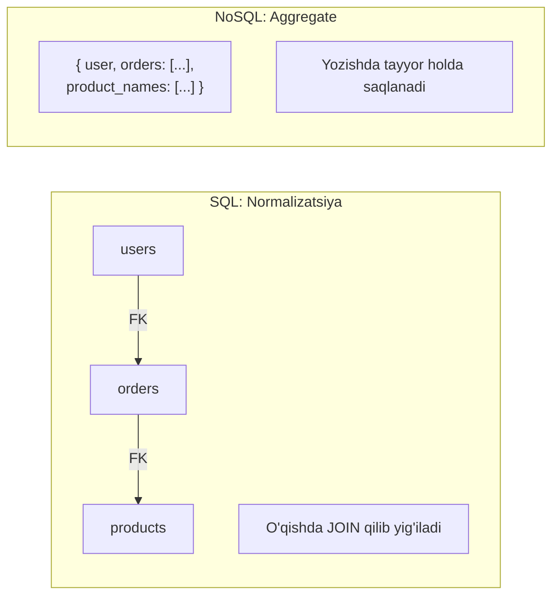
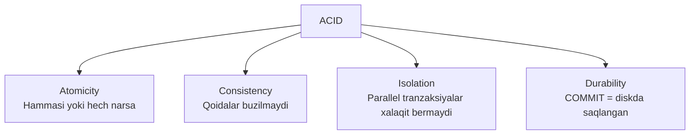
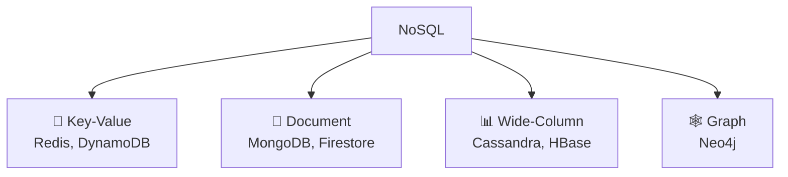
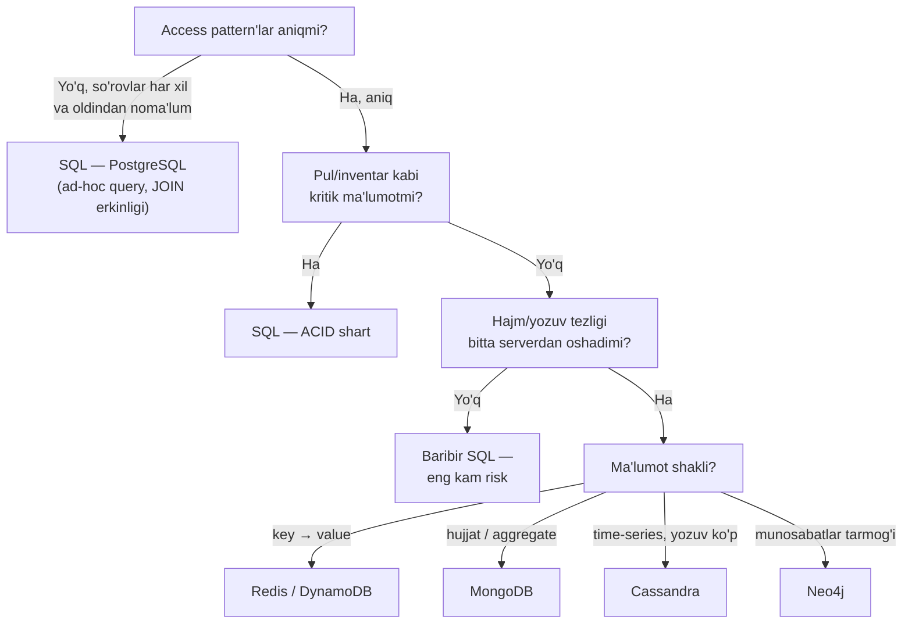
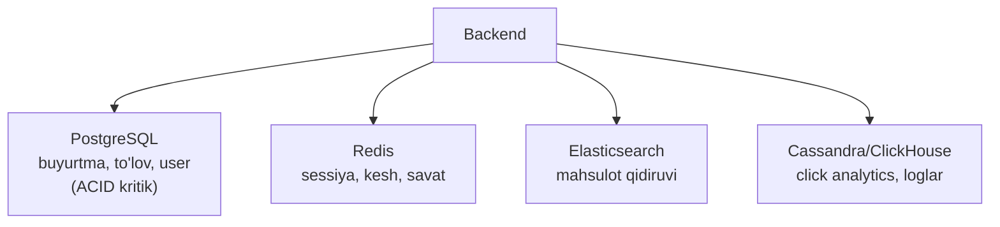
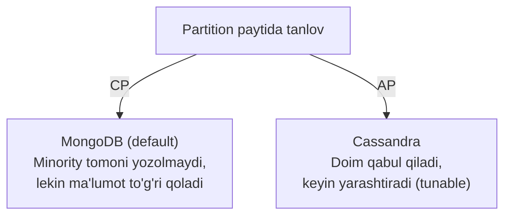

# SQL vs NoSQL

## Asl farq nimada? (Ko'pchilik noto'g'ri tushunadigan joy)

Ko'pchilik "SQL — sekin lekin ishonchli, NoSQL — tez lekin ishonchsiz" deb o'ylaydi. **Bu noto'g'ri.** Asl farq uchta o'qda yotadi:

### 1-o'q: Ma'lumot modeli falsafasi

- **SQL — normalizatsiya falsafasi:** har bir fakt bitta joyda saqlanadi, jadvallar foreign key bilan bog'lanadi, kerak bo'lganda join qilib yig'ib olinadi. Avval ma'lumot strukturasi loyihalanadi, so'rovlar keyin keladi. Bu — **schema-on-write**.
- **NoSQL — aggregate falsafasi:** birga o'qiladigan ma'lumot birga saqlanadi (user hujjati ichida uning orderlari ham). Avval "qanday so'rovlar bo'ladi?" deb so'raladi, keyin ma'lumot o'sha so'rovlarga moslab joylanadi. Bu — **query-first design** va **schema-on-read**.

### 2-o'q: Scaling modeli

SQL join va transaction'ga tayanadi — ikkalasi ham barcha ma'lumot bitta mashinada bo'lsa oson ishlaydi. Shuning uchun SQL asosan **vertical scaling** (kuchliroq server) bilan o'sadi. NoSQL joindan voz kechgani uchun ma'lumotni kalit bo'yicha yuzlab serverga bemalol tarqatadi — **horizontal scaling**.

### 3-o'q: Consistency kafolati

SQL — **ACID** (har bir transaction yaxlit). Ko'p NoSQL tizimlar — **BASE** (tizim doim javob beradi, lekin ma'lumot barcha nodelarga *biroz kechikib* tarqaladi).



> **Analogiya:** SQL — kutubxona: har kitob bitta nusxada, kartoteka orqali topiladi, tartib qat'iy. NoSQL — sizning ish stolingiz: hozir kerak narsalar birga turadi, ba'zi hujjatning nusxasi ikki joyda bo'lishi mumkin, lekin qo'l uzatsangiz — tayyor.

---

## SQL (Relational DB)

**Misollar:** PostgreSQL, MySQL, SQLite

### Xususiyatlari

- Jadvallar va ustunlar (rows & columns)
- ACID kafolatlari
- SQL tili — ad-hoc so'rovlar erkinligi
- Qattiq schema (schema-on-write)
- Join orqali bog'liq ma'lumotlar

### ACID (pul o'tkazish misolida)



- **Atomicity** — "A dan yechish + B ga qo'shish" yo ikkalasi bajariladi, yo hech biri (server o'rtada o'chsa ham).
- **Consistency** — transaction'dan keyin barcha qoidalar (balans ≥ 0, FK'lar) buzilmagan bo'ladi.
- **Isolation** — parallel ikkita transfer bir-birining yarim-tayyor holatini ko'rmaydi.
- **Durability** — COMMIT qaytdi = ma'lumot diskda (WAL orqali), server o'chsa ham saqlanib qoladi.

---

## NoSQL

**Turlari:**



### Key-Value

```
key: "user:123"
value: { name: "Ali", age: 25 }

Foydalanish: kesh, sessiya, real-time leaderboard
```

### Document

```json
{
  "_id": "123",
  "name": "Ali",
  "address": {
    "city": "Toshkent",
    "zip": "100000"
  },
  "orders": [
    { "id": 1, "amount": 50000 }
  ]
}
```

Foydalanish: CMS, katalog, foydalanuvchi profillari

### Wide-Column (Cassandra)

```
Row Key: "user_events:123:2024"
Columns: event_1, event_2, event_3, ...

Foydalanish: time-series, analytics, IoT
```

### Graph (Neo4j)

```
(Ali)-[:FRIENDS_WITH]->(Vali)
(Ali)-[:LIKES]->(Post)

Foydalanish: ijtimoiy tarmoq, tavsiya tizimi
```

### BASE

Ko'p NoSQL tizimlarning kafolat modeli:

- **B**asically **A**vailable — tizim doim javob beradi (ba'zan eskirgan ma'lumot bilan)
- **S**oft state — holat vaqt o'tishi bilan sinxronlashadi
- **E**ventually consistent — yozuv oxir-oqibat barcha replikalarga yetadi

Misol: Instagram'da like bosdingiz — do'stingiz sonni 1-2 soniya eskicha ko'rishi mumkin, hech kimga zarar yo'q.

---

## Taqqoslash Jadvali

| | SQL | NoSQL |
|--|-----|-------|
| **Schema** | Qattiq (schema-on-write) | Moslashuvchan (schema-on-read) |
| **Scalability** | Vertical (asosan) | Horizontal |
| **Kafolat** | ✅ ACID | ⚠️ BASE (ko'pincha) |
| **Join** | ✅ Oson | ❌ Murakkab / yo'q |
| **So'rovlar** | Ad-hoc, erkin | Oldindan rejalashtirilgan pattern |
| **Ma'lumot shakli** | Tuzilgan, relational | Har qanday |
| **Tezlik** | Model to'g'ri kelsa — juda tez | O'z pattern'ida — juda tez |
| **Misol** | Bank, ERP, e-commerce order | Kesh, katalog, IoT, feed |

> **Diqqat:** "NoSQL tezroq" — noto'g'ri umumlashtirish. Tezlik dvigatelda emas, **model va so'rov mosligida** (pastdagi S5'ga qarang).

---

## DB qanday tanlanadi — amaliy framework

Intervyuda ham, real loyihada ham shu 5 savol ketma-ketligi ishlaydi:

1. **Access pattern qanday?** Eng muhim savol. "Qanday ma'lumot bor?" emas — "**qanday so'rovlar bo'ladi?**" ID bo'yicha bitta obyekt olishmi? Murakkab filtrlar va aggregatsiyalarmi? Ko'p jadval kesishadigan hisobotlarmi?
2. **Consistency qanchalik kritik?** Pul, inventar, bron — bir soniya ham noto'g'ri ko'rinishi mumkin emas → **strong consistency (ACID)** shart. Like soni, ko'rishlar, feed — 2 soniya eskirgan bo'lsa hech kim sezmaydi → **eventual consistency** yetadi.
3. **Hajm va o'sish qanday?** Yiliga bir necha yuz GB — bitta PostgreSQL bemalol ko'taradi (to'g'ri indeks bilan yuz millionlab qator muammo emas). Kuniga terabaytlab yozuv (IoT, loglar, clickstream) → horizontal scaling kerak.
4. **Ma'lumot shakli qanchalik o'zgaruvchan?** Har bir yozuv har xil maydonlarga ega bo'lsa (telefon vs futbolka atributlari) — flexible schema qulay.
5. **Jamoa nimani biladi?** PostgreSQL biladigan jamoaga Cassandra berish — loyihani cho'ktirish.



> **Oltin qoida:** aniq sabab bo'lmasa — **PostgreSQL bilan boshlang**. "Default — SQL, NoSQL — isbotlangan ehtiyoj bo'lganda" pozitsiyasi senior javob hisoblanadi. NoSQL'ni "zamonaviy ko'ringani uchun" tanlash — klassik junior xato.

---

## Nega bu loyihaga SQL, unisiga NoSQL? — konkret misollar

### SQL tanlanadigan loyihalar

- **Bank / to'lov tizimi.** A hisobdan B hisobga pul o'tkazish — ikkita yozuv **bitta transaction** ichida bo'lishi shart: birinchisi bajarilib ikkinchisi yiqilsa, pul "yo'qoladi" (Atomicity). Balans hech qachon minusga tushmasligi — Consistency (CHECK constraint). Shu kafolatlarni NoSQL'da qo'lda qurish — o'zingizga xato yozish demakdir.
- **E-commerce buyurtma va inventar.** Oxirgi 1 dona mahsulotni 2 kishi bir vaqtda sotib olmoqchi. SQL'da Isolation + row lock buni tabiiy hal qiladi: `UPDATE stock SET qty = qty - 1 WHERE qty > 0`. Eventual consistent tizimda ikkalasiga ham "sotildi" deb yuborib qo'yish mumkin.
- **ERP / CRM / buxgalteriya.** Ma'lumotlar tabiatan relational (mijoz → shartnoma → hisob-faktura → to'lov) va hisobotlar oldindan noma'lum ad-hoc so'rovlar bilan olinadi. JOIN erkinligi bu yerda oltin.

### NoSQL tanlanadigan loyihalar

- **Sessiya / kesh / leaderboard → Redis (key-value).** Ma'lumot doim bitta kalit bo'yicha olinadi, TTL kerak, latency mikrosekund darajada. Relational modelning hech bir kuchi ishlatilmaydi — nega uning narxini to'lash?
- **Mahsulot katalogi / CMS → MongoDB (document).** Telefonda `screen_size`, `ram` bor; futbolkada `size`, `color`, `material`. Ming xil kategoriya — ming xil atribut. SQL'da bu yo yuzlab nullable ustun, yo qo'pol EAV jadval bo'lardi. Document modelda har mahsulot — o'z shaklidagi hujjat.
- **IoT / metrikalar / chat tarixi → Cassandra (wide-column).** Kuniga milliardlab yozuv, deyarli hech qachon UPDATE yo'q, o'qish doim "shu device'ning oxirgi N soati" ko'rinishida. Cassandra yozuvni linearga yaqin scale qiladi: 10 node yetmasa — 20 qilasiz.
- **Ijtimoiy tarmoq grafi / tavsiya → Neo4j (graph).** "Do'stimning do'stlari ichida shu kursni yoqtirganlar" — SQL'da 3-4 darajali self-join bo'lib chirmashib ketadi, graph DB'da bu tabiiy traversal.

### Muhim haqiqat: polyglot persistence

Katta loyihalar ikkalasini ham ishlatadi. Savol "SQL **yoki** NoSQL" emas — "**qaysi ma'lumotga qaysi tizim**". Real e-commerce arxitekturasi:



---

## CAP bilan bog'liq tanlov

CAP — **faqat distributed tizimlar** haqida: network partition paytida **C**onsistency (eskirgan javob bergandan ko'ra xato qaytar) yoki **A**vailability (javob ber, eskirgan bo'lsa ham) tanlanadi.



> **Diqqat (intervyu tuzog'i):** bitta serverdagi PostgreSQL'ga CAP umuman tegishli emas — u distributed tizim emas. "CA tizim" degani partition bo'lmaydi degan taxmin; real tarmoqda partition muqarrar, shuning uchun real tanlov — CP yoki AP.

Batafsil: [2. CAP Theorem.md](2.%20CAP%20Theorem.md)

---

## Go'da PostgreSQL

```go
package main

import (
    "database/sql"
    "fmt"
    _ "github.com/lib/pq"
)

type User struct {
    ID    int
    Name  string
    Email string
}

func getUser(db *sql.DB, id int) (*User, error) {
    var u User
    err := db.QueryRow(
        "SELECT id, name, email FROM users WHERE id = $1", id,
    ).Scan(&u.ID, &u.Name, &u.Email)
    if err != nil {
        return nil, err
    }
    return &u, nil
}
```

## Go'da MongoDB

```go
package main

import (
    "context"
    "go.mongodb.org/mongo-driver/bson"
    "go.mongodb.org/mongo-driver/mongo"
)

type User struct {
    ID    string `bson:"_id"`
    Name  string `bson:"name"`
    Email string `bson:"email"`
}

func getUser(coll *mongo.Collection, id string) (*User, error) {
    var u User
    err := coll.FindOne(
        context.Background(),
        bson.M{"_id": id},
    ).Decode(&u)
    return &u, err
}
```

---

## Intervyuda ko'p uchraydigan savollar va javoblar

### S1: SQL va NoSQL'ning asosiy farqi nima?

Uch o'qda javob bering: (1) model — normalizatsiya + join vs aggregate + denormalizatsiya; (2) scaling — vertical vs horizontal; (3) kafolat — ACID vs BASE/eventual consistency. "NoSQL tezroq" demang — bu trade-off, mutlaq ustunlik emas.

### S2: ACID'ni misol bilan tushuntiring

Pul o'tkazish misoli eng yaxshisi (yuqoridagi ACID bo'limiga qarang). Har harfni konkret holat bilan bog'lang: Atomicity — server o'rtada o'chsa; Isolation — parallel ikkita transfer; Durability — COMMIT'dan keyin server o'chsa.

### S3: BASE nima?

Basically Available + Soft state + Eventually consistent (yuqoridagi BASE bo'limiga qarang). Real misol keltiring: like soni, feed — eskirgan bo'lsa zarar yo'q.

### S4: Nega SQL'ni horizontal scale qilish qiyin?

Ikki sabab: (1) **JOIN** — jadvallar turli serverlarda bo'lsa, join tarmoq orqali ma'lumot tashishga aylanadi, bu juda qimmat; (2) **distributed transaction** — bir transaction ikki shard'ga tegsa, two-phase commit (2PC) kerak, u sekin va mo'rt. NoSQL joindan voz kechib, aggregate'ni bitta kalit ostida saqlagani uchun har so'rov bitta shard'ga tushadi.

### S5: "NoSQL SQL'dan tezroq" — to'g'rimi?

Yo'q, noto'g'ri umumlashtirish. NoSQL **o'zi mo'ljallangan access pattern uchun** tez (kalit bo'yicha o'qish, yuqori hajmli yozuv). Lekin MongoDB'da ko'p kolleksiyani "join" qilish (`$lookup`) yoki Cassandra'da rejalashtirilmagan filtr — indekslangan PostgreSQL so'rovidan ancha sekin. Tezlik dvigatelda emas, **model va so'rov mosligida**.

### S6: CAP teoremasining DB tanlashga aloqasi?

Partition paytidagi C/A tanlovi (yuqoridagi CAP bo'limiga qarang). Kuchli javob: "CA tizim degani partition bo'lmaydi degan taxmin, real tarmoqda partition muqarrar, shuning uchun real tanlov CP yoki AP".

### S7: Denormalization nima va qachon qilinadi?

O'qishni tezlashtirish uchun ma'lumotni ataylab nusxalab saqlash (masalan, `orders` jadvaliga `product_name`ni ham yozib qo'yish — join qilmaslik uchun). Narxi: yozuv murakkablashadi (nusxalarni yangilash kerak) va nomuvofiqlik xavfi. Read-heavy tizimlarda oqlanadi. NoSQL'da bu istisno emas — dizaynning o'zagi.

### S8: MongoDB transaction qo'llab-quvvatlaydimi?

Ha — bitta hujjat ichida har doim atomik bo'lgan, 4.0 dan beri multi-document ACID transaction ham bor. Lekin nuans: cross-shard transaction qimmat va sekin. To'g'ri javob: "agar dizaynda muntazam multi-document transaction kerak bo'lsa, bu ma'lumot modeli noto'g'ri tanlangani belgisi — yo hujjatni qayta loyihalash, yo SQL olish kerak".

### S9: Schema-flexible degani "schema yo'q" deganimi?

Yo'q. Schema baribir mavjud — u DB'dan **application kodiga** ko'chadi (schema-on-read). Xavfi: 3 yil ichida kolleksiyada 5 xil "versiya"dagi hujjatlar paydo bo'ladi va har o'qishda kod hammasini handle qilishi kerak. SQL'da migration og'riqli, lekin bir marta; NoSQL'da esa har doim kodda.

### S10: E-commerce loyihasi berildi — qanday DB tanlaysiz? (dizayn savoli)

Ma'lumotni kritiklik bo'yicha ajrating: buyurtma/to'lov/inventar → PostgreSQL (ACID); savat/sessiya → Redis (tez, TTL bor, yo'qolsa fojia emas); mahsulot qidiruvi → Elasticsearch; ko'rishlar analitikasi → ClickHouse yoki Cassandra. Keyin qo'shing: "boshlanishida hammasi PostgreSQL'da bo'ladi, boshqa tizimlar **o'lchangan ehtiyoj** paydo bo'lganda qo'shiladi" — bu pragmatizm intervyuerga yoqadi.

### S11: Read replica bilan sharding farqi?

Replica — o'sha ma'lumotning nusxasi (read'ni scale qiladi, availability beradi), sharding — ma'lumotni bo'laklab taqsimlash (write va hajmni scale qiladi). SQL'da replica oson, sharding qiyin; shuning uchun "avval read replica + kesh, sharding — eng oxirgi chora" ketma-ketligi standart javob. Batafsil: [3. Sharding va Replication.md](3.%20Sharding%20va%20Replication.md)

### S12: PostgreSQL'da JSONB bor — unda nega MongoDB kerak?

JSONB flexible schema masalasini SQL ichida hal qiladi va ko'p hollarda MongoDB'ga hojat qoldirmaydi. MongoDB'ning qolgan ustunligi — built-in horizontal sharding va document-native ekotizim. Ya'ni: "schema moslashuvchanligi uchun MongoDB olish shart emas — JSONB yetadi; MongoDB scale-out kerak bo'lganda ma'noli".

---

## Bir jumlalik xulosa

**DB tanlash — texnologiya tanlash emas, trade-off tanlash:** consistency vs availability, yozuv qulayligi vs o'qish tezligi, schema qat'iyligi vs moslashuvchanlik. Intervyuda hech qachon "X yaxshiroq" demang — "bu access pattern va bu kafolatlar uchun X to'g'ri keladi, chunki..." deng.

---

## Keyingi Qadam

→ [2. CAP Theorem.md](2.%20CAP%20Theorem.md)
