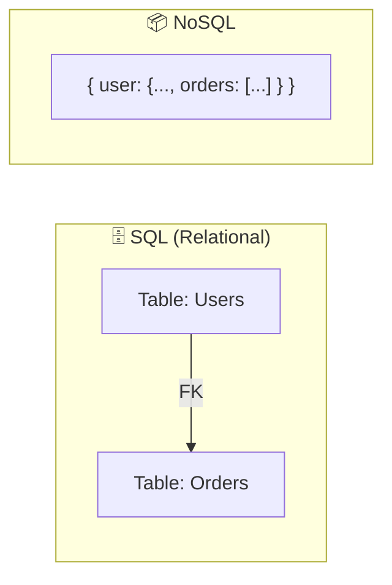
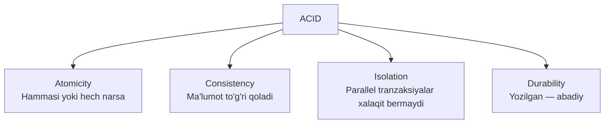
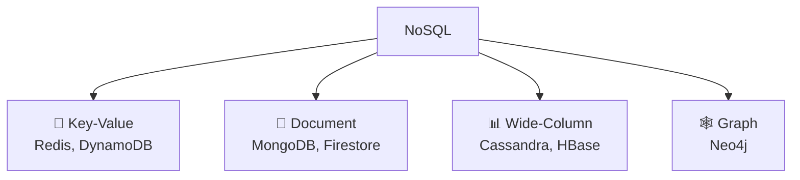
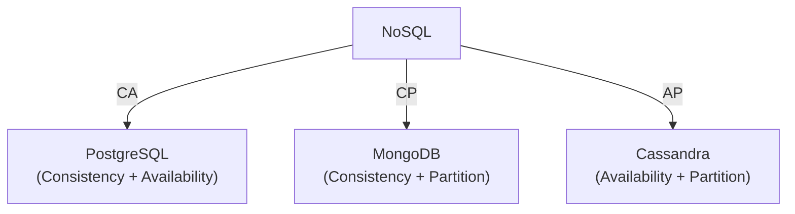
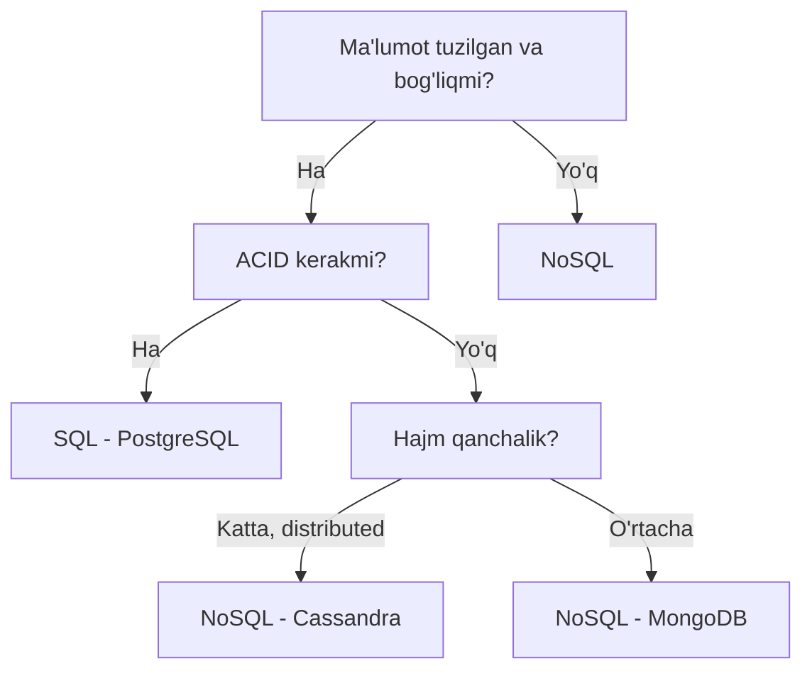

# SQL vs NoSQL

## Asosiy Farq



---

## SQL (Relational DB)

**Misollar:** PostgreSQL, MySQL, SQLite

### Xususiyatlari
- Jadvallar va ustunlar (rows & columns)
- ACID kafolatlari
- SQL tili
- Qattiq schema (schema kerak)
- Join orqali bog'liq ma'lumotlar

### ACID



### Qachon SQL?
- Murakkab bog'liqliklar (relations)
- Tranzaksiyalar muhim (bank, e-commerce)
- Ma'lumot yaxlitligi zarur
- ACID kerak

---

## NoSQL

**Turlari:**



### Key-Value
```
key: "user:123"
value: { name: "Ali", age: 25 }

Foydalanish: kesh, sessiya, real-time leaderboard
```

### Document
```json
{
  "_id": "123",
  "name": "Ali",
  "address": {
    "city": "Toshkent",
    "zip": "100000"
  },
  "orders": [
    { "id": 1, "amount": 50000 }
  ]
}
```
Foydalanish: CMS, katalog, foydalanuvchi profillari

### Wide-Column (Cassandra)
```
Row Key: "user_events:123:2024"
Columns: event_1, event_2, event_3, ...

Foydalanish: time-series, analytics, IoT
```

### Graph (Neo4j)
```
(Ali)-[:FRIENDS_WITH]->(Vali)
(Ali)-[:LIKES]->(Post)

Foydalanish: ijtimoiy tarmoq, tavsiya tizimi
```

---

## Taqqoslash Jadvali

| | SQL | NoSQL |
|--|-----|-------|
| **Schema** | Qattiq | Moslashuvchan |
| **Scalability** | Vertical (asosan) | Horizontal |
| **ACID** | ✅ To'liq | ⚠️ Qisman |
| **Join** | ✅ Oson | ❌ Murakkab |
| **Performance** | O'rtacha | Juda tez (read/write) |
| **Ma'lumot tuzi** | Tuzilgan | Har qanday |
| **Misol** | Bank, ERP | Netflix, Twitter |

---

## CAP bilan bog'liq tanlov



---

## Go'da PostgreSQL

```go
package main

import (
    "database/sql"
    "fmt"
    _ "github.com/lib/pq"
)

type User struct {
    ID    int
    Name  string
    Email string
}

func getUser(db *sql.DB, id int) (*User, error) {
    var u User
    err := db.QueryRow(
        "SELECT id, name, email FROM users WHERE id = $1", id,
    ).Scan(&u.ID, &u.Name, &u.Email)
    if err != nil {
        return nil, err
    }
    return &u, nil
}
```

## Go'da MongoDB

```go
package main

import (
    "context"
    "go.mongodb.org/mongo-driver/bson"
    "go.mongodb.org/mongo-driver/mongo"
)

type User struct {
    ID    string `bson:"_id"`
    Name  string `bson:"name"`
    Email string `bson:"email"`
}

func getUser(coll *mongo.Collection, id string) (*User, error) {
    var u User
    err := coll.FindOne(
        context.Background(),
        bson.M{"_id": id},
    ).Decode(&u)
    return &u, err
}
```

---

## Qaysi Birini Tanlash?



---

## Keyingi Qadam

→ [2. CAP Theorem.md](2.%20CAP%20Theorem.md)
